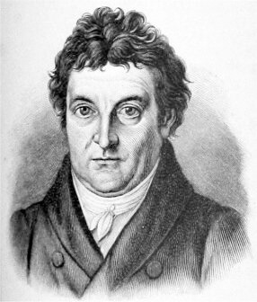

### Elbląg

Przedostatni dzień walk o Elbląg.

Właśnie dziś w okolicach Elblągu NKWD aresztowało dziś Aleksandra Sołżenicyna, wówczas był zwykłym kapitanem artylerii Armii Czerwonej. Przyczyną aresztowania był list do przyjaciela, w którym krytykował Stalina i sposób prowadzenia wojny.

### U 864

U wybrzeży Norwegii brytyjski HMS Venturer storpedował i zatopił niemiecki U-864. Jest to jedyny znany przypadek w historii zatopienia zanurzonego okrętu podwodnego przez inny zanurzony okręt podwodny.

Niemiecki okręt wykonywał tajną operację o kryptonimie Ceasar, był to priorytetowy transport niemieckiej techniki wojennej do Japonii. Japończyków szczególnie interesowały silniki odrzutowe i zapalniki. Dlatego na pokładzie było kilku naukowców niemieckich i japońskich. Inżynierowie Messerschmitta: Rolf von Chlingensperg i Riclef Schomerus oraz dwaj Japończycy Toshio Nakai specjalista od paliw i Tadao Yamoto od torped.

Zatopienie nie było przypadkiem. Brytyjczycy wiedzieli o operacji Ceasar z dekryptażu Enigmy i za wszelką cenę chcieli zatrzymać transfer technologii do Japonii.

W ładowni znajdował się m in Me 163B Komet. Wiosną 1944 Japończycy kupili licencję na ten samolot za niebagatelną kwotę 20 mln RM. W umowie było dostarczenie kompletnego samolotu, dokumentacji i trzech silników. Pierwsza próba transportu odbyła się na pokładzie japońskiego okrętu RO-501, który opuścił Kilonię 30 marca 1944 i 13 maja został zatopiony na Atlantyku przez USS Bogue.

Mimo niepowodzeń Japończycy kontynuowali pracę nad swoją wersją Kometa - Mitsubishi J8M Shūsui (Ki-200) (pl. "jesienna woda" poetyckie określenie zimnej stali). Podczas oblotu rakietowego myśliwca silnik przestał działać, samolot się rozbił, a pilot zginął. Przystąpiono do produkcji seryjnej i wyprodukowano 7 tych samolotów. Nie wzięły udziału w wojnie. Jeden wpadł w ręce US Army i został wywieziony do USA.

<SeeAlso txt="Broń podczas wojny na Pacyfiku" url="/festung-breslau/article/pacyfik-bron" />

- War Stories with Mark Felton ["Submarine vs. U-Boat - WW2's Only Underwater Duel" [YT 10:19]](https://www.youtube.com/watch?v=Tzq2zjjiup4)
- Dark Docs ["The Only Time a Submarine Destroyed Another Submarine Underwater" [YT 15:31]](https://www.youtube.com/watch?v=yff6I-Ou-jw)

### Jałta

Szósty dzień Konferencji Jałtańskiej.

### Reichsbank

W Berlinie dyrekcji Reichsbanku, pod kierownictwem Waltera Funka w pośpiechu i improwizując, udało się sformować pierwszy transport skarbów. Najcenniejszy w historii Deutsche Reichsbahn skład 13 wagonów ze złotem o łącznej wartości 200 mln dolarów wyruszy dopiero pojutrze, ale dziś również w największej tajemnicy wywożone są zasoby pieniężne. Cel: zamknięta kopalnia soli potasowej Kaiserode k. Merkers (Turyngia). 400 km pod czujnym okiem wroga, tylko w nocy z zachowaniem najściślejszej tajemnicy. Pieniądze udało się dowieźć, czy tak samo uda się ze złotem?

Tutaj trzeba wyjaśnić, że intensywna polityka gospodarcza hitlerowskich Niemiec nie pozwalała na tezauryzację. Wszystko szło na zbrojenia i propagandowe projekty socjalne. III Rzesza tonęła w długach a zasoby, jakie posiadała, pochodziły z kradzieży albo były obcymi depozytami.

Temu właśnie służyła wojna. Przyłączenie Austrii było równoznaczne z konsumpcją jej zasobów. Sudetenland, a potem Czechosłowacja wpadły w ręce nazistów z ogromnym zyskiem dla Reichsbanku. Podczas wojny okradli Belgię i Holandię. Reichsbank zatem posiadał ogromny majątek, ale albo były to cudze pieniądze, albo ukradzione, dlatego mówi się o tym Raubgold (pl. kradzione złoto). Do eksploatacji polskich zasobów bankowych służył Dresdner Bank, który był nieoficjalnym bankiem SS.

Polskie złoto im się wymknęło. Wojnę przegraliśmy z kretesem, ale skarb państwa udało się uratować. Część zasługi przypada rządowi rumuńskiemu, który był pod presją hitlerowców, ale Polaków okraść nie dał.

- Mark Felton Productions ["Ribbentrop's Gold - Hunting Missing Nazi Treasure" [YT 8:53]](https://www.youtube.com/watch?v=6HUYoLIVxs8)
- [Skarby III Rzeszy](https://wiadomosci.onet.pl/kiosk/skarby-iii-rzeszy/mw1lc)

### KL Gros-Rosen

Ewakuacja KL Gros-Rosen. Z obozu wychodzi ostatnia kolumna.

### Przyczółek malczycki

Opracowane na podstawie: Primke, Szczerepa "Kierunek Festung Breslau":

Jeszcze w nocy z 8 na 9 lutego 22 Korpus Strzelecki przystąpił do szturmu na Legnicę. 9 lutego Legnicę atakowały pułki z trzech kierunków i do końca dnia okopały się na rubieży 100 m od Dworca i dalej na południe mniej więcej wzdłuż Kaczawy. W rejonie Dworca korzystając z naturalnej przeszkody w postaci Kaczawy i pobliskich budynków przemysłowych Niemcy utworzyli silny bastion.

Pomimo tego, że połowa Legnicy była wciąż w rękach niemieckich raport bojowy 309 Dywizji Strzeleckiej z godzin popołudniowych 10 lutego (czyli czasu kiedy Legnica rzeczywiście była zajęta):
>Oddziały dywizji, przełamując silny opór ogniowy przeciwnika, kontynuowały natarcie, likwidując go i biorąc do niewoli. Do godz. 19.00 9 lutego 1945 roku zdobyły Legnicę.

Grupa Armii Środek donosi tego dnia o upadku Legnicy i przechwyceniu przez Armię Czerwoną 25-km odcinka autostrady.
 
Tymczasem na lewej flance natarcia 74 Korpus Strzelecki atakował w kierunku na Lasowice - Wilczków - Środa Śląska i napotykał gdzieniegdzie opór opóźniający. Jednym z takich miejsc był Wilczków, jak wspomina Ernst Leistritz:
>niemieccy cywile musieli pogrzebać 27 mężczyzn należących do Volkssturmu. Rosjanie zamordowali ich strzałami w tył głowy.

Wszystkie wycofujące się oddziały grupy bojowej Sachsenheimer kierowały się na Środę Śląską. Dlatego tam 74 Korpus natknął się na przygotowaną naprędce, ale silną rubież obrony na linii pałac na płd-zach od Środy Śląskiej, majątek na wschód i wschodnia część Szczepanowa.

359 Dywizja Strzelecka nacierała na południe od Środy Śląskiej na linii Ciechów - Chwalimierz - Lutynia. 9 lutego dotarł do Ciechowa i granic Chwalimierza. Ostatecznie na koniec dnia Korpus zajął linię w przybliżeniu Lipnica - Rościsławice.

Komunikat operacyjny 74 Korpusu Strzeleckiego z godz. 2200 9 lutego stwierdza, że Korpus dotarł do linii Michałów - Ciechów - majątek na zachodnim skraju Środy Śląskiej - Raszków (obecnie zachodnia część Szczepanowa). Południowa część Korpusu zajęła wsie Polanka i Biernatki.

Po tym, jak główne siły 7 korpusu Zmechanizowanego Gwardii dotarły do autostrady, jego dowódca rzucił na autostradę z rezerwy Korpusu 57 Brygadę Pancerną Gwardii, która w nocy korzystając z ciemności, przedarła się do Kątów Wrocławskich. Mijające ich, jadące na zachód transporty niemieckie były meldowane i przechwytywane. Niemcy nie byli zdziwieni, widząc czołgi na autostradzie. Uznali, że to niemieckie wsparcie, którego jak się zaraz okaże, oczekiwali. Bez obaw wjeżdżali w pułapkę, meldunki niedwuznacznie wskazują, że ich natychmiast rozstrzeliwano.

Reszta Korpusu w nocy stoczyła zwycięską batalię o Wądroże Wielkie i do godz. 0700 wysunęła się na rubież Pichorowice - Piersno. Jest to 13 km na zachód od Kątów Wrocławskich.

Gertruda Deutschmann z Pichorowic:
>Gwałty zaczęły się od razu po wkroczeniu Rosjan i Polaków. Dwie córki Roberta Schimpke i ich koleżanka zostały zgwałcone, a potem zastrzelone. 13-letnia uczennica Gilner także nie została oszczędzona. Moja szwagierka Agnes D. i pani M. zostały zgwałcone na oczach swoich niepełnoletnich dzieci.

Za 57 Brygadą Pancerną dowództwo Korpusu wysłało 26 Brygadę Pancerną. Kątów Wrocławskich bronił Volkssturm, był to gł. Batalion Hecht i żandarmeria. Do 1700 lub 1730 Kąty Wrocławskie zostały zdobyte. Do godz. 1800 uchwycono także przeprawy na Bystrzycy od Sadowic do Skałki.

Breslauer Apokalypse:
>9 lutego 1945 r. Rosjanie zdobyli nasze miasto. Teraz rozpoczęło się plądrowanie sklepów, cały towar w tym żywność, został wyrzucony na ulicę, szyby wystawowe porozbijano. Żołnierze rosyjscy przetrząsali mieszkania w poszukiwaniu niemieckich żołnierzy, wódki i kobiet. My musieliśmy dla nich gotować, oni godzinami pozostawali w naszych domach, oczywiście pijani, jednak nie byliśmy jeszcze zaczepiani, jeszcze nic nam nie odbierano.

G.F., mieszkanka Kątów Wrocławskich została zgwałcona przez 12 Rosjan już pierwszej nocy:
>Chciałam się powiesić, ale nie miałam sposobności, gdyż Rosjanie ciągle wchodzili i wychodzili z domu.

Ksiądz został zastrzelony po tym, jak stanął w obronie siedmiu zakonnic.

Anonimowa mieszkanka Bogdaszowic:
>9 lutego wkroczyli Rosjanie. Kiedy zobaczyli mojego 21-letniego syna w mieszkaniu, myśleli że jest on żołnierzem. Zostaliśmy wywleczeni z domu przed drzwi od stodoły, gdzie mieliśmy zostać zastrzeleni. Jednak do tego nie doszło. Zostałam znowu wygnana z domu do chlewa. Tam zgwałciło mnie 25 Rosjan. Mojego syna wywieziono, rozchorował się i z powodu niedożywienia umarł. Clemens Scholz został zastrzelony, bo chciał bronić swoje córki. Ten sam los spotkał Paula Grandura. Johann Ruppelt został zastrzelony, ponieważ podobno trzymał w domu amunicję. Pani Niedergesäß została zastrzelona, ponieważ chciała zapobiec splądrowaniu swojego mieszkania.

7 Korpus wypełnił swoje zadanie. Dotarł do Kątów Wrocławskich w planowanym czasie. To tu miał spotkać nacierającą ze wschodu awangardę 5 Armii. 9 lutego Kątach Wrocławskich miało zostać zamknięte oblężenie Wrocławia. 5 Armii jednak nie było. Co prawda ze wschodu dochodziły odgłosy walki, ale radiowcy nie mogli uzyskać połączenia.

To nie koniec złych wieści tego dnia. Przechwycone dokumenty i zeznania schwytanych jeńców wyraźnie wskazywały, że uzyskaną na autostradzie pozycję sowiecką będą atakować dwie niemieckie dywizje pancerne:

- 19 Dywizja Pancerna generała Hansa Källnera z zadaniem odblokowania autostrady i odbicia Legnicy
- 8 Dywizja Pancerna generała Heinricha Georga Haxa, przerzucona z rejonu Raciborza w okolice Strzegomia i Jawora (wg innych źródeł Kostomłotów)

W tej sytuacji 7 Korpus musiał nie tylko oczekiwać na spóźnioną 5 Armię, ale szykować się do trudnego boju z dobrze zorganizowanym i uzbrojonym przeciwnikiem. 24 Brygada Zmechanizowana Gwardii zajęła rubież na linii Jarostów - Pielaszkowice - Jarosław - Kostomłoty. Bardziej na wschód na linii Kostomłoty - Kąty Wrocławskie była 26 Brygada Zmechanizowana Gwardii. Skrajną, wschodnią pozycję w rejonie Kątów Wrocławskich zajmowały dwie Brygady: 25 i 57.

5 Armia była jakieś 20 km na wschód. Dla wzmocnienia tego wąskiego korytarza Niemcy rzucili 20 Dywizję Pancerną, 245 i 269 DP oraz grupy Volkssturmu. Ostateczna batalia o zamknięcie Wrocławia stoczy się na drodze Bielany Wrocławskie - Cieszyce.

Co gorsza, od początku operacji Armia Czerwona wykonywała swoje zadania pod czujnym okiem Luftwaffe, która regularnie i intensywnie patrolowała ten obszar.

Z drugiej strony z jakiegoś powodu nie mogła liczyć, nie tylko na ochronę przed obserwacją, ale nawet na własny zwiad lotniczy. Być może stąd to nieustanne "branie języka", swoiste polowanie na oficerów i aktywny, czasem bardzo ryzykowny zwiad na stronę nieprzyjaciela.

### Wrocław

9 lutego, piątkowe wydanie "Schlesische Tageszeitung" przedrukowuje długi rozkaz komendanta, który bardziej jest apelem skierowanym do Wehrmachtu i Volkssturmu, ale - ponieważ wszyscy we Wrocławiu są też na froncie - również cywilów. Von Ahlfen pisze:
>Po schorowanym i zasłużonym oficerze, jakim był generał Krause, przejąłem na rozkaz najwyższych władz dowództwo nad Twierdzą Wrocław.

a później
>apeluje do "poczucia honoru i obowiązku każdego pojedynczego członka Wehrmachtu" żeby sprzeciwić się "starej niemieckiej przywarze i skłonności do biurokratycznego załatwiania procedury papierkowej, która natychmiast musi być przezwyciężona.

i nakazuje, żeby
>W nieugiętości i silnej wierze nie dać się wprowadzić w błąd przez niepomyślne wiadomości na temat sytuacji i przez działania wroga.

i nie należy pytać, czy wykonanie zadania grozi śmiercią tylko
>Jak wypełnię zadanie, które zostało mi powierzone, albo które ze względu na sytuację, sam przed sobą postawiłem?

na zakończenie przywołuje cytat z Fichtego
>Musisz wierzyć w przyszłość Niemiec, w zmartwychwstanie swojego narodu. Nie daj zrabować sobie tej wiary, mimo tego co się wydarzy. A postępować powinieneś tak, jakby jedynie od ciebie i twojego działania zależała cała przyszłość, a odpowiedzialność za nią była twoim udziałem!

### Johann Gottlieb Fichte

Johann Gottlieb Fichte był filozofem niemieckiego idealizmu, który żył w przełomowej epoce Rewolucji Francuskiej i wojen napoleońskich. Początkowo zwolennik francuskich idei demokracji i wolności. Później na skutek działań wojennych Napoleona i brutalności nowych rządów rozczarowany uznał, że to Niemcy stworzą nową epokę w dziejach ludzkości i w Niemczech, które wówczas były pod okupacją francuską był bardzo aktywny politycznie. Jego pisma i mowy tworzyły od podstaw niemiecki nacjonalizm, którego źródeł szukał jeszcze w czasach Tacyta wychwalającego Germanów w swoich Annales.

Umarł w 1814 zapewne szczęśliwy, bo pomiędzy Bitwą Narodów pod Lipskiem a zdobyciem Paryża, widząc nieunikniony koniec epoki bonapartyzmu. Złowieszczo brzmią w końcu wojny zwłaszcza jego uwagi na temat Żydów, bo jak twierdzi danie im pełnego obywatelstwa niemieckiego, zaszkodzi narodowi niemieckiemu, a prawa obywatelskie mogą otrzymać, tylko jeśli będzie można:
>jednej nocy ściąć im wszystkim głowy i natychmiast osadzić nowe niezawierające ani jednej żydowskiej idei.

*Johann Gottlieb Fichte (1762-1814) 
Źródło: Wikipedia Gemeinfrei, [Link](https://commons.wikimedia.org/w/index.php?curid=223061)*

Czy byłby szczęśliwy, widząc, jak wyglądała przyszłość Niemiec 130 lat później? Tego nie wiemy, wiemy jednak, jak szło przezwyciężanie "*skłonności do biurokratycznego załatwiania procedury papierkowej*", otóż udało się to znakomicie, bo dotychczasowy system sprawiedliwości, jeszcze przedhitlerowski, zawarty w słynnej na cały świat nadziei, iż "*Es giebt noch Richter in Berlin*" zamienił się w siekącą na wszystkie strony krwawą machinę zbrodni.

### Terror

Jej działanie obciąża głównie Gauleitera Hanke, bo von Ahlfen był zajęty organizowaniem obrony miasta, ale sam również ponosi odpowiedzialność, ponieważ nie tylko nic nie zrobił, by ją zatrzymać, ale nawet nie podejmuje się jej krytyki w swoich wspomnieniach. Hanke, partyjny bonza, prowadził we Wrocławiu życie zastępcze, bo został tu zesłany. Całą jego biografia zostanie przedstawiona później. Warta jest szczegółowego opisu, nie tylko dlatego, że Hanke jest ważny w tej opowieści, ale historia jego kariery mówi wiele o działaniu systemów autorytarnych.

Karanie śmiercią nawet podejrzenia o tchórzostwo i zabijanie ludzi dla postrachu doprowadziło do sytuacji rodem z horrorów, a kiedy szaleństwo staje się normą, nową szansę dostają wariaci. Maria Langner skazana na cztery lata ciężkiego więzienia za udzielenie pomocy w dezercji kapitanowi-lekarzowi Luftwaffe Walterowi Heisingowi była jedną z pierwszych więźniarek nowego więzienia Gestapo urządzonego w dawnym areszcie śledczym przy ul. Sądowej i dzięki temu dostała funkcję kalifaktorki (roznosiła posiłki) pisze we wspomnieniach z końca stycznia:
>Wachmistrz znowu otwiera jakieś drzwi. W celi umieszczono pięciu chłopców w wieku szesnastu czy siedemnastu lat. Plądrowali, powiada Heini. [...] W innej celi leży na pryczy młoda matka pochylona nad dzieckiem, które stara się ogrzać własnym ciałem. Drzwi do celi pozostają otwarte, gdyż posłano Heiniego po kromkę chleba. Matka chciałaby przeżuć chleb i nakarmić nim dziecko, które od trzech dni nie dostaje innego pożywienia. Opowiada, że zwabiła ją tu jakaś nieznajoma kobieta pod pozorem, że mąż, który jest żołnierzem, pragnie się z nią zobaczyć. Zabrała ze sobą dziecko, gdyż mąż od roku nie miał urlopu i dziecka jeszcze nie znał. Nieznajoma podała w Gestapo, że młoda kobieta wypowiadała niewłaściwe, ostre uwagi na temat Hitlera. Dopiero po wielu dniach, gdy ta sama kobieta znów próbowała kogoś zwabić w ten sposób do Gestapo, okazało się, że młoda kobieta padła ofiara obłąkanej członkini NSDAP.

A kilka dni później, już na początku lutego Maria pisze:
>Jeżeli osoba cywilna przywłaszczy sobie w twierdzy cokolwiek z rzeczy leżących masowo dookoła, nazywa się to plądrowaniem. Jeżeli ktoś podniesie na ulicy coś, co jest mu nieodzownie potrzebne, a w szóstym roku wojny potrzebne jest prawie wszystko - jego los jest przesądzony. "Pięciu młodocianych przestępców rozstrzelano za plądrowanie" - brzmi pierwsze urzędowe ogłoszenie o wykonanych wyrokach śmierci, zamieszczone w gazecie wychodzącej w twierdzy; ilość dokonanych egzekucji będzie zapewne mniejsza w komunikacie, który dotrze do prasy. Byli to właśnie ci chłopcy, których widziałam w pierwszym tygodniu podczas rozdawania posiłków, pięciu wyrostków, z których najstarszy liczył może siedemnaście lat. Włamali się do kajuty opuszczonej barki na Odrze, znaleźli tam tytoń i wino, zabawiali się w Ali-Babę i czterdziestu rozbójników i z zapasów widocznie zgromadzonych przez zbiegłego właściciela urządzili sobie prawdziwą ucztę piratów...

Hugo Hartung:
>W południe strażnik trzymający wartę na dachu lotniska krzyczy, że widział na autostradzie dużo sowieckich czołgów. Jeżeli to prawda, to wkrótce będziemy okrążeni. [...] zostajemy oddelegowani na pozycje wokół lotniska, gdzie, choć nic się nie dzieje, czuwamy od południa do nocy. Niebo nad miastem przez całą noc jest jasne od bomb oświetlających i amunicji smugowej.

### Amerikabomber / Ju-390

Jedną z obsesji Hitlera było zaatakowanie Nowego Jorku. Amerykanie bowiem mogli wysłać wojsko do Wielkiej Brytanii i stamtąd zaatakować okupowany przez Niemców kontynent. Sami jednak byli poza zasięgiem zarówno wojsk japońskich, jak i niemieckich. Cios wymierzony w Nowy Jork przynajmniej symbolicznie wymazywałby tę nierówność.

Jednym ze sposobów na zaatakowanie Ameryki było skonstruowanie bombowców o odpowiednio dużym zasięgu. Nie było to aż tak bardzo niemożliwe, planowano bowiem wykorzystać przyjazne niebo Hiszpanii i międzylądowanie na Azorach. Stamtąd jest ok. 4 tys. km w jedną stronę do Nowego Jorku. Brano również pod uwagę skierowanie bombowców do lądowania w którymś z zaprzyjaźnionych krajów Ameryki Południowej.

Budowę dalekosiężnego bombowca rozważano od 1938, ale dopiero na początku 1942 po wypowiedzeniu wojny USA Ministerstwom Lotnictwa (niem. Reichsluftfahrtministerium) opracowało program takiego samolotu. Wszystkie okazały się zbyt drogie, skomplikowane i zawodne. Ostatecznie zarzucono konstruowanie bombowców i zatrzymano wszystkie programy rozwojowe 3 lipca 1944 na rzecz awaryjnego projektu myśliwca (niem. Jägernotprogramm).

Z 4 projektów, które w ogóle mogły się ubiegać o taką misję, najbardziej zaawansowany był Ju-390, którego pierwszy prototyp został oblatany we wrześniu 1944. Jego docelowy zasięg obliczano na (zależnie od obciążenia) 8 do 10 tys. km.

Drugi prototyp (Ju 390 V2) przeznaczony do zwiadu morskiego był wyposażony w radar FuG 200 Hohentwiel opracowany przez berliński C. Lorenz AG. Konstruktor samolotu profesor Heinrich Hertel 26 września 1945 zeznał Brytyjczykom, że nigdy nie został ukończony.

Ale podporucznik Joachim Eisermann zapisał w dzienniku pokładowym, że dziś w bazie lotniczej Rechlin odbył 50-minutowy lot tym samolotem, wykonując kilka okrążeń, a potem 20-minutowy lot na lotnisko w Lärz. Jednak inne świadectwa mówią, że drugi prototyp nigdy nie latał.

<SeeAlso txt="Wunderwaffe" url="/festung-breslau/article/wunderwaffe" />

Inne samoloty (wszystkie tłokowe), które określano tym mianem to:

- Focke-Wulf Ta 400: anulowany już w październiku 1943. Na bazie Focke-Wulf Fw 200. Miał być wyposażony m.in. w silniki odrzutowe Jumo 004. Powstał tylko drewniany model do badań aerodynamicznych.
- Heinkel He 277: na bazie He 177. Budowany od 1941, zbudowano kilka prototypów, trzy latały.
- Messerschmitt Me 264: dwa prototypy, żaden nie latał.

Tak się składa, że nawet Amerykanie nie zbudowali Amerikabomber, choć byli bliżej tego celu niż Niemcy. Ich najpotężniejszy bombowiec B-29 miał zasięg 9 tys. km. Odległość NY - Berlin to 6,5 tys. km. A skoro o tym... kiedy wysyłali B-29 do Chin całkiem "przypadkowo" na postoju w Anglii pozwolili je Niemcom podejrzeć, żeby napędzić im stracha. B-29 nigdy jednak nie zostały użyte w Europie. Ich zasięg był potrzebny na Pacyfiku, a na Europę były za drogie.

- Mark Felton Productions ["B-29 Superfortress Operation Against Germany" [YT 10:54]](https://www.youtube.com/watch?v=RKgQBpP5kVs)
