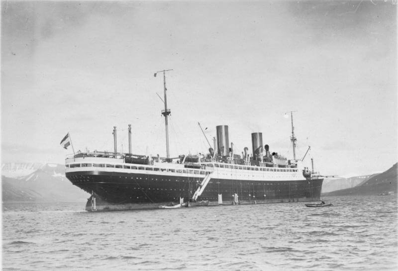

### Jałta

Siódmy, przedostatni dzień Konferencji Jałtańskiej. Jutro podsumowanie.

### Richard Bong

FBTODO

- Dark Skies ["The Pilot Who Blew Up a Crocodile - Major Dick Bong - Ace of Aces" [YT 10:11]](https://www.youtube.com/watch?v=E-vXdL9CaE4)
- [Richard Bong](https://en.wikipedia.org/wiki/Richard_Bong)

### Louis Edward Curdes

Jedno z najdziwniejszych zestrzeleń tej wojny. Uszczęśliwiło wszystkich, także ofiary. Curdes miał oryginalny przebieg służby, zestrzelił już samoloty niemieckie, jeden włoski (w Europie latał na Lockheed P-38 Lightning), a 7 lutego rano dołączył do kolekcji japoński (na Pacyfiku latał na P-51 Mustang). Full Axis Set.

Dziś jego eskadra miała skomplikowaną misję odnalezienia tajnego japońskiego lotniska polowego gdzieś na południu Tajwanu. Nie znaleźli. Wracając Curdes, rozdzielił eskadrę nad wyspą Batan. Jego koledzy znaleźli lotnisko i wezwali pomoc. Podczas ataku jeden z nich, La Croix, został zestrzelony, ale szczęśliwie wylądował w morzu i ewakuował się z tonącego samolotu. Upewniając się co do jego losu, Curdes zauważył coś dziwnego. Inny samolot, który początkowo wziął za japońską kopię Douglasa C-47. Kiedy się zbliżył, doznał intensywnych, ambiwalentnych uczuć. To był prawdziwy amerykański C-47, który jednak zmierzał wprost na nieprzyjacielskie lotnisko.

C-47 to tzw. Dakota, wojskowa wersja znanego i najbardziej popularnego w USA samolotu transportowego Douglas DC-3. Ogółem zbudowano ich ponad 10 tys.

Ambiwalencja uczuć wynikała z tego, że wiedział, co ma robić i jak bardzo nie chciał tego zrobić. Musiał bowiem uznać, że jest to porwany samolot w rękach nieprzyjaciela i on musi teraz go zestrzelić. Próbował się skontaktować z jego załogą, ale nie było odpowiedzi. Nie wiedział, że mają zepsute radio. Strzelał do C-47 tak, żeby nie zabić ludzi, najpierw w jeden potem w drugi silnik. Samolot wodował, wszyscy na pokładzie zdążyli się ewakuować do łodzi ratunkowej. Spędzili całą noc na morzu z rekinami.

Rankiem następnego dnia Curdes wrócił na to samo miejsce z wodnosamolotem i wszystkich podjęli. Jakież było jego zdziwienie, kiedy okazało się, że w samolocie byli Amerykanie, a lecieli w kierunku nieprzyjacielskiego lotniska, bo z powodu awarii zgubili się. Co więcej, na pokładzie samolotu, a potem łodzi ratunkowej była jego znajoma, z którą przetańczył poprzednią noc. Swietłana Waleria Szostakowicz - tak, siostrzenica tego Szostakowicza. Wzięli ślub i żyli długo i szczęśliwie. Nie żartuję. Tak było.

Curdes miał honor dodać do zestrzeleń także amerykański samolot, więc na samolocie miał także amerykańską flagę. Uprzedzając pytanie: nie, brytyjskiego nie zestrzelił.

- [Louis Edward Curdes](https://en.wikipedia.org/wiki/Louis_Edward_Curdes)
- [Simple History "This U.S. Pilot shot Down an American plane and got the Kill, Why?" [10:26]](https://www.youtube.com/watch?v=CLUVdyk8Y7s)

### Las Hürtgen

Zakończyła się bitwa o las Hürtgen. Najcięższy bój, jaki przyszło stoczyć na froncie zachodnim. Był to rejon umocniony, część Linii Zygfryda, walki ciągnęły się tu od połowy września i po każdej ze stron było ok. 30 tys. zabitych i rannych.

- DW Documentary ["Hürtgen forest and the end of World War II | Free Full DW Documentary" [YT 42:26]](https://www.youtube.com/watch?v=tT0ob3cHPmE)
- Dark Docs ["The Longest Battle Ever Ever Fought by the US Army - Hürtgen Forest" [YT 10:26]](https://www.youtube.com/watch?v=XLtwqX9iQ5U)
- Mark Felton Productions ["Hürtgen 1944 - America's Meat Grinder" [YT 9:39]](https://www.youtube.com/watch?v=mAmJUyHloTk)

### SS Steuben

Sowiecki okręt podwodny S-13 pod dowództwem komandora ppor. Aleksandra Iwanowicza Marinesko, ten sam który 30 stycznia zatopił Gustloffa, wczoraj 9 lutego o 2015 dostrzegł łunę i w wynurzeniu skierował się na nią. Szumonamiernik wkrótce potwierdził, że są to statki i mając namiar, resztę drogi przebył w zanurzeniu. U celu wynurzył się i zidentyfikowano cel jako krążownik lekki Emden i 2 niszczyciele. 10 lutego o godzinie 0052, w środku nocy, odpala dwie torpedy. Druga torpeda trafia w śródokręcie, eksploduje kotłownia. Statek tonie w ciągu kilku minut.

Ofiarą nie jest krążownik, to kolejny transportowiec z uciekinierami z Prus Wschodnich do Świnoujścia. Jest to parowiec SS Steuben, który 9 lutego wyszedł z portu w oblężonej Piławie (obecnie Bałtyjsk, niem. Pilau). Płynął bez zaciemnienia. Musiał być widoczny jak choinka. Nie był przy tym oznaczony jako statek cywilny i płynął pod eskortą. Był więc tak samo, jak Gustloff legalnym celem marynarki wojenne. Większość uciekinierów to byli oficerowie SS z rodzinami i kadeci marynarki wojennej. Statek zatonął w siedem minut po trafieniu, na północ od Ławicy Słupskiej. Liczbę ofiar szacuje się na od 4 do 6 tys. ludzi. Okręt eskorty T-196 uratował 300 ludzi, połowę z tego to byli żołnierze. Duża liczba ofiar to wynik eksplozji kotłów, błyskawicznego zatonięcia statku i zimy, żurawiki od łodzi ratunkowych były zamarznięte.

W ten sposób na każdego członka załogi okrętu kapitana Marinesko wypada ponad 250 zabitych Niemców, prawdopodobnie są to, biorąc to kryterium pod uwagę, najbardziej efektywni żołnierze Armii Czerwonej.

Zbudowany w latach 1922-23 w szczecińskiej stoczni Vulcan dla Norddeutscher Lloyd (NDL) z Bremy jako SS München. W 1931 po poważnym pożarze w Nowym Yorku został wyremontowany i zmodernizowany jako nowoczesny statek wycieczkowy. Zmieniono mu wtedy nazwę na General von Steuben (od Friedricha Wilhelma von Steubena, pruskiego żołnierza walczącego w wojnie o niepodległość USA). Potem nazwę skrócono do Steuben. Mógł zabierać prawie 800 pasażerów, miał elegancką salę balową. Jego bliźniacza jednostka SS Stuttgart była czarterowana przez hitlerowską organizację Niemiecki Front Pracy (niem. Deutsche Arbeitsfront) i pływała we flocie KdF. Po wybuchu wojny Steuben został zmobilizowany i służył do transportu wojska. W 1940 tak samo, jak Wilhelm Gustloff został zamieniony w pływające koszary dla podwodniaków, z tą różnicą, że był zacumowany w Piławie.

Pod koniec 1944 zaczął być używany jako jednostka szpitalna do ewakuacji. Zamontowano kilka dział plot. Naturalną koleją rzeczy stał się jednym z ważniejszych transportowców Operacji Hannibal. Załadunek do ostatniego, jak się okazało, rejsu, zaczęto 1 lutego. Na początku na pokład weszło 2800 rannych żołnierzy, 100 żołnierzy ewakuowanych z innych przyczyn, 270 osób personelu medycznego Kriegsmarine, potem cywile. Cywilna załoga statku to 160 marynarzy, do tego 64 marynarzy Kriegsmarine (gł. obsługa armat plot). Oficjalnie statek miał na pokładzie 4267 osób, ale rzeczywista liczba mogła sięgać nawet 6 tys.

Do eskorty wyznaczono to, co było na miejscu: ex-niszczyciel okręt szkolny T-196 i poławiacz torped TF-10. Żaden z nich nie nadawał się do walki z okrętami podwodnymi.

<BoxImageWrapper>

SS Steuben 
SS w tym wypadku to Steam Ship - czyli parowiec 
Źródło: By Bundesarchiv, N 1572 Bild-1925-079 / Fleischhut, Richard / CC-BY-SA 3.0, [CC BY-SA 3.0 de](https://creativecommons.org/licenses/by-sa/3.0/de/deed.en), [Link](https://commons.wikimedia.org/w/index.php?curid=5441282)
</BoxImageWrapper>

### 3 Front Białoruski

Armia Czerwona zajęła Bagrationowsk (Iławkę) 30 km od Kaliningradu.

### 2 Front Białoruski

2 Front Białoruski: wreszcie po dwóch tygodniach zażartych walk Elbląg, w efekcie walk zniszczony w ponad 90%.

### 1 Front Białoruski

1 Front Białoruski: Mirosławiec.

- Piotr Pawlik ["Wał Pomorski 10 luty 1945 - Mirosławiec" [YT 22:05]](https://www.youtube.com/watch?v=t9fOZ0UzdX8)

### 1 Front Ukraiński

1 Front Ukraiński: Biała, Bielsko, Chojnów, Pszczyna!

### Operacja dolnośląska

Joachim Karsch rzeźbiarz i grafik ekspresjonistyczny dziś w nocy razem z żoną popełnili samobójstwo. Urodził się we Wrocławiu, koleje losu były zmienne. W 1942 dostał bardzo interesujące finansowo zlecenie na kaplicę w Gdyni. W 1943 jego berlińską pracownię zniszczyło bombardowanie, zniszczone też zostały jego rzeźby w siedzibie Verein Berliner Künstler. Kilka dni temu czerwonoarmiści wkroczyli do - leżącego zdawałoby się na uboczu - Grodkowa Wielkiego (sam środek Ziemi Lubuskiej), odkryli jego pracownię i zniszczyli rzeźby, nie wiemy dokładnie, co ich spotkało. Być może państwo Karsch obawiali się deportacji na wschód. Ciała odnaleźli i pogrzebali sąsiedzi. W 2003 syn Florian opracował trzytomowy katalog dzieł ojca.

Po zajęciu Legnicy Armia Czerwona zdobywa Przemków (niem. Primkenau), zatrzymuje się przed Bolesławcem (niem. Bunzlau) i wychodzi na przedpola Nowego Miasteczka (niem. Neustädtel), oznacza to zablokowanie autostrady i zagrożenie dla Głogowa, znajdującego się zaledwie 20 km od Przemkowa i Nowego Miasteczka.

Do Bolesławca wchodzą 54 i 54 Brygady Pancerne Gwardii oraz 23 Brygada Zmechanizowana Gwardii. Wojska pancerne ponoszą duże straty. Dopiero wkroczenie 31 Dywizji Piechoty spowodowało przełamanie i wyparcie hitlerowców z miasta.

### 6 Armia

Opracowane na podstawie: Primke, Szczerepa "Kierunek Festung Breslau":

Zdławiono już wszystkie punkty oporu w Legnicy. Miasto zostało przekazane 52 Armii.

Niemcy trzymają się na południe od Legnicy na linii Gniewomierz - Księginice. W rejonie Gniewomierza i Wrocisławic pojawiły się elementy 18 Dywizji Pancernej. 218 Dywizja Strzelecka uformowała równoległą rubież Bartoszów - Rogoźnik. 309 Dywizja Strzelecka zajęła trójkąt na wschodnim końcu tej rubieży: Rosochata - Komorniki - Wągrodno.

74 Korpus Strzelecki znajduje się na przedpolu Środy Śląskiej. Do zdobycia tego miasta została skierowana 181 Dywizja Strzelecka. Walki nie przyniosły rozstrzygnięcia, koncentrowały się na stacji kolejowej Środa Śląska, która wielokrotnie tego i następnego dnia przechodziła z rąk do rąk.

Na jej prawym skrzydle znajdowała się 359 Dywizja Strzelecka, która otrzymała zadanie dotarcia do rzeki Strzegomki i również go nie wykonała. Walczyła na południe od Środy Śląskiej i szczególnie ciężki bój toczyła o Chwalimierz, gdzie bronił się 200-osobowy oddział składający się ze słuchaczy szkoły podoficerskiej z Pilzna.

Niespodziewanie bardzo do przodu wysunął się 1198 Pułk Strzelecki, który nacierał na linii Kryniczno - Radakowice - Lutynia - Jarnołtów i w końcu dotarł do rubieży Gałów - Gałówek.

273 Dywizja Strzelecka zajęła pozycję Polanka - Dzierżkowice - Biernatki.

### 7 Korpus Zmechanizowany Gwardii

Opracowane na podstawie: Primke, Szczerepa "Kierunek Festung Breslau":

7 Korpus Zmechanizowany Gwardii ulokował sztab w Ujeździe Dolnym. Zachodniego odcinka autostrad, od Budziszowa po Kostomłoty, broniła 24 Brygada Zmechanizowana Gwardii, po jej lewej od Kostomłotów po Kąty Wrocławskie była 26 Brygada.

Tam bez łączności z grupą Sachsenheimera działa grupa bojowa von Loepera bez powodzenia usiłując zepchnąć sowietów z autostrady. Została wzmocniona elementami 19 Dywizji Pancernej, które wzięły udział w walce w rejonie Kępy i Wrocisławic. Szczególnie ciężkie walki toczyły się w Pielaszkowicach i Kostomłotach. Kostomłoty przechodziły z rąk do rąk.

Znajdujące się w Kątach Wrocławskich 25 i 57 Brygady Zmechanizowane Gwardii zostały wysłane na wschód w kierunku 5 Armii sowieckiej. Do południa toczyła się walka o przełamanie pozycji niemieckich na linii Sośnica - Sadowice - Smolec.

Potem 25 Brygada skierowała się w stronę Domasławia i do końca dnia opanowała linię Domasław - Bledzów.

Paul Holz, mieszkaniec Domasławia:
>W międzyczasie 17 niemieckich żołnierzy, którzy się poddali, zostało zastrzelonych koło domów Fremdlinga i Persikoe. Oba domy zostały spalone. Kościół został zniszczony przez czołgi i bomby zrzucane przez samoloty. Około 100 niemieckich rannych, którzy musieli klęczeć na śniegu, zostało zamordowanych strzałem w tył głowy. Ich masowy grób znajduje się za domami Wilde i Paschke.

Satysfakcję czerwonoarmistów wywołało znalezienie zwłok dowódcy SS i Policji na Dolnym Śląsku SS-Obergruppenführera Ernsta Heinricha Schmausera. Pełnił tę funkcję od maja 1941. Organizował mordowanie ludzi w komorach gazowych w KL Auschwitz, i to on wydał rozkaz wymordowania wszystkich pozostawionych w obozie więźniów. SS rozkazu tego nie wykonało, bo ważniejsza była ucieczka. 10 lutego jechał do Wrocławia, w Gniechowicach zwrócono mu uwagę, że sowieckie czołgi już blokują drogę, jednak to zlekceważył.

Natomiast 57 Brygada atakowała w kierunku na Kobierzyce. Na jej drodze pierwsze były Krobielowice, dawna siedziba feldmarszałka Blüchera, słynnego pruskiego pogromcy Napoleona, we Wrocławiu upamiętnionego pomnikiem na placu notabene Blüchera (przedtem i potem Solnym).

Georg Stelzer:
>ludzie z Volkssturmu ze strachu uciekli do stojącej w polu stodoły. Rosjanie zauważyli to i ostrzelali budynek pociskami zapalającymi. Gdy tylko mężczyźni wybiegli ze stodoły, zostali wystrzelani jak króliki.

Podczas zaciętych walk o Wierzbice zostali odepchnięci w stronę Owsianki. Niemcy za wszelką cenę bronili linii kolejowej. Główne natarcie Brygady było skierowane na Kobierzyce. Bój o zdobycie stacji kolejowej Kobierzyce toczył się 8 godzin i zakończył się zwycięstwem sowieckim. Niemcy trzymali się nadal w północnej części Kobierzyc.

Dowódca 7 Korpusu generał Iwan Korczagin skontaktował się telefonicznie z dowódcą 6 Armii generałem Głuzdowskim i wyjaśnił, że jego jednostka znajduje się w trudnej sytuacji. Jest nadmiernie rozciągnięta, od piechoty 6 Armii dzieli ją 20 km, część sił musi się bronić, a pozostała atakować bez żadnego wsparcia. Głuzdowski obiecał ponaglenie 22 Korpusu Strzeleckiego i zobowiązał Korczagina do dalszego ataku w celu nawiązania łączności z 5 Armią Gwardii.

- Trwa walka o zamknięcie Wrocławia w oblężeniu. 7 Korpus Zmechanizowany Gwardii - zaciekłe walki o Kobierzyce, duże straty, wsparcie sił niemieckich przez pociąg pancerny. [Niemiecki pociąg pancerny w Kobierzycach – rejon Festung Breslau.](https://www.facebook.com/bobr1945/posts/3267911579989149)

### Wrocław

Ksiądz Peikert opisuje grozę tego dnia w chaotycznym opisie łączącym informacje o kolejnych wysiedleniach, tym razem ze wschodniej części Wielkiej Wyspy, klęskach w okolicy Wrocławia i wojnie, która stała się już zwyczajną częścią życia miasta, jego głos już przestaje się unosić gniewem, z dnia na dzień przywyka i w rezultacie dostajemy beznamiętną relację zagłady:
>Z południa i południowego wschodu w nocy silny huk dział. Zresztą samoloty nocą względnie oszczędzały miasto. Pierścień oblężenia wokół Wrocławia zamyka się coraz bardziej. Donoszą o płonących wsiach na południe od Wrocławia. Po południu nad miastem ożywione walki powietrzne, które wieczorem znów się wzmagają. Zagraża znowu ciężka noc jak przed 8 dniami. Nadchodzi wiadomość, że Ząbkowice, Ziębice, Jawor, Legnica, Chojnów zostaną oddane. Staatenhalle (Halę państw) przy Hali Stulecia trafiła bomba; hala spłonęła doszczętnie. Sępolno i całe Zalesie na północ od Odry, Zacisze, Biskupin itd. trzeba całkowicie ewakuować. W Parku Szczytnickim ustawia się baterie dział tak, że wspaniały park jest w najwyższym stopniu zagrożony. Mają zburzyć domki letniskowe na Zalesiu i Zaciszu.
