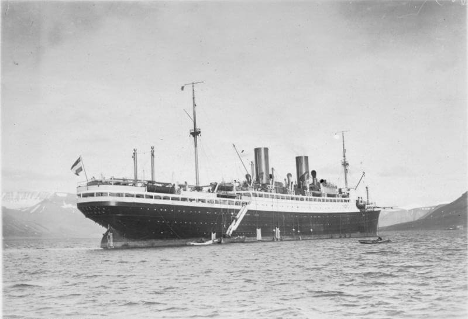

### Las Hürtgen

Zakończyła się bitwa o las Hürtgen. Najcięższy bój, jaki przyszło stoczyć na froncie zachodnim. Był to rejon umocniony, część Linii Zygfryda, walki ciągnęły się tu od połowy września i po każdej ze stron było ok 30 tys zabitych i rannych.

- DW Documentary ["Hürtgen forest and the end of World War II | Free Full DW Documentary" [YT 42:26]](https://www.youtube.com/watch?v=tT0ob3cHPmE)
- Dark Docs ["The Longest Battle Ever Ever Fought by the US Army - Hürtgen Forest" [YT 10:26]](https://www.youtube.com/watch?v=XLtwqX9iQ5U)
- Mark Felton Productions ["Hürtgen 1944 - America's Meat Grinder" [YT 9:39]](https://www.youtube.com/watch?v=mAmJUyHloTk)

### 3 Front Białoruski

Armia Czerwona zajęła Bagrationowsk (Iławkę) 30 km od Kaliningradu.

### 2 Front Białoruski

2 Front Białoruski: wreszcie po dwóch tygodniach zażartych walk Elbląg, w efekcie walk zniszczony w ponad 90%.

### 1 Front Białoruski

1 Front Białoruski: Mirosławiec.

- Piotr Pawlik ["Wał Pomorski 10 luty 1945 - Mirosławiec" [YT 22:05]](https://www.youtube.com/watch?v=t9fOZ0UzdX8)

### 1 Front Ukraiński

1 Front Ukraiński: Biała, Bielsko, Chojnów, Pszczyna!

### SS "Steuben"

Sowiecki okręt podwodny S-13 pod dowództwem komandora ppor. Aleksandra Iwanowicza Marinesko, ten sam który 30 stycznia zatopił Gustloffa, dziś, na samym początku dnia zaledwie 50 minut po północy zatapia kolejny transportowiec z uciekinierami z Prus Wschodnich do Świnoujścia. Jest to parowiec SS "Steuben", który wyszedł z portu w oblężonej 9 lutego.

 Płynął bez zaciemnienia. Musiał być widoczny jak choinka. Nie był przy tym oznaczony jako statek cywilny i płynął pod eskortą. Był więc tak samo, jak Gustloff legalnym celem marynarki wojenne. Większość uciekinierów to byli oficerowie SS z rodzinami i kadeci marynarki wojennej. Statek zatonął w siedem minut po trafieniu, na północ od Ławicy Słupskiej. Zginęło 3600 osób, uratowano 300.

W ten sposób na każdego członka załogi okrętu kapitana Marinesko wypada ponad 250 zabitych Niemców, prawdopodobnie są to, biorąc to kryterium pod uwagę, najbardziej efektywni żołnierze Armii Czerwonej.

<!-- FBTODO
9 lutego z portu w oblężonej Piławie w Prusach Wschodnich wyszedł w morze parowiec s/s „Steuben”. Statek ten zbudowano w latach 1922-23 w stoczni Vulcan w Szczecnie. Był on b. eleganckim i szybkim statkiem pasażerskim, miał tonaż 14,660 BRT (a więc nieco ponad połowę tego, co „Wilhelm Gustloff”), a dzięki napędowi maszynami parowymi o mocy 11,000 KM był zdolny rozwijać dość dużą prędkość 16 węzłów. Jednostka pierwotnie nosiła nazwę „München”, jej armatorem były linie Norddeutscher Lloyd (NDL) z Bremy.
11 lutego 1931 r. statek niemal doszczętnie spłonął w porcie w Nowym Jorku, został jednak po tym odbudowany (i zmodernizowany do pełnienia roli wycieczkowca), a nazwę zmieniono na „General von Steuben”, od nazwiska Friedricha Wilhelma von Steubena, pruskiego oficera walczącego w wojnie o niepodległość Stanów Zjednoczonych (później nazwę statku skrócono do s/s „Steuben”).
Statek mógł przewozić 793 pasażerów, w tym 214 w kabinach o wysokim standardzie, 358 w kabinach turystycznych i 221 w trzeciej klasie (emigranckiej). Kajuty na statku miały b. staranne wykonanie, do dyspozycji pasażerów pozostawały także sala balowa, bar oraz palarnia. O ile „Steuben” służył na liniach komercyjnych, to jego jednostka bliźniacza – „Stuttgart” – była w latach 1935-39 czarterowana przez Niemiecki Front Pracy i pływała wraz „Wilhelmem Gustloffem” we flocie KdF.
Po wybuchu wojny s/s „Steuben” stał się transportowcem wojska, a od 1940 r. podzielił los „Wilhelma Gustloffa” – stał się stacjonarnym statkiem-koszarami dla personelu szkoły podwodniaków Kriegsmarine z tą tylko różnicą, że stacjonował nie w Gdyni, a w Piławie. Pod koniec 1944 r. statek ponownie uruchomiono i wykorzystywano jako jednostkę ewakuacyjną i szpitalną, otrzymał on też kilka dział przeciwlotniczych. S/s „Steuben” został objęty przez operację „Hannibal” w styczniu 1945 r.
W tym czasie sytuacja wojsk niemieckich w Prusach Wschodnich była już krytyczna. Sowieci oblegli Królewiec, a do portów w pruskiej Piławie, podobnie jak do Gdyni, ściągały masy uciekinierów, liczących na ewakuację do w miarę bezpiecznych portów Niemiec.
1 lutego 1945 r. na „Steubena” i inne stojące w porcie statki rozpoczęto załadunek ludzi. W pierwszej kolejności na pokład trafiło ok. 2,800 rannych żołnierzy, 100 żołnierzy ewakuowanych z różnych powodów, 270 osób personelu medycznego Kriegsmarine (lekarzy i pielęgniarki), 12 cywilnych pielęgniarek i 61 uczniów szkoły okrętów podwodnych. W dalszej kolejności na statek weszło ok. 800-1000 uciekinierów cywilnych.
Cywilna załoga statku liczyła 160 marynarzy i innego personelu, uzupełniało ją 64 marynarzy Kriegsmarine, m.in. obsługujących uzbrojenie przeciwlotnicze. Ogólnie, wychodząc w morze, statek miał na pokładzie 4,267 osób wg oficjalnej dokumentacji, jednak zdaniem publicystów, pasażerów mogło być znacznie więcej (5-6 tys.).
S/s „Steuben” wyszedł w morze rankiem 9 lutego 1945 r. Podobnie, jak w przypadku „Wilhelma Gustloffa”, Niemcy mieli problem ze znalezieniem odpowiednich okrętów eskortowych. Ostatecznie poradzono sobie przydzielając mu stary okręt szkolny (ex-niszczyciel) T-196 (dawny G 196 z Floty Cesarskiej, zbudowany w latach 1910-11) oraz poławiacz torped TF-10. Żadna z tych jednostek nie nadawała się do walki z okrętami podwodnymi.
Początkowo rejs przebiegał spokojnie, pomimo tego, że statek podróżował w dzień przez wody przyległe do strefy działań wojennych. Do wieczora konwój znalazł się na wysokości Przylądka Rozewie.
Tymczasem w rejonie tym nadal pozostawał okręt podwodny S-13 kpt. III rangi Aleksandra I. Marineski. Po zatopieniu „Wilhelma Gustloffa” Niemcy nie podjęli pościgu sowieckich jednostek wokół pozostających w ich rękach wybrzeży, gdyż ich lekkie siły nawodne były zbyt zaangażowane przy innych zadaniach. Dość jednak powiedzieć, że wody w rejonie Zatoki Gdańskiej nie były dla Sowietów bezpieczne – tego samego dnia, w którym zatonął m/s „Wilhelm Gustloff”, niemieckie ścigacze dopadły na wodach zatoki i zatopiły wraz z całą załogą okręt podwodny S-4, jednostkę bliźniaczą zwycięskiego S-13. Jednak kpt. Marinesko o tym nie wiedział i jego okręt nie był niepokojony.
9 lutego 1945 r. o godzinie 20.15 wachty na idącym w wynurzeniu S-13 miały dostrzec od północnego wschodu łunę, wskazującą na przejście konwoju (informacja ta brzmi jednak dziwnie, bo trudno sobie wyobrazić, aby niemiecki statek i okręty eskorty szły z zapalonymi światłami). Szum śrub został zresztą wkrótce wykryty przez szumonamiernik. Kpt. Marinesko skierował swoją jednostkę w zanurzeniu na kurs zbliżeniowy. Około północy S-13 wynurzył się, a jego obserwatorzy ujrzeli trzy jednostki, które zidentyfikowano jako krążownik lekki „Emden” i 2 niszczyciele. O godz. 00.52 w dniu 10 lutego Marinesko wydał rozkaz odpalenia dwóch torped. Obie trafiły w cel, jedna blisko dziobu w okolicy mostka, druga w śródokręcie w rejonie kotłowni. Ta ostatnia była ciosem decydującym – w dwie minuty później „Steubenem” wstrząsnęła potężna eksplozja gorących kotłów. Statek natychmiast zaczął nabierać przechyłu i przegłębienia na dziób, by kilka minut później zatonąć.
Scenariusz zatonięcia i akcji ratowniczej w przypadku s/s „Steuben” był podobny, jak wcześniej „Wilhelma Gustloffa”. Główną różnicą był krótki czas, w którym statek zatonął i duża liczba ofiar wybuchu kotłowni. W efekcie na wodę nie zdążono opuścić łodzi ratunkowych, których żurawiki zresztą były zamarznięte. W związku z tym liczba zabitych była ogromna. Okręt T-196 zdołał uratować zaledwie ok. 300 osób, z czego połowę stanowili żołnierze. Do dziś trwają spory, ile ofiar pochłonęła tragedia s/s „Steuben”, publicyści podają liczbę od 3,9 do 5,9 tys. ludzi. -->

*SS Steuben 
SS w tym wypadku to Steam Ship - czyli parowiec 
Źródło: By Bundesarchiv, N 1572 Bild-1925-079 / Fleischhut, Richard / CC-BY-SA 3.0, [CC BY-SA 3.0 de](https://creativecommons.org/licenses/by-sa/3.0/de/deed.en), [Link](https://commons.wikimedia.org/w/index.php?curid=5441282)*

### Jałta

Siódmy, przedostatni dzień Konferencji Jałtańskiej. Jutro podsumowanie.

### Dolny Śląsk

Joachim Karsch rzeźbiarz i grafik ekspresjonistyczny dziś w nocy razem z żoną popełnili samobójstwo. Urodził się we Wrocławiu, koleje losu były zmienne. W 1942 dostał bardzo interesujące finansowo zlecenie na kaplicę w Gdyni. W 1943 jego berlińską pracownię zniszczyło bombardowanie, zniszczone też zostały jego rzeźby w siedzibie Verein Berliner Künstler. Kilka dni temu czerwonoarmiści wkroczyli do - leżącego zdawałoby się na uboczu - Grodkowa Wielkiego (sam środek Ziemi Lubuskiej), odkryli jego pracownię i zniszczyli rzeźby, nie wiemy dokładnie, co ich spotkało. Być może państwo Karsch obawiali się deportacji na wschód. Ciała odnaleźli i pogrzebali sąsiedzi. W 2003 syn Florian opracował trzytomowy katalog dzieł ojca.

Po zajęciu Legnicy Armia Czerwona zdobywa Przemków (niem. Primkenau), zatrzymuje się przed Bolesławcem (niem. Bunzlau) i wychodzi na przedpola Nowego Miasteczka (niem. Neustädtel), oznacza to zablokowanie autostrady i zagrożenie dla Głogowa, znajdującego się zaledwie 20 km od Przemkowa i Nowego Miasteczka.

Do Bolesławca wchodzą 54 i 54 Brygady Pancerne Gwardii oraz 23 Brygada Zmechanizowana Gwardii. Wojska pancerne ponoszą duże straty. Dopiero wkroczenie 31 Dywizji Piechoty spowodowało przełamanie i wyparcie hitlerowców z miasta.

### Wrocław

Trwa walka o zamknięcie Wrocławia w oblężeniu. 7 Korpus Zmechanizowany Gwardii - zaciekłe walki o Kobierzyce, duże straty, wsparcie sił niemieckich przez pociąg pancerny. [Niemiecki pociąg pancerny w Kobierzycach – rejon Festung Breslau.](https://www.facebook.com/bobr1945/posts/3267911579989149)

Ksiądz Peikert opisuje grozę tego dnia w chaotycznym opisie łączącym informacje o kolejnych wysiedleniach, tym razem ze wschodniej części Wielkiej Wyspy, klęskach w okolicy Wrocławia i wojnie, która stała się już zwyczajną częścią życia miasta, jego głos już przestaje się unosić gniewem, z dnia na dzień przywyka i w rezultacie dostajemy beznamiętną relację zagłady:
>Z południa i południowego wschodu w nocy silny huk dział. Zresztą samoloty nocą względnie oszczędzały miasto. Pierścień oblężenia wokół Wrocławia zamyka się coraz bardziej. Donoszą o płonących wsiach na południe od Wrocławia. Po południu nad miastem ożywione walki powietrzne, które wieczorem znów się wzmagają. Zagraża znowu ciężka noc jak przed 8 dniami. Nadchodzi wiadomość, że Ząbkowice, Ziębice, Jawor, Legnica, Chojnów zostaną oddane. Staatenhalle (Halę państw) przy Hali Stulecia trafiła bomba; hala spłonęła doszczętnie. Sępolno i całe Zalesie na północ od Odry, Zacisze, Biskupin itd. trzeba całkowicie ewakuować. W Parku Szczytnickim ustawia się baterie dział tak, że wspaniały park jest w najwyższym stopniu zagrożony. Mają zburzyć domki letniskowe na Zalesiu i Zaciszu.

### Louis Edward Curdes

Jedno z najdziwniejszych zestrzeleń tej wojny. Uszczęśliwiło wszystkich, także ofiary. Curdes miał oryginalny przebieg służby, zestrzelił już samoloty niemieckie, jeden włoski, a 7 lutego rano dołączył do kolekcji japoński. Full Axis Set.

Dziś jego eskadra miała skomplikowaną misję odnalezienia tajnego japońskiego lotniska polowego gdzieś na południu Tajwanu. Nie znaleźli. Wracając Curdes, rozdzielił eskadrę nad wyspą Batan. Jego koledzy znaleźli lotnisko i wezwali pomoc. Podczas ataku jeden z nich, La Croix, został zestrzelony, ale szczęśliwie wylądował w morzu i ewakuował się z tonącego samolotu. Upewniając się co do jego losu, Curdes zauważył coś dziwnego. Inny samolot, który początkowo wziął za japońską kopię Douglasa C-47. Kiedy się zbliżył, doznał intensywnych, ambiwalentnych uczuć. To był prawdziwy amerykański C-47, który jednak zmierzał wprost na nieprzyjacielskie lotnisko.

C-47 to tzw. Dakota, wojskowa wersja znanego i najbardziej popularnego w USA samolotu transportowego Douglas DC-3. Ogółem zbudowano ich ponad 10 tys.

Ambiwalencja uczuć wynikała z tego, że wiedział, co ma robić i jak bardzo nie chciał tego zrobić. Musiał bowiem uznać, że jest to porwany samolot w rękach nieprzyjaciela i on musi teraz go zestrzelić. Próbował się skontaktować z jego załogą, ale nie było odpowiedzi. Nie wiedział, że mają zepsute radio. Strzelał do C-47 tak, żeby nie zabić ludzi, najpierw w jeden potem w drugi silnik. Samolot wodował, wszyscy na pokładzie zdążyli się ewakuować do łodzi ratunkowej. Spędzili całą noc na morzu z rekinami.

Rankiem następnego dnia Curdes wrócił na to samo miejsce z wodnosamolotem i wszystkich podjęli. Jakież było jego zdziwienie, kiedy okazało się, że w samolocie byli Amerykanie, a lecieli w kierunku nieprzyjacielskiego lotniska, bo z powodu awarii zgubili się. Co więcej, na pokładzie samolotu, a potem łodzi ratunkowej była jego znajoma, z którą przetańczył poprzednią noc. Swietłana Waleria Szostakowicz - tak, siostrzenica tego Szostakowicza. Wzięli ślub i żyli długo i szczęśliwie. Nie żartuję. Tak było.

Curdes miał honor dodać do zestrzeleń także amerykański samolot, więc na samolocie miał także amerykańską flagę. Uprzedzając pytanie: nie, brytyjskiego nie zestrzelił.

- [Louis Edward Curdes](https://en.wikipedia.org/wiki/Louis_Edward_Curdes)
- [Simple History "This U.S. Pilot shot Down an American plane and got the Kill, Why?" [10:26]](https://www.youtube.com/watch?v=CLUVdyk8Y7s)