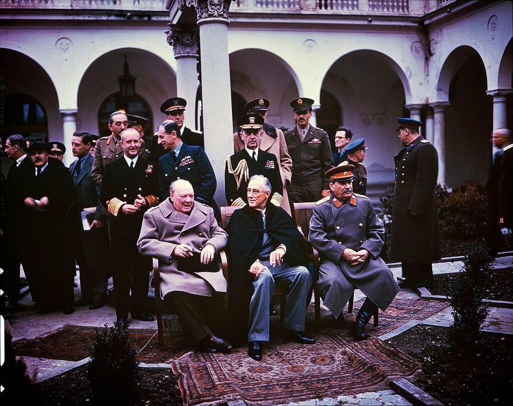

### Jałta

Zakończyła się konferencja jałtańska. Trwała od 4 lutego - osiem dni. Ostatecznie postanowienia są następujące:

- Niemcy zostaną obciążone reparacjami wojennymi i podzielone na cztery strefy okupacyjne.
- Sowiety dostają jedną ze stref okupacyjnych (składającą się z Turyngii, Saksonii, Meklemburgii, Brandenburgii i Pomorza Przedniego) i gwarantowaną strefę wpływów z Polską w roli głównej.
- transfer ludzi i granic na zachód: Polska i Niemcy tracą kresy wschodnie, Polacy i Niemcy będą przewiezieni na zachód w ramach tzw. repatriacji; ponadto Niemcy opuszczą Prusy Wschodnie, Czechosłowację i Węgry.
- Polska w ramach rekompensaty dostaje, to co później w komunistycznej propagandzie określane było jako "Ziemie Odzyskane": Śląsk, ziemię lubuską, Pomorze Zachodnie, Prusy Wschodnie i obszar Wolnego Miasta Gdańska.
- w Warszawie na bazie dotychczasowego Rządu Tymczasowego powstanie Rząd Jedności Narodowej, działania NKWD także te wobec polskiego podziemia niepodległościowego są uznane za legalne, w zamian za obietnicę przeprowadzenia wolnych wyborów tak szybko, jak to będzie możliwe; oznacza to, że rząd warszawski zostanie uznany, a dotychczasowy rząd RP na emigracji straci uznanie międzynarodowe.
- konieczność uregulowania stosunków pomiędzy Bułgarią a Jugosławią.
- Sowiety w dwa do trzech miesięcy po pokonaniu Niemiec przystąpią do wojny z Japonią, w zamian zostanie uznany status quo tzw Mongolii Zewnętrznej oraz dostaną południowy Sachalin, Port Arthur i Wyspy Kurylskie.

Jak widać tak czasem wykpiwany "słoń a sprawa polska" akurat miał tu znaczenie, bo kwestie polskie wiązały większość wątków konferencji. Taki już los kraju pomiędzy Moskwą a Berlinem.

<BoxImageWrapper>

Wielka Trójka podczas konferencji w Jałcie 1945 
Źródło: Wikipedia By [[1]](https://history.blog.gov.uk/2015/02/04/whats-the-context-4-february-1945-the-yalta-conference-opens/) [[2]](https://history.blog.gov.uk/wp-content/uploads/sites/2/2015/02/INF14-447-Yalta-conference-Churchill-Stalin-Roosevelt-1945-1024x807.jpg), Domena publiczna, [Link](https://commons.wikimedia.org/w/index.php?curid=40547477)
</BoxImageWrapper>

### Budapeszt

17 stycznia Niemcy wycofali się z Pesztu i następnego dnia wysadzili wszystkie mosty na Dunaju. Bitwa o Budę z powodu ukształtowania terenu była dużo trudniejsza. Do 11 lutego cała Buda poza wzgórzami Zamkowym i Gellerta została zdobyta.

<SeeAlso txt="Węgry" url="/festung-breslau/article/wegry" />

11 lutego Wzgórze Gellerta zostało zdobyte. Wojska niemieckie i węgierskie wciąż trzymały wzgórze zamkowe. Generał Pfeffer-Wildenbruch wbrew rozkazowi Hitlera pozwolił na ewakuację wzgórza. Będą się tam trzymać jeszcze dwa dni. Korzystając z ciemności i mgły, żołnierze cywile uciekają z okrążenia. Niektórym się udało. Większość jednak została zmasakrowana ogniem przygotowanych na to oddziałów Armii Czerwonej.

Niemcy ponieśli ogromne straty w Budapeszcie. Tylko dzisiaj zginęli:

- drezdeńczyk z pochodzenia generał Gerhard Schmidhuber (Wehrmacht) dowódca 7 i resztek 13 Dywizji Pancernej, przez Pála Szalaia faszystę węgierskiego utrzymywał kontakt z Raulem Wallenbergiem, i to na skutek jego nacisków Schmidhuber nie dopuścił do likwidacji budapeszteńskiego getta i ochronił je przed węgierskimi strzałokrzyżowcami.
- August Zehender generał, dowódca 22 Ochotniczej Dywizji Kawalerii SS (niem. 22. SS-Freiwilligen Kavallerie-Division) - używana czasem nazwa dywizji Maria Theresia jest niepotwierdzona.
- Dowódca 8 Dywizji Kawalerii SS generał Joachim Rumohr poważnie ranny podczas wycofywania się z Budapesztu, chcąc uniknąć dostania się do niewoli, popełnił samobójstwo.

- [Mark Felton Productions "The Nazi Gold Train" [YT 10:36]](https://www.youtube.com/watch?v=Tm_4NETGXpc)

### ROA

Chrzest bojowy 600 dywizji (rosyjskiej) ROA, bronią pozycji Odry wypierając nieprzyjaciela z okolic wsi Neulewin 20 km na NW od Kostzyna nad Odrą. Po trzech dniach wyniszczającej walki wycofani. Od 14 lutego maszerują w kierunku Pragi.

Dywizja była wyposażona w zdobyczne T-34-76 i Hetzery. Czy pod Neulewin Rosjanie w T-34 walczyli z Rosjanami w T-34?

### Warszawa

Dziś w praskim więzieniu karno-śledczym nr III tzw. Toledo przy ul. 11 Listopada w Warszawie stracony został Edward Nowicki ps. "Tyczka" porucznik kampanii wrześniowej, szef komendy AK Ostrów Mazowiecka. Schwytany przez NKWD w grudniu 1944. Wyrok śmierci wydał Wojskowy Sąd Garnizonowy.

### Dolny Śląsk

Od początku ofensywy opanowano 500 miejscowości, np. Kostomłoty. Do 13 lutego 650. Do 14 850.

Zmiana celów operacyjnych na odcinku ścinawskim: planowany atak na linii: Polkowice - Nowe Miasteczko - Nowa Sól, drugi blokując Głogów od wschodu, miał wyjść nad Odrę na północ od Bytomia Odrzańskiego. Widząc, że okrążenie Głogowa jest nieuchronne, generał Nehring pozostawił tam silną załogę, a resztę sił wycofał za linię Bobru, tak samo postąpił dowódca XL Korpusu Pancernego generał Gotthard Heinrici, broniący dotąd linii Odry od Bytomia Odrzańskiego do ujścia Nysy Łużyckiej.

Sowieci przekroczyli Bóbr w rejonie Żagania i zbliżyli się do Szprotawy. Zdobyli Przemków. Do 13 lutego opanowali Nowe Miasteczko, Bytom Odrzański i Kożuchów.

### 6 Armia

Opracowane na podstawie: Primke, Szczerepa "Kierunek Festung Breslau":

Fakt, że ważą się losy oblężenia i siły 6 Armii są poważnie zagrożone, nie uszedł uwadze dowództwa Frontu. Dlatego właśnie 52 Armia dostała rozkaz przejęcia Legnicy, co umożliwi skierowanie 22 Korpusu Strzeleckiego na wschód. Ponadto 3 Gwardyjska Armia Pancerna, która w tym czasie była już pod Bolesławcem dostała rozkaz zmiany kierunku uderzenia - miała zawrócić o 180 stopni i uderzyć na wschód na zaplecze niemieckie na południe od autostrady. Miało to odciążyć 6 Armię, pozwolić jej przesunąć się w stronę Wrocławia, co z kolei umożliwi skierowanie wszystkich sił 7 Korpusu Zmechanizowanego Gwardii na zamknięcie korytarza, tak zaciekle bronionego przez Niemców.

Na całym obszarze pomiędzy Legnicą a Wrocławiem panuje dziś bardzo dziwna sytuacja: skromne siły niemieckie skoncentrowane w licznych i nie do końca rozpoznanych punktach oporu usiłują zatrzymać postęp sowiecki. Tymczasem Armia Czerwona, która niejednokrotnie prowadzi zaciekłe boje na własnych tyłach, penetruje zaplecze nieprzyjaciela czasem siłami całego pułku. Wojska niemieckie i sowieckie są przemieszane, linia frontu czy też meldowana rubież zaznacza obszar przewagi, a nie panowania.

218 Dywizja Strzelecka pozostaje na rubieży Bartoszów - Rogoźnik chroniąc prawą flankę 6 Armii, aktywnie prowadzi zwiad i odpiera ataki. Usiłuje zdobyć Gniewomierz. 309 Dywizja Strzelecka przenosi się w trójkąt Piersno - Czechy - Kostomłoty.

Helena Hillman, mieszkanka Zabłot:
>11 lutego zostaliśmy napadnięci przez Rosjan i zamknięci w piwnicy na kartofle. Razem ze mną sto osób. Tam spędziliśmy trzy straszne dni i noce. Bez okrycia, światła, pożywienia. Z wartownikami pod drzwiami. Jeden jedyny słój po marmoladzie służył stu osobom do załatwienia potrzeb fizjologicznych. Dopiero potem kobiety i dziewczyny zostały wyciągnięte z piwnicy i zgwałcone w tym samym pomieszczeniu. Birgitte s. z Kamiennej Góry zgwałcono dziewięć razy pod rząd, a potem gdy zaczęła się wzbraniać, uderzono ją karabinem maszynowym. Broń wystrzeliła i trafiła 15-letnią Hildę Rabsch z Przecławic koło Wrocławia w tył głowy. Siedziałam dosłownie w kałuży krwi i nie miałam nic, żeby opatrzyć rany. Błagaliśmy o lekarza. Zamiast tego Rosjanin chwycił za nogi nieprzytomną Brigitte i zaczął ją ciągnąć po schodach tak, że jej głowa ciągle uderzała o stopnie. Na górze została znowu oddana na pastwę żołnierzy. Później podczas ostrzału musieliśmy wyjść i zostawić rzekome zwłoki młodej dziewczyny. Młody praktykant od nas ukrył się w stodole, a kiedy następnego dnia jeszcze raz zszedł do piwnicy, Hilde jeszcze się poruszała i rozpoznała go. Umarła krótko po tym.

Wciąż toczą się walki o Środę Śląską, która stanowi najsilniejszy punkt oporu na tym obszarze. Seria ataków i kontrataków na stację kolejową Środa Śląska, która znajduje się pomiędzy miastem a Szczepanowem.

Sachsenheimer melduje, że Niemcy trzymają pozycje Słup - Jaśkowice (wschodnia część Szczepanowa) - Chwalimierz. Dzisiejszy raport sowiecki donosi o wdarciu się i zdobyciu do końca dzisiejszego dnia do Słupa (181 Dywizja Strzelecka) i Chwalimierza (359 Dywizja Strzelecka). W zachodniej części Szczepanowa ulokowany jest sztab sowieckiego pułku. Wschodnia jest niemieckim bastionem. W Komornikach (zachodnia część Środy Śląskiej) znajduje się silna pozycja niemieckiej artylerii.

Jak bardzo ta linia jest symboliczna, wskazuje uwaga Sachsenheimera, że Lutynia i Radakowice zostały zaatakowane od południa. Sowiecki 1198 pułk zajął pozycję aż w Gałowie, Gałówku i Jarnołtowie. Pomimo kontrataków niemieckich nie tylko nie dał się wyprzeć, ale i prowadził intensywny zwiad w kierunku Leśnicy. Przekroczyli Strzegomkę i uderzyli na Samotwór.

Podążył za nim 1196 pułk i z samego rana zajął pozycje Jarząbkowice - Zakrzyce i prowadził zwiad w kierunku Lutyni.

### 7 Korpus Zmechanizowany Gwardii

Opracowane na podstawie: Primke, Szczerepa "Kierunek Festung Breslau":

Natomiast dla Korpusu nadszedł dzień krytyczny.

19 Dywizja Pancerna zaatakowała rejon 24 Brygady Pancernej Gwardii, nacierając w kierunku na Samborz. Odbył się dramatyczny bój o wieś Udanin, który utracono, ale potem odbito.

Ponadto w cały korytarz na południe od Wrocławia pomiędzy liniami kolejowymi 285 a 276, czyli między dawnym przebiegiem krajowej ósemki a drogą 395 Niemcy rzucili wszystkie posiadane przez siebie siły. Były to: 20 Dywizja Pancerna, 253 i 254 DP oraz resztki 269 DP.

Udało im się wypchnąć 57 Brygadę z Kobierzyc w rejon Chrzanowa. Brygada bezskutecznie atakowała w kierunku na Magnice i Księginice. Natomiast 25 Brygada nadal trzymała pozycję Domasław - Bledzów.

O godz. 1700 otrzymali rozkaz wyprowadzenia natarcia w kierunku Żórawiny, co miało doprowadzić do spotkania z 5 Armią, od której dzieliło ich tylko 6,5 km. Zadanie było utrudnione, ponieważ z powodu roztopów trzeba było trzymać się dróg bitych, co zmuszało do przejeżdżania obok budynków, w których ukrywali się żołnierze z panzerfaustami. Ponadto od 10 lutego nastąpiło nasilenie operacji lotniczej nieprzyjaciela, nie tylko zwiadowczej. Kilkanaście samolotów Bf 109 i Ju 88 regularnie atakowało sowieckie pozycje. Natomiast 2 Armia Lotnicza sowiecka była nieobecna.

W nocy doszło do połączenia obu Brygad i rozpoczął się bój o Księginice.

Tymczasem 8 Dywizja Pancerna niemiecka przebiła się do Krobielowic. Zastała je zniszczone i splądrowane. Zbezczeszczono grobowiec. Najwidoczniej nikt nie powiedział czerwonoarmistom, że marszałek był sojusznikiem Rosji.
>Wdzierający się tam sowieccy żołnierze zniszczyli (...) posiadłość, w której sędziwy feldmarszałek spędził ostatnie lata swojego życia i gdzie również zmarł. Nie uszanowano również znajdującego się w pobliżu grobowca rodziny von Blücher. Zniszczono zarówno pomnik, jak i zdobiące go wieńce i wstęgi, rozłupano żeliwny sarkofag marszałka i rozbito znajdującą się w nim drewnianą trumnę z ciałem "Marszałka Naprzód". Wydobytym z trumny zwłokom odcięto głowę, wyrzucając je następnie precz.

Podsumowując - wciąż nie dotarło wsparcie piechoty 22 Korpusu Strzeleckiego, wszystkie jednostki liniowe Korpusu były nadmiernie rozciągnięte i pod atakiem, a dwie Brygady będące w ataku zupełnie odcięte i pozbawione zaplecza. Działania Niemców zmierzały do podzielenia Korpusu na mniejsze części i zniszczenia każdej z nich. Dlatego tak walczyli o szosę Bielany Wrocławskie - Kobierzyce, była główną osią drogową korytarza i rozdzielała jednostki Korpusu na dwie części.

Czy jutrzejszy dzień przyniesie rozstrzygnięcie?

Tymczasem 5 Armia sowiecka nacierająca od strony Oławy napotyka poważny opór. Do 11 lutego posuwa się tylko kilka km naprzód i osiąga linię Kotowice - Grodziszów - Krajków.

### Wrocław

294 DP na drodze do Wrocławia zdobyła Zakrzów, wdarła się do fabryki Kornów i pobliskiego osiedla "Po pracy" (niem. Feierabendsiedlung), zagroziła stacji kolejowej Wrocław Zakrzów (niem. Sacrau). Na miejscu był tylko batalion pod dowództwem majora Tenscherta wspierany przez drugi batalion pod dowództwem kapitana Günthera. Na pomoc został wysłany batalion z pułku Wehl. Jutro kontratak.

Ksiądz Peikert
>Z Wysokiego Kościoła spod Trzebnicy strzelały rosyjskie działa dalekiego zasięgu bez przerwy na nasze miasto. W mojej parafii liczne detonacje i wielkie spustoszenia na ulicach.

### Iwan Połbin

Dzisiaj we Wrocławiu zginął, wykonując misję bojowa generał Połbin. Jest to tak interesująca postać - ponadto ma ulice we Wrocławiu! - że poświęciłem mu osobny artykuł, jest też trochę kontekstu i ogólnie historii lotnictwa:

<SeeAlso txt="Generał Iwan Połbin (1905-45)" url="/festung-breslau/article/iwan-polbin" />

### Odnośniki

- [naszemiasto.pl "Historia Psiego Pola we Wrocławiu: Walki o Zakrzów"](https://naszemiasto.pl/historia-psiego-pola-we-wroclawiu-walki-o-zakrzow/ar/c1-4524734)

