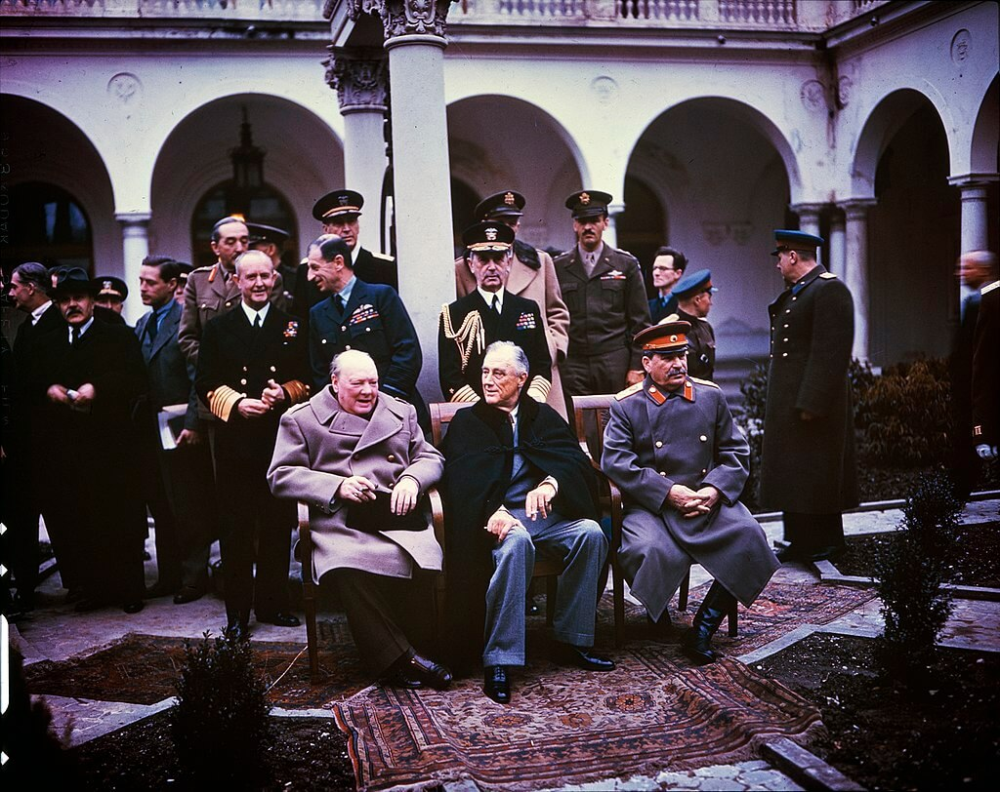

### Jałta

Zakończyła się konferencja jałtańska. Trwała od 4 lutego - osiem dni. Ostatecznie postanowienia są następujące:

- Niemcy zostaną obciążone reparacjami wojennymi i podzielone na cztery strefy okupacyjne.
- Sowiety dostają jedną ze stref okupacyjnych (składającą się z Turyngii, Saksonii, Meklemburgii, Brandenburgii i Pomorza Przedniego) i gwarantowaną strefę wpływów z Polską w roli głównej.
- transfer ludzi i granic na zachód: Polska i Niemcy tracą kresy wschodnie, Polacy i Niemcy będą przewiezieni na zachód w ramach tzw. repatriacji; ponadto Niemcy opuszczą Prusy Wschodnie, Czechosłowację i Węgry.
- Polska w ramach rekompensaty dostaje, to co później w komunistycznej propagandzie określane było jako "Ziemie Odzyskane": Śląsk, ziemię lubuską, Pomorze Zachodnie, Prusy Wschodnie i obszar Wolnego Miasta Gdańska.
- w Warszawie na bazie dotychczasowego Rządu Tymczasowego powstanie Rząd Jedności Narodowej, działania NKWD także te wobec polskiego podziemia niepodległościowego są uznane za legalne, w zamian za obietnicę przeprowadzenia wolnych wyborów tak szybko jak to będzie możliwe; oznacza to, że rząd warszawski zostanie uznany, a dotychczasowy rząd RP na emigracji straci uznanie międzynarodowe.
- konieczność uregulowania stosunków pomiędzy Bułgarią a Jugosławią.
- Sowiety w dwa do trzech miesięcy po pokonaniu Niemiec przystąpią do wojny z Japonią, w zamian zostanie uznany status quo tzw Mongolii Zewnętrznej oraz dostaną południowy Sachalin, Port Arthur i Wyspy Kurylskie.

Jak widać tak czasem wykpiwany "słoń a sprawa polska" akurat miał tu znaczenie, bo kwestie polskie wiązały większość wątków konferencji. Taki już los kraju pomiędzy Moskwą a Berlinem.

*Wielka Trójka podczas konferencji w Jałcie 1945 
Źródło: Wikipedia By [[1]](https://history.blog.gov.uk/2015/02/04/whats-the-context-4-february-1945-the-yalta-conference-opens/) [[2]](https://history.blog.gov.uk/wp-content/uploads/sites/2/2015/02/INF14-447-Yalta-conference-Churchill-Stalin-Roosevelt-1945-1024x807.jpg), Domena publiczna, [Link](https://commons.wikimedia.org/w/index.php?curid=40547477)*

### Budapeszt

Ponieważ Węgrzy dość szybko poparli Hitlera, bardzo długo kraj był chroniony przed okupacją i rabunkową eksploatacją. Węgierska armia walczyła na froncie wschodnim. Kiedy sytuacja państw Osi się pogarszała i ze wschodu zbliżała się Armia Czerwona najpierw w marcu 1944 Niemcy wkroczyli na Węgry.

Wciąż rządzi suwerenny węgierski rząd Horthyego, który sam oficjalnie określał się jako antysemita. Wtedy rozgrywa się jeden z najbardziej tragicznych epizodów Holokaustu - między 15 maja a 9 lipca 1944 wywieziono z Węgier do KL Auschwitz 440 tys Żydów, 360 tys zostało natychmiast zamordowanych w komorach gazowych.

Admirał Horthy już od 1943 prowadził dość ryzykowne negocjacje z aliantami. Prawdopodobnie chciał podążyć drogą włoską (we wrześniu 1943 Włosi zmienili strony). 11 października 1944 przedstawiciel Węgier podpisał w Moskwie zawieszenie broni z sowietami. Armia Czerwona była wtedy już przy granicy Węgier.

Na wieść o tym 15–16 października Niemcy przeprowadzili Operację Panzerfaust (niem. Unternehmen Panzerfaust) próbę zmuszenia Hothyego do uległości. Kiedy to nie przyniosło rezultatu powołali marionetkowy rząd strzałokrzyżowców - węgierskich faszystów. Horthy został internowany na zamku Hirschberg am Haarsee (Bawaria). Na Węry naciera 2 Front Ukraiński marszałka Rodiona Malinowskiego. Już na początku listopada dociera do wschodnich przedmieść Budapesztu, a 26 grudnia zamyka Budapeszt w oblężeniu. Podobnie jak w przypadku Wrocławia nie było żadnej planowanej ewakuacji cywilów. O tej porze roku przerodziłoby się to w masakrę. W Budapeszcie było 800 tys ludności cywilnej. Hitler rozkazał bronić miasta za wszelką cenę, ogłosił Budapeszt Twierdzą.

17 stycznia Niemcy wycofali się z Pesztu i wysadzili wszystkie mosty na Dunaju. Bitwa o Budę z powodu ukształtowania terenu byłą dużo trudniejsza. Do 11 lutego cała Buda poza wzgórzami Zamkowym i Gellerta została zdobyta.

11 lutego Wzgórze Gellerta zostało zdobyte. Wojska niemieckie i węgierskie wciąż trzymały wzgórze zamkowe. Generał Pfeffer-Wildenbruch wbrew rozkazowi Hitlera pozwolił na ewakuację wzgórza. Będą się tam trzymać jeszcze dwa dni. Korzystając z ciemności i mgły żołnierze cywile uciekają z okrążenia. Niektórym się udało. Większość jednak została zmasakrowana ogniem przygotowanych na to oddziałów Armii Czerwonej.

Niemcy ponieśli ogromne straty w Budapeszcie. Tylko dzisiaj:

- Zginał drezdeńczyk z pochodzenia generał Gerhard Schmidhuber (Wehrmacht) dowódca 7 i resztek 13 Dywizji Pancernej, przez Pála Szalaia faszystę węgierskiego utrzymywał kontakt z Raulem Wallenbergiem i to na skutek jego nacisków Schmidhuber nie dopuścił do likwidacji budapeszteńskiego getta i ochronił je przed węgierskimi strzałokrzyżowcami.
- August Zehender generał, dowódca 22 Ochotniczej Dywizji Kawalerii SS (niem. 22. SS-Freiwilligen Kavallerie-Division) - używana czasem nazwa dywizji Maria Theresia jest niepotwierdzona.
- Dowódca 8 Dywizji Kawalerii SS generał Joachim Rumohr poważnie ranny podczas wycofywania się z Budapesztu, chcąc uniknąć dostania się do niewoli, popełnił samobójstwo

- [Mark Felton Productions "The Nazi Gold Train" [YT 10:36]](https://www.youtube.com/watch?v=Tm_4NETGXpc)

### ROA

Chrzest bojowy 600 dywizji (rosyjskiej) ROA, bronią pozycji Odry wypierając nieprzyjaciela z okolic wsi Neulewin 20 km na NW od Kostzyna nad Odrą. Po trzech dniach wyniszczającej walki wycofani. Od 14 lutego maszerują w kierunku Pragi.

Dywizja była wyposażona w zdobyczne T-34-76 i Hetzery. Czy pod Neulewin Rosjanie w T-34 walczyli z Rosjanami w T-34?

### Warszawa

Dziś w praskim więzieniu karno-śledczym nr III tzw. Toledo przy ul. 11 Listopada w Warszawie stracony został Edward Nowicki ps. "Tyczka" porucznik kampanii wrześniowej, szef komendy AK Ostrów Mazowiecka. Schwytany przez NKWD w grudniu 1944. Wyrok śmierci wydał Wojskowy Sąd Garnizonowy.

### Dolny Śląsk

Od początku ofensywy opanowano 500 miejscowości, np Kostomłoty. Do 13 lutego 650. Do 14 850.

Zmiana celów operacyjnych na odcinku ścinawskim: planowany atak na linii: Polkowice - Nowe Miasteczko - Nowa Sól, drugi blokując Głogów od wschodu, miał wyjść nad Odrę na północ od Bytomia Odrzańskiego. Widząc, że okrążenie Głogowa jest nieuchronne, generał Nehring pozostawił tam silną załogę, a resztę sił wycofał za linię Bobru, tak samo postąpił dowódca XL Korpusu Pancernego generał Henrici, broniący dotąd linii Odry od Bytomia Odrzańskiego do ujścia Nysy Łużyckiej.

Sowieci przekroczyli Bóbr w rejonie Żagania i zbliżyli się do Szprotawy. Zdobyli Przemków. Do 13 lutego opanowali Nowe Miasteczko, Bytom Odrzański i Kożuchów.

### Wrocław

5 Armia Gwardii nacierająca od strony Oławy napotyka poważny opór. Do 11 lutego posuwa się tylko kilka km naprzód i osiąga linię Kotowice - Grodziszów - Krajków.

Po dwóch dniach walki 7 Korpus Zmechanizowany zdobywa Kąty Wrocławskie, tracąc 263 zabitych.

294 DP na drodze do Wrocławia zdobyła Zakrzów, wdarła się do fabryki Kornów i pobliskiego osiedla "Po pracy" (niem. Feierabendsiedlung), zagroziła stacji kolejowej Wrocław Zakrzów (niem. Sacrau). Na miejscu był tylko batalion pod dowództwem majora Tenscherta wspierany przez drugi batalion pod dowództwem kapitana Günthera. Na pomoc został wysłany batalion z pułku Wehl. Jutro kontratak.

Ksiądz Peikert
>Z Wysokiego Kościoła spod Trzebnicy strzelały rosyjskie działa dalekiego zasięgu bez przerwy na nasze miasto. W mojej parafii liczne detonacje i wielkie spustoszenia na ulicach.

### Iwan Połbin

Dzisiaj we Wrocławiu zginął, wykonując misję bojowa generał Połbin. Jest to tak interesująca postać - ponadto ma ulice we Wrocławiu! - że poświęciłem mu osobny artykuł, jest też trochę kontekstu i ogólnie historii lotnictwa: [Generał Iwan Połbin (1905-45)](/festung-breslau/articles/iwan-polbin)

### Odnośniki

- [naszemiasto.pl "Historia Psiego Pola we Wrocławiu: Walki o Zakrzów"](https://naszemiasto.pl/historia-psiego-pola-we-wroclawiu-walki-o-zakrzow/ar/c1-4524734)

