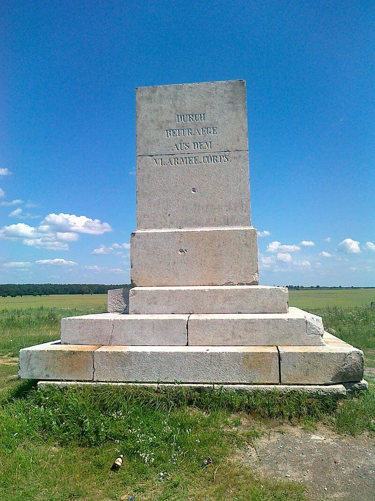

### Henrietta Szold

W szpitalu w Jerozolimie zmarła w wieku 85 lat Henrietta Szold amerykańska pedagog i aktywistka syjonistyczna.

Od 1920 działa w Brytyjskim Mandacie Palestyny zakładając różnego rodzaju placówki medyczne i socjalne: szkołę pielęgniarek, sieć klinik publicznych Hadassa (pomagała Żydom i Arabom), szpitale położnicze, oddziały stomatologiczne, szkoły medyczne. Można o niej powiedzieć, że stworzyła podstawy systemu opieki medycznej powstałego w 1948 państwa Izrael. Szold promowała ideę państwa dwunarodowego. Pochowano ja na Górze Oliwnej w Jerozolimie.

### Operacja Tabarin

Tajna brytyjska misja antarktyczna trwała od 1943. Jej wojskowym zadaniem było badanie niemieckiej aktywności cywilnej i wojskowej w regionie, a po wojnie utrwaleniu brytyjskich wpływów. Ale rezultaty naukowe były o wiele bardziej interesujące. Ogromna liczba pomiarów, poprawek do map i okazów.

Dzisiaj wybrano Seal Point (Hope Bay, Ziemia Grahama) na miejsce lokalizacji, ostatniej już, stacji D. W sierpniu zorganizowano stamtąd wyprawę saniami na południe. Wróciła w grudniu z ponad 250 kg próbek porostów, skamieniałości i skał.

W 1946 operacja została zakończona.

### Londyn

Obrady rządu polskiego w Londynie. Raczkiewicz: postulat skupienia władzy w rękach jednego przywódcy. Rząd: odrzucenie uchwał jałtańskich.

Bór-Komorowski w niewoli.

### Drezno

Lotnictwo alianckie w dniach 13-15 lutego bombarduje Drezno. Zginęło około 25 tysięcy osób. Wydarzenia w Dreźnie mają duży związek z tym, co się dzieje we Wrocławiu.

<SeeAlso txt="Drezno bombardowanie 13-15 lutego 1945" url="/festung-breslau/article/drezno-bombardowanie" />

### 2 Front Ukraiński

2 Front Ukraiński pod dowództwem marszałka Rodiona Malinowskiego zdobył wzgórze zamkowe w Budzie, ostatni punkt oporu w Budapeszcie. Koniec bitwy o Budapeszt.

<SeeAlso txt="Węgry" url="/festung-breslau/article/wegry" />

### 1 Front Ukraiński

1 Front Ukraiński zajął: Żary, Szprotawę, Bytom Odrzański.

Rozwija się ofensywa dolnośląska (z założenia berlińska)

- Z przyczółka na lewym brzegu Bobru na północ od Żagania natarcie w kierunku Nysy Łużyckiej.
- 9 Korpus Zmechanizowany Gwardii zdobył Strzegom.
- 9 Brygada Artylerii Pancernej zdobywa Złotoryję.

Charakterystyczną formacją tego okresu byli niszczyciele czołgów na rowerach, do rowerów były przytroczone panzerfausty. [Niemieccy niszczyciele czołgów na rowerach – rejon Złotoryi 1945.](https://www.facebook.com/bobr1945/posts/3395625697217736)

### Bolesławiec
 
Meldunek 4 Armii Pancernej niemieckiej [Walki na zachodnim brzegu Bobru w rejonie Bolesławca.](https://www.facebook.com/bobr1945/posts/3638642762916027):
>Grupa bojowa Brücker została odrzucona na linię Kraszowice – Brzeźnik – Kierżno, i toczy zacięte walki w rejonie Brzeźnika z przeważającymi siłami wroga, dysponującego czołgami”.

### 6 Armia

Opracowane na podstawie: Primke, Szczerepa "Kierunek Festung Breslau":

Na froncie wrocławskim 13 lutego to dzień przełomu - po pierwsze: uzyskano w końcu połączenie 7 Korpusu Zmechanizowanego Gwardii z 5 Armią Gwardyjską, Wrocław został odcięty! po drugie: następuje generalny odwrót i wycofywanie się sił niemieckich, ataki są sporadyczne i podejmowane głównie przez oddziały usiłujące się wydostać z kotła. Ponadto następuje osłabienie operacji Luftwaffe.

Ale po kolei.

22 Korpus Strzelecki trzymał linię autostrady od Budziszowa Wielkiego po Kąty Wrocławskie, ale jego pułki przesunęły się na wschód. Przystąpił do luzowania Brygad 7 Korpusu Zmechanizowanego Gwardii, które dzięki temu mogły ruszyć na pomoc odciętej pozycji w Galowicach.

309 Dywizja Strzelecka odbiła Kostomłoty i Piotrowice, w boju o Kostomłoty odznaczył się 957 Pułk Strzelecki, który zajął pozycję Samborz - Kostomłoty - Sokolniki. Pozostałe pułki rozlokowały się bardziej na wschód w Kątach Wrocławskich, Chmielowie i Stoszycach. Wykryto zorganizowane wycofywanie się dużych sił przeciwnika, więc zapadła decyzja zablokowaniu wyjazdu z Wrocławia. Dlatego 959 Pułk Strzelecki z Kątów Wrocławskich został skierowany na Zybiszów - Cesarzowice. Natomiast 955 Pułk Strzelecki ze Stoszyc - Chmielowa na Smolec - Mokronos Górny.

218 Dywizja Strzelecka do południa rozlokowana w rejonie Kątów Wrocławskich ruszyła w kierunku na Bielany Wrocławskie, Domasław, Tyniec Mały. O godz. 1700 osiągnęła rubież Jaszkotle - przedpole Nowej Wsi Wrocławskiej. Do końca dnia Zabrodzie i rejon Domasławia.

O godz. 1800 do walki została wysłana 8 Brygada Artylerii Polowej mając przez Sośnicę wyjść z atakiem na Oporów i Klecinę. Tego dnia jednak dotarła tylko do rubieży Pietrzykowice - Jaszkotle - Nowa Wieś Wrocławska wzmacniając pozycję 309 Dywizji Strzeleckiej.

181 Dywizja Strzelecka od czterech dni prowadzi zaciekłe walki o Środę Śląską. Nie tylko nie udało się uzyskać włamania do miasta, ale liczne i silne kontrataki niemieckie zagrażają pozycjom sowieckim. Szczególną zaciekłość wykazywał oddział w Jaśkowicach atakami zagrażający pozycjom Dywizji w Szczepanowie. Niemcy dysponowali działami pancernymi i mająca dużą ilość amunicji artylerią.

Odcinek na północ od 181 Dywizji Strzeleckiej aż po Odrę zajął 77 Polowy Rejon Umocniony. W nocy z 13 na 14 lutego stoczyli walkę z żołnierzami z SS Besslein. Schwytani do niewoli zeznali, że zabezpieczali odwrót niemieckiej grupy bojowej w kierunku Wrocławia.

Dwa pułki 359 Dywizji Strzeleckiej znajdujące się na linii Bystrzycy ruszyły do ataku na Wrocław, zbliżając się do Krzeptowa i Strachowic. W Strachowicach było najważniejsze lotnisko Luftwaffe. We Wrocławiu były tylko dwa lotniska: na Gądowie Małym starsze i mające trawiastą nawierzchnię i nowsze z dużym, nowoczesnym pasem betonowym zbudowane specjalnie dla wojska w 1938 Flughafen Breslau-Schöngarten, właśnie Strachowice. Z racji położenia i praktycznie braku obrony od razu to cenne lotnisko wpadnie w ręce nieprzyjaciela.

1194 Pułk Strzelecki na południe od Środy Sląskiej był rozciągnięty na linii Ogrodnica - Gozdawa i tam blokował grupę bojową Sachsenheimera.

O godz. 0900 wyłączono ze składu 74 Korpusu Strzeleckiego 273 Dywizję Strzelecką, która razem z 91 Brygadą Pancerną 3 Gwardyjskiej Armii Pancernej dokonała ataku na Strzegom i Łażany. Miało to na celu zabezpieczenie zaplecza 6 Armii. Atak zakończył się zdobyciem Strzegomia.

### 7 Korpus Zmechanizowany Gwardii

Opracowane na podstawie: Primke, Szczerepa "Kierunek Festung Breslau":

24 Brygada Zmechanizowana Gwardii jeszcze w nocy podeszła do Domasławia i przystąpiła do odbicia tej miejscowości. Udało się tego dokonać po całonocnej walce, Niemcy ostrzeliwali czerwonoarmistów z wysokiego nasypu kolejowego, zadając im wysokie straty. W końcu wycofali się do Magnic, gdzie zajęli pozycję obronną. Sowieci zniszczyli tory kolejowe, żeby odciąć komunikację z Wrocławiem. Potem dowódcy 24 i 57 Brygady podjęli decyzję o ataku na Księginice.

26 Brygada odparta z pozycji niemieckiej Chrzanów - Magnice zajęła rejon Krzyżowice - Nowiny i usiłowała połączyć się z 24 Brygadą w Domasławiu.

Choć pozycja sowiecka w Galowicach była odcięta i okrążona to na całym obszarze Armia Czerwona miała znaczącą przewagę. Priorytetem było połączenie z 5 Armią Gwardyjską nacierającą z rejonu Oleśnicy. Należący do niej 31 Korpus Pancerny zajmował tego dnia pozycję w odległej o 2 km i oddzielonej Ślęzą Żórawinie. Wiadomo było, że ten dzień przyniesie rozstrzygnięcie.

W nocy z 12 na 13 lutego sowieci w Galowicach byli już trzeci dzień w okrążeniu, Mieczysław Lebel:
>Wszyscy, którzy byli zdolni utrzymać broń byli w okopach [...]. W punktach dowodzenia, w piwnicach ulokowano rannych. kończyły się zapasy amunicji, lekarstw i paliwa.

O 4 rano ruszyły do ataku niemieckie czołgi i działa szturmowe. Za wszelką cenę chcieli się wyrwać z okrążenia. Wszystkie ataki odparto. Używano nawet koktajli Mołotowa.
>na jednym z odcinków grupie hitlerowców na czołgach udało się przebić przez linię piechoty zmotoryzowanej i wyjść na stanowiska moździerzy.

Doszło do walki wręcz.

Już po bitwie o godz. 1000 sowieci w Galowicach zauważyli nadjeżdżające ze wschodu czołgi, szykowali się już do kolejnej walki, kiedy okazało się, że są to... jadące z Żórawiny T-34-85 31 Korpusu Pancernego 5 Armii Gwardyjskiej.

Jeszcze w nocy z 12 na 13 lutego wyszedł zwiad w kierunku Żórawiny, ale został zatrzymany przez kaem. Dziś doszło do zamknięcia zaciskających się na Wrocławiu kleszczy. Dokładnie, kiedy to nastąpiło, nie jest pewne. Na odcinku Galowice - Żórawina było to o godzinie 8 lub 10.30 rano.

Do podobnego połączenia doszło również w regionie folwarku Sadków.

Wciąż pozostała luka w rejonie Domasławia.

Do godz. 1700 cały obszar Domasław - Księginice był już opanowany przez Armię Czerwoną. Do tego czasu oczyszczono Żórawinę z resztek sił niemieckich. Ale ta sytuacja nie jest stabilna.

7 Korpus Zmechanizowany Gwardii:
>Pełne okrążenie wrocławskiego zgrupowania przeciwnika zakończyło się o godzinie 17.00 13 lutego 1945 roku

Marszałek Koniew:
>o spotkaniu się dwóch armii, na tyłach okrążonych we Wrocławiu hitlerowców dowiedział się po kilku godzinach dosłownie cały front. Wszyscy tego oczekiwali i z ulgą odetchnęli.

### Grupa bojowa Sachsenheimer

Tego dnia przestaje istnieć grupa bojowa Sachsenheimer. Jak wspomina jej dowódca:
>niczym bomba gruchnął meldunek radiowy według którego moja Grupa Bojowa Sachs miała przerwać pierścień oblężenia i przebić się na południe przez autostradę do własnych oddziałów utrzymujących rzekę Strzegomkę. Po oddaniu do twierdzy wszystkich dział, pojazdów opancerzonych i zaprzęgów, całej artylerii i broni przeciwlotniczej, w drogę na południe, w kierunku autostrady, ruszyło nocą pieszo około 1400 żołnierzy, podzielonych na trzy kliny.

Podczas wycofywania do szczególnie ciężkich walk doszło w rejonie Kostomłotów podczas przekraczania autostrady, jak dalej pisze Sachsenheimer:
>przebić udało się około 800 żołnierzom, przy czym trzeba zauważyć, że jedna z grup przełamania podjęła decyzję o wycofaniu się do twierdzy, ponieważ dowódcy słusznie obawiali się, że nie da się dokonać wyłomu przed świtem.

Po dotarciu do 19 Dywizji Pancernej niemieckiej Sachsenheimer przystąpił do formowania 17 DP w rejonie Jeleniej Góry.

O końcu grupy Sachsenheimera donosi Ryszard Majewski:
>W tym czasie [13 lutego] 74 Korpus 6 Armii rozgromił pod Środą Śląską znacznie już przetrzebioną grupę bojową "Sachsenheimera". Część jej rozbitych oddziałów dostała się do niewoli, część wycofała się do Wrocławia, zaś grupa około 800 ludzi, pod osłoną nocy, wymijając oddziały radzieckie, zdołała na południe od autostrady dotrzeć do 19 Dywizji Pancernej. Pogrom grupy "Sachsenheimer" spowodował załamanie się obrony niemieckiej na zachód od Wrocławia i odwrót na linię Bystrzycy.

### Oblężenie Wrocławia

6 Armia sowiecka, która już do końca wojny walczyła o Wrocław, swoją drogę do ostatniego celu tej wojny zaczęła od przyczółka malczyckiego. Tam w dniu rozpoczęcia operacji dolnośląskiej 8 lutego przekroczyła Odrę i rozwinęła się na jej południu, atakując jednocześnie w dwóch, a w pewnym momencie w trzech kierunkach. Musiała sobie zabezpieczyć zaplecze, stąd atak na Legnicę zdobytą 10 lutego. Drugim istotnym celem była autostrada. Zablokowanie ruchu na niej paraliżowało mobilność jednostek nieprzyjaciela na tym odcinku. No i cel najważniejszy 40 km na wschód oddzielona gęstą siecią wsi i wieloma przeszkodami wodnymi wymarła i gotująca się do walki stolica Dolnego Śląska.

W ciągu następnych kilku dni 6 Armia ze zmiennym szczęściem prowadziła walki o i wokół Środy Śląskiej. Zdobyła linię autostrady od Budziszowa Wielkiego po Kąty Wrocławskie. Zaciekłe walki toczyły się o zdobywane i tracone Kostomłoty. 12 lutego udało się osiągnąć rubież Strzegomki na odcinku Samotwór - Gałówek.

6 Armii w tym boju towarzyszył oddany pod jej komendę 7 Korpus Zmechanizowany Gwardii z 3 Armii Pancernej Gwardii generała Rybałki. 12 lutego awangarda 7 Korpusu zdobyła kolejno Księginice, Galowice, Wilczków. Szczególnie te dwie ostatnie wsie były wielką stratą dla Niemców. To przez nią wiodła ostatnia droga zaopatrzenia Wrocławia. Zaczął się desperacki bój o odzyskanie drożności. Niemcy rzucili wszystkie siły i w boju o Domasław zmusili czerwonoarmistów do wycofania się najpierw do Księginic, a potem do Galowic. Tam właśnie izolowane oddziały 7 Korpusu przygotowały się do obrony okrężnej. Wieczorem udało się nawiązać łączność radiową z nacierającymi od wschodu oddziałami 5 Armii, które dotarły do Żórawiny.

### Wrocław

**Od dziś Wrocław jest miastem oblężonym!**

Hartung:
>Transport wartościowych materiałów, które z takim trudem pakowaliśmy, powrócił do bazy. 
>Oznacza to, że linia kolejowa na zachód jest przerwana. Artyleria i ostrzał z granatników sprawiają, że drżą ściany małego baraku przy lądowisku, gdzie teraz siedzimy gotowi do akcji. Na zachód od płyty lotniska płonie jakaś wieś. Być może to Krzeptów. 
>- Jutro przyjdzie kolej na nas - mówią nasi ludzie.

<BoxImageWrapper>

Pomnik bitwy pod Lutynią 
Źródło: Wikipedia By Oryginalnym przesyłającym był [Haael](https://en.wikipedia.org/wiki/pl:User:Haael) z [polskiej Wikipedii](https://en.wikipedia.org/wiki/pl:) - Na Commons przeniósł z [pl.wikipedia](https://pl.wikipedia.org) użytkownik [Masur](https://commons.wikimedia.org/wiki/User:Masur) z pomocą narzędzia [CommonsHelper](http://tools.wikimedia.de/~magnus/commonshelper.php)., [CC BY 3.0](https://creativecommons.org/licenses/by/3.0), [Link](https://commons.wikimedia.org/w/index.php?curid=20026288)
</BoxImageWrapper>