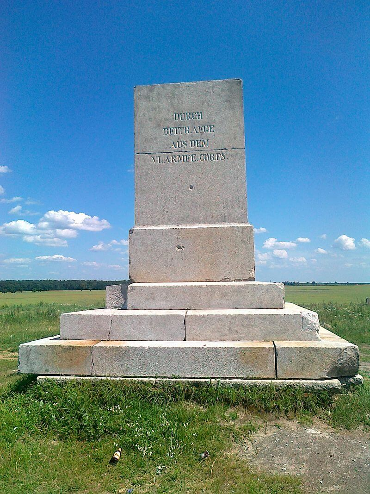

### Drezno

Lotnictwo alianckie niszczy nalotami dywanowymi Drezno, w wyniku czego zginęło około 25 tysięcy osób. Wydarzenia w Dreźnie mają duży związek z tym co się dzieje we Wrocławiu - zapraszam do lektury osobnego artykułu o tym bombardowaniu: [Drezno bombardowanie 13-15 lutego 1945](/festung-breslau/article/drezno-bombardowanie/)

### Henrietta Szold

W szpitalu w Jerozolimie zmarła w wieku 85 lat Henrietta Szold amerykańska pedagog i aktywistka syjonistyczna. Od 1920 działa w Brytyjskim Mandacie Palestyny zakładając różnego rodzaju placówki medyczne i socjalne: szkołę pielęgniarek, sieć klinik publicznych Hadassa (pomagała Żydom i Arabom), szpitale położnicze, oddziały stomatologiczne, szkoły medyczne. Można o niej powiedzieć, że stworzyła podstawy systemu opieki medycznej powstałego w 1948 państwa Izrael. Szold promował ideę państwa dwunarodowego. Pochowano ja na Górze Oliwnej w Jerozolimie.

### Operacja Tabarin

Tajna brytyjska misja antarktyczna trwała od 1943. Jej wojskowym zadaniem było badanie niemieckiej aktywności cywilnej i wojskowej w regionie, a po wojnie utrwaleniu brytyjskich wpływów. Ale rezultaty naukowe były o wiele bardziej interesujace. Ogromna liczba pomiarów, poprawek do map i okazów.

Dzisiaj wybrano Seal Point (Hope Bay, Ziemia Grahama) na miejsce lokalizacji, ostatniej już, stacji D. W sierpniu zorganizowano stamtąd wyprawę saniami na południe. Wróciła w grudniu z ponad 250 kg próbek porostów, skamieniałości i skał.

W 1946 operacja została zakończona.

### 2 Front Ukraiński

2 Front Ukraiński pod dowództwem marszałka Rodiona Malinowskiego zdobył wzgórze zamkowe w Budzie, ostatni punkt oporu w Budapeszcie. Koniec bitwy o Budapeszt.

### 1 Front Ukraiński

1 Front Ukraiński zajął: Żary, Szprotawę, Bytom Odrzański.

Rozwija się ofensywa dolnośląska (z założenia berlińska)

- Z przyczółka na lewym brzegu Bobru na północ od Żagania natarcie w kierunku Nysy Łużyckiej.
- 9 Korpus Zmechanizowany Gwardii zdobył Strzegom
- 9 Brygada Artylerii Pancernej zdobywa Złotoryję.

Charakterystyczną formacją tego okresu byli niszczyciele czołgów na rowerach, do rowerów były przytroczone panzerfausty. [Niemieccy niszczyciele czołgów na rowerach – rejon Złotoryi 1945.](https://www.facebook.com/bobr1945/posts/3395625697217736)

### Bolesławiec
 
Meldunek 4 Armii Pancernej niemieckiej [Walki na zachodnim brzegu Bobru w rejonie Bolesławca.](https://www.facebook.com/bobr1945/posts/3638642762916027):
>Grupa bojowa Brücker została odrzucona na linię Kraszowice – Brzeźnik – Kierżno, i toczy zacięte walki w rejonie Brzeźnika z przeważającymi siłami wroga, dysponującego czołgami”.

### Wrocław

**Od dziś Wrocław jest miastem oblężonym!**

6 Armia sowiecka, która już do końca wojny walczyła o Wrocław swoją drogę do ostatniego celu tej wojny zaczęła od przyczółka malczyckiego. Tam w dniu rozpoczęcia operacji dolnośląskiej 8 lutego przekroczyła Odrę i rozwinęła się na jej południu atakując jednocześnie w dwóch, a w pewnym momencie w trzech kierunkach. Musiała sobie zabezpieczyć zaplecze, stąd atak na Legnice zdobytą 9 lutego. Drugim istotnym celem była autostrada. Zablokowanie ruchu na niej paraliżowało mobilność jednostek nieprzyjaciela na tym odcinku. No i cel najważniejszy 40 km na wschód oddzielona gęstą siecią wsi i wieloma przeszkodami wodnymi wymarła i gotująca się do walki stolica Dolnego Śląska.

W ciągu następnych kilku dni 6 Armia ze zmiennym szczęściem prowadziła walki o i wokół Środy Śląskiej. Zdobyła linię autostrady od Budziszowa Wielkiego po Kąty Wrocławskie. Zaciekłe walki toczyły się o zdobywane i tracone Kostomłoty. 12 lutego udało się osiągnąć rubież Strzegomki na odcinku Samotwór Gałówek.

6 Armii w tym boju towarzyszył oddany pod jej komendę 7 Korpus Zmechanizowany Gwardii z 3 Armii Pancernej Gwardii generała Rybałki. 12 lutego awangarda 7 Korpusu zdobyła kolejno Księginice, Galowice, Wilczków. Szczególnie ta ostatnia wieś była wielką stratą dla Niemców. To przez nią wiodła ostatnia droga zaopatrzenia Wrocławia. Zaczął się desperacki bój o odzyskanie drożności. Niemcy rzucili wszystkie siły i w boju o Domasław zmusili czerwonoarmistów do wycofania się najpierw do Księginic a potem do Galowic. Tam właśnie izolowane oddziały 7 Korpusu przygotowały się do obrony okrężnej. Wieczorem udało się nawiązać łączność radiową z nacierajacymi od wschodu oddziałami 5 Armii, które dotarły do Żurawiny.

W nocy z 12 na 13 lutego
>Wszyscy, którzy byli zdolni utrzymać broń byli w okopach [...]. W punktach dowodzenia, w piwnicach ulokowano rannych. kończyły się zapasy amunicji, lekarstw i paliwa.

O 4 rano ruszyły do ataku niemieckie czołgi i działa szturmowe. Za wszelką cenę chcieli się wyrwać z okrążenia. Wszystkie ataki odparto. Używano nawet koktaili Mołotowa.

Jeszcze w nocy wyszedł zwiad w kierunku Żurawiny, ale został zatrzymany przez kaem. Dziś doszło do zamknięcia zaciskających się na Wrocławiu kleszczy. Dokładnie kiedy to nastąpiło nie jest pewne. Na odcinku Galowice - Żórawina było to o godzinie 8 lub 10.30 rano.

Wciąż pozostała luka w rejonie Domasławia. O godzinie 17 cały obszar Domasław - Ksieginice był już opanowany przez Armię Czerwoną. Do tego czasu oczyszczono Żurawinę z resztek sił niemieckich. Ale ta sytuacja nie jest stabilna.

7 Korpus Zmechanizowany Gwardii
>Pełne okrążenie wrocławskiego zgrupowania przeciwnika zakończyło się o godzinie 17.00 13 lutego 1945 roku

Marszałek Koniew
>o spotkaniu się dwóch armii, na tyłach okrążonych we Wrocławiu hitlerowców dowiedział się po kilku godzinach dosłownie cały front. Wszyscy tego oczekiwali i z ulgą odetchnęli.

O końcu grupy Sachsenheimera donosi Ryszard Majewski
>W tym czasie [13 lutego] 74 Korpus 6 Armii rozgromił pod Środą Śląską znacznie już przetrzebioną grupę bojową "Sachsenheimera". Część jej rozbitych oddziałów dostała się do niewoli, część wycofała się do Wrocławia, zaś grupa około 800 ludzi, pod osłoną nocy, wymijając oddziały radzieckie, zdołała na południe od autostrady dotrzeć do 19 Dywizji Pancernej. Pogrom grupy "Sachsenheimer" spowodował załamanie się obrony niemieckiej na zachód od Wrocławia i odwrót na linię Bystrzycy."

Hartung:
>Transport wartościowych materiałów, które z takim trudem pakowaliśmy, powrócił do bazy. 
>Oznacza to, że linia kolejowa na zachód jest przerwana. Artyleria i ostrzał z granatników sprawiają, że drżą ściany małego baraku przy lądowisku, gdzie teraz siedzimy gotowi do akcji. Na zachód od płyty lotniska płonie jakaś wieś. Być może to Krzeptów. 
>- Jutro przyjdzie kolej na nas - mówią nasi ludzie.

*Pomnik bitwy pod Lutynią 
Źródło: Wikipedia By Oryginalnym przesyłającym był [Haael](https://en.wikipedia.org/wiki/pl:User:Haael) z [polskiej Wikipedii](https://en.wikipedia.org/wiki/pl:) - Na Commons przeniósł z [pl.wikipedia](https://pl.wikipedia.org) użytkownik [Masur](https://commons.wikimedia.org/wiki/User:Masur) z pomocą narzędzia [CommonsHelper](http://tools.wikimedia.de/~magnus/commonshelper.php)., [CC BY 3.0](https://creativecommons.org/licenses/by/3.0), [Link](https://commons.wikimedia.org/w/index.php?curid=20026288)*

### Lutynia

Symboliczne znaczenie ma klęska w miejscach o historycznym znaczeniu.

Dowódca 17. Dywizji generał Sachsenheimer opowiada, iż front został odepchnięty
>także w Lutyni (niem. Leuthen), gdzie nigdy nie zapomnę tej staruszki, która siedziała w swoim domu, który był jej miejscem urodzenia, i przez zwykły telefon podawała mi meldunki o ruchach wroga. Nic nie mogło zmusić jej do opuszczenia domu rodzinnego.

Jest to miejsce historycznego zwycięstwa Fryderyka II Wielkiego. W Prusach każdy kojarzy Lutynię.

O tym co się w Lutyni działo później dowiadujemy się z relacji żołnierza SS Hendrika C. Vertona
>Do następnego ranka panował spokój, ponieważ Rosjanie plądrowali domy w Lutyni. Zostało to potwierdzone przez nasz patrol rozpoznawczy, który pod osłoną ciemności przedostał się do wsi. Po powrocie opowiadano o krzykach kobiet i dzieci wołających o pomoc. Cywile stali się łatwym łupem rosyjskich żołnierzy. Teraz niestety kobiety płaciły za swój upór.

Ostatnie zdanie odnosi się do poprzedniego dnia, kiedy jak opisuje z nutą goryczy podczas kiedy on i jego koledzy pomimo słabej pozycji usiłowali utrzymać Lutynię
>W końcu po zachodniej stronie wioski ujrzeliśmy białe prześcieradła, którymi powiewały kapitulujące kobiety.

