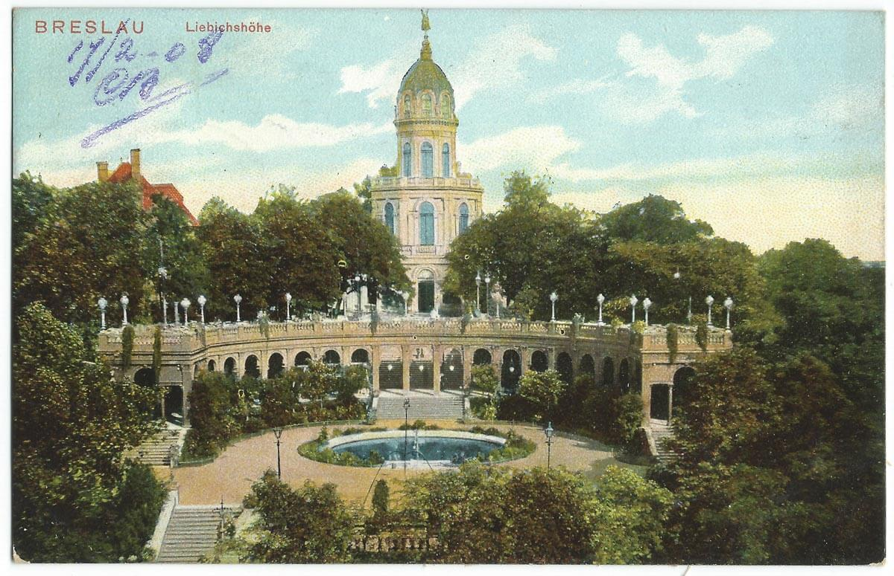

### Porozumienie USA - Arabia Saudyjska

Prezydent Franklin Delano Roosevelt i król Arabii Saudyjskiej Abd al-Aziz ibn Su’ud spotkali się na pokładzie okrętu USS Quincy, podpisując m.in. porozumienie o nawiązaniu stosunków dyplomatycznych.

### Eisenhower

Głównodowodzący zachodnim frontem generał Dwight Eisenhower skontaktował się z rządami aliantów (Francja, UK i USA) w sprawie spodziewanego kryzysu humanitarnego na zdobytych terenach.

Gospodarka niemiecka nie istniała, wszystko zostało podporządkowane wojnie, rolnictwo było uzależnione od pracy robotników przymusowych. Przywrócenie podstawowej sprawności systemu zajmie miesiące, w międzyczasie zabraknie żywności i środków transportu dla milionów ludzi. To, czym dysponowała armia, to było zbyt mało, nawet by zając się jeńcami wojennymi, których będzie kilka milionów. Ostrzegł przed klęską głodu, na ogromnych obszarach Europy nie będzie dość żywności dla Niemców, dipisów (DP ang. displaced persons), jeńców wojennych, a nawet własnej armii. Do tego głównym źródłem żywności miała być Wielka Brytania, która sama borykała się z wojennymi brakami żywności do tego stopnia, że trzeba było ja racjonować.

- Mark Felton Productions ["The Rhine Meadows Camps - What Really Happened?" [YT 12:53]](https://www.youtube.com/watch?v=icFKdMw7nT8)

### Drezno, Praga

<SeeAlso txt="Drezno bombardowanie 13-15 lutego 1945" url="/festung-breslau/article/drezno-bombardowanie" />

Zaraz po południu 62 bombowce B-17 z 398. grupy bombowców Eighth Air Force zrzuciły 152 tony bomb na gęsto zaludnione dzielnice centrum Pragi, zginęło 700 osób. Chwilę przed nalotem ogłoszono alarm bombowy, ale prażanie zlekceważyli go, bo ciągle je ogłaszano w celach ćwiczebnych. Jak się okazało, zła pogoda, popsuty sprzęt radionamierzania i silny wiatr spowodowały pomylenie miasta. Te bombowce były skierowane na stację rozrządową w Dreźnie. 120 km różnicy.

Od jednej z bomb, która spadła na Pragę, w atelier na Mánesově ulici 20 zginęło małżeństwo Štáfl. Otakar odkrył Tatry jeszcze przed Wielką Wojna. Po wojnie był tam regularnie, dzierżawił schronisko. W 1927 ożenił się z Vlastą. W 1928 wydano tekę z jego 120 akwarelami tatrzańskimi. Vlasta pisała książki dla dzieci i dziewczyn i też kochała góry. Zainicjowali założenie Cmentarza Symbolicznego na Popradzkim Stawie. Od 1947 znajduje się tam również tablica im poświęcona.

### UPA

Byczkowce w większości polska wieś w byłym powiecie czortkowskim województwa tarnopolskiego została napadnięta przez duży liczący ponad 500 osób oddział nacjonalistów ukraińskich, pomimo napotkania zaciekłego oporu, zabili ponad 100 Polaków.

### Warszawa

Jak już wiemy, jeszcze we wrześniu, podczas Powstania Warszawskiego, PKWN powołał Mariana Spychalskiego na Prezydenta Warszawy.

22 stycznia zaledwie pięć dni po zdobyciu Warszawy Spychalski powołuje do istnienia Biuro Organizacji Odbudowy m.st. Warszawy pod kierunkiem Jana Zachwatowicza. Kierownikiem biura jest Roman Piotrowski, a jego zastępcami Witold Plapis oraz słynny później i wzbudzający tyle kontrowersji Józef Sigalin. Pierwszym zadaniem było rozminowanie ruin i usunięcie licznych pułapek pozostawionych przez okupanta, dopiero potem inwentaryzacja i zabezpieczenie ocalałych reliktów zabudowy.

Dzisiaj biuro zostało przemianowane w Biuro Odbudowy Stolicy, które ostatecznie zadanie zawarte w nazwie wykonało. W kwietniu zatrudniało 200 osób, we wrześniu 400. Byli to architekci, studenci, technicy. Architekci byli pod wpływem przedwojennych kierunków: modernizmu i awangardy. Już wkrótce zostaną określone jako burżuazyjne i wsteczne.

Status i rola BOS została potwierdzona dekretem z 24 maja 1945 o odbudowie m. st. Warszawy.

### 3 Front Białorusi

Chojnice.

### 1 Front Białoruski

47 Armia zdobywa Piłę.

### 1 Front Ukraiński

1 Front Ukraiński na odcinku ścinawskim opór nieprzyjaciela już słabnie, dziś zdobyto Nową Sól, Zieloną Górę i Nowy Kisielin.

Awangarda Frontu dotarła do Nysy Łużyckiej naprzeciwko miejscowości Gross Gastrose, w nocy z zaskoczenia zdobyli most na Nysie Łużyckiej i zaczęli się przeprawiać na druga stronę.

### Ziemia Lubuska

- Wczoraj Stare Żabno, dziś Nowa Sól zdobyta, atak w kierunku Zielonej Góry. [„ZAPALNICZKI” W BOJU O NOWĄ SÓL I ZIELONA GÓRĘ](https://www.facebook.com/bobr1945/posts/3492797917500513)

### Lubsko

Dzisiaj prawie zapomniane Lubsko (niem. Sommerfeld) od drugiej połowy XIX wieku dzięki położeniu na skrzyżowaniu dwóch ważnych tras kolejowych, jednej z Berlina na Śląsk zbudowanej w 1846, przeżywało swój okres świetności.

To strategiczne położenie zostało docenione przez Armię Czerwoną - 28 stycznia zrzucono tam polska grupę zwiadowców "Wisła": Kazimierz Cieliszak, Franciszek Mazurkiewicz i Józef Kuriata. Mieli rozpoznać znajdujące się w okolicy węzła kolejowego jednostki wojskowe, zakłady zbrojeniowe i urządzenia obronne. Zadanie ułatwiła obecność dużej liczby Polaków robotników przymusowych, którzy udzielili grupie "Wisła" pomocy. 14 lutego Lubsko zostało zdobyte przez Armię Czerwoną, a polscy zwiadowcy o mały włos nie zostaliby rozstrzelani, dowodzący czerwonoarmistami oficer nie mógł bowiem uwierzyć w obecność polskiej jednostki. Uratowała ich interwencja oficera NKWD, któremu chciało się sprawdzić ich relację na wyższym szczeblu.

Oddziały pierwszoliniowe podążyły na Nysę Łużycką i zostawiły w mieście niewielkie siły. Jak były słabe świadczy fakt, że 16 lutego Lubsko zostało odbite przez SS Brygadę Dirlewangera. Jak to powiedział inny esesman Ernst Rode "*Była to brygada raczej świń niż żołnierzy*". To prawdopodobnie dziełem dirlewangerowców była egzekucja 76 jeńców francuskich, których ciała znaleziono w lesie koło cegielni. Nikt nie odpowiedział, za tę zbrodnię, nie ma nawet pewności, kto jej dokonał. 19 lutego Armia Czerwona wróciła, najpierw ostrzał artyleryjski i zdobycie miasta 20 lutego.

Jak bardzo sytuacja była skomplikowana i niepewna, świadczy fakt, że jeszcze tej nocy z 20 na 21 lutego przez Lubsko przeszły oddziały niemieckie zmierzające do Gubina.

### Brygada Dirlewangera / 36 Dywizja Waffen SS

Himmler zaproponował stworzenie jednostki wojskowej składającej sie z kłusowników. Zdolności myśliwskie tych ludzi mogły się przydać w operacjach SS. W 1940 powstała Wilddiebkommando Oranienburg (Jednostka Kłusowników Oranienburg). Do oddziału skierowano oficerów SS mających zły przebieg służby. Do września 1940 było to 300 ludzi. Himmler osobiście wyznaczył dra Oskara Dirlewangera (doktor politologii), weterana Wielkiej Wojny, później członka Freikorpsów. Od 1923 członek NSDAP. Alkoholik, sadysta, skazany za gwałt na 14-latce. W Hiszpanii walczył w Legionie Condor.

Wkrótce jednostka zaczęła rekrutować kryminalistów innego rodzaju, także złodziei, morderców, gwałcicieli, psychopatów. W ten sposób powstała słynna i niesławna jednostka SS złożona z kryminalistów. W 1940 na zachowanie jednostki w Lublinie poskarżyło się sam dowódca SS Friedrich-Wilhelm Krüger i w rezultacie Brygada została skierowana na Białoruś. Nazwa jednostki zmieniała się wielokrotnie, najczęściej jest określana jako Brygada Dirlewangera.

W 1943 Brygada składała się już z 3 batalionów. W 1944 wzięli udział w tłumieniu Powstania Warszawskiego razem z RONA Kamińskiego. Dirlewanger zasłynął tam z rozkazu wymordowania 500 dzieci bagnetami i pałkami, żeby oszczędzić amunicję.

Mathias Schenck, Belg służący w jednostce saperskiej:
>After the door of the building was blown off we saw a daycare-full of small children, around 500; all with small hands in the air. Even Dirlewanger's own people called him a butcher; he ordered to kill them all. The shots were fired, but he requested his men to save the ammo and finish them off with rifle-butts and bayonets. Blood and brain matter flowed in streams down the stairs

W grudniu 1944 było to już 4 tys. ludzi. Walczyli z powstaniem słowackim, potem na froncie węgierskim.

W lutym 1945 zostali skierowani na linię Odry i Nysy Łużyckiej. 14 lutego jednostkę przemianowania na 36 Dywizję Waffen SS (niem. 36. Waffen-Grenadier-Division der SS), w skład dywizji weszły jednostki regularne, pułk grenadierów, batalion saperów, batalion dział ppanc.

- Mark Felton Productions ["Dirlewanger Brigade - Himmler's Convict Legion" [YT 9:43]](https://www.youtube.com/watch?v=mwVDMh7ZzgU)

### Groß-Rosen

Wyzwolenie obozu koncentracyjnego Groß-Rosen. Więcej na temat samego obozu i ogólnie całego systemu obozów koncentracyjnych i obozów zagłady, historii represji i Holokaustu:

<SeeAlso txt="Obóz koncentracyjny Groß-Rosen (1940-45)" url="/festung-breslau/article/kl-gross-rosen" />

### Dolny Śląsk

21 Armia, atakując Strzelin, nie osiąga wielkich sukcesów. Zdobywa Wiązów.

Po wejściu do Strzegomia czerwonoarmiści dokonują egzekucji i gwałtów.

- Walki na autostradzie. [ŚMIERĆ NA MOŚCIE – OLSZYNA (ERLENHOLZ)??](https://www.facebook.com/groups/dolny.slask/permalink/1698473920305708/)

### 6 Armia

Opracowane na podstawie: Primke, Szczerepa "Kierunek Festung Breslau":

Ppo wczorajszym przesileniu spokojniejszy dzień choć nie bez przykrej niespodzianki.

218 Dywizja Strzelecka po zdobyciu Bielan Wrocławskich, Cesarzowic i Zabrodzia do godz. 0600 zajęła pozycję w Nowej Wsi Wrocławskiej, Bielanach Wrocławskich i Zabrodziu.

309 Dywizja Strzelecka zdobyła Zdobyszów i wspólnie z 218 Dywizją Cesarzowice.

Uderzenie w kierunku Złotniki - Kuźniki zagroziło odcięciem oddziałom niemieckim w Leśnicy i Miękini.

22 Korpus Strzelecki otrzymał zadanie natarcia na kierunku Klecina - Oporów i dotarcia do Ślęzy. O godz. 1200 dotarł rozkaz podporządkowujący 22 Korpusowi 8 Brygadę Artylerii Polowej, która krótko wspierała go w tym zadaniu. Krótko, bo o godz. 1700 Brygada została wyłączona z Korpusu i skierowana w rejon Biernatek gdzie miała przejść do obrony. Do końca dnia 22 Korpus zajął pozycje: 218 Dywizja Strzelecka Klecina, Oporów, Muchobór; 309 Dywizja Strzelecka Mokronos Dolny, Krzeptów (bez tych miejscowości).

74 Korpus rusza na Wrocław. Brak walk o Środę Śląską wskazuje, że 14 lutego została po prostu opuszczona i do godz. 1000 zajęta przez Korpus. Oddziały niemieckie z tego odcinka wycofują się w szyku zorganizowanym, w kilku miejscach zorganizowano obronę opóźniającą. Jeden na lini Żar - Żurawiniec i drugi na szosie Lutynia - Wróblowice. Na tym drugim broniła się 11 kompania pułku SS Besslein. Lutynię atakowała od zachodu 181 Dywizja Strzelecka. Jest to miejsce historycznego zwycięstwa Fryderyka II Wielkiego. Zwycięstwo w bitwie pod Lutynią otworzyło mu drzwi do odbicia Wrocławia, co było krytycznym warunkiem dla zwycięstwa w wojnie siedmioletniej, która dla Prus była być albo nie być. W Prusach każdy kojarzy Lutynię.

Dowódca 17. Dywizji generał Sachsenheimer opowiada, iż front został odepchnięty:
>także w Lutyni (niem. Leuthen), gdzie nigdy nie zapomnę tej staruszki, która siedziała w swoim domu, który był jej miejscem urodzenia, i przez zwykły telefon podawała mi meldunki o ruchach wroga. Nic nie mogło zmusić jej do opuszczenia domu rodzinnego.

Georg Hass, SS Besslein:
>Uderzenie rosyjskiej piechoty z czołgami było tak gwałtowne, że nasza kompania pospiesznie opuściła pozycje zajmowane pomiędzy Wróblowicami i Lutynią i dość bezładnie wycofała się do lasu przed miejscowością Żar.

O tym co się w Lutyni działo później dowiadujemy się z relacji żołnierza SS Hendrika C. Vertona:
>Do następnego ranka panował spokój, ponieważ Rosjanie plądrowali domy w Lutyni. Zostało to potwierdzone przez nasz patrol rozpoznawczy, który pod osłoną ciemności przedostał się do wsi. Po powrocie opowiadano o krzykach kobiet i dzieci wołających o pomoc. Cywile stali się łatwym łupem rosyjskich żołnierzy. Teraz niestety kobiety płaciły za swój upór.

Ostatnie zdanie odnosi się do sytuacji sprzed dwóch dni, kiedy jak opisuje z nutą goryczy, podczas gdy on i jego koledzy pomimo słabej pozycji usiłowali utrzymać Lutynię:
>W końcu po zachodniej stronie wioski ujrzeliśmy białe prześcieradła, którymi powiewały kapitulujące kobiety.

Symboliczne znaczenie ma klęska w miejscach o historycznym znaczeniu. Najpierw Krobielowice, teraz Lutynia.

359 Dywizja Strzelecka była na awangardzie włamania do miasta. Jej pułki 1198 i 1196 po przygotowaniu artyleryjskim nacierały na Żerniki i Muchobór. Do 1500 dotarły na przedpole Krzepotowa i Strachowic zagrażając lotnisku. Pułk 1194 zabezpiecza tyły na pozycji Ramułtowice - Zakrzyce - Gozdawa.

77 Polowy Rejon Umocniony z rozkazu marszałka Koniewa wszedł tego dnia w skład 6 Armii. Poruszał się brzegiem Odry i dotarł do linii Lenartowice - Białków.

Niemcy wycofują się na wszystkich odcinkach, schwytani jeńcy potwierdzają tworzenie rubieży wewnątrz miasta. Ponieważ dowództwo Twierdzy uznało, że atak nastąpi od północy, tam umieścili najlepsze jednostki. Niespodziewanie dla nich pierwszy poważny sowiecki atak nastąpił od południa, gdzie ulokowano najsłabszą jednostkę - Pułk Wehl (E) utworzony z personelu naziemnego Luftwaffe. Czyli żołnierzy, którzy nie tylko nie mieli doświadczenia w walce piechoty, ale nawet nie mieli do tego przygotowania. Byli w trakcie szkolenia.

Ahlfen:
>w nocnych walkach z 13 na 14 lutego pułk wycofano na ogólną linię Jerzmanowo-Klecina, unikając w ten sposób ataku przeważających sił wroga, na który w otwartym polu był on w żadnym stopniu przygotowany.

Miał wsparcie dywizjonu lekkich haubic. Pod Kleciną na lewej flance stykał się z 609 DP do zadań specjalnych. Po prawej stronie w rejonie Jerzmanowa miał Pułk A.

Natomiast oddziały 6 Armii kierują się na Wrocław. Do dzisiejszego wieczora umocniły się na rubieży skraj Domasławia - Bielany Wrocławskie - południowy skraj Oporowa i Krzeptowa - Żar - Brzezina - Prężyce. Przede wszystkim zaś zabezpieczyły zaplecze natarcia zdobywając Środę Śląską i Lutynię.

Oddelegowana do Strzegomia 273 Dywizja Strzelecka po zdobyciu Łażan naciera na wschód. Jest wysunięta, blokującą pozycją.

### 7 Korpus Zmechanizowany Gwardii

Opracowane na podstawie: Primke, Szczerepa "Kierunek Festung Breslau":

Trwa bezlitosna walka o Galowice. Dla 269 DP to ostatnia szansa na wyrwanie się z oblężenia. Jej dowódca generał Wagner nie dostał rozkazu pozostania w Twierdzy, usiłował więc wydostać oddział. Atak przypuściła w nocy z 13 na 14 lutego i trwał do rana.

Leo Hartmann z 311 Brygady Dział Szturmowych włączonej w skład 269 DP:
>Przydzieleni wraz z 10 działami samobieżnymi do 269 Dywizji Piechoty, 12 i 13 lutego w okolicach Wrocławia próbowaliśmy przeszkodzić w połączeniu się Rosjanom nacierającym z przyczółków w Brzegu i Ścinawie. Na próbie się skończyło. Na południe od naszej grupy szturmowej Rosjanie zamknęli pierścień wokół Wrocławia i rozdzielili nas z naszym taborem. W nocy z 13 na 14 lutego chcieliśmy się przedrzeć na południe. Ale wieś Galowice, przez którą musieliśmy przejść, byłą naszpikowana działami przeciwpancernymi i granatnikami. Stało tam również wiele czołgów. Zamiar przedarcia nie powiódł się. O świtaniu jako ostatni przejechałem z moim działem, mijając wypalone pojazdy. Zebraliśmy się w majątku w Karwianach. Trzeba było przewieźć do Wrocławia pozostałych 6 dział naszej 311 Brygady Dział Szturmowych.

O godz. 0300 zaatakowały 2 bataliony grenadierów pancernych. Użyto nawet zdobycznego czołgu T-34, który miał udawać sowieckie siły, do pewnego momentu trik się udawał, czołg jednak został rozpoznany i zniszczony. Z ogromnym poświęceniem odpierano kolejne szturmy, Niemcy wdarli się do wsi. Dywizja została odparta, prawdopodobnie części piechoty się udało przedostać.

Robert Primke, Maciej Szczerepa "Kierunek Festung Breslau":
>Wielokrotnie dochodziło do walki wręcz, używano kolb, gołych pięści. Szeregowiec Bajdimir Pakyrbajew z 2 Batalionu Piechoty Zmechanizowanej 25 Brygady Zmechanizowanej Gwardii w ulicznym boju zastrzelił z automatu sześciu Niemców, w tym dwóch oficerów. Jednego z nich, gdy zaciął się automat, zatłukł kolbą.

Rano przyszedł rozkaz by 269 DP pozostała w Twierdzy, jej dowódca generał Wagner dał jednak żołnierzom wolną rękę w kwestii wyrwania się z kotła nocą z 14 na 15 lutego.

Wciąż trwały walki na odcinku Gniechowice - Magnice.

Wczesnym popołudniem oddziały 7 Korpusu Zmechanizowanego Gwardii otrzymały kolejno po sobie kilka rozkazów (stąd zamieszanie w relacjach), ostatni z nich nakazywał udanie się na spoczynek w rejonie na południe od Budziszowa Wielkiego (zachodni kraniec rejonu operacyjnego 6 Armii), uzupełniły paliwo w Krzyżowicach i udały się w drogę na wyznaczony przez generała Głuzdowskiego region: Jenków - Damianowo - Konary - Drogomiłowice gdzie pozostał do 26 lutego.

Wojska pancerne walczące o zamknięcie korytarza zluzowały zajmowane pozycje, zanim zostały przejęte przez biedną, szarą piechotę 5 Armii Gwardii od wschodu i 6 Armii od wschodu.

Odpowiada za to m.in. generał Rybałko, dowódca 3 Gwardyjskiej Armii Pancernej, jak pisze Ryszard Majewski:
>który dążąc do szybkiego wznowienia natarcia z rejonu Bolesławca na zachód, nalegał na bezzwłoczny powrót obu działających pod Wrocławiem korpusów. W związku z tym jednostki pancerne i zmechanizowane opuściły zajmowane pozycje jeszcze przed nadejściem luzujących je dywizji 5 Armii Gwardii (dotyczy to zwłaszcza 7 Korpusu Pancernego Gwardii w rejonie między Kątami Wrocławskimi a Gniewoszowem).

Przypadkiem podczas tego krótkie rozluźnienia pozycji sowieckich nastąpił poważny atak 19 Dywizji Pancernej niemieckiej. Tym razem z południa, od strony Świdnicy. Atakująca na linii Mirosławiec, Gniechowice, Małuszów, Tyniec Mały grupa mająca w składzie m.in. 10 niszczycieli czołgów Nashorn przebiła drogę do Twierdzy. Kontakt ten utrzymano przez kilkanaście godzin do 15 lutego.

W dniach 26-28 lutego 7 Korpus Zmechanizowany Gwardii zajął rejon Kąty Wrocławskie - Krobielowice - Strzeganowice mając zadanie zabezpieczyć atakującą 6 Armią przed atakiem z południa. 2 marca został skierowany do Ujazdu k. Kędzierzyna-Koźla gdzie został podporządkowany 52 Armii.

### Wrocław

W ciągu ostatnich kilku dni 269 DP, niedobitki 17 DP i sztab grupy korpuśnej Wrocław zdołały się wymknąć z Twierdzy. Część w ostatniej chwili.

Walentynki mające korzenie w starożytności, są obecnie w Niemczech obchodzone dokładnie na takiej samej zasadzie jak w Polsce, jako świeży import kulturowy. W 1945 wiedzą o nim tylko Niemcy dobrze znający kulturę anglosaską. Na 14 lutego 1945 przypada inne święto popularne w Niemczech i znane w Polsce - Środa Popielowa (Der Aschermittwoch), pierwszy dzień Wielkiego Postu, czterdziestodniowego okresu wyczekiwania na święto śmierci i zmartwychwstania Chrystusa. W oblężonym Wrocławiu ten Wielki Post miał trwać znacznie dłużej, a to, co 6 maja zobaczą zwycięzcy i zwyciężeni w niczym nie będzie przypominać zmartwychwstania. Przez następne 80 dni, przez prawie 12 tygodni, Wrocław będzie codziennie masakrowany, niszczony, podpalany, bombardowany; kwitnące dobrze zorganizowane miasto zamieniane podpaleniami i wybuchami w gruzy śmierdzące trupim swądem, gęsty duszący smog zakryje słońce, ale będzie dość jasno by było widać rzędy trupów ułożone wzdłuż ulicy.

Wrocław wiosną 1945 - udzielne księstwo Gauleitera Karla Hanke. Gauleiter jest problemem dla kronikarzy opisujący wydarzenie dzień po dniu, żeby przedstawić go w pełnym świetle, należałoby przedstawić jego czyny, do samego końca. Ale zrobić to teraz to wyprzedzić bieg wydarzeń, pozostaje więc śledzić go i podążać za nim w milczeniu, zdać relację jak z niemej pozbawionej komentarza kroniki filmowej, pokazywać skutki jego władzy, ambicji. Po gorączkowej ewakuacji, dniach amoku, kiedy wygnano na mróz i poniewierkę 700 tysięcy ludzi, nastąpiły trzy tygodnie niepewności, nadziei na to, że jest jakieś miejsce, gdzie można się ukryć, przeczekać, ocaleć. Dziś, i to minęło, zamknęły się drogi wyjścia. To już nie jest tak, że wszyscy mówią o wojnie, dziś wszystko, co się robi, jest jakimś udziałem w wojnie. Zimne dreszcze ogarnęły miasto i jego mieszkańców, cień przesądzonego losu, fatum gracza patrzącego na rozdane karty. Całe kwartały będą wstrząsane dreszczami, z hukiem i w eksplozji wybuchów będzie odchodzić w przeszłość duma Śląska, dreszcze, odrętwienie i konwulsje agonii rozłożonej na wiele tygodni, planowej i realizowanej na wiele sposobów egzekucji. Tym było oblężenie Wrocławia.

*Wzgórze Partyzantów (niem. Liebichshohe) 
Źródło: By nieznany - Vintage postcards private collection, Domena publiczna, [Link](https://commons.wikimedia.org/w/index.php?curid=36745382)*

Nowa siedziba sztabu twierdzy w bunkrze przy Wzgórzu Partyzantów zgłosiła gotowość bojową, jak pisze von Ahlfen:
>Kolejnym niemal symbolicznym wobec osiągniętej teraz gotowości bojowej aktem była przeprowadzka dowództwa z "cywilnych" gabinetów przy ulicy Gajowickiej (Gabitzenstraße) do przygotowanego tymczasem stanowiska bojowego w podziemiach Wzgórza Liebicha, Przeprowadzka ta odbyła się zresztą w samą porę. 14 lutego bowiem, kiedy przeniesiony już oddział właśnie zameldował gotowość bojową, bomby spustoszyły gabinety w dotychczasowej siedzibie dowództwa. Na konieczną przeprowadzkę był więc już najwyższy czas. Miejsce to, oferujące sztabowi, jego rozległym urządzeniom telekomunikacyjnym oraz licznym, dzielnym i wiernym łącznikom oddziału, podziemne schronienie w prostych warunkach typu polowego i wystarczające do zadań sztabu stanowiska pracy ze stałym sztucznym oświetleniem, wybrano z powodu jego centralnego, korzystnego pod względem komunikacyjnym położenia, instalacji telekomunikacyjnych oraz zalet budowlanych, zrazu jednak tylko pozornych. Część tych pomieszczeń kilka lat wcześniej rozbudowano jako centralę dowodzenia obrony przeciwlotniczej Wrocławia. Także dlatego podjęto decyzję o wyborze tego miejsca. Tym większe było zdziwienie, gdy pewien sprytny oficer sztabu wbrew początkowemu niedowierzaniu twierdził, a potem dowiódł za pomocą szybko zorganizowanych planów budowlanych, że betonowy strop bunkra został wybudowany bez żelaznego zbrojenia. Ten lepszy "domek z kart" został natychmiast umocniony przez pracowitych saperów z Volkssturmu, którzy z okolicznych. zamkniętych dla ruchu kołowego ulic wyrwali dostateczną ilość słynnej dużej kostki brukowej ze śląskiego granitu i według starych wzorów ułożyli ją na zbyt słabym stropie w postaci warstwy tłucznia. Dzięki temu strop już pod koniec lutego wytrzymał kilka uderzeń. Na uznanie za swą czujność zasługuje porucznik Seewann, wcześniej odkomenderowany do sztabu z batalionu Tenscherta. Sztab zawdzięcza mu życie i możliwość działania. Krótko potem czerpiąc lekcję z tego doświadczenia w dużej mierze z inicjatywy owego, jak się okazało, "specjalisty od stanowisk bojowych w twierdzy", znaleziono i prewencyjnie rozbudowano kolejne stanowisko bojowe w wielusetletnich podziemiach Biblioteki Uniwersyteckiej na Piasku. Porucznik Seewann wybudował na wschodzie jeszcze jedno stanowisko bojowe, które jednak nigdy nie zostało użyte.

Ten przydługi cytat pokazuje kilka rzeczy, von Ahlfen dziarskim tonem opowiada o przeniesieniu siedziby sztabu, w mieście będącym od wielu dni obiektem bombardowania, ale zamiast "*zrobiliśmy to w ostatniej chwili*" pisze "*był więc już najwyższy czas*". Później okazuje się, że schron jest wadliwy, ale w jego narracji jest to tylko pretekst, by pochwalić najpierw "*sprytnego oficera*" a potem "*pracowitych saperów*". Najciekawsze jest na końcu, o nowej siedzibie sztabu na Piasku będzie jeszcze mowa, dokonano tam niewyobrażalnego wręcz wandalizmu, ale nie obciąża to von Ahlfena, bo już nie był komendantem.

A tak przy okazji. Czy ktoś wie, gdzie dokładnie znajdowało się to stanowisko bojowe na wschodzie?

Ksiądz Peikert wczoraj obojętnie wylicza straty, pojedyncze budynki i charakter zniszczeń, ale zaczyna się poddawać, rezygnuje wobec skali zniszczeń pisze:
>Nadchodzą również wiadomości o dużych zniszczeniach na całym obszarze miasta. [...] Chociaż nie dokonano jeszcze na Wrocław żadnych wielkich nalotów bombowych, to jednak stopniowo rosną szkody w całym mieście w następstwie codziennych zrzutów. [...] Nie ma więc prawie ulicy nieuszkodzonej

a dziś:
>Rano niezwykle duża frekwencja na nabożeństwie. Ludzie garną się do Stołu Pańskiego i do przyjęcia krzyża popielcowego z poświęconym popiołem. W południe nieprzyjacielski nalot bombowy na południe miasta i ostrzeliwanie przez nieprzyjacielską artylerię. Wyrządzono duże szkody w tej dzielnicy zwłaszcza na Sudeckiej. [...] Południe miasta oczekuje szturmu nieprzyjaciela. Nie chce on zdobywać miasta od północy, gdzie musiałby sforsować stojące na przeszkodzie liczne odnogi Odry, lecz od południa. Na cmentarzu otaczającym kościół św. Maurycego za murem osadza się gniazdo karabinu maszynowego skierowanego na południowy wschód. Udało się przeszkodzić w zainstalowaniu posterunku obserwacyjnego na wieży naszego kościoła. Dzień i nocą potężne wstrząsy od wysadzania starych domów w mieście na gruz pod barykady. Zburzono tak te domy, które zostały przeznaczone do rozbiórki w planach regulacji urbanistycznej.

Chodzi o rejony obecnej Trasy W-Z.

Ksiądz Walter Laßmann zaczyna swą relację w minorowym nastroju:
>Przenieśliśmy się do budynku schronu przeciwlotniczego w budynku przy Ofenerstraße 30 (pl. Krakowska). Był to dzień smutny i posępny. Mogliśmy w nowym miejscu pozostać tylko jeden dzień.

To wszystko.

Hugo Hartung na lotnisku w Strachowicach, wczoraj:
>Nagle znowu nastaje zima. Mglisty dzień z przelotnymi opadami śniegu. [...] Odkąd nie ma prądu, nie możemy już słuchać radia.

Dziś natomiast:
>Przez cały dzień Strachowice pod ciężkim ostrzałem artylerii. Granaty spadają na dachu murowanych zabudowań, z których rozlega się łoskot jak podczas wiosennej burzy. Prawie wszystkie drogi w bazie są w polu widzenia wroga, można je pokonywać tylko pojedynczo i biegiem. [...] Nasze nastroje sięgają dna, gdy ogłoszony zostaje rozkaz naczelnego dowództwa twierdzy: odtąd wchodzimy w skład wojsk głównej linii frontu, której należy bronić "do ostatniego człowieka". Wszelkim próbom jej opuszczenia "należy w razie potrzeby przeciwdziałać najbrutalniejszymi środkami". Tymczasem mało który z nas ma pojęcie o wojaczce, a w rubryce wykształcenie naszej książeczki wojskowej znajduje się tylko wpis "przeprowadzono szkolenie w zakresie dyscypliny". Ile może zdziałać takie wojsko? O drugiej w nocy naszym schronem wstrząsa tak silna detonacja, że mamy wrażenie, jakby mury waliły nam się na głowę. Potem dowiadujemy się, iż eksplodował skład amunicji. Z potajemnym ukontentowaniem zdajemy sobie sprawę, że teraz nareszcie pozbyliśmy się tych okropnych pięćsetfuntowych bomb.

Wrocław jest w przeważającej większości luterański, a luteranie również świętują Środę Popielcową. Ale pastor Ernst Hornig w ogóle o święcie nie wspomina, zajęty jest oblężeniem. Przytacza relację generała Sachsenheimera:
>w tych dniach [11-13 lutego] zaatakowali po obu stronach autostrady w kierunku Kąty Wrocławskie - Wrocław i tak umocnili się na tym terenie, że nie można było już ich z niego przepędzić. [...] Główny przebieg, jak i znaczenie tych walk polegały na tym, że wróg przez niedający się powstrzymać atak okrążył teraz Wrocław.

Rosjanie wszędzie, nawet w bezpośredniej bliskości Wrocławia mają przewagę w ludziach, sile ognia, sprzęcie, także w woli walki. Opowieść Horniga z tych krytycznych dni jest równie chaotyczna, jak sytuacja na froncie. Pisze on jednocześnie, że dwa pociągi oczekujące od 12 do 14 lutego czekały na możliwość wyjazdu, a 14 lutego dwa pociągi jeden sanitarny Wehrmachtu i drugi zajęty przez chorych cywili i diakonisy z Bethanien musiały zostać opróżnione, chorzy pozostawieni przez kilka dni bez opieki w pociągach przynajmniej mieli nadzieję, teraz wrócili do szpitali, wiedząc że już nie uciekną. Jednocześnie podaje optymistyczny komunikat Wehrmachtu z 13 lutego mówiący o nieudanej próbie oblężenia miasta i potem:
>W dniu 14 lutego udało się niespodziewanie na krótko otworzyć od zewnątrz połączenie na południu miasta. Dzięki temu niedaleko Bielan Wrocławskich udało się wywieźć jeszcze 1 tysiąc rannych i amunicję. Potem ta żelazna obręcz była szczelnie zamknięta przez prawie trzy miesiące

Nie jest jasne, dlaczego miano by wywozić z Twierdzy amunicję, ale taką liczbę ludzi można wywieźć tylko koleją, przez Bielany przebiega linia kolejowa na południe do Kobierzyc, gdzie rozdwaja się na południowy zachód do Sobótki i na południe do Jordanowa Śląskiego, ta druga pozycja ma w tym momencie walk duże znaczenie, jest miejscem, gdzie przegrupowują się siły niemieckie po rozbiciu obrony wokół Oławy.

Zamknięcie pierścienia oblężenia jeszcze nie nastąpiło, ale sytuacja Twierdzy od dawna była beznadziejna. Nie było już bezpiecznej drogi ewakuacji, jedno lotnisko wciąż w rękach niemieckich nie nadawało się do już użytku, wróg widział je gołym okiem. Drugie było nieustannie bombardowane. Ostatni transport wyjechał dzisiaj i było jasne, że następnego już nie będzie. Von Ahlfen tak przedstawia sytuację:
>Na Wrocław nacierały wówczas: 1 dywizja z zachodu na Leśnicę, 1 dywizja z okolic Kątów w kierunku południowo-zachodnich granic Wrocławia oraz silniejsza grupa (3-4 dywizje) w kierunku południowych granic Wrocławia

dalej z zadowoleniem opowiada o chwilowym powstrzymaniu wroga, o tym, że:
>na południe od Kleciny, na drodze wiodącej pod wiaduktem autostradowym saperzy za pomocą "Goliatów" za jednym zamachem zniszczyli 6 nieprzyjacielskich ciężkich dział przeciwpancernych

Rzeczywiście na początku lutego koleją dotarły 2 plutony saperów z poligonu Königsbrück (Saksonia), każdy pluton to 60 ludzi wyposażonych w 48 Goliatów.

oraz
>Nocą z 13 na 14 lutego z frontu odrzańskiego na linię Bystrzycy powrócił pułk Besslein, który miał teraz przed oczami swój garnizon w Leśnicy, znajdujący się już na terenie wroga.

kończy zaś stwierdzeniem
>Tak czy owak, począwszy od 14 lutego, front wokół Wrocławia miał odpowiadającą tamtym trudnym warunkom przejrzystą strukturę.

Tak przedstawiała się sytuacja Wrocławia w Święto Zakochanych i Środę Popielcową zarazem. Na całej długości frontu siły obrońców przeszły do defensywy, oddały walkę z przyczółkami, wróg już był wszędzie naokoło i zdominował pole walki. Pierścień okrążenia właśnie się domykał. Bolesław Dolata pisze jednak:
>W nocy z 13 na 14 lutego oddziały 7 korpusu zmechanizowanego gwardii połączyły się z wojskami 32 korpusu piechoty 5 armii gwardii, zamykając ostatecznie pierścień wokół Wrocławia. "Festung Breslau" została okrążona. W "kotle" znalazł się około 80-tysięczny garnizon twierdzy.

Jednak połączenie wojsk to jeszcze za mało. Pozostaje jeszcze umocnienie pozycji, domknięcie pierścienia i uformowanie frontu. To wszystko nastąpi wkrótce.

### Odnośniki

- [Egzekucja pod platanem](http://historia-swidnica.pl/egzekucja-pod-platanem/)
- zielonagora.naszemiasto.pl ["Żołnierze Armii Czerwonej zajęli Zieloną Górę"](https://zielonagora.naszemiasto.pl/zolnierze-armii-czerwonej-zajeli-zielona-gore/ar/c10-4012920)
