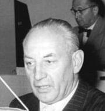

### Berlin

Za: ["Berlin 1945: Tagebuch einer Großstadt"](https://www.imdb.com/title/tt12264166/) - [Berlin 1945 Tagebuch einer Großstadt teil 1 DOKU](https://www.youtube.com/watch?v=zUBXgDM0VjY)

Adolphe Jung, francuski chirurg:
>Dziś jestem sam w klinice nie ma prof. Sauerbrucha ani jego zastępcy. Kazano nam zanieść pacjentów do schronu lub przynajmniej do piwnic. Najpierw dzieci i pacjentów prywatnych, potem kobiety. W schronie spotkałem profesora biologi, pół-Żyda. Powiedział mi, że w Berlinie wciąż ukrywają się Żydzi. Od miesięcy, a nawet od lat mieszkają w piwnicach lub na strychach pod opieką przyjaciół i kolegów.

Ferdinand Sauerbruch był znakomitym chirurgiem, uczniem Mikulicza-Radeckiego. W ciągu 14 lat był nominowany do Nagrody Nobla aż 54 razy. Zmarł w Berlinie w 1951 w wieku 76 lat.

Horst Lange, kapral:
>Miasto umiera i nie da się go ocalić. Ludzie sa zmęczeni, apatyczni. Stróż uspokaja płaczące kobiety "dobrze że spoczął w zbiorowej mogile, przynajmniej nie jest sam".

Henri Daries, francuski robotnik przymusowy:
>Morale Niemców leci na łeb na szyje. Każdy nalot potęguje uczucie rozpaczy. To jednak nie ma wpływu na codzienność. Inwigilacja policyjna tylko się pogorszyła.

### 2 Front Białoruski

Tuchola, poligon Heidekraut w Wierzchucinie. Trenowały tam załogi V-2.

### Stargard

Początek bitwy pancernej o Stargard Gubiński (najbardziej prawdopodobne, bo Stargard Szczeciński został zdobyty dopiero 5 marca, Starogard Gdański 6 marca, ale Stargard Gubiński, to mała wioska na drodze do Gubina).

### 1 Front Białoruski

Bitwa o Poznań. W wyniku ostrzału radzieckiej artylerii spłonęła katedra św. Apostołów Piotra i Pawła. Ocalały jedynie kaplice, wypalone wnętrze odsłania pozostałości z okresu gotyku.

### 1 Front Ukraiński

Dotychczasowe zdobycze nad Nysą Łużycką na lewym brzegu Bobru stanęły pod znakiem zapytania. Udał się tam marszałek Iwan Koniew i rozkazał rzucić do walki wszystkie rezerwy operacyjne, a nawet wycofać oddziały zza Nysy Łużyckiej.

### Strzegom

Walki na północ od Strzegomia. Duże straty 7 Korpusu Pancernego Gwardii.

- [Pancerne starcie koło Strzegomia: Żółkiewka – Wieśnica– 15 lutego 1945 r.](https://www.facebook.com/bobr1945/posts/3703161219797514)

### 6 Armia

22 Korpus domykał blokadę Wrocławia od południa, atakując na wysokości Oporowa i Kleciny. Choć meldunki wskazują co innego, do końca dnia nie udało się opanować żadnego z tych osiedli.

218 Dywizja Strzelecka przełamała rubież Klecina - Wysoka - Karwiany. Zdobyła wieś Wysoką, wschodnią część Kleciny i stację kolejową. W Komorowicach uzyskała połączenie z 5 Armią Gwardii. Sztab Dywizji został ulokowany w Zabrodziu.

Na jej lewej flance 309 Dywizja Strzelecka nacierała na Oporów - Muchobór. Pułk Wehl miał tam do dyspozycji 14 armat plot (Flak 18?) na wzniesieniu pomiędzy Oporowem a Muchoborem. Tego dnia Dywizja zdobyła Mokronos Górny i Mokronos Dolny i wdarła się do Oporowa. Jej sztab znajdował się w Zybiszowie.

22 Korpus wdzierał się już w tkankę miejską, natomiast będący na lewej flance Armii 74 Korpus miał przed sobą cały przemieszany urbanistycznie obszar od Strachowic przez przedpole Leśnicy po Żurawiniec - Wilkszyn. Broniły się tam Pułk A oraz oddziały SS Besslein, których koszary znajdowały się w Leśnicy. Sowietów szachowano zachodzącymi na siebie strefami ostrzału. Dobrze zorganizowane punkty oporu były trudne do przełamania bez wsparcia broni pancernej. Silny oddział niemiecki znajdował się w rejonie Brzezinka Średzka - Żurawiniec, inny w lesie na wschód od Lutyni. W nocy przeprowadził patrol w zajętej przez sowietów wsi. Jak pisze Verton:
>Rosjanie byli zajęci plądrowaniem domów.

Rano 181 Dywizja Strzelecka przeprowadziła rozpoznanie na kierunku natarcia i po przygotowaniu artyleryjskim zaatakowała o godz. 1300 odcinek Żar - Mrozów. Dowództwo Dywizji znajdowało się we Wróblowicach. W lesie na południe od Żar broniła się 11 kompania SS Besslein i została stamtąd wyparta do Żar, a potem wycofana do Leśnicy.

Na prawej flance Korpusu walczyła 359 Dywizja Strzelecka, tego dnia zdobyła Krzeptów. O Strachowice walczono bez powodzenia. Lotnisko było bronione przez dwa bataliony mające dużą ilość artylerii. Z linii Samotwór - Gałów szykowano atak na Jerzmanowo.

77 Polowy Rejon Umocniony na odcinku północnym osiągnął linię Wilkszyn - Piskorzowice.

Znajdująca się po drugiej stronie Wrocławia oddana pod komendę 6 Armii 294 Dywizja Strzelecka zdobyła Kłokoczyce (obecnie osiedle Zgorzelisko) i zaczęła walkę o Psie Pole.

273 Dywizja Strzelecka wciąż znajduje się w rejonie Strzegomia.

Komunikat operacyjny Armii z godz. 2330:
>Przeciwnik elementami 19 i 8 Dywizji Pancernej i innymi samodzielnymi oddziałami (...) w ciągu nocy i w pierwszej połowie dnia na prawym skrzydle armii organizował kontrataki siłami od kompani do batalionu przy wsparciu 5-10 pojazdów pancernych. W centrum i na lewym skrzydle armii stawiał zacięty opór, mając oparcie w miejscowościach i osiedlach, które przekształcone zostały w silne punkty oporu, ale pod uderzeniami oddziałów armii z dużymi stratami odchodził na Wrocław.

Wciąż istnieje utworzone wczoraj połączenie niemieckiej 19 Dywizji Pancernej z garnizonem Twierdzy w Tyńcu Małym. Po kilkunastu godzinach dziś za dnia lub w nocy z 15 na 16 lutego korytarz ten został ostatecznie przecięty przez 7 Korpus Pancerny Gwardii, który powrócił ratować sytuację. Wrocław jest okrążony trwale.

Wieść ta obiega cały 1 Front Ukraiński i wywołuje krótkotrwałą euforię.

### Wrocław

Ocenia się, że walki o miasto potrwają może ze 4 dni.

Takie szacunki wynikają z błędnej oceny liczebności garnizonu Twierdzy. Po tym, jak 269 DP generała Wagnera wymknęła się z okrążenia, sowieci uważają, że cała załoga pozostała w mieście to 20 tys. żołnierzy niemających szczególnej wartości bojowej. Jak bardzo rzeczywistość byłą odmienna świadczy fakt, że po krwawych walkach trwających trzy miesiące do niewoli dostało się 45 tys. żołnierzy. Majewski do tego dodaje 6 tys zabitych i 6 tys. ewakuowanych rannych co w sumie daje 57 tys. pierwotnej liczebności załogi Twierdzy. Głuzdowski 8 maja melduje, że we Wrocławiu broniło się 65 tys. żołnierzy - ma jednak wyraźny interes w tym, żeby tę liczbę przeszacować.

Co gorsza, 6 Armia po stratach wojennych i oddaniu 7 Korpusu Pancernego Gwardii była niewątpliwie najsłabszą Armią Frontu. 4 lutego liczyła niecałe 50 tys. żołnierzy i taki sam stan miała w połowie lutego. Wybitnie źle przedstawiają się te proporcje, jeżeli wziąć pod uwagę liczbę żołnierzy w batalionach piechoty 30 do 11 a później 15 tys. żołnierzy.

Pierścień składał się z:

- 218 DP Bielany Wrocławskie
- 309 DP pod Kleciną, Oporowem i przy stacji Muchobór Wielki
- 359 DP Muchobor Wielki i Strachowice
- 181 DP Maślice, Żerniki i dolny bieg Ślęży
- 34 Korpus Piechoty w okolicach Tresna i Mokrego Dworu
- 294 DP na północy 

Z chwilą odcięcia Wrocławia garnizon Twierdzy przestaje podlegać grupie korpuśnej Wrocław. Cała 609 Dywizja i wszystkie jednostki wojskowe we Wrocławiu od tej pory podlegają wyłącznie komendantowi. Tej nocy Wrocław dostaje pierwszy zrzut lotniczy.

Koniec formowania wrocławskiego Volkssturmu, pomimo odesłania do Saksonii wszystkich volkssturmistów III i IV rzutu, pod kierownictwem Obergruppenfuhrera SA Herzoga udało się sformować 38 batalionów, każdy po 4 kompanie, do tego 2 bataliony HJ (chłopcy 16-18 lat). Łączna liczebność Volkssturmu 15 tys. ludzi. Jak to wykazała praktyka bitewna, Volkssturm nie tworzył jakościowo gorszych jednostek, w jednakowym stopniu przyczyniał się do strat sowieckich.

Składający się z jeńców, których udało się namówić na współpracę, Związek Oficerów Niemieckich zwraca się do komendanta Twierdzy z propozycją kapitulacji. Mówi o bezsensie dalszej walki:
>Pełen poważnych trosk o los miasta Wrocław, zwracam się do Pana z polecenia generała von Seydlitza, wiceprezydenta Komitetu "Wolne Niemcy". 
>Pan zna niebezpieczne położenie Wrocławia. Znaczne siły armii rosyjskiej posuwają się naprzód na zachód, od północy i od południa miasta. Sam Wrocław został okrążony i stał się terenem walk.[...] 
>Wrocław może zostać uratowany, jeśli Pan - z pobudek wyłącznie świętej odpowiedzialności wobec narodu i ojczyzny - podda miasto bez walki[...] 
>Pan sam wie, że to czego Hitler żąda dziś od dowództwa i żołnierzy Wehrmachtu, nie stanowi już bohaterskiej walki, lecz przestępstwo.

Apel podpisał pułkownik Luitpold Steidle dowódca 767 pułku 376 dywizji piechoty. Nie wiadomo czy apel dotarł do generała von Ahlfena.

*Luitpold Streidle w 1956 (1898-1984) 
Źródło: Wikipedia By Bundesarchiv, Bild 183-40306-0012 / Wittig; Blumenthal / CC-BY-SA, [CC BY-SA 3.0 de](https://creativecommons.org/licenses/by-sa/3.0/de/deed.en), [Link](https://commons.wikimedia.org/w/index.php?curid=37119753)*

Von Ahlfen najpewniej już w nowym stanowisku dowodzenia. w samym sercu Twierdzy wezwał do trwania w walce. Frontowa Schlesische Tageszeitung przekazała:
>Wrocławianie! 
>Twierdza Wrocław została okrążona. Nie stało się to dla nas niespodziewanie, ponieważ twierdza zawsze musi być przygotowana na okrążenie i na walkę w okrążeniu. Chodzi tylko o to, aby każdy człowiek w twierdzy mimo okrążenia był gotowy do walki[...]. 
>W związku z obroną należy się liczyć z dalszymi wypadkami burzenia, np. także mostów odrzańskich. Nie dopuśćcie do zachwiania waszej postawy! Zarządzam tylko to, co dla obrony jest niezbędne i konieczne ze względów wojskowych, a niezależnie od wszystkiego, co by się stać mogło, pamiętajcie, jak wielkie zadanie stoi przed Wrocławiem i jego załogą.

### ENIAC

Bez spektakularnych zwrotów akcji i dających się wyznaczyć punktów zwrotnych odbywa się proces tworzenia najbardziej zaawansowanej maszyny XX wieku - komputera. W okresie WWII mamy przynajmniej trzech kandydatów do tego miana:

- maszyny kryptoanalityczne Colossuss w Bletchley Park, dzieło Alana Turinga
- Z3 Konrada Zuse (Niemcy)
- Atanasoff-Berry Computer zbudowany na Uniwersytecie Stanu Iowa
- ENIAC (Electronic Numerical Integrator and Computer) zbudowany na Uniwersytet Pensylwanii

Za najważniejszy z nich uważany jest ten ostatni, głównie z tego powodu, że w konstrukcja wszystkich późniejszych komputerów miała się z niego wywodzić, podczas kiedy Colossusy zostały wszystkie zniszczone na rozkaz Churchilla, a Z3 nie odniósł sukcesu. Tylko w USA był wystarczający potencjał biznesowy i właściwe połączenie wojska, które chciało rozwoju zaawansowanych technologii i uniwersytetów zainteresowanych w realizacji tych projektów. ENIAC był maszyną wielozadaniową od samego początku, w zasadzie miał wyliczać dane balistyczne dla artylerii, ale szybko okazało się, że najwięcej mocy obliczeniowej potrzebuje projekt Manhattan. To dlatego przez całą wojnę było tak cicho o budowie tej maszyny.

Uruchomiono ją 10 grudnia 1945, a za rok właśnie 15 lutego 1946 odbędzie się pierwsza publiczna prezentacja komputera. Prasa okrzyknęła ENIACA mianem "Giant Brain". Żeby zainteresować dziennikarzy, zamontowano specjalny panel losowo zapalający kontrolery. Później taki mrugający panel stał się sztandarowym wyobrażeniem mainframe'a w mediach i SF.

ENIAC obliczał tor balistyczny w 30 sekund, człowiekowi zajmowało to 20 godzin.

Tutaj na marginesie trzeba oddać honor brytyjskim Colossusom, których roli się nie docenia. Colossusy, owszem zniszczono a ludzie przy nich pracujący, a przede wszystkim ich twórcy zachowali tajemnicę. Jednak, choć nie mogli ujawnić szczegółów konstrukcyjnych Colosussów, to nic nie stało na przeszkodzie w wykorzystaniu wiedzy zdobytej przy ich budowie. Tak narodziła się brytyjska linia wczesnych superkomputerów z Manchester Baby na czele. I tu jeszcze raz trzeba podkreślić rolę Alana Turinga w powstaniu informatyki, bo właśnie 19 lutego 1946, czyli 4 dni po historycznym pokazie ENIAC-a, przedstawił projekt Automatic Computing Engine (ACE) - teoretyczne opracowanie programowalnego komputera z pamięcią stałą.
