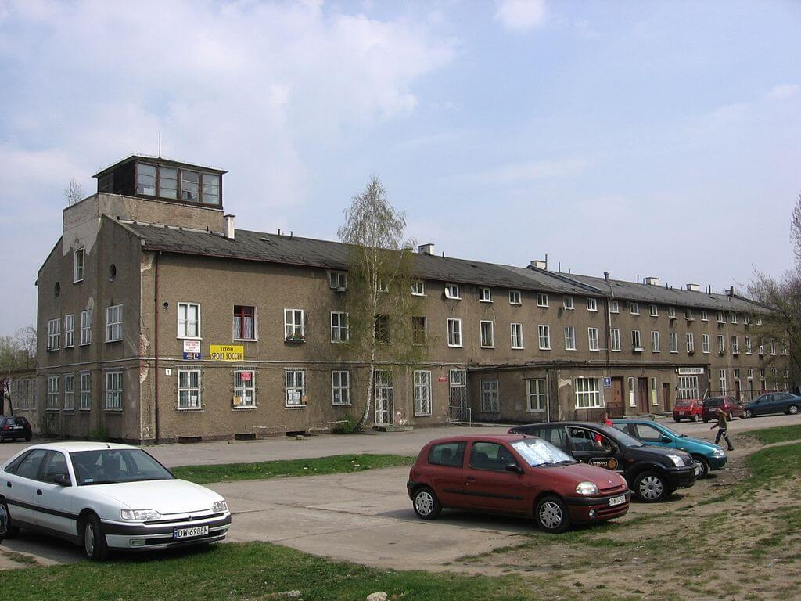

### Długi Marsz

18 lutego do aliantów zachodnich dociera alarmujący raport Roberta Schirmera, delegata Czerwonego Krzyża na północne Niemcy. Opisuje w nim przerażający los jeńców wojennych, którzy po tym jak ruszyła sowiecka ofensywa zostali wygnani z obozów i pędzi się ich w nieznane. Niestety dla wszystkich, których spotkał ten los, niezależnie od tego czy byli to Niemcy wygnani przez władze partyjnopaństwowe, więźniowie obozów koncentracyjnych czy właśnie jeńcy wojenni - ten styczeń i luty należały do najzimniejszych w skali całego stulecia. Lodowate zimno zabijało tysiące ludzi każdego dnia.

Schirmer opisuje trzy główne trasy, którymi "ewakuowano" 80 tysięcy jeńców wojennych.

- północna - jeńcy z Gdańska, Torunia, Tychowa przez Szczecin w stronę Lubeki.
- środkowa - jeńcy z Bąkowa, Kluczborka przez Łambinowice i Görlitz do Luckenwalde k. Berlina.
- południowa - z Českiego Těšína przez Norymbergę do Moosburg an der Isar w Bawarii.

Marsze, których trasa była niejednokrotnie dość chaotyczna zakończyły się dopiero w kwietniu. Liczbę ofiar śmiertelnych wśród żołnierzy USA, brytyjskich i innych krajów Commonwealthu szacuje się na 2,5 do 3,5 tys., ale ponieważ nie ma dokładnych danych, a ofiary grzebano po drodze w przypadkowych miejscach może być dużo większa.

- [The March (1945)](https://en.wikipedia.org/wiki/The_March_(1945))
- Dark Docs ["Germany's Most Evil General You Never Heard Of - the Death March of 1945" [YT 10:00]](https://www.youtube.com/watch?v=tTvM2gSmOpg)

### Horten Ho 229

Dziś odbyły się dwa kolejne loty próbne drugiego prototypu samolotu braci Horten. Po 45 minutach drugiego lotu jeden z silników nagle zapłonął i zgasł. Pilot podporucznik Erwin Ziller być może starając się uratować cenną maszynę, nie wyskoczył, ale próbował odzyskać panowanie. Zbyt mała wysokość - niecały kilometr - nie pozwoliła mu na to. Samolot rozbił się obok lotniska. Pilot wyrzucony podczas zderzenia z ziemią odniósł poważne obrażenia. Dwa tygodnie później zmarł.

<SeeAlso txt="Wunderwaffe" url="/festung-breslau/article/wunderwaffe" />

Podsumowując:

Dotychczasowe prace były wykonywane w ramach tzw. Sonderkommando IX. Twórcą samolotu o oficjalnej nazwie H IX był głównie Reimar Horten, jego brat był zajęty pracą w Berlinie.

- W 1944 1 marca udało im się oblatać pierwszy prototyp (V1), który był szybowcem testującym aerodynamikę samolotu. Dalsze prace były wstrzymywane przez brak silnika.
- 21 września 1944 Horten-Projekt został włączony do Jägernotprogramm.
- W końcu dostali silnik, jednak nie ten, który był pierwotnie planowany (BMW 003), ale Junkers Jumo 004 o innej charakterystyce i rozmiarach, musieli więc drugi prototyp (V2) przebudować. Pierwszy lot 2 lutego wypadł pomyślnie.
- Jak bardzo hitlerowcy byli oderwani od rzeczywistości świadczy fakt, że Reimar Horten nie był obecny na lotnisku, bo pracował nad kolejną wersją swojego odrzutowca H XVIII, sześciosilnikowym bombowcem do ataku na USA.
- Dokładnie w tym czasie Armia Czerwona była 90 km od Berlina. I właśnie z tego powodu dalsze prace konstrukcyjne przeniesiono do Gothaer Waggonfabrik w Turyngii. Tam w marcu przystąpiono do realizacji zamówienie na 40 kolejnych samolotów Horten. Zaczęto budować kilka kolejnych, ale tylko jeden (V3) udało się prawie dokończyć.
- 15 kwietnia Gotha została zdobyta przez US Army i V3 został przewieziony do USA. Nigdy nie latał.

I to cała historia tych samolotów. Zarówno szybowiec V1, jak i V3 zostały zabrane do USA. Obecnie jedynym istniejącym egzemplarzem jest właśnie V3 należący obecnie do kolekcji Smithsonian.

### 1 Front Ukraiński

Zakończyła się po trzech dniach walka o Stargard (Gubiński?). W wyniku starcia 1 Front Białoruski wstrzymuje operację berlińską. Ostatecznie sowieci zatrzymują się na rubieży Nysa Łużycka - Odra.

1 Front Ukraiński początek bitwy o Gubin. Potrwa pięć dni.

### Paul Peikert

Hornig pisze o poznanym przez siebie, znanym nam dobrze autorze innej - bardzo długo jedynej opublikowanej i na pewno najbardziej popularnej - kroniki wydarzeń w oblężonej twierdzy wrocławskiej:
>Stosunkowo długo pozostawał nietknięty kościół parafii św Maurycego. Jego proboszcz radca duchowy i archiprezbiter Paul Peikert jest znany ze swej kroniki Festung Breslau. Poznałem go w ten sposób, że strażnik w areszcie śledczym we Wrocławiu, podczas mojego tam pobytu z powodu [nielegalnej] kolekty na rzecz kościoła Wyznającego w 1937 roku, powiedział mi, że przede mną w tej samej celi siedział archiprezbiter Peikert. Stało się to przyczyną odwiedzin u niego - w ten sposób poznaliśmy się osobiście. W swej książce opisuje on między innymi bardzo ożywioną działalność swojej gminy, z zawsze dużą frekwencją podczas nabożeństw i mszy w kościele pw. św. Maurycego (Sankt Mauritiuskirche). Był zdecydowanym przeciwnikiem reżimu Hitlera, o czym też pisze w swojej książce. W jakim zakresie publikacja ta została zmieniona w opracowaniu przez stronę polską, która ją wydała, nie jestem w stanie powiedzieć.

Jest tu zawartych kilka istotnych informacji:

- Ksiądz Peikert już w 1937 z powodu swoich antynazistowskich przekonań i działalności miał problemy z władzami i siedział w areszcie śledczym, który w styczniu 1945 został zamieniony w specjalne więzienie gestapo, znane nam z opowieści Marii Langner (wpis z 10 lutego). Było to spowodowane tym iż podczas przeszukania gestapo znalazło w kościele pw. św. Maurycego 3 kopie antynazistowskiego "Listu otwartego do Goebbelsa". Peikert z tego powodu trzy miesiące siedział w areszcie, ale został wypuszczony, bo niczego mu nie udowodniono. Miał szczęście, że były to czasy, kiedy gestapo potrzebowało dowodów. Jak już widzieliśmy, w Twierdzy się skończyły.
- Interesujące jest podejrzenie, że polscy wydawcy mogli zmienić treść pamiętnika. Hornig pisze, że zna autora i ufa mu, ale książki nie jest pewien. Istotnie, przynajmniej teoretycznie jest to możliwe, ponieważ Paul Peikert umarł wkrótce po wojnie w 1949, natomiast pamiętnik opublikowano w mocno zredagowanej, nawet ocenzurowanej i skróconej formie najpierw w polskim tłumaczeniu w 1964, niemiecka edycja ukazało się w 1977. Do dziś nie dysponujemy pełną krytyczną wersją tekstu. Peikert więc nigdy książki nie zobaczył, a być może w ogóle uznał swój pamiętnik, choć uwierzytelniony i pozostawiony w archiwach parafii, za zaginiony. Wspomnienia Horniga wydane zostały w Niemczech w 1975, a rok później zmarł, więc niemieckiej edycji z 1977 nie mógł poznać.

Lata 70. to okres otwarcia w stosunkach polsko-zachodnioniemieckich, zaczynają się przełomową wizytą Willego Brandta i początkiem długiej drogi do uznania polskiej granicy zachodniej na Odrze i Nysie Łużyckiej. Ale wciąż Polska jest widziana w RFN - i częściowo słusznie - jako część wrogiego obozu, w którym książki publikuje się w cieniu cenzorskiej pieczęci z wyraźnym propagandowym zamiarem. Tym bardziej chcielibyśmy poznać pełną wersję pamiętnika. Paul Peikert z pewnością jest osobą zasługującą na osobny wpis.

Natomiast Peikert dziś:
>Przez całe popołudnie do późnej nocy ciężkie naloty na miasto, dotkliwe bombardowanie i głośne wybuchy. Zapewne znowu poczyniono poważne szkody; m.in. został trafiony jeden ze znanych pomników Wrocławia. Wieża na Liebichshõhe (Wzgórze Partyzantów) częściowo runęła, a jednocześnie została poważnie uszkodzona znajdująca się tam restauracja. Wszyscy pytają, czy Wrocław ma podzielić los pozostałych wielkich miast Rzeszy Niemieckiej? Wrocław to piękne miasto, pełne znakomitych świadków jego minionej chrześcijańskiej kultury; są tu zabytki architektury, którym podobne rzadko można znaleźć w innym mieście. Ostrów Tumski, Ratusz, wspaniałe stare świątynie - czyż to wszystko ma lec w gruzach dlatego, że obłęd militarystów chce zamienić w twierdzę każdy dom, każdy kościół i każdą piwnicę? Czyż to wszystko nie zostało stworzone dla ludu i z powodu ludu? Co się zyska, gdy tym sposobem także Wrocław przetrwa kilka dni dłużej, jeśli w końcu zostanie nieogarnięta przestrzeń ruin? Jeśli tak, jak gdyby świat ogarnął prawdziwy szał zniszczenia. Moloch wojny pożera wszystko, pożera krew i dobro narodu, i to jako narzędzie takiego systemu, jakim jest narodowy socjalizm.

Charakterystyczna wieża na Wzgórzu Liebicha miała zostać zniszczona przez saperów Ahlfena, ponieważ była niemal celownikiem wskazującym najważniejsze miejsce w mieście - siedzibę sztabu Twierdzy. Sowieci oczywiście nie wiedzieli, gdzie się znajduje, ale lepiej było zachować ostrożność. Czy Peikert się myli, przypisując jej zniszczenie sowieckiemu lotnictwu? Z pewnością, w przeciwieństwie do wielu innych relacjonujących wydarzenia w Twierdzy, jest bardzo dokładnym i przywiązującym uwagę do szczegółów pamiętnikarzem. W jego opowieści widzimy miasto niszczone przez obrońców i oblegających zarazem, systematycznie i bezwzględnie. Dom po domu, godzina po godzinie. Nie ulega łatwo emocjom. Z buchalterską dokładnością wylicza zniszczenia, zabitych, rannych, opisuje cierpienia. Rzadko pozwala sobie na podstawowe w tej sytuacji pytanie - do czego to wszystko dąży? Jak się skończy ta jatka? Zadał je na początku, bezlitośnie opisuje słabość obrony i bezsens walki bez szans powodzenia. Wielokrotnie i w brutalny sposób przedstawi nam okrucieństwo wojny.

### Hugo Hartung

Tymczasem wciśnięty w kamasze Szwejka dramatopisarz Hugo Hartung od wczoraj z zadowoleniem i wyraźną ulgą odnajduje się oddalonych od linii walk pozycjach. W pewnym momencie nawet grzeje się w płomieniach wojny:
>Obok naszych pozycji wzdłuż linii kolejowej ciągną kolumny uchodźców. To mieszkańcy ewakuowanych przedmieść Kuźniki i Żerniki. [...] Wieża kościelna w Żernikach płonie jak pochodnia a pożary na południowym zachodzie miasta rozprzestrzeniają się. Również altanki, w których jeszcze wczoraj kwaterowaliśmy, stoją teraz w ogniu. Ciepły żar niesiony wiatrem przyjemnie ogrzewa nas w tę zimną noc. Przez cztery godziny słyszymy warkot przelatujących nad nami ciężkich samolotów zaopatrzeniowych, które lądują prawdopodobnie na pobliskim lotnisku w Gądowie.

A dziś odnajduje nieomal raj utracony:
>Po południu czujemy się zupełnie tak, jakby zapanował nagle pokój, bo znajdujemy gospodę, w której jeszcze sprzedają piwo. W lokalu jest kilku cywilów i nawet parę kobiet. Przekazują nam dwie nowiny: że nasza "twierdza" jest całkowicie okrążona i że Drezno zostało straszliwie zbombardowane.

Więc jednak wiadomość o bombardowaniu Drezna dotarła do Wrocławia. Ale jaką drogą? Na pewno dowiedział się o tym Peikert, być może to jest przyczyną jego wizji morza ruin, może dlatego tego dnia pozwala sobie na nietypową, plastyczną i liryczną refleksję opisując molocha wojny niczym Kolosa znanego z obrazu Goi. Hartung nie podaje dalszych szczegółów, zupełnie jakby bombardowanie Drezna było po prostu kolejną zagładą niemieckiego miasta, o której dowiedział się przy piwie, co prawda budzi to jego pytanie o los najbliższych wysłanych do Turyngii. Peikert natomiast nic o Dreźnie nie pisze.

### Hans von Ahlfen

Komendant Twierdzy Hans von Ahlfen dziarskim tonem wojaka zapewnia o skutecznym łataniu wyrw w tonącej łajbie. Niechcący dodaje ważną uwagę do wzmianki Hartunga o samolotach mających według niego lądować lotnisku na Gądowie Małym, czemu ich warkot był słyszany aż przez cztery godziny? Nie dlatego, że było ich tak dużo. Były to po prostu samoloty wroga albo bezradnie krążące niemieckie transportowce, bowiem jak pisze Ahlfen, po pierwszym udanym nocnym transporcie sowieci skutecznie zakłócili działanie ich sprzętu umożliwiającego nocne lądowanie:
>W nocy z 15 na 16 lutego przeprowadzono pierwszą dostawę amunicji drogą powietrzna i odtransportowano rannych. Graniczące z pewnością nadzieje na kolejne noce zostały brutalnie rozwiane już najbliższej nocy. Wróg tak bowiem zakłócał pracę naszych radarów niezbędnych do sprowadzenia na ziemię naszych maszyn znajdujących się nad Gądowem, że wszystkie samoloty z cennym ładunkiem musiały wrócić do macierzystych portów, a rannych, czekających w Gądowie z utęsknieniem na odlot, trzeba było odwieźć z powrotem do szpitali. Dobrze, że taka sytuacja nastąpiła szybko, był jeszcze bowiem czas jeszcze jej zaradzić. Wypadek ten obnażył liczne zaniedbania. W sztabie twierdzy brakowało doświadczonego oficera lotnictwa, znającego się na transporcie lotniczym, który nie tylko nadzorowałby ruch na lotnisku w Gądowie, lecz także wyręczyłby dowództwo w prowadzeniu wielu bardzo ważnych rozmów z zaopatrującą Wrocław flotą powietrzną generała Rittera von Greima. [...] Po żmudnych poszukiwaniach na lotnisku Szkoły Lotnictwa Wojennego w Strachowicach, choć ostrzeliwanego, ciągle jednak znajdującego się w naszym posiadaniu, znaleziono niezbędne urządzenia radiowe, których pracy wróg raczej nie powinien był zakłócać. Za ich pomocą po dwóch dniach przerwy można było przywrócić komunikację lotniczą z lądowaniami. Tymczasem zastosowano awaryjną procedurę zrzutu amunicji. Nieuniknione wady owej procedury polegały na tym, że znaczna część zrzutu lądowała u wroga albo w Odrze, albo w zatopionej dolinie Oławy.

Dziwi informacja o sprzęcie odnalezionym na lotnisku w Strachowicach, po nocy z 16 na 17 lutego, przecież rano 17 lutego Niemcy to lotnisko opuścili. Może to była akcja dokonana w ostatniej chwili. Robert Ritter von Greim jest kolejną osobą, o której warto będzie jeszcze wspomnieć.

*Dawny budynek dworca loticzego na Gądowie Małym (zbudowany w 1936), obecnie przedszkole 
Źródło: By Źródło nie zostało podane w rozpoznawalny automatycznie sposób. Założono, że to praca własna (w oparciu o szablon praw autorskich)., Domena publiczna, [Link](https://commons.wikimedia.org/w/index.php?curid=725920)*

### Żerniki

Tego dnia czerwonoarmiści zdobyli Żerniki. Von Ahlfen o tym nie wspomina, pisze bowiem kronikę wielkiej katastrofy, w której nie było klęsk. Jak to opisuje major Michaił Orłow, podążający śladami Hartunga:
>Po kilku dniach uporczywych walk, które 359 Dywizja Piechoty toczyła na północny zachód od Wrocławia, żołnierze nasi dotarli wreszcie do samego miasta. Pierwszym związanym z tym epizodem bojowym było zdobycie 18 lutego osiedla Żerniki, położonego na zachodnim skraju miasta. Dokonał tego jeden z batalionów 1198 pułku piechoty dowodzony przez kapitana Pietrowa. Żerniki przygotowane zostały przez Niemców do obrony i posiadały stosunkowo silną załogę, wyposażoną w znaczną ilość broni maszynowej. A jednak osiedle zdobyto szybko i bez wielkich strat. O sukcesie zadecydował śmiały manewr grupy żołnierzy dowodzonych przez młodszego lejtnanta Asmanowa, którzy pełzając rowem przeciwpancernym, obeszli pozycje niemieckie i uderzyli na hitlerowców od tyłu. W działaniach tych wzięto do niewoli 40 jeńców. Za wykazaną w boju inicjatywę i odwagę młodszy lejtnant Asmanow, starszy sierżant Jasicz, oraz szeregowcy Bielicki, Krawczyk, Tursynow i Kołomejczyk otrzymali odznaczenie bojowe. Po zdobyciu Żernik, na kierunku działania 359 Dywizji Piechoty znalazło się, położone za rzeką Ślęzą, osiedle podmiejskie - Kuźniki. Z niego zaś, jak mówiono, do Wrocławia "tylko rękę podać". Stało się jednak inaczej.

Przyczyną tego był rozkaz generała Głuzdowskiego, głównodowodzącego 6. Armii, który zrezygnował z tego obiecującego kierunku natarcia i przegrupował 359 DP na południowe przedmieścia, ponieważ stamtąd chciał wyprowadzić główny atak. Ale 359 DP warto zapamiętać, odegra jeszcze istotną rolę w naszej opowieści. Interesujące są nazwiska szeregowców: Bielicki i Krawczyk. Wyjaśnieniem zapewne jest historia 6. Armii, którą jednak zostanie przytoczona później. Co zaś do podmiejskości: formalnie rzecz biorąc zarówno Żerniki, jak i Kuźniki od 1928 były w granicach miasta.

### Barbarzyńcy

Pułkownik Aleksiej Cziczin stacjonujący na Klecinie pisze tego dnia słowa, które są przerażającą zapowiedzią losu wrocławian:
>Wrocławia bronią od dzieciaków po starych. Nasi żołnierze mszczą się bezlitośnie. Wydano rozkaz: jeńców i cywili nie rozstrzeliwać, ale to nic nie pomaga. Należy podjąć jakieś kroki, nie możemy zostać barbarzyńcami.

Na to jest już za późno. Pierwszą ofiarą wojny jest człowieczeństwo.

### Zoo

Dwa hipopotamy i manat zginęły dziś od ognia artyleryjskiego. [Rosyjskie granaty zabiły w wrocławskim ZOO amazońskiego manata i dwa hipopotamy](https://www.facebook.com/EchazFestungBreslau/posts/3385830698144283)
