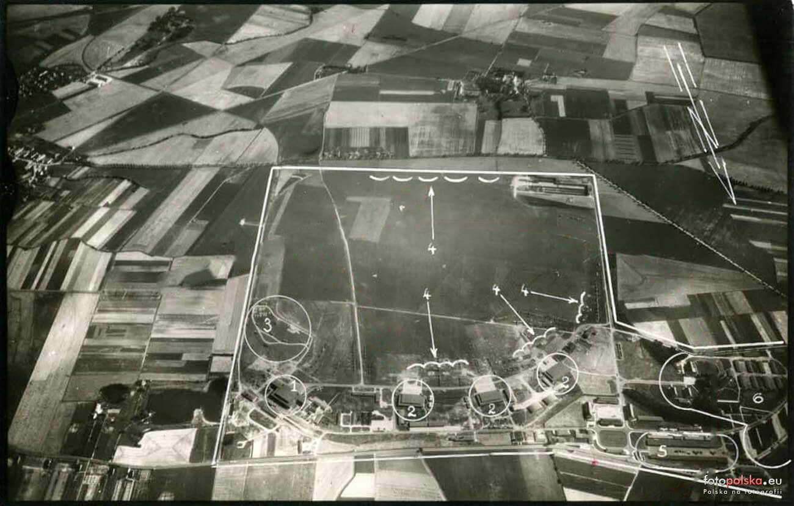

### Tokio

Nalot na Tokio w nocy. 74 B-29. Z powodu ataku myśliwców nieprzyjaciela oraz silnego ognia przeciwlotniczego wybierają drugi cel - port. Jest silne zachmurzenie więc używają mniej precyzyjnego namierzania radarowego. Zginęło ponad tysiąc osób.

### Iwo Jima

Iwo Jima mająca powierzchnię 22 km2 jest częścią Wysp Kazan, archipelagu wysp wulkanicznych należącego do Japonii. Do samej Japonii jest stamtąd jeszcze 1000 km. Wyspa ta ma ogromne znaczenie wojskowe i żadnego innego. Została skolonizowana dopiero w XIX wieku.

Od czterech dni trwa krwawa bitwa o Corregidor, malutką wysepkę o powierzchni 14 km2 blokującą wyjście z Zatoki Manilskiej.

Dla porównania: wrocławska była dzielnica Śródmieście 16 km2, wrocławska Wielka Wyspa 9 km2.

Rozpoczęła się bitwa o Iwo Jimę, nam znana najbardziej z dylogii Clinta Eastwooda "Letters from Iwo Jima" i "Flags of Our Fathers". To już jest część Japonii. Będzie trwać ponad miesiąc, aż do 26 marca. Zginie 7 tys. amerykańskich żołnierzy (ze 110 tys.) i 20 tys. japońskich (z 21 tys.). Tak, 20 tysięcy z 21 tysięcy.

<SeeAlso txt="Bitwa o Iwo Jimę" url="/festung-breslau/article/pacyfik-iwo-jima" />

Wśród wielu ofiar pierwszego dnia walk było dwóch sierżantów Marines, dowódców sekcji karabinów maszynowych, których warto wspomnieć:

- **Darrell S. Cole** kiedy jego karabin maszynowy zaciął się, mając tylko pistolet i granat zniszczył stanowisko japońskiego karabinu maszynowego, tego dnia zniszczył ich w sumie pięć, używając granatów. Od jego nazwiska pochodzi nazwa niszczyciela rakietowego USS Cole (DDG-67) znanego z ataku terrorystycznego w Jemenie w 2000.
- **John Basilone** po samodzielnym zniszczeniu japońskiego schronu i wyprowadzeniu czołgu z pola minowego. Basilone był jednym z głównych bohaterów serialu "Pacyfik" z 2010.

### Operacja Westwind

Zaczynają się próby połączenia okrążonego Królewca i portu w Piławie (obecnie Bałtyjsk). Odległość do Piławy to 40 km. Ataki idą z obu stron i trwają do 26 lutego. Otworzyło to możliwość ewakuacji albo statkiem albo droga lądową przez Mierzeję Wiślaną w stronę Gdańska. Ale jak to wynika z dokumentów zasadniczym celem operacji było odblokowanie miasta i upuszczenie go przez 5 Dywizję pancerną i 1 DP, które zostały skierowane do obrony Piławy. W zamian miasto dostało 4 dywizje grenadierów ludowych czyli zbieraninę z tego co zostało.

Pierwsze uderzenie to samobójczy atak Hitlerjugend na karabiny maszynowe 3 Frontu Białoruskiego.

- Military History not Visualized ["Operation Westwind: Breakout from Königberg '45" [YT 19:20]](https://www.youtube.com/watch?v=2pePqxZc6i8) | ["Why Königsberg held off the first Attack" [YT 15:02]](https://www.youtube.com/watch?v=kT_rLAmqNw8)

### Ła-7 vs Me 262

FBTODO
February 19, 1945[4] (the date is also found February 24, 1945) I. N. Kozhedub shot down the latest German jet fighter Me 262 in an air battle.

- [Ла-7](https://ru.wikipedia.org/wiki/%D0%9B%D0%B0-7)

### Stargard Szczeciński

Stargard był atakowany jednocześnie przez Armię Czerwoną i alianckie lotnictwo. Skoro o Japonii: jedną z ofiar dzisiejszego bombardowania dworca jest Jan Jaworski historyk, sinolog i japonista, powstaniec warszawski, autor Historii Chin i Historii Japonii w Wielkiej historii powszechnej wydanej w 1935).

### Wrocław

Generał Bakłanow dowódca 34 Korpusu Gwardii:
>Przez szereg dni prowadziliśmy ciężkie walki na południowych podejściach do Wrocławia. Każdy folwark z jego murowanymi zabudowaniami Niemcy zamieniali w prawdziwą twierdzę. Grube ściany budynków nie poddawały się pociskom artylerii średnich kalibrów. Na dodatek przyszła odwilż i działa, czołgi oraz samochody grzęzły w rozkisłym błocie. Od samego początku zaciskanie pierścienia okrążenia szło wyjątkowo opornie. 
>W końcu zbliżyliśmy się do podmiejskich osiedli Wrocławia. I znowu każdy dom, broniony silnym ogniem broni maszynowej, musiał być zdobywany jak bunkier.

<BoxImageWrapper>

Lotnisko Wrocław-Strachowice, sierpień 1939. 
Źródło: Fotopolska [31 lipca 1939 , Wojskowe lotnisko na Strachowicach 1 miesiąc i 1 dzień przed wybuchem wojny.](https://fotopolska.eu/499826,foto.html)
</BoxImageWrapper>

Hugo Hartung, nasz od kilku dni nieustannie wycofywany na tyły cywil wcielony do wojska, po koszmarze dramatycznych dni na lotnisku w Strachowicach, zaczyna patrzeć na wojnę jakby przez grube, pancerne szkło, wczoraj opisuje wojnę, która zadaje nieprzyjemne, ale bezpieczne ciosy:
>[...] o wschodzie słońca budzi się również rosyjska artyleria, która przystępuje do ostrzału naszych pozycji. O niecałe pięćdziesiąt metrów od nas uderza granat, obsypując okop deszczem odłamków. Szyny szczękają pod nawałnicą pocisków z karabinów maszynowych. Szczególnie nieprzyjemny jest grad nasypowego żwiru, który po każdej takiej serii bębni o nasze stalowe hełmy. Jednak najwyższy ton w tym piekielnym koncercie zachowuje pierwszy tej wiosny skowronek, który buja w przestworzach beztrosko śpiewając.

Czy to ulga po traumatycznych doświadczeniach, czy chwytanie się każdej iluzji bezpieczeństwa, tego być może sam nie wie. Zapewne nie bez znaczenia jest fakt, że tego dnia ma urodziny, on nie został nawet ranny, a jego rodzina jest prawdopodobnie bezpieczna. Nie koniec dobrych wiadomości ich seria ciągnąć się będzie kilka dni, aż do rozkazu, który otrzyma 22 lutego.

Tymczasem po wycofaniu z linii frontu zostają przeniesieni do dworku w Nowym Dworze, gdzie rzeczą oczekiwaną staje się już nie tylko bezpieczeństwo, ale i cywilizacyjne wygody:
>Znów możemy spędzić spokojną noc w ciepłej piwnicy, brakuje nam tylko wody, by się trochę umyć i ogolić.

### Rola Wrocławia

W sztuce militarnej nie istnieje pojęcie twierdzy nie do zdobycia. Każda umocniona pozycja ma swoją wagę czasową, określoną przez projektantów, wyrażoną w tym ile dni lub tygodni będzie potrzebował atakujący, jeśli zaangażuje całą siłę ataku w zdobycie obiektu. Twierdze odgrywają rolę opóźniacza, mając zadanie spowolnienia operacji wojskowej, albo czasami zapobieżenia jej, bo się po prostu na tym odcinku nie opłaca. Kierują ruch nieprzyjaciela gdzie indziej. Jeszcze kilka razy będę pisać o fortyfikacjach, bo nie sposób zamknąć nawet jednego zagadnienia w obrębie dziennej notki.

Ale przechodząc do dnia 19 lutego, kiedy jak się wydaje - na chwilę przed generalnym szturmem sowieckim - wrocławianie zapomnieli i o śniegu i o dawnym mieście nierozwalanym bombami, bez trupów na ulicach, bez dymu zasuwającego horyzont, bez pożarów rozświetlających noce - warto zapytać jaką wartość liczoną w dniach posiadała twierdza wrocławska? Jakie opóźnienie stanowiła dla nieprzyjaciela. Otóż na to pytanie nie ma odpowiedzi. Inną wiedzę posiadali obrońcy Twierdzy, inną wiedzę (również odległą od rzeczywistości) mieli wówczas sowieci, inna mamy my dziś. I jestem pewien, że w wielu aspektach Twierdza zaskoczy również badaczy w przyszłości.

Co zas do dziedziny faktów - dopuszczono się wielu zaniedbań podczas przygotowania Twierdzy do obrony, co wielokrotnie, choć niechętnie i nie wprost przyznaje sam Ahlfen. Zarówno wykorzystanie dostępnych sposobności jak i sam garnizon i jego uzbrojenie, było improwizacją. Tak samo było po stronie atakującego, który przecież nie zastosował pełnej siły ataku. Po umocnieniu się na rubieżach pozostawił do oblężenia jedną słabą Armię, której i tak nie potrzebował na głównej linii uderzenia przebiegającej na północ od przepływającej przez Wrocław Odry. Wydawało się wszak, że tyle wystarczy, bo przecież w mieście ilu jest żołnierzy? Jak się okazało sowieci ocenili, że garnizon jest dwa, a może trzy razy słabszy niż w rzeczywistości był. Takaja oszybka.

Cała tragedia Wrocławia od tej pory rozegrała się na marginesie wojny i pod względem taktycznym była już bez znaczenia. Ani nie opóźniała siły sowieckiej, ani nie wzmacniała hitlerowskiej. Tak widzimy to z perspektywy współczesnej, znając wszystkie późniejsze wypadki. Ale trzeba wejść w skórę albo przynajmniej spróbować tego dokonać, ludzi wówczas żyjących i na chłodno ocenić czy można było liczyć na zyski wojskowe wynikające z trwania na pozycji.

Prawdopodobnie sytuacja wówczas była tak zmienna i niejasna, że wszystko na zewnątrz działo się za gęstą mgłą wojny. To był chaos i jatka i choć na odwrócenie losów wojny od czasu załamania frontu na Wiśle nie było szans, być może na lokalnym planie wojny na Śląsku trwanie pozycji wrocławskiej miało jeszcze sens w tych dniach.

Na pewno wierzono w możliwość deblokady miasta. Przecież natarcie sowieckie miało się wyczerpać w wyniku działania samych tylko czynników czasu i przestrzeni. Jak rozkładały się opinie wśród mieszkańców miasta, tego się nigdy nie dowiemy. Woli kapitulacji, ucieczki, otwarcia miasta nie wolno było ujawniać. Czas na opuszczenie miasta już minął, teraz można było tylko walczyć, zabijać i ginąć. Zdecydowana większość z cywilów pozostałych w mieście to byli jego rdzenni mieszkańcy. Wojna przyszła do progu ich domu. Możemy tylko przypuszczać, że bardzo chcieli wierzyć w sens obrony Wrocławia i tylko ogrom związanego z nią cierpienia był w stanie pogodzić ich z jego utratą. Ten warunek wkrótce zostanie spełniony.

Poza tym w armii obowiązuje pragmatyka rozkazu. W tym wypadku decyzję podejmowało dowództwo polityczne, z którym w ciągłej, bezpośredniej łączności radiowej był gauleiter Hanke. To była ostatnia instancja decydująca o losach miasta i pozostałych w nim ludzi. Nie pochylony nad mapą Śląska, generał Hans von Ahlfen, on tylko wykonywał rozkazy Gauleitera. O tym, że Wrocław ma się bronić, decydował za pośrednictwem Gauleitera coraz bardziej pogrążony w malignie Adolf Hitler.

### U-530 i U-977

Dziś U-530 (Type IXC, duży oceaniczny okręt podwodny) opuścił Kilonię, była to jego 8 misja. Skierował się na USA.

I wtedy stało się coś dziwnego. Wyprzedzając wypadki - kiedy po kapitulacji admirał Dönitz wydał rozkaz do wszystkich jednostek poddania się aliantom U-977 tego rozkazu nie wykonał. Zaczął płynąć na południe i dopiero 10 lipca poddał się do niewoli władzom... argentyńskim w porcie Mar del Plata. Przesłuchiwany kapitan nie potrafił wyjaśnić, co okręt robił przez poprzednie 2 miesiące, gdzie jest dziennik pokładowy i broń. Załoga nie miała żadnych dokumentów.

Podobnie tajemniczy był los U-977 (Type VIIC, podstawowa wersja U Boota, zasięg 8,5 tys. mm), który podczas kapitulacji był w pobliżu Szkocji. Jak później jego kapitan zeznał od 10 maja do 14 lipca byli w zanurzeniu (przez 66 dni!) na kusie ku Argentynie. W Mar del Plata pojawili się 17 sierpnia. Za przyczynę tej decyzji kapitan podawał obawę przed niewolą sowiecką.

Władze argentyńskie marynarzy obu okrętów przybyłych w odstępie trochę ponad miesiąca internowały. Oba U Booty przekazano Amerykanom, którzy po przebadaniu zniszczyli je jako cele ćwiczebne.

Tajemnice związane z tymi rejsami spowodowały powstanie rozmaitych teorii spiskowych, m.in. podejrzewano, że przywiózł do Argentyny przywódców hitlerowskich.

<SeeAlso txt="Wojna na biegunach" url="/festung-breslau/article/bieguny" />

### Odnośniki

- Mark Felton Productions ["German U-Boats in Argentina 1945 - U-530" [YT 6:52]](https://www.youtube.com/watch?v=OyP1MBxca4g) ["German U-Boats in Argentina 1945 - U-977" [YT 7:35]](https://www.youtube.com/watch?v=376q9QUezJU) | ["Secret Nazi Antarctic Base - Fact or Fiction?" [YT 10:10]](https://www.youtube.com/watch?v=Rs0ZaCQrScc)| ["Ice Station Kurt - The Secret German Mission to Canada" [YT 4:20]](https://www.youtube.com/watch?v=_ATziIQTXCs) | ["Secret Nazi Arctic Bases" [YT 6:17]](https://www.youtube.com/watch?v=yWyA63YBT6c)
- Dark Files ["Secret Nazi Base Discovered in the Arctic"](https://www.youtube.com/watch?v=EqBnSXgJ0aA) Ziemia Aleksandry
- Dark5 ["5 Secret WW2 Things Only Found after the War" [YT 10:24]](https://www.youtube.com/watch?v=Ou6MFssFZRs)
- History.com [Eric Niller "Hitler Sent a Secret Expedition to Antarctica in a Hunt for Margarine Fat"](https://www.history.com/news/hitler-nazi-secret-expedition-antarctica-whale-oil)
- David Grossmann ["Nope, There Was Never a Secret Nazi Base in Antarctica"](https://www.popularmechanics.com/military/a25672/nazi-antarctica-base-debunked/)
- Cool Antarctica ["Hitler's Frozen Base"](https://www.coolantarctica.com/Community/antarctic-mysteries-hitlers-secret-base.php)
- Wikipedia [Deutsche Antarktische Expedition 1938/39](https://de.wikipedia.org/wiki/Deutsche_Antarktische_Expedition_1938/39)
- Wikipedia ["Wetterstationen der Wehrmacht in der Arktis"](https://de.wikipedia.org/wiki/Wetterstationen_der_Wehrmacht_in_der_Arktis)
- Dark Docs ["A Mission So Secret the Nazis Forgot They Were There" [YT 10:01]](https://www.youtube.com/watch?v=Suz24VNobEA)
