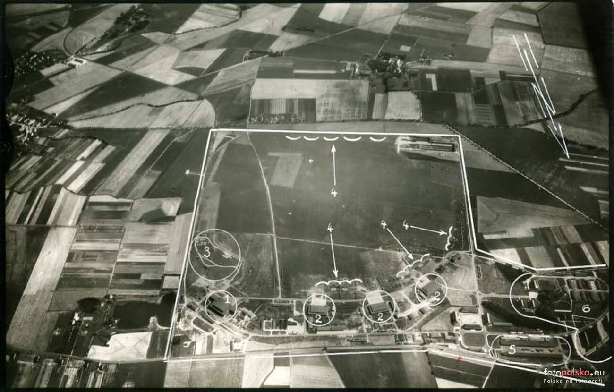

### Tokio

Nalot na Tokio w nocy, 74 B-29, z powodu ataku myśliwców nieprzyjaciela, silnego ognia przeciwlotniczego wybierają drugi cel - port. Z powodu silnego zachmurzenia używają mniej precyzyjnego namierzania radarowego. Zginęło ponad tysiąc osób.

### Iwo Jima

Iwo Jima mająca powierzchnię 22 km2 jest częścią Wysp Kazan, archipelagu wysp wulkanicznych należącego do Japonii. Do samej Japonii jest stamtąd jeszcze 1000 km. Wyspa ta ma ogromne znaczenie wojskowe i żadnego innego. Została skolonizowana dopiero w XIX wieku.

Od czterech dni trwa krwawa bitwa o Corregidor, malutką wysepkę o powierzchni 14 km2 blokującą wyjście z Zatoki Manilskiej.

Dla porównania: wrocławska była dzielnica Śródmieście 16 km2, wrocławska Wielka Wyspa 9 km2.

Rozpoczęła się bitwa o Iwo Jimę, znana nam z dylogii Clinta Eastwooda "Letters from Iwo Jima" i "Flags of Our Fathers". To już jest część Japonii. Będzie trwać ponad miesiąc, aż do 26 marca. Zginie 7 tys. amerykańskich żołnierzy (ze 110 tys.) i 20 tys. japońskich (z 21 tys.). Tak, 20 tysięcy z 21 tysięcy.

Wśród wielu ofiar pierwszego dnia walk było dwóch sierżantów Marines, dowódców sekcji karabinów maszynowych, których warto wspomnieć:

- **Darrell S. Cole** kiedy jego karabin maszynowy zaciął się, mając tylko pistolet i granat zniszczył stanowisko japońskiego karabinu maszynowego, tego dnia zniszczył ich w sumie pięć, używając granatów. Od jego nazwiska pochodzi nazwa niszczyciela rakietowego USS Cole (DDG-67) znanego z ataku terrorystycznego w Jemenie w 2000.
- **John Basilone** po samodzielnym zniszczeniu japońskiego schronu i wyprowadzeniu czołgu z pola minowego. Basilone był jednym z głównych bohaterów serialu "Pacyfik" z 2010.

<!-- FBTODO
Podczas wojny Japończycy, tworząc zewnętrzny pas obronny, silnie ufortyfikowali wyspę. Ulokowany tam został ponad 22-tysięczny garnizon, którym dowodził generał Tadamichi Kuribayashi. Na jego polecenie w twardych wulkanicznych skałach wydrążono jaskinie i tunele o długości przekraczającej 18 km (tyle przynajmniej podziemnych przejść odkryli Amerykanie). Powstał, niewidoczny z zewnątrz, skomplikowany system obronny, wyposażony m.in. w 360 armat kalibru powyżej 75 mm, w tym działa okrętowe, 300 dział przeciwlotniczych i ponad 2 tys. karabinów maszynowych.
Amerykańska strategia wojenna na Pacyfiku opierała się na metodzie żabich skoków. Posuwając się w kierunku Japonii, Amerykanie dokonywali desantów na ważniejszych wyspach, inne omijając z daleka. Iwo Jima, którą Japończycy wybrali na ostatni punkt obrony strzegący dostępu do głównego archipelagu, dla amerykańskich strategów stawała się pierwszym japońskim terytorium, które należało zdobyć. Dodatkowym jej walorem były dwa lotniska, które pozwalałyby na awaryjne lądowanie samolotów bombowych B 29, wracających po akcji do baz na Wyspach Mariańskich.
I tak niegościnny skrawek lądu stał się terenem ostrych bojów, a fotografia ukazująca zatknięcie flagi na szczycie Suribachi, w piątym dniu walk o wyspę, przeszła do historii jako symbol amerykańskiego zwycięstwa militarnego.
Wkrótce po mianowaniu, w lipcu 1944 r., generała Tadamichi Kuribayashi dowódcą garnizonu Iwo Jimy, amerykańskie lotnictwo przez dwa dni bombardowało wyspę. Można domniemywać, że fakt nominacji – dzięki złamaniu japońskiego purpurowego kodu – nie uszedł uwadze Departamentu Wojny. Od grudnia 1944 r. lotnictwo systematycznie bombardowało, a marynarka ostrzeliwała wyspę. Ale na jej obrońcach nie robiło to większego wrażenia.
19 lutego 1945 r., po trzydniowym nalocie lotniczym i ostrzale morskim, Amerykanie rozpoczęli desant. W ciągu 45 minut na plażach wylądowało siedem batalionów piechoty morskiej, dwa bataliony czołgów, ciężarówki, radiostacje, sprzęt sanitarny i pomocniczy. W sumie 30 tys. ludzi. Powitała ich cisza. Dopiero godzinę po wylądowaniu rozpoczął się huraganowy ogień z umocnień japońskich na stokach Suribachi i z płaskowyżu Motoyama. Każdy wzgórek, załom skalny, szczelina okazały się doskonale zamaskowanymi punktami ogniowymi. Dowódca sił na Pacyfiku admirał Chester W. Nimitz zakładał, że będzie to „czterodniowy spacerek marines”. Tymczasem straty w pierwszym dniu były większe niż w Normandii w 1944 r. Dzień później, 20 lutego, amerykańska piechota morska zajęła jedno z lotnisk. Ale 21 lutego, w efekcie ataku ok. 20 kamikadze i ostrzału z lądu, flota inwazyjna utraciła lotniskowiec „Saratoga”.
W piątym dniu walk, 23 lutego 1945 r., sześciu żołnierzy piechoty morskiej zatknęło sztandar amerykański na szczycie Suribachi. Chwilę tę uwiecznił korespondent wojenny Associated Press Joe Rosenthal, fotografię opublikował 25 lutego 1945 r. „New York Times”, a potem przedrukowała cała prasa. Autor otrzymał za to zdjęcie nagrodę Pulitzera za 1945 r. Potem zostało uznane za najczęściej reprodukowane zdjęcie w dziejach i stało się jedną z ikon amerykańskiego zaangażowania w II wojnę światową.
Tymczasem do pełnego zajęcia Płaskowyżu Motoyama było jeszcze daleko, wyspa zaciekle się broniła. Zmagania z rozproszonymi grupkami armii japońskiej trwały do 16 marca. Amerykanie używali najczęściej granatów lub czołgów z miotaczami płomieni zwanych Ronsonami. Ostatni atak 300-osobowego oddziału japońskiego miał miejsce w nocy 25 marca 1945 r. Zginęło wówczas ok. 100 Amerykanów.
W całej bitwie o wyspę do niewoli dostało się zaledwie 216 Japończyków, a 20 073 zginęło w walce bądź popełniło samobójstwo. Oficjalne straty amerykańskie wyniosły 4197 zabitych, 19 189 rannych (w wyniku ran zmarło 1401), 494 uznano za zaginionych.
Z czasem okazało się, że istnieją dwa zdjęcia przedstawiające to samo wydarzenie, ale bohaterowie każdego z nich i mocowane sztandary były trochę inne. Stąd tytuł książki Jamesa Bradleya i Rona Powersa „Flags of our Fathers” („Flagi naszych ojców”). Czy to znaczy, że szczyt musiał być zdobywany jeszcze raz? Czy druga fotografia została zainscenizowana na potrzeby medialne? Nie jest to do końca jasne.
Ale opublikowane wtedy zdjęcie Joe Rosenthala zelektryzowało kraj. Dla Amerykanów stało się źródłem dumy. Bohaterski czyn natychmiast wywołał reakcję Pentagonu. Kim byli bohaterowie? Ustalona została oficjalna lista, z której wynikało, że byli to: sierżant Mike Strank, kapral Harlan Block, szeregowcy Franklin Sousley, Rene Gagnon, Ira Hayes z piechoty morskiej oraz John Doc Bradley z korpusu medycznego marynarki wojennej.
Zanim powstała lista, trzech z nich zginęło, bo walki ciągle trwały. Trzech pozostałych zostało wprzęgniętych do wielkiej machiny propagandowej, działającej na rzecz udziału USA w wojnie i zdobycia dla tej sprawy funduszy. Rozpoczął się wielki patriotyczny show. Wkrótce po wojnie nakręcony został film dokumentalny oraz fabularny „Piaski Iwo Jimy” z Johnem Waynem w roli głównej, przy czym kulminacyjnym punktem była scena zatknięcia flagi na szczycie wulkanu Suribachi. Później kolejny, gdzie Tony Curtis grał Indianina Irę Hayesa. Filmy te nie odbiegały wymową od innych, na przykład „Rajdu na Tokio”, zrealizowanych wkrótce po ataku na Pearl Harbor. Była to produkcja wyraźnie propagandowa, gloryfikująca wysiłek wojenny USA.
Pierwszy z filmów Eastwooda został zrealizowany na podstawie książki Jamesa Bradleya (syna bohatera z Iwo Jimy) i Rona Powersa. Bradley znał wojenną przeszłość ojca, ale w domu był to temat zakazany. Przypadkowo znaleziony na strychu wycinek prasowy oraz odznaczenie za odwagę na polu bitwy stały się początkiem poszukiwań uwieńczonych książką. Nakręcony na tej podstawie film jest zdecydowanie odmienny od produkcji Hollywoodu. Pokazuje dramaty ludzi uwikłanych w wielkie bitwy historii.
To, jak mało liczył się los pojedynczego żołnierza, symbolicznie pokazuje jeden z kadrów. W kierunku Iwo Jimy płynie flota amerykańska, setki okrętów wiozących tysiące ludzi. W pewnym momencie za burtę wypada młody chłopak. Koledzy kwitują to śmiechem, rzucają jedynie koło ratunkowe. Są przekonani, że dowództwo udzieli mu pomocy, zatrzyma okręty ciągnące się aż po koniec horyzontu. Ale flota płynie dalej. Wśród młodych ludzi gaśnie śmiech, znika rozbawienie. To ich pierwsza lekcja. Później przychodzą kolejne doświadczenia. Lądowanie na wyspie. Jest ranek 19 lutego, godzina 8.59. Z setek amfibii wychodzą tysiące żołnierzy. Zajmują plażę, wzgórza. Wszystkie zadania zaplanowane na pierwszą godzinę zostały wykonane. Są rozluźnieni. I nagle wyspa ożywa, rozpoczyna się piekielny ostrzał. Przeżycie wydaje się niemal cudem.
Clint Eastwood pokazuje, jak – równolegle z walkami na wyspie – w kraju toczy się inna batalia, ocierająca się wręcz o kicz. To kampania na rzecz poparcia przez opinię publiczną wysiłku wojennego Stanów Zjednoczonych. Oglądamy trzech żyjących żołnierzy, którzy zatknęli sztandar USA na szczycie Suribachi, jak na polecenie Departamentu Wojny odbywają tournée po kraju. Są bohaterami, których Ameryka ogląda na stadionach, w wielkich halach. Na Times Square w Nowym Jorku wita ich milion ludzi. Bohaterowie nie czują się w tej roli dobrze. Z ust jednego z nich padają gorzkie słowa: prawdziwi bohaterowie zginęli na Iwo Jimie.
Swój drugi film Clint Eastwood poświęcił obrońcom wyspy, Japończykom. Z pewnością jest on znacznie lepszy, o czym świadczą opinie recenzentów i otrzymane nagrody. Pokazując racje niegdysiejszego wroga, dokonał wyczynu bezprecedensowego. Pomocny w tym był z pewnością producent Steven Spielberg, znany jako twórca m.in. „Imperium słońca”, oraz Ira Yamashita, autorka scenariusza. Reżyser nie tylko wyzbył się amerykańskiego punktu widzenia, ale musiał wręcz wczuć się w japońską mentalność, ukształtowaną tak, by w razie potrzeby oddać życie za cesarza. W poszukiwaniu prawdy Eastwood dotarł do książki generała Kuribayashi i na podstawie tej lektury dobrze wiedział, że potomek samurajów będzie wierny tradycji.
W filmie obserwujemy charakterystyczne stężenie mięśni twarzy Kena Watanabe (wcześniej w roli „Ostatniego samuraja”), gdy otrzymał wiadomość, że flota cesarska przestała istnieć po bitwie w pobliżu Marianów. Teraz już na nikogo nie może liczyć. Jego obowiązkiem jest walka do końca.
Przeciwieństwem generała Kuribayashi jest żołnierz Saigo, piekarz z zawodu. Ich losy są związane do końca bitwy. Z jednej strony mamy do czynienia z arystokratą, wielbicielem Ameryki i Johnnie Walkera, z drugiej – z prostym, ale uczuciowym wojakiem, przypominającym Szwejka. Saigo wykręca się od udziału w zbiorowym samobójstwie przez przyłożenie granatu do piersi. Mimo wyraźnego rozkazu generała, nie niszczy części listów i dokumentów, w tym zapisków, które stały się później podstawą książki o obronie wyspy. To w końcu Saigo – jak chce reżyser – ukryje zwłoki generała po jego śmierci.
Bitwa o Iwo Jimę uważana jest za jedną z najważniejszych w historii Stanów Zjednoczonych. 22 marines, a także pięciu marynarzy biorących w niej udział otrzymało najwyższe odznaczenie wojskowe (Medal of Honor). Tyle odznaczeń nie przyznano w żadnej pojedynczej bitwie.
By uczcić pamięć poległych, w 1954 r., na podstawie fotografii, rzeźbiarz Felix de Weldon stworzył monumentalny pomnik United States Marine Corps War Memorial (Wysiłku Wojennego Korpusu Piechoty Morskiej). Znajduje się on na wojskowym cmentarzu w Arlington.
40 lat po bitwie, 19 lutego 1985 r., doszło do pierwszego spotkania weteranów obu stron. Z tej okazji odsłonięta została dwujęzyczna tablica pamiątkowa. Napis głosi, że zebrani czczą pamięć wszystkich poległych. Te kontakty są nadal utrzymywane. -->

### Dirlewanger

19 lutego 1945 roku Himmler nakazał powiększenie brygady, obecnie dowodzonej przez SS Standartenführera Fritza Schmedesa, do 36. Dywizji Grenadierów Waffen SS.
17 lutego Dirlewanger po raz dwunasty został ranny.
FBTODO

- Mark Felton Productions ["Dirlewanger Brigade - Himmler's Convict Legion" [YT 9:43]](https://www.youtube.com/watch?v=mwVDMh7ZzgU)

### Operacja Westwind

FBTODO

Królewiec

- Military History not Visualized ["Operation Westwind: Breakout from Königberg '45" [YT 19:20]](https://www.youtube.com/watch?v=2pePqxZc6i8) | ["Why Königsberg held off the first Attack" [YT 15:02]](https://www.youtube.com/watch?v=kT_rLAmqNw8)

### Stargard Szczeciński

Stargard był atakowany jednocześnie przez Armię Czerwoną i alianckie lotnictwo. Skoro o Japonii: jedną z ofiar dzisiejszego bombardowania dworca jest Jan Jaworski historyk, sinolog i japonista, powstaniec warszawski, autor Historii Chin i Historii Japonii w Wielkiej historii powszechnej wydanej w 1935).

### Wrocław

Generał Bakłanow dowódca 34 Korpusu Gwardii:
>Przez szereg dni prowadziliśmy ciężkie walki na południowych podejściach do Wrocławia. Każdy folwark z jego murowanymi zabudowaniami Niemcy zamieniali w prawdziwą twierdzę. Grube ściany budynków nie poddawały się pociskom artylerii średnich kalibrów. Na dodatek przyszła odwilż i działa, czołgi oraz samochody grzęzły w rozkisłym błocie. Od samego początku zaciskanie pierścienia okrążenia szło wyjątkowo opornie. 
>W końcu zbliżyliśmy się do podmiejskich osiedli Wrocławia. I znowu każdy dom, broniony silnym ogniem broni maszynowej, musiał być zdobywany jak bunkier.

*Lotnisko Wrocław-Strachowice, sierpień 1939. 
Źródło: Fotopolska [31 lipca 1939 , Wojskowe lotnisko na Strachowicach 1 miesiąc i 1 dzień przed wybuchem wojny.](https://fotopolska.eu/499826,foto.html)*

Hugo Hartung, nasz od kilku dni nieustannie wycofywany na tyły cywil wcielony do wojska, po koszmarze dramatycznych dni na lotnisku w Strachowicach, zaczyna patrzeć na wojnę jakby przez grube, pancerne szkło, wczoraj opisuje wojnę, która zadaje nieprzyjemne, ale bezpieczne ciosy:
>[...] o wschodzie słońca budzi się również rosyjska artyleria, która przystępuje do ostrzału naszych pozycji. O niecałe pięćdziesiąt metrów od nas uderza granat, obsypując okop deszczem odłamków. Szyny szczękają pod nawałnicą pocisków z karabinów maszynowych. Szczególnie nieprzyjemny jest grad nasypowego żwiru, który po każdej takiej serii bębni o nasze stalowe hełmy. Jednak najwyższy ton w tym piekielnym koncercie zachowuje pierwszy tej wiosny skowronek, który buja w przestworzach beztrosko śpiewając.

Czy to ulga po traumatycznych doświadczeniach, czy chwytanie się każdej iluzji bezpieczeństwa, tego być może sam nie wie. Zapewne nie bez znaczenia jest fakt, że tego dnia ma urodziny, on nie został nawet ranny, a jego rodzina jest prawdopodobnie bezpieczna. Nie koniec dobrych wiadomości ich seria ciągnąć się będzie kilka dni, aż do rozkazu, który otrzyma 22 lutego.

Tymczasem po wycofaniu z linii frontu zostają przeniesieni do dworku w Nowym Dworze, gdzie rzeczą oczekiwaną staje się już nie tylko bezpieczeństwo, ale i cywilizacyjne wygody:
>Znów możemy spędzić spokojną noc w ciepłej piwnicy, brakuje nam tylko wody, by się trochę umyć i ogolić.

### Rola Wrocławia

W sztuce militarnej nie istnieje pojęcie twierdzy nie do zdobycia. Każda umocniona pozycja ma swoją wagę czasową, określoną przez projektantów, wyrażoną w tym ile dni lub tygodni będzie potrzebował atakujący, jeśli zaangażuje całą siłę ataku w zdobycie obiektu. Twierdze odgrywają rolę opóźniacza, mając zadanie spowolnienia operacji wojskowej, albo czasami zapobieżenia jej, bo się po prostu na tym odcinku nie opłaca. Kierują ruch nieprzyjaciela gdzie indziej. Jeszcze kilka razy będę pisać o fortyfikacjach, bo nie sposób zamknąć nawet jednego zagadnienia w obrębie dziennej notki.

Ale przechodząc do dnia 19 lutego, kiedy jak się wydaje - na chwilę przed generalnym szturmem sowieckim - wrocławianie zapomnieli i o śniegu i o dawnym mieście nierozwalanym bombami, bez trupów na ulicach, bez dymu zasuwającego horyzont, bez pożarów rozświetlających noce - warto zapytać jaką wartość liczoną w dniach posiadała twierdza wrocławska? Jakie opóźnienie stanowiła dla nieprzyjaciela. Otóż na to pytanie nie ma odpowiedzi. Inną wiedzę posiadali obrońcy Twierdzy, inną wiedzę (bardzo odległą od rzeczywistości) mieli wówczas sowieci, inna mamy my dziś. I jestem pewien, że w wielu aspektach Twierdza zaskoczy również badaczy w przyszłości.

Co zas do dziedziny faktów - dopuszczono się wielu zaniedbań podczas przygotowania Twierdzy do obrony, co wielokrotnie przyznaje sam Ahlfen. Zarówno wykorzystanie dostępnych sposobności jak i sam garnizon i jego uzbrojenie, było improwizacją. Tak samo było po stronie atakującego, który przecież nie zastosował pełnej siły ataku. Po umocnieniu się na rubieżach pozostawił do oblężenia jedną słabą Armię, której i tak nie potrzebował na głównej linii uderzenia przebiegającej daleko na północ od przepływającej przez Wrocław Odry. Wydawało się wszak, że tyle wystarczy, bo przecież w mieście ilu jest żołnierzy? Jak się okazało sowieci ocenili, że garnizon jest dwa, a może trzy razy słabszy niż w rzeczywistości był. Takaja oszybka.

Cała tragedia Wrocławia od tej pory rozegrała się na marginesie wojny i pod względem taktycznym była już bez znaczenia. Ani nie opóźniała siły sowieckiej, ani nie wzmacniała hitlerowskiej. Tak widzimy to z perspektywy współczesnej, znając wszystkie późniejsze wypadki. Ale trzeba wejść w skórę albo przynajmniej spróbować tego dokonać, ludzi wówczas żyjących i na chłodno ocenić czy można było liczyć na zyski wojskowe wynikające z trwania na pozycji.

Prawdopodobnie sytuacja wówczas była tak zmienna i niejasna, że wszystko na zewnątrz działo się za gęstą mgłą wojny. To był chaos i jatka i choć na odwrócenie losów wojny od czasu załamania frontu na Wiśle nie było szans, być może na lokalnym planie wojny na Śląsku trwanie pozycji wrocławskiej miało jeszcze sens w tych dniach.

Na pewno wierzono w możliwość deblokady miasta. Przecież natarcie sowieckie miało się wyczerpać w wyniku działania samych tylko czynników czasu i przestrzeni. Jak rozkładały się opinie wśród mieszkańców miasta, tego się nigdy nie dowiemy. Woli kapitulacji, ucieczki, otwarcia miasta nie wolno było ujawniać. Czas na opuszczenie miasta już minął, teraz można było tylko walczyć, zabijać i ginąć. Zdecydowana większość z cywilów pozostałych w mieście to byli jego rdzenni mieszkańcy. Wojna przyszła do progu ich domu. Możemy tylko przypuszczać, że bardzo chcieli wierzyć w sens obrony Wrocławia i tylko ogrom związanego z nią cierpienia był w stanie pogodzić ich z jego utratą. Ten warunek wkrótce zostanie spełniony.

Poza tym w armii obowiązuje pragmatyka rozkazu. W tym wypadku decyzję podejmowało dowództwo polityczne, z którym w ciągłej, bezpośredniej łączności radiowej był gauleiter Hanke. To była ostatnia instancja decydująca o losach miasta i pozostałych w nim ludzi. Nie pochylony nad mapą Śląska, generał Hans von Ahlfen, on tylko wykonywał rozkazy Gauleitera. O tym, że Wrocław ma się bronić, decydował za pośrednictwem Gauleitera coraz bardziej pogrążony w malignie Adolf Hitler.

### U-530 i U-977

Dziś U-530 (Type IXC, duży oceaniczny okręt podwodny) opuścił Kilonię, była to jego 8 misja. Skierował się na USA.

I wtedy stało się coś dziwnego. Wyprzedzając wypadki - kiedy po kapitulacji admirał Dönitz wydał rozkaz do wszystkich jednostek poddania się aliantom U-977 tego rozkazu nie wykonał. Zaczął płynąć na południe i dopiero 10 lipca poddał się do niewoli władzom... argentyńskim w porcie Mar del Plata. Przesłuchiwany kapitan nie potrafił wyjaśnić, co okręt robił przez poprzednie 2 miesiące, gdzie jest dziennik pokładowy i broń. Załoga nie miała żadnych dokumentów.

Podobnie tajemniczy był los U-977 (Type VIIC, podstawowa wersja U Boota, zasięg 8,5 tys. mm), który podczas kapitulacji był w pobliżu Szkocji. Jak później jego kapitan zeznał od 10 maja do 14 lipca byli w zanurzeniu (przez 66 dni!) na kusie ku Argentynie. W Mar del Plata pojawili się 17 sierpnia. Za przyczynę tej decyzji kapitan podawał obawę przed niewolą sowiecką.

Władze argentyńskie marynarzy obu okrętów przybyłych w odstępie trochę ponad miesiąca internowały. Oba U Booty przekazano Amerykanom, którzy po przebadaniu zniszczyli je jako cele ćwiczebne.

Tajemnice związane z tymi rejsami spowodowały powstanie rozmaitych teorii spiskowych, m in podejrzewano, że przywiózł do Argentyny przywódców hitlerowskich.

### Odnośniki

- Mark Felton Productions ["German U-Boats in Argentina 1945 - U-530" [YT 6:52]](https://www.youtube.com/watch?v=OyP1MBxca4g) ["German U-Boats in Argentina 1945 - U-977" [YT 7:35]](https://www.youtube.com/watch?v=376q9QUezJU) | ["Secret Nazi Antarctic Base - Fact or Fiction?" [YT 10:10]](https://www.youtube.com/watch?v=Rs0ZaCQrScc)| ["Ice Station Kurt - The Secret German Mission to Canada" [YT 4:20]](https://www.youtube.com/watch?v=_ATziIQTXCs) | ["Secret Nazi Arctic Bases" [YT 6:17]](https://www.youtube.com/watch?v=yWyA63YBT6c)
- Dark Files ["Secret Nazi Base Discovered in the Arctic"](https://www.youtube.com/watch?v=EqBnSXgJ0aA) Ziemia Aleksandry
- Dark5 ["5 Secret WW2 Things Only Found after the War" [YT 10:24]](https://www.youtube.com/watch?v=Ou6MFssFZRs)
- History.com [Eric Niller "Hitler Sent a Secret Expedition to Antarctica in a Hunt for Margarine Fat"](https://www.history.com/news/hitler-nazi-secret-expedition-antarctica-whale-oil)
- David Grossmann ["Nope, There Was Never a Secret Nazi Base in Antarctica"](https://www.popularmechanics.com/military/a25672/nazi-antarctica-base-debunked/)
- Cool Antarctica ["Hitler's Frozen Base"](https://www.coolantarctica.com/Community/antarctic-mysteries-hitlers-secret-base.php)
- Wikipedia [Deutsche Antarktische Expedition 1938/39](https://de.wikipedia.org/wiki/Deutsche_Antarktische_Expedition_1938/39)
- Wikipedia ["Wetterstationen der Wehrmacht in der Arktis"](https://de.wikipedia.org/wiki/Wetterstationen_der_Wehrmacht_in_der_Arktis)
- Dark Docs ["A Mission So Secret the Nazis Forgot They Were There" [YT 10:01]](https://www.youtube.com/watch?v=Suz24VNobEA)

