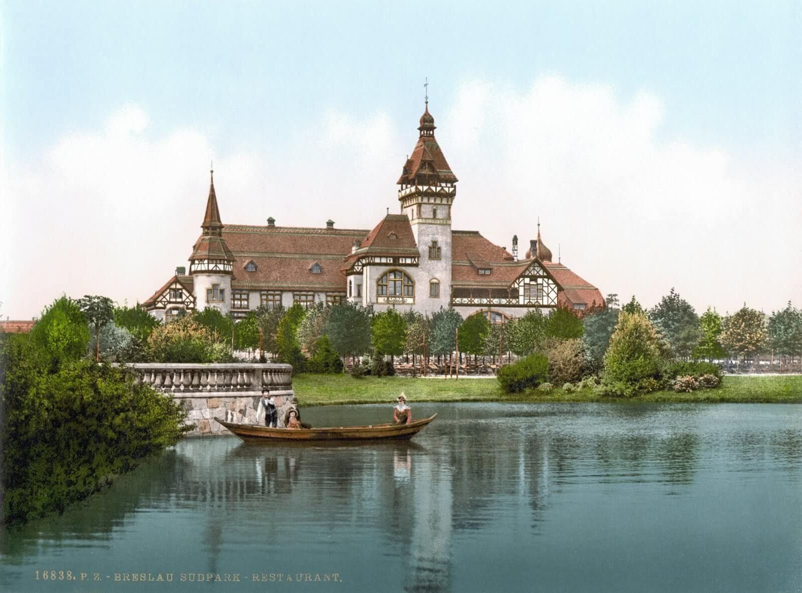

### "Cukoo"

Brytyjska 6th Guards Tank Brigade miała plan utworzenia plutonu zdobycznych Panther, niestety nic z tego nie wyszło. W końcu znaleźli jedną nietkniętą Pantherę, przemalowali ja i nazwali Kukułka (ang. Cuckoo), weszła w skład 4th Battalion Coldstream Guards. Odznaczyła się podczas ataku na zamek Geijsteren i Operacji Blackcock. Brytyjczycy byli pod wrażeniem optyki, tego jak pojazd radził sobie na śliskim terenie i fantastycznej armaty.

Trzecią i niestety ostatnią bitwą w jakiej Kukułka wzięła udział była Operacja Veritable w widłach Renu i Roer. Podczas ciężkich walk w lesie Klever Reichswald (Nadrenia Północna-Westfalia) 21 lutego nawaliła pompa paliwowa.

Z żalem musieli porzucić Kukułkę i od tej pory walczyć tylko na Churchillach. Jak na Pantherę wytrzymała zadziwiająco długo, aż cztery miesiące.

- Mark Felton Productions ["Cuckoo - The British Panther Tank" ](https://www.youtube.com/watch?v=bSy7GvniFdk) | [""Deserter" - The British Panther Tank" [YT 3:54]](https://www.youtube.com/watch?v=DhSp4F-4m84) | ["Soviet Panther Tanks" YT 5:00](https://www.youtube.com/watch?v=MwE1IY-LpZk)
- [Cuckoo - The British Panther Tank](http://forum.worldoftanks.com/index.php?/topic/586104-cuckoo-the-british-panther-tank/)
- Podcast Wojenne Historie ["Pantera. Najgorszy czołg drugiej wojny światowej." [YT 39:03]](https://www.youtube.com/watch?v=C6--DS9vxKg)

### 2 Front Białoruski

Zdobyty Czersk, przy utracie ponad 1100 żołnierzy.

### Rada Jedności Narodowej

Polskie władze przedwojenne to był Rząd Rzeczypospolitej Polskiej na uchodźstwie (mylnie czasem określany jako rząd emigracyjny lub londyński; powinno być "na emigracji") wciąż wtedy legalny i uznawany przez aliantów zachodnich aż do 6 lipca 1945.

Struktury krajowe podległe temu rządowi określane są mianem Polskiego Państwa Podziemnego, polityczną reprezentacją tego Państwa, można powiedzieć władzami krajowymi, była Rada Jedności Narodowej.

Dziś Komisja Główna Rady Jedności Narodowej zebrana w Podkowie Leśnej odniosła się do konferencji jałtańskiej, stwierdzając, że jest to umowa międzynarodowa zawarta bez udziału polskiego i bez zgody przedstawicieli państwa polskiego, "*warunki oznaczają dla Polski nowe, niezmiernie ciężkie i krzywdzące ofiary*", a strona polska musi je zaakceptować. Wyraziła gotowość wejścia do Tymczasowego Rządu Jedności Narodowej organizowanego przez komunistów.

Jako zapowiedź nadchodzących warunków politycznych w przyszłej Polsce generał Leopold Okulicki przekazał informację, że NKWD na wschód od Wisły aresztowało ponad 30 tys. AK-owców (15 tys. Lubelszczyzna, 12 tys. Białostocczyzna). Nie wyzwolenie, a inna okupacja.

Niektóre źródła mówią, że było to 22 lutego, rzecz jest do ustalenia.

### Koszyce

Na Słowacji oddziały 237 i 318 Dywizji Strzeleckich 18 Armii 1 Frontu Ukraińskiego zajęły Koszyce. Było to pierwsze duże miasto Czechosłowacji zdobyte przez Armię Czerwoną. Drugie co do wielkości miasto słowackie, po Bratysławie.

<SeeAlso txt="Słowacja" url="/festung-breslau/article/slowacja" />

Podczas walk o miasto zginęło 30 czerwonoarmistów. Nad ich zbiorową mogiłą wzniesiono pomnik wdzięczności. Plac, na którym go postawiono, nazwano Placem Wyzwolicieli. Później 18 Armia weźmie udział w operacji morawsko-ostrawskiej.

Historia Czechosłowacji biegła zupełnie innym torem niż historia Polski. Co dla nas jest najbardziej widoczną różnicą to stosunek polityków demokratycznych do Rosji i sowietów. Z powodu podległości wobec Austrii, a wcześniej generalnie polityki i kultury niemieckiej z naszego punktu widzenia Czesi są rusofilami. Po drugie zupełnie odmienna pozycja partii komunistycznej, która w Czechosłowacji cały czas od powstania w 1921 działała legalnie i miała uznaną pozycję na scenie politycznej. Dopiero hitlerowcy ją zdelegalizowali na terenie Protektoratu Czech i Moraw. Podsumowując: Kreml nie był wrogiem (już bardziej zdrajcy z Monachium), a komuniści byli postrzegani jako swoja, własna, czechosłowacka partia polityczna.

Już w marcu 1945 w Moskwie (symptomatyczny wybór lokalizacji) odbyły się rozmowy z kilkoma wybranymi partiami politycznymi: narodowi socjaliści, ludowcy (chadecja), socjaldemokraci, Partia Demokratyczna oraz partie komunistyczne Czech i Słowacji. Tak przy zgodzie Beneša formowała się powojenna Czechosłowacja, do przewrotu lutowego w 1948 częściowo demokratyczna.

Właśnie w Koszycach ulokowały się władze nowej Czechosłowacji. 5 kwietnia 1945 ogłoszono tam program koszycki (na pewien sposób czechosłowacki odpowiednik manifestu PKWN). Do 21 kwietnia Koszyce były mniej więcej tym samym dla Czechosłowacji, czym dla PRL był Lublin.

### Wrocław

Dziś ostatnie chwile na bezpiecznej tyłówce celebruje znany nam z wczorajszego wpisu Hugo Hartung, jeszcze nieświadom, gdzie go jutro pchnie wojna, pisze:
>W radio słyszymy dobre nowiny "Żerniki zostały odzyskane, sytuacja w okolicach Parku Południowego ustabilizowała się". Wieczorem, choć na dworze plucha i szarówka, jeszcze raz urządzamy głośną fetę z mięsnymi delicjami i śpiewem.

Nieważne czy wierzy w radiowe wiadomości. Od jego wiary nie zależy ani stan faktyczny, ani tego, co naprawdę oznaczają.

Ksiądz Paul Peikert:
>Wyrażona wieczorem ubiegłego dnia ogromna obawa, z którą spoglądamy na nadchodzącą noc, miała się już fatalnie spełnić wieczorem tego samego dnia. Pierścień wokół Wrocławia zaciska się coraz mocniej. Rosjanie wdarli się do południowego przedmieścia i walczą już na Książu we wschodniej części miasta. Główne natarcie spodziewane jest z południa i zachodu. Przygotowanie do tych ataków ma przeprowadzić lotnictwo, siejąc straszliwy zamęt.

Po opisie wczorajszego bombardowania, kiedy już przedstawił nam grozę wielu godzin spędzonych z zatłoczonych piwnicach i powszechne przygnębienie oraz brak wiary w sens dalszej walki, uzupełnia ten obraz, ukazując skutki, jak i dalszy ciąg zniszczeń tym razem dokonywanych bezpośrednio przez Niemców: na rozkaz Hitlera wrocławski mieszczanin, cywil został wciągnięty w rygor wojskowej dyscypliny, dostał opaskę Volkssturmu, pancerfausta i ma walczyć do upadłego w ruinach własnego domu. Ruinach dlatego, że najpierw sam wysadzi go w powietrze:
>Wygląd miasta sprawia przygnębiające wrażenie. Szyby przeważnie wybite, ulice pełne brudu i zasypane odłamkami szkła z okien. Szczególnie ucierpiało przedmieście południowe. Na Moście Grunwaldzkim (Kaiserbrücke) spotkałem żołnierza z Volkssturmu, dobrego katolika z mojej parafii. Należy do Sprengkommando (oddział minerów). Zadaniem tego oddziału i jest wysadzanie w powietrze co wieczór o godz. 20 will w południowych rejonach Wrocławia. W słowach pełnych oburzenia opisywał mi, jak to marnuje się cenne dobra w chwili, gdy zostaliśmy kompletnymi nędzarzami i wszystko jest nam niezbędnie potrzebne. Opowiadał, że letnie dworki zamożnych ludzi pełne są cennego sprzętu: mebli, bielizny, ubrań i kosztowności rodzinnych. Mieszkańcy przeważnie musieli spiesznie uciekać i stąd też mogli zabrać z sobą tylko to, co najkonieczniejsze. Ze wszystkim, co się wewnątrz znajduje, wysadza się dom w powietrze i wszystko znika pod wielką górą gruzu. A wszak dzielnice willowe Wrocławia stanowiły interesującą osobliwość naszego miasta. Za ciężko zaoszczędzony pieniądz ludzie zdobywali się na te niewielkie własności. Teraz zaś rzuca się wszystko na ofiarę molochowi militaryzmu. Zniszczenia i rozlew krwi sprowadziła ta wojna w rękach rządu, dla którego stanowi cel sam w sobie i który uczynił ją w końcu narzędziem zagłady własnego narodu. To już nie wojna z wrogiem, lecz wojna prowadzona przeciw własnemu narodowi, przeciw wszystkiemu, co dlań drogie i wartościowe.

Taka była przyszłość tego starcia, walki na śmierć i życie, zażarte i niejednokrotnie przerażające nawet zawodowych żołnierzy; w rosnącym morzu zasnutych dymem ruin pożerających miasto w huku bomb, krzyku rozkazów, jęku rannych. Bez wytchnienia i ze złamaniem wszelkich reguł.

Plan Głuzdowskiego realizowany od wczorajszego przedpołudnia miał jedną zaletę i jedną wadę. Polegał on na - nieuniknionym w tych warunkach urbanistycznych - ataku wzdłuż linii komunikacyjnych, wzdłuż głównych dróg, od zachodu: Grabiszyńskiej, Powstańców Śląskich, Ślężnej. Zaleta polegała na tym, że łatwo było uformować natarcie, takie drogi były niczym kaniony czekające na wody roztopów. I taka też była ich wada. Kierunek natarcia, sposób przeprowadzenia, nawet przebieg, były całkowicie przewidywalne.

Nadchodzące dni walk dają się streścić następująco: główne natarcie po osiągnięciu pewnych sukcesów docierało do przygotowanej naprędce, ale skutecznej bariery i tam się zatrzymywało w sposób godny Wielkiej Wojny, natomiast boczne natarcia mające wyszukać słabych miejsc w obronie wroga grzęzły w ruinach, w resztkach domów, w gęstej sieci małych uliczek, w walkach o każde piętro, w pułapkach minowych, w krzyżowym ogniu z boków, z tyłu, w niezrozumiałej i niepojętej gęstwinie możliwości śmierci czyhających we wszystkich rzeczach widzialnych i niewidzialnych.

Wiele czasu zabierze ukraińskim chłopom rozpoznanie właściwości nieprzyjaciela w tym amoku i nieprzeniknionym labiryncie ognia, muru, szkła, szarej niezarośniętej jeszcze trawą ziemi, domów, drzew, kabli i szyn. Obie strony rozpoznawały się, badały swoje możliwości. W powszechnej opinii walka o Wrocław miała się wkrótce zakończyć i okrutną prawdą było, że całkiem niepotrzebnie dla wielu - i tych walczących na froncie wrocławskim, jak i tych szukających ocalenia na tyłach - rzeczywiście wkrótce się zakończyła.

<BoxImageWrapper>

Zniszczona w czasie wojny restaturacja Haasego, Park Południowy 
Źródło: Wikipedia By nieznany - Ten image pochodzący z zasobów [Biblioteki Kongresu Stanów Zjednoczonych](https://commons.wikimedia.org/wiki/Library_of_Congress), oddziału Prints and Photographs division jest dostępny pod numerem [ppmsca.01066)[http://hdl.loc.gov/loc.pnp/ppmsca.01066).Ten szablon nie wskazuje stanu prawnego pliku. Standardowy szablon licencji jest nadal wymagany. Aby dowiedzieć się więcej zajrzyj na stronę [Commons:Licencja](http://commons.wikimedia.org/wiki/Commons:Licencja), Domena publiczna, [Link](https://commons.wikimedia.org/w/index.php?curid=17248185)
</BoxImageWrapper>

### Rozgłośnia radiowa

Dziś wieczorem drugi atak na budynek rozgłośni, po pierwszym, w którym utracili T-34 i dwa uszkodzone SU-76, korzystają z pomocy Czesława Lange, Polaka, który był robotnikiem przymusowym Linke-Hoffman i znał obiekt doskonale:
>Ponieważ dobrze znałem ten budynek, z czasów, gdy pracowałem przy jego umacnianiu, moje informacje okazały się bardzo przydatne przy ustalaniu planu akcji. Rozpoczęła się ona na sygnał dany zieloną rakietą o godzinie 16. Ważną rolę odegrała grupa żołnierzy naszej Kompanii, dowodzona przez sierżanta Komarowa, która przebrana w zdobyczne mundury niemieckie, zmyliła czujność hitlerowców i zbliżyła się do budynku od strony ulicy Żołnierskiej. Żołnierze ci wdarli się do radiostacji, całkowicie zaskakując przeciwnika. Równocześnie od czoła uderzyły na budynek dwie silne grupy szturmowe.[...] Hitlerowcy zaatakowani równocześnie z paru stron i zdezorientowani, zwłaszcza działaniem grupy Komarowa, wyskakiwali przez okna z górnych pięter, łamiąc przy tym ręce i nogi.

Jutro kolejny generalny atak na miasto.
