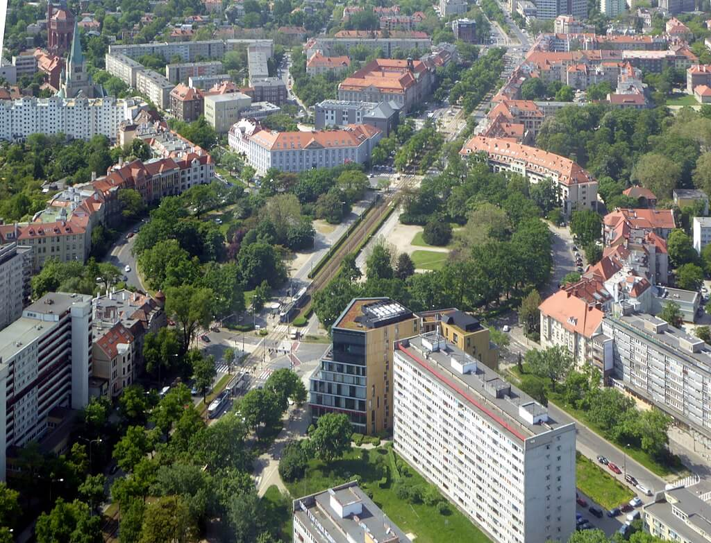

### Sophie Scholl

22 lutego 1945 to druga rocznica śmierci Sophie Scholl, symbolu oporu zwyczajnych Niemców wobec reżimu hitlerowskiego. Historia Białej Róży. 

<SeeAlso txt="Sophie Scholl (1921-43)" url="/festung-breslau/article/sophie-scholl" />

### Jacques Doriot

W Mengen (Wirtembergia) w wyniku ostrzału lotniczego ginie Jacques Doriot, polityk francuski i kolaborant. Przez wiele lat działacz komunistyczny, potem założyciel faszystowskiej Francuskiej Partii Ludowej (fr. Parti Populaire Français, PPF). Od 1937 zwolennik Mussoliniego i zbliżenia z hitlerowskimi Niemcami.

Po kapitulacji Francji był jednym z twórców polityki aktywnej kolaboracji zwanej "kolaboracjonizmem". Reaktywowana w warunkach okupacji i wspierana przez Niemców PPF osiągnęła liczbę 300 tys. członków. Po zaatakowaniu sowietów hitlerowcy powołali Legion Ochotników Francuskich przeciw Bolszewizmowi (fr. Légion des volontaires français contre le bolchevisme, niem. Infanterie Regiment 638; LVF). Doriot wstąpił do LVF i wszedł w skład Centralnego Komitetu LVF. Walczył w składzie LVF. Od tego czasu stale ma na sobie mundur SS.

Po wyzwoleniu Francji Doriot zostaje członkiem rządu Vichy na wygnaniu z siedzibą w Sigmaringen. Usiłował tam wspólnie z innymi kolaborantami (m.in. Marcel Déat, Joseph Darnand) powołać Komitet Wyzwolenia Francji (fr. Comité de libération française).

Kiedy ginie w Mengen, ma na sobie mundur SS. Został pochowany na miejscowym cmentarzu.

Joseph Darnand został schwytany i przekazany Francuzom. Skazany za zdradę i rozstrzelany 10 października 1945.

Marcel Déat został zaocznie skazany na śmierć. Wyroku nie wykonano, bo ukrywał się we Włoszech, gdzie zmarł z przyczyn naturalnych w 1955.

- [Jacques Doriot](https://fr.wikipedia.org/wiki/Jacques_Doriot)
- [Joseph Darnand](https://fr.wikipedia.org/wiki/Joseph_Darnand)
- [Marcel Déat](https://pl.wikipedia.org/wiki/Marcel_D%C3%A9at)

### Bombardowanie Szwajcarii

Dzisiaj amerykańskie bombowce skierowane na Niemcy przez pomyłkę zbombardowały 13 szwajcarskich miast, zabijając 21 ludzi.

Nie był to jedyny tego typu przypadek. 4 kwietnia 1945 sześć B-24 zrzuciło 24 ton bomb na Zurich, zabijając 5 ludzi, inne 18 ton bomb na Bazyleę. Leciały na Aschaffenburg (Bawaria), ale jak wykazało śledztwo zła pogoda i wyjątkowo silny wiatr spowodował błąd w nawigacji.

Od początku wojny stosunki szwajcarsko-amerykańskie były napięte. Amerykanom zdarzało się korzystać ze szwajcarskiej przestrzeni powietrznej, wiele bombowców zostało zestrzelonych przez szwajcarskie Me Bf-109.

- [Mark Felton Productions "America's 'War' Against Switzerland" [YT 10:01]](https://www.youtube.com/watch?v=FILxoQyKzDg)

### Richard Henkes

W KL Dachau zmarł Richard Henkes, ksiądz katolicki działający na Dolnym Śląsku (m in Ząbkowice Śląskie). Aresztowany przez Gestapo za krytykowanie hitleryzmu w kazaniach. Zaraził się tyfusem od chorych, którymi się opiekował.

### 1 Front Białoruski

1 Front Białoruski Choszczno i Rytel.

### Gubin

22 lutego obchodzono święto "wyzwolenia Gubina". Pomijając kwestię "wyzwolenia" niemieckiego miasta, kiedy właściwie Armia Czerwona zdobyła Gubin? 22 lutego czy... 24 kwietnia? Duży rozrzut.

Rzecz w tym, że już 20 lutego większa część prawobrzeżnego Gubina została zajęta przez oddziały 3 Armii Gwardii 1 Frontu Ukraińskiego. Ponieważ po żadnej ze stron nie były zaangażowane większe siły, walki toczyły się jeszcze wiele dni. Pod koniec lutego jeden z niemieckich kontrataków został zarejestrowany dla kroniki filmowej Deutsche Wochenschau. Dopiero 10 marca sowieci dokonali ataku na lewobrzeżny Gubin, nieudanego.

Kolejny atak na lewobrzeżny Gubin został dokonany dopiero 21 kwietnia (Armia Czerwona była już w Berlinie) i ostatecznie Gubin zdobyła 24 kwietnia 1945 33 Armia 1 Frontu Białoruskiego.

W wyniku takiego przebiegu walk prawobrzeżna (późniejsza polska) część miasta została zniszczona w 90%, podczas gdy lewy brzeg ocalał.

W leżącym 20 km na południe Forst było dokładnie na odwrót.

- gazetalubuska.pl ["Czy 24 kwietnia 1945 zdobyto Gubin?"](https://gazetalubuska.pl/czy-24-kwietnia-1945-zdobyto-gubin/ar/7850653)

### Wrocław

Jedną z głównych osi natarcia z południa jest Strasse der SA, czyli obecna Powstańców Śląskich. Armia Czerwona dotarła do ronda (pl Powstańców Śląskich).

Sen a może maligna Hugo Hartunga zakończyła się gwałtownie:
>Po południu nasza sielanka raptownie się kończy. Na Alsenstraße (obecnie ul. Czarnieckiego) zajeżdżają wielkie ciężarówki i rozlega się znienawidzona komenda "wymarsz!". Mamy być przeniesieni do centrum walk ulicznych na południu. Podróż przez śródmieście przebiega w szalonym tempie, nierzadko pod obstrzałem. Spod plandeki nie możemy oszacować rozmiaru zniszczeń. Im dalej na południe, tym silniejsze czuję przygnębienie. Każdy tutejszy ogródek, każdy kawałek bruku, to kawałek najbliższej sercu małej ojczyzny

Kiedy już dotarli, na miejscu ulokowali się w niewygodnej piwnicy, i dalej pisze:
>głowa mi pęka od tego piekielnego hałasu na zewnątrz. Pomimo to spróbowałbym przejść tych kilka kroków do mojego mieszkania. Ale kapral, któremu przedstawiam to życzenie mówi: 
>- Człowieku czyś ty oszalał? Przez Pl. Powstańców Śląskich (Hindenburgplatz) nikt już się żywcem nie przedrze.
>- A więc piekło jest tak blisko! 
>Wieczorem rozdają nam butelki z najwyborniejszymi trunkami, które najwyraźniej uchowały się jeszcze w piwnicach dowództwa Luftwaffe: najlepsze marki szampana, francuski wermut i koniak. Nikogo to jednak nie rozwesela, powszechne przygnębienie nie ustępuje.

Ciągle jest sznaps, ale jakże inna atmosfera, widok okolic własnego domu bombardowanych i ostrzeliwanych, perspektywa rychłej śmierci, chaos wynikający z braku wyszkolenia, z braku dowodzenia i braku łączności. Żołnierze z pospolitego ruszenia nie wiedzą, co się dzieje w sąsiednim domu. Jeżeli nie strzelają do swoich to tylko dlatego, że mają problem ze strzelaniem.

<BoxImageWrapper>

Plac Powstańców Śląskich współcześnie (Hindenburgplatz); widok od południowego zachodu 
Źródło: Wikipedia By [Renardo la vulpo](https://commons.wikimedia.org/wiki/User:Renardo_la_vulpo) - Fotografia własna, [CC BY-SA 4.0](https://creativecommons.org/licenses/by-sa/4.0), [Link](https://commons.wikimedia.org/w/index.php?curid=59701768)
</BoxImageWrapper>

Ksiądz Peikert esencjonalnie o życiu w Twierdzy
>O godz. 8 idę z wiatykiem na Tauentzienstraße 96 w czasie ciężkiego bombardowania z powietrza. Tauentzienstraße znajduje się pod silnym ogniem dział nieprzyjacielskich. Liczne wybuchy nieprzyjacielskich pocisków i ciężkie szkody w wielu domach. Często jestem jedyną osobą cywilną na ulicy. W dom, w którym udzielam wiatyku, trafia właśnie ciężki pocisk. Święty obrządek dokonywa się w schronie. Łóżka stoją jedno obok drugiego, tak że dla stołu nie ma już miejsca. Najświętszy Sakrament trzeba było złożyć na jednym z łóżek. [...] Wszyscy wiedzą we Wrocławiu, że tej wojny już wygrać nie można, obserwują z obawą i trwogą, jak to wspaniałe miasto, dzieło stuleci, staje się kupą gruzu, i nie mogą nic uczynić, aby klęskę odwrócić.

Do obrony zajezdni tramwajowej hitlerowcy rzucili 56 batalion Volkssturmu, to byli chłopcy z Hitlerjugend. Jak wspomina Lange:
>Pod osłoną ognia artylerii i moździerzy sforsowaliśmy nasyp kolejowy i zaatakowaliśmy zabudowania zajezdni tramwajowej. Bronili ich kilkunastoletni smarkacze z Hitlerjugend. Nawała ogniowa zadała im duże straty. Ci, co przeżyli byli przerażeni i niezdolni do walki. Widok tych dzieciaków w mundurach Wehrmachtu zaszokował wielu żołnierzy radzieckich. Wojna jest jednak wojną i ma swoje prawa. Każdy, kto ma broń i strzela do nas jest wrogiem i musi być unieszkodliwiony.

Parku Południowego bronił 55 batalion Volkssturmu w takim samym składzie.

Von Ahlfen niechętnie pisze o porażkach, często je pomija, o utracie nasypu kolejowego:
>Dowództwo zaś postąpiło słusznie, godząc się z tą stratą. Inne decyzje kosztowałyby wiele cennej niezastąpionej krwi. [...] Dlatego w porę zadbało o jedyne rozwiązanie, możliwe ze względów czasowych, tzn. zaminowanie wiaduktów kolejowych, których wysadzenie udało się we właściwym momencie walk, około 20 lutego. Gruzy tych wiaduktów utworzyły skuteczne zapory drogowe. [...] Zamknijmy sprawę nasypu kolejowego jeszcze jednym zdaniem: o stwierdzonych błędach w rozbudowie i ich skutkach poinformowano, w celu wykorzystania tej wiedzy w innych częściach miasta, przybyłego wreszcie samolotem około 18 lutego dowódcę pułku saperów majora Hameistera.

### Fallschirmjäger

W dniach 22-24 lutego do Wrocławia dotarł 1 batalion 26 pułku spadochronowego.

Szybowce DFS 230 i Gotha Go 242 holowane przez He-111 i Do 17 z Schleppgruppe 1 lądują na terenie Stadionu Olimpijskiego. Jest to oddział kapitana Skau z 25 pułku 9 Dywizji Spadochronowej. Żołnierze od razu włączają się do walki w Żernikach. 28 lutego przybędą posiłki z 26 pułku samolotami Ju 52/3m wylądują na lotnisku w Gądowie Małym. Z powodu silnej obrony przeciwlotniczej część samolotów wyląduje w Świdnicy i ci żołnierze dotrą do Wrocławia etapami aż do 5 marca. W sumie dotrze do Twierdzy 400 do 700 spadochroniarzy. [22 lutego 1945 r. - desant we Wrocławiu](https://www.facebook.com/groups/HistoriaNaKazdyDzien/permalink/3369315703137263/)