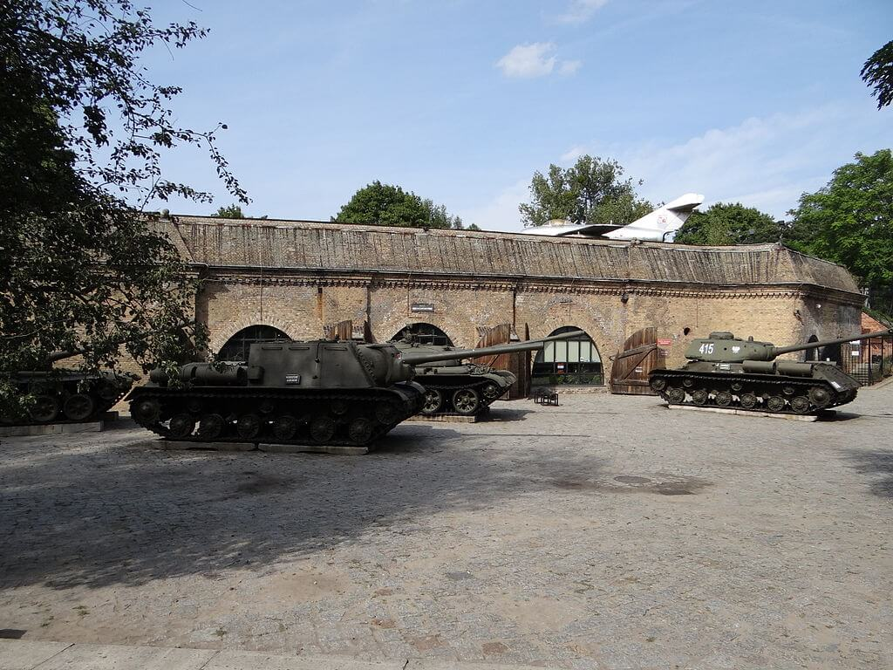

### Iwo Jima

Za dwa dni zakończy się bitwa o Corregidor.

Od czterech dni trwa jeszcze bardziej krwawy i dramatyczny bój o Iwo Jimę. Bitwa potrwa miesiąc. Niemal wszyscy obrońcy wyspy zginą. Choć do Tokio jest stąd ponad 1000 km bezmiaru Pacyfiku, oficjalnie jest to japońska ziemia.

<SeeAlso txt="Bitwa o Iwo Jimę" url="/festung-breslau/article/pacyfik-iwo-jima" />

To właśniew dziś W piątym dniu bitwy 6 Marines zatknęło sztandar amerykański na szczycie Suribachi. Zostało to sfotografowane przez korespondenta wojennego Associated Press Joe Rosenthala. Wszyscy znamy tę fotografię. Jest to jedna z kilku najbardziej znanych scen całego XX wieku. Za dwa dni fotografia zostanie opublikowana w New York Times.

### Turcja

Neutralna do tej pory Turcja wypowiedziała wojnę Niemcom.

### Aleksiej Tołstoj

Zmarł Aleksiej Tołstoj syn Lwa Tołstoja, również pisarz. Miał duży udział w badaniu zbrodni hitlerowskich. Udowodnił zabijanie ludzi w ciężarówkach gazowych.

### Poznań

O godzinie 0600 kapitulacja poznańskiej Cytadeli, koniec bitwy o Poznań.

Dowódca Twierdzy generał Ernst Gonell skapitulował i popełnił samobójstwo. Jego następca generał Enrst Mattern poddał się wraz z 23 tys. żołnierzy. Miasto było w połowie zniszczone, w walkach zginęło 6 tys. żołnierzy sowieckich.

W walkach o Cytadelę wzięło udział 2 tys. poznaniaków, którzy chcieli by walki w ich mieście jak najszybciej się zakończyły. Większość z nich pełniła rolę przewodników i na tyłach wspierała ataki czerwonoarmistów. 84 z nich zginęło.

W Poznaniu wiele było przypadków, kiedy wzięci do niewoli, ranni lub poddający się żołnierze niemieccy byli na miejscu zabijani. Taki los spotkał 40 rannych Węgrów schwytanych w klasztorze sióstr Pasterek, gdzie broniła się brygada węgierska (ok. 450 żołnierzy). W Cytadeli były 2 tys. rannych trzymanych w kazamatach. Wszyscy którzy nie byli w stanie wyjść o własnych siłach zostali spaleni żywcem miotaczami płomieni. Wśród tych, którzy wyszli przeprowadzono selekcję, esesmanów i policjantów rozstrzeliwano na miejscu. Jeżeli żołnierz nie miał żadnych dokumentów, musiał przedstawić dwóch świadków na deklarowany charakter służby.

Zdobycie Poznania wypadło w święto Armii Czerwonej.

Generał Wasilij Czujkow:
>Poznań jest silnie ufortyfikowaną twierdzą. A my myśleliśmy, że to jest miasto, które zdobędziemy z marszu.

Józef Iwański, architekt, opisuje zwiedzanie cytadeli w grudniu 1945, wciąż była pod strażą sowiecką, wpuszczono go bo był z kuzynem, sierżantem WP:
>Po dłuższym zwiedzaniu dotarliśmy do starego ceglanego bunkra z dużym napisem Rettungstelle. Oba przeciwległe wejścia były osmalone ogniem, lecz nie tak jak po zwykłym pożarze. W bunkrze panowały ciemności, ale mieliśmy ze sobą dość silną latarkę elektryczną. Na spalonych łózkach polowych z których zostały jedynie opalone metalowe stelaże i sprężyny, zastygły w potwornej agonii opalone szkielety rannych. Niektórzy z nich mieli na spalonych kikutach rąk i nóg szyny usztywniające. Było też kilka zwłok z opatrunkami gipsowymi. Resztki ciał zostały wyjedzone przez szczury, tak więc opatrunki wyglądały jak poczwarki owadów. Byłą to sceneria jak z piekła Dantego. Ciągle widzę potwornie poskręcane w agonii kikuty rąk i nóg. Umeblowanie bunkra nie mogło spowodować pożaru w takiej skali. Pożar nie był tak intensywny jak np. w palącym się czołgu, kiedy to zwęglone zwłoki kurczą się do rozmiaru dziecka. Trupy w bunkrze miały wymiary naturalne, jak przy miejscowym pożarze.

Bitwa o Poznań, Cytadela:

- dzieje.pl [Łukasz Starowieyski "Cytadela padła ostatnia. Oswobodzenie Poznania"](https://dzieje.pl/rozmaitosci/cytadela-padla-ostatnia-oswobodzenie-poznania)
- Radio Poznań ["Historia jakiej nie znacie - Śmierć w płomieniach"](http://radiopoznan.fm/audycja/sluchowiska/historia-jakiej-nie-znacie-Smierc-w-plomieniach.html)
- ["Cytadela - ostatni punkt niemieckiego oporu - poddała się 23 lutego 1945 r. o godzinie szóstej"](https://www.poznan.pl/mim/s8a/czy-wiesz-ze,doc,576/cytadela-ostatni-punkt-niemieckiego-oporu-poddala-sie-23-lutego-1945-r-o-godzinie-szostej,32010.html)
- [Piotrek Świątkowski "Cytadela Poznań" [YT 16:34]](https://www.youtube.com/watch?v=A3xWvTFQoK0)
- [inrockvesper "Festung Posen, Bitwa o cytadelę Poznańską 1945 WTK & Vesper" [YT 14:57]](https://www.youtube.com/watch?v=FqWyr9QozFg)
- [Pomost "Poznań 1945" [YT 25:23]](https://www.youtube.com/watch?v=Af8nL9IJDS8)
- [StudioNet24 pl "Festung Posen 1945 - wykład dr. Michała Krzyżaniaka" [1:23:35]](https://www.youtube.com/watch?v=WHlRIMUqTwg)
- maniakkk87 ["Tajemnice Poznania - Oblężenie" [15:07]](https://www.youtube.com/watch?v=imASHFiGtw8) | ["Tajemnice Poznania - Twirdza" [YT 15:18]](https://www.youtube.com/watch?v=r2MOBb81p_A) | ["Tajemnice Poznania - Enigma" [YT 14:22]](https://www.youtube.com/watch?v=3siJLy3VcRw)
- ubot961 ["Poznań 1945 część 1" [YT 14:45]](https://www.youtube.com/watch?v=HV4L0DxJJUg) | ["Poznań 1945 część 2" [YT 10:23]](https://www.youtube.com/watch?v=8bPbW0Ab2N4)
- [GoExplorers "Twierdza Poznań - Cytadela" [9:35]](https://www.youtube.com/watch?v=aqAIckTRecA)
- [History Hunters "URBEX - History Hunters - Bitwa o Poznań Podziemia Cytadeli (Fort Winiary)" [YT 21:57]](https://www.youtube.com/watch?v=vfo5j70ykEk)
- [Urbex History "Podziemia Fortu Winiary - Poznań - Urbex History" [YT 14:37]](https://www.youtube.com/watch?v=LhBzcurj0og)
- [KUBOLLO "Fort Winiary - Poznań" [YT 3:45]](https://www.youtube.com/watch?v=jHyhFkoo0mA)
- Stowarzyszenie Eksploracji PERKUN ["Kronika Poznań Cytadela 45" [YT 1:06]](https://www.youtube.com/watch?v=Nl88Hwm5Upo) | ["Eksploracje Fort VI Tietzen w Poznaniu" [YT 10:47]](https://www.youtube.com/watch?v=yHLZO1wf0iA)
- Tube Raiders ["Tajemnice Twierdzy Poznań cz.1 - UrbEx - Tube Raiders" [YT 16:14]](https://www.youtube.com/watch?v=0ZZS5HxhT2U) | ["Tajemnice Twierdzy Poznań cz.2 - Tube Raiders" [YT 13:24]](https://www.youtube.com/watch?v=4KnAvUpIeXw)
- Wielkopolskie Muzeum Niepodległości ["SWT-40 vs Gew43 - "Poznań 1945 - uzbrojenie"" [YT 19:03]](https://www.youtube.com/watch?v=Dsp-VxopSUA) | ["Broń krótka - "Poznań 1945 - uzbrojenie"" [YT 20:34]](https://www.youtube.com/watch?v=uIRutbZ2xx8)

Gauleiter Arthur Greiser:

- [Piotrek Świątkowski "Wanda i Arthur Greiser" [YT 14:42]](https://www.youtube.com/watch?v=4g7DFBeQJWg)
- [Oblicza XX Wieku "Za kulisami procesu Arthura Greisera" [YT 22:20]](https://www.youtube.com/watch?v=Rt3x1qLW21g)

Więcej o twierdzy poznańskiej:

- Uniwersytet im. Adama Mickiewicza w Poznaniu  ["#46 prof. Zbigniew Pilarczyk - "Twierdza Poznań"" [YT 53:35]](https://www.youtube.com/watch?v=X5HNC63nzRY) | ["#20 prof. Zbigniew Pilarczyk - "Wpływ fortyfikacji na rozwój przestrzenny Poznania"" [YT 57:59]](https://www.youtube.com/watch?v=P2KeSH63AaE)

### Rudolf Lange

Tego dnia w Poznaniu podczas walki lub z wyniku samobójstwa w Cytadeli (są różne relacje) ginie Rudolf Lange, oficer SS, zbrodniarz wojenny.

W Gestapo od samego początku, czyli od 1933. Jeden z dowódców Einsatzgruppe A, która na Łotwie zabiła ćwierć miliona ludzi w pół roku. Z powodu doświadczenia w masowych egzekucjach brał udział w konferencji w berlińskim Wannsee, na której podjęto decyzję o wymordowaniu Żydów w obozach zagłady. Potem wrócił na Łotwę, gdzie organizował zabijanie ludzi w ciężarówkach gazowych. Od października 1944 szef poznańskiego Gestapo, oraz Sipo i SD w "Kraju Warty". Jeden z kluczowych organizatorów Holokaustu i wcześniej Akcji T4.

<SeeAlso txt="Github: tdudkowski / t4" comment="Teksty na stronę o Akcji T4" url="https://github.com/tdudkowski/t4" />

*Cytadela Poznań, Muzeum Uzbrojenia w Poznaniu 
Źródło: Wikipedia By [Artrac](https://commons.wikimedia.org/w/index.php?title=User:Artrac&amp;action=edit&amp;redlink=1) - Praca własna, [CC BY-SA 3.0 pl](https://creativecommons.org/licenses/by-sa/3.0/pl/deed.en), [Link](https://commons.wikimedia.org/w/index.php?curid=21565395)*

### Wrocław

Nawet jeśli ktoś w oblężonym Wrocławiu dowiaduje się o upadku Poznania, nie wywołuje to wielkich emocji. Na pewno tym, który żywo reaguje na tą wieść jest dowódca oblegającej Wrocław 6 Armii, generał Głuzdowski. Upadł punkt oporu pod wieloma względami porównywalny do jego Wrocławia, a tymczasem on nawet nie zbliżył się do centrum. Atak po ataku grzęźnie w mieście zamienianych przez obie strony w ruiny, bataliony topnieją, opór krzepnie. Ach, gdyby wreszcie udało się dokonać przełomu!

Szturm generalny pełną siłą Armii skoncentrowaną - przeprowadzony w podręcznikowy sposób - na wąskim odcinku, rozpoczął się 20 lutego. A trzy dni później linia frontu przebiegała zaledwie kilometr dalej, na zachodnim odcinku bez zmian, natomiast w kierunku wschodnim: południowym skrajem Muchoboru Wielkiego (niem. Groß Mochbern) i dalej linią kolejową, a potem równoleżnikowo mniej więcej linią obecnych ulic Hallera i Armii Krajowej - czyli Obwodnicą Śródmiejską, której plany powstały w biurze urbanistycznym Maxa Berga w 1921 - i do Odry południową granicą Księża Wielkiego (niem. Groß Ohlewiesen) i Mokrego Dworu (niem. Althofnaß). W 1945 linia tej obwodnicy była zrealizowana tylko na odcinku pomiędzy Grabiszyńską a Ślężną (nosiła nazwę na zachód od Powstańców Śląskich Kürasierstraße a na wschód Kirchee Alee), więc front na wschód od Ślężnej miał bardziej skomplikowany przebieg. Sowieci wdarli się aż w głąb Gajowej (niem. Herdain), która jednak wówczas była przeciągnięta bardziej na południe, a potem Bardzką i Laskową (niem. Strehlener), Ziębicką (niem. Mũnsterberger), Klimasa (niem. Hippel) w kierunku Książa. Do tego czasu, przez trzy dni utracili w walkach 76 czołgów i transporterów opancerzonych. Wycofali więc siły pancerne i rzucili do walki saperów niszczących fortyfikacje i miotacze ognia do walki z piechotą.

Największym sukcesem po trzech dniach zaciekłych walk było to, że 309 DP odrzuciła słaby pułk Wehl, na wysokość obecnej ul. Hallera i zdobyła Koszary Kirasjerów, w których miesiąc temu formowany był garnizon Twierdzy.

Świadek zacytowany w monumentalnej pracy Gleissa pisze o dzisiejszej sytuacji na Oporowie:
>Obok siebie leżały jedno przy drugim setki ciał żołnierzy niemieckich. Wielokrotnie musieliśmy oglądać, jak nawet zwłoki Rosjan nie są zostawiane w spokoju. Rozdzierano im mundury, zabierano zegarki i portfele, a nawet ściągano obrączki z palców. Wszystkich nas paraliżował strach - jak straszna jest ta wojna! W ciągu kilku ostatnich godzin przeżyliśmy tyle okropności, że oduczyliśmy się płakać.

Inny zaś, również z Oporowa:
>Nagle w sieni usłyszeliśmy głośne krzyki i niebawem pojawił się Rosjanin z dziewczynką, którą brutalnie bił. Zaprowadził płaczące dziecko do sąsiedniego pomieszczenia. Co i rusz słyszeliśmy krzyki i błagania, ale prośby nie zdały się na nic. Kwilenie było coraz słabsze i słabsze, aż w końcu całkiem ucichło. Zaraz potem Rosjanin wyszedł, a kilka odważniejszych kobiet wśród nas poszło zajrzeć do pokoju obok. Musiał to być straszliwy widok. Na podłodze leżała w kałuży krwi trzynastoletnia dziewczynka - kompletnie naga. Już nie żyła."

Ksiądz Peikert:
>Podczas nieustających deszczów ziemia zamienia się w grząskie błoto. Ciągle nadchodzą wieści o dalszym terroryzowaniu i ucisku ludności przez obwodowe grupy partyjne. Na Legnickiej wzywano kobiety i mężczyzn, po czym odkomenderowywano ich do prac przy szańcach na Komandorskiej. Doszedłszy tam, muszą wykonywać swoją pracę w ogniu nieprzyjacielskich dział. Wieczór jest spokojny, noc mglista i dżdżysta.

Jak pisze Hartung, sytuacja staje się groteskowa:
>Ten dzień ulicznych walk staje się naszym piekłem. Już o czwartej nad ranem zajmujemy pozycje w kamienicy przy Kũrassierstraße 17, tuż obok kina Roxy (później Lwów), gdzie niegdyś byłem stałym bywalcem. Rozkaz brzmi "Odpierać ataki Rosjan, którzy zagnieździli się w dzielnicach willowych na południu i których natarcie spodziewane jest z bloków po przeciwległej stronie ulicy. Wraz z dwoma kolegami artystami zajmujemy stanowisko na pierwszym piętrze budynku, kopniakami wyważywszy uprzednio drzwi do mieszkania. W oknie sąsiedniego mieszkania montowany jest karabin maszynowy, o obsłudze którego nikt z naszego oddziału nie ma zielonego pojęcia. Na szczęście dołączyło do nas kilku leciwych funkcjonariuszy Volkssturmu, którzy jeszcze z czasów pierwszej wojny wiedzą jak się z tą bronią obchodzić. Długo nie udaje się nam tam przetrwać, bo ostrzał z granatników nasila się i do naszego pokoju wpada tyle odłamków, że nie sposób się przed nimi osłonić. [...] ponownie wdzieramy się do cudzego mieszkania. Tym razem jest to szczególnie zadbane gniazdko, a piękny pokój dziecinny budzi we mnie bolesne wspomnienia. Wszędzie widać jeszcze oznaki pośpiesznej ucieczki. Spakowane i pozostawione w ostatniej chwili walizki, rozrzucone na podłodze fotografie dzieci i listy, które zaczynają się od słów Kochana Mamusiu.... Jakiś mężczyzna nienależący do naszego oddziału, badawczo lustruje mieszkanie, grzebie w walizkach, tu i ówdzie dotyka rzeczy, które wydają się go interesować. Nagle widzimy kilku ludzi pędem przecinających ulice. Rozlega się wołanie "alarm!". Gdy wbiegają do naszej kamienicy, rozpoznajemy niemieckie mundury. Spotykamy się z nimi na schodach w sieni. Mówią, że należą do rozproszonego oddziału piechoty i teraz wycofują się na własną rękę, bez rozkazu. Ich twarze są szare i niewyspane. Radzą nam, byśmy również czym prędzej stąd uciekali, bo Rosjanie otoczyli ten dom. Jednak nasz kapral nie waży się działać bez rozkazu, chociaż z punktu dowodzenia nie docierają do nas łącznicy. Także w ogrodach za naszymi blokami nieustannie eksplodują granaty, bezlitośnie je orając. W końcu nasza mała drużyna pozostaje zupełnie osamotniona pośród tego piekielnego bałaganu. Nie mamy wsparcia ani z lewej, ani z prawej, ani łączności z tyłami, i nieustannie wpatrujemy się w ul Wolbromską (Carmenstraße), z której mają nadejść Rosjanie. Po dziesięciu godzinach w tym kotle nagle słabnę i tracę przytomność. Nasz sanitariusz, Heinrich Pfanzl wlecze mnie przez ogrody do piwnicy przy ul Wandy (Oranienstraße), gdzie zastajemy naszych. Feldfebel K. desperacko wyczekuje rozkazów z nadrzędnej jednostki.

Dopiero wieczorem najwidoczniej uznając, że rozkazy już nie nadejdą, zaczynają się wycofywać, wszędzie za sobą mijają opuszczone pozycje i stacje sanitarne. Dopiero na wysokości ul Zielińskiego (niem. Hofchenstraße) działa artyleria. W bunkrze pod Teatrem Polskim przy G Zapolskiej (niem. Schauspielhausen) odnajdują działający punkt sanitarny. Hugo cieszy się z tego, że jest w bezpiecznym miejscu, które dobrze zna, m.in. z obchodów osiemdziesiątych urodzin Gerharda Hauptmanna. Dziś natomiast po dotarciu do bezpiecznego miejsca schronienia odnotowuje tylko, że:
>W lodowatej piwnicy Schauspielhausen przespałem siedemnaście godzin.

### Junkers Ju-52 nr 8620

Od tygodnia jedynym pozostałym połączeniem Twierdzy z resztą świata był most powietrzny Luftwaffe. Od lutego do końca kwietnia 6 Luftflotte i grupa lotnicza Herzog wykonały 566 lotów, dostarczyły 3770 i 660 ton ładunku. Ewakuowano 3282 rannych. Utracono 52 Ju-52.

Lecący z Twierdzy Wrocław do Sudetenlandu Ju-52 o 3.45 rozbił się o stok Czarnego Grzbietu pod Śnieżką. Na pokładzie było 4 członków załogi, druga załoga z innego Junkersa, który właśnie rozbił się we Wrocławiu i 20 rannych żołnierzy ewakuowanych z oblężenia. Samolot był przeciążony, panowały fatalne warunki atmosferyczne. Najprawdopodobniej pilot się pomylił i znaleźli się za bardzo na zachód. W ciemnościach wbili się w stok. Wszyscy lotnicy byli z przodu i zginęli na miejscu. Sześciu ocalałych żołnierzy udało się w stronę grzbietu, a potem szlakiem wytyczonym tyczkami i o 7.30 dotarli do schroniska Horská Bouda na Růžohorkach. Tam szybko zorganizowano pomoc, z powodu zamieci ratownicy dotarli do wraku dopiero w południe i nie znaleźli nikogo żywego. Odnalezione 22 ofiary katastrofy pochowano na małym cmentarzu przy kościele w Dolní Malej Upie.

Szczątki samolotu spoczywały na stoku. Dopiero 23 września 1998 to, co pozostało, m.in. silniki przetransportowano śmigłowcem do Malej Upy i umieszczono obok cmentarza. W 2001 w miejscu katastrofy umieszczono tablice pamiątkowe, w języku niemieckim i czeskim. W 2002 dokonano ekshumacji szczątków i przeniesiono je na cmentarz wojskowy w Brnie.

- [Zapomniana katastrofa Junkersa Ju-52 na](https://eloblog.pl/zapomniana-katastrofa-junkersa-ju-52-na-sniezce/)
- [Katastrofa lotnicza pod Śnieżką](https://karkonoszego.pl/artykul/katastrofa-lotnicza-na/1089716)
- [Tuż za horyzontem "Katastrofa pod Śnieżką"](https://robertwas.pl/blog/index.php/2019/07/28/katastrofa-pod-sniezka/)
- [Junkers Ju 52/3m  VB+UO  W.Nr 6820 / 7./Transport Geschwader 3 / Obfw. Emil Hannemann + 22 KIA / Sluneční jáma-Sněžka 23.2.1945](http://www.leteckabadatelna.cz/havarie-a-sestrely/detail/123/)
- [Piotr Mrugalski "Ciotka „Ju” i most powietrzny do Festung Breslau. Największa katastrofa lotnicza w Karkonoszach"](https://skpswroclaw.files.wordpress.com/2017/11/biblioteka130.pdf)
