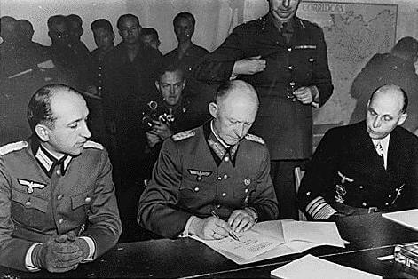

### Bombardowanie Tokio

Pierwszym bombardowaniem Tokio był rajd Doolittle'a 18 kwietnia 1942. 16 bombowców B-25 Mitchell zaatakowało stolicę Japonii z lotniskowca i dotarło do Chin, gdzie samoloty zostały porzucone. Była to dokonana zaledwie 4 miesiące po ataku na Pearl Harbor operacja o wielkim znaczeniu propagandowym. Jeden z jej uczestników pilot major Ted W. Lawson na podstawie własnych doświadczeń napisał książkę "Thirty Seconds Over Tokyo" wydaną latem 1943. W 1944 na jej podstawie nakręcono film pod tym samym tytułem. W 1945 film zdobył Oscara za najlepsze efekty specjalne.

Ironią historii jest, że ceremonia wręczenia Oscarów odbyła się w Grauman's Chinese Theater w Los Angeles 15 marca 1945, pięć dni po bombardowaniu Tokio - najstraszliwszym w skutkach w całej historii ludzkości. W burzy ogniowej wywołanej bombami zapalającymi zginęło ponad 100 tys. ludzi.

Przełomem w zdolności bombardowania amerykańskich sił powietrznych było wprowadzenie bombowca dalekosiężnego B-29 Superfortress o zasięgu do 9 tys. km. Ze względu na zasięg zostały w całości przeznaczone na wojnę z Japonią. Pierwsze jednostki złożone z tych bombowców pojawiły się w kwietniu 1944 w Indiach. Potem utworzono bazy w Chinach (pierwszy lot 24 kwietnia 1944), ale było to bardzo ryzykowne i kosztowne, ponieważ można było je zaopatrywać wyłącznie drogą powietrzną, latając nad Himalajami. Co więcej, wszystkie musiały przelecieć najpierw nad Atlantykiem, lądowały w Anglii, potem leciały nad północną Afryką i dopiero z Egiptu odbywały bezpośredni lot do Indii.

<SeeAlso txt="Wojna na Pacyfiku 1945" url="/festung-breslau/article/pacyfik-1945" />

Zdobycie w lipcu i sierpniu 1944 Marianów Północnych odległych 2,5 tys. km od Wysp Japońskich umożliwiło zbudowanie tam pięciu baz lotnictwa bombowego, po dwóch na wyspach Tinian i Guam i jedną na Saipanie. Przylatywały bezpośrednio z USA via Hawaje (2 x 5 tys. km). Mogły być zaopatrywane drogą morską, znajdowały się dużo bliżej USA niż bazy w Chinach i w przeciwieństwie do nich były poza zasięgiem operacyjnym lotnictwa japońskiego. Pierwszy B-29 wylądował na Marianach 12 października 1944. Niespodziewanym problemem okazał się prąd strumieniowy. Trzeba było zmniejszyć ładunek bomb, a w późniejszym okresie zredukowano uzbrojenie defensywne.

4 lutego 1945 od bombardowania Kobe rozpoczęła się kampania bombowa amerykańskiego lotnictwa.

19 lutego 119 B-29 zbombardowało port i miasto Tokio.

W nocy z 24 na 25 lutego lotnictwo amerykańskie przeprowadziło pierwszy duży nalot na Tokio z użyciem bomb zapalających. 174 B-29 zrzuciło 450 ton bomb, głównie zapalających na pokryte śniegiem miasto. Zniszczone zostało 260 ha Tokio.

Po tym bombardowaniu generał LeMay rozkazał by japońskie miasta bombardować ze średniej wysokości (jak na B-29 bardzo niskiej) 1500 do 2700 m i w nocy. Na tej wysokości japońska obrona plot była najsłabsza, a w nocy z powodu braku dobrych radarów bezradna. Osłona myśliwców i szybkość dawały taką przewagę, że dla zaoszczędzenia zużycia paliwa (a więc zwiększenia zasięgu) kazał zdemontować uzbrojenie defensywne z wyjątkiem karabinów na ogonie.

- World War II Database [Bombing of Tokyo and Other Cities](https://ww2db.com/battle_spec.php?battle_id=217)

### Curtis LeMay

Od 1943 generał USAF, amerykański odpowiednik Arthura "Bombera" Harrisa, zwolennik zniszczenia przeciwnika przy pomocy intensywnych, niszczących nalotów dywanowych.

W sierpniu 1944 został przeniesiony z Europy na China Burma India Theater (CBI) i powierzono mu organizowanie masowego bombardowania Japonii. Stanął na czele XXI Bomber Command.

Był również odpowiedzialny za realizację Operation Starvation - rozpoczętego w końcu marca zniszczenia polami minowymi transportu na szlakach morskich i odcięcia w ten sposób zaopatrzenia Japonii. "*Today it remains one of the least known, most efficient and cost-effective air campaigns in history*" Tillman, Barrett "Whirlwind, the air war against Japan, 1942-45". 

Opracował i wprowadził taktykę bombardowania japońskich miast z operujących w nocy B-29 atakujących na niewielkiej wysokości zrzucających głównie bomby zapalające. Było to możliwe z powodu słabej obrony plot i niebywale skuteczne z powodu w większości drewnianej zabudowy japońskich miast.

Twórca berlińskiego mostu powietrznego.

W latach 1961-65 szef USAF. Na ten czas wypadł kryzys kubański.

W 1968 zaangażował się w kampanię prezydencką George Wallace'a - rasisty i konserwatysty. Krytykował politykę prezydenta Johnsona (1963-69), był zwolennikiem nieograniczonego bombardowania Wietnamu Północnego i mówił, że trzeba "*cofnąć go za pomocą bombardowań z powrotem do epoki kamiennej*". Wybory wygrał Nixon (1969-774).

### Dugway Proving Ground

Najpierw bombardowanie Kobe, a potem bombardowanie innych japońskich miast, głównie Tokio, zostało przećwiczone na poligonie Dugway Proving Ground w stanie Utah ponad 100 km SW od Salt Lake City. Obejmuje 3244 km2 Wielkiej Pustyni Słonej. Powstał w 1942, ponieważ uznano, że dotychczas używany Aberdeen Proving Ground w Maryland był zbyt blisko zamieszkanych terenów.

Jego przeznaczeniem było głównie testowanie broni chemicznej i biologicznej.

W 1968 miał tam miejsce incydent z gazem bojowym VX (Dugway sheep incident), w wyniku którego w Skull Valley zdechło ponad 6 tys. owiec.

Departament Obrony przyznał w raporcie, że w latach 1940-74 przeprowadzano tam setki eksperymentów z niebezpiecznymi bojowymi środkami chemicznymi.

W latach 1997-2006 działał tam High Resolution Fly's Eye Cosmic Ray Detector, którego poprzednik Fly's Eye był pierwszym urządzeniem astrofizycznym potwierdzającym istnienie promieni kosmicznych ultra-wysokich energii (UHECR). Tworzą je cząstki osiągające energie aż do 1020 eV (cząstki o najwyższych energiach, jakie znamy we Wszechświecie). Są ekstremalnie rzadkie, na powierzchnię 1km2 pada jedna taka cząstka na stulecie. To właśnie dlatego wykrytą w 1991 cząsteczkę nazwano Cząstką O-mój-Boże (ang. Oh-My-God particle).

Obecnie badaniem UHECR zajmuje się głównie Obserwatorium Pierre Auger w Argentynie uruchomione w 2008. Zajmuje powierzchnię 3 tys. km2.

### Japońska wioska

Podczas wojny na tym poligonie w 1943 zbudowano dwie wioski - cele ćwiczebne dla amerykańskiego lotnictwa:

- **Wioska Niemiecka** Głównym jej projektantem był urodzony w Olsztynie niemiecki architekt pochodzenia żydowskiego Erich Mendelsohn. Pomagał mu Konrad Wachsmann, który hitleryzm uważał za barbarzyństwo. W 1932 otrzymał stypendium Deutsche Akademie Rom Villa Massimo i przebywał we Włoszech. Od 1938 był we Francji, a po wybuchu wojny zaciągnął się do armii francuskiej. W 1941 przy wsparciu Eeinsteina wyemigrował do USA. Niemiecką architekturę odtworzono niebywale pieczołowicie, łącznie z typowym wyposażeniem, ubraniami w szafach i dziecięcymi zabawkami. Głównym zadaniem było opracowanie właściwej taktyki bombardowania zapewniającej wywołanie burzy ogniowej w wybranym, kluczowym miejscu, oraz zapewnienie skutecznych, trudnych do naprawy szkód. Głównym problemem amerykańskiego lotnictwa była skuteczność Niemców w szybkiej naprawie zniszczonej infrastruktury.
- **Wioska Japońska** Testowano podatność nietypowej w warunkach amerykańskich architektury, do tej pory nieznanej dla amerykańskiego lotnictwa bombowego. Również była oddana fachowo co do najmniejszego detalu. Na stołach leżały pałeczki.

### Antonin Raymond

Projektantem Wioski Japońskiej był urodzony w Kladnie (środkowe Czechy) architekt czesko-amerykański Antonin Raymond.

Przed Wielką Wojną był pod wielkim wpływem Frank Lloyd Wrighta, w 1916 został jego współpracownikiem. Został wtedy obywatelem amerykańskim i zmienił nazwisko z Reimann na Raymond.

W latach 1926-39 był konsulem Czechosłowacji w Tokio. Napisał obszerny raport o skutkach wielkiego trzęsienia ziemi w Kantō (1 września 1923), które dotknęły Tokio. Miało magnitudę 7,9. W wyniku pożarów wywołanych trzęsieniem ziemi spłonęło wiele miast, m in Tokio. Zginęło ponad 100 tys. ludzi, głównie w pożarach. W Japonii ogłoszono stan wyjątkowy. Ocalał natomiast oddany do użytku dokładnie w dniu trzęsienia ziemi Imperial Hotel, najważniejsze dzieło Wrighta w Japonii.

Po wojnie Raymond kupił ziemię w Tokio, w dzielnicy Nishi Azabu zdominowanej przez tradycyjne japońskie budownictwo drewniane w konstrukcji ryglowo-słupowej. Wybudowane przez niego biuro było eksperymentem w zakresie stworzenia właściwej dla Japonii nowej formy taniego budownictwa używającej sklejki fornirowanej i metalowej instalacji ogrzewczej. Zastosował courbuzierowską skalę Modulora.

Jego najważniejszą realizacją w Japonii była kampus Uniwersytetu Nanzan w Nagoja. Powstał zróżnicowany zespół betonowych budynków, część zbudowana na osnowie pilotis (kolumnowej) i zakrzywionych płaszczyzn.

Nie powrócił do Czechosłowacji, pozostał amerykańskim architektem. Jest uważany za jednego z twórców nowoczesnej, powojennej architektury japońskiej. Umarł w USA 1976 w wieku 88 lat.

### Egipt

W październiku 1944 z woli króla Egiptu Faruka I premierem egipskim został Ahmad Mahir, polityk uznawany za probrytyjskiego i dlatego uznany przez Brytyjczyków. Głównym celem Mahira było umocnienie pozycji jego kraju w stronnictwie alianckim, co miało umożliwić wzięcie udziału przedstawicieli Egiptu w utworzeniu ONZ i czynnym udziale w społeczności międzynarodowej.

Dzisiaj na posiedzeniu parlamentu zapowiedział wypowiedzenie wojny Niemcom i Japonii. Natychmiast po wyjściu z sali obrad został zamordowany przez członka Bractwa Muzułmańskiego. To morderstwo nie zmieniło polityki Egiptu. Dwa dni później następna Mahira Mahmud Fahmi an-Nukraszi wypowiedział wojnę Niemcom i Japonii. Egipt stał się jednym z krajów założycielskich ONZ.

### Bractwo Muzułmańskie

Powstałe w 1928 fundamentalistyczne Bractwo Muzułmańskie, na czele którego stał, było prohitlerowskie, antybrytyjskie i antysemickie. Jego motto brzmi:
>Allah jest naszym celem. Prorok naszym przywódcą. Koran naszym prawem. Dżihad naszą ścieżką. Śmierć w imię Allaha jest naszą nadzieją.

Reprezentantem Bractwa w Jerozolimie był Wielki Mufti Jerozolimy, Haj Amin al-Husseini - entuzjasta Hitlera i organizator muzułmańskich oddziałów SS: Mussulmanischen SS Neu-Turkistan. Do dziś kolportuje "Mein Kampf" i jest zaangażowane w antysemicką propagandę.

### Osttürkische Waffen-Verband der SS

Początkowo planowano utworzenie osobnej dywizji, ale nigdy do tego nie doszło. Powstał 1.Ostmuslemanische SS-Regiment - liczący 3 tys. ludzi odział sformowany w styczniu 1944 w słynnym obozie szkoleniowym w Trawnikach. W jego skład weszli żołnierze z 3 batalionów turkiestańskich Wehrmachtu, jeńcy wojenni i robotnicy przymusowi pochodzenia azjatyckiego. W składzie Brygady Szturmowej SS "Dirlewanger" brali udział w tłumieniu Powstania Warszawskiego.

Po reorganizacji w styczniu 1945 nazwa zmieniła się na Osttürkische Waffen-Verband der SS. Włączono do niej SS-Waffengruppe "Krim" z rozwiązanej w grudniu 1944 1 Tatarskiej Brygady Górskiej SS. Natomiast kontyngent azerski skierowano do Kaukasiche Waffen-Verband der SS.

Jednostka nigdy nie odegrała żadnej roli w wojnie, używana była tylko do zadań policyjnych, tłumienia powstań i walki z partyzantką. Od stycznia do kwietnia 1945 stacjonowała w różnych miejscach na obszarze Austrii i Słowenii. W marcu wysłana do Lombardii. Stan na kwiecień 1945 3800 ludzi. Losy jednostki to seria szkoleń, działań antypartyzanckich, buntów i dezercji.

30 kwietnia wzięci do niewoli przez 1 Dywizję Pancerną amerykańską w koszarach w Merate. Relokowani do Rimini. Dalszy los nieznany, prawdopodobnie wydani sowietom.

- Lexikon Der Wehrmacht [Der Osttürkische Waffen-Verband der SS](http://www.lexikon-der-wehrmacht.de/Zusatz/SS/SSOsttuerkei-R.htm)

### Operacja dolnośląska

Koniec operacji dolnośląskiej. Na obszarze Dolnego Śląska z niewielkimi wyjątkami stan uzyskany dzisiaj będzie trwał już do końca wojny. Operacja berlińska rozegra się po drugiej stronie Nysy Łużyckiej. Efektem operacji dolnośląskiej jest zdobycie znacznie lepszej pozycji wyjściowej do przyszłej operacji berlińskiej, okrążenie Wrocławia i opanowanie całego biegu Odry, oraz zablokowanie autostrady.

Główną przyczyną braku realizacji pierwotnych założeń operacji było ogólne wyczerpanie Frontu. Liczebność dywizji piechoty spadła poniżej 4600 żołnierzy, czyli poniżej 50% etatowego składu. Stan na 1 marca to tylko 1289 czołgów i dział pancernych. Co oznacza 65% strat względem początku operacji wiślańsko-odrzańskiej. Zużyto 90% zapasów Frontu.

Złożyła się na to również pogoda, roztopy utrudniały operację wojskom pancernym. Zachmurzenie eliminowało sowiecką przewagę w powietrzu, w ciągu całej operacji od 8 do 24 lutego były tylko 4 dni lotniczej pogody.

### Wrocław

Do Wrocławia przybył pułkownik von Friedeburg przedstawiciel dowództwa 6 Floty Powietrznej odpowiedzialnej za zaopatrzenie Twierdzy. Jego zadaniem było zapewnienie płynności i jak największego bezpieczeństwa transportu lotniczego, np. współpraca z wrocławską plot. Od połowy lutego, przez cały marzec do 1 kwietnia (zdobycie lotniska na Gądowie Małym) zrzucono 400 ton ładunków.

<BoxImageWrapper>

Hans-Georg von Friedeburg (po prawej) 
Źródło: Wikipedia Domena publiczna, [Link](https://commons.wikimedia.org/w/index.php?curid=2072972)
</BoxImageWrapper>

Armia Czerwona zdobyła wczoraj Koszary Kirasjerów na Hallera, a dziś siedzibę dowództwa VIII Okręgu Wojskowego na Gajowickiej oraz Krajowy Urząd Finansowy na obecnej ul Pretficza (ZUS). Wieczorem Dowództwo wycofało pułk Wehl i zastąpiło go najsilniejsza jednostką Twierdzy pułkiem Mohr.

Wczoraj pożegnaliśmy Hartunga zapisującego, że wreszcie mógł się wyspać. Ale nie wszyscy śpią. Czuwają osoby partyjne. Dziś wielkie święto narodowego socjalizmu. Obchodzona uroczyście rocznica założenia NSDAP, z tej okazji Hitler wygłasza przemówienie, w którym nie widać śladów klęski i wysyła telegram z życzeniami do Gauleitera Hanke:
>Do Gauleitera Hankego. 
>Wraz z kierownictwem Ruchu, które dziś w rocznicę założenia naszej partii zebrało się wokół mnie, łączę się z Panem nierozerwalną myślą. Niechaj nasza nadzieja zwycięstwa doda sił Panu i Pańskim ludziom, abyście w wierze w przyszłość naszego narodu wytrwali na Waszej ciężkiej placówce aż do ostatecznego zwycięstwa.
>Pański Adolf Hitler

Na co Hanke odpowiada:
>Twierdza Wrocław. 24 lutego 1945 
>Mój Führerze! 
>Do naszego podziękowania za Pański radiogram, który nadesłał nam Pan w rocznicę założenia partii, dołączam w imieniu całego kierownictwa politycznego okręgu dolnośląskiego ponowienie naszego przyrzeczenia, zawartego w końcowym zdaniu programu partyjnego, o bezwzględnym przystąpieniu w razie potrzeby do realizacji zasad narodowosocjalistycznych. Pańska pamięć w tych chwilach, mój Führerze, dopomoże wszystkim, kobietom i mężczyznom Dolnego Śląska, zwłaszcza w twierdzach Wrocław i Głogów, pośpieszyć z jeszcze bardziej bezinteresowną pomocą materialną i w zakresie robót żołnierzom wszystkich formacji Wehrmachtu i Volkssturmu, mężnie walczących na naszej dolnośląskiej ziemi. 
>Heil, mój Führerze! Wierny i posłuszny 
>Pański 
>Karl Hanke

<SeeAlso txt="Państwo hitlerowskie" url="/festung-breslau/article/panstwo-hitlerowskie" />

Ksiądz Paul Peikert nigdy nie wierzył partyjnej propagandzie, tym bardziej teraz jest pozbawiony złudzeń, patrząc na klęskę i zniszczenia, do których doprowadziły rządy Partii, m in zabite konie, których nikt nie uprzątnął przez cztery dni:
>W czasie wędrówki po tych ulicach widzimy w mieście duże spustoszenie. Sam wygląd miasta sprawia przygnębiające wrażenie. Zbudowane olbrzymie barykady mają powstrzymać ofensywę Rosjan. Gruz domów zniszczonych przez bomby pokrywa dużą powierzchnię ulic. W pozostałych domach okna są niemal doszczętnie strzaskane, a z opuszczonych mieszkań powiewają firanki i zasłony na wietrze i w deszczu. Przy Zwinger widzimy jeszcze konie zabite podczas nalotu z wtorku wieczorem. Ulice twierdzy pełne są żołnierzy przybywających z przedmieść i tu w mieście stłoczonych. [...] Wszędzie na twarzach mieszkańców maluje się głęboka powaga i wielkie przygnębienie. [...] Wieczorem około godz. 20 na południu i południowym wschodzie ciemnoróżowe niebo od płonących domów. Donoszą, że na przedmieściu południowym Rosjanie postąpili naprzód poza Hindenburgplatz. Mają w swych rękach nowy gmach głównego dowództwa [okręgu wojskowego] przy Pretficza (Hindenburgstraße) oraz okolicę Kwaśnej (am Sauerbrunnen). Zajęli również okręgową dyrekcję poczt przy Powstańców Śląskich (Straße der SA).

Ksiądz Walter Laßmann dodaje niezwykłą informację o powstaniu oderwanych od społeczeństwa koczujących po opuszczonych domach grup młodych ludzi, którzy żyją według własnych reguł:
>Ale są też tacy, którzy utracili wszelką nadzieję. Żyją już tylko z godziny na godzinę, folgując swoim najciemniejszym instynktom. Zapomnieli o siódmym przykazaniu. Wiele wśród nich młodych dziewcząt, które jeszcze wczoraj chodziły w tanich płaszczach, dzisiaj noszą norkowe futra. Grupy takich ludzi penetrują Wrocław pod wodzą szczególnie "cwanych", którzy z góry przewidują, która dzielnica w płonącym mieście będzie wkrótce bombardowana. I tak dzisiaj śpią w łożach opuszczonych przez bogatych mieszczan willi, a następnego dnia zalegają podłogi nędznych czynszówek w najdalej na wschód wysuniętych obrzeżach Wrocławia.

Tak wygląda Twierdza wojskowego reżimu pod ścisłym rygorem prawa wojennego, ale całkowicie pozbawiona już nie tylko wiary w zwycięstwo, ale też jakiegokolwiek przekonania w sens dalszej walki. Jaki to kontrast wobec pierwszych dni oblężenia, kiedy powieszono pięciu chłopców za "rabunek", czyli urządzenie uczty piratów ma opuszczonej barce, do której się włamali. Wkrótce zobaczymy więcej przykładów rozluźnienia rygorów Twierdzy.

Elementem coraz częstszym w opisach są snujący się jakby bez celu żołnierze, najprawdopodobniej unikający służby na froncie i niemal zupełnie jawnie dekujący się w cywilnych dzielnicach wolnych jeszcze od walk. Słynny rozkaz generała Schörnera by każdy oddział frontowy wyznaczył na tyłach linię, za którą każdy przyłapany żołnierz bez pisemnego rozkazu ma być natychmiast bez sądu rozstrzelany, nigdy we Wrocławiu nie został wykonany. Gdzie tu można by taką linię wyznaczyć?

Odpowiedzialny za większość morderstw Gauleiter Hanke zajął się tymczasem prywatną wojną ze swoim kolejnym wrogiem, tym razem komendantem twierdzy Hansem von Ahlfenem, który wprawdzie nie chce krytykować, nieżyjącego w momencie pisania wspomnień, Gauleitera, ale przyznaje, że od 20 lutego byli w konflikcie kompetencyjnym, a sprawa ewentualnego lotniska na pl Grunwaldzkim od 23 lutego poróżniła ich całkiem otwarcie.

### Zagłada Fliednerhein

Pastor Ernst Horning podaje przykład zbrodni dokonanej przez Wehrmacht na bezbronnych starych pacjentach zakładu opiekuńczego dokonanej tylko dlatego, że nie było jak ich ewakuować Wydarzyło się to w końcu lutego, przy ul Powstańców Śląskich (Kaiser-Wilhelm-Straße), kiedy sowieci zbliżali się do Pl. Powstańców Śląskich (Hindenburgplatz). Jak to opisuje z największą możliwą delikatnością przeorysza von Heydenbrand, unikając nazywania morderstwa morderstwem:
>Kiedy wrogowie coraz bardziej zbliżali się od południa, pojawił się niemiecki Wehrmacht i rozkazał dwóm pracującym tam siostrom opuścić dom z pacjentami, którzy mogli chodzić, ponieważ dom ma zostać spalony. Nasza siostra Berta Nelde przyszła, po długiej i pełnej niebezpieczeństw wędrówce, z kilkoma starcami do "Bethanien". Siostra, która prowadziła ten dom, Anna Lausch, musiała na rozkaz oficera podać, w jego obecności, każdemu z ciężko chorych pełną szklankę lekarstw: wszelkie protesty nie zdały się na nic. Było tam dwanaście, trzynaście osób, wszystkie leżały na słomie w pomieszczeniu piwnicznym, jedna obok drugiej, w wyłożonej kaflami kuchni. Kiedy wszyscy chorzy wypili ten napój, siostra Anna została wyprowadzona z budynku i rozkazano jej natychmiast opuścić okolicę i szukać schronienia w domu macierzystym. Obie siostry były w głębokim szoku.

Jak komentuje to pastor Ernst Horning
>Oficer ten, zamiast zastosować praktykowaną w tajemnicy w III Rzeszy, z powodów rasistowskich czy też politycznych, eutanazji na chorych umysłowo i niedorozwiniętych - a teraz na bezbronnych, niemogących się poruszać samodzielnie starszych ludziach - powinien zrobić wszystko, co w jego mocy, aby zorganizować nawet w ostatniej minucie, jakiś pojazd do transportu. [...] wszystkie wcześniejsze prośby przełożonego domu macierzystego i sióstr zakonnych, aby w porę ewakuować "Fliednerhein" i jego mieszkańców okazały się daremne. Z tego powodu, kiedy budynek ze starcami znalazł się już prawie na linii frontu, doszło do nagłej reakcji oficera, która była jednocześnie zabójstwem i zbrodnią przeciwko ludzkości. Chrześcijański sprzeciw wobec nieodpowiedzialnego rozkazu tego oficera, jaki wyrażały wobec niego obie siostry przeżywające ogromny konflikt sumienia, usiłował załagodzić stwierdzeniem, że on sam pochodzi z chrześcijańskiej rodziny, ale jest niestety zmuszony tak właśnie postąpić. Przykład ten pokazuje jakie sytuacje i duchowe rozterki przynosił wielu ludziom okres oblężenia.

Budynek musiał zostać zburzony, żeby z obiektu który mógłby służyć wrogowi do ostrzału niemieckich pozycji uczynić kupę gruzu, rodzaj wielkiej i trudnej do przebycia barykady, przeszkodę głównie dla czołgów i artylerii pierwszoliniowej. Z tego powodu zamordowano starszych ludzi, których nie dało się już wyprowadzić na zewnątrz i ewakuować. Później budynek wysadzono w powietrze, grzebiąc ślady zbrodni.

Metodę tę opisuje pułkownik Malinin w swoim frontowym notatniku we wpisie z dzisiejszą datą:
>24 lutego 1945 r. Za mostem kolejowym we Wrocławiu, zaczynają się szerokie, miejskie ulice. Każdy oczyszczony z hitlerowców kwartał, każdy dom nosi na sobie ślady zaciętych walk. Ulice przegrodzone są ogromnymi, kamiennymi barykadami ze strzelnicami. Niektóre największe domy hitlerowcy specjalnie wysadzili w powietrze, żeby zatarasować drogę. Wszystkie przeszkody przeciwnik trzyma pod ostrzałem swych cekaemów, moździerzy i pistoletów maszynowych. Nacierający żołnierze radzieccy muszą torować drogę dla swoich pododdziałów przez barykady i zapory z drutu kolczastego. Saperzy rozsadzają ściany, a wówczas działa są przeciągane przez wyłomy w murach budynków. Nasi żołnierze walczą o każdą kondygnację każdego budynku. Póki nie przejdą całego domu od góry do dołu, nie ma pewności, że dom jest wolny.
