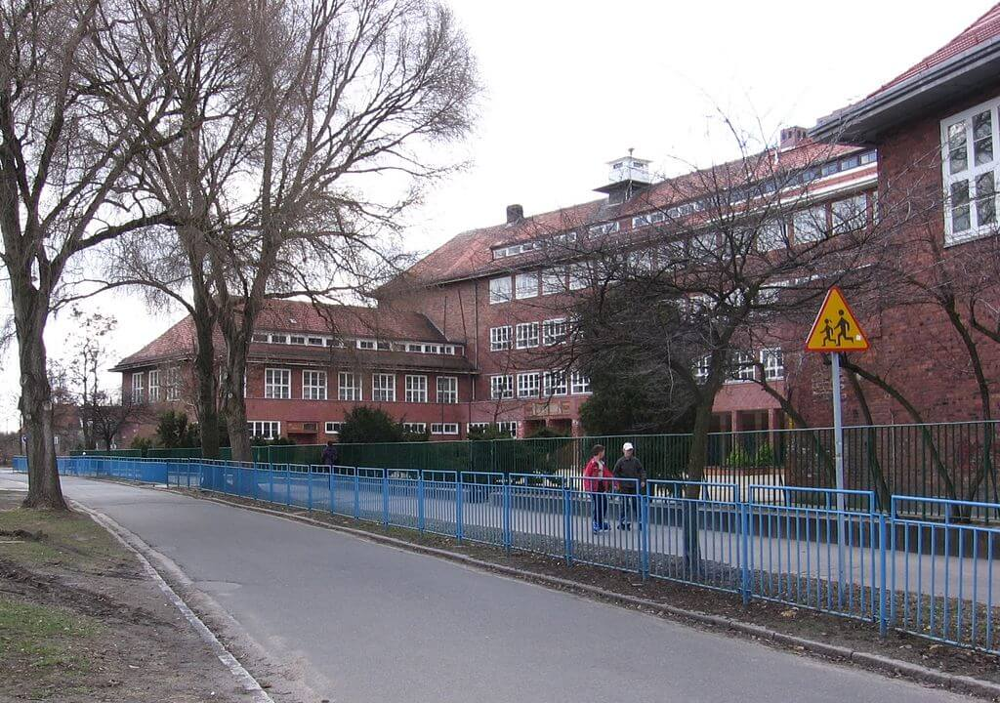

### Tokio

Bombardowane w nocy Tokio płonie.

### Iwo Jima

Dziś na pierwszej stronie New York Times ukazała się najsłynniejsza fotografia tej wojny - 'Raising the Flag on Iwo Jima'. Historia zawieszenia flagi i późniejsze dzieje tego wydarzenia są doskonale opisane w "Flagach naszych ojców" filmie z rewelacyjnej dylogii Clinta Eastwooda o bitwie na Iwo Jimie.

<SeeAlso txt="Bitwa o Iwo Jimę" url="/festung-breslau/article/pacyfik-iwo-jima" />

Stożek wulkaniczny Suribachi to nie tylko najwyższa góra tej wyspy, to tak naprawdę jedyna góra, która tam się znajduje. Ogroma wysokość względna sprawia, że dominuje nad okolicą i w oczywisty sposób jest głównym celem ataku. Jej nazwa oznacza moździerz kuchenny.

23 lutego rano, piątego dnia bitwy, Amerykanom udało się opanować powierzchnię Suribachi, wysłali dwa patrole na szczyt i po tym, jak nie napotykając na opór, dotarły na szczyt i powróciły, wysłali tam pluton żołnierzy z flagą. Zdjęcie tej flagi wykonał sierżant sztabowy Louis R. Lowery pracujący dla pisma Leatherneck. Była to niewielka flaga 140x70 cm, zbyt mała, żeby można było ją dostrzec z oddali.

Żeby zapewnić łączność obserwatorom na szczycie góry, trzeba było dociągnąć kabel telefoniczny, Wysłani na tę misję żołnierzami otrzymali znacznie większą flagę o rozmiarach 145x142 cm. W tym czasie na szczyt zmierzało trzech innych fotoreporterów Marines, wśród nich był Joe Rosenthal. Spotkali schodzącego w dół Lowery'ego i dowiedzieli się od niego, że flaga (ta pierwsza) już została zawieszona. Chcieli już zejść, ale Lowery przekonał ich, że warto wejść na górę dla samych widoków. Dopiero na szczycie Rosenthal zobaczył, że żołnierze przygotowują się do powieszenia większej flagi, jako masztu użyli japońskiej rury wodociągowej. Zdjęcie wykonał w ostatniej chwili nie mając nawet czasu, żeby spojrzeć przez wizjer. Przypadkiem uchwycił ikoniczną scenę, której kompozycji nie powstydziłby się dobry malarz.

Jeszcze w tym samym roku za tę fotografię otrzymał nagrodę Pulitzera. Stało się ono nie tylko rozpoznawalnym symbolem wojny na Pacyfiku, jest również wzorem dla Pomnika Korpusu Piechoty Morskiej (ang. Marine Corps War Memorial) w pobliżu Narodowego Cmentarza w Arlington. O tym, że wciąż jest to żywy symbol świadczy wykorzystanie tej sceny przez Davida Cernego w rzeźbie przedstawiającej Polskę w projekcie Entropa zamówionej w 2009 przez rząd czeski z okazji objęcia prezydencji EU przez Czechy - w wizji Černego na czymś w rodzaju tortu na planie Polski księża wbijają tęczową flagę LGBT.

### KL Hinzert

Komendant KL Hinzert (Nadrenia-Palatynat) Paul Sporrenberg rozkazał egzekucję 25 więźniów-członków luksemburskiego ruchu oporu.

### František Chvalkovský

František Chvalkovský polityk czechosłowacki, minister spraw zagranicznych po pakcie monachijskim, zginął dzisiaj na autostradzie w okolicach Berlina podczas alianckiego bombardowania.

Z wykształcenia prawnik. Ambasador m in w Waszyngtonie i Tokio, w latach 1927-32 w Berlinie. Po 1932 we Włoszech. Potem współpracownik Hachy. Również w rządzie kolaboracyjnym Protektoratu Czech i Moraw, który formalnie miał czeski samorząd. Pełnił funkcję przedstawiciela władz Protektoratu w Berlinie.

### Ernst Stein

Zmarł również niemiecki historyk żydowskiego pochodzenia Ernst Stein, wielokrotnie uciekał przed hitlerowcami, z Niemiec do Belgii, Z Belgii do wolnej Francji, potem do Szwajcarii. Zajmował się Bizancjum i późnym antykiem.

### Messerschmitt P.1112

Czy III Rzesza się wali? Czy wojna jest już dla hitlerowskich Niemiec przegrana? Możemy się tylko domyślać jakie zdanie ma na ten temat Willy Messerschmitt, jeden z głównych konstruktorów Luftwaffe. Pracuje nieprzerwanie i udoskonala swoje projekty. W styczniu pod wpływem krytyki P.1106 i P.1110 zaczyna prace nad P.1111 mającym skrzydła w układzie delty, trochę przypomina "latające skrzydło". Uproszczona, dobra aerodynamicznie konstrukcja, bezogonowa. Niewiele pali - to ważne bo III Rzesza nie ma już paliwa. Willi krytykowany jest za umieszczenie zbiorników paliwa w skrzydłach. Dowiaduje się, że z P.1111 nic nie będzie. Czy się załamuje, czy mówi, że wszystko na nic i zabiera się za pakowanie walizek? Nie.

Właśnie dziś 25 lutego kiedy Armia Czerwona zdobyła już Poznań i jest na Odrze zaczyna pracę nad swoim kolejnym projektem P.1112. Zastosował rzadko spotykane usterzenie motylkowe. Zostało wynalezione przez Polaka Jerzego Rudlickiego w 1930 i znamy je z amerykańskiego F-117.

Co ciekawe w dniach 27-28 lutego w Oberammergau przeprowadzono analizę P.1111 i pod każdym względem wypadła ona znakomicie, poza oczywiście problemem ze zbiornikami paliwa. Którego już nie było.

Niemieckie doświadczenia usiłował przyswoić amerykański Chance Vought. Woldemar Voigt jeden z głównych inżynierów Messerschmitta, który pracował m.in. przy P.1110 i P.1112. Po wojnie wyjechał do USA pracować dla Voughta i nie był jedynym niemieckim konstruktorem, który znalazł tam zatrudnienie. Chance Vought, który obficie korzystał również z dokumentacji i wiedzy zdobytej o niemieckich samolotach odrzutowych ukrywał ten fakt, oficjalnie całą pracę projektową wykonywali amerykańscy inżynierowie. Efektem pracy Voigta był F7U Cutlass o bardzo oryginalnej bezogonowej konstrukcji. Zastosowano hydrauliczne wspomaganie sterowania. Fatalny i nieudany samolot, który zabił 21 lotników. 

- [Messerschmitt P.1112](https://pl.wikipedia.org/wiki/Messerschmitt_P.1112)
- [Chance Vought F7U Cutlass](https://pl.wikipedia.org/wiki/Chance_Vought_F7U_Cutlass)
- Dark Skies ["F7U Cutlass - The Strangest and Most Dangerous Navy Jet Ever Flown" [YT 9:21]](https://www.youtube.com/watch?v=BNMsgjEh9s8)

### 36. Specjalny Pułk Lotnictwa Transportowego

Powstaje 36. Specjalny Pułk Lotnictwa Transportowego z zadaniem organizacji lotniczych podróży rządowych.

Fatalny lot do Smoleńska 10 kwietnia 2010 był misją tego pułku. W wyniku ujawnionych niedociągnięć rozwiązany 31 grudnia 2011. W jego miejsce utworzono 1 Bazę Lotnictwa Transportowego.

### Wrocław

Richard Hargreaves w swojej nieco fabularyzowanej i nieco fantazjującej, trochę książce historycznej a trochę powieści, zajmuje się kwestią upadającej dyscypliny obrońców:
>Ponadto von Ahlfen wydał rozkaz, zgodnie z którym każdy, kto opuści swoje stanowisko i wycofa się bez rozkazu, miał być postawiony przed plutonem egzekucyjnym. Saper Franz Polak tak właśnie uczynił. Podobnie jak kapral Richard Misof. Sierżant Richard Brener wałęsał się po opuszczonym mieszkaniu, zamiast dołączyć do swych ludzi. On także został stracony. Zbyt długi język pięćdziesięciopięcioletniego volkssturmisty Martina Mayera ściągnął na niego wyrok śmierci za "wygłaszanie wywrotowych uwag". Starszy kapral Alfred Mayer, kapral Paul Piontek, oraz bombardierzy Josef Smolka i Anton Drong postanowili zdezerterować całą grupą, porzucili broń, podarli swoje książeczki żołdu i próbowali przejść na stronę radziecką. Odwaga ich jednak opuściła, gdy czerwonoarmiści otworzyli do nich ogień. Następnego ranka niemiecki oddział rozpoznawczy odnalazł ich ukrywających się w jakiejś stodole. Cała czwórka została rozstrzelana na rozkaz von Ahlfena.

Już zwracałem uwagę na polskie nazwiska po sowieckiej stronie, żołnierze 359 DP: Bielicki i Krawczyk, tu mamy żołnierzy o nazwiskach: Piontek, Smolka i Drong, bez wątpienia Górnoślązaków, których entuzjazm wobec sprawy Hitlera był rozmaitego sortu. Kto wie, może zdarzyło się podczas bitwy wrocławskiej, że strzelali do siebie ludzie o tych samych polskich nazwiskach, chociaż żadnego polskiego oddziału podczas tej bitwy nie było.

Jak donosi Schlesische Tageszeitung z 21 lutego:
>Te wyroki śmierci miały stanowić przestrogę dla każdego żołnierza i jednocześnie dać uczciwym żołnierzom - jak również całej załodze twierdzy - satysfakcję, że tchórzliwych zdrajców spotkał bezlitosny i haniebny los. Zbiorowe egzekucje tchórzy i dekowników nie tylko usuwają ich z szeregów armii, ale także okrywają hańbą ich rodziny, odbierając im honor i skazując na nędzę przez pozbawienie wszelkich świadczeń.

Takie było propagandowe zamierzenie. Jednak ze znanych nam opisów wynika, że liczba dekowników nieustannie rośnie, a terror Wehrmachtu na własnej ludności cywilnej całkiem otwarcie przeradza się w rabunek, brutalność i sadyzm. Jakby robiąc do tego aluzję Hans von Ahlfen w jednym z ostatnich rozkazów, pisze:
>Każdy dom w Twierdzy Wrocław, który powierzył nam Führer, będzie kosztować wroga całe rzeki krwi. Pamiętajcie zawsze o tym, że bolszewicki wróg zgwałcił wasze żony, zamordował wasze dzieci i braci lub zapędził ich do przymusowej pracy.

i bardzo dziwnie czyta się te słowa, które po usunięciu zaledwie dwóch wyrazów równie dobrze i z taką samą racją mógłby powiedzieć dowódca sowiecki. Jak jednak wiemy z jego pamiętnika, nie jest to celowa ironia, tym straszniej to brzmi.

Hendrik Verton opisuje życie Twierdzy:
>W oczekiwaniu na atak Rosjan od północy i wschodu, w ostatnich dniach stycznia wydano rozkaz ewakuowania stamtąd tysięcy mieszkańców. Przewędrowali oni do opuszczonych domów w południowej części miasta. Kiedy rozpoznano, że zagrożenie idzie od strony południowej, to dwie trzecie spośród ewakuowanych przeprowadzono z powrotem na stare miejsce. W tym celu tramwaje, które ciągle chodziły, miały polecenie docierać na odległość pary kilometrów od linii frontu. To był zabieg psychologiczny mający na celu uspokoić ludność.

Von Ahlfen zadecydował, że żaden z mieszkańców Wrocławia nie może dostać się do niewoli, stąd te ciągłe przesiedlenia. Cywile w Twierdzy byli w nieustannym ruchu i zdarzało się, że wracali do własnych domów, które w międzyczasie zostały okradzione przez żołnierzy niemieckich. Zjawisko to wcześniej nieznane narastało i stawało się normą Twierdzy.

Luiza Hartmann, której relację przytacza Ryszard Majewski, wspomina:
>Z perspektywy lat, które upłynęły - dni i tygodnie oblężenia zlewają się w jeden ogromny koszmar, o którym chciałabym jak najszybciej zapomnieć. W drugiej połowie lutego (było to chyba 22 lub później) zostaliśmy wraz z ojcem wypędzeni, w przeciągu 15 minut, przez naszych żołnierzy z domu i ewakuowani do śródmieścia, gdzie znaleźliśmy przytułek w jednym z domów (lub raczej w piwnicy tego domu) przy Kurkowej. Przejście na piechotę tych kilku kilometrów, przerywane ciągłymi nalotami lotniczymi i ostrzałem artyleryjskim, trwało cały dzień. [...] W piwnicach tej części miasta, w najbardziej prymitywnych warunkach, gnieździły się dziesiątki rodzin. Na powietrze wychodzono głównie w nocy, kiedy kończyły się naloty i cichły walki. Dochodziło do nieustannych kłótni o każde głupstwo, a nawet bez powodu. Ludzie oskarżali się wzajemnie, i co gorsza wobec władz, o przeróżne sprawy, a w tej liczbie o nielojalne uwagi pod adresem Hitlera, Rzeszy i partii, o co w tej sytuacji było bardzo łatwo. Najczęściej kończyło się to aresztowaniem, lub nawet czymś znacznie gorszym, o czym teraz nie chcę pisać, ani nawet myśleć.

Przypomina się w tym miejscu owa szalona członkini NSDAP, która podstępem sprowadzała do siedziby gestapo kolejne ofiary. W końcu w gestapo zorientowali się, że zwariowała, ale ile osób zamęczono, torturowano i zabito, bo ktoś doniósł, jakaś "życzliwa" osoba zasłyszała słowa i przekazała to organom? Jak niewiarygodny terror narzuciły władze hitlerowskie zwykłym "dobrym Niemcom", którym odebrano domy, wystawiono na ogień artylerii, zmuszono do pracy pod strzelającymi do nich samolotami i jeszcze odebrano prawo do zwykłej, ludzkiej skargi.

Żywność przysługiwała pracującym, osoby niezdolne do pracy, albo mające problem z poruszaniem się znajdowały się w bardzo ciężkiej sytuacji, żeby przeżyć, trzeba było kraść (brać zapasy z opuszczonych domów i piwnic), przyłapanych na kradzieży rozstrzeliwano.

Na Sępolnie w szkole podstawowej trzymano półtora tysiąca ludzi przywiezionych z Warszawy po upadku Powstania. Trzymani byli w przerażających warunkach.

<BoxImageWrapper>

Szkoła Podstawowa nr 45  im. Janusza Kusocińskiego (niem. Hindenburg Schule, Friedrich Ebert Schule) zbudowana w 1927; podczas wojny był tu obóz dla kobiet i dzieci z Powstania Warszawskiego. 
Źródło: Wikipedia Domena publiczna, [Link](https://commons.wikimedia.org/w/index.php?curid=681814)
</BoxImageWrapper>

Ksiądz Peikert:
>Na podwórzu szkoły im. Clausewitza (dziś Technikum i Zasadnicza Szkoła Energetyczna) stoi także działo przeciwlotnicze. Na te działa zawzięły się szczególnie samoloty dzisiejszego popołudnia. Ponieważ w naszej dzielnicy takie działa stoją przed gmachem nowej rejencji, na Holteihöhe, w ogrodzie pałacu arcybiskupiego, na cmentarzu polowym i Bóg wie gdzie jeszcze, przeto nieprzyjacielskie samoloty zrzucają przede wszystkim tam swe bomby i ostrzeliwują pozycje z broni pokładowej. Dlatego też podobno jedna bomba spadła na szkołę im. Clausewitza. Przebywa tam ponad 1 000 cudzoziemców, prawie wyłącznie Polaków. Ośmiu z nich zostało zabitych, a 17 rannych, niektórzy ciężko. Pod wieczór opowiadają żołnierze, że na południu przedarli się Rosjanie do Steinstraße i zdobyli wielkie cmentarze między Lohestraße (Ślężna) i Bohrauerstraße.
>Coraz bardziej staje się oczywiste, jak pochopnym i mało przemyślanym krokiem wobec policji państwowej była zgoda generalnego wikariusza na ustalenie określonej liczby duchownych pozostających we Wrocławiu. Generalny wikariusz powinien był po prostu uwzględnić zgodne oświadczenie całego duchowieństwa, że solidarnie oprze się ono żądaniu policji: Duża liczba duchownych pozostała pomimo to we Wrocławiu. Ani władza, ani nikt nie robił im jakichkolwiek trudności. Kapituła nie musiała uciekać. Żadna instancja nie nagabywałaby poszczególnych członków kapituły. Duża część kapituły uciekła do Lubania. A teraz również Lubań został zajęty przez Rosjan. Dokąd teraz uciekną? J. E. ksiądz biskup sufragan Ferche pozostał wbrew poleceniu generalnego wikariusza. Właściwie jemu powinno się było przekazać obowiązki arcybiskupa i reprezentację kapituły. Godziłoby się to z jego rangą i autorytetem. Ale generalny wikariusz wszystkie pełnomocnictwa powierzył kanonikowi Kramerowi. Był to gorzki afront dla dostojnego biskupa. W kręgach duchownych i wśród wykształconych laików panuje zgodna opinia co do postępku wikariusza generalnego. Wikariusz generalny, prałat dr Negwer; nie jest pokroju ludzi zdolnych stawić czoło takim sytuacjom z męską stanowczością; jest to natura zbyt ustępliwa, usposobiona dyplomatycznie.

Wymowne są te emocjonalne uwagi o kościelnych intrygach. Kanonik Kramer jeszcze odegra dość poważną rolę w historii transferu archidiecezji wrocławskiej z prowincji niemieckiej do polskiej. O hitlerowskich dygnitarzach:
>weseli się i bawi, gdy tymczasem stolicę jego prowincji wydaje się na pastwę srogiej nędzy i spustoszenia. Tak czynili zawsze owi funkcjonariusze. Oni używali życia, czerpali zeń pełnymi garściami, od narodu żądając wszystkiego i domagając się każdego poświęcenia. Później przybierali teatralną pozę przed narodem i wskazywali na siebie, jak to pierwsi są skorzy do tych poświęceń. 
>Przez 12 lat tego reżimu wszyscy stali się bogaczami, nie gardząc skradzionym i złupionym dobrem, a zagrabiwszy wszystko narodowi niemieckiemu, uczynili go narodem żebraków. Także w tym ostatnim orędziu żąda Hitler jeszcze większych poświęceń, jak gdyby naród niemiecki już nie złożył ostatecznej ofiary. Jeszcze brak tylko tego, by każdy Niemiec umarł za Adolfa Hitlera.

Dowództwo Twierdzy z zadowoleniem przyjęło spowolnienie natarcia nieprzyjaciela. Na południu gdzie był pułk Mohr, była liczebna przewaga Niemców: 9,5 tys. obrońców, czerwonoarmistów było połowę tego. Obrońcom pomagała architektura miasta, które w niektórych miejscach zaczynało przypominać Stalingrad. Rosło ich doświadczenie na wszystkich szczeblach, od sztabu po prostego żołnierza. Barykady, gruzowane budynki, a także przekleństwo czerwonoarmistów - wrocławskie podziemia. Nie te legendarne, ale zwykłe, trywialne ciągi połączonych piwnic i gęsta sieć kanałów intensywnie wykorzystywana przez obrońców, miejscowy świetnie znający teren Volkssturm. Wyznaczony do tego celu miejski radca budowlany dr inż. Liebich przedstawił dowództwu spójną koncepcję wykorzystania kanalizacji dla obrony. Wrocław posiadał sieć kanałów o długości ponad 500 km, z czego około 75 kilometrów było wymurowanych. Na południu miasta najistotniejsze były dwa okrężne kanały, z których pierwszy biegł przez ulicę Sanocką, pl. Szeli, na ukos przez teren kolejowy na zachód od Dworca Świebodzkiego i przez ulicę Robotniczą. Właśnie tym kolektorem przedostawali się żołnierze niemieccy, podchodząc bardzo blisko pozycji radzieckich. Umożliwiało im to zakładanie materiałów wybuchowych i wysadzania całych domów w powietrze. Zdarzało się, że całe oddziały niemieckie wyłaniały się na tyłach jakby i dosłownie spod ziemi.

### Project Manhattan

Reaktor w Hanford, którego zadaniem jest dostarczenie plutonu do pierwszej bomby, pracuje pełną parą. To adekwatne określenie, bo reaktor atomowy to w sumie maszyna parowa. Podczas trwania Projektu Manhattan uruchomiono tylko trzy bloki wybrane jako pierwsze do uruchomienia: B 27 września, D 17 grudnia 1944 i F właśnie dziś - 25 lutego.

### Me 262

W 1943 alianci z grozą odkryli, że Niemcy mają zaawansowany projekt samolotu odrzutowego. Hitler tu oczywiście musiał się wtrącić i zmusił konstruktorów do przerobienia go na bombowiec, co spowodowało poważne opóźnienie.

Pionierami w dziedzinie napędu odrzutowego byli Brytyjczycy, ale będąc od 3 września 1939 w stanie wojny z hitlerowskimi Niemcami, musieli zaangażować wszystkie środki w to, co się daje wyprodukować od razu i zmodernizować na bieżąco. Własny odrzutowiec to był bardzo zaawansowany projekt, szczególnie z powodu silnika. Ówczesna technologia dopiero raczkowała, silniki były bardzo zawodne i często się zapalały. Dokładnie z tego samego powodu oba projekty i brytyjski i niemiecki zostały poważnie opóźnione.

Pierwszy niemiecki odrzutowiec Heinkel He 178 został oblatany już 27 sierpnia 1939. Ale decyzje Hitlera i szefostwa Luftwaffe były dla niemieckiego programu lotnictwa odrzutowego jednoznaczne - liczbę inżynierów ograniczono do 35, czyli program zamrożono. Wszystko musiało iść w tłoki. Dlatego prototyp Me 262 został oblatany dopiero 18 lipca 1942.

19 kwilenia 1944 sformowano Erprobungskommando 262 (Erprobungskommando to nazwa jednostki mającej za zadanie wypróbowanie nowego rodzaju broni) stacjonujące na lotnisku Lechfeld k. Augsburga, i już podczas operacji Overlord (lądowanie w Normandii) alianci zetknęli się z nimi w boju. Szybkością i parametrami lotu przewyższały wszystkie samoloty alianckie. Przy prędkości 900 km/h stanowiły trudne do zwalczenia zagrożenie dla alianckich flotylli bombowców. W sumie wyprodukowano ich 1400, ale w danym momencie nigdy nie było więcej niż 200 sprawnych maszyn gotowych do lotu. Największy problem stanowiły oczywiście silniki. Były nie tylko zawodne, ale miały niewielki resurs, trzeba było często je wymieniać.

Alianci szybko odkryli ich słaby punkt. Charakterystyka pracy silnika powodowała, że Me 262 był bezbronny podczas startu i lądowania. Pilot nie był wtedy w stanie wykonać żadnych manewrów. Pierwszym, który zestrzelił Me 262, był legendarny Chuck Yeager (pierwszy człowiek, który przekroczył barierę dźwięku). 7 października porucznik Urban Drew zestrzelił dwa startujące Me 262.

Dzisiaj 5 mustangów z 55th Fighter Group zaskoczyło cała startująca eskadrę Me 262, zniszczyli pięć samolotów.

Najgroźniejszym przeciwnikiem dla Me 262 był brytyjski Hawker Tempest. Alianci uznali Me 262 za samoloty tak niebezpieczne, że priorytetem było zniszczenie ich wszystkich. Najczęściej stosowaną taktyką (tzw. Rat Scramble) było śledzenie Me 262 i atak podczas schodzenia do lądowania. W odpowiedzi Niemcy ustawiali "aleje plot" czyli zagęszczenie ponad 150 dział plot 20 mm na podejściach do lotniska. To zapewniło bezpieczeństwo Me 262.