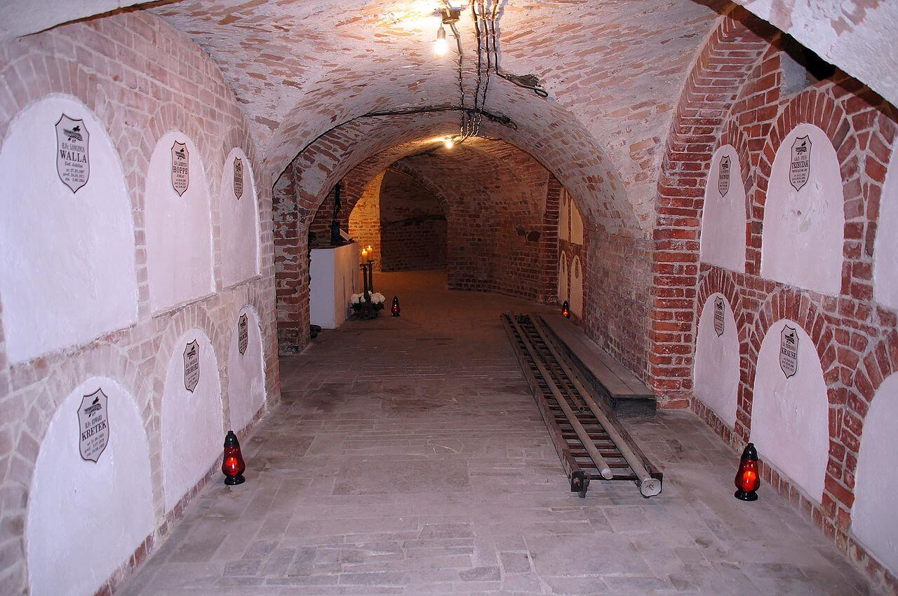

### Operation Greenup

W początkach 1945 nie tylko stan frontu budził zaniepokojenie dowództwa aliantów zachodnich, zwycięstwo nie było jeszcze przesądzone, każda większa klęska mogła przedłużyć wojnę o rok. Coraz więcej meldunków potwierdzało istnienie Twierdzy Alpejskiej (ang. Alpine Fortress, Alpine Redoubt, niem. Alpenfestung). W niedostępnych i łatwych do obrony rejonach górskich miała powstawać ogromna, rozległa twierdza, w której schronienie mogły znaleźć fabryki broni, całe dywizje SS i oczywiście dowództwo hitlerowskich Niemiec z Hitlerem na czele.

O planach tych mówiono publicznie, w amerykańskim magazynie Collier's 27 stycznia 1945 ukazał się artykuł "Hitler's Final V Weapon", który wskazywał na centrum operacji w Bad Aussee, 100 km od Berchtesgaden:
>These stories are undoubtedly intended to intimidate the Allies ... [however] they cannot be lightly dismissed as just another of Goebbels' inventions ... all signs indicate that the Germans are preparing for intensive guerrilla warfare.

Meldunki te były bardzo trudne do weryfikacji. Teren był trudny do infiltracji, niewielkie miejscowości, w których wszyscy się znali utrudniały wysłanie agentów.

26 lutego zaczęła się jedna z najważniejszych operacji amerykańskiego OSS (ang. Office of Strategic Services, poprzednik CIA), na spadochronach zrzucono w okolicy Innsbrucku trzech agentów:

- Frederick Mayer: niemiecki Żyd, którego rodzina zdołała w 1936 uciec do USA, zaciągnął się po ataku na Pearl Harbor.
- Hans Wijnberg: holenderski Żyd wysłany przez rodzinę do USA w 1939, jego rodzina została potem zamordowana.
- Franz Weber: Austriak, były oficer Wehrmachtu

Lista zadań, które wykonali, zebranych informacji i skaptowanych współpracowników jest zbyt długa by ją tu przedstawiać, była to jedna z najbardziej udanych operacji OSS. Przez dwa miesiące zbierali informacje o transportach wojskowych. Jeden z dowódców batalionu górskiego zaproponował Meyerowi zajęcie Innsbrucku na rzecz Amerykanów, ale plan został odrzucony przez dowództwo operacji.

Najbardziej eksponowanym agentem był Meyer podający się za niemieckiego oficera, w końcu został rozpracowany i aresztowany przez Gestapo 20 kwietnia 1945. Mimo tortur nikogo nie zdradził. Amerykańskim agentem zainteresował się zastępca gauleitera Tyrolu Max Primbs, który zabrał go na rozmowę z gauleiterem Franzem Hoferem, chcieli wybadać szansę na sojusz hitlerowsko-amerykański przeciwko sowietom. W spotkaniu wziął udział ambasador Niemiec we Włoszech Rudolph Rahn. Ostatecznie to Meyer zdołał przekonać władze tyrolu do kapitulacji i ocalił Innsbruck od zniszczenia.

Nic więc dziwnego, że zaraz po premierze filmu Tarantino ten mały trzyosobowy oddział zyskał sobie miano "The Real Inglorious Basterds".

- ["Ultra And The Myth Of The German National Redoubt" by Marvin L. Meek](https://www.allworldwars.com/Ultra-and-The-Myth-of-the-National-Redoubt-by-Marvin-Meek.html)
- [Frederick Mayer (spy)](https://en.wikipedia.org/wiki/Frederick_Mayer_(spy)) | [Alpine Fortress](https://en.wikipedia.org/wiki/Alpine_Fortress)
- DANGER TV ["The Real Inglorious Basterds! | True Story of the Jewish Commandos Who Inspired Tarantino | Full Doc" [YT 51:32]](https://www.youtube.com/watch?v=8ou4PtFa3HM)

### Corregidor

Oczy całej Ameryki zwrócone są na Iwo Jimę, wszyscy mówią o zdobyciu góry Suribachi i fenomenalnym zdjęciu Rosenthala, które momentalnie przeszło do historii. W tle pojawia się informacja, że po jedenastu dniach walk bitwa o Corregidor na Filipinach zakończyła się zwycięstwem Amerykanów. Wydawałoby się, że sytuacja jest bardzo dobra. Na froncie europejskim Amerykanie walczą już w Niemczech. Z Marianów mogą bezkarnie bombardować Japonię. Filipiny w zasadzie zostały odbite, a teraz amerykańska flaga wisi nad Iwo Jimą.

Ale armia i politycy już wiedzą, że wojna z Japonią w niczym nie będzie przypominać tej z Niemcami. Marines nigdy dotąd nie zetknęli się z takim przeciwnikiem. Z 5 tysięcy żołnierzy japońskich tylko 20 dostało się do niewoli, reszta zginęła w walce. Na Iwo Jimie, nad którą powiewa amerykańska flaga, jatka dopiero się zaczęła. Na Filipinach do końca wojny stacjonuje ukryty w lasach i górach północnego Luzonu niepokonany korpus generała Tomoyuki Yamashity, który zdobył sobie przydomek "Tygrysa Malajów". Dopiero 2 września Talashito dopiero po tym, jak z trudem, ale jednak w końcu uwierzył w autentyczność rozkazu kapitulacji poddaje do niewoli 100 tys. swoich żołnierzy.

### Douglas MacArthur

Corregidor był miejscem o symbolicznym znaczeniu. To na tej skalistej wysepce blokującej Zatokę Manilską został ulokowany sztab MacArthura zaraz po ataku na Pearl Harbor. Przypłynął tam 2 stycznia 1942 z planem obrony wyspy przez pół roku. W tym czasie miała przypłynąć odsiecz z USA i pokonać Japonię. Jednak wobec niepomyślnego rozwoju sytuacji Amerykanie przegrywali i musieli się cofać.

MacArthur otrzymał od Roosevelta rozkaz ewakuacji i 11 marca odleciał samolotem B-17 do Australii. Zaraz po wylądowaniu złożył słynną obietnicę: "*I shall return*". Zaciekły opór i ciągnące się na wyspie walki miały ogromne znaczenie propagandowe. Ostatecznie po zmiażdżeniu oporu na Filipinach i kilkudniowym przygotowaniu artyleryjskim osamotnieni obrońcy zostali pokonani w dwa dni. 6 maja 1942 Corregidor i całe Filipiny znalazły się we władaniu japońskim. Jeńcy zostali poprowadzeni w makabrycznym marszu śmierci.

20 października 1944 MacArthur wylądował na filipińskiej wyspie Leyte, zeskoczył z barki desantowej do wody razem z prezydentem Filipin Sergio Osmeñą i jeszcze tego samego dnia w przemówieniu radiowym mógł wreszcie powiedzieć "*People of the Philippines, I have returned!*".

Sergio Osmeña nie wygrał w wyborach, był wiceprezydentem od 1935, a prezydentem został podczas służby w rządzie na emigracji po śmierci poprzedniego prezydenta 1 sierpnia 1944. Przegrał w wyborach w 1946 na rzecz pupila MacArthura, Manuela Roxasa, któremu MacArthur zawdzięczał kupę forsy (nazwijmy rzeczy po imieniu) a ten w zamian stworzył Roxasowi z niczego legendę wielkiego bojownika o niepodległość.

- History.com ["General MacArthur returns to the Philippines"](https://www.history.com/this-day-in-history/MacArthur-returns)

### Focke-Achgelis Fa 223 Drache

Zanim Kurt Tank pojawił się w Focke-Wulf, firma ta charakteryzowała się niecodziennymi i bardzo oryginalnymi konstrukcjami. To właśnie oni skonstruowali pierwsze seryjnie produkowane śmigłowce. Ich pierwszy helikopter Focke-Wulf Fw 61 został oblatany jeszcze w 1936, a eksperymenty nad takim pojazdem zaczęły się już w 1932.

Prezentacja tego śmigłowca odbyła się w Berlinie w 19 lutego 1938. W hali sportowej Deutschlandhalle latała na nim Hanna Reitsch. Do 1939 był już na tyle dopracowany, że potrafił przelecieć w linii prostej 200 km i wznieść się na ponad 3,5 km.

Ich następną konstrukcją był właśnie Fa 223 Drache (pl. Smok) opracowany w ośrodku badawczym w Rechlinie (Meklenmburgia - Pomorze Przednie) już w 1940 osiągnął prędkość maksymalną 120 km/h.

Zalety pionowo startującego statku powietrznego dostrzegło wojsko. Zamówiło 100 tych śmigłowców. Rozwój utrudniały bombardowania. Z tego powodu produkcję przeniesiono do Laupheim (Badenia-Wirtembergia). Do końca 1944 zbudowano tam siedem maszyn, które były poddawane wielu próbom. Rezultaty były na tyle pomyślne, że zamówienie zwiększono do 400. Produkcje planowano przenieść do Berlin Tempelhof. Udało się tam zbudować jeden śmigłowiec.

Na początku 1945 wszystkie trzy istniejące jeszcze prototypy tworzyły specjalną jednostkę transportową - Transportstaffel 40 stacjonującą w Mühldorf (Bawaria). W kwietniu zostanie przeniesiona do Aigen (Styria w Austrii) i tam ją zastanie koniec wojny.

25 lutego śmigłowiec z Tempelhof otrzymał "specjalny rozkaz od Adolfa Hitlera" - lot do Gdańska. Wyruszył dziś z zespołem trzech pilotów i nie wiedzieć czemu skierował się na SW, dotarł do Würzburg (Turyngia) 400 km od Berlina. Następnego dnia poleciał na północ, lądując w Werder (Meklenmburgia) 150 km na NW od Berlina. 28 lutego skierował się na Szczecin, ale zła pogoda wymusiła lądowanie w Prenzlau. Następnego dnia mieli już dolecieć do Gdańska, ale znowu pogoda uniemożliwiła dotarcie do celu i ostatecznie dotarli tylko do Słupska. Był już 5 marca i sytuacja na froncie była fatalna. Polecieli nad terenami już zajętymi przez sowietów do Gdańska, okazało się, że miasto (spoiler) jest już zajęte przez Armię Czerwoną. Tam otrzymali rozkaz powrotu do Werder. Odbyli długi lot wzdłuż wybrzeża z postojem w Garz (Rugia), do Werder docierając 11 marca. Cała ta podróż to 1675 km i 16,5 godzin lotu.

Czytając to, zapewne zadajesz sobie pytanie, co, albo kogo takiego ważnego mieli zabrać z Gdańska. Otóż tego nie wiadomo. Do dziś jest to tajemnica.

Po wojnie Amerykanie zabrali Smoka okrętem, ale ponieważ na pokładzie mieli miejsce tylko na jednego, drugi miał zostać zniszczony. Brytyjczycy nie chcieli do tego dopuścić i zdecydowali się zabrać go do siebie drogą lotniczą. Po prostu przelecieli nad Kanałem - w ten sposób hitlerowski Smok był pierwszym helikopterem, który przeleciał Kanał. Uległ zniszczeniu podczas prób w październiku 1945.

Francuzi zbudowali trzy Smoki pod nazwą SE.3000, a Czesi z dostępnych części złożyli dwa jako VR-1.

- [Mark Felton Productions "Dragon - The First Helicopter to Cross the English Channel" [YT 5:15]](https://www.youtube.com/watch?v=Fl_E_nREWgI)
- [Dark Skies "The Luftwaffe Fa 223 Dragon - First Helicopter to Reach Production Status" [YT 14:04]](https://www.youtube.com/watch?v=PVEOR3ZcJk8)

### III Front Białoruski

Przerwa w operacjach wojennych w Prusach Wschodnich. Wyczerpany walkami III Front Białoruski musi zebrać siły przed ostatnią dla niego ofensywą tej wojny - atakiem na Królewiec.

### Józef Gallus

Józef Gallus, górnośląski pisarz ludowy, działacz, folklorysta-amator zginał w wypadku w kopalni.

### Jerzy Paczkowski

Jerzy Paczkowski poeta, satyryk, w okresie międzywojennym pracownik ambasady polskiej w Paryżu, podczas okupacji działał w podziemiu, wydawał pisma konspiracyjne, od maja 1943 na czele okręgu konspiracyjnego "Mazowsze", który po wpadce siatki brytyjskiej przejął jej rolę w zwalczaniu rakiet V1 wystrzeliwanych na Londyn. W lipcu 1944 aresztowany podczas obławy na tajną radiostację, osadzony w Sachsenhausen, potem Hamburg-Neugamme. Dzisiaj zmarł. Miał 45 lat.

### Wrocław

Pierwszy dzień tygodnia, luty zmierza ku końcowi, wkrótce skończy się również plucha i chłody.

20 lutego 6 Armia przypuściła atak z południa wprost na centrum miasta, 23 lutego zdobyli Koszary, 24 lutego siedzibę sztabu VIII. Okręgu Wojskowego na Gajowickiej (niem. Gabitzstraße) opuszczoną zaledwie dziesięć dni wcześniej i wyprowadzili natarcie w kierunku zachodnim mające na celu skrócić linię frontu, pułk "Wehl" który stanął na drodze tego natarcia, został zdziesiątkowany i miał już ulec, w ostatniej chwili siły obrońców wzmocnił sprowadzony w pośpiechu z północnej linii obrony pułk "Mohr" i ostatecznie po kolejnych trzech dniach krwawych walk, 26 lutego, zdobycze sowieckie wytyczały ulice: Pereca (niem. Rehdiger) Żelazna (niem. Opitz) pl Hirszfelda Gwiaździsta (niem. Kronprinzen) Ostra (niem. Lothrigen) pl Powstańców Śląskich (niem. Hindenburgplatz), dalej na wschód rejon ulic Kamiennej (Stein), Sztabowej (Menzel), Sudeckiej (Hohenzollern) i Alei Wiśniowej (niem. Kirchee Alee). Tempo ataku drastycznie malało.

26 lutego ksiądz Peikert opisuje zwyczajny Kriegschmerz twierdzy:
>Niespokojna noc. Około północy silny ogień z karabinów maszynowych. Dzień dżdżysty i burzliwy. Silny obustronny ogień artyleryjski przez cały dzień. W południe znowu ciężki nalot nieprzyjacielski z bombami sprzężonymi, szczególnie na okolicę dworca

natomiast jakby tym samym głosem ksiądz Laßmann dodaje wczoraj:
>W ciągu dnia nękają nas bombami rosyjskie samoloty, a do tego nieprzerwanie trwa ostrzał artyleryjski

a dziś, 26 II, odnotowuje:
>O godz. 13.15 w południową ścianę Katedry trafia pocisk artyleryjski, akurat w chwili kiedy tamtędy przechodzę.

Hugo Hartung wczoraj przemierza drogę z centrum miasta, z podziemi poprzedniego budynku Teatru Polskiego, do klasztoru bonifratrów:
>Po południu wyruszamy z Sch. do klasztoru. Upiorny spacer przez wymarłe miasto. Wszystkie ulice stoją w płomieniach, a "sowieckie maszyny do szycia" co rusz stebnują je terkoczącymi seriami z karabinu. Ta mozolna droga ciągnie się w nieskończoność, aż wreszcie docieramy do piwnic klasztoru ojców bonifratrów, gdzie nad drzwiami znajdujemy krzepiący napis "izba przyjęć".

a dziś ledwo odnajduje siły, by zapisać:
>Leżę w gorącej dusznej piwnicy. Prawie cały dzień śpię lub jestem półprzytomny. Po południu ojciec przeor przynosi mi lampkę wina. Zna mnie jeszcze z czasów, gdy wraz z artystami naszej opery na górze w lazarecie organizowałem koncerty dla ciężko rannych.

Prawdopodobnie ma na myśli ogromną kryptę pod kościołem Trójcy Świętej.

*Podziemia kościoła Bonifratrów, podczas wojny był tu szpital polowy. 
Źródło: Wikipedia By [Barbara Maliszewska](https://commons.wikimedia.org/w/index.php?title=User:Barbara_Maliszewska&amp;action=edit&amp;redlink=1) - Praca własna, [CC BY-SA 3.0 pl](https://creativecommons.org/licenses/by-sa/3.0/pl/deed.en), [Link](https://commons.wikimedia.org/w/index.php?curid=28054947)*

### Bonifratrzy

Ojcowie bonifratrzy zostali sprowadzeni do Wrocławia na początku XVIII wieku staraniem wysokiego urzędnika administracji habsburskiej Ludwika Cocx von Onssel, radcy kamery cesarskiej, który podarował im ziemię. Wcześniejsze próby były blokowane przez luterańskie miasto. Dlatego zostali ulokowani poza murami miasta na rogu ulic Traugutta (Klosterstraße - ta nazwa wywodzi się właśnie od ich klasztoru) i Pułaskiego (Brüderstraße - podobnie). W 1711 przybywa pierwszych trzech braci z Cieszyna gdzie szpital bonifratrów istnieje już od 1696. Ich domem macierzystym jest klasztor w Felsbergu (Austria).

Wkrótce w latach 1715-22 wznoszą - jak się później okazuje - ostatni barokowy kościół katolicki we Wrocławiu, budowany przez późniejszego budowniczego Gmachu Głównego Uniwersytetu: Johanna Blasiusa Peintnera. Trzy lata później, w 1725, kościół zostaje poświęcony przez biskupa Franza Neuburga. W ostatniej chwili, bo w 1736, udaje im się zakończyć budowę klasztoru. Cztery lata później Fryderyk II Wielki wkracza na Śląsk by, jak zapewnia "zaprowadzić pokój", w kraju który od ponad 90 lat nie znał wojny. Następują wojny śląskie i Śląsk, prawie cały przechodzi w ręce pruskie.

Założony w 1540 przez Portugalczyka św. Jana Bożego zakon ma charakter szpitalny, specjalizuje się w ziołolecznictwie i od początku za główną zasadę przyjmuje pomagać wszystkim, bez względu na wyznanie. Po kolejnej wojnie, tym razem z napoleońską Francją, Prusy rozpaczliwie potrzebują pieniędzy i za przykładem Austrii oraz Francji dokonują sekularyzacji, tj zajęcia przez państwo wszystkich dóbr klasztornych i likwidacji zgromadzeń zakonnych; wszystkich z wyjątkiem tych które zajmują się pracą uznane przez państwo pruskie za użyteczną społecznie, czyli opieką nad młodzieżą, szkolnictwem lub medycyną.

We Wrocławiu ocalały tylko trzy zgromadzenia: urszulanek, elżbietanek oraz właśnie bonifratrów. Zasada pomagania wszystkim, niezależnie od sytuacji powoduje - o czym Hartung nie wie, bo jest to trzymane w najściślejszej tajemnicy - że bonifratrzy w ogromnej krypcie oprócz rannych żołnierzy niemieckich, trzymają zbieranych potajemnie rannych pilotów sowieckich. Właśnie to spowoduje, że w nagrodę za uratowanie ich życia po zajęciu miasta przez Armię Czerwoną dostaną wszelkie gwarancje bezpieczeństwa oraz - co naprawdę miało znaczenie - straż która pilnowała ich dotrzymania.

### Egzekucja

Egzekucja esesmana, wiedeńczyka z pochodzenia. [Rozstrzelanie 21 letniego esesmana Friedricha Zadresiela z Wiednia w Festung Breslau przy budynku gazowni na Trebnitzer Stasse](https://www.facebook.com/EchazFestungBreslau/photos/a.506610902732958/3415138675213485/)
