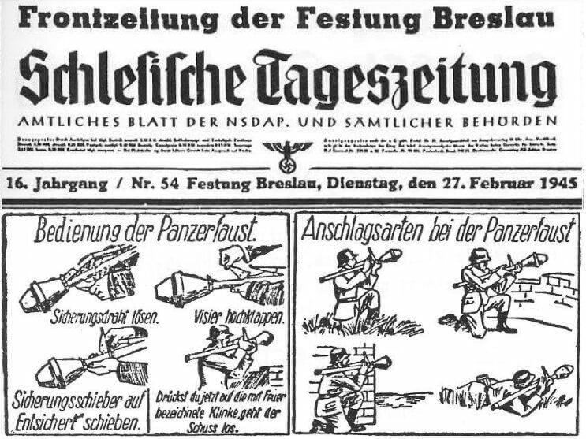

### Moguncja

Brytyjski nalot na Moguncję. 435 bombowców nadleciało nad miasto tuż przed godziną piątą po południu, zrzuciły 1,5 tys. ton bomb. Tym razem zabytkowe centrum nie zostało zniszczone (to miało miejsce w 1942). Zginęło około 1200 osób.

Jak się okazuje, nalot ten był zupełnie niepotrzebny, bo zasadniczy cel operacji, węzeł kolejowy, nie został zniszczony. Już trzy dni po nalocie pociągi jeździły przez Moguncję.

### Augsburg

FBTODO

- ["Crash site US B-17 Fortreess "Dottie" 97th Bomb Group, 414th Squadron February 27, 1945 Trimbach / Switzerland"](https://standwheretheyfought.jimdofree.com/b-17-flying-fortress-crash-in-trimbach-switzerland-february-27-1945-then-and-now/)

### 2 Front Białoruski

Szczecinek.

### Instytut Zachodni

W Poznaniu zaledwie 4 dni po upadku Cytadeli powstaje Instytut Zachodni. Jest to instytucja, która jest zwierciadlanym odbiciem niemieckiego szowinizmu i takich organizacji jak Osteuropa Institut. W odpowiedzi na tezy głoszące odwieczną germańskość tych ziem (z kręgu Gustafa Kossiny) tezy głoszące odwieczną polskość/słowiańskość (Józef Kostrzewski: te same metody, ta sama metodologia i dokładnie odwrotne wnioski). Polska potrzebowała instytutu niemcoznawczego, białego wywiadu i medium do kontaktu z Niemcami. Idea ta powstała jeszcze podczas okupacji, dzisiaj przybrała formę organizacyjną.

Przez prawie cały PRL będzie produkować potrzebną władzom partyjnym i państwowym literaturę, a już tak poza ironią to rzeczywiście pokaźny dorobek naukowy i całe pokolenia badaczy. Od upadku komunizmu i zjednoczenia Niemiec jest już rzeczywiście takim Instytutem Zachodnim, jakiego potrzebujemy.

Można wyrazić tylko żal, że nic takiego nie powstało we Wrocławiu. Ale właśnie ze względu na niemiecką przeszłość, Niemcy to był temat we Wrocławiu zakazany. Poznań przez prawie dwieście lat był polsko-niemieckim pograniczem.

### Czelin

I jakże symbolicznie dokładnie w ten sam dzień polscy żołnierze w miejscowości Czelin koło Gryfina wbili pierwszy słup graniczny na Odrze. Jest to dokładnie na zachód od Gorzowa Wielkopolskiego i 20 km biegiem Odry od Kostrzyna nad Odrą. Kolejne 20 km na północ znajduje się Cedynia.

Nie była to wcale taka prosta sprawa. Po przełamaniu pozycji Wału Pomorskiego oddziały 1 Armii WP zajęły pozycję w rejonie Mirosławca, mając już rozkazy kierujące je na Kołobrzeg. W tym czasie 6 Samodzielny Batalion Pontonowo-Mostowy ruszył dokładnie w kierunku Berlina i dotarł do Odry. Najprawdopodobniej decyzja o postawieniu słupa granicznego nie była konsultowana z Armią Czerwoną, która była dość drażliwa na punkcie nieswoich symboli. Zresztą sytuacja prawna była jednoznaczna - przed konferencja poczdamską polska granica na Odrze i Nysie Łużyckiej była tylko propagandową wizją, zapowiedzią.

To byli pierwsi polscy żołnierze, którzy dotarli do Odry. Za zgodą dowódcy batalionu podporucznicy Władysław Cieślak i Stefan Kobek oraz plutonowi Władysław Janicki i Henryk Kalinowski wykopali dół, włożyli tam butelkę z meldunkiem podpisanym przez żołnierzy batalionu i wbili słup graniczny. Wyciosał go kapral Wydrzyński, cieśla pochodzący z Wołynia. Kilka godzin później słup został zniszczony przez niemiecką artylerię.

W 1947 żołnierze WOP znaleźli to miejsce, odkopali butelkę. Meldunek jest w Muzeum Wojska Polskiego w Warszawie:
>Nasz oddział, jako pierwszy oddział Wojska Polskiego, który dotarł do zachodnich rubieży Rzeczypospolitej Polskiej, ku wiecznej rzeczy pamiątce wbił słup graniczny na starej polskiej rzece Odrze. [...] Nie rzucim ziemi skąd nasz ród, tak nam dopomóż Bóg.

Miejsce to upamiętnione jest pomnikiem w formie słupa granicznego.

### Wrocław

Sytuację na froncie relacjonuje ksiądz Peikert:
>Niezwykle spokojna noc. Wczesnym rankiem niebo czerwone od pożogi na zachodzie miasta. Na południu miasta, na północ od Ołtaszyna w ręce Rosjan dostały się magazyny z siedmioma milionami [litrów] benzyny. Msza św. o godz. 7 ma tak jak wczoraj dużą frekwencję. Rozdzielono ponad 250 komunii św. Rozebrano barykadę przy klasztorze Bonifratrów i donoszą, że w nocy z poniedziałku na wtorek Rosjanie dotarli aż do szpitalu Bethania, ale odrzucono ich znowu do parku Wschodniego. Na południu natarcie Rosjan przesunęło się aż poza Hindenburgplatz. Wieża ciśnień przy Hohenzollenstraße trafiona pociskiem nieprzyjacielskiej artylerii. Kościół Św. Karola, który przekształcono w twierdzę, jest doszczętnie zburzony. Była to budowla neoromańska, wzniesiona w początkach poprzedniej wojny światowej j i konsekrowana w 1915 r., okazały, reprezentacyjny i nowoczesny gmach kościelny. Po zburzeniu kościoła Św. Augustyna przy Kleinburgstraße (Januszewickiej) i kościoła Św. Karola południe Wrocławia nie ma już ani jednego kościoła. [...] Po południu krążą na nowo nieprzyjacielskie myśliwce nad miastem. Ani śladu akcji obronnej lotnictwa lub artylerii przeciwlotniczej z naszej strony. Ogółem biorąc, sytuacja w centrum miasta budzi obawy. Ślady przewlekłego oblężenia są wyjątkowo widoczne. Każdy się zastanawia, jak długo jeszcze potrwa to szaleństwo. Wrocław bowiem jest nie do utrzymania. Widać to po postępach Rosjan na południu miasta.

Peikert pisze o dwóch dziwnych rzeczach. Po pierwsze intensywna pożoga na zachodzie. Tam nie toczyły się walki, co mogło płonąć? Jakieś trafione bombą składy. Tyle że sowieci w nocy nie bombardowali. Pisze również, że nieprzyjaciel przejął ogromne składy paliwa "na północ od Ołtaszyna". Jeśli to prawda to świadczy o równie wielkim chaosie organizacyjnym w Twierdzy. 7 mln litrów, ile to jest? Duża cysterna kolejowa to 50 tys. litrów, 20 x 7 w sumie 140 wypełnionych po brzegi cystern kolejowych. Niemożliwe. Liczba ta jest z pewnością przesadzona. Ale tym żyła Twierdza.

Z drugiej strony nie wyglądało to wcale przyjemniej, Majewski przytacza relacje czerwonoarmistów:
>Pomoc z powietrza jednak nie wystarczyła. Teraz prowadzi ogień nasza artyleria. Całą dobę już pułk walczy o jedną ogromną kamienicę. Przed chwilą poległ dowódca batalionu kpt. Czekmeiniew. Zastąpił go lejtnant Tkaczenko. W kompaniach piechoty zostało po 4-5 ludzi, w batalionie 2 oficerów, z których jeden o kontuzji ledwo trzyma się na nogach. A jednak idziemy naprzód. Kamienicę (a raczej jej gruzy) zdobyto i utrzymano, zaś linia frontu posunęła się o 50 m do przodu.

>Brigadin, podzielił swych ludzi na dwie części. Pierwsza, którą dowodził on sam, pod osłoną nocy przekradła się w bezpośrednim sąsiedztwie budynku i wczesnym świtem, osłaniana zwałami gruzu i wspierana ogniem dwóch działek 45 mm oraz działa pancernego, rozpoczęła ostrzeliwanie Niemców. Briagin postawił tu wszystko na jedną kartę, w której stawką było życie własne i podległych mu żołnierzy. Niemcy odpowiedzieli silnym ogniem. W ciągu kilkunastu minut połowa żołnierzy grupy była ranna lub kontuzjowana. Tymczasem jednak druga grupa, dowodzona przed doświadczonego szeregowca Zajkina, wykorzystując to, ze Niemcy skupili się na Briaginie całą swoją uwagę, przedostała się na tyły budynku, obrzuciła granatami okna piwnicy i wdarła się do środka.

Postępy sowieckie są już minimalne, w terenie to już są korekty linii frontu i szukanie okazji do lokalnego przełamania. We Wrocławiu bój jest tyleż zażarty i makabryczny co nieskuteczny. Niemcy po chwilowym szoku nauczyli się bronić tak skutecznie, że czerwonoarmiści musieliby miażdżyć artylerią dom po domu. A takich zasobów siły ognia nie mieli.

### Panzerfaust

<BoxImageWrapper>

Dzisiejszy "Schlesische Tageszeitung" wydawany od 1935 dziennik NSDAP z instrukcją używania panzerfausta. 
Źródło: internet, licencja nie do ustalenia. [www.wratislavia.net/festung/nav/panzerfaust1_jpg_view.htm](http://www.wratislavia.net/festung/nav/panzerfaust1_jpg_view.htm)
</BoxImageWrapper>

W dzisiejszym numerze gazety frontowej - dzienniku NSDAP "Schlesische Tageszeitung" instrukcja użycia Panzerfausta, tak prosta, że dziecko by ją zrozumiało. I o to chodziło. W Twierdzy czasem i dzieci musiały brać tę broń do rąk. Zdumiewający jest w Panzerfaustach czynnik psychologiczny. Dla żołnierzy najbardziej przerażającą cechą Armii Czerwonej była masa wojsk pancernych, nieprzeliczone rzesze T-34. Ile by Niemcy ich nie zniszczyli, zza horyzontu wyjadą następne. Panzerfaust dając każdemu szansę zniszczenia takiego czołgu, wyrównywał szanse. Teoretycznie każdy, szczególnie w mieście, mógł zniszczyć czołg. Panzerfaust to prawdziwe Wunderwaffe dla mas. Na jeden zniszczony (zatrzymany!) czołg przypadało 600 wysłanych na front Pancerfaustów, biorąc pod uwagę ćwiczenia, utracone składy, chaos logistyki i porzuconą broń - z przynajmniej 100 wystrzelonych w kierunku czołgu pocisków tylko jeden dawał efekt jak z obrazka.

Panzerfaust był jedną z głównych broni Volsksturmu.

<SeeAlso txt="Volkssturm" url="/festung-breslau/article/volkssturm" />

Na Śląsku w rozpaczliwej nadziei na zatrzymanie sowieckiej nawały formowano oddziały niszczycieli czołgów. Groźnie brzmiąca nazwa. Byli to żołnierze mający rower i dwa zamontowane na nim do transportu panzerfausty.

- [Niemieccy niszczyciele czołgów na rowerach – rejon Złotoryi 1945. W lutym 1945 roku Złotoryi [wówczas Goldberg] i podejść do miasta broniła między innymi niemiecka kompania niszczycieli czołgów, która była wyposażona w pancerfausty i rowery. ](https://www.facebook.com/bobr1945/posts/3395625697217736/)

Pierwsze prototypy Faustpatrone opracował latem 1942 zespół dra Heinricha Langweilera w Lipsku pracujący dla Hugo Schneider AG (HASAG). Był to pocisk nadkalibrowy, kumulacyjny miotany ładunkiem prochowym z wyrzutni rurowej. Z założenia broń tania i prosta w obsłudze. W produkcji seryjnej powstało kolejnych pięć wersji, każda większa, o większym zasięgu (od 30 do 150m) i zdolności penetracji (od 140 do 320 mm). Okazała się skuteczną bronią w walce miejskiej, ponad połowa czołgów straconych przez aliantów w Niemczech to ofiary panzerfausta. Poważnie wpłynęła na taktykę walki zarówno aliantów zachodnich jak i sowietów.

Podczas wojny trofiejne pancerfausty były używane przez Armię Czerwoną i Wojsko Polskie, szczególnie często do operacji wiślańsko-odrzańskiej. Armia Czerwona wydała instrukcję jego używania. Natomiast po wojnie były najczęściej niszczone, dopiero w 1949, kiedy rozpoczęły się przygotowania do kolejnej wojny światowej pozostałe 4 tys. panzerfaustów przyjęto na wyposażenie WP jako PG-49. Również w 1949 rozpoczęto ich produkcję, w sumie wyprodukowano 5 tys. sztuk pod nazwą Pc-100 (pancerzownica 100m), ale były z nimi problemy i Wojsko Polskie dość szybko przerzuciło się na sowieckie RPG-2, które rozwojowo wywodziły się wprost z panzerfausta 150.

Plany panzerfausta Niemcy wysłali Japończykom, ale ci woleli skopiować amerykańską bazookę, której pewną liczbę zdobyli na wyspie Leyte.

Bazookę skopiowali również Niemcy. Poznali ją w lutym 1943 w Tunezji. W 1944 do użytku wprowadzili panzerschreck, połączenie zmodyfikowanej, powiększonej bazooki i granatu rakietowego opracowanego dla używanego od 1943 8.8 cm Raketenwerfer 43 popularnie zwanego "laleczką" (niem. Püppchen), była to niewielka wyrzutnia przypominającą działo ppanc. Panzerschrecki były również we Wrocławiu, von Ahlfen nazywa je "rurami od pieca".

Na froncie wschodnim panzerfausty i panzerschrecki spowodowały 70% strat w sowieckich siłach pancernych.

- Military History Visualized ["Panzerfaust Evolution: PzF 30 to 250" [YT 17:45]](https://www.youtube.com/watch?v=viTBdqNwDNo)
- IrytujacyHistoryk ["Panzerfaust" [YT 7:06]](https://www.youtube.com/watch?v=YXfJUafLH5E) | ["Panzerschreck (EN subs)" [YT 9:33]](https://www.youtube.com/watch?v=H7b1lvOvCIc) | ["Strzała - 2" [YT 10:06]](https://www.youtube.com/watch?v=GaIWRMfh8o4)

### Volkssturm

Jak formowano wrocławski Volkssturm. Willa Hassego (obecnie Konsulat RFN) siedziba wrocławskiego Hitlerjugend i w czasie oblężenia punkt dowodzenia pułku Hirsch. [Pennäler, Pimpf i Volkssturmann](https://www.facebook.com/EchazFestungBreslau/posts/3423257477734938)

