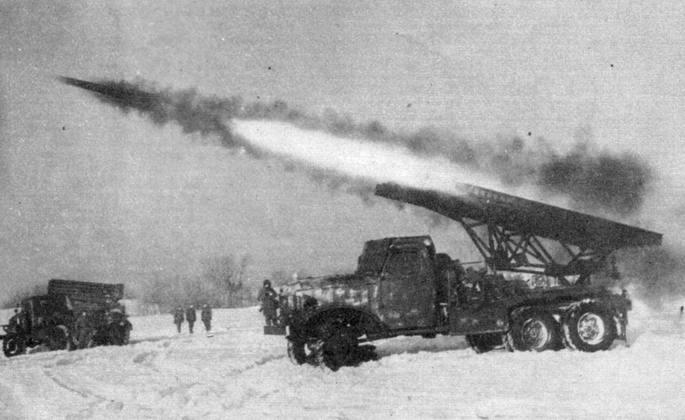

### Krajowa Rada Narodowa

Krajowa Rada Narodowa wydała dotyczący volksdeutschów dekret "O wyłączeniu ze społeczeństwa polskiego wrogich elementów". Będzie to legalna podstawa pod represje wobec mieszkańców Śląska.

### Łódź

W Łodzi odbył się zbiorowy pogrzeb ofiar masakry, która miała miejsce w więzieniu na Radogoszczu w nocy z 17 na 18 stycznia.

Była to największa zbiorowa egzekucja jakiej dokonali Niemcy po tym jak 12 stycznia ruszyła sowiecka ofensywa. Zamordowali ok. 1,5 tys. ludzi.

### Pogórze Kaczawskie

Walki w okolicy Stanisławowa (k. Złotoryi) trwały na przełomie lutego i marca, żadna ze stron nie była w stanie uzyskać przewagi i wojna w tym rejonie zamarła. Dopiero w nocy z 7 na 8 maja Niemcy zaczęli się wycofywać w kierunku Czech. [Walki w rejonie Stanisławowa na Pogórzu Kaczawskim.](https://www.facebook.com/bobr1945/posts/3318947794885527), [Lutowy atak na Ostrzycę –27.02.1945 r.](https://www.facebook.com/bobr1945/posts/3289300937850213)

### Wrocław

Ostatni dzień miesiąca, który zaczął się od zmiany na stanowisku komendanta twierdzy; w połowie lutego nastąpiło zamknięcie oblężenia i po chwili przerwy generalny szturm od południa. Po tygodniu ofensywy w ostatnich dniach lutego natarcie ugrzęzło, ale wojna lądowa w gęsto zabudowanym mieście powodowała ogromne straty w ludziach po obu stronach oraz zniszczenia miasta. Oznaczała też niewyobrażalny terror dla ludności cywilnej zamkniętej w oblężeniu jak w potrzasku. Wrocław jest - z niewielkimi przerwami - bombardowany i ostrzeliwany z samolotów od 9 lutego, wkrótce potem dochodzi do tego ostrzał artylerii.

Pożary, tzn. zasnuwający horyzont dym za dnia i niebo rozświetlone płomieniami w nocy są stałym elementem krajobrazu. Już się tego nie odnotowuje. Coraz częściej widzi się zabitych leżących na ulicach, ulice tracą drożność i służby oczyszczające miasto nie mogą normalnie funkcjonować. Peikert opisuje końskie trupy leżące na Świdnickiej od czterech dni.

Do zniszczeń wywołanych bombardowaniami dochodzą wyburzenia dokonywane przez Niemców, zarówno w centrum, jak i w przygotowywanej strefie walk na południu, z ruin chcą zrobić barierę. Całe miasto ma się stać taką barierą. Z kolei sowieci po chwilowych sukcesach utknęli w tych ruinach i zmienili taktykę walki. Teraz niszczą wszystko, co się da ogniem artylerii, miotaczami ognia i granatami, zanim sprawdzą, czy ukrywają się tam Niemcy. Podczas szturmu nasilenie ognia jest takie, że nie wiadomo kto i skąd strzela.

O dziwo w tych warunkach infrastruktura wciąż zaopatruje mieszkańców w gaz, prąd i wodę bieżącą. Jak pisze von Ahlfen:
>Żadnych trosk nie przysparzał dowództwu nadzwyczaj szeroki zakres zaopatrzenia Wrocławia w żywność i wszelkiego rodzaju używki. Był to fakt o decydującym wprost znaczeniu. Jego przyczyn nie należy upatrywać jednak w tym, że Wrocław został ogłoszony twierdzą, lecz raczej w tym, że Śląsk i jego wypełniona magazynami stolica stanowiły część "schronu przeciwlotniczego" Niemiec. Ale te gigantyczne zapasy, m. in. 5 milionów jaj i 150 000 mrożonych królików, nie tylko istniały, lecz były wzorcowo zarządzane przez urzędnika referatu spraw gospodarczych dr, Stãdtlera oraz przez jego honorowego zastępcę kupca Alberta Stoscha. Im obu - pierwszy stracił życie w czasie nalotu, a drugi zmarł w niewoli sowieckiej - mieszkańcy Wrocławia i żołnierze zawdzięczają to, że do samego końca nie tylko do syta, ale i dobrze jedli, pili i palili.

W połowie marca pojawi się opis jak dobrze jedli, pili i palili - w luksusowym bunkrze Gauleitera Karla Hanke.

### Przesiedlenia

Miasto miało ogromne zapasy żywności, ale narastały problemy z jej dystrybucją. Cywile i wojskowi ze względów bezpieczeństwa opuścili wyższe piętra, a potem i parter, śpiąc i prowadząc życie w zatłoczonych piwnicach. Wielokrotne przymusowe przesiedlenia ludności, konieczność znalezienia schronienia przed bombardowaniami, każdego dnia nowe rozkazy władz powodowały zamęt tak wielki, że nikt nie mógł nad nim zapanować. Chaos i groza, rosły każdego dnia. Codziennie, czasem tylko trochę a czasem poważnie, przesuwał się punkt odniesienia i zmieniał definicję tego co wciąż jeszcze jest codziennym życiem a co już barbarzyństwem.

To czym był Wrocław przedwojenny, umarło ostatecznie, kiedy Gauleiter wygnał z niego cywilów - 20 i 21 stycznia 1945. Ale z tamtego miasta pozostało wciąż jeszcze dość by myśleć o powrocie. Jednak od czasu kiedy zaczęło się oblężenie, przeszłość każdego dnia oddalała się skrywana za ruinami i obumierała w pozostałych w nim mieszkańcach. Przestali być wrocławianami, mającymi swoje rodziny, domy i pracę, jakąś przyszłość i marzenia. Żyli z dnia na dzień, niczym tępiony z oddali naród piwnicznych szczurów, kryjąc się po kątach i patrząc jak się nad nimi porusza i huczy straszliwa i potężna Pułapka. Tylko tym byli zajęci, by przeżyć kolejny dzień. Było to coraz trudniejsze zadanie. Wielu z nich popadało w szaleństwo. By przetrwać, trzeba było się godzić na coraz większe upodlenie.

Wielu nieznających się na sprawach wojskowych cywili przewidywało atak od południa, Peikert pisze przecież o tym, jak o powszechnej opinii. Dowództwo twierdzy z niezrozumiałych powodów uznało, że Iwan uderzy od północy i północnego wschodu, więc na samym początku lutego wszyscy przebywający na północ od Odry zostali zmuszeni do przemieszczenia się na południe. Później ewakuowano obszar Wielkiej Wyspy. W efekcie większość przebywających w mieście cywili stłoczono w centrum i w południowych dzielnicach. Kiedy się okazało, że to właśnie one są atakowane, po raz kolejny zmuszono ludzi do ewakuacji tym razem pod ogniem artylerii i lotnictwa. Często po kilkukrotnych przenosinach z miejsca na miejsce, nie mogąc powrócić do domu, nie wiedząc nawet, czy jeszcze stoi. Nie mieli już nic oprócz niewielkiego bagażu podręcznego lub nawet tylko tego, co mogli unieść, uciekając do kolejnego miejsca dającego większe pozory bezpieczeństwa.

O losie ewakuowanych pisze jedna z urzędniczek cytowana przez Ernsta Horniga:
>Przez pewien czas żyliśmy w mieszkaniu dozorcy przy ul. Gwiaździstej z wieloma współlokatorami, po tej stronie mężczyźni, po tamtej kobiety. Mieszkaliśmy grupami i gotowaliśmy grupami (siedemnaście osób). Nie tak to sobie wyobrażałam. Każdy, jeśli to było jeszcze możliwe, pracował w swoim zawodzie albo został zapędzony do budowy barykad lub do prac na pasie startowym. Ponieważ nasze biuro zostało zamknięte, tak jak i Urząd Skarbowy, zwolniono nas, a ja i Greta zostałyśmy przydzielone do prac przy pasie startowym. Robiło się, co się dało, aby tego uniknąć. [...] Tylko my dwie pracowałyśmy w moim biurze. Odbierałyśmy i sortowałyśmy pocztę, która nadal jeszcze była odbierana przez dozorcę. Więcej czasu spędzałyśmy w piwnicy niż przy spokojnej pracy w biurze. Wojna z powietrza przybierała ciągle na sile. Przerażające było wychodzenie do pracy i powrót z niej. Niekiedy cała sfora lotników krążyła nad naszymi głowami. Pożary czyniły wokoło straszne spustoszenia. Człowiek bezsilnie się przypatrywał, jak wszystko wali się w gruzy. Ranni jęczeli, chcieli, aby ich opatrzyć, potrzebowali słowa pocieszenia, odrobiny wody. Tam znowu byli ludzie w szoku, których trudno było uspokoić. Człowiek widział zabitych, przeżył wszystko co przynosi ze sobą okrutna wojna. A przy tym trzeba było gotować, myć się, zaopatrywać, a także przespać się niekiedy. "Organy Stalina" wyły, front deptał nam po piętach. Na Kaiser-Wilhelm-Straße (obecnie Powstańców Śląskich) byli już Rosjanie. A my znajdowaliśmy się nadal w naszych piwnicznych norach. Tymczasem nasze mieszkanie zostało całkowicie zniszczone przez granaty, groziło nawet zawaleniem. [...] Niekończące się bombardowania. Nie wiedzieliśmy nawet, jak przynieść w dzień chleb i coś ugotować. Następnej nocy musieliśmy się przymusowo ewakuować. W naszej piwnicy żołnierze zajęli stanowiska obronne. [...] Ponieważ jeden z mężczyzn naszej prowizorycznej wspólnoty posiadał klucz do mieszkania koleżanki przy Klosterstraße (obecnie ul. Traugutta), która w styczniu opuściła Wrocław, to w środku nocy się tam przeprowadziliśmy. Wszędzie to samo zagrożenie, ten sam strach, te same warunki życia. Siedem osób mieszkało w jednym, niezbyt dużym pomieszczeniu. Prowadziliśmy życie Cyganów. Ale przeżyliśmy również radosne chwile. Żyliśmy tak przez dwa tygodnie. Po tym znowu uderzyły granaty niszczące wszystko.

Dalszy ciąg jej dramatycznej historii później.

*Wyrzutnia rakietowa MB-13 popularnie nazywana katiuszą (niem. Stalinorgel czyli "organy Stalina") 
Źródło: Wikipedia Domena publiczna, [Link](https://commons.wikimedia.org/w/index.php?curid=729969)*

### Paul Peikert

Straszliwy los przepędzanych z miejsca na miejsce wrocławian opisuje ksiądz Peikert:
>Po mszy św. chrzczę pierwsze dziecko od chwili przymusowej ewakuacji. To osobliwość, gdyż zabrano wszystkie kobiety w ciąży. O godz. 8 wszczyna się gwałtowny ogień artylerii, trwający przez cały dzień. Ta ogłuszająca kanonada przygnębia przede wszystkim dlatego, że pociski trafiają w domy naszych rodaków na południu miasta. Ileż mieszkań znowu legnie w gruzach dziś przed południem, a ile będzie znowu poważnie uszkodzonych! Około południa wzmaga się znów działalność nieprzyjacielskiego lotnictwa, która w ciągu popołudnia osiąga dramatyczny szczyt [...] miałem znów przed oczyma wstrząsający i żałosny obraz, podobny do tego z czasu ewakuacji w połowie stycznia, gdy przez miasto przeciągały nieskończone kolumny przymusowo ewakuowanych rodaków ze swym skąpym dobytkiem, zmuszonych wszystko porzucić i ruszyć w niepewną przyszłość. Dziś potok uchodźców płynie z południa miasta do dzielnic położonych na północ od Odry. Teraz ewakuuje się przymusowo całe południe miasta aż po Dworzec Główny i cały zachód miasta aż po Dworzec Nadodrze. Ewakuację przeprowadza Waffen-SS z niesłychanym terrorem i cynizmem. Pod groźbą pistoletu - tak dzieje się faktycznie - zmusza się ludzi, którzy pozostali, do porzucenia całego dobytku i do ucieczki. Gdy jeden grozi pistoletem - tak działo się faktycznie - drugi węszy wśród sprzętów za czymś wartościowym, aby sobie przywłaszczyć to, co najcenniejsze. Resztę oblewa się benzolem lub smołą i niszczy. Nieopisaną nędzę sprowadza na naród ta soldateska. Ci żołnierze nie zdradzają już najmniejszego poczucia odpowiedzialności wobec własnych rodaków, to ich najgroźniejsi wrogowie i gnębiciele, ślepo posłuszni woli niszczenia Hitlera, swego mocodawcy. To już nie obrońcy ojczyzny i kraju rodzinnego; uczyniono z nich zbrodniarzy na szkodę własnego narodu. Są dziełem Hitlera, który zagłuszył w tych ludziach, zdolnych do wszystkiego, wszelki głos sumienia. Kolumny te przedstawiały żałosny widok. Często byli tam całkiem starzy ludzie, którzy musieli przebyć pieszo daleką drogę na północ miasta [...] Spotkałem 55-letnią córkę z 86-letnią matką. Nawet matka dźwigała walizkę, prawie niezdolna do przebycia tej drogi. Nie było też nikogo, kto by się ulitował nad nią i zabrał na wóz. Kiedy doszedłem do Zakładu pod wezwaniem NMPanny przy Domplatz, uderzył mnie podobny widok szeregu ręcznych wózków nadciągających od Dombrücke i przybywających z Grabiszynka i Gajowic. Gdy kolumny te ciągnęły ulicami miasta, około godz. 15.30 operacje lotnictwa nieprzyjacielskiego przerodziły się w gwałtowny nalot. [...] Ruch tramwajowy trzeba było wstrzymać. Nalot dotknął tę część miasta, w której, stłoczeni zostali przymusowi przesiedleńcy z południa miasta. Im bardziej kurczy się obszar, nad którym przelatują samoloty nieprzyjacielskie, tym skuteczniejsze staje się bombardowanie. [...] Doniesiono mi także, że komendant twierdzy zajął dolną kondygnację kościoła Św. Krzyża. [...] Dolny kościół stanie się bunkrem dla dowództwa twierdzy, a Ostrów Tumski ma zarazem stanowić centrum oporu. Ostrów Tumski ze swymi domami i zakładami klasztornymi jest obecnie zatłoczony przez niezliczonych starców i chorych. Jutro ma się udać do komendanta twierdzy delegacja z petycją, aby pozostawić Ostrów Tumski poza wszelkimi działaniami wojennymi, i z powiadomieniem, że duchowieństwo i klasztory nie zamierzają wypełnić nakazu opuszczenia Ostrowa. Rozgoryczenie ludzi pogłębia się coraz bardziej. Coraz wyraźniej zdają sobie sprawę z tego, że taki sposób prowadzenia wojny nie ma już sensu; na przekór temu powiedział dziś Goebbels w swojej mowie: „Wojnę będziemy prowadzili do zwycięskiego końca, bez względu na wszystkie cierpienia narodu. Zwyciężymy albo umrzemy”. W obecnym położeniu jest to oczywiste szaleństwo zarówno ze strategicznego, jak i z politycznego punktu widzenia. Taka to straszliwa alternatywa, która już nie zna kompromisu. Sprowadzi to straszną katastrofę na naród niemiecki. Tak więc żywot w naszej twierdzy przedstawia się z dnia na dzień coraz smutniej i beznadziejniej. Panowało ogólne mniemanie, że oblężenie nie potrwa tak długo i że Rosjanie zdołają szybciej opanować miasto. [...] Na obszarach przymusowo ewakuowanych ludność niemiecka musiała niemal wszystko pozostawić. Rosjanie biorą więc, co porzucono: bieliznę, ubrania, meble i inne sprzęty i transportują masowo do Rosji. W ten sposób usiłują powetować sobie potworne zniszczenia w Rosji, które są naszym dziełem. Krążą przerażające pogłoski o szeroko zakrojonej ewakuacji miasta w kierunku północnym. [...] Jak zwykle wieczorem niebo czerwieni się od licznych pożarów, które szerzą spustoszenie głównie na południu miasta.

Już wkrótce okaże się, że pogłoski o zainteresowaniu dowództwa Twierdzy kościołem Św. Krzyża wynikają z zainteresowania tym rejonem miasta, kolejna siedziba sztabu zostanie umieszczona w pobliżu. Na to, że już wtedy zaplanowano, gdzie będzie się znajdować, wskazuje następny cytat.

### Walter Laßmann

Ksiądz Walter Laßmann pisze:
>Pomimo silnego ostrzału artyleryjskiego udało mi się wrócić cało i zdrowo do naszego schronu. [...] Tego samego dnia ewakuowano mieszkańców Wyspy Piaskowej.

Współczesny czytelnik zapewne zastanawia się - jakich mieszkańców? - przecież jest tam dosłownie kilka niewielkich kamienic, reszta to zabudowania poklasztorne, ówcześnie i dziś uniwersyteckie oraz młyn. Ale przedwojennych zdjęciach widać, że chodziło o całkiem sporą grupę ludzi, ponieważ zarówno w miejscu, gdzie obecnie stoi pomnik biskupa Kominka stały wysokie kamienice dachami sięgającymi aż do szczytu ścian kościoła NMP, a w zachodniej części wyspy było całe urocze miasteczko kamienic z zakręcającymi uliczkami, z daleka wyglądającymi jak bajkowy krajobraz. Zapewne było to proporcjonalne (odwrotnie) do wygód oferowanych przez te piękne z daleka domki. Oblężenie było zagładą tego wyspiarskiego miasteczka. Na zdjęciach lotniczych z 1947 widać już tylko ściany tych domków, bez żadnych dachów. Wkrótce po wojnie teren został splantowany.

Ta uwaga dotyczy sporej części powojennego Wrocławia, dla którego charakterystyczne były spore obszary wolne od zabudowy, niejednokrotnie w ścisłym centrum, całe rozlegle place powstały w miejscach gęsto zabudowanych kamienicami.

Najlepiej to ilustruje przykład placu Dominikańskiego (ściśle rzecz biorąc terenu pomiędzy właściwym pl Dominikańskim a obecną Trasą W-Z), w XIX wieku zabudowanym tanimi kamieniczkami, przeznaczonymi przez biuro Maxa Berga do wyburzenia. I rzeczywiście zostały wyburzone, przynajmniej częściowo przez samych Niemców podczas oblężenia. Po wojnie resztki ruin usunięto, a plac nagle i to na kilkadziesiąt lat stał się wielkim trawnikiem o powierzchni większej niż Rynek ze ścieżkami i ławkami. Dostał też niesławnego patrona. W początku lat 90. XX było to miejsce najbardziej rozległych wykopalisk archeologicznych, jakie przeprowadzono w europejskim mieście i po ich zakończeniu ogrodzony teren stał się uroczym bajorkiem z własną florą i fauną. W końcu z opóźnieniem, ale skutecznie wkroczył inwestor i od 2001 stoi tam Galeria Dominikańska.

Tego dnia Hugo Hartung po dotarciu do szpitala ojców bonifratrów, jak można sądzić z późniejszych wpisów w notatniku, jest w zbyt ciężkim stanie, by cokolwiek napisać.
