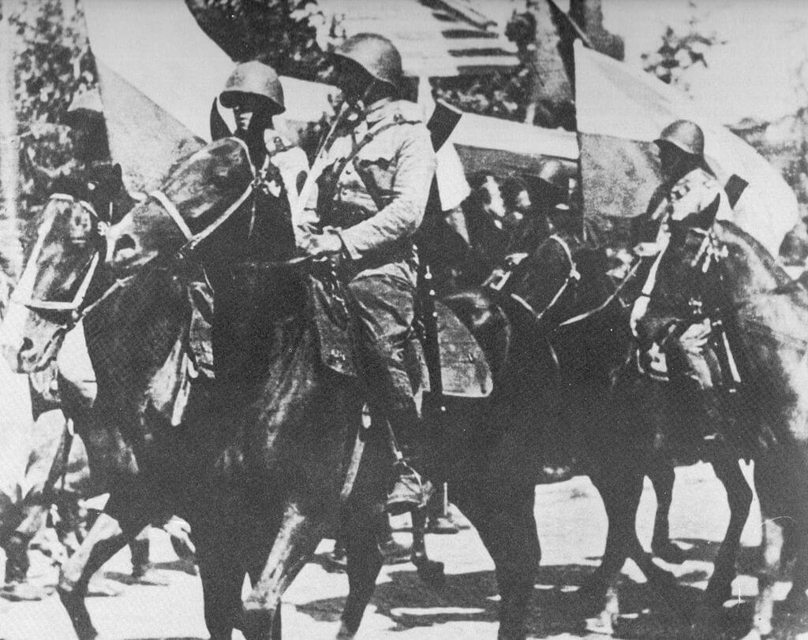

### Bachem Ba 349 Natter

Jedną z najdziwniejszych konstrukcji lotniczych zbudowanych pod koniec wojny przez hitlerowskie Niemcy był Natter (pl. Żmija) - drewniany pionowzlot rakietowy. Odpalany zdalnie i przez większą część lotu sterowany radiowo był trochę rakietą, trochę szybowcem trochę samolotem. Założeniem było osiągnięcie prędkości poddźwiękowej - 0.95 Macha. W 4,5 minuty miał osiągnąć pułap 6 tys. m. Zasięg 40 km maksymalny pułap 12 tys. m. Posiadał niewielkie, masywne skrzydła i usterzenie ogonowe. Pilot miał przejąć kontrolę po wejściu w strefę celu, czyli wykrytych radarami bombowców alianckich. Umieszczony nad bombowcami lotem szybowcowym miał dokonać ataku i zniszczyć bombowce rakietami. Drewniany kadłub był jednorazowy, po wykonaniu zadania pojazd ulegał kontrolowanej destrukcji. Silnik i pilot mieli wrócić na ziemię na spadochronach.

Dzisiejszy oblot w Stetten am Kalten Markt (Badenia-Wirtembergia) zakończył się katastrofą. Pilot oblatywacz Lothar Sieber zginął. Możliwe, że był pierwszą osobą która przekroczyła prędkość dźwięku. Po pierwsze jednak nie wiemy tego na pewno, po drugie wynik nie może być zaliczony jeżeli lot zakończył sie katastrofą.

Na pewno pierwszym pojazdem, który przekroczył prędkość dźwięku i przy okazji pierwszym pojazdem kosmicznym była takieta V2, która przynajmniej dwukrotnie w 1944 przekroczyła umowną granicę kosmosu (100 km).

Mimo tego niepowodzenia próby Nattera kontynuowano. Do kwietnia zbudowano 36 egzemplarzy. 1 kwietnia utworzono Erprobungskommando 600 (pl. oddział doświadczalny). Pierwszy atak miał nastąpić w urodziny Hitlera 20 kwietnia, ale nie doszedł do skutku, bo baza lotnicza była zagrożona przez wojska alianckie i samoloty ewakuowano. Wszystkie zostały porzucone w Austrii. 4 maja alianci odkryli 2 spalone Żmije, kolejnego dnia 4 nietknięte. Jedna wpadła w ręce Armii Czerwonej.

Jedyny ocalały Bachem jest w kolekcji Smithsonian w Maryland.

Japończycy opracowali kopię Nattera - Mizuno Shinryu / Jinryū (pl. Boski Smok) przeznaczony do ataków samobójczych. W lipcu 1945 odbyły się próby w locie wyholowanych szybowców w układzie kaczki. Nie doszło do wyposażenia ich w rakiety startowe, ani nawet do uściślenia taktyki walki. Jako potencjalny cel rozważano przede wszystkim bombowce B-29 i okręty.

- [Mark Felton Productions "Natter Assault! Germany's Vertical Launch Fighter" [YT 9:39]](https://www.youtube.com/watch?v=XzMCZObXQw8)

### Szarża w Bobrujsku

W ten pierwszy dzień miesiąca zamyka się pewien niebywale ważny rozdział w historii wojska polskiego. Podczas walk na Wale Pomorskim przełamywanie pozycji niemieckich w rejonie wsi Bobrujsk (obecnie Żeńsko; to jest dokładnie 100 km na wschód od Szczecina) szło z ogromnym trudem. Kolejne rzucane do boju jednostki, najpierw piechota, potem oddziały zmotoryzowane ponosząc poważne straty, zatrzymywały się pod ogniem dobrze umocnionych wojsk niemieckich. Pola minowe, zasieki, ukryte bunkry i stanowiska karabinów maszynowych. Teren był rozmokły, nieprzyjaciel był wstrzelany.

W tej sytuacji dowódca armii wydał rozkaz użycia kawalerii. Było to 220 kawalerzystów, gł. 3 Pułk Ułanów i 1 Warszawska Samodzielna Brygada Kawalerii. Jarem przedostali się w rejon walk i uderzyli na zaskoczonych Niemców na wysuniętych pozycjach przed wsią, od razu osiągając przełamanie i zmuszając ich do ucieczki. Potem wraz z czołgami, konno i pieszo wdarli się do wsi i zwyciężyli. O dziwo straty ułanów były niewielkie, 7 zabitych, 10 rannych. 2 DP i 1 Brygada Pancerna straciły w sumie 140 zabitych. Ogromne straty niemieckie: 500 zabitych, 50 dostało się do niewoli. Ta ostatnia proporcja wiele nam mówi o stanie ducha zwycięzców.

Bitwa ta warta jest wspomnienia, nie tylko z powodu niezwykłego przebiegu. Jest to bowiem ostatnia szarża kawaleryjska w dziejach oręża polskiego. Godne zakończenie dobrej historii.

Nie jest to natomiast ostatnia w ogóle szarża kawaleryjska tej wojny, bo 23 kwietnia w dolinie Padu 10 dywizjon rozpoznawczy z amerykańskiej 10 Dywizji Górskiej dwukrotnie atakował pozycje niemieckie bez powodzenia i ponosząc poważne straty. Dlatego jest to też ostatnia udana szarża kawaleryjska WWII.

Motyw tw szarży jest przedstawiony w podlinkowanym poniżej filmie z 1975 "w te dni przedwiosenne" w reżyserii Andrzeja Konica.

- Żelazny - ["1945-Wał Pomorski-Szarża pod Borujskiem" [YT 1:38:41]](https://www.youtube.com/watch?v=PMjJC8v3szQ)

*1 Warszawska Samodzielna Brygada Kawalerii, parada 15 sierpnia w Lublinie. 
By nieznany - Cezary Leżeński O kawalerii polskiej XX wieku, Ossolineum 1991, [ISBN 83-04-03364-X](https://commons.wikimedia.org/wiki/Special:BookSources/83-04-03364-X), Domena publiczna, Link(https://commons.wikimedia.org/w/index.php?curid=21247093)*

### Berlin

Znany nam już Trybunał Ludowy (niem. Volksgerichtshof) 23 lutego skazał na śmierć Fritza Goerdelera.

Był młodszym bratem Carla Friedricha Goerdelera, również skazanego na śmierć z tego samego powodu przez ten sam trybunał. Carla hitlerowcy zabili 2 lutego. Fritz był przez wiele lat burmistrzem Kwidzynia, musiał jednak zrzec się stanowiska po tym, jak w 1933 odmówił wstąpienia do NSDAP. Potem do 1944 był skarbnikiem miejskim w Królewcu. Tam nawiązał kontakty z opozycją, był jedną z ofiar wielkiej łapanki po zamachu na Hitlera z 20 lipca 1944.

Dzisiaj został powieszony w więzieniu Plötzensee.

### Wrocław

"*Wars not make one great*" (wojna nie czyni nikogo wielkim) jak to ujął Yoda, słynny mistrz Jedi, kiedy Luke Skywalker powiedział mu, iż szuka wielkiego wojownika. Rozmowa ta miała miejsce na planecie Dagobah, dawno temu i w innej galaktyce. Ale pewne prawdy są uniwersalne dla całego wszechświata. Wojna we Wrocławiu nikogo nie czyniła szczęśliwym. Dowódca sowiecki i jego żołnierze byli nieszczęśliwi, bo postępy nie tylko malały, ale na sporym odcinku w ogóle nie można było pójść naprzód, każdy kolejny dzień to kolejne ofiary na całkiem niepotrzebnym froncie wojny. Dowódca niemiecki i jego żołnierze byli nieszczęśliwi, bo znaleźli się w oblężeniu i stała przed nimi perspektywa śmierci lub sowieckiej niewoli, w ciągu kilku dni utracili sporą część miasta, a ich siły topniały z dnia na dzień.

Jeszcze kilka dni temu nacierający szacowali, iż atak zajmie z tydzień i obrona się załamie, a obrońcy uważali, że może zajmie to więcej niż tydzień, ale niewiele więcej. Nastała jednak najgorsza dla wszystkich sytuacja pata. Obie strony zwarły się w śmiertelnym dla miasta klinczu i krwawiły. Wyglądało na to, że zwycięstwo będzie należeć do tego, kto krwawiąc, dłużej utrzyma się na nogach. Dobrze zaopatrzone w podstawowe środki obrony i metody prowadzenia wojny miasto, zasilane zrzutami i przez wciąż działające lotnisko na Gądowie Małym mogło prowadzić długotrwałą obronę na wybranym przez przeciwnika obszarze ataku. Tak samo atakujący, wciąż mający zapas sił na wiele tygodni natarcia, absolutne panowanie w powietrzu i wolne tyły.

Ta sytuacja pata była jednak najgorsza dla wrocławskich cywili, już wyrzuconych z domów i wygnanych do piwnic, bombardowanych w dzień i w nocy, zabijanych na wszelkie sposoby, nie tylko przez przeciwnika, ale także przez terror Twierdzy. Tak właśnie zaczynał się marzec 1945 we Wrocławiu.

Ksiądz Peikert:
>W istny szał niszczenia wpadli Niemcy, bo rząd postradawszy zmysły rzuca hasło: zwycięstwo lub zagłada. A ze zwycięstwo jest już nie do osiągnięcia, wiedzie się naród niemiecki do żałosnej zguby. Jakże ubogi będzie nasz naród po tej wojnie. Rujnuje się jego mieszkania i warsztaty pracy. Zniszczono mu środki komunikacji. Długo trzeba będzie poczekać zanim z naszego Dworca Głównego będziemy znów mogli pojechać do krewnych. Czy uda się jeszcze sprowadzić z powrotem miliony ewakuowanych z obszarów wschodnich? Czy nie zginą pierwej śmiercią głodową?

Jak widać pisząc to, nie zna jeszcze ustaleń konferencji jałtańskiej. Jakie byłoby jego zdanie, gdyby wiedział, że teraz wszyscy dolnośląscy Niemcy są wygnańcami, ci którzy uciekli, już nie wrócą a reszta, jeżeli przeżyje bitwę, będzie musiała wyjechać? Świadomość, że Niemcy utraciły Dolny Śląsk, pojawia się na tym etapie wojny, była już obecna. Widać to we wspomnieniach. Nie byli tylko pewni czy odbędzie się to na rzecz Czech, czy Polski.

Dziś we frontowej Schlesiche Tageszeitung ukazał się artykuł Goebbelsa "Przerwiemy front Mongołów".

Pułkownik Malinin relacjonuje taktykę i warunki walki w systematycznie niszczonym mieście:
>1 marca 1945 r. Ulice Wrocławia zasnute są czarnym, gęstym dymem. Płoną domy. Gryzący dym dusi w gardle, piecze w oczy. Przedwczoraj, wczoraj i dziś nasze samoloty i "katiusze" wywołały nowe ogniska pożarów w mieście. Toczą się zawzięte, krwawe walki. Żeby przebiec przez ulicę, zbliżyć się do budynku, wedrzeć do niego, trzeba wielkiej siły woli, odwagi żołnierskiego kunsztu i przebiegłości. 
>Zacięte walki toczą się o każdy dom, a nierzadko o każde piętro, piwnicę i klatkę schodową. Pociski, ogień, ładunki wybuchowe, wykurzają hitlerowców z domów, grzebią ich pod gruzami walących się murów. 
>Od paru dni nasze natarcie idzie coraz ciężej. Duży wpływ ma na to również specyfika walk ulicznych i warunki istniejące we Wrocławiu. Zabudowa miasta i jego murowane domy z grubymi ścianami doskonale nadają się do obrony. W centrum miasta zabudowa jest ciągła. Blok takich kamienic w kształcie prostokąta czy kwadratu stanowi nie byle jaką fortecę. W dodatku każdy dom wyposażony jest w piwnice, schrony przeciwlotnicze i podziemne przejścia. Korzystając z tych właśnie przejść, hitlerowcy mogą w każdej chwili wzmocnić załogę bronionego obiektu. 
>Są również wypadki (kilka takich odnotowano w rejonie Hindenburgplatz), że Niemcy, wyparci z poszczególnych domów, wracają do nich przez podziemne przejścia, zakładają w piwnicach ładunki wybuchowe i wysadzają budynki w powietrze wraz ze znajdującymi się w nich naszymi żołnierzami. Wysyłają również kanałami na nasze tyły dywersantów i zwiadowców z radiostacjami. 
>Ogień z pancerfaustów utrudnia działania bojowe czołgom (których zresztą jest bardzo mało), artylerii i działom samobieżnym. W oknach piwnic i parterów, a także na balkonach większych domów nieprzyjaciel przygotował stanowiska dla karabinów maszynowych, strzelców wyborowych i niszczycieli czołgów. Prawie wszystkie ważniejsze ulice prowadzące do centrum, są zabarykadowane, przecięte okopami, oplecione drutem kolczastym i najeżone minami. Za każdy krok do przodu trzeba płacić krwią...
