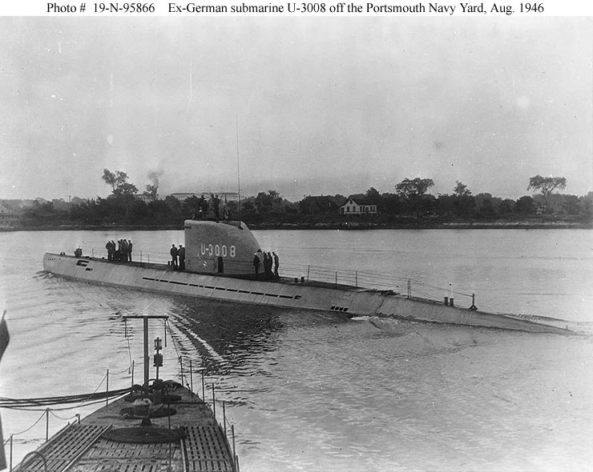

### U-Boot XXI

U-Booty była to jedna z tych formacji, w których hitlerowcy pokładali nadzieje na zmianę układu sił w wojnie z Anglią. Nie mogli rywalizować na morzu w okrętach liniowych. Chcieli zniszczyć potęgę morską Albionu spod wody. A przede wszystkim poprzez zniszczenie floty handlowej, przez blokadę planowali zagłodzić Anglię i pozbawić ją możliwości dalszego prowadzenia wojny. Dzisiaj wiadomo, że tak naprawdę nie mieli na to szans. Technologie wykrywania i niszczenia okrętów podwodnych alianci rozwijali szybciej, niż Niemcy zdołali je produkować. Ogółem U-Booty odpowiadają za utratę kilku procent tonażu floty transportowej zasilającej Wielką Brytanię i sowiety. Ale to właśnie Atlantyk był polem bitwy najbardziej zaprzątającym uwagę Churchilla, wiedział bowiem, że dopóki tam ma przewagę, wojna trwa, a kiedy/jeśli ją straci, straci wszystko. Wszak nie można było wykluczyć, że Niemcy dokonają jakiegoś przełomu technologicznego i skonstruują niewykrywalne U-Booty.

Z dzisiejszego punktu widzenia były one bardzo niedoskonałe. Nieco zmodernizowane konstrukcje z czasów Wielkiej Wojny. W zasadzie były to łatwe do uszkodzenia i praktycznie bezbronne okręty nawodne z możliwością krótkiego zanurzenia. Pod wodą mogły przebywać krótko.

Przełomem był dopiero produkowany od kwietnia 1944 model XXI. Jak to się uważa, był to nie tylko najnowocześniejszy okręt podwodny WWII, ale przede wszystkim pierwszy okręt podwodny z prawdziwego zdarzenia. W sumie wyprodukowano ich 118. Była to ostatnia nadzieja admirała Karla Dönitza na wygranie totalnej wojny podwodnej. W lutym 1943 został szefem Kriegsmarine, ale jego U-Booty ponoszą takie straty, że już w kwietniu 1943 musi je wycofać z Atlantyku. Żeby tam wrócić i zwyciężyć potrzebuje zupełnie zupełnie nowej maszyny, tym właśnie miało być podwodne Wunderwaffe - model XXI.

Dziś jeden z nich, U-3519, wpadł na brytyjską minę morską na wysokości Rostocku, zginęło 75 marynarzy, trzech uratowano.

- [Becks Hobby Productions "German WWII Submarine Type XXI (Elektroboot) - Design, construction & assembly" [YT 15:27]](https://www.youtube.com/watch?v=FJ_O4DKcdkg)
- Podcast Wojenne Historie ["Bitwa o Atlantyk" [YT 25:51]](https://www.youtube.com/watch?v=_IjfmiZ-oyA)
- Michał Banach ["U-booty typu XXI – najlepsze okręty podwodne II wojny światowej"](https://www.smartage.pl/u-booty-typu-xxi-najlepsze-okrety-podwodne-ii-wojny-swiatowej/)

*U 3008 już po wojnie; Portsmouth Naval Shipyard, Kittery, Maine. 
Von Photograph from the Bureau of Ships Collection in the U.S. National Archives. Photo #: 19-N-95866, Gemeinfrei, [Link](https://commons.wikimedia.org/w/index.php?curid=6295212)*

### Armstrong Whitworth A.W.52G

Nie tylko Hortenami stoi latające skrzydło. W 1942 naukowcy z Royal Aircraft Establishment zaangażowali brytyjską firmę Armstrong Whitworth Aircraft do testów opracowywanego przez nich nowego rodzaju skrzydła dającego małe opory przy dużych prędkościach.

Tak powstał projekt szybkiego bombowca odrzutowego w układzie latającego skrzydła. Ponieważ silniki odrzutowe nie były jeszcze dostępne zaczęto od budowy w marcu 1943 przeskalowanego modelu szybowca do prób aerodynamicznych. Dla obniżenia kosztów zbudowano go z drewna i miał stałe podwozie.

2 marca 1945 został wyholowany przez Armstrong Whitworth Whitley na wysokość 3700 m i po odczepieniu odbył 25-minutowy lot. Zarówno ten lot jak i wszystkie późniejsze próby zakończyły się sukcesem.

W 1946 firma dostała kontrakt, który umożliwił budowę dwóch kolejnych prototypów. Jeden z nich w maju 1949 rozbił się po tym jak skrzydła wpadły w drgania. Pilot uratował się dzięki katapultowanemu fotelowi - był to pierwszy przypadek praktycznego zastosowania tego wynalazku. Próby z drugim prototypem prowadzono do 1954, ale ten obiecujący projekt nie doczekał się żadnej kontynuacji.

Nie był to jedyny konkurent Hortena w kategorii latającego skrzydła. W takim układzie specjalizowała się amerykańska Northrop Corporation. tu przede wszystkim należy wymienić zamówiony przez wojsko Northrop N-9M, nad którym prace zaczęto w 1941. Oblatany w grudniu 1942. Jego kontynuacją był Northrop YB-35. Oba samoloty były napędzane silnikami tłokowymi ze śmigłem pchającym.

Od 1943 Northrop rozpoczął eksperymenty z takimi samolotami z silnikami rakietowymi i odrzutowymi. Pierwszym był Northrop XP-79 Flying Ram, niezbyt szczęśliwy samolot, którego jedyny prototyp rozbił się podczas pierwszego lotu 12 września 1945, zabijając pilota. Choć warto dodać, że zginął, bo nie otworzył mu się spadochron. Kulminacją badań nad samolotami w układzie latającego skrzydła był odrzutowy Northrop YB-49 oblatany w październiku 1947. Ostatecznie z różnych przyczyn zamknięto ten projekt w 1951. Na 30 lat. W 1981 Northrop wraca do układu latającego skrzydła znanym nam B-2 Spirit.

- Rex's Hangar ["Britain's Forgotten Flying Wing - Armstrong Whitworth A.W. 52" [YT 10:30]](https://www.youtube.com/watch?v=9WZIu_4qMNg)
- [Armstrong Whitworth A.W.52](https://en.wikipedia.org/wiki/Armstrong_Whitworth_A.W.52)

### KL Dachau

W obozie koncentracyjnym Dachau zmarł ksiądz Engelmar Unzeitig, kapłanem został w 1939 i w kazaniach nawoływał wiernych do pomagania prześladowanym Żydom. W 1941 aresztowany przez Gestapo i wysłany do Dachau. Pod koniec 1944 z 19 innymi ochotnikami zgłosił się do pomocy chorym na tyfus.

### Komendant

Najważniejszym wydarzeniem tego dnia jest zmiana na stanowisku komendanta Festung Breslau dokonana przez dowódcę Grupy Armii Środek Generalobersta Ferdinanda Schõrnera, treść rozkazu w relacji Horniga:
>Naczelne Dowództwo I. Armii Pancernej 
>I adiutant 
>Kwatera Główna Armii 2 marca 1945, godz. 0.15 
>Pan generał porucznik Niehoff 
>Na rozkaz [...] informuję Pana Generała, że na wniosek generała-pułkownika Schõrnera przewiduje się dla Pana nowe zajęcie na najtrudniejszym odcinku. Istota tego zadania dowódczego zdecydowanie wykracza poza znaczenie dowodzącego generała. Decyzja odnośnie do tego wniosku będzie podjęta na najwyższym szczeblu jeszcze dzisiejszej nocy [...]. 
>odręczny podpis

Jak do tego doszło? O konflikcie z Gauleiterem Karlem Hanke czasem między wierszami a czasem wprost, pisze dotychczasowy komendant Generalmajor Hans von Ahlfen. Ostatniego dnia stycznia von Ahlfen zostaje wyznaczony następcą Generalmajora Johannesa Krause, który w wyniku ciężkiej choroby nie jest w stanie pełnić dłużej swoich obowiązków. Pierwszego lutego przylatuje ze Świdnicy, zgodnie z najlepszą tradycją niemieckich jednostek frontowych z własnym szefem sztabu majorem Albrechtem Otto. Obaj znali się od wielu lat i służyli w wojskach inżynieryjnych, w niemieckiej tradycji wojskowej nazywanych wojskami pionierskimi (niem. Pioniertruppen). Z powodu stanu, w jakim znajdował się Krause, von Ahlfen odbył tylko krótką, kurtuazyjną wizytę. Nie mógł zostać wdrożony w obowiązki przez swojego poprzednika i samodzielnie musiał zapoznać się ze stanem przygotowań do oblężenia, które wówczas już wydawało się nieuchronne.

Szybko organizuje obronę twierdzy. 14 lutego uruchomiono nową siedzibę sztabu, w schronie obrony przeciwlotniczej przy Wzgórzu Partyzantów, od razu jednak okazało się, że obiekt ten nie spełnia podstawowego warunku, tzn. z powodu braku żelbetowego wzmocnienia stropu nie chroni przed bombami burzącymi. Zabezpieczono prowizorycznie schron i zaczęto szukać innego obiektu, który mógłby go zastąpić. Niestety znaleziono takowy na Piasku (dlaczego "niestety" o tym przy innej okazji).

Następnego samego dnia zamyka się pierścień oblężenia i kończy się wzmacnianie garnizonu, czym się dało; od 17 stycznia bowiem patrole rozstawione na skrzyżowaniach, mostach, stacjach kolejowych wyłapywały wszystkich w mundurach, a także ubranych po cywilnemu mężczyzn wyglądających na zdatnych do służby wojskowej i kierowały ich przymusowo niezależnie od stopnia i posiadanych rozkazów do Koszar Kirasjerów Wielki Elektor, gdzie formował się garnizon Twierdzy. Takim właśnie formowanym ad hoc garnizonem dysponował von Ahlfen i wiele dni zajęło zarówno utworzenie z nich prawidłowo działających jednostek, jak i przeszukanie wszelkiego rodzaju magazynów i składów w poszukiwaniu broni i innych materiałów wojennych. We wspomnieniach komendant z satysfakcją wylicza panzerschrecki, moździerze, pomija jednak ogólnymi uwagami rzecz najważniejszą, że podobnie jak załoga garnizonu, broń którą mieli do dyspozycji w dużej części jest przypadkową zbieraniną tego, co akurat udało się we Wrocławiu zatrzymać lub znaleźć. Szczególnie brakowało artylerii i czołgów. Garnizon dysponował pewną ilością artylerii przeciwlotniczej, ale brakowało do niej amunicji. Ta sama uwaga dotyczy wszelkiego rodzaju urządzeń obronnych i szpitali polowych.

Wróg po wybadaniu stawianego oporu i możliwości przełamania obrony zdecydował się na generalny atak większością posiadanych sił od południa i ten atak przez ostatnie osiem dni lutego kontynuował, na początku osiągając pewne sukcesy. Największą porażką obrońców była utrata rubieży nasypu kolejowego obwodnicy towarowej z 1896. Ogromnym kosztem i ludzkim i materiałowym udało się zatrzymać sowietów w połowie drogi do głównej rubieży na wewnętrznej magistrali kolejowej.

### Gauleiter

20 lutego von Ahlfen obchodzi swoje czterdzieste ósme urodziny, nie wiadomo czy je świętuje, natomiast pod tą datą odnotowuje jedynie pierwszą z serii codziennych, uciążliwych i coraz bardziej przeszkadzających w wypełnianiu obowiązków wizyt Gauleitera. Nie wiadomo, od kiedy datuje się ich konflikt i jakie dokładnie są jego przyczyny, najprawdopodobniej Hanke uważa sytuację za katastrofalną i szuka winnego. Trzeba tu się odwołać do wspomnień napisanych wspólnie przez von Ahlfena i Niehoffa "Festung Breslau w ogniu" (So Kãmpfte Breslau):
>Na początku stycznia bowiem Hanke powiedział do von Ahlfena: "Jestem gauleiterem Śląska, a nie gauleiterem Wrocławia. Jako gauleiter Śląska miałbym na zewnątrz wiele zadań. Aby jednak nie dawać złego przykładu, pozostałem tutaj, chociaż teraz w zamykającym się pierścieniu oblężenia wokół twierdzy jestem człowiekiem bez uprawnień. Cytując Fritza Reutera, jest to teraz "meine Festungsiteid". Proszę mną w przyszłości dysponować!

Niedbały styl relacji jest wart przytoczenia w dosłownej formie, chodziło oczywiście o początek lutego, nie stycznia. Nie wiadomo czy naprawdę Hanke powiedział coś tak bezsensownego (choć biorąc pod uwagę grafomańskie zacięcie gauleitera do dramatycznych sformułowań, jest to możliwe), czy też von Ahlfen ze złej woli lub niedbałości przeinacza jego słowa. Dlaczego Hanke miałby porzucić swoje obowiązki, rolę i uprawnienia na Śląsku po to, by tkwić w oblężonym mieście nie mając żadnej władzy? Prawda jest taka, że pozostał we Wrocławiu, bo takie miał rozkazy, a jego władza była w mieście tak samo realna, jak na całym Dolnym Śląsku. Wielokrotnie z niej korzystał bez żadnego sprzeciwu ze strony von Ahlfena.

Słowa "*Ut mine Festungstied*" pochodzą z wiersza XIX-wiecznego poety Fritza Reutera tworzącego w języku dolnoniemieckim i znaczą "Z czasów mej niewoli" (*Aus meiner Festungzeit*). Czemu człowiek mający tak wielkie aspiracje i tyle dumy co Hanke, który wreszcie zażył pełni władzy dyktatorskiej, miałby składać tak daleko idącą deklarację lojalności wobec właśnie przysłanego komendanta? Tego nie wiadomo. Tak czy inaczej, wg słów von Ahlfena do 20 lutego ich wzajemne stosunki były przynajmniej poprawne. Od tego dnia, czyli dokładnie od momentu rozpoczęcia przez sowietów generalnego szturmu na miasto, interwencje mającego bardzo niewielkie doświadczenie wojskowe i ogromne mniemanie o sobie apodyktycznego Gauleitera, stały się codzienną, uciążliwą rutyną. Trzy sprawy są jednocześnie ilustracją ich konfliktu jak wydarzeniami, które zadecydowały o jego zakończeniu.

### Lotnisko

Na samym początku pobytu we Wrocławiu jeszcze w pierwszych dniach lutego komendant Ahlfen wyszukał miejsce na potencjalne miejsce budowy wewnętrznego lotniska Twierdzy. Ponieważ oblężenie było nieuniknione, a najważniejsze wrocławskie lotnisko - Strachocice - ze względu na swoje położenie było stracone. Pozostawało dużo starsze i mniejsze lotnisko na Gądowie Małym, niesłychanie ważne ze względu na konieczność zaopatrywania oblężonego miasta drogą powietrzną, ale również zagrożone w przypadku ataku sowietów od strony zachodniej, lub południowo-zachodniej. Trzeba było zawczasu wyznaczyć i przygotować miejsce, gdzie samoloty mogą bezpiecznie lądować i startować. Według von Ahlfena najlepszą lokalizacją były okolice Pól Marsowych przy Stadionie Olimpijskim (Schlesierkampfbahn, który w czasach hitlerowskich zmienił nazwę na Hermann–Göring–Sportfeld). Dokonano nawet wstępnych przygotowań do budowy lotniska. Jednak 23 lutego zapada decyzja o budowie lotniska, i to w zupełnie innym miejscu, jak pisze von Ahlfen:
>Zorganizowane przez specjalistę do spraw lotnictwa podpułkownika von Freideburga z miejskim radcą budowlanym oględziny w terenie ujawniły jedyną, ale gorszą od Pól Marsowych możliwość: budowę pasa startowego na przebiegającej z południowego zachodu na północny wschód 1300-metrowej Kaiserstraße (dziś pl. Grunwaldzki). Aby uzyskać szerokość odpowiednią dla maszyn transportowych, należało jeszcze przeprowadzić rozlegle prace budowlane usunąć latarnie i tramwajową sieć trakcyjną wyciąć drzewa środkowej promenady i zrównać z ziemią duża część domów po obu stronach m. in. także Lutherkirche (kościół im. Marcina Lutra). Opracowana fachowo kalkulacja, na której oparto wyliczenia dotyczące koniecznych materiałów wybuchowych i zapalających, środków transportu, sprzętu saperskiego, narzędzi oraz siły roboczej wykazała niezbicie, że realizacja obu przedsięwzięć budowlanych - na Polach Marsowych i na Kaiserstraße - nie jest możliwa. Poza tym specjalista do spraw lotnictwa szczególnie podkreślił, że będąca przesieką Kaiserstraße może być użytkowana wyłącznie przy korzystnych warunkach wiatrowych, to znaczy przy wietrze południowo zachodnim bądź północno wschodnim. Po wspólnych oględzinach terenu generał von Ahlfen uznał, że dobrze spełni swój obowiązek, rezygnując z budowy wewnętrznego lotniska miejskiego na korzyść kontynuacji prac budowlanych na Polach Marsowych. Meldunek wraz z fachowym uzasadnieniem został przekazany wyżej. Reakcja zapowiadała gwałtowną burzę. Nadesłany bezzwłocznie rozkaz brzmiał bowiem "Führer zleca gauleiterowi budowę wewnętrznego lotniska miejskiego. Komendant twierdzy odda mu do dyspozycji niezbędne siły fachowe i materiały wybuchowe".

Ile w tym jest prawdy, a ile chęci przerzucenia odpowiedzialności za śmierć tysięcy ludzi i zrujnowanie dużego obszaru miasta trudno teraz dociec. Ale przynajmniej sama informacja o bezpośrednim rozkazie Hitlera popierającym stanowisko Gauleitera brzmi prawdopodobnie.

### Spadochroniarze

Dowodzi tego druga sprawa - sprowadzenie przez Gauleitera do oblężonego miasta oddziału spadochroniarzy. Opisujący to dość rozwlekle von Ahlfen popada w wiele sprzeczności. Najpierw twierdzi, że to był pomysł Hankego i miał on na myśli komandosów z Monte Cassino, von Ahlfen natomiast miał być temu przeciwny. Później i to w następnym zdaniu sam pisze, że taki oddział byłby przydatny w udrożnieniu korytarza na południe do znajdujących się w okolicy Sobótki oddziałów Schõrnera. Po 20 lutego było to już niecelowe, jak komandosi mieliby się przebijać przez dywizje sowieckie? Później popełnia błąd, pisząc że był to I batalion, podczas kiedy chodziło o sformowany dopiero w styczniu 1945 III batalion 26. pułku 9 Dywizji Spadochronowej, pod dowództwem majora Hans-Heinricha Hackera. Była to pozbawiona doświadczenia i wartości bojowej jednostka złożona głównie ze "spieszonych" lotników. W tym czasie Luftwaffe z braku paliwa uziemiła część swoich samolotów, dla pilotów i personelu pomocniczego przeznaczając zadania piechoty. Normalnie spadochroniarzami nazywa się specjalnie trenowane wojsko zdolne do walki na tyłach wroga lub w warunkach oblężenia. Tu sama, oczywista w przypadku pilotów, umiejętność skakania ze spadochronem czyniła ich spadochroniarzami. Brak przeszkolenia i wyposażenia w broń maszynową oraz moździerze spowodował odesłanie ich na tyły w celu lepszego przygotowania do walki. Von Ahlfen pisze dalej:
>Zgodnie z obowiązkiem złożono o tym meldunek. Odpowiedź głównodowodzącego Grupy Armii Środek brzmiała mniej więcej tak: "Batalion skoczków spadochronowych jest dobry. Oczekuję od pana teraz najwyższej siły bojowej". Nie poddawano w wątpliwość osobistych i moralnych zalet batalionu. Niedostatki w uzbrojeniu i wyszkoleniu oraz brak doświadczenia bojowego były jednak nagim faktem. Złożenie meldunku o tym zostało potraktowane przez komendanta jako obowiązek, przez wyższego dowódcę zaś dziwnym trafem zapewne jako wyraz słabości. Jak się wydaje, w sztabie generalnym dowództwa grupy wojsk meldunek ten jednak rzeczowo przemyślano i przekazano go wyżej. Dowództwo twierdzy bowiem bardzo szybko otrzymało do wglądu wielostronicową korespondencję telegraficzną, w której marszałek Rzeszy Gõring i minister zbrojeń Speer sprzeczali się, zarzucając sobie wzajemnie niewłaściwe uzbrojenie batalionu. Nawiasem mówiąc, ten spór dwóch stojących na samym szczycie Rzeszy osobistości, rozpętany wokół jednego batalionu, był nieomylną oznaką degrengolady dowództwa.

Już wkrótce, jak to zobaczymy, nawet kilka armat dla Wrocławia stanie się przedmiotem sporu w Berlinie.

### Nadajnik

Trzecią sprawą jest wspominany poprzednio nadajnik radiowy, za pomocą którego Gauleiter komunikował się bezpośrednio z sekretarzem Hitlera Martinem Bormannem. W ten sposób miał uprzywilejowany dostęp do Hitlera i Naczelnego Dowództwa i - jak twierdzi Ahlfen a jest to bardzo prawdopodobne - przedstawiał sytuację we Wrocławiu tak jakby sam dowodził obroną, a komendant mu w tym tylko przeszkadzał, i to Ahlfen jest odpowiedzialny za wszystkie niepowodzenia. Generalmajor Hans von Ahlfen zaś miał tylko zwykłą łączność wojskową wyłącznie ze swoim bezpośrednim dowódcą, którym był Generaloberst Ferdinand Schõrner i tej racji mógł tylko składać meldunki, przedstawiając pokrótce najważniejsze fakty bez prawa do własnych opinii i ocen oraz otrzymywać rozkazy. Sytuację von Ahlfena przedstawiała, jak pisze Horning
>wizyta oficerów łącznikowych, którzy przylecieli samolotem i przywieźli listy do Gauleitera, a komendantowi dostarczyli jedynie ich odpisy.

Dochodził do tego również konflikt z samym Schórnerem, który bardziej ufał Gauleiterowi, obaj byli przede wszystkim ludźmi Partii. Schõrner mógł też uznać Ahlfena za zbyt uległego wobec Gauleitera i wolał zastąpić go kimś bardziej zaufanym i zależnym od siebie. Jeszcze jeden powód podaje sam von Ahlfen:
>Możliwe, że pod koniec lutego generał von Ahlfen zagalopował się w poufnej rozpowie z gauleiterem, wyrażając podczas oceny rozwoju sytuacji na wschodzie od 1944 roku oraz ogólnego położenia, o którym mimo oblężenia nie brakowało informacji, obiekcje dotyczące ostatecznego zwycięstwa. Choć jasno przy tym podkreślił, że opinia ta nie zmieni jego trwania w oporze i obronie Wrocławia, być może gauleitera dopadły poważne wątpliwości i przekazał on dalej raport na ten temat. Jego ucieczka tuż przed kapitulacją wskazuje na to, że pewną rolę odegrała tu niewątpliwie troska o własne życie i własną wolność.

Jakże typowe jest dla stylu von Ahlfena odbicie piłeczki w ostatnim zdaniu, najwidoczniej zarzut tchórzostwa czyniony Gauleiterowi w jakiś sposób łączy się u niego z oskarżeniem o defetyzm. Czyżby w momencie pisania wspomnień wciąż za tchórzostwo uważał przekonanie o nieuniknionej klęsce?

### Hermann Niehoff

Richard Hargreaves - powołując się na "Breslauer Apokalypse" Horsta Gleista - opisuje szczegółowo jak wyglądało wyznaczenie kolejnego, już trzeciego komendanta Twierdzy:
>Hermann Niehoff właśnie wracał na swoje stanowisko dowodzenia pod Raciborzem na Górnym Śląsku. [...] Gdy Niehoff zbliżał się do swojej kwatery, zauważył zaparkowany przed nią samochód ze sztabu Grupy Armii "Środek". Pomyślał, że być może Ferdinand Schõrner przybył pogratulować mu zajęcia lepszych pozycji. Było jednak inaczej. "Pańska dywizja stanowi niezdyscyplinowaną masę i jest tak tylko i wyłącznie z powodu braku nadzoru z pańskiej strony" - zbeształ Niehoffa Schõrner. Dowódca dywizji był zaskoczony. Tymczasem Schṏrner kontynuował swą tyradę. Wzywał do siebie kolejnych oficerów i dymisjonował ich lub aresztował jednego po drugim. Niehoff otwarcie się temu sprzeciwił. "Schõrner, który do tej pory pieklił się i złorzeczył, teraz zaczął ryczeć" - wspominał dowódca 371. Dywizji - "Generale poruczniku Niehoff, niniejszym jest pan pozbawiony dowodzenia. Proszę natychmiast udać się do Ostrawy i tam oczekiwać na dalsze rozkazy!" - wrzasnął Schõrner, obrócił się na pięcie i wyszedł. Ordynans Niehoffa zebrał dobytek generała, wsadził go do samochodu sztabowego i zawiózł swego szefa do odległej o 30 kilometrów przemysłowej Ostrawy. W czasie jazdy generał prawie się nie odzywał. Kiedy tylko przybył do Ostrawy, wręczono mu dalekopis. "Zgodnie z sugestią generała pułkownika Schõrnera planowane jest dla pana generała nowe zadanie na najtrudniejszym odcinku". Chwilę później zadzwonił telefon. To był Schõrner. "Niehoff, mam wielkie plany w związku z pańską osobą" - oznajmił - "Sam Führer rozkazał, aby natychmiast poleciał pan do Wrocławia. Przejmie pan dowództwo po generale majorze von Ahlfenie. Niehoff, musi pan bronić twierdzy do ostatniego człowieka i do ostatniego naboju". Schõrner zrobił pauzę, a następnie dodał lodowato "Jeśli nie wykona pan powierzonego zadania, nie tylko czeka pana wyrok śmierci, ale także pańska rodzina poniesie konsekwencje". Dowódca Grupy Armii "Środek" dał Niehoffowi kilka minut na zebranie myśli. Wykorzystał je do napisania krótkiego listu do swojej żony: 
>Moja Droga! 
>W tej chwili najtrudniejszej decyzji przesyłam Tobie i naszym dzieciom moje najserdeczniejsze życzenia 
>Bóg daje mi siłę do przetrwania. 
>Wiem czego się ode mnie oczekuje. Wszystkiego dobrego! 
>Wasz ojciec 
>Przed odlotem do Wrocławia Niehoff został zaproszony przez dowódcę 17. Armii generała piechoty Friedricha Schulza na obiad - "ostatni posiłek skazańca" - jak sam cierpko zauważył. "Schõrner prosił również, żeby przekazać panu co następuje" - dodał Schulz - "Jeśli uda się panu utrzymać Wrocław przez trzy do czterech dni, wtedy on przebije się do pana i poda panu rękę". Schulz się pochylił. "Tak między nami" - szepnął - "podjęto już pierwsze kroki w celu sformowania takiej grupy szturmowej. Ale trzy do czterech dni to złudzenie. Jeśli dokona pan cudu i utrzyma się powiedzmy przez czternaście dni, wtedy takie uderzenie może coś osiągnąć.

Minie jeszcze kilka dni, zanim Niehoff dotrze do Wrocławia.

### Prowokacja

Dzisiaj zaszło coś dziwnego, jak pisze Hans von Ahlfen:
>Wyemitowany ze znakiem i z użyciem głosu "Deutschlandsender" komunikat radiowy mógł mieć fatalne skutki. Bezpośrednio po wiadomościach o 9.00 rozległo się bowiem: "A teraz nadajemy ważny komunikat dla naszych dzielnych żołnierzy i rodaków z twierdzy Wrocław. Wybiła godzina waszej wolności. Kilka sprawdzonych na wschodzie dywizji pancernych przerwało nieprzyjacielski pierścień oblężenia. Przybywajcie na południe miasta, by podać rękę waszym wyzwolicielom!". Jednak zanim jeszcze formująca się wędrówka ludów przystąpiła do marszu na południe, dzięki czujności wywiadu w porę zaalarmowano dowództwo, które zdążyło powstrzymać ludność i uchronić ją przed zrzuconym wkrótce na południe Wrocławia gradem bomb i granatów.

Niezależnie od tego, czy ktoś dał się na to nabrać, sama świadomość istnienia fałszywych komunikatów jest osłabieniem spójności przepływu informacji w tym najszybszym medium.

Ksiądz luterański Ernst Hornig powątpiewa czy rzeczywiście owo dowództwo zdołało kogokolwiek powstrzymać, bo fałszywy komunikat podano rano o godzinie 9.00, a demaskujące go obwieszczenie w gazecie frontowej ukazało się dopiero po południu i z oczywistych w bombardowanej twierdzy powodów wielu ludzi przeczytało o tym z dużym opóźnieniem:
>Nie wiadomo jak szeroko rozpowszechniła się ta wiadomość o odsieczy i przez jaką część ludności została wzięta za prawdziwą. Po pierwsze w wielu piwnicach nie było aparatów radiowych, które w większości pozostawiono w mieszkaniach i które zostały już uszkodzone. Po drugie, wielu miało już dosyć słuchania radia. [...] W dziwny sposób ta propagandowa wiadomość nie dotarła do nas ani przez radio, ani w inny sposób. Wygląda na to, że nie dotarła również do członków naszej gminy, z którymi utrzymywaliśmy codzienny kontakt. Sceptycyzm w stosunku do propagandy niemieckiej, jak i wiadomości radiowych, był już wtedy spory. Jest także prawdopodobne, że we Wrocławiu bardziej niż "Deutschlandsender" były słuchane stacje zagraniczne. Poza tym, nawet jeśli ta wiadomość do kogoś rzeczywiście dotarła, to i tak obawa przed przyłączeniem się do grupy przedarcia się przez oblężenie była z pewnością duża. W każdym razie propaganda ulotkowa Rosjan, ten fałszywy alarm, jak i działalność kilku oficerów niemieckich należących do komitetu "Wolne Niemcy", na przykład na wschodnim przedpolu Wrocławia, wskazywały na to, że przeciwnik stosował wszelkie środki, aby wzniecić zamieszanie i wywołać rozkład moralny obrońców.

Deutschlandsender to nazwa nadawanego od 1926 na falach długich programu ogólnokrajowego. W różnym kontekście była używana aż do zjednoczenia Niemiec. We wpisie w pamiętniku datowanym na 3 marca Hugo Hartung pisze:
>Wczoraj na kilka godzin zapanowało w podziemiach gorączkowe napięcie, gdy dotarły wieści o rzekomym przerwaniu linii oblężenia wokół Wrocławia. Jednak już po południu wiadomość została zdementowana przez forteczną gazetę, która tłumaczyła te pogłoski propagandowymi manewrami wroga. Wszystko wskazuje raczej na to, że pierścień wokół miasta coraz bardziej się zacieśnia.

Peikert opisuje w chłodnych słowach kolejny dzień wypędzania ludności cywilnej z południowej części miasta:
>Przez cały dzień cierpimy znów niesłychany terror ze strony partii i Waffen-SS przy przymusowej ewakuacji południa miasta. Wszędzie obraz zgrozy i nędzy. Osoby w podeszłym wieku padają na ulicy, gdyż nie mogą pieszo odbyć dalekiej drogi z południa na północ miasta. Natychmiast po opuszczeniu siedzib przez przemocą ewakuowanych, gdy domy pustoszeją, do dzieła przystępują oddziały podpalaczy, aby podłożyć ogień. Kupca Scholza z Herbert Welkisch-Straße (Mazowiecka), ranionego śmiertelnie odłamkiem granatu pod kościołem Św. Wojciecha, wnoszą do tego kościoła; ktoś jednocześnie rabuje mu kosztowności. Wieczorem niebo się czerwieni na wschodzie miasta. Widać pożary na Ciążynie.

Ciążyn Wielki to nazwa Księża Wielkiego obowiązująca przez kilka lat po wojnie, nie jest jasne, dlaczego została użyta przez tłumacza w książce wydanej w 1964.

### Politechnika

Po ewakuacji szkół wyższych zarządzonej 21 stycznia w Technische Hohschule wciąż pozostało 77 pracowników. Większość z nich była tam zapewne do końca wojny. Dziś rektor Politechniki H Blecken ostatni raz jest we Wrocławiu i zastał kilku pracowników, wymienia 2 palaczy, maszynistę, 3 ślusarzy:
>postanowili oni razem, częściowo wraz z rodzinami, pozostać "na urzędzie, który zarazem był ich domem" i utrzymywali ów dom w dobrym stanie.
