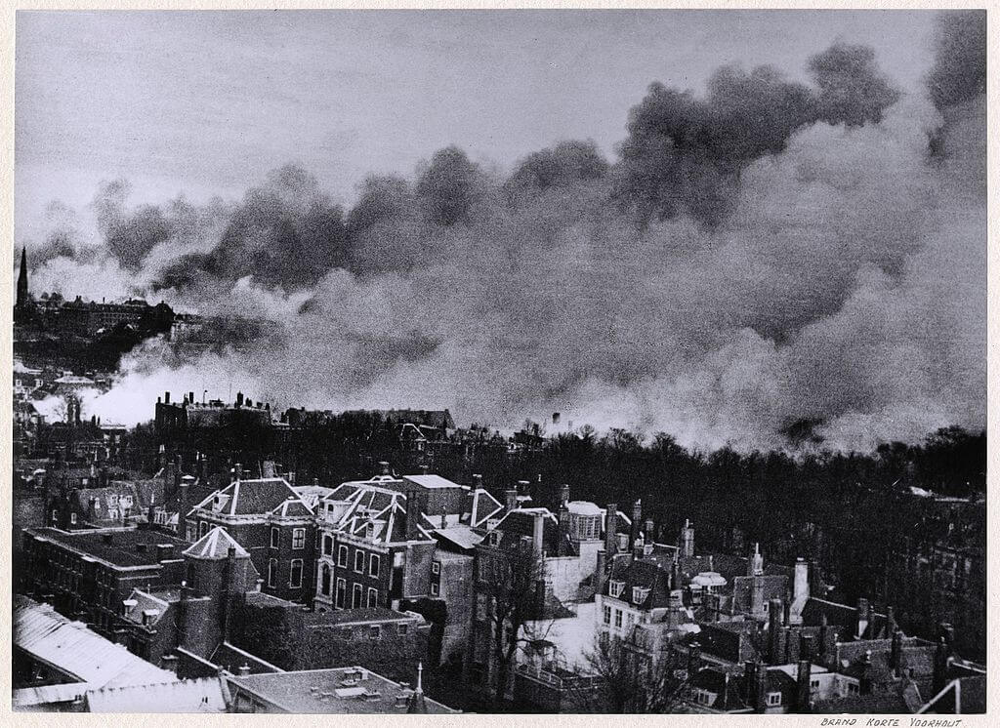

### 2 Front Białoruski

Miastko.

### 1 Front Białoruski

Świdwin.

### Schwedt nad Odrą

31 stycznia do Schwedt nad Odrą przyjechał Otto Skorzeny, opanował sytuację i zorganizował 15 tys. wielonarodowy korpus broniący ważnego strategicznie obszaru przedmościa odrzańskiego. 28 lutego został wezwany z powrotem do Berlina.

Wobec fatalnej sytuacji zapadła decyzja o oddaniu przedmościa, wszystkie oddziały niemieckie wycofano za Odrę i wysadzono mosty. Schwedt/Oder ogłoszono twierdzą.

Miasto zdobyto 26 kwietnia, w 80% uległo zniszczeniu.

### Hitler

Wszyscy Niemcy wiedzieli, że Hitler przeżył zamach 20 lipca 1944, jeszcze tego samego dnia usłyszeli jego głos w radio, a kilka dni potem zobaczyli go w cotygodniowej kronice filmowej Die Deutsche Wochenschau. Ale ta kronika to był ostatni raz, kiedy zobaczyli go żywego. Później nie pokazywał się publicznie. Po przemówieniu po zamachu zapadła cisza. Pojawiły się plotki. Czy Hitler nadal żyje? W jakim jest stanie? Czy jest inwalidą? W państwie totalitarnym były to bardzo niebezpieczne spekulacje, ale gestapo odnotowało takie nastroje. Goebbels usilnie namawiał Hitlera, by ten pokazał się publicznie, najlepiej podczas wizyty na froncie.

Postępy sowieckie podczas operacji wiślańsko-odrzańskie znacznie to ułatwiły. Wystarczyło pojechać nad od zawsze niemiecką rzekę Odrę. W końcu Hitler się zgodził. Ustalono datę wizyty 3 marca i jej cel, czyli sztaby nowopowołanych dywizji Wehrmachtu: Berlin i Döberitz. O wyprawie wiedzieli tylko zaufani ludzie: Goebbels, Bormann, adiutant Wehrmachtu Burgdorf oraz Fiegelein oficer łącznikowy SS, które było odpowiedzialne za bezpieczeństwo podczas wizyty. Dzień wcześniej bezpieczeństwo na całej trasie sprawdził major Willy Johannmeyer z adiutantury wojskowej Hitlera.

Rano z Kancelarii Rzeszy wyjechało sześć samochodów w tym jeden zapasowy. Wśród jadących byli redaktor Heinz Lorenz oraz filmowiec porucznik Luftwaffe Walter Frentz, dawny operator Leni Riefenstahl.

Pierwszym celem, do którego dotarli, był ulokowany w dworku w Bad Freienwalde sztab 9 Armii generała Theodora Bussego, późniejszego obrońcy Berlina. Było to 10 km od Odry. Udali się do głównego pomieszczenia sztabowego, gdzie przy stole z mapami generał Busse zapoznał Hitlera z obecną sytuacją na froncie. Hitler miał wtedy powiedzieć:
>Każdy dzień i każda godzina są cenne dla ukończenia przerażających broni, które przechylą szalę na naszą korzyść.

Potem pojechali na południe, do pałacu Harnekop k. Wriesen gdzie znajdował się sztab dywizji Döberitz dowodzonej przez hitlerowskiego zbrodniarza, generała Rudolfa Huebnera. Odbyła się tam podobna scena i tego samego dnia wszyscy wrócili do Berlina. Był to ostatni raz, kiedy Hitler opuścił Berlin. Był już w fatalnym stanie, blady, bez energii i milczący całą drogę. Drżącą lewą rękę ukrywał w kieszeni.

Następnego dnia Hitler zakazał pokazywania materiałów z tej wizyty i w ogóle informowania o niej. Potem jednak udało się go przekonać do zmiany zdania, bo do niektórych kopii przedostatniego wydania Die Deutsche Wochenschau z 16 marca (1945/9) zdołano doczepić kilka metrów taśmy z 40 sekundami relacji z wizyty Hitlera w sztabie 9 Armii generała Bussego.

Po wojnie odkryto tajemniczy fragment z niezidentyfikowanego miejsca - Hitler w otoczeniu oficerów idzie po dość dużym drewnianym moście kolejowo-drogowym, a mijający go ludzie wyraźnie są zaskoczeni. O tym spontanicznym epizodzie z ostatniej wyprawy Hitlera nic nie wiadomo, nie wspomina go żaden uczestnik wyprawy.

### Masakra w Pawłokomie

W Pawłokomie dochodzi do masakry, która jest zwieńczeniem długiej polsko-ukraińskiej wendetty. Pawłokoma była dużą ukraińsko-polską wsią o przewadze ludności ukraińskiej. Znajduje się 20 km na zachód od Przemyśla.

Ukraińcy sprzyjali Niemcom i pierwsze niesnaski narodowe sięgają września 1939. Podczas drugiej okupacji niemieckiej doszło do pierwszych morderstw. We wsi działali aktywiści OUN. Wydarzeniem, które ostatecznie przyczyniło się do zbrodni, było porwanie 7 Polaków przez bliżej nieokreślony oddział, który pojawił się we wsi 21 stycznia. Do dziś nie wiadomo kto to był, ale liczebność i jednolite umundurowanie wskazują, że raczej nie mogło to być UPA. Co się z tymi ludźmi stało też nie wiadomi, ciał nigdy nie znaleziono. Odbyła się narada, na której atmosferę podgrzewali uciekinierzy z Wołynia. Od tej chwili w zasadzie nic nie jest jasne. Ani plan akcji, ani tym bardziej przebieg. Czy zdecydowano o wymordowaniu wszystkich mężczyzn, czy tylko żołnierzy UPA. Przedtem 1 i 2 marca odbyły się dwa napady próbne, podczas których zabito kilkanaście osób.

Dziś rano 250-osobowy oddział lokalnej samoobrony i oddział AK pod dowództwem Józefa Bissa wtargnął do wsi i zaczęło się mordowanie. Zabijano wszystkich jak popadnie na miejscu lub pędzono co cerkwi. Pytano się czasem o porwanych Polaków. Schwytanych do niewoli spędzono na cmentarz i tam rozstrzelano.

Już po zbrodni zaalarmowane władze sowieckie aresztowały 282 Polaków, 82 z nich zostało uwiezionych na 4 miesiące. Ponieważ nie przeprowadzono ekshumacji, a wkrótce potem przesiedlono większość mieszkańców, nawet przybliżona liczba ofiar nie jest znana. Józef Biss zeznał, że nie zamordowano więcej niż 80 osób. Historycy szacują liczbę ofiar na od 150 do 388.

Siedem lat później, całkiem przypadkiem ciąg dalszy tej sprawy miał miejsce we Wrocławiu. 13 maja 1952 w związku ze sprawą zamordowania czerwonoarmisty, WUBP zatrzymał Czesława i Mariana Sputów. W listopadzie pojawia się wzmianka o ich udziale w zbrodni w Pawłokomach. Potem aresztowano kolejnych sprawców. Ostatecznie dwóch z nich dostało wyroki 15 lat, dwóch innych na 8 i 4 lata. Józef Bliss został uniewinniony. W 1956 wszystkie wyroki zostały uchylone.

### Finlandia

Finlandia wypowiedziała wojnę III Rzeszy.

### Manila, Filipiny

Zakończyła się trwająca cały miesiąc bitwa o Manilę, stolicę Filipin. Z powodu zaciekłego oporu Japończyków dowódcy amerykańscy nie chcą powiększać własnych strat, zadecydowali o intensywnym użyciu artylerii. Zginęło 16 tys. Japończyków i ponad 100 tys. Filipińczyków.

<SeeAlso txt="Wojna na Pacyfiku 1945" url="/festung-breslau/article/pacyfik-1945" />

- [Mark Felton Productions "Asian Stalingrad - The Battle of Manila 1945" [YT 22:14]](https://www.youtube.com/watch?v=ZBZjTbotmg0)

### Bombardowanie Hagi

50 brytyjskich bombowców z powodu błędnych koordynat i złych warunków atmosferycznych, powodujących bombardowanie według przyrządów, zrzuciło bomby na Bezuidenhout, gęsto zaludnione przedmieście Hagi. Zginęło 500 cywilów. Celem bombowców były lasy w pobliżu Hagi, w których stacjonowały ruchome wyrzutnie V-2.

*Bezuidenhout po bombardowaniu, widok z wieży kościoła pw św Jakuba większego na Parkstraat 
By Unknown photographer (Gemeente Den Haag, Dienst Stadsontwikkeling en Volkshuisvesting) - [The Hague Municipal Archives](https://www.wikidata.org/wiki/Q3229492), Domena publiczna, [Link](https://commons.wikimedia.org/w/index.php?curid=57067716)*

### Torger Dahl

We Włoszech podczas bitwy zginął żołnierz 10 Dywizji Górskiej, Torger Dahl Tokle. Był to amerykański skoczek narciarski norweskiego pochodzenia, mistrz USA (88 m).

### Wrocław

Ksiądz Peikert o codziennej śmierci, rozpaczy i zniszczeniach:
>Noc jest spokojna, wolna od nieprzyjacielskich samolotów, szaleje jednak zamieć. Rano o godz. 7 w pierwszą sobotę miesiąca, w dzień Serca Marii i modłów o dobrych kapłanów, znów frekwencja na mszy św. jest duża, ponad 350 komunii św. Rano przynoszą pięciu poległych; dwaj z nich to tylko masa mięsa nie do rozpoznania, tak że nie można było ustalić ich tożsamości i trzeba ich było pochować jako nieznanych żołnierzy. Wkrótce potem przynoszą znów ośmiu dopiero co poległych, którzy również znaleźli wieczny spoczynek we wspólnym grobie. Od godziny 8 nieprzerwany silny ogień artyleryjski i taki huk, że domy drżą w posadach jak przy szturmowym przygotowaniu artyleryjskim.
>Nadal z południa do północnej części miasta ciągnie pochód uciekinierów, procesja nędzy i rozpaczy. Wśród ludzi panuje nastrój najwyższego podniecenia. Całkiem otwarcie dają wyraz swoim poglądom w dosadnych słowach: Cóż za szaleństwo niszczyć tak kwitnące miasto, jak Wrocław. Istny szał niszczenia owładnął sferami rządzącymi naszego narodu. Ponieważ zawsze się utożsamiały z krajem, wierzą, że Niemcy w ogóle nie mają racji bytu, jeśli nie będą narodowosocjalistyczne. Ponieważ zaś sami stoją w obliczu zagłady, ciągną z sobą cały naród na dno zguby.
>[...] nasza artyleria, stojąca tu w najbliższym sąsiedztwie kościoła parafialnego Św. Maurycego, przed gmachem nowej rejencji na Lessingplatz, przy Domu Św. Wincentego, na cmentarzu polowym, na Holteihöhe i na Liebichshöhe, chyba nie wystrzeliwuje swoich pocisków poza rosyjskie linie, lecz właśnie na te linie, one zaś biegną przez ciągi naszych domów. Częstokroć działa strzelają zbyt krótko, tak że nasza własna artyleria niszczy domy przed tymi liniami.

Hartung przeżył kryzys i zaczyna odzyskiwać zdrowie. Znajduje się w Lazaret IVa zlokalizowanym w klasztorze ojców bonifratrów. Lazarety IV i IVb znajdują się na ulicy Ołbińskiej, pierwszy w schronie naziemnym projektu Richarda Konwiarza, drugi w podziemiach szpitala po drugiej stronie ulicy. 1 marca pisze:
>Przez kilka dni spałem niemal bez przerwy i dziś po raz pierwszy czuję się nieco lepiej. [...] Klasztorne piwnice o prastarych, solidnych sklepieniach są przepełnione chorymi i rannymi. Na parterze zajętych jest tylko kilka sal, natomiast wyższe kondygnacje zostały całkowicie ewakuowane. Leżymy w trzypiętrowych łóżkach. Wykorzystałem to, budując sobie mały ołtarzyk: do materaca nade mną przyczepiłem zdjęcia moich najbliższych. W ten sposób, gdy leżę na plecach i patrzę na górę, mam ich zawsze przed oczami.

Natomiast w sobotę 3 marca i u niego pojawia się wiosna:
>Siostra Anna, która chwali mnie jako "śpiocha-artystę", opowiada, że na zewnątrz nastała przedwczesna kwietniowa pogoda. Czasami sypie śnieg, to znów świeci słońce. Z piwnicy nie jesteśmy w stanie tego oglądać, bo okna są solidnie zabarykadowane deskami i workami z piaskiem.

### Walka

Dziś zaczyna się ofensywa sił sowieckich na południową część miasta. Nikt nie będzie szczęśliwy z jej przebiegu i rezultatów. Oto jak wyglądała walka we Wrocławiu. Wydana, prawdopodobnie na początku marca, ulotka wydana przez Zarząd Polityczny 6 Armii ilustruje zaciekłość walk i przyjęta przez sowietów taktykę profilaktycznego niszczenia wszelkich obiektów bez upewniania się, czy znajduje się tam nieprzyjaciel:
>Walki uliczne są szczególnie złożonym rodzajem działań bojowych, wymagającym od każdego żołnierza najwyższej odwagi, inicjatywy i energii, W czasie walk ulicznych żołnierz walczy w składzie grupy szturmowej. Zadaniem grup szturmowych w czasie walk w mieście jest zdobywanie domów, gmachów i innych obiektów przekształconych przez przeciwnika w punkty i węzły oporu. Dlatego też uderzenia grup szturmowych muszą trwać krótko, zaś działania być szybkie i zuchwałe. Dwoma najważniejszymi czynnikami pomyślnego manewru grupy szturmowej jest szybkość i zaskoczenie. Doświadczenie uczy: zbliżaj się do atakowanego obiektu rowem, idź naprzód czołgając się, wykorzystaj leje i gruzy, ryj nocą przed uderzeniem transzeje, za dnia maskuj je, wyostrz jak brzytwę bagnet i łopatkę saperką, koncentruj się do atak skrycie, bez hałasu, pistolet maszynowy zawieś na szyi, do rąk weź i za pas granaty. Wtedy czas i zaskoczenie działać będzie na twoją korzyść. Do atakowanego obiektu wdzieraj się we dwójkę - ty i granat, granat przodem - ty za nim. Przez dom przejdź również z granatem - granat przodem, a ty jego śladem. Po wtargnięciu do umocnionego budynku czeka cię wiele niespodzianek. Tu do głosu dochodzi niezłomne prawo: poruszaj się jak tylko możesz najszybciej! Na każdym kroku grozi niebezpieczeństwo. Nie zaszkodzi w każdy kąt rzucić granat... i naprzód! Seria z pistoletu maszynowego w resztki stropu. I znowu naprzód! Drugi pokój - granat! Zakręt - jeszcze raz granat! Ostrzelaj kąt z pistoletu! Nie guzdrz się! Kiedy już jesteś w środku, przeciwnik nie może przejść do kontrataku. Nic się nie bój. Przejąłeś już inicjatywę, jest ona w twoich rękach. Z jeszcze większą zaciekłością puść w ruch granat, pistolet maszynowy, łopatkę. Pamiętaj nawet jeden żołnierz w zdobytym domu - to już cała załoga. Nic nie przegap!

[Walka w wrocławskiej fabryce. Sowiecki korespondent porucznik Wassilij Malinin zapisał w swoim wojennym dzienniku:](https://www.facebook.com/EchazFestungBreslau/photos/a.506610902732958/3452144024846283/)

### Komendant

Generał Niehoff u generała Friedricha Schulza, głównodowodzącego 17. Armią w jego kwaterze w Wałbrzychu. Schulz przekazuje informacje od Schörnera:
>Na południu Wrocławia Rosjanie z silnymi siłami wdarli się już w głąb miasta. O ile sytuacja nie ulegnie zasadniczej zmianie od razu, można spodziewać się, że twierdza upadnie za kilka dni, a może nawet godzin. Ale nie można z niej rezygnować z następujących powodów: jest to skrzyżowanie wielu dróg dojazdowych i linii kolejowych prowadzących ze wschodu na zachód. Wiele kieruje się w stronę zagrożonego Berlina. Nie bez znaczenia dla zaopatrzenia Rosjan jest też Odra.
>W związku z tym konieczne jest, abyście utrudniali wrogowi operacje przeciwko Berlinowi lub w delikatny sposób mu przeszkadzali, poprzez wytrwałą obronę węzła wrocławskiego, a jednocześnie spajać silne siły wroga. To jest w pewnym sensie pasywne znaczenie Twojego zadania.
>Znaczenie aktywne wynika z następującego rozważania: Schörner zamierza uformować w rejonie Strzelin -Ziębice silną grupę uderzeniową, składającą się z oddziałów piechoty i czołgów, i zaatakować z nimi w kierunku Wrocławia, aby następnie wzmocnić je wojskami twierdzy i wkroczyć na głęboką flankę i tył głównych sił rosyjskich prących na Berlin.
>Pierwsze spotkanie tej nowej grupy atakującej, która ma zostać utworzona, już trwa.
>Niehoff, Schörner również przekazuje Wam przeze mnie następującą wiadomość: jeśli uda Wam się utrzymać Breslau przez trzy do czterech dni, przybędzie drogą lądową i uściśnie Wam dłoń.
>Między nami: to prawda, że podjęto pierwsze próby powołania takiej grupy przełamania. Ale 3-4 dni – muszę Cię uchronić przed iluzją. Jeśli potrafisz dokonać cudu i, powiedzmy, wytrzymać 14 dni, to to uderzenie może dojść do skutku.
>Byłbym szczęśliwy, Niehoff, gdybyś dziś wieczorem przed swoim nocnym lotem do Wrocławia zjadł ze mną mały posiłek kata.

za [Trzeci mianowany komendant Breslau u Generała Friedricha Schulza w Waldenburgu. Autor: Niehoff w Lynder](https://www.facebook.com/EchazFestungBreslau/photos/a.506610902732958/3455639607830058/)

Niehoff z Wałbrzycha jedzie do Świednicy autem, stamtąd do Wrocławia ma go zabrać samolot:
>Byliśmy już w strefie walk. Zaraz przed Świdnica zwłoki i przewrócone pojazdy wzdłuż ulicy. Byłem taki samotny. Przyjechało ze mną dwóch mężczyzn. Przyjechali dobrowolnie. Mój przyboczny Andorf i mój kierowca Ostlender. Mogli zostać. Zaproponowałem im to. Chcieli jednak pojechać ze mną do Wrocławia.
>Samochód skręca w prawo w polną drogę. Następnie zatrzymujemy się na awaryjnym lotnisku. To nic innego jak prymitywnie wyrównany kawałek ziemi, na skraju którego stoi stary barak. Wszędzie jest ciemno. Nie ma nikogo. Czekamy. Samolot jest opóźniony. Powinien zostać wysłany z Lubina. Wreszcie słychać szum z oddali. Pojawia się czarny kolos, ląduje. Pilot, Leutnant, melduje się. Na jego twarzy pojawiają się oznaki wewnętrznego konfliktu i depresji. Opisuje mi sytuację powietrzną nad Wrocławiem.
>Pilot nazywa ten lot „nieciekawą sprawą” – „misją samobójczą”.
>Wydaje mi się, że jego maszyna, JU, jest zbyt duża, zbyt nieporęczna, zbyt wolna, aby przewieźć trzy osoby doWrocławia. Pytam pilota, gdzie jest dla mnie spadochron. „Mam jeden dla swojego radiooperatora i dla siebie” – odpowiada. Potem dodaje, śmiejąc się sarkastycznie: „Ale mogę pocieszyć pana generała, jeśli moje pudełko zostanie oświetlone baterią reflektorów, nie wyjdę i nie wyskoczę z nim.”
>Ale nie chcę przeżyć tej wiecznej minuty między zestrzeleniem maszyny, a jej rozbiciem się. Patrzę na mój zaufany stary pistolet Mauser w kabinie, ładuję go i kładę na kolanach…
>Maszyna już się toczy, podrywa się i kieruje się na północ do oddalonego o zaledwie 46 kilometrów Breslau, mojego fatalnego celu – prawdopodobnie mojego grobu.
>I wtedy już wyraźnie widzę miasto przede mną z góry. Tam, gdzie nie było ciemnej nocy, teraz jest ogromny krąg płomieni. Piekło, jasnego, płonącego ognia. I w tym samym czasie błysk pocisku. Następnie pojawiają się palce reflektorów, które się mnożą i chcą sięgnąć po maszynę w coraz większej liczbie, coraz szybciej. O ile nie jestem oślepiony, rozpoznaje blade twarze moich ludzi, którzy w milczeniu spoglądają na podłogę. Wokół nas przelatuje huragan pocisków, zagłuszony przez grzmot silników samolotów.
>Muszę się nagle uśmiechnąć. Bo wydaje mi się, że pocisk smugowy karabinu przeciwlotniczego małego kalibru zmierza w moim kierunku, niczym biała myszka, skupiając się na moim sercu. (Nie mogłem się pozbyć tego wrażenia, nawet kilka lat później w niewoli.)
>Nagle pilot staje się niespokojny. Woła coś do mnie. Ledwo go rozumiem. W końcu go słyszę wyraźnie.
>„Musimy wracać, moje silniki są trafione!”
>Noc obraz powoli przesuwa się w prawo, do tyłu. Morze płomieni znika. Samolot ląduje, toczy się. Wychodzimy z maszyny, przed nami stary barak. Wróciliśmy tam, gdzie zaczęliśmy. Pilot bez słowa pokazuje liczne trafienia w kadłub i silnik.
>Pilot powoli się rozluźnia. Dla niego zadanie jest skończone. Nie dla mnie.

za [Pierwsza (nieudana) próba wlotu do Festung Breslau Generalleutnanta Hermanna Niehoffa późnym wieczorem 3 marca 1945 roku. Autor: Niehoff w Lynder](https://www.facebook.com/EchazFestungBreslau/posts/3461173587276660)