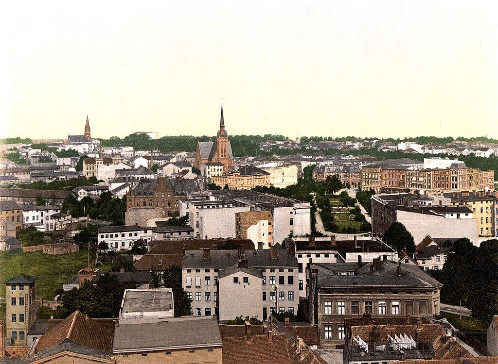

### KL Ohrdruf

Był to niewielki obóz koncentracyjny na południe od Gotha (Turyngia) założony w listopadzie 1944, podporządkowany KL Buchenwald. Początkowo było tam ok. 10 tys. więźniów, później do marca 1945 ich liczba wzrosła do 20 tys., głównie Rosjanie.

Niemiecki historyk Rainer Karlsch w 2005 opublikował książkę "Hitlers Bombe", w której przedstawia tezę, jakoby 4 marca 1945 na poligonie przy obozie koncentracyjnym miała miejsce próba hitlerowskiej bomby atomowej powstałej w ramach programu atomowego pod zarządem Kurta Diebnera. Są zeznania świadków relacjonujących wybuch z wielkim, oślepiającym błyskiem. Przeprowadzone rok po publikacji książki badania gruntu nie wykazały żadnego promieniowania wykraczającego poza normę. Mówi się też o bombie hybrydowej, "brudnej", lub paliwowej.

Ale nawet i na to brak jest dowodów. Skalę i postępy niemieckiego programu atomowego znamy z danych Operacji Alsos. Wykluczają one skonstruowanie bomby atomowej. Niemcom brakowało wszystkiego, a do tego utknęli w ślepej uliczce zależności od ciężkiej wody, kiedy właściwym rozwiązaniem było spowalnianie reakcji prętami grafitowymi.

<SeeAlso txt="Wunderwaffe" url="/festung-breslau/article/wunderwaffe" />

Skierowanie hitlerowskiego programu atomowego na odmęty ciężkiej wody to zasługa sabotażu dokonanego w 1941 przez niemieckiego antyfaszystę inżyniera Erwina Schmidta w Raciborzu. Zakłady Siemens-Planiawerke AG fur Kohlefabrikate (po wojnie Zakład Elektrod Węglowych w Raciborzu) otrzymały zamówienie na pręty grafitowe i Schmidt od razu zorientował się, że taka specyfikacja musi dotyczyć jakiegoś programu wojskowego, więc nawet nie wiedząc o co dokładnie chodzi zadbał, żeby produkt nie spełniał wygórowanych norm czystości. Wysłał bubel. To spowodowało, że niemieccy doświadczalnicy uznali ciężką wodę za lepszy wybór. Sprawa sabotażu Schmidta wyszła na jaw dopiero po wojnie.

- NaszRacibórz ["Cudowna broń Adolfa Hitlera"](https://www.naszraciborz.pl/site/art/0/0/3447.html)
- Histmag.org ["Lutowy numer czasopisma „Odkrywca”"](https://histmag.org/Lutowy-numer-czasopisma-Odkrywca-14728) 2017/02
- ["New light on Hitler's bomb"](https://physicsworld.com/a/new-light-on-hitlers-bomb/)
- ["Hitler killed hundreds with crude nuclear bomb: author"](https://www.smh.com.au/world/hitler-killed-hundreds-with-crude-nuclear-bomb-author-20050315-gdkxjq.html)

### 1 Front Białoruski

1 Front Białoruski: Koszalin, początek bitwy o Kołobrzeg.

### Kołobrzeg

Bitwa o Kołobrzeg będzie długa i zacięta. To jest bowiem pozycja o ogromnym znaczeniu i symbolicznym i rzeczywistym. Być może była to jedyna Twierdza hitlerowska, która istotnie miała sens. Trzymanie Kolberg Festung było gwarancją panowania nad szlakiem ewakuacyjnym z Prus Wschodnich.

Kołobrzeg znajduje się dokładnie na linii demarkacyjnej obu Frontów. Ale o miasto walczył 1 Front Białoruski, początkowo 45 Brygada Pancerna Gwardii i 272 Dywizja Strzelecka. Od 7 marca właściwie wyłącznie 1 Armia WP.

- [Kamil Anduła "Działania bojowe jednostek Armii Czerwonej w bitwie o Kołobrzeg (4–18 marca 1945 r.)"](https://drive.google.com/file/d/15c3OSYlfRQBI6susV4E1KaO94ID8_D5V/view)
- [SP2SV66 - Sensacje XX wieku "TWIERDZA KOŁOBRZEG" [24:54]](https://www.youtube.com/watch?v=kq0skY_742c)

*Kołobrzeg 1895-1905; widok ogólny z wieży konkatedry na północny zachód 
By Source, [Fair use](https://en.wikipedia.org/wiki/File:Niefoffhermann.jpg), [Link](https://en.wikipedia.org/w/index.php?curid=27591621)*

### UPA

W walkach z NKWD w przysiółkach Werchraty Mrzygłody i Gruszka ginie ponad 50 żołnierzy UPA. Jest to w nomenklaturze OUN tzw. Zakerzoński Kraj, czyli tereny na zachód od linii Curzona, do których OUN rości sobie prawo. Obecnie w Werchracie znajduje się pomnik poległych, który jest przedmiotem kontrowersji.

### Belgrad

W Belgradzie powstaje klub piłkarski Crvena Zvezda Belgrad, w drugiej połowie lat 80. jeden z najlepszych klubów piłkarskich Europy a obecnie jest najpopularniejszym klubem Serbii.

<SeeAlso txt="Jugosławia" url="/festung-breslau/article/jugoslawia" />

### Wrocław

Podczas ocieplenia, w pierwszych dniach marca śnieg zaczął topnieć. Ciągle jednak w powietrzu czuć było chłód. Jedynym źródłem ciepła były pożary na nawietrznej. Nawet w tym straszliwym położeniu, gdy wojna dotknęła już wszystkich ulic Wrocławia - jak wkrótce zobaczymy - pogoda jest, tam gdzie można było wyjrzeć na ulicę za dnia pilnie obserwowana, tak jakby chociaż ta zmiana miała przynieść coś dobrego. Jest w tym także coś uniwersalnego, bo zmęczeni zimą, martwotą i wcześnie zapadającym zmrokiem wypatrujemy ponownego przebudzenia się życia, ożywienia wegetacji, czasu kiedy Demeter przywita Persefonę, a przyroda się zazieleni. Wbrew nowocześnie i masowo zadawanej śmierci, wbrew terrorowi wojny i hitleryzmu, z głębi piwnic, spośród gruzów i przebiegając przez ostrzeliwane ulice, wrocławianie wypatrywali rychłego nadejścia wiosny. I naturalnie już wkrótce ta wiosna się pojawi, śnieg stopnieje na stałe, ale to nie da to nikomu więcej szans na przeżycie, wiosna tego roku będzie nie mniej okrutna, niż koniec zimy.

W relacji księdza Peikerta informacje o pogodzie mieszają się z wiadomościami wojennymi i opisem tragedii ludności cywilnej:
>Spokojna noc. Pada śnieg. W nocy od południa stłumione odgłosy walki toczonej o bloki mieszkalne przy użyciu pięści pancernych, ręcznych granatów i karabinów maszynowych. Do tego dochodzi huk detonacji od wysadzanych budynków. [...] Od wczesnego rana bardzo żywa działalność lotnictwa nieprzyjacielskiego, wzmagająca się w godzinach południowych. Przeważnie obstrzał z broni pokładowej. Wiadomości na temat zniszczeń na południu miasta wywołują grozę. Południową część miasta zamieszkiwały lepiej usytuowane warstwy ludności. Wraz z zagładą tej części miasta ubożeją niezliczone rodziny. Przeważnie tracą one wszystko, gdyż muszą uciekać w krótkim czasie i mogą zabrać z sobą tylko to, co najkonieczniejsze. Pewien st. lekarz sztabowy z małżonką odwiedził dziś probostwo. Opowiedział, że jego żona ma tylko swój kostium sportowy, on zaś musiał sobie dziś kupić parę butów, a ubranie, które ma na sobie, jest jedyną rzeczą, którą uratował. Poza tym wszystko padło pastwą płomieni. Szał niszczenia. A prości Niemcy w tym pomagają, bo tak chce garstka ludzi stojąca na czele tego kraju. [...] Wciąż jeszcze przeciągają kolumny uchodźców z południa na północ. Rosną coraz bardziej zniszczenia w centrum miasta wskutek nalotów i obstrzału nieprzyjacielskiej artylerii. Jakże żałośnie wygląda miasto niegdyś piękne i dumne! Pod wieczór gwałtowna śnieżyca. Ustaje działalność lotnictwa. Gauleiter Hanke wygłosił przemówienie radiowe we Wrocławiu, retransmitowane na fali ogólnoniemieckiej. Nie odbiega ono w swym stylu od przemówienia ministra Rzeszy Goebbelsa. Nieuleczalnie zaślepieni. Opętani do reszty szałem niszczenia. Obydwaj informują o dumnej, heroicznej postawie narodu niemieckiego. Gdyby się tak odbyło tajne, nieskrępowane referendum, to Hanke i Goebbels, i wszyscy inni dowiedzieliby się, co naród niemiecki myśli o takiej zbrodniczej polityce swoich wodzów. Naród niemiecki jest jak baranek prowadzony przez swoich wodzów do rzeźni, bo tysiąc ludzi zniewala go niesłychanymi i najbrutalniejszymi środkami przemocy. Oni to czynią naród niemiecki narodem łachmaniarzy i żebraków całego świata. Komendant twierdzy ogłasza dziś w gazecie zarządzenie o zwalczaniu siewców pogłosek. Gdyby zarządzenie pochodziło od gauleitera Hankego, zakończenie brzmiałoby zawsze: zostanie rozstrzelany. Komendant twierdzy jest bardziej ludzki - mówi w zakończeniu: wykroczenia będą karane

Interesujące jest, dlaczego tłumacz zabrał się za tłumaczenie słowa panzerfaust, jest to praktyka raczej niespotykana w polskiej nomenklaturze militarnej, może zrobił to z rozpędu. Warto też zwrócić uwagę, na ostatnie zdanie. Nikt jeszcze we Wrocławiu nie wie o zmianie na stanowisku komendanta Twierdzy. Już wkrótce do tej pochwały pod adresem von Ahlfena los dopisze sardoniczny kontekst.

Tekst zarządzenia:
>Komendant twierdzy Wrocław Stan. dow. twierdzy dnia 3 III 1945 
>Zarządzenie przeciwko panikarzom 
>Walkę prowadzi się zarówno za pomocą broni, jak i mocnych serc. Wroga agitacja i głupi panikarze pragną zmniejszyć siłę naszych serc. Wobec tego rozkazuję: 
> 
>1. Kto rozgłasza w twierdzy Wrocław fakty o własnych lub nieprzyjacielskich akcjach wojskowych, które nie pochodzą z komunikatu wojskowego, z komunikatu radia Rzeszy, prasy i rozkazów dziennych komendanta twierdzy, albo rozgłasza inne wieści zostanie ukarany. 
>2. Panikarzy należy aresztować, jeśli chodzi o członków Wehrmachtu, natychmiast doprowadzić przez dowódcę najbliższej jednostki do ich dowództwa twierdzy, albo policji bezpieczeństwa Łąkowa 8-10. 
>3. Komendant twierdzy von Ahlfen generał-major

Owo wzmiankowane przez Peikerta "*zarządzenie o zwalczaniu siewców pogłosek*" opublikowane 4 marca najprawdopodobniej spowodowane jest tajemniczym wydarzeniem sprzed dwóch dni, kiedy to fałszywy komunikat w radio zachęcał cywilów do ucieczki na południe, mówiąc że droga jest otwarta przez wojska niemieckie.

### Twierdza

Kto tylko mógł, ulokował się na w miarę bezpiecznym poziomie piwnic, ale ciągle trwa ewakuacja z dzielnic południowych znajdujących się w bezpośredniej strefie walk. Przeciąga się w nieskończoność z kilku powodów, jednym z nich jest konieczność przeskakiwania z jednego w miarę bezpiecznego miejsca w drugie, taka podróż pod ogniem wszechobecnych samolotów sowieckich potrafi trwać dzień albo i dłużej, o innej jeszcze przyczynie opóźnienia pisze ksiądz Buchholz:
>Marzec. W pierwszych dniach marca do północnej części miasta przybywali mieszkańcy z południa, wśród nich wielu takich, którzy pierwotnie tam poszukiwali schronienia, teraz jednak sytuacja w tych dzielnicach była nie do zniesienia. Ostrzał domów z broni ciężkiej (pociski moździerzy i bomby) z małej odległości, walki uliczne, wysadzanie w powietrze i podpalanie wielu domów, a przede wszystkim przymus ewakuacji stosowany przez własne wojsko doprowadziły do wędrówek, które objęły wielu ludzi mających za sobą już niejedną przeprowadzkę lub bombardowanie. Ze swojego majątku uratowali teraz bardzo niewiele, przeważnie tylko to, co mieli na sobie lub w garści. Często stracili już pod bombami swoich bliskich, sami przeżywając wiele niebezpieczeństw. Niestety wkrótce po otrzymaniu nowego schronienia, wskazywanego najczęściej przez grupy obwodowe musieli przeżywać nowe niebezpieczeństwa i ofiary. Zamiar wielu mieszkańców, by kryjąc się w piwnicach doczekać Rosjan i w ten sposób znaleźć się poza linią frontu, najczęściej nie mógł się spełnić. Nasze wojska z reguły uważały takie zachowania za podejrzane, choć nie było ku temu realnych powodów i uciekały się do brutalnej przemocy, chcąc osiągnąć swoje cele.

W podobnym tonie utrzymany jest dalszy ciąg relacji jednej z urzędniczek przytoczonej przez Horniga:
>Na Traugutta prawie każdy dom był zajęty przez wojsko. Dziewczyny przemykały się jak myszki z bunkra do bunkra. Morale nieco się obniżyło. Wola walki słabła. Wędrówka do kancelarii przypominała drogę przez mękę. To było okropne. Na Krakowskiej walczyli Rosjanie. Domy były spalone, wszędzie spadały bomby i granaty. Nagle musieliśmy uciekać z Alexandestraße. O godzinie 1.00 w nocy wylądowaliśmy po męczącej drodze, z obładowanymi ręcznymi wózkami, wózkami dziecięcymi, rowerami, ociekający potem, niewyspani na Dąbiu. Szliśmy naszą ulicą pod gwałtownym ostrzałem artyleryjskim. Noc była jasna jak dzień, niebo krwawo czerwone. Bez szwanku udało nam się dotrzeć na miejsce. Po raz kolejny urządziliśmy swoje nowe mieszkanie. Wyglądało na opuszczone w wielkim pośpiechu, a potem strasznie zdewastowane przez naszych lub innych żołnierzy. Codziennie musieliśmy, nawet kilka razy, zabijać okna papą, ponieważ każdy większy nalot bombowy wszystko zrywał. Trzeba było sprzątać odpadającą zaprawę murarską.

Jak ksiądz Peikert informuje w przypisie, tego dnia wg niepełnych danych po stronie niemieckiej zginęło 70 osób, w tym 51 żołnierzy. I był to jeden z łaskawszych pod tym względem dni. Wczoraj nastąpiło wznowienie ofensywy, tym razem w znacznie trudniejszych warunkach. Jak wspomina ppłk Iwan Diebrin
>Dopiero przeszły tędy nasze szturmowe iły. Ale pomoc z powietrza nie wystarczyła. Ogień prowadzi artyleria. Całą dobę pułk walczy o jedną ogromną kamienicę. [...] Lejtnant Tkaczenko nie stracił głowy. Stanął na czele resztek batalionu. Przez łączników ustalił, ile jest cekaemów i jak są rozmieszczone. Na wiadomość o śmierci dowódcy batalionu z pomocą przyszli szef sztabu pułku który "przeczesał" sztab i kwatermistrzostwo, wysyłając każdego zdolnego do walki żołnierza na pierwszą linię. Zebrało się tego około 50 ludzi: kucharzy, łączników, ordynansów. Oni oraz 37 ludzi, którzy zostali łącznie w poszczególnych kompaniach, stanowili siłę bojową batalionu. A jednak idziemy naprzód. Kamienicę zdobyto i utrzymano, a linia frontu przesunęła się o 50 m do przodu...

### Komendant

Z powodu sprzeczności w relacjach kilka rzeczy jest niejasnych. Nie wiadomo na przykład, kiedy dokładnie przyleciał do Wrocławia Niehoff. Na pewno nie miało to miejsca 4 marca, jak opisuje to Richard Hargreaves:
>Po zmroku 3 marca Hermann Niehoff przybył na lotnisko pod Świdnicą, stanowiące "niewiele więcej niż ledwo wyrównany teren ze stojącymi na jego skraju starymi barakami. Lot do twierdzy trwał krótko - Wrocław znajdował się tylko 45 kilometrów dalej na północny wschód, ale ponad połowa tej trasy przebiegała nad terenami zajętymi już przez wroga. Pilot ostrzegł generała, że lot może być "nerwowy". Niehoffowi Junkers wydawał się za duży, zbyt nieporęczny i za wolny do wykonania tego zadania. Poprosił o spadochron. "Jest tylko jeden dla mnie i mojego radiooperatora" - odparł pilot - "Ale jeśli moją skrzynię złapią reflektory, i tak nie będę się w stanie wydostać i polecę w dół w korkociągu". Generał zajął swoje miejsce z tyłu samolotu i położył sobie na kolanach swój niezawodny pistolet Mauser. Po chwili wnętrze maszyn skąpało się w świetle. Na zewnątrz był "wielki krąg płomieni, ogniste piekło". Działa przeciwlotnicze błyskały, a reflektory po omacku przeszukiwały niebo. Warkot trzech silników Junkersa zagłuszał dźwięk eksplodujących pocisków. Nagle pilot odwrócił się do Niehoffa. "Musimy wracać. Dostaliśmy w silniki". Samolot zawrócił do Świdnicy. Po raz kolejny wystartowali o trzeciej nad ranem. Niedaleko od Wrocławia ponownie musieli zawrócić: oblodzenie maszyny stanowiło zbyt duże zagrożenie. Było już dobrze po piątej, gdy Niehoff podjął kolejną próbę przedostania się do twierdzy. Tym razem lot przebiegał bez większych przeszkód, ale lądowanie niestety nie. Gdy Junkers toczył się już po pasie startowym lotniska gądowskiego, pociski karabinowe bębniły o kadłub maszyny. Niehoff, który był weteranem piechoty, wyskoczył z samolotu i rzucił się na ziemię. Wszędzie dookoła padały pociski z broni ręcznej i karabinów maszynowych. "Wspaniałe przyjęcie" - wymamrotał generał. Przeskakując od jednej kupki gruzów do drugiej, oficer sztabowy przeprowadził Niehoffa do bezpiecznego schronienia. "Poruszanie się pieszo nie jest wskazane, Herr General" - oznajmił oficer Niehoffowi, wskazując na stojący nieopodal motocykl z przyczepką. Dwaj mężczyźni przenieśli maszynę nad trupem konia, po czym pojechali na stanowisko dowodzenia, starannie omijając leje po wybuchach rozsiane po ulicach. "W tle było słychać było huk eksplodujących bomb i pocisków artyleryjskich. Przerwy między wybuchami wypełniał terkot karabinów maszynowych" - wspominał Niehoff.

Teoretycznie jest to możliwe, żeby w ciągu jednego dnia dostać się z Ostrawy do Świdnicy i już czwartego rano być we Wrocławiu, ale wszyscy inni jako czas przylotu podają przynajmniej jeden dzień później. Ale nie wyprzedzajmy faktów. Problemy z dotarciem na lotnisko, i to z kilku powodów są rzeczywiście możliwe, więc mogło to być dramatyczne, ale lotnisko na Gądowie Małym nie było wówczas pod ostrzałem broni maszynowej, było bombardowane artylerią, ale jest zupełnie niemożliwe, żeby lądujący samolot dziurawiły pociski karabinowe. I skąd miałyby się wziąć te "kupki gruzu" na nieutwardzonym pasie startowym? Wątpliwa jest również obecność oficera sztabowego czekającego na Niehoffa, skoro nikt w twierdzy jeszcze nie wiedział, że Schõrner mianował nowego komendanta. Ostrzegam przed takimi efektownymi lekturami. Książka jest interesująca, ale niestety widać pośpiech i założenie, że skoro ma być o wojnie, to powinno być dużo wybuchów.

### "woda, światło, prąd i gaz"

Inną niejasnością jest kwestia zaopatrywania Wrocławia w gaz. Jak pisałem, mimo ataków lotniczych, bombardowań artyleryjskich i oblężenia mieszkańcy byli zaopatrywani w media, z pewnością na początku marca dotyczy to elektryczności i wody, które pomijając lokalne awarie, były dostępne właściwie do końca istnienia twierdzy. Inaczej natomiast było z gazem. Hornig pisze:
>Dyrektorzy miejskiej gazowni, wodociągów i elektrowni robili wszystko, co w ich mocy, aby zapewnić dostawy dla ludności. Zanim Rosjanie zajęli ważne obszary wodonośne pod Świątnikami na południowym wschodzie miasta, udało się podłączyć tamtejsze studnie miejskie do wodociągów. Spadło wprawdzie ciśnienie, ale w rezultacie zaopatrzenie Wrocławia w wodę zostało utrzymane z niewielkimi lokalnymi awariami, aż do momentu przekazania miasta. Podczas naprawiania zniszczonych rur kanalizacyjnych zginęło kilku miejskich pracowników. Kiedy 26 lutego Rosjanie zajęli gazownię w Tarnogaju, tym samym zostały przerwane we Wrocławiu dostawy gazu. Zaopatrzenie w gaz z odległego Wałbrzycha wstrzymano już w połowie stycznia.

I zgadza się to co do dnia z informacją podaną przez Peikerta, który 7 marca pisze, że
>Gazu brak już od 10 dni, odkąd Tarnogaj wpadł w ręce Rosjan.

Ale przypis do tej informacji brzmi: "*Komunikat Radzieckiego Biura Informacyjnego z 28 lutego 1945 r. informował o zdobyciu przez oddziały radzieckie obiektów gazowni miejskiej na Tarnogaju. Nawet po całkowitym okrążeniu Wrocławia przez wojska 6 armii 1 Frontu Ukraińskiego do miasta dostarczano gaz podziemnym rurociągiem z Wałbrzycha znajdującego się do końca działań wojennych w rękach niemieckich. Dostawy te ustały jednak w połowie marca wskutek uszkodzenia gazociągu w rejonie działań wojennych*". Obraz przybliża tekst nieopublikowanej jeszcze niestety pracy Małgorzaty Preisner-Stokłosy, dostępny częściowo w postaci artykułu w książce "Festung Breslau 1945 - Historia i pamięć":
>Zniszczenie gazowni pod koniec lutego spowodowało przerwę w dostawie surowca. Przez dwa kolejne tygodnie Wrocław zaopatrywała gazownia w Wałbrzychu (Breslau-Waldenburg), dopóki na początku marca Rosjanie nie zniszczyli i tego połączenia.

Elektryczność była dostępna bez większych przerw aż do czasów po kapitulacji. Woda natomiast - jak pisze autorka:
>do czasu zajęcia twierdzy przez Rosjan.
