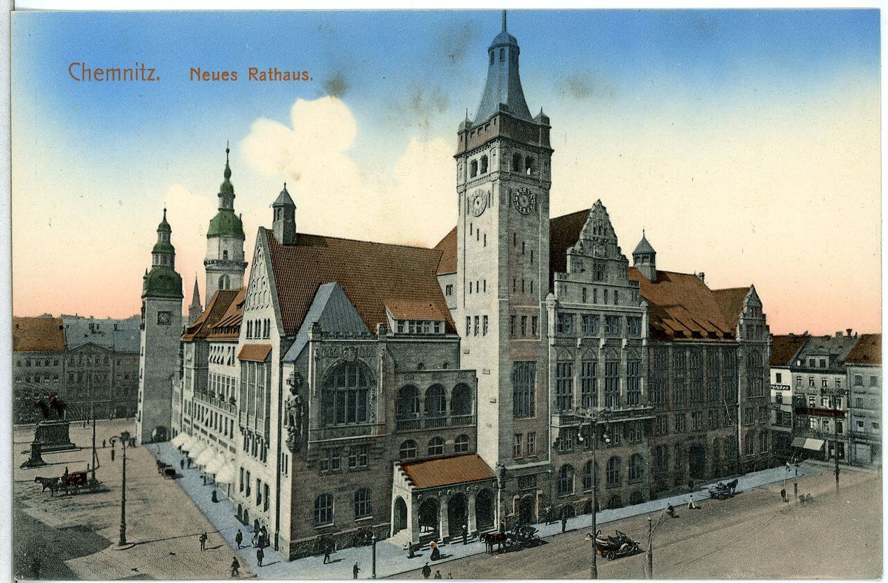

### Holandia

Od października 1944 do maja 1945 trwa tzw. Hongerwinter (pl. Głodowa Zima) klęska głodu w okupowanej Holandii spowodowana ciężką zimą i działaniami wojennymi. Około 20 tys. ludzi zmarło, wiele więcej cierpiało na różne spowodowane głodem choroby. W szczególny sposób katastrofa ta dotknęła dzieci, które przez resztę życia musiały się borykać ze skutkami jakie na ich zdrowiu pozostawiło chroniczne niedożywienie.

Dziś z niedożywienia zmarł Ludwig Landmann, w latach 1924-33 burmistrz Frankfurtu nad Menem. Z powodu pochodzenia żydowskiego musiał się ukrywać i przebywał w Holandii.

Książę Bernhard, holenderski monarcha i postać bardzo skomplikowana, bo i należał do SS-Reiterstandarten, jak i wspierał ruch oporu, robił co mógł by spowodować jakąś akcję ratunkową. Niemcy absolutnie nie byli zainteresowani udzielaniem pomocy okupowanym narodom. Natomiast priorytetem aliantów było złamanie potęgi Wehrmachtu i z powodów politycznych nie chcieli wchodzić z Niemcami w porozumienia.

Dopiero w połowie kwietnia udało się doprowadzić do przełamania impasu i alianci 29 kwietnia rozpoczęli Operację Manna, czyli dostarczanie drogą lotniczą żywności. Do tego czasu jedyną organizacją, na jaką mogli liczyć Holendrzy, był Szwedzki Czerwony Krzyż dostarczający im mąkę. Więcej o tym oczywiście 29 kwietnia.

### Albania

Komunistyczne władze Albanii dokonały dziś egzekucji Lazëra Shantoji. Był to ksiądz katolicki zaangażowany we współpracę z faszystami. Z powodu aktywności politycznej musiał opuścić Albanię, wrócił wraz z włoskim okupantem. Zakładał organizacje faszystowskie wśród emigracji albańskiej. Był bardzo aktywnym tłumaczem i publicystą.

<SeeAlso txt="Albania" url="/festung-breslau/article/albania" />

Kiedy Włosi opuścili Albanię, zerwał z polityką, a w 1944 zaczął się ukrywać, w styczniu 1945 został aresztowany. Był torturowany. Stanął przed sadem 30 stycznia, 2 lutego został skazany na śmierć. W 2016 papież Franciszek ogłosił beatyfikację 38 albańskich księży - męczenników, w tym gronie jest Lazër Shantoja.

### Chemnitz

Po zniszczeniu Drezna bombardowane jest Chemnitz, centrum przemysłowe Saksonii.

- 2 marca 594 ton bomb
- 3 marca 400 ton bomb
- 5 marca ponad 2,5 tys. ton bomb w kilku falach, ginie 2100 osób, 80% miasta jest zniszczone, zwiad powietrzny USAF określa miasto jako "next dead city", to dlatego następuje długa przerwa
- 11 kwietnia ostatni atak, wkrótce potem Amerykanie zajmują zachodnie przedmieścia Chemnitz, Niemcy proszą, żeby zajęli całe miasto, ale zgodnie z umową sojuszniczą Saksonia jest w sowieckiej strefie okupacyjnej, Armia Czerwona wchodzi tam 8 maja.

<BoxImageWrapper>

Chemnitz, Nowy Ratusz, pocztówka z 1913 
By [Brück &amp; Sohn Kunstverlag Meißen](https://commons.wikimedia.org/wiki/User:Br%C3%BCck_%26_Sohn_Kunstverlag_Mei%C3%9Fen) - Praca własna [CC0](http://creativecommons.org/publicdomain/zero/1.0/deed.en), [Link](https://commons.wikimedia.org/w/index.php?curid=52657197)
</BoxImageWrapper>

### Erna Hirsekorn

Z czterech i pół miliona przyznanych podczas WWII Żelaznych Krzyży drugiej klasy tylko 40 dostały kobiety. Przeważnie były to sanitariuszki, które z narażeniem życia ewakuowały rannych z pola bitwy, albo ratowały ich podczas ataku. Dziś taki Żelazny Krzyż otrzymała pracownica propagandy (kronika filmowa Die Deutsche Wochenschau (753 / 8 / 1945) opisuje ją jako Nachrichtenhelferin) Erna Hirsekorn:
>Die Nachrichtenhelferin Erna Hirsekorn erhält das Eiserne Kreuz für die Rettung eines schon verlassenen deutschen Ortes.

Siły sowieckie przełamały się przez Odrę na południe od miasta Fürstenberg (obecnie wschodnia część Eisenhüttenstadt, Brandenburgia) i zdobyły leżącą 2 km na południe wieś Lawitz. Erna, której stanowisko znalazło się pod ostrzałem, podbiegła do znajdującego się w pobliżu pododdziału Hitlerjugend i na czele sformowanej ad hoc grupy bojowej szturmem odbiła utraconą wioskę. Utrzymali pozycje aż do przybycia regularnych sił.

Tylko dwie kobiety otrzymały Żelazny Krzyż pierwszej klasy: Hanna Reitsch, Else Grossmann (pielęgniarka).

Fürstenberg został zdobyty 24 kwietnia. Zwycięska Armia Czerwona wywiozła wszystkie zakłady przemysłowe. Kiedy w 1949 powstało NRD, nowe socjalistyczne Niemcy postanowiły dowieść, że nawet na gruzach zbudują socjalizm. Dosłownie z niczego, na zachód od Fürstenberga od 1950 w stachanowskim tempie budowali miasto hutnicze nazwane właśnie Eisenhüttenstadt, swego rodzaju odpowiednik Nowej Huty. Już rok później popłynęła stal. Z okazji śmierci Stalina przemianowali miasto na Stalinstadt. W 1961 wróciła poprzednia nazwa. Notabene Eisenhüttenstadt jest nazwą niewygodną w wymowie nawet dla Niemców, dlatego w okolicy stosuje się powszechnie zrozumiałe Hüttenstadt albo po prostu Hütte. Po Zjednoczeniu 12 tys. ludzi straciło pracę, liczba ludności spadła z 50 do 30 tys. i w wyniku kolejnego upadku lokalnej gospodarki miasto otrzymało wdzięczny przydomek Schrottgorod.

- filmarchives online [Die Deutsche Wochenschau (753 / 8 / 1945)   [Original Title]](http://www.filmarchives-online.eu/viewDetailForm?FilmworkID=96abb4ee88e2a6b8bc00439153c2bfd2&content_tab=deu&set_language=de)
- [Mark Felton Productions "Hitler's Iron Maidens - Women Awarded the Iron Cross in Combat" [YT 11:18]](https://www.youtube.com/watch?v=r9UreiyaSws)
- ["Fighting as the Soviets advance"](https://collections.ushmm.org/search/catalog/irn1004471)

### 1 Front Białoruski

1 Front Białoruski Białogard, Gryfice, Kamień Pomorski.

### Stargard Szczeciński

Stargard Szczeciński, którego cała produkcja szła na potrzeby wojny. Stalag II D, w którym byli trzymani m in żołnierze schwytani podczas nieudanego ataku na Dieppe.

Został zdobyty przez 61 Armię i 2 Armię Pancerną Gwardii 1 Frontu Białoruskiego. Zniszczony w 70%. Jeszcze w tym samym roku powstał tu Pomnik Wdzięczności oraz cmentarz żołnierzy radzieckich, początkowo wyłącznie oficerów.

Po przekazaniu Polsce wysiedlono Niemców, na ich miejsce przyjechali Polacy z kresów oraz Ukraińcy wysiedleni w ramach Akcji Wisła. Już 1 września 1945 otwarto pierwsze na Pomorzu LO.

### Warszawa

Na stanowisko Prezydenta Warszawy mianowany został Stanisław Tołwiński, działacz społeczny i spółdzielczy, podczas okupacji zaangażowany w pomoc Żydom (otrzymał tytuł Sprawiedliwego Wśród Narodów Świata). Twórca Republiki Żoliborskiej. Jest zwolennikiem decentralizacji władzy miasta i samorządu lokalnego. Stanowisko Prezydenta Warszawy pełni do 23 maja 1950.

### Wrocław

Von Ahlfen:
>Sąd Komendantury Twierdzy 5.III. 1945 
>Wrocław 
>Rozkaz specjalny 
>Wyrok śmierci na dezerterów 
>Na jednym z odcinków frontowych na zachodzie twierdzy wielu pozbawionych honoru osobników przeszło na stronę nieprzyjaciela. Taki stan faktyczny, został stwierdzony bez wątpliwości. Sąd doraźny komendantury skazał dezerterów na śmierć za zdradę wojenną. 
>Swoim haniebnym i tchórzliwym czynem owi łajdacy, złamawszy przysięgę, wyzuli siebie ; ze wspólnoty wszystkich uczciwych i walecznych żołnierzy, a tym samym ze wspólnoty całego narodu niemieckiego. 
>Niecnym czynem narazili również swoich najbliższych na kłopoty i hańbę, gdyż za tak tchórzliwą zdradę odpowiedzialni są również krewni — majątkiem, wolnością lub życiem. Rozkaz niniejszy oraz odpowiedzialność najbliższych krewnych w wypadku zdrady wojennej ich majątkiem, wolnością lub życiem należy ustnie obwieścić wojsku. Rozkaz niniejszy po ogłoszeniu należy zniszczyć. 
>Komendant twierdzy 
>von Ahlfen 
>general-major 

Peikert:
>Noc spokojna wskutek śnieżycy. Wczesnym rankiem liczny udział we mszy św. Było 267 komunii. Dzień słoneczny. O godz. 9.30 poświęcenie trzech zmarłych i trzech poległych. Jeden z nich, z oderwaną głową, miał 18 lat. W ciągu przedpołudnia rozwija się intensywna akcja lotnictwa nieprzyjaciela, wzmaga się coraz bardziej, wreszcie przeradza się w godzinach popołudniowych w ciężkie naloty. Na miasto spada grad bomb, także w najbliższym sąsiedztwie kościoła; są i bomby zapalające. Przed południem trafiony został biurowiec Miejskiej Kasy Oszczędności na Rynku i płonął. Ciężkiemu bombardowaniu towarzyszy gęsty obstrzał z broni pokładowej. W mieście było wielu zabitych. Nękanie z broni pokładowej przybiera na sile z dnia na dzień. W najbliższej okolicy unoszą się gęste kłęby dymu. Nie doniesiono mi jeszcze, co się pali. [...] Tymczasem Zalesie i Biskupin opróżniono zaraz na początku działań oblężniczych we Wrocławiu, i to tak gruntownie, że nikt nie mógł zostać na miejscu. W tej części miasta nie ma światła ani gazu. Zapasy węgla w lwiej części rozkradzione. Tak to bywa, gdy się wielkie miasto ogłosi twierdzą, jeśli twierdzą nie jest; fortecami stają się w nim później mieszkania ludności, służąc żołnierzom za schronienie, tymczasem ludność cywilną pędzi się do nikąd. [...] Nad miastem unosił się gryzący dym i swąd spalenizny. Swąd ten wdzierał się nawet do mieszkań. Czuć go było również w naszym kościele. Nad wieloma częściami miasta unoszą się potężne słupy dymu. Naliczono około 15-20 pożarów. Na krótkim odcinku drogi do Rynku sam widziałem 5 płonących domów. Ponadto znaczną ilość domów zniszczyły bomby burzące.

Za Majewskim - Niewysłany list Aleksandra Fiedotowa:
>Miejsce postoju, 5 marca 1945 
>Mateńko Kochana 
>Już kilkanaście dni walczymy o wielkie niemieckie (lub jak niektórzy powiadają polskie) miasto. Końca tej walki nie widać.
>Tu jest strasznie. Palą i walą się całe domy. 
>Umierają ludzie. 
>Front jest dookoła. Każda piwnica, każda brama strzela. 
>Wczoraj zginął Waśka Wasińcew. Nie dosięgła go kula. Pobiegł w ruiny za końmi, które spłoszyły po wybuchu, pociągając wóz. 
>Zapomniał o minach. 
>Jeden błysk, nieludzki krzyk, a potem cisza. 
>Nie ma już Waśki. Dzisiaj pochowaliśmy go w parku koło zajezdni tramwajowej. Nie powróci do swojego Rostowa. 
>Ranny też został mój ukochany konik "Jenisiej". Lejtnant pokiwał głową, ale pozwolił żebym się nim opiekował i próbował go wyleczyć. 
>"Jenisej" leży w bramie rozwalonego domu i patrzy na mnie smutnymi oczami. Serce chce mi pęknąć od tego widoku. Myślę, że to bardzo niesprawiedliwe, że za winy ludzi muszą cierpieć zwierzęta, które nikomu nie zrobiły nic złego. 
>Nie wyślę ci tego listu Mateńko. Jest zbyt smutny. Jeżeli przeżyję – to po wojnie wszystko ci opowiem. 
>Twój Sasza 
>P.S. "Jenisej" umarł dziś w nocy.
