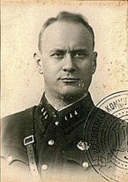

### M26 Pershing

Po długiej biurokratycznej i politycznej walce Amerykanie wprowadzili do służby nowe czołgi M26 Pershing, które miały zastąpić M4 Sherman. W doktrynie anglosaskiej czołg wzmacnia siłę piechoty, a do walki z czołgami przeznaczone jest lotnictwo oraz niszczyciele czołgów. Wewnętrzna batalia o nowy czołg w armii dotyczyła głównie tego, czy naprawdę nowy czołg jest potrzebny.

M26 stanowi nową jakość. Jego opancerzenie i siła ognia były dopasowane do niemieckiej taktyki, w której czołgi są samodzielną siłą niszczącą. Pershing był albo przynajmniej miał być równorzędnym przeciwnikiem dla Pantery i Tygrysa. Miał armatę 90 mm i solidny pancerz. Żeby sprawdzić je w walce, w styczniu 1945 wysłali 20 tych czołgów do Europy, dzieląc je między 3 i 9 Dywizję Pancerną.

Pierwszy raz wziął udział w boju 25 lutego i przegrał pojedynek z Tygrysem. 2 czołgistów zginęło, ale czołg został naprawiony i wrócił do służby.

Wkrótce potem inny M26 w jednej walce pokonał Tygrysa i 2 Pantery.

Najsłynniejszy pojedynek Pershinga miał miejsce w Kolonii 6 marca 1945. Najsłynniejszy nie tylko ze względu na przebieg, wyjątkowo bowiem został zarejestrowany kamerą. Podczas bitwy przyczajona Pantera wyeliminowała Shermana, na pomoc wezwano Pershinga. Niemcy nie znali nowego amerykańskiego czołgu i nagłe pojawienie się zza węgła nieznanej maszyny zaskoczyło załogantów Pantery. Pershing zniszczył Panterę, która zaczęła się dymić i zaraz wybuchła płomieniem, ale o dziwo większość załogi się uratowała.

Tego samego dnia inny Pershing miał pecha spotkać ponurego snajpera Panzerwaffe, który na froncie wschodnim armatą 8,8 cm potrafił eliminować T-34 z odległości 3,5 km. Był to zbudowany na podwoziu Panzer IV lekko opancerzony i mobilny, z bliska bezbronny niszczyciel czołgów Nashorn (pl. Nosorożec). W Niehl na północ od Kolonii zamaskowany Nashorn z niewielkiej odległości poniżej 300 m jednym strzałem zniszczył Pershinga, który w tej sytuacji był bez szans. Czołg został wyeliminowany z walki. Kilka minut po trafieniu eksplodowała amunicja, więc nie nadawał się do naprawy. Załoga zdołała się ewakuować. Był to podczas tej wojny jedyny Pershing zniszczony w walce.

W 1948 wymienili mu silnik i zmodernizowali. Zmiany były na tyle istotne, że zadecydowano również o zmianie nazwy i udoskonalony M26 dostał oznaczenie M46 Patton. Paradoksalnie, bo Patton był jego przeciwnikiem, uważał, że przejście na nową maszynę opóźni zwycięstwo. Razem ze swoją wcześniejszą wersją wziął udział w wojnie koreańskiej.

Kolejne wersje Pattona to M47 i M48. Ostatnia wersja Pattona przezbrojona w armatę 105 mm znana jako M60 była produkowana aż do 1980. Ostatecznie Pershingi/Pattony zostały wysłane do krainy wiecznego demobilu dopiero przez znany nam wszystkim M1 Abrams produkowany od 1980.

W 2019 już wówczas 98-letni działonowy Pershinga, Clarence Smoyer, otrzymał Brązową Gwiazdę.

- ["World War II veterans Clarence Smoyer, 96, left, Joseph Caserta and Buck Marsh bow their heads"](https://www.warhistoryonline.com/news/pershing-gunner-clarence-smoyer-was-awarded-a-bronze-star-74-years-after-famous-cologne-tank-duel.html)
- ["Pershing vs. Panther: A Duel in Cologne"](https://worldoftanks.eu/en/news/history/panther-vs-pershing-history/)
- Mark Felton Productions  ["Nashorn vs Pershing, Germany 1945" [YT 6:03]](https://www.youtube.com/watch?v=MRDnJ-_Kbk8) | ["Super Pershing vs King Tiger Duel 1945" [YT 7:45]](https://www.youtube.com/watch?v=hCpylkCpRZo) | ["Pershing vs Tiger 1945" [YT 7:03]](https://www.youtube.com/watch?v=meduxDj61sQ) | ["Centurion - Tiger Tank's Nemesis" [YT 11:48]](https://www.youtube.com/watch?v=0AnoySTfvFM)
- Military History Visualized ["Panther: The most Controversial Panzer" [YT 14:57]](https://www.youtube.com/watch?v=RfyF3m3RjyU)
- Dark Docs ["American Tank vs German Tank Caught on Camera - Cologne Cathedral" [YT 10:23]](https://www.youtube.com/watch?v=SL5rfU6JBsA)
- anicursor ["Battle for Cologne - tank duel v2020" [YT 10:40]](https://www.youtube.com/watch?v=cHs5RI9zaiQ)
- Yarnhub ["The Cologne Tank Duel" [YT 7:50]](https://www.youtube.com/watch?v=isVI4_ygoLc)
- ChonkTonk Films ["Cologne Tank Duel - War Thunder Cinematic" [YT 1:50]](https://www.youtube.com/watch?v=AZqe5-UJ-R4)
- _Manu ["Cologne Tank Duel - War Thunder Cinematic -" [YT 2:51]](https://www.youtube.com/watch?v=ZkkSRndGw9o)
- The Daytona Plane ["Cologne Tank Duel | War Thunder Short" [YT 4:21]](https://www.youtube.com/watch?v=OvUIiuyxqZI)

### Operacja balatońska

Rozpoczyna się operacja "Wiosenne przebudzenie" (niem. Unternehmen Frühlingserwachen). W daremnym rzucie nadziei (a może rozpaczy) ostatnie jednostki pancerne, cztery elitarne dywizje pancerne SS zostały pchnięte zza północnego i południowego końca Jeziora Balaton w celu odbicia Budapesztu oraz pól naftowych Nagykanizsy.

<SeeAlso txt="Węgry" url="/festung-breslau/article/wegry" />

Jest to ostatnia niemiecka ofensywa. Bardzo krótka zresztą. Armia Czerwona z początku zaskoczona tak wielką siłą pancerną (było to 800 czołgów) szybko dokonała przegrupowania i kontrataku. W ciągu 10 dni Niemcy musieli wrócić na pozycje startowe. 16 marca nastąpił koniec operacji.

- [Operation Spring Awakening](https://en.wikipedia.org/wiki/Operation_Spring_Awakening)

### Rumunia

Komunizm umacnia się również w Rumunii - 6 marca 1945 premierem został Petru Groza, zwany przez przeciwników politycznych Czerwonym Burżujem (nie wiem, czy nie chodzi tu o błąd w tłumaczeniu - ro.wiki pisze o "ultimul burghez" ostatni mieszczanin, co ma więcej sensu), podczas Wielkiego Kryzysu zasłynął założeniem w radykalnej organizacji agrarnej Frontu Oraczy. Jako posłuszny realizator poleceń Moskwy utrzymywał się przy władzy aż do 1952. Kluczowe stanowiska w jego gabinecie mieli komuniści. Nigdy nie był przez nich prześladowany, umarł w 1958 w wieku 73 lat.

<SeeAlso txt="Rumunia" url="/festung-breslau/article/rumunia" />

Już 10 marca 1945 odniósł wielki sukces. Sowieci zgodzili się na ponowne przekazanie Siedmiogrodu / Transylwanii na rzecz Rumunii. Dla Węgrów to rzecz bardzo bolesna i to do dziś. Właściwie w każdym węgierskim domu żyje pamięć traktatu w Trianon (część układów wersalskich) z 4 czerwca 1920, na mocy którego Węgry utraciły na rzecz Rumunii Siedmiogród, ziemię tradycyjnie węgierską, zamieszkaną w większości przez Węgrów. Ich sojusz z Hitlerem wynikał w dużej części z nadziei na odwrócenie tej sytuacji. I na czas sukcesów Hitlera to się udało. Teraz przyszedł czas powrotu do Trianon.

Od razu zamyka wiele gazet, oficjalną przyczyną jest zarzut, że "wysługiwały się faszystom i hitlerowcom", ale tak naprawdę chodzi o monopol na media. Trwa konflikt z królem Michałem Hohenzollern-Sigmaringenem, który domaga się, by w imię dotrzymania układu jałtańskiego Groza zrezygnował. Ten jednak przez kilka lat umocnił swoją władzę i w sierpniu 1947 przyznał Stalinowi honorowe obywatelstwo rumuńskie, a potem 30 grudnia, kiedy wszyscy szykowali się do sylwestra, zaprosił Michała w pilnym trybie "by przedyskutować ważne kwestie" i przedstawił mu do podpisu gotowy akt abdykacji. Wg relacji Michała, kiedy odmówił złożenia podpisu, Groza zagroził aresztowaniem tysięcy ludzi i krwawą jatką. Dopiero wtedy król zrzekł się tronu. Tak Rumunia wkroczyła w 1948 rok bez króla, jako kraj komunistyczny.

- Powojnie ["Historia Nicolae Ceaușescu. Część 1: Jak został komunistą? Rumunia po II Wojnie Światowej." [YT 16:20]](https://www.youtube.com/watch?v=EpRHD_ygzf8)

### 2 Front Białoruski

2 Front Białoruski: Grudziądz!

### Iwan Sierow

Głównym narzędziem nowej tyranii było po orwellowsku nazwane Ministerstwo Bezpieczeństwa Publicznego. Dziś głównym doradcą NKWD przy MBP został Iwan Sierow, wzorcowy i bezwzględny czekista. Najważniejszą akcją, jaką przeprowadził w Polsce, było 27 i 28 marca porwanie przywódców Polski podziemnej.

Organizował przesiedlenia Polaków w 1940, walczył z polskim podziemiem, osobiście przesłuchiwał i torturował Leopolda Okulickiego. Po wybuchu wojny z Niemcami wysyłano go na najbardziej zagrożone odcinki frontu.

11 stycznia 1945 został Pełnomocnikiem NKWD przy 1 Froncie Białoruskim. W Polsce służy od marca do maja 1945, potem zostaje skierowany do sowieckiej strefy okupacyjnej w Niemczech, gdzie zarządzał całym NKWD w sowieckiej strefie okupacyjnej. Korzystając z doświadczenia czekisty i dorobku oraz personelu Gestapo stworzył Niemcom Stasi.

Ważny człowiek Chruszczowa, był mu pomocny w obaleniu Berii. Organizował również tłumienie powstania węgierskiego w 1956.

Monumentalna postać sowieckiego reżimu.

*Iwan Sierow, zdjęcie w legitymacji służbowej 
By nieznany - [http://vimpel-v.com/uploads/posts/2017-10/1508146379_srov_chl_bil.jpg](http://vimpel-v.com/uploads/posts/2017-10/1508146379_srov_chl_bil.jpg), Domena publiczna, [Link](https://commons.wikimedia.org/w/index.php?curid=82388531)*

### Wrocław

Paul Peikert koncentruje się dziś na trzech rzeczach: utraconej nadziei na spokojny, wolny od bombardowań dzień lub chociażby noc, podczas której można by się spokojnie wyspać, rozpoczętej budowie lotniska na obecnym pl. Grunwaldzkim oraz kolejnych przesiedleniach, które tym razem dotknęły ludzi tam mieszkających; szczególnej ironii dodaje tu fakt, że tym razem kazano im udać się, tam skąd na samym początku wszystkich wypędzono, na obszar Wielkiej Wyspy, było to więc dla niektórych już trzecie przesiedlenie podczas oblężenia, najpierw na południe, później do centrum a teraz z powrotem na wschód, tym bardziej gorzkie dla tych, którzy mieli tam dom, porzucili własne mieszkania, nie mając teraz już nic albo prawie nic ze sobą i wrócili do domów, które w międzyczasie zostały splądrowane i ograbione przez własne wojsko:
>Po ciężkich nalotach w poniedziałek spodziewaliśmy się spokojnej nocy, ale na próżno. Przez całą noc panował ruch. Nad miastem krążyły bez przerwy nieprzyjacielskie samoloty. [...] Około godz. 10 rozpoczyna się znów ożywiona akcja lotnicza nieprzyjaciela, która przeciąga się do wieczora. Raz po raz padają na miasto nieprzyjacielskie bomby, a z powodu obstrzału z broni pokładowej ulice stają się niebezpieczne. Również w najbliższym sąsiedztwie znów spadły bomby. Nieprzyjacielski nalot w poniedziałek wyrządził w obrębie miasta wielkie szkody i pociągnął za sobą wiele ofiar. Ciągle dochodzą z różnych dzielnic bardzo przygnębiające wiadomości o ciężkich stratach. [...] Kaiserstraße (nieistniejąca dziś, na terenie placu Grunwaldzkiego), najpiękniejsza ulica naszego miasta, ma być rozbudowana w wielki pas startowy. Wspaniałe drzewa tej ulicy padną dziś od pił elektrycznych. Przyległe do Kaiserstraße ciągi budynków mają być wysadzone w powietrze. Budzi obawę los kościoła Piotra Kanizjusza. Nikt nie widzi najmniejszego sensu w tym taktycznym pociągnięciu. Dopiero co rozlokowano w tej części miasta uciekinierów z południa. Teraz wszyscy muszą znów opuścić to schronienie i zostają rozlokowani na Sępolnie, Biskupinie i Zalesiu; zatem w tej części miasta, która zaraz na początku walk została tak bezwzględnie ewakuowana, że nawet jedna osoba nie mogła pozostać. Właścicielom powracającym do swoich will na Zalesiu, Sępolnie i Biskupinie ukazują się odrażające ślady rabunku, kradzieży i spustoszenia, dokonanych przez naszych własnych żołnierzy. Skradziono cenne przedmioty, podobnie odbiorniki radiowe, perskie dywany itp. [...] Wczoraj wracając wraz z drem Treutlerem do swego mieszkania, zastała dwóch feldfeblów z dziewczyną. Po prostu włamali się do domu i zdążyli już przetrząsnąć mieszkanie. Bez zezwolenia obwodowej grupy NSDAP otworzyli sobie siłą mieszkanie, mimo że było zamieszkane. Taka jest dzisiaj postawa naszych żołnierzy. Ponieważ wysoko postawieni funkcjonariusze bogacą się bez względu na aspekt moralny metod, masy żołnierskie uważają, że wolno im również rabować, przywłaszczać i bogacić się. W ten sposób nasze słynne ongiś z cnót żołnierskich wojsko stało się soldateską. Co odczują wszyscy ci, których zmuszono do opuszczenia mieszkań, jeśli kiedyś powrócą do swoich domów? [...] Dziś był piękny, słoneczny, choć chłodny dzień".

Ciągle jest chłodno, ale wszystkie relacje zgadzają się co do tego, że wyczuwa się nadchodząca wiosnę. Co zaś do faktu włamania, zarządzeniem władz twierdzy opuszczający mieszkania, własne lub właśnie zamieszkiwane zobowiązani byli zostawić drzwi otwarte, właśnie na wypadek, gdyby były potrzebne kolejny raz relokowanym cywilom. Nie trzeba tłumaczyć, że ogromnie to sprzyjało grabieży, która była już tak nagminna, że najsroższe kary niczego nie mogły zmienić. Temat ten jeszcze wielokrotnie będzie powracał. Co więcej, podmuchy eksplozji czasem otwierają te niezamknięte drzwi na oścież.

Hugo Hartung przez przestrzeń siedemdziesięciu lat nawiązuje do naszej niedawnej uwagi o zaopatrywaniu mieszkańców Wrocławia w media:
>Od wczorajszego nalotu nie mamy wody i elektrycznego światła. Ponura, kopcąca lampa naftowa nie czyni naszej zatęchłej piwnicy przyjemniejszą.

### Komendant

Jacek Solarz opisuje przylot nowego komendanta:
>Wieczorem, 6 marca 1945 roku, Niehoff wylądował na lotnisku w Małym Gądowie i nie uprzedzając o niczym von Ahlfena zjawił się natychmiast w jego dowództwie w podziemiach Wzgórza Partyzantów. Ahlfen, jakkolwiek mocno zaskoczony pojawieniem się nowego komendanta, przekazał mu dowództwo nad garnizonem i wprowadził w sytuację na polu walki.

Na Teutatesa! Do kroćset! Nie ma we Wrocławiu ani w okolicach Małego Gądowa. Jest leżąca kilka kilometrów od obecnych granic Wrocławia wieś Gądów, oraz - niegdyś również pobliska wieś, a od 1928 roku część Wrocławia - Gądów Mały. Ów "Mały Gądów" być może jest wynikiem lenistwa, a może z rozpędu i nieprawidłowo przetłumaczoną nazwą niemiecką: Klein-Gandau.

Richard Hargreaves mając wciąż ambicję zostania Alistairem MacLeanem:
>Zbliżała się północ 6 marca, gdy grupa młodszych oficerów SS poprowadziła generała długim korytarzem w Nadprezydium Prowincji Śląskiej, a następnie schodami kilka pięter w dół do piwnic budynku. Niehoff zauważył, że podziemia kwatery głównej gauleitera były "całkowicie odporne na bombardowanie" i znacznie bezpieczniejsze niż jego lochy pod Wzgórzem Liebicha. Były również o wiele bardziej wystawne. Można tam było znaleźć liczne biura, centralę telefoniczną, pomieszczenie z radiostacją, kuchnię, spiżarnię, stołówkę, prysznice i sypialnie z eleganckimi zasłonami. Oficerowie SS wprowadzili generała do wielkiej sali, w której dominowało imponujące biurko. Kilku ludzi - niektórzy w mundurach SS, a inni po cywilnemu - wstali na jego widok. Hanke w swoim brunatnym mundurze gauleitera ozdobionym czerwonym i złotym sznurem podszedł do Niehoffa i wyciągnął dłoń na powitanie. "A oto mój nowy komendant. Dzięki Bogu. Serdecznie witam!" - powiedział. Generał lekko się ukłonił, a następnie obaj mężczyźni usiedli. Niehoff się nie odzywał. Gauleiter tymczasem mówił bez końca. Jego zdaniem do tego momentu wszyscy poprzedni komendanci wojskowi twierdzy byli niekompetentni (Nichtskõnner). Niczego nie robili jak trzeba, sprzeciwiali się wszystkim jego przedsięwzięciom. Ale na koniec powiedział zachęcająco: "Teraz w pańskiej osobie mam odpowiedniego człowieka". Niehoff nadal nic nie mówił. Dopiero gdy z pomieszczenia wyszli pozostali członkowie sztabu Hankego, generał się odezwał. Przybył z zamiarem przywrócenia prawa i porządku. To on jest komendantem twierdzy, a nie Hanke. "Od dzisiaj tylko ja wydaję rozkazy we wszystkich kwestiach militarnych!" Hanke skoczył na równe nogi. "To oznacza, że chce mnie pan zneutralizować!". General był niewzruszony. "Jeśli chce pan to ująć w ten sposób to tak". Przez chwilę gauleiter patrzył na leżący na biurku pas z przypiętą kaburą, po czym ze znużeniem spojrzał ponownie na Niehoffa i podał mu rękę na pożegnanie.

Ten schron to dość tajemniczy obiekt, żeby nie wydłużać nadmiernie wpisu wyjaśnienie później.

Właściwą siedzibą Gauleitera był Pałac Hatzfeldtów - perła wrocławskiego klasycyzmu i siedziba władz miejskich od 1802, więc było to miejsce które zajął Hieronim Bonaparte podczas swojego pobytu we Wrocławiu. Poważnie zniszczony podczas wojny, ale były szanse na jego odbudowę. Starał się o nią jeden z najważniejszych powojennych architektów odbudowujących Wrocław - profesor Edmund Małachowicz - który, żeby uratować pałac, w pewnym momencie nawet zaczął dowodzić, iż projektant (w rzeczywistości realizator projektu) jego ostatniej rozbudowy po zniszczeniach wojny siedmioletniej Carl Gotthard Langhans (w skrócie: Langhans ojciec) był w rzeczywistości polskiego pochodzenia i nazywał się Jan Długi. Niestety nic to nie dało i los resztek pałacu został przesądzony przez władze partyjne i miejskie, m.in. z powodu ostatniego lokatora. Dziś na jego miejscu stoi Galeria BWA na ul Wita Stwosza. A jedynym reliktem jest ocalały jeszcze portyk oraz obszerny westybul - pozostałość przejazdu dla karoc. Pomysł odbudowy pałacu powrócił w 2007 i nawet wyznaczono terminy, ale nic z tych pomysłów nie wynikło. Planowane było połączenie odbudowanego pałacu ze zbudowaną w latach 1914-18 obecną siedzibą Urzędu Miejskiego przy Nowym Targu i przywrócenie w ten sposób jednolitego bloku siedziby władz miejskich.

Hermann Niehoff okazał się komendantem ze wszystkich najbardziej bezwzględnym, już wkrótce całe miasto poddał całkowitej militaryzacji, pod jego władzą pojęcie cywila straciło sens. Peikert nazwie go - w charakterystyczny dla siebie sposób - Neronem. Jednak wobec von Ahlfena który w wyniku oskarżeń Schõrnera już wkrótce stanie przed sądem polowym, Niehoff okazuje daleko pojętą zawodową solidarność. Nie tylko zdradza, że szykowany jest proces, ale pomaga von Ahlfenowi w przygotowaniach do niego. Obaj należą do tego samego klanu. I obaj we wspólnie napisanej wspomnieniowej książce "Festung Breslau w ogniu" kontynuują tę obronę przeciwko Gauleiterowi, unikając krytyki wprost, pozostawiając ją pomiędzy wierszami, czasem wręcz jakby go broniąc, podkreślają brak złych intencji (ale co z tego wynika i niekompetencję zarazem, oraz fatalne dla każdego przywódcy wady charakteru):
>Gwoli prawdy historycznej należy jeszcze raz powtórzyć, że gauleiter faktycznie unikał uzurpowania sobie uprawnień w sferze czysto militarnej. Ale nakreślony gdzie indziej obraz dowództwa byłby fałszywy, gdybyśmy stwierdzili, że Hanke przypierał von Ahlfena albo też wręcz wyłączył go z gry. Nie, lecz gauleiter pokonał poprzedników Niehoffa, stosując środki i metody należące do obszaru intrygi. I tu generał Niehoff od samego początku właściwie ustawił zwrotnice, blokując samowolne wycieczki Hankego. To było trudne przedsięwzięcie. Z jednej strony generał Niehoff musiał utrzymać z gauleiterem dobre stosunki, ale jego samowolne przesyłane bezpośrednio do Reichsleitera Bormanna komunikaty radiowe, nawet jeśli były formułowane w najlepszej dla Wrocławia woli, postrzegano jako przeszkadzanie, a także zapewne jako wyraz megalomanii. Przywrócenie przez generała Niehoffa w czasie pierwszej i najważniejszej wizyty obustronnych granic w miejscach, gdzie się wcześniej słusznie znajdowały, było zatem aktem dyplomatycznej zręczności. [...] Aby teraz, wyznaczając owe granice, bez żadnej wątpliwości pokazać kto tu rządzi, generał Niehoff zażądał wydania nadajnika radiowego dużej mocy, czynności która powinna była zostać wykonana dużo wcześniej.

Jak już widzieliśmy, to właśnie uprzywilejowana łączność z bunkrem Hitlera dawała przewagę Gauleiterowi Hanke, i to bezpośrednio od Hitlera miały pochodzić niektóre z rozkazów.

### Bitwa

Intensywność walk była ogromna, sowieckie oddziały szturmowe uzbrojone w artylerię, armaty i moździerze musiały walczyć o każdy fragment miasta i jak zobaczymy, jeszcze nie raz łatwiej było wysadzić budynek w powietrze niż go zdobyć. Czasy szybkiego przesuwania się linii frontu w głąb miasta, a później szybkich zdobyczy zarówno w jedną jak i w drugą stronę minęły bezpowrotnie. Oficer 359 Dywizji Piechoty M. Orłow pisze:
>Im dalej działania przenosiły się w głąb miasta, tym bardziej zacięte i bezlitosne były walki. Walczyć przyszło nie tylko o każdy kwartał, ulicę czy dom, lecz także o każde piętro.

Obie strony ponosiły ogromne straty, walczący na tym odcinku zaledwie kilka dni pułk Mohr najlepszy oddział twierdzy musiał zostać zluzowany przez SS Besslein. Ryszard Majewski, pułkownik WP, w "Dolny Śląsk 1945 Wyzwolenie" twierdzi, że nastąpiło to 5 marca, ale w jego "Wrocław godzina zero" cytowane wspomnienia jednego z SS-manów wskazują na siódmego marca. Majewski podaje następujący przykład okolicy będącej już przy końcowej linii zdobyczy sowieckich:
>Bardzo ciężkie wali toczył 1 batalion 957 pułku 309 Dywizji Piechoty (wzmocniony 3 działami kalibru 76 mm i 2 działami 45 mm oraz grupą saperów) o kwartał nr 593, między ulicami Gajowicką, Żelazną i Sudecką. Rozpoczęły się one już 6 marca, jednak po zdobyciu jednego z domów grupy szturmowe zostały zatrzymane silnym ogniem z kościoła Chrystusa Króla znajdującego się przy obecnej ulicy Zaporoskiej. Kościół ten stanowiący najważniejszy punkt oporu hitlerowców w tym rejonie, broniony był przez silną 40-osobową grupę, uzbrojoną m.in. w 2 ciężkie i 4 ręczne karabiny maszynowe oraz liczne "panzerfausty" Grube mury świątyni skutecznie opierały się pociskom, strzelającym na wprost, dział 45 i 76 mm oraz wspierającym grupy szturmowe moździerzy 82 i 120 mm.

Mowa jest oczywiście o nieistniejącym już kościele, zbudowanym całkiem - z perspektywy wojny - niedawno, bo w 1933 wg projektu Alfreda Trumpkego, ta istniejąca zaledwie 13 lat świątynia została zupełnie podczas wojny zniszczona, a jej ruiny zaraz po wojnie rozebrane. Już wkrótce na swoje nieszczęście wróci w naszej opowieści. To samo wezwanie otrzymał konsekrowany w 1991 charakterystyczny kościół przy ul. Młodych Techników, na Szczepinie, budowany aż od 1987 wg projektu wrocławskiego architekta Witolda Jerzego Molickiego, architekta najbardziej we Wrocławiu znanego z Popowic.
