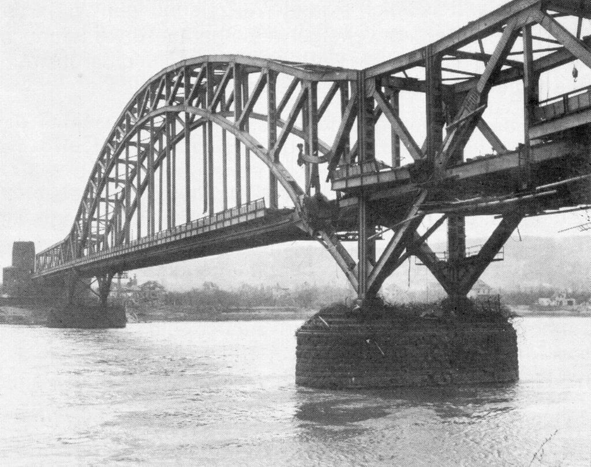

### Lord Dawson

Lord Dawson, znany lekarz opiekujący się brytyjską rodziną królewską, zmarł ze starości w wieku 80 lat.

Najbardziej znany jest ze sprawy eutanazji króla Jerzego V. Ta zdumiewająca sprawa wyszła na jaw dopiero 1986, kiedy ukazały się jego wspomnienia. Zupełne otwarcie przyznaje tam, że kiedy zrozumiał iż stan króla jest już beznadziejny i zostały mu już godziny, zdecydował się podać mu śmiertelną kombinację morfiny i kokainy tak, żeby umarł szybko i żeby można było powiadomić dzienniki poranne. W przeciwnym wypadku, gdyby śmierć zdarzyła się kilka godzin później, pierwsze o śmierci króla poinformowałyby pozbawione prestiżu popołudniówki. A przecież to było niedopuszczalne.

### Front zachodni

Zajęci dynamicznie rozwijającą się sytuacją w oblężonym i masakrowanym mieście utraciliśmy z pola widzenia zarówno kontekst wydarzeń na całym Dolnym Śląsku jak w wojnie w Europie. Tymczasem ma on znaczenie i dopisuje ważne wątki w narracji oblężonej twierdzy.

Co mamy na wschodzie? Sowietów za Odrą w Brandenburgii i jednocześnie Niemców w Raciborzu, a pośrodku oblężony Wrocław, który wciąż się broni. Obie strony zwarte w śmiertelnym boju i obie skrajnie wyczerpane. Koniew nie ma już rezerw strategicznych. Wojska są przemieszane, na Śląsku wciąż stacjonuje spora część Grupy Armii Środek. Pięść Armii Czerwonej zatrzymała się kilometry od Berlina na wciąż silnym pancerzu Wehrmachtu.

Tymczasem na froncie zachodnim sytuacja w niczym nie przypominała tej na wschodzie. Alianci byli w ogromnej odległości od Berlina i oddzielała ich od celu poważna przeszkoda geograficzna - Ren. Za Renem Niemcy rozlokowali 60 dywizji. Z 750 km długości frontu, 600 km było wspartych o Linię Zygfryda (niem. Westwall). Przeciwko nim alianci zachodni wystawili 86 dywizji. Ale żeby mieć pełen obraz sytuacji trzeba dodać dwie informacje:

- dywizje niemieckie były przerzedzone, niektóre miały zaledwie 1/3 składu osobowego, zarówno kadry, jak i sprzęt w dużej części to była zbieraniną z tego, co udało się wycofać i uratować z klęski we Francji
- ponadto po bombardowaniach fabryk Kruppa w Essen, zniszczeniu zagłębia Ruhry i utracie Górnego Śląska armia niemiecka była pozbawiona dostaw nowego sprzętu. To samo dotyczyło ludzi. Każdy zniszczony czołg to załoga i maszyna, których nie było już czym zastąpić.

Dowódcy frontowi byli przeciwni wzmacnianiu ich jednostek przez dzieci z Hitlerjugend i zbieraniną Volkssturmu uznając, że wprowadzi to tylko chaos w jednostkach, które i tak cierpią na brak wyszkolenia. Dochodziły do tego braki w zaopatrzeniu, przede wszystkim ograniczenie w zakresie rzeczy niezbędnej do prowadzenia nowoczesnej wojny - paliwa. Luftwaffe już była tylko szkieletem niebędącym w stanie prowadzić wyrównanej walki z wrogiem, a ostatnia siła armii niemieckiej, której obawiali się alianci czyli czołgi, bez paliwa były tylko kolumnami nieruchomych armat.

Podsumowując: Niemcy mieli ponad dwukrotnie mniejsze siły, niemogące liczyć na posiłki, ani zaopatrzenie, mieli tylko około 100 żołnierzy na kilometr frontu. Ponadto Linia Zygfryda była słabo obsadzona i wyrabowana z wyposażenia, które zostało zdemontowane i posłużyło do budowy Wału Atlantyckiego.

Ale to wszystko to był tylko pierwszy fakt zmieniający przedstawiony w pierwszym zdaniu obraz frontu zachodniego. Drugi był dla strony niemieckiej jeszcze gorszy: Ren i siły na Renie były ostatnią zachodnią rubieżą III Rzeszy. Była to poważna przeszkoda, ale za nią zaczynała się już autostrada do Berlina. Bardzo łatwa do przebycia, jeśli ktoś miał odpowiednią ilość dywizji i zaopatrzenia.

### Remagen

Całkiem przypadkiem - pierwszy etap wyścigu o pokonanie Renu rozegrał się dziś, rankiem 7 marca. Ze względu na strategiczne znaczenie Renu jako przeszkody geograficznej Naczelne Dowództwo wydało stanowczy rozkaz zaminowania, a później w miarę zbliżania się wroga wysadzenia każdego mostu. Wszystko co pomogłoby wrogowi przekroczyć rzekę, musiało zostać zniszczone. Rozkaz skrupulatnie wykonano i alianci nie oczekiwali, że zobaczą jakikolwiek most. Byli przygotowani do morderczej walki o przekroczenie szerokiej, rwącej - szczególnie wiosną - rzeki, do tego zażarcie bronionej przez dobrze dowodzonych i zmotywowanych żołnierzy.

Oddziały Grupy Bojowej B amerykańskiej 9 Dywizji Pancernej zbliżały się do leżącego nad Renem małego 5-tysięcznego miasta Remagen leżącego pomiędzy Koblencją a Bonn.

Porucznik Harold Larsen ze zwiadu 9 Dywizji Artylerii leciał małym jednosilnikowym górnopłatem Piper J-3 Cub, który zyskał sobie opinię uniwersalnej maszyny nie do zdarcia i od 1941 był używany jako samolot zwiadu o oficjalnej nazwie L-4 i nieoficjalnej Grasshopper (pasikonik). Jego celem było zlokalizowanie potencjalnych obiektów ataku w okolicy miasta. Jakie było jego zdziwienie, kiedy ujrzał nienaruszony, ponad 300-metrowej rozpiętości kolejowy Most Ludendorffa w Remagen.

Natychmiast połączył się z dowódcą 9 Dywizji Pancernej Williamem Hodge, który słysząc o moście, rozkazał zdobyć go za wszelką cenę. Z najbliżej znajdujących się jednostek, czyli z 27 Batalionu Piechoty Pancernej i 14 Batalionu Czołgów utworzył tzw. Grupę Engemana, nazwaną tak od dowódcy: podpułkownika Leonarda Engemana.

Wiadukt został zauważony z samolotu około godz, 1030. Żołnierze Engemana dotarli w jego pobliże jeszcze przed południem, na moście pracowali żołnierze niemieccy. Słysząc o tym generał William Hodge, po dłuższym oczekiwaniu o godz. 1600 zdecydował się zagrać va banque i jednak most zaatakować. Jego żołnierze nie byli z tego powodu zadowoleni, atakowanie zaminowanego mostu to nie jest wymarzone zadanie. Kiedy Niemcy zauważyli biegnących Amerykanów, uciekli. Most był coraz bliżej, napięcie rosło. Nagle potężna eksplozja wstrząsnęła mostem i zakryła go chmurą pyłu. Żołnierze padli na ziemię. Jeden z nich krzyknął "*Dzięki Bogu teraz nie będziemy musieli przechodzić przez to cholerstwo!*".

Jednak kiedy pył opadł, ujrzeli most prawie nienaruszony. Krzycząc wniebogłosy dla dodania sobie odwagi i wściekle zrywając wszystkie napotkane kable, przebiegli ten cholerny most nie ponosząc żadnych strat.

Most miał poważnie naruszoną konstrukcję. Nie można było przejechać po nim czołgiem, ale piechota mogła przejść po nim Ren bez przeszkód, tym bardziej że Remagen okazało się miastem praktycznie pozbawionym obrony. Amerykańska piechota napotkała przerażonych Volkssturmistów i kolejarzy.

Hitler, kiedy dowiedział się o moście w Remagen, wpadł we wściekłość. Rozkazał rozstrzelać winnych zaniedbania i zniszczyć most za wszelką cenę. I rzeczywiście do zniszczenia mostu użyto wszelkich dostępnych środków. Oprócz zwykłych bombowców i samolotów szturmowych użyto bombowców odrzutowych Arado Ar 234 oraz myśliwców Me 262. Wysłano nurków. Puszczano rzeką miny. Do odbicia Remagen wysłano wszystkie jednostki, które jeszcze dysponowały paliwem, nawet z Kolonii i Düsseldorfu. Na Remagen wysłano 10 rakiet V2. Jedna z nich uderzyła ćwierć kilometra od celu.

Ostatecznie most runął sam, i to dość niespodziewanie, dziesięć dni później 17 marca ok godz. 1500, kiedy pracowało na nim 200 saperów. Krótki, ostrzegawczy jęk rwącej się stali. Żadnej szansy na ucieczkę. Runął do Renu, zabijając 30 ludzi. Prawdopodobnie było to spowodowane zmęczeniem konstrukcji. Już przedtem był bombardowany przez Amerykanów, chcących zakłócić niemiecką mobilność, potem poważnie uszkodziła go próba wysadzenia, a na końcu został przeciążony masą przeprawianego wojska. Cud, że wytrzymał 10 dni.

Do tego czasu Amerykanie mieli już 6 mostów pontonowych na Renie i 9 dywizji na wschodnim brzegu.

Po wojnie uznano most za nienadający się do naprawy i zdemontowano go. W 1980 na ocalałym zachodnim przyczółku mostu utworzono Muzeum Pokoju Most w Remagen. Pozostając jednak przy 7 marca 1945, trzeba dodać, że Amerykanie nie wyszli jeszcze na autostradę berlińską. Niemcy zaciekle walczyli, usiłując zlikwidować przyczółek w Remagen, aż do przełamania linii Renu jednocześnie przez Pattona na południu i Eisenhowera na północy. Nastąpi to za niecałe dwa tygodnie, do tego czasu również obraz wojny na Śląsku zmieni się diametralnie.

Pierwszym żołnierzem alianckim na wschodnim brzegu Renu był sierżant Alex Drabik (z pochodzenia Polak, rzeźnik z Holland w stanie Ohio). Był pierwszym od czasów napoleońskich żołnierzem wroga, który wkroczył na ziemie niemieckie, przekraczając Ren. Przeżył wojnę. Zginął w 1993 w wypadku samochodowym, jadąc na spotkanie ze swoim oddziałem. Jego ojciec miał na imię Jan, a matka Franciszka z domu Lewandowska, oboje pochodzili z Szymborza, wówczas wioski pod Inowrocławiem obecnie jest to osiedle w jego granicach. Swoistym żartem historii jest fakt, że Inowrocław od pierwszego rozbioru w 1772 był częścią królestwa Prus, w okresie międzywojennym należał do Polski, ale sądząc z tego, że urodzony w 1910 Alex był najmłodszym synem z trzynaściorga rodzeństwa, można domniemywać, że w momencie emigracji oboje jego rodzice byli obywatelami niemieckimi. Dla wielodzietnej, niezbyt bogatej rodziny emigracja do USA w latach 20. była prawie niemożliwa, więc raczej była to emigracja sprzed Wielkiej Wojny.

- Mark Felton Productions ["Remagen 1945 - The Race for the Bridge" [YT 16:21]](https://www.youtube.com/watch?v=es3AbkfcUoQ) | ["The Ragtag Circus - The 83rd Division's Captured German Vehicles" [YT 2:36]](https://www.youtube.com/watch?v=e7tlZDsNBkY)
- Dark Docs ["A Furious Hitler Attacks his Own Bridge with V-2 Rockets - The Battle of Remagen" [YT 9:52]](https://www.youtube.com/watch?v=qdhZH9ZA7q4)

<BoxImageWrapper>

Ludendorff-Brücke, Remagen, 1945. Zbudowany w latach 1916-19 przy użyciu rosyjskich jeńców wojennych 
Von Unbekannt (US-amerikanischer Armeeangehöriger) - Reproduktion aus Michler, Manfred: Die verflixte Brücke. Verlag Gerstmair, Würzburg 1981., Gemeinfrei, [Link](https://commons.wikimedia.org/w/index.php?curid=2739376)
</BoxImageWrapper>

### Hellmuth Reymann

Generał Hellmuth Reymann, urodzony w Prudniku, przeżył bombardowanie Drezna w piwnicy swojego domu na terenie garnizonu. 5 marca 1945 został wyznaczony na dowódcę oddziałów broniących Drezna. Odmówił objęcia funkcji ponieważ miasto było w ruinach.

7 marca został wyznaczony na dowódcę obszaru obrony Wielkiego Berlina (Kommandant des Verteidigungsbereiches Groß-Berlin). Spotkał się z nim Hitler i pouczył go o zakresie obowiązków. Jeszcze tego dnia podczas spotkania ze swoim szefem sztabu, generałem Wernerem Friebe i oficerem sztabowym Hartmutem Sprotte zapoznał się ze stanem przygotowań do obrony miasta. Szybko odkrył, że poza kilkoma słabymi zaporami przeciwczołgowymi nie ma nic.

Jego kwatera znajdowała się przy Hohenzollerndamm 144 w Berlin Grunewald. 9 marca wydaje Rozkaz zasadniczy o przygotowaniach do obrony stolicy Rzeszy (Grundsätzlichen Befehl für die Vorbereitung zur Verteigung der Reichshauptstadt). Robi co może, ale w mieście panuje powiększający się chaos i nie ma żadnych sił ani środków na przygotowanie obrony. Z funkcji został zdjęty 23 kwietnia.

- [Reymann, Adam Detlof Konrad Hellmuth](https://www.lexikon-der-wehrmacht.de/Personenregister/R/ReymannH.htm)

### 2 Front Białoruski

2 Armia Uderzeniowa zdobyła Starogard Gdański i Gniew (ze słynnym zamkiem).

### Kołobrzeg

Wieczorem pod Kołobrzeg przybywają oddziały 1 Armii WP. Luzują szturmującą miasto Armię Czerwoną. Będą atakować od zachodu i południa. Od wschodu atakować będzie 272 DP 19 Armii sowieckiej 2 Frontu Białoruskiego.

- Olaf Popkiewicz ["Bój o Kołobrzeg 1945" [YT 1:12:56]](https://www.youtube.com/watch?v=FRcRu3hCS4c)

### 1 Front Białoruski

Goleniów położony kilkanaście km na wschód od Szczecina.

### Słupsk

W Słupsku Niemcy rozstrzelali 22 robotników przymusowych, a dwóch powiesili. Armia Czerwona wkroczyła dwa dni później.

### Warszawa

Wydział Urbanistyki (jednostka BOS) przedstawił pierwszy plan dotyczący odbudowy Warszawy. Natychmiast zaczął być omawiany w prasie.

### Emil Fieldorf "Nil"

NKWD aresztowało generała Augusta Emila Fieldorfa ps. "Nil" dowódcę Kedywu KG AK. Nie rozpoznali go.

Co zaskakujące aresztowali go, kiedy używał fałszywych danych personalnych i cały czas nierozpoznany jako Walenty Gdanicki siedział w obozie w Rembertowie, a stamtąd 21 marca wywieziony do obozu pracy na Uralu. Wrócił w 1947, cały czas będąc Gdanickim.

Dopiero kiedy ogłoszono amnestię w lutym 1948, zgłosił się. Zgłoszenie przyjęto na nazwisko Gdanickiego.

W końcu na własną zgubę postarał się o potwierdzenie swojej prawdziwej tożsamości. Dopiero wtedy aresztowano go, stanął przed sądem, dostał wyrok śmierci, Rada Państwa nie skorzystała z prawa łaski, wyrok wykonano. Powiesili go 24 lutego 1953 o godz. 1500 w więzieniu Warszawa-Mokotów przy ul. Rakowieckiej.

### Brygada Świętokrzyska

Brygada Świętokrzyska NSZ, która w końcu stycznia zostawiliśmy maszerująca z Ząbkowic Śląskich na południe, 20 lutego wkroczyła na teren Protektoratu Czech i Moraw.

7 marca pod czujnym okiem SS rozpoczynają szkolenie w ośrodku RSHA w Rozstání (30 km na północ od Brna) otoczeni poligonami i jednostkami Wehrmachtu.

### Wrocław

Chociaż tego dnia na froncie nie wydarzyło się nic innego niż w inne dni oblężenia, środa 7 marca 1945 była szczególna - wyznaczała dość istotny przełom, i to po obu stronach. Dla strony sowieckiej był to ostatni dzień wzmożonego ataku, ostatniej próby nasilenia ofensywy i dokonania decydującego wyłomu w linii niemieckiej. To natarcie trwało 4 dni, od 4 do 7 marca i żaden ważny cel nie został osiągnięty. Złożyło się na to kilka przyczyn.

Pierwszą był charakter terenu, w jakim walczyli sowieci, tym razem znaleźli się w gęstej, wysokiej zabudowie, gdzie wszystko mogło być i bardzo często było pułapką. Walki na przedmieściu południowym trwały już dwa tygodnie, do tego czasu wszystkie zasadnicze kierunki i metody sowieckiego ataku zostały przez Niemców rozpracowane. Przez te dwa tygodnie zdążyli zamienić wszystko, co znajdowało się na linii ataku w doskonale przygotowaną zaporę, stertę gruzów, wypalone skorupy budynków, z których można było się ostrzeliwać. Wszędzie było pełno ukrytych, zamaskowanych otworów strzelniczych, min. Nadal nie była to twierdza, ale porządna pozycja obronna już tak.

Drugą przyczyną była zmiana broniącej się załogi. Atak od południa wynikał z pewnej, można by powiedzieć, tradycji wrocławskiej. Był oczywisty dla cywilów (m. in Peikerta) i - o czym Ahlfen oczywiście nie mógł wiedzieć - z instrukcji polowej, jeszcze z czasów Wielkiej Wojny, która opisując Wrocław jako potencjalne miejsce ataku, wyraźnie mówiła, że najlepiej zaatakować od południa. Z czego wynikała koncentracja najlepszych sił niemieckich na północy trudno powiedzieć. Czyżby ich plany nie brały pod uwagę oblężenia?

Ale fakt, że na południu stacjonowały najsłabsze siły: pułk Wehl, czyli pośpiesznie wzięty pod broń personel naziemny Luftwaffe, a linie obrony nie były przygotowane, utorował drogę sowieckiej lokomotywie, która najpierw wzięła kilka osiedli z marszu albo i bez walki, a potem z łatwością przejechała przez nasyp obwodnicy kolejowej. Utrata tej rubieży była dla obrońców potworną katastrofą.

W tym czasie ściągali już z północy swój najlepszy oddział - pułk Mohr, który był prawdziwym, ostrzelanym w boju Wehrmachtem. By dać czas na wejście pułku do boju w pełnym składzie, Ahlfen poświęcił dzieciaki z Hitlerjugend, rzucając je do walki. Czerwonoarmiści byli zszokowani, strzelając do szesnastolatków i zgodnie z przewidywaniami szybko odzyskali pozycję. Ale nie mogli odzyskać straconego czasu. Idąc dalej, natknęli się na Wehrmacht i w walce z nim utknęli, tym bardziej że sami byli już zmęczeni kilkudniową walką i zdziesiątkowani.

Z powodu zaciekłych walk po kilku dniach również i Wehrmacht zaczął słabnąć i (4 lub 7 marca) został zluzowany, a jego miejsce zajął pułk SS Besslein. Była to ostatnia rezerwa, jaką posiadał von Ahlfen, ale tego sowieci nie mogli wiedzieć.

Był jeszcze jeden powód, dla którego Niemcy przyjęli taktykę trzymania pozycji do końca. Była tylko jedna linia obrony, za nimi nie było oddziałów drugoliniowych, gdyby Iwan się przedarł, jeszcze tego samego dnia dotarłby do następnej rubieży, czyli nasypu kolejowego łączącego dworce i Rynek miałby prawie w zasięgu wzroku.

Tak opisuje walki tych dni żołnierz pułku SS Besslein Georg R. Haas:
>Dla ratowania sytuacji, która stawała się coraz gorsza, 7 marca przerzucono nasz pułk na południe. 1 batalion pod dowództwem Hauptsturmfũhrera Roge, oraz nasz 2 batalion, dowodzony przez Hauptsturmfũhrera Zitzmanna zajęły stanowiska w rejonie ul Żelaznej od pl. Pereca do pl. Hirszfelda. Wkrótce w toku walk, grupy bojowe obu batalionów przemieszały się ze sobą, co zresztą i tak nie miało żadnego znaczenia. Walki w tym rejonie były jedną wielką jatką. W gorącą ziemię południowej części miasta wsiąkły hekatomby krwi rosyjskiej i niemieckiej. Bez ustanku parły do przodu radzieckie wozy bojowe i nacierała ich piechota. Wielkość strat z obu stron przekraczała wszystko, z czym się można było dotąd spotkać... Zacięta walka toczyła się o każdy stos gruzów, rów uliczny i piwnicę. Wszędzie walały się okaleczone trupy napastników i obrońców. Niejednokrotnie w ciągu paru godzin wykrwawiały się całe grupy bojowe. W rozpalonym piecu pozostawało niewielu żyjących. Czasem tylko dwóch lub trzech wojaków broniło domu, lub wylotu ulicy stanowiącego ważny punkt głównej linii obrony. Obrońcy nie zwracali uwagi na beznadziejność walki i trwali na posterunkach dopóty, dopóki żar płonącego domu nie wypędzał ich z piwnic lub do czasu aż ciała ich zostały zmiażdżone masą walących się gruzów [...] Rosjanie atakowali nieustannie w krótkich odstępach, nie zostawiając czasu na jedzenia, spanie, często zaś nieomal na zapalenie papierosa. Odpierani wycofywali się na pozycje wyjściowe. Za chwilę jednak ich wściekłe grupy, milcząco, bez swojego "urra!", parły znów do przodu. W krótkich zaś przerwach między atakami, na stanowiska niemieckiej obrony kładł się nękający ogień wysuniętych do przodu dział i moździerzy [...] na drugi dzień po przybyciu do rejonu pl. Hirszfelda zginął Hauptsturmfũhrer Zitzmann, zaś po dziesięciu dniach walk na południu z obu batalionów pozostało 82 ludzi, których połączono w grupę bojową pod dowództwem Hauptsturmfũhrera Roge.

Haas pojawia się na linii frontu ostatniego dnia sowieckiej ofensywy, skoro tak sytuacja wyglądała już po niej, możemy się tylko domyślać, jak wyglądała przedtem. Tego dnia linia frontu biegnie omawianym właśnie obszarem pl. Pereca, ul. Żelaznej i pl. Hirszfelda dalej ulicą Szczęśliwą w rejon pl. Powstańców Ślaskich, potem Wieczystą i Ceglaną, mniej więcej obecną linią Armii Krajowej w stronę ulicy Krakowskiej i Odry.

Drugą zmianą tego dnia było - jak już dowiedzieliśmy się wczoraj - pojawienie się w twierdzy nowego komendanta. Wczoraj wieczorem przyleciał i najpierw odbył naradę ze swoim poprzednikiem, a później spotkał się z Gauleiterem. Pierwsze spotkanie przebiegało w przyjaznej atmosferze, wygląda na to, że obaj generałowie doskonale się rozumieli, von Ahlfen przekazał Niehoffowi garnizon i zaczął się przygotowywać do oczekującego go procesu. Drugie spotkanie w najlepszym razie było stanowczym wyznaczeniem obszaru kompetencji. Hanke wiele sobie obiecywał po nowym komendancie, ale spotkał kogoś jeszcze bardziej bezwzględnego, wyraźnie było widać, że Niehoff nie będzie szedł na ustępstwa.

### Paul Peikert

Peikert zaczyna od pogody, później przechodzi do najważniejszego wydarzenia nadchodzących dni - budowy lotniska na pl Grunwaldzkim, na końcu do rozporządzenia nowego komendanta i wreszcie do samego komendanta, słusznie przewidując, jaki jest to rodzaj człowieka. Tekst rozporządzenia jest ważny, oznacza ono kompletną militaryzację życia we Wrocławiu, podlega jej każdy chłopiec od 10 roku życia i dziewczynka od dwunastego. Wybiedzone wojną dzieci, które bawiły się żołnierzykami i lalkami kiedy Hitler zaczynał wojnę teraz ją poznają zmuszone do uczestnictwa w jej potwornej machinie - dlatego jest załączona w takiej formie, w jakiej została zamieszczona w książce Peikerta, ale żeby nie łamać toku narracji na końcu dzisiejszego wpisu:
>Stosunkowo spokojna noc i opady śnieżne. O godz. 10.45 wychodzę z kościoła. Znów przystępuje żywo do akcji lotnictwo nieprzyjaciela. Prowokuje do tego jasny blask słońca. A że spadł świeży śnieg, lotnik ma wymarzoną, doskonałą widoczność. Od wczoraj rana nie ma już wody w rurach. [...] Rekwizycja i planowane zburzenie klasztoru Dobrego Pasterza budzi w mieście wielkie niezadowolenie. Przypuszcza się, że wśród mnóstwa niezbędnych posunięć strategicznych klasztor położony przy tak reprezentacyjnym placu ulicy Kaiserstraße zostanie po prostu usunięty wraz z domami przy Uferstraße (Joliot-Curie), w których mieszka wielu komunistów; podobnie wyzyskano okazję potrzeb strategicznych do wyburzenia całych ciągów ulic w centrum miasta dla jego "sanacji". Przypuszczenie to sprawdziło się już dziś wieczorem, gdy mi doniesiono, że w opustoszałym klasztorze Dobrego Pasterza zakwaterowała się Organizacja Todt, tak zatem na razie zburzenie klasztoru nie wchodzi w rachubę. Zadaniem Organizacji Todt jest zbudowanie pasa startowego dla naszych samolotów, a będzie nim Kaiserstraße do Fürstenbrücke (most Szczytnicki); nasze bowiem lotnisko w Gądowie leży w strefie ognia artylerii nieprzyjacielskiej. [...] Skoro tylko nieprzyjaciel dowie się o tym, owa część miasta ucierpi szczególnie mocno od nalotów. Dziś w południe aktywność nieprzyjacielskich samolotów wzmogła się znów nadzwyczajnie. [...] Kiedy przymusowo ewakuowanym mieszkańcom z Sępolna, Biskupina, Zalesia i Zielonego Dębu pozwolono znów powrócić do swoich mieszkań, zastali w nich ogromne szkody, spowodowane włamaniami i kradzieżą wszystkich wartościowych rzeczy. Pewien wyższy oficer, oświadczył, że jest to niestety zwykły obecnie tryb postępowania naszych żołnierzy. Tak to nasze wojsko, dawniej tak rycerskie, stało się niekarnym żołdactwem, a tę atmosferę pogardy dla wszystkiego wniosło tam kierownictwo. Jeżeli dla przywódców partii nie ma już nic świętego, jeżeli depczą wszelkie prawa natury i prawa boskie, to czemu mają być one święte dla zwykłych żołnierzy [...] Gdy ukazała się dzisiejsza gazeta frontowa twierdzy Wrocław, dowiedzieliśmy się z pewnego rozporządzenia, że dotychczasowego komendanta twierdzy, von Ahlfena, znów zastąpił nowy; jest nim generał-porucznik Niehoff. W ciągu czterech do pięciu tygodni jest to już czwarty komendant twierdzy. Pierwszym był generał Koch-Erpach, drugim generał Krause, trzecim pułkownik, a następnie generał-major von Ahlfen i obecnie generał-porucznik Niehoff. W tych szybko po sobie następujących zmianach na stanowisku komendanta można dopatrzyć się wyraźnych rozgrywek kompetencyjnych między partyjnym kierownictwem prowincji a komendantem twierdzy. Generał-major von Ahlfen był chyba jeszcze jednym z tych oficerów, który w swoim postępowaniu kierował się zasadami prawa i moralności. Było wiadomo, że jego stosunki z gauleiterem układały się jak psa z kotem. Jego rozporządzenia korzystnie kontrastowały z rozporządzeniami gauleitera. Wszystkie zarządzenia gauleitera kończyły się zwykle zdaniem: "Kto nie dostosuje się, zostanie rozstrzelany". Von Ahlfen łagodził zakończenie, mówiąc: "Winni wykroczeń będą karani". Wszyscy znamy gauleitera Hankego jako pozbawionego skrupułów narodowego socjalistę, ogarniętego najbrutalniejszą żądzą władzy, dla którego życie ludzkie nic nie znaczy. Świadczy o tym zarządzenie: "Na każdym mieszkańcu ciąży obowiązek pracy!", które opublikował wspólnie z komendantem twierdzy w dzisiejszej "Frontzeitung der Festung Breslau" Z rozporządzenia tego widać cały fałsz ostatnich przemówień radiowych gauleitera Hankego i ministra Rzeszy, dra Goebbelsa, którzy chełpią się heroiczną postawą narodu niemieckiego i jego gotowością do walki za Führera aż do ostatniej kropli krwi. Gdyby tak było, nie trzeba by wydawać tego rodzaju rozporządzenia w tak ważnym momencie dla naszego miasta. Od 10 bądź 12 roku życia wzwyż bez ograniczeń ludzie muszą teraz wykonywać niewolniczą pracę. Przyjmuje się, że w twierdzy Wrocław obok około 50 000 żołnierzy pozostało blisko 200 000 osób cywilnych. Dla wszystkich tych 200 000 ludzi ma się wystawiać karty pracy. Każdego dnia owe 200 000 muszą otrzymać stempel czy to w obwodowej grupie partyjnej, czy też od kierownika zakładu pracy, stwierdzający, że wypełniają obowiązek pracy. Jakiegoż ogromnego biurokratycznego aparatu partyjnego będzie to wymagać. Wszystko to służy do stworzenia możliwie licznych stanowisk biurowych dla członków partii i odciągnięcia ich z zagrożonej strefy, aby mogli zachować swe cenne życie w zabezpieczonym bunkrze, kierując za to innych obywateli tym bezwzględniej do zagrożonej strefy. Zaprawdę szatańskie to zarządzenie, którego celem jest oddanie całej ludności miasta pod presję i nadzór partii. Dzieje się to w dodatku w czasach, gdy z dnia na dzień wzrasta napięcie psychiczne ludzi, gdy każdy z osobna daje wyraz niezadowoleniu i niechęci niemal bez względu na to, że przy tym ryzykuje życie. W zakończeniu tego osławionego zarządzenia jest sformułowanie, którego von Ahlfen zawsze unikał: "Kto rozmyślnie nie zastosuje się do tego zarządzenia, zostanie ukarany śmiercią". Skoro teraz zjawił się we Wrocławiu czwarty komendant twierdzy (a co jeden to brutalniejszy od poprzednika), należy się spodziewać, że nowy komendant spełni z pewnością nadzieje takiego Hankego. Nasze miasto stanowi w ten sposób miniaturowy przybliżony obraz straszliwego zużywania się generałów i feldmarszałków w naczelnym dowództwie wojskowym. Więcej niż 200 generałów i feldmarszałków zostało przez Hitlera odsuniętych albo zwolnionych. Im ktoś ma mniej skrupułów, im brutalniejszy, im bezwzględniejszy w szafowaniu życiem ludzkim, tym pewniej może liczyć na awans i odznaczenia.

Gwoli ścisłości – Koch-Arpach nie był komendantem, ale żeby nie przedłużać dzisiejszego wpisu, jego rolę wyjaśnię przy innej okazji.

### Hugo Hartung

Hugo Hartung po raz kolejny przekazuje nam sytuacyjne perły, doskonałe tragikomiczne obrazy w jednym skrócie pokazujące czym był Wrocław w pierwszych dniach marca 1945:
>Dzisiaj znów nadchodzi dobry rozkaz z góry, w ustępie na parterze można się nacieszyć wiosną. Każdy więc, kto jest w stanie jako tako chodzić, idzie tam by przez kilka chwil wystawić twarz do słońca. Powrót na dół okazuje się jednak potem podwójnie nieznośny. [...] gorączkujący mężczyzna, który leży o kilka łóżek ode mnie, majaczył o dramatycznej walce. Dyszącym głosem wykrzykiwał rozkazy do natarcia.

Oto wiosna, która radować się można tylko - powiedzmy to wprost, bo ustępy w lazaretach wojennych nie były okazami estetyki - w sraczu i tylko na krótko, bo zaraz może nadlecieć Iwan. Cały Wrocław był tym właśnie sraczem, stertą gruzów i trupów, w której ukrywali się jeszcze żywi dowodzeni przez pogrążonych w malignie przywódców "wykrzykujących rozkazy do natarcia" tej armii, która jeszcze istniała, a kiedy jej zabrakło pospiesznie uzbrojonym dzieciakom i starcom. Całe Niemcy dogorywające po pięciu i pół latach wyniszczającej wojny przypominały ten sracz, w którym skazańcom ofiarowano jeszcze chwilę życia i ostatnią rzecz, którą mogli się cieszyć, podstawową rzecz, która, i tak miała nadejść, wystarczyło jeszcze trochę pożyć - wiosną, która budziła życie i nadzieje. Ale właśnie dotrwanie do niej było, w takiej sytuacji, jaka była we Wrocławiu coraz trudniejszym zadaniem. Pozbawiając cywilów bezpieczeństwa, każąc walczyć szesnastoletnim chłopcom i pod groźbą egzekucji zmuszając 10-letnie dzieci do pracy niebezpiecznej dla życia, III Rzesza była niczym opętane szaleństwem monstrum, które wciąż potrafi walczyć, ale nie jest już zdolne do życia, może od tej pory tylko zabijać i wrogów i samego siebie.

### Obowiązek pracy

Zarządzenie komendanta Niehoffa (Schlesische Tageszeitung, rok 16, nr 62, środa 7 marca 1945):
>Coraz ostrzejsza walka naszych żołnierzy i członków Volkssturmu w obronie twierdzy Breslau bardziej niż kiedykolwiek wymaga również bezwzględnego udziału pracy całej ludności. Tysiące dowiodły już swą wytrwałą pracą, że wiedzą, o co idzie. Tylko wówczas, gdy każda ręka wyciągnie się ku wsparciu naszej wspólnej walki, da się osiągnąć pożądany przez nas wszystkich sukces. Kto teraz nie idzie z nami, choć może pomóc, ten szkodzi sobie samemu i mimo woli całemu ogółowi. Każdy człowiek dobrej woli uzna, że w czasach, gdy żołnierz nieustannie za nas naraża życie, nie wchodzą w rachubę żadne fałszywe względy. Jeśli żołnierza, który opuszcza swój posterunek, karze się śmiercią jako dezertera, to ta sama kara musi spotkać również tego, który się uchyla od obowiązku pracy w twierdzy. Wobec tego zarządza się: 
> 
>1. Dla obszaru twierdzy Breslau wprowadza się kartę pracy z natychmiastową ważnością. 
>2. Obowiązkowi pracy podlegają wszyscy mieszkańcy twierdzy płci męskiej i żeńskiej (włącznie z chłopcami od 10 roku życia i dziewczętami od 12 roku życia). Nieletnich podlegających obowiązkowi zatrudni się przy lżejszych pracach, głównie w kuchni itp. 
>3. Wyżej wymienione osoby muszą się natychmiast bez wezwania zgłosić do właściwych grup obwodowych NSDAP w celu przydziału pracy i odebrania karty pracy. 
>4. Decyzję o ewentualnej niezdolności do pracy z powodu ułomności fizycznej lub zbyt podeszłego wieku oraz dla matek z niemowlętami i kobiet w ciąży podejmie w oczywistych niewątpliwych wypadkach kierownik obwodowej grupy partyjnej, we wszystkich innych wypadkach wyłącznie lekarz urzędowy w miejscu pracy. Niezdolność do pracy zaznacza się na karcie pracy. 
>5. Kto już pracuje, otrzymuje swą kartę pracy od kierownika zakładu. Kierownicy zakładów podejmują karty pracy w urzędzie pracy przy Oderkronwerk (Gdyńska) 2, wejście F. Salzstraße (Cybulskiego) po przedstawieniu imiennej listy załogi. 
>6. Wykonanie pracy poświadcza codziennie pieczątką obwodowa grupa partyjna lub kierownik zakładu pracy. Stempluje się także wtedy, gdy z przyczyn organizacyjnych lub innych nie wykona się pracy. Jeśli z przyczyn obiektywnych niemożliwe było w pewnym dniu podstemplowanie, należy to uzupełnić w dniu następnym. 
>7. Za udział w pracy młodocianych do 16 roku życia odpowiadają rodzice lub opiekunowie. &nbsp;Poniższe sankcje w wypadku nieprzestrzegania zarządzenia przez młodocianych do lat 16 odnoszą się do rodziców lub opiekunów. 
>8. Kto od 11 marca 1945 r. nie posiada karty pracy z codziennym stemplem, przekazany zostanie sądowi doraźnemu. 
>9. Kto rozmyślnie nie zastosuje się do tego zarządzenia, zostanie ukarany śmiercią. 
>Twierdza Wrocław, dnia 7 marca 1945 r. 
>Komendant twierdzy 
>Niehoff, generał-porucznik 
>Hanke, Gauleiter i Komisarz Obrony Rzeszy
