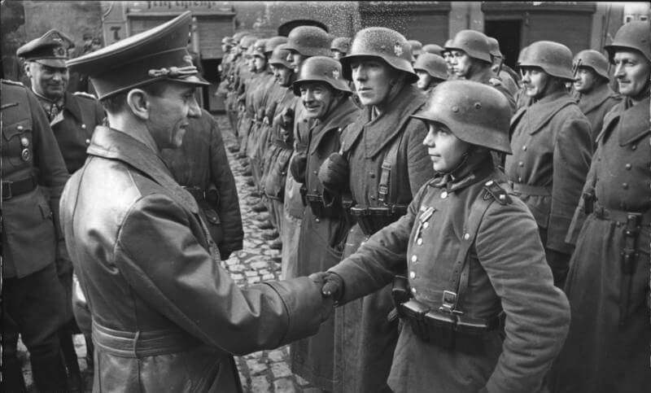

### 1 Front Białoruski

1 Front Białoruski zajął Kościerzynę (49 Armia), Skarszewy i Słupsk.

### Częstochowa

Wraca normalne życie do polskich miast. W Częstochowie powstaje klub siatkarski AZS Częstochowa.

### Bombardowanie Essen

220 samolotów zbombardowało rafinerię i węzeł kolejowy w Essen. Jest to ostatnie bombardowanie Essen.

### Rajd na Granville

Wyspy Normandzkie znajdujące się u brzegów Francji są terytorium brytyjskim. W 1940 znalazły sie pod okupacją niemiecką i było to jedyne terytorium brytyjskie okupowane przez Niemców. Były strzeżone przez całą dywizję. Po inwazji w Normandii pozostawiono je nieatakowane, głównie dlatego, że zdobycie ich byłoby krwawym, bezsensownym bojem.

W grudniu 1944 czterech niemieckich jeńców wojennych uciekło z obozu w Granville i kradzioną barką desantową LCVP dostali się na wyspy. Przekazali informacje o obozie, porcie i wszystkim co się tam znajduje. W tym czasie niemieckie załogi cierpiały już na braki w zaopatrzeniu. Byli odcięci od dostaw. Poza tym dowództwo dostrzegło okazję do podniesienia morale.

W nocy z 8 na 9 marca kilkanaście jednostek pływających dokonało rajdu na Granville, dzięki znajomości portu wylądowali bez oporu i strat. Na miejscu doszło do walki w której po stronie alianckiej zginęło 20 ludzi, po niemieckiej 6. Uwolniono 67 jeńców i zrabowano jeden węglowiec.

Dowódca operacji kapitan porucznik marynarki Carl-Friedrich Mohr Krzyżem Kawalerskim Krzyża Żelaznego

- [Mark Felton Productions "German Sea Wolves - The Granville Raid 1945" [YT 11:18]](https://www.youtube.com/watch?v=s7szB5So5Gs)
- [Granville raid](https://en.wikipedia.org/wiki/Granville_raid)

### Operation Sunrise

Jesienią 1944 Armia Czerwona wkroczyła do doliny Dunaju, 26 grudnia zaczęła się bitwa o Budapeszt, który został zdobyty 13 kwietnia 1945, a siły sowieckie parły na Wiedeń.

Niemcy trzymali się w dolinie Padu, ale alianckie bombardowania poważnie ograniczyły ich dostawy przez przełęcz Brenner. Sytuacja wojsk niemieckich we Włoszech była coraz gorsza.

W tej sytuacji zaczęły się negocjacje. Najwyższy Dowódca SS i Policji we Włoszech, generał Waffen SS Karl Wolf zaproponował rozmowy. 23 lutego 1945 agent OSS Allen Dulles (późniejszy dyrektor CIA) przyjął tę propozycję by rozpocząć własną grę.

Pierwotny plan Niemców polegał na oddaniu bez walki północnych Włoch po to, żeby wycofać Grupę Armii C do Niemiec gdzie dalej by walczyła. Nie było mowy o kapitulacji.

Do spotkania doszło 8 marca w Lucernie. Wolf był przekonany, że akceptacja jego plany może stworzyć przełom i doprowadzić do rozpadu koalicji Wielkiej Trójki. Dulles poinformował ich, że to nie wchodzi w grę, mogą jedynie negocjować poddanie się aliantom zachodnim. Feldmarszałek Albert Kesselring skomentował to "zakończenie walk nie będzie w ogóle brane pod uwagę, dopóki żyje Führer". Negocjacje jednak kontynuowano przy współpracy szwajcarskiego wywiadu.

12 marca powiadomiony o tym został Mołotow, który powiedział, że nie ma nic przeciwko temu, jeżeli będą brali w tym udział przedstawiciele sowieccy. To jednak nie nastąpiło, co doprowadziło do poważnego kryzysu dyplomatycznego. 22 marca Mołotow napisał notę dyplomatyczną. Nastąpiła wymiana listów Roosevelt - Stalin 25 - 29 marca. Był to do czasu rozpoczęcia Zimnej wojny najpoważniejszy kryzys na linii Moskwa - Waszyngton.

Sprawę komplikował fakt, że Wolf był zagorzałym antysemitą, współorganizatorem Holokaustu i zbrodniarzem wojennym odpowiedzialnym za zamordowanie setek tysięcy ludzi. A wyglądało na to, że Amerykanie, a konkretnie Dulles wykraczający poza swoje kompetencje obiecał mu bezkarność. Prezydent Harry Truman oficjalnie zamknął rozmowy z Niemcami w Szwajcarii, ewentualne wykroczenia poza ustalenia z Casablanki można było zrzucić na nieżyjącego już Roosevelta. Ponadto upewnił się, że sowiecki generał był reprezentowany na rozmowach w Caserta we Włoszech, które sfinalizowały kapitulację całych sił.

Ostatecznie podpisanie kapitulacji nastąpiła 29 kwietnia, tuż przed śmiercią Hitlera. Porozumienie miało wejść w życie 2 maja.

- [Operation Sunrise](https://en.wikipedia.org/wiki/Operation_Sunrise_(World_War_II))

### Lubań

To, co się stało w Lubaniu w dniach 6-8 marca pokazała, że armia niemiecka na wschodzie nie utraciła lokalnej zdolności ofensywnej. Było to poważnym ostrzeżeniem, którego jeden z niesławnych polskich dowódców nie dostrzegł w porę.

17 lutego 3 Armia Pancerna generała Rybałki realizując plan zdobycia pozycji wyjściowych do ataku na Berlin, w drodze na Goerlitz zdobyła Lubań (niem. Lauban). W kalkulacjach Schörnera Lubań stał się kluczową pozycją do walki o Wrocław. Sformował Grupę Pancerną Nehring pod dowództwem znanego nam już z opowieści o "wędrującym kotle" generała Walthera Nehringa, Grupa składała się z oddziałów XXXIX i LVII Korpusu Pancernego, w sumie 3 dywizje piechoty, 2 dywizje grenadierów i 3 dywizje pancerne. Skład zdawałoby się imponujący, ale podobnie jak w przypadku sił na linii Renu, liczebność pojazdów nie dochodziła do połowy składów etatowych, a żołnierze byli niewyszkoleni, brakowało też doświadczonych dowódców. Ale na korzyść Niemców działało zaskoczenie i brak przygotowania obrony sowieckiej na tym odcinku.

Początkowe uderzenie wyprowadzone 2 marca z zachodu wzdłuż szosy Zgorzelec-Bolesławiec utknęło w lasach koło Godzieszowa (niem. Günthersdorf), natomiast drugie uderzenie wzdłuż Kwisy od południa dotarło do Kotlisk (niem. Kesselsdorf). Armia Czerwona zatrzymała oba natarcia, jednak siłom zgrupowanym w Lubaniu zagroziło oblężenie i w tej sytuacji nie znając potencjału niemieckiego sowieci, zdecydowali się wycofać z tego regionu.

4 marca Niemcy zamknęli miasto w oblężeniu i w ciągu dwóch dni zdobyli słabo bronioną pozycję. 6 marca Grupa Nehringa odbija Lubań i wieść o tym natychmiast dociera do Berlina.

*"Reichspropagandaminister Goebbels begrüßt in Lauban (Niederschlesien) den mit dem EK II ausgezeichneten 16jährigen Willi Hübner, der während der Kämpfe um die Stadt im März 1945 im Schützengraben eingesetzt wurde." 
By Bundesarchiv, Bild 183-J31305 / CC-BY-SA 3.0, [CC BY-SA 3.0 de](https://creativecommons.org/licenses/by-sa/3.0/de/deed.en), [Link](https://commons.wikimedia.org/w/index.php?curid=5364865)*

Było to ostatnie zwycięstwo sił niemieckich na obecnych terenach polskich. Równie propagandowo niewygodne, jak i późniejsza masakra wojsk Świerczewskiego idących na Drezno i tak samo przemilczane. Dopiero po upadku PRL-u zaczęto badać i opisywać te wydarzenia.

8 marca, dzień po tym jak Amerykanie wdarli się do Remagen, do Lubania przybył minister propagandy Rzeszy, Joseph Goebbels i wygłosił przemówienie, zapowiadając, że odbicie Lubania będzie początkiem całej serii zwycięstw i odwróci losy wojny.

Oczywiście tak się nie stało. Armia Czerwona uznała swoją klęskę na tym odcinku, ale w niczym to nie przeszkodziło w budowaniu frontu na Nysie Łużyckiej i przygotowaniach do operacji berlińskiej, Lubań bowiem nie był niezbędnie potrzebny, tak samo zresztą, jak Wrocław. Niemcy zaś osiągnęli sukces, zdobywając ważny węzeł kolejowy na drodze do Wrocławia, ale tego sukcesu nie mogli w żaden sposób wykorzystać. Zaś straty jakie ponieśli, były nieodwracalne. Lubań był niezbędny dla zaopatrywania sił niemieckich na Śląsku, być może także dla utrzymania połączenia z Riese, co jednak nie miało takiego znaczenia jak możliwość zaopatrywania wojny na Śląsku.

Co zaś do przemówienia Goebbelsa - był to łabędzi śpiew hitlerowskiej propagandy. Goebbels w tym czasie już mówił sam do siebie. Jego wizytę w Lubaniu zarejestrowano w kronice filmowej i z pewnością emitowano przez radio. Jednak żadne ze źródeł informujących o sytuacji w oblężonym mieście, ani Peikert, ani Horning, ani Laßmann, ani Hartung, ani nawet Niehoff nie wspominają o tym przemówieniu ani słowem.

W ogóle we Wrocławiu nikt go nie słucha. Nawet nowy komendant generał Hermann Niehoff nie nawiązuje do jego słów, ani nie wspomina Lubania w mowie opublikowanej w gazecie frontowej 9 marca. Czy jest to celowe przemilczenie, dające wiele do zrozumienia Gauleiterowi, który wszak z Lubania pochodzi?

Z powodu złej pogody wrocławianie mają chwilę spokoju. Ale nic nie chroni ich przed terrorem twierdzy. A staje się on nienasyconą bestią.

Bohaterem dnia hitlerowskiej propagandy staje się 16-letni wówczas Wilhelm "Willi" Hübner, który zostaje odznaczony tym samym Krzyżem Żelaznym drugiej klasy trzykrotnie. Pierwsze dwa razy miały miejsce w Lubaniu 8 marca.

Najpierw chłopca odznaczył i udekorował komendant miasta major Max Tschuschke. Miało to miejsce na dziedzińcu obecnego Zespołu Szkół przy ul. Mickiewicza 1. Potem odbyła się druga dekoracja, na rynku Lubania przed kamerami uroczyście odznaczenia pogratulował Joseph Goebbels.

Potem uznano, że chłopiec który zniszczył czołg i został odznaczony orderem za odwagę bitewną jest tak wielkim skarbem propagandowym, że trzeba ja wykorzystać jeszcze raz. Willi po raz drugi zostaje oficjalnie odznaczony tym samym Krzyżem Żelaznym drugiej klasy, ale tym razem przez szefa Hitlerjugend Reichjugendführera Artura Axmanna oraz samnego Hitlera. Przywieziono go specjalnie do Berlina i uroczysta dekoracja odbyła się 20 marca 1945 przed kamerami przy bunkrze.

- Rare Historical Photos ["Wilhelm 'Willi' Hübner - one of the youngest recipients of the Iron Cross, 1945"](https://rarehistoricalphotos.com/wilhelm-willi-hubner-1945/)

### Kołobrzeg

O godz. 0600 w okolice wzgórza 5,5 na zachód od Kołobrzegu dociera dwóch żołnierzy WP: plutonowy Kazimierz Grzejek oraz politruk Zygmunt Pączka. Wzgórze to znajduje się tuż nad morzem i byli to pierwsi polscy żołnierze 1 Armii WP, którzy dotarli do Bałtyku. Na wieść o tym dwie godziny później w to sam o miejsce dociera zwiad oficerski pod dowództwem Leona Piworowicza.

Rano 16 i 18 pułki piechoty 6 DP nacierają a Kołobrzeg od zachodu. Pod silnym ogniem obrońców natarcie załamuje się. 18 pułk zostaje skierowany do natarcia wzdłuż szosy trzebiatowskiej. Kolejne natarcie o godz. 1700 bez sukcesu.

Na koniec dnia polskie oddziały są w tym samym miejscu.

W nocy do sił oblegających Kołobrzeg dociera 3 DP WP.

- Olaf Popkiewicz ["Bój o Kołobrzeg 1945" [YT 1:12:56]](https://www.youtube.com/watch?v=FRcRu3hCS4c)
- Twierdza Kołobrzeg [7-8 marca: U bram miasta](https://twierdzakolobrzeg.pl/twierdza/rok-1945/194-7-8-marca-u-bram-miasta)

### Obietnica Schõrnera

Rojenia o walce i ataku nie były zarezerwowane tylko dla pozbawionych przytomności ofiar wojny, wielu dowódców miało takie same, tak samo realne plany i to w pełnym stanie przytomności, być może dopiero marzec 1945 jest miesiącem, podczas którego Niemcy ostatecznie utracą wszelką nadzieję na zwycięstwo. Gorączkujący mężczyzna opisywany przez Hartunga jest usprawiedliwiony, jako osoba pogrążona w malignie nie ma kontaktu z rzeczywistością. Jak wyglądał kontakt z rzeczywistością dowódcy Grupy Armii Środek, informują nas Ahlfen i Niehoff:
>Pierwszemu komendantowi odmówiono koniecznego wsparcia w postaci kompetencji i środków. Drugiemu lekceważąc jego pracę, odmówiono zaufania. Trzeciemu zaś dano na drogę obietnice wysokiego rangą dowódcy, obietnicę przeznaczoną dla wrocławskich żołnierzy i obywateli, poważnie przez nich potraktowaną, której niespełnienie groziło utratą zaufania.

Tą obietnicą, o której już pisałem, cytując Hargreavesa, dotyczyła przerwania oblężenia i lądowej pomocy dla garnizonu. Jeszcze 2 marca taka pomoc to był tylko sowiecki podstęp, dwa dni później wrocławianie zostali pouczeni pod groźbą kary, żeby nie ulegać tego typu pogłoskom. Teraz, wraz z pojawieniem się kolejnego komendanta, staje się to oficjalną dyrektywą na przyszłość:
>Schõrner planował bowiem nie tylko odsiecz dla Wrocławia, lecz także chciał silną, gromadzącą się między Strzelinem a Ziębicami, tzn. 50 km na południe od Wrocławia, grupą uderzeniową przerwać pierścień oblężenia wokół miasta, a następnie wspólnie z wrocławskimi oddziałami przejść z głębokiej flanki na tyły idących na Berlin sił nieprzyjaciela. Nie miejsce tu na fachową ocenę tego raczej fantastycznego - w obliczu ówczesnych mocno ograniczonych możliwości - niż realistycznego planu. dysponujemy natomiast własnymi obliczeniami Niehoffa, sporządzonymi po wystąpieniu z naczelnego dowództwa 17. Armii, opiewającymi na sześć tygodni.

"Raczej fantastycznego", to mógłby rzec baron Münchhausen, obserwując bieg myśli Schõrnera z perspektywy dosiadanej przez siebie armatniej kuli. Wyprowadzenie garnizonu wrocławskiego z miasta i rzucenie go razem z resztą wojsk pozostających pod komendą Ferdinanda Schõrnera na flankę 1 Frontu Białoruskiego to plan, którego jedynym elementem mającym szanse powodzenia było samobójstwo.

I trudno doprawdy dociec, czy jest to już zbiorowy münchhausen, czyli myślenie życzeniowe, bo może po prostu tak bardzo chcieli wierzyć w sens dalszej walki, że racjonalizowali rojenia bez względu na koszty, czy może wciąż mając Armię Czerwoną 60 km od Berlina, lekceważyli jej potęgę. Nawet zakładając sukces na początkowym etapie i zdolność do wyprowadzenia ataku na Front Białoruski pozbawione zaplecza siły Schörnera miały szansę co najwyżej wywołać kilka dni zamieszania na sowieckich tyłach.

### Komendant

Obaj generałowie przebywający we Wrocławiu mają ważniejsze sprawy, każdy inną. Jak twierdzi Hornig:
>Przyczyną tego, że von Ahlfen pozostawał jeszcze w twierdzy, był bez wątpienia przygotowywany przeciwko niemu proces. Chodziło przy tu dosłownie o jego głowę, gdyż stawiane mu zarzuty były bardzo poważne: nieumiejętność oceny sytuacji, niewiarygodność doniesień o stanie amunicji i wysokości strat, krytyka najwyższego dowództwa, pogardliwe traktowanie kierowniczej roli Gauleitera, bezwład pozycji bojowych, kiepskie dowodzenie i organizacja. Niehoff próbował odciążyć von Ahlfena w pisemnej opinii, którą dał mu na tą ciężką drogę. Von Ahlfen potwierdził później, że odważne opowiedzenie się Niehoffa po jego stronie uratowało mu życie i honor.

8 marca von Ahlfen uzbrojony w dokumenty, które mają zapewnić mu obronę, opuszcza Wrocław.

### Twierdza

Ksiądz Peikert:
>Mnożą się wieści ze wszystkich części miasta o niszczycielskich pożarach, o waleniu się domów, które grzebią żywcem pod gruzami ludzi i których nikt nie zabezpiecza. Palą się budynki oraz wielkie domy handlowe, jak np. Dyckhoff przy Ohlauerstraße lub Bielschowsky przy Königsplatz i inne, którym po prostu daje się spłonąć wraz z cennymi zapasami i magazynami, nie czyniąc nic dla zlokalizowania pożaru. My, Niemcy, zdajemy się w chwili obecnej jeszcze tylko ćwiczyć w sztuce podkładania ognia, ale nie w jego gaszeniu. Zabitych również pozostawia się pod gruzami zwalonych domów, a zdziczenie i pogardliwy brak wszelkiej czci dla umarłych szerzy się zwłaszcza wśród żołnierzy. [...] Zewsząd nadchodzą liczne wiadomości o plądrowaniu przez żołnierzy Wehrmachtu i Volkssturmu próżnych mieszkań po przymusowej ewakuacji, i to zarówno na peryferiach miasta, jak i w centrum. 
>Tak na przykład przy jednym rannym w szpitalu znaleziono 13 zegarków. Wszelki respekt dla własności bliźniego tępią systematycznie organa partyjne. Wiedzą, że wszystko tracą, czemuż więc inni mają coś posiadać! O nowym komendancie twierdzy, generale-poruczniku Niehoffie, dowiaduję się, że był kiedyś majorem policji porządkowej we Wrocławiu i że jest członkiem SS. Odznaczony „liśćmi dębowymi”, jest jednym z tych generałów partyjnych, którzy przekładają ślepe posłuszeństwo dla obłąkanego rządu nad dobro i cierpienia narodu, gotowi poświęcić naród do reszty. Biedny Wrocław, wydany teraz dwu brutalnym naturom: takiemu Hankemu i takiemu Niehoffowi. Jeśli dotychczas trafiały się jeszcze ludzkie odruchy wobec cierpień ludności w twierdzy, to w przyszłości nie ma co na nie liczyć. Rzuci się na ofiarę wszystkich ludzi i cały dorobek kultury, na koniec zaś obaj luminarze partyjni udadzą się samolotem do swej wielkiej naturalnej twierdzy w południowych Niemczech, aby tam wraz z Hitlerem ułożyć ostatni akt tego koszmarnego dramatu".

Osobliwa kombinacja daremnego heroizmu, niepowstrzymanej destrukcji, śmierci ludzi i miasta.
