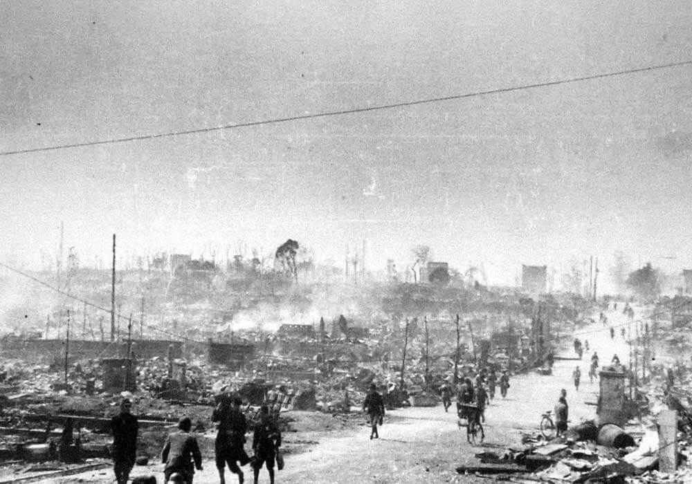

### BI-1

Ostatnia już próba sowieckiego myśliwca rakietowego BI-1 opisanego 24 stycznia. Dalszy rozwój tego samolotu został wstrzymany.  To nie koniec rozwoju samolotów rakietowych w sowietach. Przyszłością jest napęd turboodrzutowy, ale wciąż prowadzi się prace nad napędem rakietowym, który umożliwia osiągnięcie większych prędkości, szczególnie prędkości wznoszenia. Ostatnim sowieckim samolotem rakietowym jest MiG I-270, który z BI-1 brał napęd, a formę z Me 263 (następca Me 262). W grudniu 1946 odbyła się próba w locie szybowym (bez pracującego silnika). W 1947 powstał kolejny prototyp już z silnikiem rakietowy, ale uległ zniszczeniu podczas lądowania. Dalsze próby wstrzymano, ponieważ do tego czasu silniki turboodrzutowe udowodniły swoją wyższość, a rolę samolotów przechwytujących zaczęły pełnić rakiety plot.

Inne ważniejsze projekty samolotów rakietowych:

- **Messerschmitt Me 163 Komet**, najbardziej znana konstrukcja tego typu i jedyna, która rzeczywiście wzięła udział w działaniach wojennych. Śmiertelnie niebezpieczny samolot o komicznym zasięgu wynikającym z ograniczenia czasu lotu do 10 minut. Alianci nie mieli jak ich niszczyć, więc omijali lotniska, na których bazowały.
- **Mitsubishi J8M**, japońska kopia Kometa.
- **Yokosuka MXY-7 Ohka**, latająca bomba kamikaze o zasięgu 37 km.
- **Bell X-1**, samolot eksperymentalny, który umożliwił przekroczenie prędkości dźwięku. Oblot 16 stycznia 1946. To na nim Chuck Yeager 14 października 1947 po raz pierwszy na świecie w udokumentowany sposób przekroczył prędkość 1 Mach. Co interesujące, powstał na bazie brytyjskiego naddźwiękowego samolotu odrzutowego **Miles M.52**, który ze względów budżetowych w lutym 1946 został przerwany na etapie zaawansowanego projektu, bezzałogowe modele tego samolotu osiągały prędkość 1,38 Mach.
- **North American X-15**, jeden z najbardziej znanych samolotów eksperymentalnych, odbywał loty suborbitalne, w 1963 przekroczył umowną granicę kosmosu osiągając pułap 106 km. W 1967 osiągnął niepobity dotąd rekord prędkości samolotu załogowego 7_274 km/h (5,89 Mach).

Z powodu niezależności od dopływu tlenu atmosferycznego samoloty rakietowe odegrały ogromną rolę w powstawaniu amerykańskiej technologii kosmicznej.

- [Rocket-powered aircraft](https://en.wikipedia.org/wiki/Rocket-powered_aircraft)

### Tokio

Dziś w nocy w ramach operacji Meetinghouse 279 bombowców B-29 dokonało bombardowania dywanowego Tokio, zrzucając 1650 ton bomb zapalających.

<SeeAlso txt="Wojna na Pacyfiku 1945" url="/festung-breslau/article/pacyfik-1945" />

Porównajmy to z Dreznem, Hamburgiem czy innymi niemieckimi miastami, gdzie flotylle bombowców sięgały tysiąca i więcej samolotów. Tutaj zaangażowane są relatywnie niewielkie siły. Ale użyto bomb zapalających, a prawie cala zabudowa Tokio jest drewniana, Powstaje gigantyczna burza ogniowa, którą może zatrzymać tylko brak paliwa. A Tokio jest gigantyczne. Tysiące ludzi zostało uwięzionych między pożarami i nie mając jak ani którędy uciekać, znalazły się w potrzasku śmiertelnej pułapki. Zewsząd otaczała ich łuna i coraz bardziej dusił dym.

Pożar trwał do rana. Całkowicie wypalone zostało 40 km2, liczba ofiar jest trudna do oszacowania, ale zwykle podaje się zaokrąglone 100 tys. zabitych. Było to najbardziej niszczycielskie i mordercze bombardowanie w historii.

<BoxImageWrapper>

Tokio kilka dni po bombardowaniu. 
By English: Ishikawa Kōyō - English: "Since the photo uploader does not show the source, it is unknown where I brought this picture, but the picture was taken on 116, 117 pages of "The Great Tokyo Air Raid Assault Photo Book" issued on August 15, 1953 (couple shop) The copyright problem has been cleared because it is posted with the caption of "near Ushigome Ichigaya (April 14)". According to the original description of the photo uploader, photography was taken around March 10, 1945, but according to the "Tokyo Great Air Raid Assault Photo Album" it is April 14. Since it is unknown which is correct, I posted the uploader's original description preferentially.", Domena publiczna, [Link](https://commons.wikimedia.org/w/index.php?curid=3681459)
</BoxImageWrapper>

### Kołobrzeg

Natarcie 7 pułku 3 DP wzdłuż szosy karlińskiej na kościół św. Jerzego, który stanowi centrum niemieckiej obrony na tym odcinku. Podobnie jak wczorajsze załamuje się pod silnym ogniem nieprzyjaciela. Wysokie straty i niepowodzenie szturmu wynikają z wysokiego nasycenia obrony bronią maszynową, gł CKM-ami oraz równego terenu bez żadnych przeszkód i drzew.

Podobnie zmasakrowany jest 1061 pułk 272 DP 19 Armii sowieckiej atakujący od wschodu.

Również niepowodzenie kończą się kolejne ataki pułków 6 DP na wczorajszych pozycjach.

Zapada decyzja o zmianie strategii. Dotychczasowa taktyka ataku wzdłuż dróg wynikała ze spiętrzenia przez Niemców Parsęty i zalania pól wokół Kołobrzegu. Okoliczne pola i łąki to był teren podmokły a rowy melioracyjne były zalane wodą. W nocy z 9 na 10 marca polscy saperzy budują kładki przez rowy. Jutro kolejny atak. Czy zakończy się powodzeniem?

- Twierdza Kołobrzeg [9 marca: Odcinek 16 pułku piechoty](https://twierdzakolobrzeg.pl/twierdza/rok-1945/195-9-marca-odcinek-16-pulku-piechoty)
- Olaf Popkiewicz ["Bój o Kołobrzeg 1945" [YT 1:12:56]](https://www.youtube.com/watch?v=FRcRu3hCS4c)

### Gdańsk

Załamała się linia obrony na wysokości Kartuz. Gdańsk nie będzie się bronił na przedpolu. Armia Czerwona nie ma już żadnej przeszkody po drodze.

Bitwę o Gdańsk wspomina Wolfgang Drost, syn ostatniego niemieckiego dyrektora Muzeum Miejskiego w Gdańsku prof. Willego Drosta:
>9 marca: liczne pożary, płonie m.in. dom bractw kurkowych pełen uciekinierów, obóz jeniecki na Biskupiej Górce, barak szpitala miejskiego; 16 marca: ciężkie naloty, rozległe pożary, zniszczony kwartał między ulicami Ogarną, Słodowników i Zbytki, spichlerze na Wyspie Spichrzów, ulice Długie Ogrody, Szeroka, Wałowa;

Telegraficznie, ale widać, że jest to dokładnie to samo co we Wrocławiu. Najgorsze przyjdzie po bitwie.

- [Heinz Voellner "Bitwa o Gdańsk 1945"](https://wiekdwudziesty.pl/bitwa-o-gdansk-1945/)

### Wrocław

Ksiądz Laßmann tworzy wątkowy crossover łącząc narracje Hartunga i Peikerta:
>Odwiedziłem ks. Peikerta, proboszcza parafii św Maurycego, który także pozostał w mieście. Od niego udałem się do szpitala oo, Bonifratrów, którzy uwijali się wśród niezliczonej rzeszy rannych. Rozległą piwnicę pod szpitalem przekształcono w lazaret, gdzie również wszystkie miejsca były zajęte. [...] Kiedy odwiedzam ks. Dittricha, proboszcza św. Krzyża zastaję go bardzo przybitego. Doszedł teraz do wniosku, że popełnił błąd, namawiając swoich parafian do pozostania w mieście.

Wzmiankowany ksiądz Peikert:
>Natomiast buchające kłęby dymu wskazują, że również wszędzie w centrum miasta spadły bomby zapalające, które wznieciły wielkie pożary. Znów opłakuje się szereg śmiertelnych ofiar. Zabici w zbombardowanych domach zdają się nie sprawiać już żadnego wrażenia. Nie robi się nic, aby wydobyć drogie ciała. Naloty trwają cały dzień. Ponieważ pada śnieg, a chmury śniegowe zwisają nisko, to i nieprzyjacielskie samoloty latają całkiem nisko; są wśród nich trzymotorowe, których huk jest tak wielki, że zdaje się, iż zerwą dach nad głową. [...] Gdzie zatrzyma się ten obłęd niszczenia rządu, co przestał służyć dobru narodu? Taki rząd poświęci wszystko do ostatka, aby się utrzymać. Na podstawie zarządzenia o powszechnym obowiązku pracy z 7 marca 1945 tworzy się z mężczyzn i kobiet oddziały, których zadaniem jest usuwanie z mieszkań na górnych piętrach wszystkich ruchomości i prowiantów po przymusowo wysiedlonych. Jeszcze nie powiedziano, co się z tym ma stać. W każdym razie sprzęty domowe zniesie się zapewne na stos i spali. Obłęd niszczenia narodu niemieckiego! Wysługiwać się przy tym muszą sami Niemcy.

Samolotom latającym nad Wrocławiem poświęcony będzie osobny artykuł. Wśród bombowców używanych przez 2 Armię Lotniczą nad Wrocławiem nie było żadnych maszyn mających trzy silniki. Były tylko znane nam Pe-2 oraz dwie konstrukcje amerykańskie: Li-2, czyli Douglas DC-3 produkowany od 1938 na licencji amerykańskiej, samolot transportowy w wersji przerobionej na bombowiec, oraz B-25J Mitchell otrzymany w ramach Lend Lease. Wszystko to były maszyny dwusilnikowe. Jedynym latającym nad Wrocławiem trójsilnikowcem był Junkers Ju-52.

Dzień po opuszczeniu Wrocławia przez von Ahlfena Schlesische Tageszeitung publikuje odezwę kolejnego, trzeciego już komendanta twierdzy Hermanna Niehoffa:
>Mieszkańcy Wrocławia! 
>Z rozkazu Führera przejąłem dowodzenie nad Twierdzą Wrocław. 
>Od chwili mojego przybycia do twierdzy widziałem wspaniałą postawę ludności i zauważyłem, że we wszelkich dziedzinach robi się to co trzeba, a właściwe siły są zaangażowane we właściwych miejscach. 
>Walka zahartowała was i wzmocniła waszą zdolność do stawiania oporu. 
>Mam silne przekonanie, że każdy walczący, każdy pracujący, każda kobieta oraz nie mniej ważna młodzież Wrocławia dają z siebie wszystko, żeby uchronić swój dom. 
>Biorąc pod uwagę nasz zacięty opór i odwagę okazaną przez załogę twierdzy, potężnie wspieraną przez naszą wielką Ojczyznę, jestem mocno przekonany, że do nas będzie należało końcowe zwycięstwo i utrzymamy twierdzę do czasu gdy los się odmieni. 
>Oczy Führera i całych Niemiec są skierowane na nas. 
>Niech żyje Führer!

Interesujące, że Niehoff w żaden sposób nie nawiązuje do Lubania, ani do jego zajęcia, które przecież było mocno nagłośnionym zwycięstwem niemieckim, ani do ważnego przemówienia ministra propagandy Rzeszy. Niehoff nie pisze, że cokolwiek zmieni, wręcz przeciwnie zapewnia, że wszystko jest w porządku, że wrocławianie bronią się dzielnie a zwycięstwo. No cóż wystarczy walczyć żeby zwyciężyć. Czy i jeśli w ogóle coś, to co myślał Niehoff o atakowanej Moskwie, oblężonym Leningradzie, kotle stalingradzkim, bombardowanej Warszawie... - tego się nigdy nie dowiemy.

### Odnośniki

- Lend-Lease - Сайт о программе Ленд-Лиз [The B-25 Mitchell in the USSR](https://lend-lease.net/articles-en/the-b-25-mitchell-in-the-ussr/)

