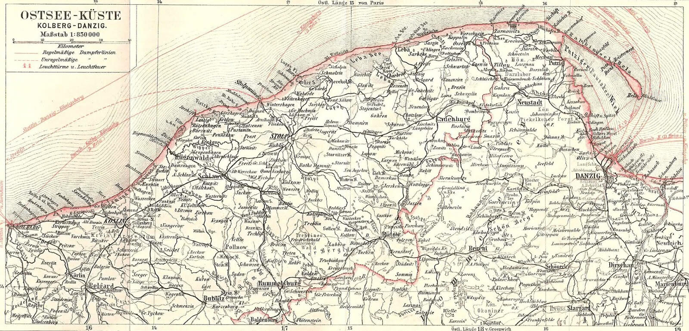

### Ronald Balfour

Niemieckie miasta Kleve i Goch (Nadrenia Północna-Westfalia, 50 km na WN od Essen) zostały zdobyte 11 i 20 lutego 1945. Przydzielony do 1 Armii kanadyjskiej brytyjski oficer Ronald Balfour nie był typowym żołnierzem. Służył w Monuments Fine Arts and Archives Section (MFAA), był znanym historykiem specjalizującym się w średniowieczu, członkiem King's College (Cambridge). Jego zadaniem było ratowanie ze zniszczeń wojennych, a właściwie powojennych cennych dóbr kultury.

Odział Monuments, Fine Arts, and Archives (pl. Zabytki, Sztuki Piękne i Archiwa) powstał w 1943. Przewidywano, że działania wojenne spowodują katastrofalne zniszczenia. Im nie można było zapobiec, ale przez szybkie działanie, wkroczenie razem z linią frontu, można było zapewnić odpowiednią opiekę, rejestrację i zabezpieczenie najważniejszych zabytków. Czasem można było przekonać wojskowych, żeby nie niszczyli jakiegoś obiektu, a na pewno można było wymóc pilnowanie go i zabezpieczenie przed grabieżą.

MFAA grupowała czołowych badaczy historii i historii sztuki z USA i UK. Mówiono na nich "Monuments Men" i taki też tytuł ma film na ich temat z 2014. Była to prawdziwie elitarna służba, która stworzyła nowy standard w dziedzinie opieki nad zabytkami. Zadania przed którymi stanęli były dotąd nieznane w historii sztuki. Mieli zabezpieczyć i zinwentaryzować tysiące, a właściwie dziesiątki tysięcy dzieł sztuki zagrabionych przez Niemców ze wszystkich okupowanych krajów.

Praca przy kolekcjach sztuki była bezpieczna, ale zadanie ratowania od zniszczeń obiektów na pierwszej linii frontu wiązało się z poważnym ryzykiem. Ronald Balfour zasłużył się dla miasta Kleve ratując wiele bezcennych obiektów, najważniejszym była monumentalna XIV-wieczna Gochse Steintor. Balfour przekonał kanadyjskich saperów, żeby jej nie wysadzali.

10 marca z dwoma niemieckimi cywilami przenosił w bezpieczne miejsce fragment ołtarza, kiedy zabiła go eksplozja niewybuchu. Był jednym z dwóch Monuments Men zabitych na służbie. W miastach Kleve i Goch Balfour jest upamiętniony ulicą.

- [The German towns of Kleve and Goch were captured on 11 and 20 February 1945. Ronald Balfour, a member of the Monuments Fine Arts and Archives Section (MFAA) and a specialized British officer of the Canadian 1st Army, immediately visited the sites to protect historically significant buildings, art objects and documents from destruction and looting. ](https://www.facebook.com/joelstoppelsbftours/posts/3102590156676930)

### 2 Front Białoruski

2 Front Białoruski: Lębork, Łeba, Kartuzy!

<BoxImageWrapper>

Pomorze Gdańskie, od Kołobrzegu po Malbork. 
Von unbekannt (Bibliographisches Institut) - Meyers Reisebücher, "Ostseebäder und Städteder Ostseeküste", 4. Auflage, Bibliographisches Institut, Leipzig und Wien1910, S. 146, [PD-alt-100 - Die Regelschutzfrist für das von dieser Datei gezeigte Werk ist nach den Maßstäben des deutschen, österreichischen und schweizerischen Urheberrechts (70 Jahre nach dem Tod des Urhebers) vermutlich abgelaufen. Es ist daher vermutlich gemeinfrei.](https://de.wikipedia.org/wiki/Datei:Ostseek%C3%BCste_Kolberg_-_Danzig_1910.jpg), [Link](https://de.wikipedia.org/w/index.php?curid=6741731)
</BoxImageWrapper>

### Tokio

Tokio płonie.

### Filipiny

Na Filipinach zniesiono ruch lewostronny. Upadek brytyjskiego dominium dokonuje się po kawałku.

### Kołobrzeg

Sukces! Kilkuminutowy ostrzał artylerii niszczy karabin maszynowy na wieży kościoła św. Jerzego. Polscy żołnierze z 7 i 18 pułku wdzierają się do świątyni i zdobywają 8 okolicznych domów. Wspomagające natarcie dwa działa samobieżne Su-76 rozwalają mur cmentarza, zaczyna się walka o zaciekle broniony cmentarz, wkrótce potem jeden płonie, drugi jest uszkodzony. Walki o cmentarz nie zakończą się tego dnia.

Powstaje "przyczółek kołobrzeski", walki na przedmieściu lęborskim szybko uczą warunków boju w mieście. Zaciekła i bezwzględna walka podobna do tego co się dzieje we Wrocławiu. Koszt tego pierwszego polskiego zwycięstwa w kołobrzegu jest ogromny, tego dnia ginie 44 polskich żołnierzy.

Atakujący na linii ul. Trzebiatowskiej 18 pułk jest wykrwawiony, zostaje wycofany a jego miejsce zajmuje 14 pułk.

16 pułk bez powodzenia atakuje od zachodu silnie ufortyfikowany i poprzecinany rowami melioracyjnymi Lasek Załęże. 

- Olaf Popkiewicz ["Bój o Kołobrzeg 1945" [YT 1:12:56]](https://www.youtube.com/watch?v=FRcRu3hCS4c)
- Gazeta Muzealna ["Jak nadmorskie miasto zamieniono w twierdzę"](http://www.gazetamuzealna.kolobrzeg.pl/lato-czerwiec-2019/jak-nadmorskie-miasto-zamieniono-w-twierdze/)
- Twierdza Kołobrzeg [Rok 1945](https://twierdzakolobrzeg.pl/twierdza/rok-1945) | [10 marca: Odcinek 7 pułku piechoty](https://twierdzakolobrzeg.pl/twierdza/rok-1945/196-10-marca-odcinek-7-pulku-piechoty)

### Sudety

Kolejna katastrofa wrocławskiego mostu powietrznego. W pobliżu Strzechy Akademickiej k. Karpacza rozbił się Ju-52 z 2 Pułku Lotnictwa Transportowego. Leciał z Wrocławia z rannymi.

- [Ju-52 rozbity w Karkonoszach – 10 marca 1945 r.](https://www.facebook.com/bobr1945/posts/ju-52-rozbity-w-karkonoszach-10-marca-1945-rw-dniu-10-marca-1945-roku-w-rejonie-/3472460359534269/)

### Wrocław

Dzisiaj tzn., 10 marca 2020 mieliśmy we Wrocławiu piękną wiosenną pogodę, tymczasem 75 lat temu wrocławianie cieszyli się z powrotu zimy, która dawała szansę na chociaż jedną noc spokojnie przespaną:
>Po nocy ze śnieżycą, nie oświetlanej przez nieprzyjacielskie samoloty, mogła ludność Wrocławia raz się spokojnie wyspać. Rankiem powiał ciepły halny wiatr. Deszcz lał strugami.

Jak dalej opisuje Peikert, wytchnienie od jednego terroru nie daje swobody od drugiego, miejscowego:
>W następstwie rozporządzenia o obowiązku pracy z 7 marca 1945 r. rozpoczyna się nieznośny terror obwodowych organów partyjnych wobec ludności. Jest nie do wiary, z jak niesłychaną brutalnością traktuje się niemieckich obywateli, którzy dotychczas wszystko poświęcili w służbie ojczyzny. Używa się ich zwłaszcza do robót ziemnych na przygotowywanym pasie startowym od ulicy Szczytnickiej do Mostu Szczytnickiego. Całe bloki mieszkalne padają ofiarą tego projektu, nie rudery chylące się do upadku, lecz nowocześnie urządzone, solidne budynki, przedstawiające dużą wartość. Dzisiaj nadchodzi wiadomość, iż pas startowy obejmie także nieruchomość kościoła Św. Piotra Kanizjusza i że kościół z probostwem zostaną wysadzone w powietrze. Czy ten sam los spotka kościół Lutra, jeszcze mi nie wiadomo. Kościół Piotra Kanizjusza byłby więc trzecim, który padnie ofiarą tego straszliwego oblężenia.

Mało kto we współczesnym Wrocławiu wie, jak wyglądał i gdzie się znajdował kościół Lutra.

Hugo Hartmann odbywający rekonwalescencję w Lazarecie IVb, czyli klasztorze bonifratrów cytuje z datą 9 marca list:
>Szczytniki są podobno prawie nietknięte i tam właśnie za Odrą kwateruje się ludność ewakuowaną z południa. Po zimnych śnieżnych dniach dzisiaj pada deszcz, co daje nam trochę wytchnienia od wrogich nalotów, które w ostatnich dniach były bardzo natarczywe. To niesamowite jak dobre mamy wyżywienie, tyle mięsa i wędlin co teraz nie jedliśmy nawet w czasach pokoju. A do tego zachomikowałem dla Ciebie ponad czterysta papierosów, których co dzień przybywa. Kąpieli słonecznych zażywamy w kiblu.

Natomiast dziś odnotowuje w pamiętniku:
>Siostry z oddziału chorób zakaźnych przeprowadziły się do krypty pod kościołem przyklasztornym. Teraz żywi mieszkają tam w towarzystwie zmarłych braciszków. To jednak nikogo już dzisiaj nie bulwersuje. Byle tylko być jak najgłębiej pod ziemią - tam człowiek czuje się najbezpieczniej.

Tak właśnie wygląda w praktyce "*we wszelkich dziedzinach robi się to, co trzeba*" Niehoffa, zdanie o uniwersalnej wprost przydatności, które jednakowo może znaczyć "robimy co się da" jak i również "wszystko jest w porządku, tak jak powinno być". Co dokładnie to zdanie oznacza, przyszłość pokaże już wkrótce. Niestety.

Peikert cieszy się, z zimowej pogody, która jest udręką w mieście pozbawionym ogrzewania i ciepłej wody, ale daje wytchnienie od czegoś straszniejszego niż niewygody - nieprzyjacielskiego lotnictwa. Ta ulga jest jednak niezwykle krótka, bo jeszcze tego samego dnia jak pisze Hornig:
>Dnia 10 marca skończyła się nagle mroźna zimowa pogoda. Prawie w jedną noc zapanowały nagle umiarkowane temperatury z silnym deszczem, co było zapowiedzią zbliżającej się wiosny.

### Bomba balonowa Fu-go

Dzisiaj Japończycy zaatakowali amerykański program atomowy! Do tego niechcący.

W ostatnich dwóch latach wojny wypuścili na Amerykę 9300 papierowych balonów na wodór niosących ładunek 15 lub 17 kg bomb. każdy miał średnicę 10m. Balony te niesione prądem strumieniowym osiągały Amerykę Północną w ciągu trzech dni. Dzisiaj jeden z nich zaczepił o linię wysokiego napięcia, co spowodowało przerwę w dostawie prądu. Wszystkie trzy reaktory w Hanford stanęły. Ale na krótko.

Podobną operację (Operation Outward) przeprowadzili Brytyjczycy w latach 1940-44. Wysłali na Niemcy w sumie 99 tys. niepotrzebnych już balonów meteorologicznych o średnicy 2,5 m (czy słyszysz w tle "Neunundneunzig Luftballons"?). Część z nich miała ładunki wybuchowe i zapalające, ale połowa wlekła 200 m drutu. Liczyli na wywołanie awarii sieci energetycznej. Rezultaty można było ocenić dopiero po wojnie i wtedy się okazało, że kampania była bardzo skuteczna i spowodowała wiele zniszczeń. Stosunek kosztów do strat npla wynosi 1/5.

- Mark Felton Productions ["Japanese Balloon Bombs" [10:03]](https://www.youtube.com/watch?v=i8HrqNqXtTQ) | ["Killer Balloons: Britain's Secret Offensive Against Germany" [10:40]](https://www.youtube.com/watch?v=ioshB6dhe-0)
- Dark Docs ["Giant 5,000-Mile Bombs - Japan's Secret Attacks on America in WW2" [YT 13:13]](https://www.youtube.com/watch?v=1Sg6YhcZNsc) | ["Operation Outward" [YT 9:47]](https://www.youtube.com/watch?v=WZuwbOtIx-w)
- [Operation Outward](https://en.wikipedia.org/wiki/Operation_Outward)
