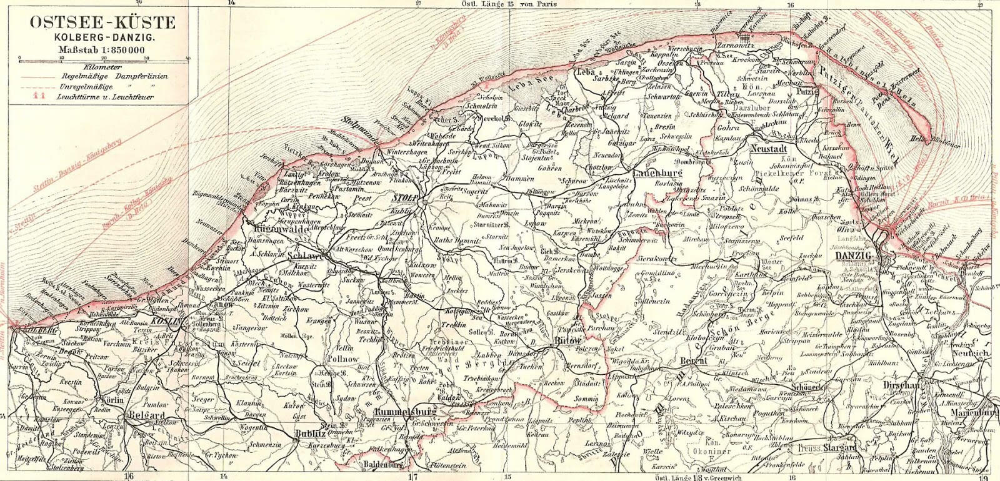

### 2 Front Białoruski

2 Front Białoruski: Lębork, Łeba, Kartuzy!

*Pomorze Gdańskie, od Kołobrzegu po Malbork. 
Von unbekannt (Bibliographisches Institut) - Meyers Reisebücher, "Ostseebäder und Städteder Ostseeküste", 4. Auflage, Bibliographisches Institut, Leipzig und Wien1910, S. 146, [PD-alt-100 - Die Regelschutzfrist für das von dieser Datei gezeigte Werk ist nach den Maßstäben des deutschen, österreichischen und schweizerischen Urheberrechts (70 Jahre nach dem Tod des Urhebers) vermutlich abgelaufen. Es ist daher vermutlich gemeinfrei.](https://de.wikipedia.org/wiki/Datei:Ostseek%C3%BCste_Kolberg_-_Danzig_1910.jpg), [Link](https://de.wikipedia.org/w/index.php?curid=6741731)*

### Tokio

Tokio płonie.

### Filipiny

Na Filipinach zniesiono ruch lewostronny. Upadek brytyjskiego dominium dokonuje się po kawałku.

### Sudety

Kolejna katastrofa wrocławskiego mostu powietrznego. W pobliżu Strzechy Akademickiej k. Karpacza rozbił się Ju-52 z 2 Pułku Lotnictwa Transportowego. Leciał z Wrocławia z rannymi.

- [Ju-52 rozbity w Karkonoszach – 10 marca 1945 r.](https://www.facebook.com/bobr1945/posts/ju-52-rozbity-w-karkonoszach-10-marca-1945-rw-dniu-10-marca-1945-roku-w-rejonie-/3472460359534269/)

### Wrocław

Dzisiaj tzn., 10 marca 2020 mieliśmy we Wrocławiu piękną wiosenną pogodę, tymczasem 75 lat temu wrocławianie cieszyli się z powrotu zimy, która dawała szansę na chociaż jedną noc spokojnie przespaną:
>Po nocy ze śnieżycą, nie oświetlanej przez nieprzyjacielskie samoloty, mogła ludność Wrocławia raz się spokojnie wyspać. Rankiem powiał ciepły halny wiatr. Deszcz lał strugami.

Jak dalej opisuje Peikert, wytchnienie od jednego terroru nie daje swobody od drugiego, miejscowego:
>W następstwie rozporządzenia o obowiązku pracy z 7 marca 1945 r. rozpoczyna się nieznośny terror obwodowych organów partyjnych wobec ludności. Jest nie do wiary, z jak niesłychaną brutalnością traktuje się niemieckich obywateli, którzy dotychczas wszystko poświęcili w służbie ojczyzny. Używa się ich zwłaszcza do robót ziemnych na przygotowywanym pasie startowym od ulicy Szczytnickiej do Mostu Szczytnickiego. Całe bloki mieszkalne padają ofiarą tego projektu, nie rudery chylące się do upadku, lecz nowocześnie urządzone, solidne budynki, przedstawiające dużą wartość. Dzisiaj nadchodzi wiadomość, iż pas startowy obejmie także nieruchomość kościoła Św. Piotra Kanizjusza i że kościół z probostwem zostaną wysadzone w powietrze. Czy ten sam los spotka kościół Lutra, jeszcze mi nie wiadomo. Kościół Piotra Kanizjusza byłby więc trzecim, który padnie ofiarą tego straszliwego oblężenia.

Mało kto we współczesnym Wrocławiu wie, jak wyglądał i gdzie się znajdował kościół Lutra.

Hugo Hartmann odbywający rekonwalescencję w Lazarecie IVb, czyli klasztorze bonifratrów cytuje z datą 9 marca list:
>Szczytniki są podobno prawie nietknięte i tam właśnie za Odrą kwateruje się ludność ewakuowaną z południa. Po zimnych śnieżnych dniach dzisiaj pada deszcz, co daje nam trochę wytchnienia od wrogich nalotów, które w ostatnich dniach były bardzo natarczywe. To niesamowite jak dobre mamy wyżywienie, tyle mięsa i wędlin co teraz nie jedliśmy nawet w czasach pokoju. A do tego zachomikowałem dla Ciebie ponad czterysta papierosów, których co dzień przybywa. Kąpieli słonecznych zażywamy w kiblu.

Natomiast dziś odnotowuje w pamiętniku:
>Siostry z oddziału chorób zakaźnych przeprowadziły się do krypty pod kościołem przyklasztornym. Teraz żywi mieszkają tam w towarzystwie zmarłych braciszków. To jednak nikogo już dzisiaj nie bulwersuje. Byle tylko być jak najgłębiej pod ziemią - tam człowiek czuje się najbezpieczniej.

Tak właśnie wygląda w praktyce "*we wszelkich dziedzinach robi się to, co trzeba*" Niehoffa, zdanie o uniwersalnej wprost przydatności, które jednakowo może znaczyć "robimy co się da" jak i również "wszystko jest w porządku, tak jak powinno być". Co dokładnie to zdanie oznacza, przyszłość pokaże już wkrótce. Niestety.

Peikert cieszy się, z zimowej pogody, która jest udręką w mieście pozbawionym ogrzewania i ciepłej wody, ale daje wytchnienie od czegoś straszniejszego niż niewygody - nieprzyjacielskiego lotnictwa. Ta ulga jest jednak niezwykle krótka, bo jeszcze tego samego dnia jak pisze Hornig:
>Dnia 10 marca skończyła się nagle mroźna zimowa pogoda. Prawie w jedną noc zapanowały nagle umiarkowane temperatury z silnym deszczem, co było zapowiedzią zbliżającej się wiosny.

### Bomba balonowa Fu-go

Dzisiaj Japończycy zaatakowali amerykański program atomowy! Do tego niechcący.

W ostatnich dwóch latach wojny wypuścili na Amerykę 9300 papierowych balonów na wodór niosących ładunek 15 lub 17 kg bomb. każdy miał średnicę 10m. Balony te niesione prądem strumieniowym osiągały Amerykę Północną w ciągu trzech dni. Dzisiaj jeden z nich zaczepił o linię wysokiego napięcia, co spowodowało przerwę w dostawie prądu. Wszystkie trzy reaktory w Hanford stanęły. Ale na krótko.

Podobną operację (Operation Outward) przeprowadzili Brytyjczycy w latach 1940-44. Wysłali na Niemcy w sumie 99 tys. niepotrzebnych już balonów meteorologicznych o średnicy 2,5 m (czy słyszysz w tle "Neunundneunzig Luftballons"?). Część z nich miała ładunki wybuchowe i zapalające, ale połowa wlekła 200 m drutu. Liczyli na wywołanie awarii sieci energetycznej. Rezultaty można było ocenić dopiero po wojnie i wtedy się okazało, że kampania była bardzo skuteczna i spowodowała wiele zniszczeń. Stosunek kosztów do strat npla wynosi 1/5.

- Mark Felton Productions ["Japanese Balloon Bombs" [10:03]](https://www.youtube.com/watch?v=i8HrqNqXtTQ) | ["Killer Balloons: Britain's Secret Offensive Against Germany" [10:40]](https://www.youtube.com/watch?v=ioshB6dhe-0)
- Dark Docs ["Giant 5,000-Mile Bombs - Japan's Secret Attacks on America in WW2" [YT 13:13]](https://www.youtube.com/watch?v=1Sg6YhcZNsc) | ["Operation Outward" [YT 9:47]](https://www.youtube.com/watch?v=WZuwbOtIx-w)
- [Operation Outward](https://en.wikipedia.org/wiki/Operation_Outward)
