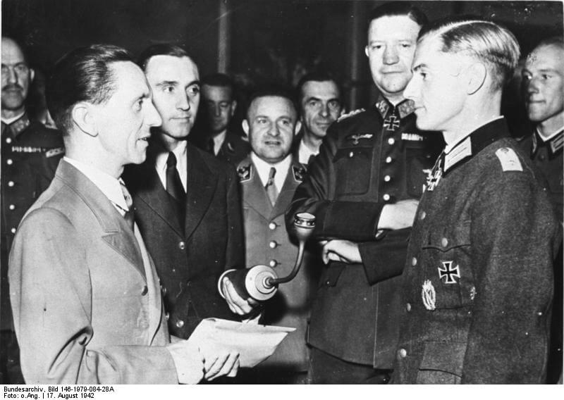

### Porozumienie Himmler-Kersten

Sanatorium dla dzieci z gruźlicą w Hohenlychen zostało zbudowane w 1902. W latach 30 zostało przejęte przez SS, prawdopodobnie ze względu na bliskość Berlina - leży bowiem ok 70 km dokładnie na północ od Berlina. Po drodze do Berlina jest Oranienburg, a 10 km na zachód KL Ravensbrück.

W czasach hitlerowskich jego szefem był dr Karl Gebhardt. To on zamienił sanatorium gruźlicze w klinikę ortopedyczną i stworzył podwaliny pod niemiecką medycynę sportową. Hohenlychen było główną kliniką i ośrodkiem rehabilitacyjnym niemieckich sportowców podczas Olipmiady w Berlinie w 1936. Gebhardt był pierwszym profesorem medycyny sportowej w Niemczech. Po wojnie sanatorium zostało przejęte przez Armię Czerwoną i używane jako szpital wojskowy aż do 31 sierpnia 1993.

27 maja 1942 Himmler wysłał Gebhardta do leczenia Heydricha w Pradze, wtedy Theodor Morell osobisty lekarz Hitlera zaproponował zastosowanie sulfonamidu (wczesne antybiotyki), na co Gebhardt nie wyraził zgody. Osobiście wymusił zbrodnicze eksperymenty w KL Ravensbrück i je przeprowadzał. Po wojnie został za to osądzony w Norymberdze i skazany w tzw. procesie lekarzy z 22 innymi lekarzami, trwającym od 9 grudnia 1946 do 20 sierpnia 1947. Dostał wyrok śmierci wykonany przez powieszenie 2 czerwca 1948 w sławnym więzieniu Landsberg.

Hohenlychen było jednym z ulubionych miejsc Himmlera, do pewnego stopnia była to jego podberlińską baza.

Jego osobistym lekarzem był Felix Kersten, który nie był hitlerowcem. Jak później napisał przyjął propozycję Himmlera, bo bał się odmówić. Był również lekarzem hrabiego Galeazzo Ciano i księcia Holandii Henryka. Był też jednym z pierwszych w Europie praktyków masażu chińskiego (tybetańskiego?), jego nauczyciel dr Ko w 1925 powiedział "nauczyłem Cię wszystkiego co potrafię" przekazał praktykę i powrócił do Tybetu. Podczas wojny współpracował z Abramsem S. Hewittem, szefem sztokholmskiego oddziału OSS (poprzednik CIA). W 1945 zorganizował spotkanie Himmlera z Norbertem Masurem, przedstawicielem szwedzkiego oddziału Światowego Kongresu Żydów. Miało to miejsce w Hartzwalde kilka km od Ravensbrück.

12 marca w Hohenlychen Kersten i Himmler podpisali tajną umowę znaną jako porozumienie Himmler-Kersten. Świadkiem był sekretarz Himmlera Rudolf Brandt. Było to potajemne zakończenie Holokaustu. Składało się z czterech punktów:

- Obozy koncentracyjne nie będą niszczone.
- Zostaną oznaczone białymi flagami i bez walki będą przekazywane aliantom.
- Zabijanie Żydów zostanie zakończone, a Żydzi będą traktowani tak jak wszyscy inni więźniowie.
- Proces ewakuacji (marsze śmierci) zostaną zakończone. Szwecja będzie mogła udzielić pomocy żywnościowej żydowskim więźniom.

Ze względu na tajny charakter, skalę zbrodni i biurokratyczne przeszkody w łańcuchu dowodzenia nie zostało wprowadzone wszędzie i natychmiast, ale ocenia się, że uratowało ok. 60 tys. ludzi.

### "Białe autobusy"

Rząd i organizacje szwedzkie sprzeciwiały się prześladowaniom hitlerowskim od samego początku, czyli od 1933. Wtedy zaczyna się długa i skomplikowana historia działań i kontaktów zarówno oficjalnych, jak i tajnych, które wiązały się i z pomocą prześladowanym, a także z walką z hitleryzmem.

W działalności humanitarnej najważniejszą organizacją był tu Szwedzki Czerwony Krzyż, na którego protesty Niemiecki Czerwony Krzyż 31 stycznia 1934 odpowiedział w oficjalnej nocie, że obozy koncentracyjne są wewnętrzną sprawą Niemiec.

Po klęskach pod Stalingradem i El-Alamein, kiedy przegrana Niemiec była już nieunikniona, Szwedzi zaczęli przygotowywać się do świata powojennego. Rząd porzucił neutralną politykę i zezwolił na bardziej aktywną pomoc. Otworzyli granice dla uciekających z kraju Norwegów oraz dla duńskich Żydów. Szwecja stała się siedzibą duńskiego rządu na emigracji.

Duńczycy i Szwedzi w 1944 zintensyfikowali działania na rzecz więźniów obozów koncentracyjnych. Kierowali się przede wszystkim obawą, że w obliczu alianckiej ofensywy Niemcy będą usiłowali zatrzeć ślady zbrodni przez wymordowanie osadzonych.

Działania zaczęły przynosić rezultaty. Już 2 listopada 1944 Hitler zezwolił na wywiezienie 130 Norwegów, chorych więźniów KL. Warunkiem było zachowanie ścisłej tajemnicy.

Akredytowany w Sztokholmie norweski dyplomata Niels Christian Ditleff, późniejszy główny organizator pomocy humanitarnej 30 listopada 1944 zwrócił się do szwedzkiego MSZ z propozycją wysłania pomocy / misji humanitarnej do hitlerowskich Niemiec. Najważniejszą organizacją był oczywiście Szwedzki Czerwony Krzyż pod kierownictwem hrabiego Folke Bernadotte.

10 lutego 1945 Szwecja przez ambasadę zwróciła się z propozycją przejęcia wszystkich Żydów uwięzionych w KL, zaczynając od Theresienstadt i Bergen-Belsen. Tego samego dnia MSZ zdecydowało o wysłaniu Bernadotte do Berlina, by rozpocząć negocjacje na najwyższym szczeblu. Jego kompetencje określono bardzo szeroko. Pośrednikiem był lekarz Himmlera, Felix Kersten. 16 lutego Bernadottte przyleciał do Berlina, gdzie spotkał się z Ribbentropen, szefem RSHA Ernstem Kaltenbrunnerem i adiutantem Himmlera Walterem Schellenbergiem.

19 lutego zaczęły się negocjacje z Himmlerem, który w zasadzie odmówił współpracy, zezwolił jedynie na zebranie wszystkich więźniów pochodzących ze Skandynawii w jednym obozie - KL Neuengamme blisko granicy duńskiej. Mieli się tam znajdować pod opieką Czerwonego Krzyża.

Ponownie Bernadotte przyleciał do Niemiec 6 marca i spotkał się z Kaltenbrunnerem i Schellenbergiem. Uzgodniono, że w KL Neuengamme zebrani zostaną wszyscy skandynawscy Żydzi. Przedstawił propozycję wywiezienia ich do Szwecji. Zaczęto przygotowywać akcję humanitarną. Ponieważ Szwedzki Czerwony Krzyż nie posiadał odpowiednich środków ani możliwości działania w strefie wojny, pomocy materialnej i logistycznej udzieliły Szwedzkie Siły Zbrojne. Do akcji zostali przydzieleni żołnierze ochotnicy, którym na ten czas udzielono urlopów.

8 marca wszyscy zebrali się w Hässleholmie (Skania). Były to 75 pojazdów (w tym 36 autobusów) i 250 osób, na więcej Niemcy nie wyrazili zgody. Skład:

- 3 plutony medyczne: 12 autobusów zaadaptowanych na ambulanse
- pluton transportowy: 12 ciężarówek
- pluton obsługi z kuchnią polową, warsztatem, lawetą i sprzętem medycznym

W dniach 12 i 13 marca 1945 przybyli do Friedrichsruh k Hamburga. Była tam posiadłość należąca do Bismarcków. Otrzymał ją Żelazny Kanclerz za Zjednoczenie Niemiec w 1871 i tam zamieszkał. Został pochowany w mauzoleum na pobliskim wzniesieniu Schneckenberg. Do KL Neuengamme było 10 km.

Natychmiast został wysłany pluton pod dowództwem majora Svena Frykmana skierowany do KL Sachenhausen. Pozostałe plutony szykowały się do drogi do południowych Niemiec i Austrii.

Bezpośrednio uratowali 15 tys. ludzi, ale uważa się, że wpływ tej akcji jest dużo większy.

- [Białe Autobusy kursują przez granicę](https://warhist.pl/ciekawostka/biale-autobusy-kursuja-przez-granice/)

### Aktion Bernhard

Ściśle tajna akcja mająca na celu początkowo podreperowanie budżetu, a potem w ogóle destabilizację ekonomii nieprzyjaciela. Hitlerowcy zebrali więźniów obozów koncentracyjnych znających się na fałszowaniu dokumentów. Zapewnili im wszystkie niezbędne materiały i stosunkowo dobre warunki. Więźniowie (nierobiący sobie złudzeń, że mają szansę przeżyć po wykonaniu zadania) mieli drukować fałszywe banknoty brytyjskie. Było to największe fałszerstwo finansowe w historii.

Pierwszą fazę operacji od 1940 prowadził Alfred Naujocks, ale w 1942 popadł w niełaskę i kierownictwo przejął SS-Sturmbannführer Bernhard Krüger. Wszystkich 142 fałszerzy zebrał w izolowanym oddziale KL Sachsenhausen. Od początku operacji w 1942 do ewakuacji obozu w kwietniu 1945 wydrukowali 9 mln banknotów. Fałszerzy i cały sprzęt z Sachsenhausen ewakuowano wcześniej.

Właśnie dziś dotarli do KL Mauthausen-Gusen w Austrii. Wkrótce zostaną skierowani do tunelów Redl-Zipf - podziemnej fabryki rakiet V2. Tam będą kontynuować prace.

Na początku maja operacja zostanie zakończona a więźniowie wywiezieni do KL Ebensee w trzech oddzielnych transportach. Rozkaz mówił wyraźnie, że natychmiast po przybycia mają zostać zlikwidowani, ale dopiero kiedy wszystkie trzy grupy będą już w obozie. Tymczasem ciężarówka wioząca ostatni transport zepsuła się i więźniowie musieli resztę drogi przebyć pieszo. Kiedy 5 maja dotarli do obozu, z powodu chaosu trzymane dotąd w izolacji dwie pierwsze grupy przemieszały się z resztą więźniów. Więc kiedy przybyła trzecia grupa, rozkaz okazał się niewykonalny. Zbliżali się Amerykanie. SS uciekło.

w 2007 został nakręcony film niemiecko-austriacki ["Die Fälscher"](https://www.imdb.com/title/tt0813547/). Zdobył wiele nagród m in Oskara 2008 za najlepszy film zagraniczny.

- Dark Docs ["Germany's Most Grotesque Secret to Win WW2" [YT 12:25]](https://www.youtube.com/watch?v=n1uPhEFXddM)

### 2 Front Białoruski

2 Front Białoruski zbliża się do Gdańska: Puck, Reda, Tczew i Wejherowo.

### Kołobrzeg

16 pułk dociera do strzelnic. Zajmuje je.

14 pułk przy wsparciu artyleryjskim zdobywa Szaniec Siederlande, kluczową pozycję blokującą dojście do Koszar Białych i Czerwonych. Koszary te to główna pozycja obrony na tym odcinku.

Atakujący Białe Koszary oddział chorążego Marka Kahane wpadł w pułapkę, nie mógł się wycofać i wdarł się do koszar licząc na rychłe wsparcie. Wszyscy zostali wybici. Ich spalone ciała znaleziono dwa dni później.

Równolegle kontynuowano natarcie ul. Trzebiatowską. 

Kosztem ogromnych strat atakująca od wschodu 272 Dywizja sowiecka zdobyła Koszary von der Goltza przy ul. Koszalińskiej. Obecnie jest to Jednostka Wojskowa 2117 (8 batalion remontowy).

Polacy wzięli do niewoli 140 żołnierzy hitlerowskich. Jeden z nich należący do SS Charlemagne zeznał, że odcinka długości 700 m broni 60 ludzi.

Wieczorem na pozycje w Kołobrzegu dotarł 5 pułk czołgów ciężkich mający na stanie 14 czołgów IS-2. Do akcji wchodzi 4 DP, jej 12 pułk piechoty w nocy zajmuje pozycje wyjściowe do natarcia planowanego jutro o godz. 0700 na odcinek wschodni, za nim podążają 10 i 11 pułk piechoty. Jutro nastąpi rozstrzygający bój. 

- Twierdza Kołobrzeg [12-13 marca: Walki uliczne](https://twierdzakolobrzeg.pl/twierdza/rok-1945/198-12-13-marca-walki-uliczne) | [Szaniec Siederlande](https://twierdzakolobrzeg.pl/twierdza/fortyfikacje/236-szaniec-siederlande)
- Olaf Popkiewicz ["Bój o Kołobrzeg 1945" [YT 1:12:56]](https://www.youtube.com/watch?v=FRcRu3hCS4c)

### 1 Front Białoruski

1 Front Białoruski usiłuje przebić się na druga stronę Odry, dziś w Kostrzynie został zdobyty Neustadt, czyli obecna dzielnica Nowy Kostrzyn. Oznacza to, że prawy brzeg Odry na tym odcinku znalazł się pod kontrolą Armii Czerwonej.

- [OdraOderOdra "Küstrin/Kostrzyn - Zeitzeugen/Historiker" [YT 21:47]](https://www.youtube.com/watch?v=ab9p46WiSG4)
- Stowarzyszenie Eksploracji PERKUN ["Twierdza Kostrzyn - Powrót do Przeszłości cz.1" [YT 13:45]](https://www.youtube.com/watch?v=k4uCNCdbmwY) | ["Twierdza Kostrzyn - Powrót do Przeszłości cz.2 (Mała Niespodzianka)" [YT 12:31]](https://www.youtube.com/watch?v=Hgf5DLkRYHM) | ["Twierdza Kostrzyn - Skarby z Piwnicy Ratusza" [YT 16:48]](https://www.youtube.com/watch?v=FqDJkSpxcmo)

### Bolesław Bujalski

5 stycznia w Stanisławowie został aresztowany Bolesław Bujalski, znany geolog i kartograf, znawca Karpat związany ze Lwowem. W czasie wojny działała w Polskim Komitecie Opieki, zajmując się ludźmi, którzy uciekli przed pogromami. Wiadomo tylko, że umarł w stanisławowskim więzieniu z powodu ciężkich warunków i chorób, nie jest znana ani dokładna data śmierci, ani miejsce pochówku. Datę 12 marca podaje PCK.

### Friedrich Fromm

Na pewno dziś hitlerowcy rozstrzelali w więzieniu Brandenburg-Görden generała Friedricha Fromma, dowódcę Armii Rezerwowej. Spiskowcy z 20 lipca usiłowali go przeciągnąć na swoją stronę, ale wyczekiwał na potwierdzenie śmierci Hitlera. Potem brał udział w aresztowaniach i egzekucjach spiskowców. Mimo to został oskarżony o tchórzostwo i skazany na śmierć.

Patton jako dowódca strefy okupacyjnej dokonał rehabilitacji Fromma, ta została potem cofnięta przez Adenauera, bo Fromm był jednym z członków Trybunału zarządzającego wyroki śmierci na spiskowców.

<BoxImageWrapper>

Goebbels rozmawia z żołnierzem z Sewastopola 1942-08-17, Berlin, w tle po prawej generał Friedrich Fromm. 
By Bundesarchiv, Bild 146-1979-084-28A / CC-BY-SA 3.0, [CC BY-SA 3.0 de](https://creativecommons.org/licenses/by-sa/3.0/de/deed.en" title="Creative Commons Attribution-Share Alike 3.0 de), [Link](https://commons.wikimedia.org/w/index.php?curid=5483003)
</BoxImageWrapper>

### Lubań

Dziś, 12 marca 1945 frontowa gazeta twierdzy "Schlesische Tageszeitung" zamieściła dwa ważne teksty, z których nic nie wynikało. Nawet propagandowo były bez znaczenia, chociaż były czystą propagandą.

Pierwszym był artykuł "Kämpfen und gegenschlagen" (pl. Walczyć i kontratakować) opisujący wiec w Lubaniu urządzony 8 marca, kiedy to obok wraku T-34 ustawiono trybunę i wystąpili minister propagandy Rzeszy Joseph Goebbels oraz dowódca Grupy Armii Środek Ferdinand Schörner. Jak pisze tłumacz w przypisie "*jednostki niemieckie odzyskały przejściowo Lubań*", otóż kłamstwo spotkało tu kłamstwo, bo wcale nie przejściowo, Grupie Nehringa udało się zdobyć i utrzymać węzeł lubański aż do końca wojny (fakt iż nie byli już atakowani przez Armię Czerwoną, jest bez znaczenia), czemu tłumacz czuje się zobowiązany do zakłamywania historii w książce wydanej w 1964, możemy się tylko domyślać, była to ta sama przyczyna, dla której ten epizod wojny skrupulatnie przemilczano.

Drugim była odezwa Hitlera z 11 marca z okazji Heldengedanktag (Dnia Bohaterów) "*Auf die Feinde einschlagen, bis sie zerbrechen*" (pl. Nacierać na wroga dopóty, dopóki się nie załamie). Dzień Bohaterów było to wypadające dwa tygodnie przed Adwentem święto na cześć bohaterstwa wojennego urządzane w czasach nazistowskich. Korzenie tego święta sięgały jeszcze XVIII-wiecznych Prus i pierwotnie było poświęcone poległym na polu bitwy. Była to próba konsolidacji i wprzęgnięcia w służbę państwu rozmaitych świąt i uroczystości związanych z modlitwami za zabitych żołnierzy. Aż do czasów nazistowskich nie udało się ustalić jednolitego terminu ani znaczenia święta. W 1922 w Reichstagu po raz pierwszy uczczono Volkstrauertag. Po wojnie wrócono do niego, jako do Volkstrauertag, tym razem upamiętniając wszelkie ofiary przemocy i rządów totalitarnych, nie tylko poległych żołnierzy. O obu tych tekstach Peikert pisze krótko, rzucając czymś w rodzaju przekleństwa:
>W Lubaniu, małym miasteczku, które zostało przez nasz Wehrmacht odbite Rosjanom, wygłosił Goebbels swoim skrzeczącym głosem histeryczne przemówienie, tak samo Hitler z okazji dzisiejszego dnia poświęconego pamięci bohaterów. Niech mówią, co im się podoba, jest beznadziejnie, jest rozpaczliwie. To jest koniec dwunastoletniej tyranii, jakiej ludzkość jeszcze nigdy nie przeżyła. Beznadziejność i nicość narodu.

Ale nie wszyscy podzielali jego zdanie, Richard Hargreaves przytacza przykład pamiętnika jednego z robotników FAMO:
>Przybył sam Joseph Goebbels, którego witano jak zwycięskiego zdobywcę. Na wypalonych ruinach domów stojących w rynku pospiesznie wywieszono flagi ze swastyką. Obok wraku zniszczonego T-34 wzniesiono niewielką trybunę, z której minister propagandy przemówił do oddziałów, które odbiły Lubań. "Udało się wam zatrzymać naszego piekielnego wroga, odrzucając w tył bolszewicką bestię" - mówił Goebbels - "Wiem, że to dopiero początek. To początek ich końca i upadku. Początek naszego wielkiego zwycięstwa. Ostatnia godzina przed wschodem słońca jest zawsze najciemniejsza, ale już wkrótce słońce ponownie zaświeci nad Niemcami". Goebbels pokładał swoje nadzieje w osobie Ferdinanda Schörnera, którego uważał za "urodzonego przywódcę". Generał zapewnił ministra propagandy, że za kilka tygodni uwolni Wrocław od oblężenia. Schörner przyjdzie. Ta nadzieja podtrzymywała jeszcze na duchu wrocławian, ale szybko się rozwiała. "To wieczne czekanie" - pisał były pracownik zakładów FAMO Carl Võlkel w swoim dzienniku pod datą 10 marca, - "Wszędzie dookoła śmierć i ruiny. Nigdzie nie jesteśmy bezpieczni i po prostu czekamy". Tydzień później zanotował: "Minęło osiem tygodni. Wierzyliśmy w to, że katastrofa dobiegnie końca, ale tutaj we Wrocławiu, jesteśmy nadal w tym samym miejscu co pierwszego dnia". 4 kwietnia zapisał "Ciągle to samo. Żyjemy nadzieją z dnia na dzień. Pokój jest już naprawdę blisko, ale nadal nic się nie dzieje". Zwięzłe wpisy w jego dzienniku ilustrują gorzką codzienną egzystencję pozostałych we Wrocławiu cywilów równie dobrze, jak wspomnienia bardziej erudycyjnych kronikarzy tego oblężenia.

W dalszym ciągu kroniki wojennej pojawią się inne relacje również wskazujące, że jeszcze w marcu wiara w sens poświeceń, a nawet w jakieś zwycięstwo nie wygasła do końca.

### Paul Peikert

Dzisiejszy dzień Paul Peikert zaczyna jak zwykle ostatnio, od pogody:
>Dzień jest posępny, jest odwilż i ciepło. Gęsta mgła wisi nad miastem. Toteż dziś przed południem nieprzyjacielskie samoloty zaniechały nalotów. Wszelako tym bardziej pracowicie przystąpiła znów do dzieła nasza artyleria, więc huk i grzmot dział trwał przez całe przedpołudnie. [...] mogłem się znów dowiedzieć, jak potwornie już zwyrodniała brutalność naszych kierowników grup obwodowych i ich pomocników. Żona owego chorego, którego opatrzyłem, musi pozostawiać bez opieki swego śmiertelnie chorego męża, który w każdej chwili może umrzeć, i mimo swego wieku musi codziennie na pięć godzin iść do pracy przy okopach na Webskyplatz (plac Zgody). Budowa szańców stała się dzisiaj bardzo niebezpieczną pracą. Np. wczoraj, podczas ciężkich nalotów i ostrzeliwania z broni pokładowej, robotnicy musieli ciągle porzucać miejsce pracy, a ktoś powiedział mi, iż w dniu dzisiejszym mogli zaledwie przez pięć minut pracować spokojnie. Prace te są bowiem szczególnie brane pod obstrzał broni pokładowej, a groźba śmierci i ran jest nadzwyczaj wielka. Jeśli ludzie ci nie schronią się natychmiast w jakimś domu, mogą niechybnie zginąć. Tak więc nasze stare kobiety i mężczyzn naraża się na takie jeszcze niebezpieczeństwa. Kiedy owa kobieta prosiła usilnie kierownika grupy obwodowej, by zechciał ją zwolnić od obowiązku pracy na podstawie rozporządzenia z 7 marca 1945 r., ze względu na ciężki stan zdrowia męża, ten odpowiedział: Dziś musi umierać tak wielu ludzi, nie mając nikogo przy sobie, a musi umrzeć jeszcze 10 000, skoro tylko uporamy się z Wrocławiem. Oto czas, gdy te bezwzględne, brutalne i gwałtowne natury mogą się wyładować w tyranizowaniu swych niemieckich współobywateli. Kobieta owa powiedziała mi, że nie Rosjan się lęka, ale swoich, Niemców. Nie sądzi, żeby Rosjanie byli zdolni do tak nieludzkich odruchów. To samo opowiedziała inna osoba, około czterdziestki. Pielęgnuje swojego 82-letniego opiekuna, na wpół ociemniałego i obecnie niedomagającego. Robiła wszystko, aby się utrzymać, dla posługi przy chorym ojcu. Brutalnie odrzucano wszystkie prośby, nawet tę, tak naglącą. Musiała pójść do okopów i pozostawić własnemu losowi chorego, na wpół ociemniałego starca. Jakże zgnuśniał moralnie człowiek niemiecki przez 12 lat, skoro takiej brutalności nie zdoła przeciwstawić zwykłego "nie". I tak naród w służbie tej tyranii ponosi nawet największe ofiary i cierpienia, ale tych ofiar i cierpień, którymi by trzeba opłacić wyzwolenie spod tej tyranii, nie odważy się wziąć na siebie. Dlatego naród niemiecki musi wychylić kielich cierpienia aż do dna. [...] W ogrodzie kwitną śnieżyczki, a gałęzie bzu i innych kwitnących krzewów zaczynają pęcznieć i wypuszczać pączki. Bazie wierzbowe rozkwitają w ogrodzie. Kos śpiewa już wieczór i rano swą pieśń. Wszędzie rodzi się oczekiwanie nadchodzącej wiosny. Wszystko przygotowuje się do święta zmartwychwstania. W tych posępnych i mglistych dniach tylko do biednego serca ludzkiego nadzieja nie chce wstąpić. Beznadziejna stała się sytuacja naszego narodu przez nasz rząd. [...] Jest to ów militaryzm, który wyzbył się wszelkich względów, wszelkiego szacunku dla kulturalnych i innych wartości; ów militaryzm, który wypędza ludzi z mieszkań, by je przekształcić w twierdze; który wybiera sobie najlepsze schrony przeciwlotnicze, by się sam ochronić, ludność zaś wydaje na zagładę; który wszystko niszczy i wszystko pochłania, dla którego wojna jest rzemiosłem i celem samym w sobie; który będzie przekleństwem tak dla narodu, jak i dla całej ludzkości.

Ze wszystkich przytoczonych zdań Peikerta to jest najważniejsze "*naród w służbie tej tyranii ponosi nawet największe ofiary i cierpienia, ale tych ofiar i cierpień, którymi by trzeba opłacić wyzwolenie spod tej tyranii, nie odważy się wziąć na siebie*", piszący te słowa jest już bezradny, wie, że niczego nie można zrobić, stwierdza tylko, że dla uwolnienia od tyranii trzeba być gotowym na wszelkie poświęcenia, bo jeśli się tego nie zrobi, trzeba będzie się przygotować na jeszcze większe. To prosty i okrutny rachunek strat. Miliony Niemców musiały płacić straszliwą cenę, bo tysiącom Niemców zabrakło trzeźwości i odwagi, by zniszczyć tyranię. Teraz ta tyrania umierająca niczym wielki tonący w oświetlonym płomieniami mroku okręt zabierała ich wirem wojny na dno. Peikert w słowach stwierdza to, czego NSDAP dokonała w czynach - zagładę niemieckiego Wrocławia. W sytuacji pozbawionej nadziei ma już nadzieję na tylko jedną rzecz, to że wszystko także i ta sytuacja, kiedyś się kończy. Żadna wojna nie trwa bez końca. Każde oblężenie kiedyś musi się zakończyć.

Istniała oczywista przyczyna, tego że koniec był nieunikniony, inna niż zewnętrzny bieg wojny. Odkąd Wrocław znalazł się w izolacji, zewnętrzny świat ograniczył się do stacjonującego wokół miasta wroga, do jego piechoty, lotnictwa i artylerii, do jego eksplodującej amunicji, odłamków siekających ciała, bomb burzących i zapalających, ulotek spadających na płonące domy. Jeszcze dalej, gdzieś zupełnie na antypodach byli "nasi", czyli Luftflotte 6 resztką sił tworząca most powietrzny zasilający gasnącą twierdzę. Tą oczywistą przyczyną były codzienne straty. Wg niepełnych oficjalnych danych 9 marca zginęło 91 osób w tym 18 cywilów, następnego dnia już 99 w tym 26 cywilów, dzień później podczas wczorajszej niedzieli opisywanej jako jeden z najgorszych dni w twierdzy liczba ofiar sięgnęła 131 zabitych, z czego dokładnie 100 to byli żołnierze. Dziś 12 marca wojna zabrała kolejne 98 osób w tym 34 cywilów, jutro zabierze 69, z czego 16 cywilów. I tak codziennie, bez chwili przerwy, jak byśmy dzisiaj powiedzieli "dwadzieścia cztery na siedem" beznamiętnie i z cierpliwością zegarmistrza zagłada spadała na miasto i jego ludzi. ..., 91, 99, 131, 98, 69, ... - bez wytchnienia, aż do nieuniknionego końca. Jedyną nadzieją schwytanych w pułapce twierdzy było to, że dostatecznie szybko zginie ich dostatecznie dużo, żeby dowództwo poddało pozycję, zanim oni sami zginą.

Jak wykaże przyszłość i tak okrutna nadzieja była daremna.

