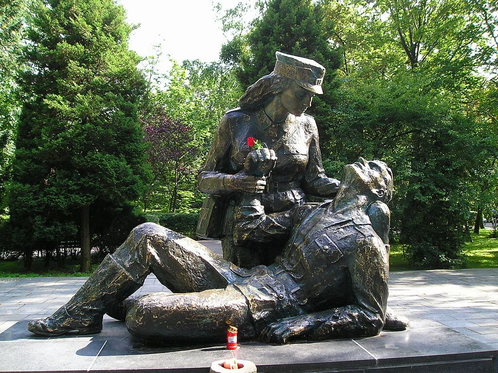

### SS Karlsruhe

Nie mylić z krążownikiem klasy Königsberg zatopionym u brzegów Norwegii k. Kristiansand w 1940. Jest to tym bardziej mylące, że odnaleziony został też niedawno: lokalizacja 2017 i potwierdzenie we wrześniu 2019.

Nasz leciwy parowiec, który brał udział w operacji Hannibal zbudowany był przez Schichau Seebeckwerft w Bremerhaven dla Hamburg-Amerikanische Packetfahrt-Aktien-Gesellschaft (HAPAG). Zwodowany w 1905. W latach 1935-45 własność Ernst Russ Reederei.

11 marca o 20.00 wypłynął z Pilawy (port Królewca). Zabrał 1083 uciekinierów i 360 ton ładunku. Był ostatnim statkiem, który opuścił Królewiec. Obrał kurs na Hel, gdzie dopłynął rankiem następnego dnia. Płynął w konwoju z parowcem SS Santander i trzema trałowcami.

13 marca rano konwój został zaatakowany przez sowieckie samoloty torpedowe. Dostał jedną torpedą i zatonął bardzo szybko. Zaledwie 113 osób uratowano. Jest to czwarte i najmniej znane zatopienie statku ewakuacyjnego na Bałtyku.

Wrak został znaleziony we wrześniu 2020 i jest nietknięty. Istnieją uzasadnione przypuszczenia, że w ładunku może znajdować się Bursztynowa Komnata.

- [Wygląda na to, że po miesiącach poszukiwań, natrafiliśmy w końcu na wrak parowca Karlsruhe.](facebook.com/BALTICTECH/posts/4634456056594503)
- Głos Pomorza: ["Bursztynowa Komnata odnaleziona? Trwają badania wraku Karlsruhe. Jest dokładny obraz spoczywającego na bałtyckim dnie statku"](https://gp24.pl/bursztynowa-komnata-odnaleziona-trwaja-badania-wraku-karlsruhe-jest-dokladny-obraz-spoczywajacego-na-baltyckim-dnie-statku/ar/c15-15581099)

### Étienne Piquiral

W niewoli zmarł Étienne Piquiral, rugbysta, członek francuskiej drużyny olimpijskiej, która wygrała srebrny medal. Podczas wojny był kapitanem w pułku ciężkiej artylerii.

### Kazimierz Prószyński

Już na wolności z powodu pobytu w KL Groß-Rosen zmarł Kazimierz Prószyński. Uzdolniony wynalazca, konstruktor kamer filmowych, np. już w 1913 realizował filmy dźwiękowe. Aresztowany wraz z rodziną w Warszawie 22 sierpnia, podczas Powstania Warszawskiego.

### 2 Front Białoruski

Radzieckie Biuro Informacyjne: 13 marca Armia Czerwona na południowy wschód od Gdańska, posuwając się na północ wzdłuż wschodniego brzegu Wisły, zajęła szereg miejscowości, w tym: Prangenau (Pręgowo w gminie Kętrzyn), Neukirch (Nowa Cerkiew w gminie Ostaszewo) i Reinerswalde (Ignalin k Lidzbarka Warmińskiego).

### 1 Front Białoruski

2 Warszawska DP zwyciężyła w bitwie pod Dziwnówkiem.

### Kołobrzeg

Szturm na odcinek Mitte, o godz. 0800 zaatakowano teren Gazowni, natarcie wspomagały haubicoarmaty 122 mmm oraz samoloty szturmowe Ił-2. Gazownia zdobyta oraz doszczętnie zniszczona.

12 pułk piechoty ruszył do natarcia w kierunku Parowozowni. Odepchnięci zmasowanym ogniem żołnierze skierowali się rowem przeciwczołgowym w stronę morza minęli przedpole fortu Gneisenau i potem natknęli się na fort Waldenfels. Cofnęli się do skraju toru wyścigów konnych.

14 pułk atakuje Białe Koszary, bez powodzenia. Już po zapadnięciu zmroku przygotowano nocne natarcie. O godz. 2330 3 kompanie przy silnym wsparciu artyleryjskim śmiałym atakiem zdobyły Białe Koszary i je utrzymały pomimo usilnych kontrataków niemieckich. Szykowany jest atak na Czerwone Koszary. Gdzie jest oddział chorążego Kahanego?

W walkach o Kołobrzeg zginęła sanitariuszka Ewelina Nowak. Pochodziła z Wołynia i tam w 1944 została wcielona do Wojska Polskiego. Brała udział w bitwie o Warszawę i przełamaniu Wału Pomorskiego, za co dostała srebrny medal "Zasłużony na Polu Chwały". Pomimo ostrzeżeń przed zwiększoną aktywnością snajperów wyruszyła po kolejnego rannego, została śmiertelnie postrzelona u zbiegu ulic Trzebiatowskiej i Artyleryjskiej. Dopiero po zmroku można było ją zabrać z ulicy. Miała 20 lat.

Jest upamiętniona na Pomniku Sanitariuszki w Kołobrzegu. Autor pomnika Adolf Cogiel modelkę znalazł po sąsiedzku. Jej rodzice budowali dom w tej samej okolicy.

- Olaf Popkiewicz ["Bój o Kołobrzeg 1945" [YT 1:12:56]](https://www.youtube.com/watch?v=FRcRu3hCS4c)
- ["Temat : Biografia Adolfa Cogiel"](http://naszekalety.eu/index.php?mods=pokazart&ida=401)
- ["Co za uderzające podobieństwo! Zdjęcia modelki, która pozowała do pomnika Sanitariuszki"](https://okkolobrzeg.pl/co-za-uderzajace-podobienstwo-zdjecia-modelki-ktora-pozowala-do-pomnika-sanitariuszki/)

*Pomnik sanitariuszki, Kołobrzeg, odsłonięty 1980. Projekt Adolf Cogiel z Wrocławia. 
By [Lesław Zimny](https://en.wikipedia.org/wiki/pl:User:Les%C5%82aw_Zimny) z [polskiej Wikipedii](https://en.wikipedia.org/wiki/pl:) - Na Commons przeniósł z [pl.wikipedia](https://pl.wikipedia.org) użytkownik [Masur](https://commons.wikimedia.org/wiki/User:Masur) z pomocą narzędzia [CommonsHelper](https://tools.wmflabs.org/commonshelper/)., Domena publiczna, [Link](https://commons.wikimedia.org/w/index.php?curid=7816131)*

### Głogów

- [Nadszedł 13 marca. Rosjanie znów wezwali komendanta twierdzy Głogów do oddania miasta. Oczywiście nie uczynił tego, za co otrzymał od „führera” krzyż rycerski. Rosjanie bombardowali miasto codziennie od wczesnego ranka do późnego wieczora. Był to dla nas czas straszliwego cierpienia. Siedząc w chwiejących się i ciemnych piwnicach, musieliśmy wszystko cierpliwie znosić.](https://www.facebook.com/festungglogau1944.1945/posts/1894724267387107)

### Wrocław

Walter Laßmann dzisiejszego dnia donosi o zniszczeniach dokonywanych na pl. Grunwaldzkim:
>O godzinie trzeciej po południu podpalone zostały kościół św. Piotra Kanizjusza przy pl Grunwaldzkim i tamtejsza plebania. Ogień podłożyli nasi ludzie na rozkaz Gauleitera Hankego. Jutro mają podpalić i wysadzić w powietrze kościół im. Marcina Lutra. Ta świątynia ma najwyższą we Wrocławiu wieżę.

A dzisiaj urządza sobie krótki urlop od katastrofy:
>Wieczorem spędzam spokojną godzinę przy butelce wina u Kaiserów. Pomimo niewesołego położenia panuje podniosły nastrój. Cieszymy się, że przetrwaliśmy do dzisiaj cali i zdrowi i staramy się z ufnością patrzeć w przyszłość. Nie zdajemy sobie sprawy, że najgorsze ma dopiero nadejść.

Ostatnie zdanie zdradza, że jest to pamiętnik pisany albo przynajmniej poważnie zredagowany po czasie. Chociaż katastrofa bitwy wielkanocnej nie była dla Niemców zupełnym zaskoczeniem, wówczas jeszcze nikt o niej nie mógł wiedzieć.

Natomiast dość szybko ujawnił się terror Twierdzy. 7 marca ogłoszono powszechny obowiązek pracy, pierwszą ofiarą nowego prawa stał się Walter Hübner z Ostrowa schwytany dziś za uchylanie się od pracy i skazany przez sąd doraźny ma śmierć. Wyrok wykonano dwa dni później i tego samego dnia - 15 marca - wszyscy przeczytali o tym w gazecie twierdzy Schlesische Tageszeitung nr 70. To była rozmyślnie udzielona lekcja, przykład dla wszystkich, którym sam rozkaz nie wystarczył.

Hugo Hartung dzisiaj podaje nam kolejną symboliczną scenę z oblężonego miasta, gdzie śmierć i zwykłe przyjemności istnieją obok siebie, przedstawia je równolegle jakby złączone w tańcu:
>W sąsiedniej piwnicy pojawia się fryzjer, który obcina pacjentom włosy i ich goli. Ja również delektuję się goleniem niczym uspokajającą rozkoszą. Moje krzesło stoi obok łóżka starego funkcjonariusza Volkssturmu, który umiera. Syn, w wytartym mundurze piechoty siedzi na jego posłaniu z wielkimi, bezsilnymi, opuszczonymi, czerwonymi dłońmi i wpatruje się w nieprzytomnego już ojca. Gdy golibroda zdejmuje ze mnie biały ręcznik, starzec już nie żyje. Zakonnice przykrywają twarz zmarłego, tymczasem ja płacę fryzjerowi.

I on również tego dnia, podobnie jak Laßmann, zażywa przyjemności wina, kobiet i śpiewu, obok imprezowiczów jednak wciąż transportowani są ranni noszeni do amputacji:
>Dziś wieczorem jest uroczystość w kotłowni, czyli na terenie oddziału chirurgicznego. Zwinny drobny sanitariusz, z zawodu kelner zorganizował transport fortepianu z korytarza na parterze i improwizuje na nim jak wytrawny knajpiany muzyk, serwując mieszankę szlagierów, wiedeńskich walców, piosenek nadreńskich i studenckich. Fantastyczna atmosfera. Siedzimy stłoczeni pod grubym rurami grzewczymi na wąskich drewnianych ławkach, które zazwyczaj stanowią wyposażenie poczekalni przed wejściem do gabinetu lekarskiego. W sąsiednim korytarzu piwnicznym leżą opatrzeni ranni, a przez nasze "imprezowe pomieszczenie" nieustannie wędrują na noszach ciężko ranni transportowani do sali operacyjnej i wynoszeni stamtąd pacjenci po amputacji. Dostajemy czerwone wino, śpiewamy i kołyszemy się w rytm melodii. A ponieważ jest wśród nas także kilka młodych wolontariuszek i fryzjerka, która wraz z dzieckiem schroniła się w klasztorze, są nawet tańce. Potężny wysoki człowiek w krótkiej koszuli nocnej podskakuje i kręci się na kulach".

Ksiądz Peikert:
>O godz. 11 zawołano mnie do pobłogosławienia zmarłego, który był także ofiarą nalotu niedzielnego. Była to pierwsza osoba cywilna pochowana bez trumny, gdyż trumien nie można już dostać. [...] Raz po raz wskazuje się we wszystkich przemówieniach i rozporządzeniach na bezprzykładną postawę narodu niemieckiego, na wielkie bohaterstwo. Kto żyje wśród ludu, ten wie, że prawda jest zupełnie inna. A jak naród zmęczony jest wojną do ostateczności, świadczy również w naszym mieście zastraszający po prostu wzrost samobójstw. Jak dowiedziałem się z wiarygodnego źródła, liczba samobójstw wynosi każdego dnia w naszym mieście 100 do 120. No tak, wspaniale jest żyć w tych wspaniałych czasach, do których doprowadził nas Hitler: 
>Dochodzi do tego rozgoryczenie narodu, wywołane rozporządzeniem z 7 marca 1945 r. o obowiązku pracy. Ludzi, którzy fizycznie wprost nie są zdolni do wykonywania ciężkich prac przy okopach, zmusza się bezwzględnie do tych ciężkich robót, motywując to tym, że przecież lepiej, by zginęło tysiąc kobiet, niż gdyby padł Wrocław. Z niemal wszystkich ust można słyszeć, że nie Rosjanie są naszym wrogiem, lecz że największym nieprzyjacielem jest partia. Ciągle można słyszeć, że organa partyjne śledzą, kto w niedziele i dni powszednie chodzi do kościoła, i że z tym nieróbstwem należy skończyć. [...] 
>Rząd opętany furią niszczenia poświęca molochowi wojny wszystko, co uchodziło dotąd u ludzi za cenne i drogie. Wielcy wodzowie partyjni usiłują ratować swoje nagromadzone i dziś tak cenne majątki. Jak donoszą, załadowuje się całe kolumny ciężarówek wyposażeniem z will jak zameczki, aby wszystkie te kosztowności cenne obrazy, meble, wartościowy sprzęt, metale szlachetne, porcelanę i inne przedmioty - dla zabezpieczenia wywieźć w głąb Rzeszy. Wszystko bogactwo, które zgromadzili ci ludzie, zwłaszcza mnóstwo dzieł sztuki i wartościowe wyposażenie, ma wielce podejrzane i wątpliwe pochodzenie i skradzione zostało z zasobów kultury napadniętych narodów albo jest skonfiskowanym mieniem pomordowanych Żydów. Ale szary Niemiec musiał wszystko zostawić i teraz dom jego podpalają jego właśni rodacy. 
>Dzisiaj poinformowano mnie, że lokal obwodowej grupy NSDAP na Gellhornstraße (Strubicza) został zburzony przez celny pocisk i że kierownik obwodowej grupy zginął wraz ze swoimi sześcioma współpracownikami. Ów kierownik odznaczał się, podobnie jak obwodowa grupa Herbert-Welkisch, szczególnym grubiaństwem wobec Niemców, toteż udziałem ogółu była satysfakcja, że tego rodzaju jatka ludzka i katownia znikła z powierzchni ziemi.

Ryszard Majewski tak opisuje zakończenie walk w rejonie ówczesnego kościoła pw. Chrystusa Króla przy obecnej ul Zaporoskiej (wówczas Hohenzollernstraße):
>W tej sytuacji zadanie likwidacji hitlerowskiego punktu oporu przypadło grupie saperów, która w nocy z 12 na 13 marca pod osłoną ognia własnych pododdziałów dotarła do południowej nawy świątyni i założyła ładunki wybuchowe o wadze 450 kg. Siła wybuchu była tak duża, że spowodowała zawalenie się części murów budynku, które pogrzebały pod gruzami większość załogi. Umożliwiło to piechocie radzieckiej zdobycie ruin i zamocowanie w nich własnych środków ogniowych. Wspierały one skutecznie dalsze działania zaczepne w rejonie ulic Zaporoskiej i Próchnika. Pozostałe bronione przez hitlerowców budynki w kwartale 593 podpalono plecakowymi miotaczami ognia, co zmusiło ich załogi do pospiesznego wycofania się na wysokość dzisiejszej ulicy Szczęśliwej.

### Odnośniki

- [Bitwa pod Dziwnówkiem w 1945 r.](https://historiamniejznanaizapomniana.wordpress.com/2015/03/12/bitwa-pod-dziwnowkiem-12-13-03-1945/)
- ["Jeden z ponad tysiąca – historia miłości i śmierci Zbigniewa Walca"](https://www.dw.com/pl/jeden-z-ponad-tysiąca-historia-miłości-i-śmierci-zbigniewa-walca/a-54924829)
