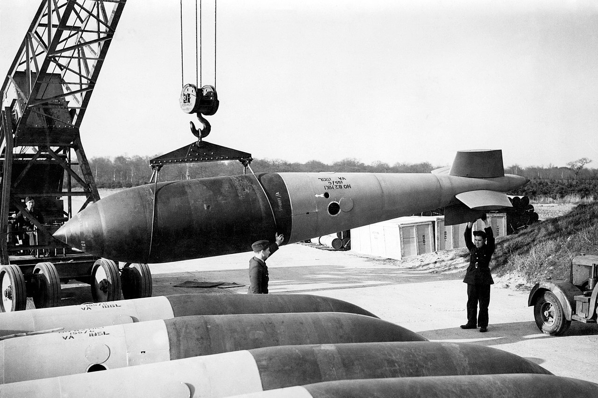

### Ziemie Odzyskane

Początki komunistycznej Polski to przede wszystkim PKWN, pierwszy organ roszczący sobie prawo do reprezentowania Polski i będący miejscem formowania się przyszłego rządu. PKWN istnieje od 21 lipca do 31 grudnia 1944. Nowy Rok nowe władze postanowiły rozpocząć poważną zmianą nazw. Powstaje Rząd Tymczasowy RP (jeszcze nie Ludowej), dziś ten rząd ustanawia nowy porządek na nowych terytoriach:

- Wydaje uchwałę o zarządzie tzw. Ziem Odzyskanych, dzieląc je na 4 okręgi, w których władzę mają sprawować specjalni pełnomocnicy, mający szerokie kompetencje.
- Jednocześnie mianuje ludzi na stanowiska: Prezydentem Wrocławia Bolesław Drobnera, działacza PPS i jednego z współtwórców PKWN, który wtedy przebywał w rodzinnym Krakowie.

Drobner natychmiast rozpoczyna organizowanie grupy pionierskiej, która ma od podstaw uruchomić życie polskiego Wrocławia. Zaczyna się polski okres historii Wrocławia. W tym czasie Niemcy bronią się w okolicach dzisiejszego Sky Tower.

<SeeAlso txt="Grupa inicjatywna Drobnera" url="/festung-breslau/article/grupa-drobnera" />

### Bomby sejsmiczne

W artykule o generale Połbinie opisywałem jak trudnym celem są mosty. Były przypadki bombardowania ich przez kilka dni. Jedyną skuteczną metoda było bombardowanie nurkowe.

<SeeAlso txt="Generał Iwan Połbin (1905-45)" url="/festung-breslau/article/iwan-polbin" />

Podczas WWII wymyślono jeszcze jedną metodę. Można było wywołać lokalne trzęsienie ziemi. Nie byy to prawdziwe bomby sejsmiczne, ale ich rozwój szedł w tę stronę. Można je określić penetracyjno-burzące. Pierwszą taką bombą była 10-tonowa Grand Slam. Podczas tej wojny użyto ich 41 razy.

Pierwszym celem takiego ataku stał się wiadukt w Bielefeld, który do połowy marca był obiektem 54 ataków bombowych, w których zrzucono w sumie 3,5 tys. ton bomb. Uzyskano 17 trafień, ale wszystkie naprawiono najdalej w czasie 24 h. 14 marca 15 Lancasterów niosących 14 bomb Tallboy (mniejsza wersja, zaledwie 5,4 t) i jedną Grand Slam z 11-sekundowym opóźnieniem. Dodatkowo wysłano Mosquito, żeby zrobił film z bombardowania i cztery Oboe Mosquito do wyznakowania celu. Osłoną było 8 eskadr P-51 Mustang. Wiadukt został zniszczony.

Wszystkie duże bomby zrzucano z Lancasterów. To były jedyne samoloty zdolne udźwignąć kilkutonowy, wielki obiekt.

Nawet B-29 się do tego nie nadawały, bo miały komorę bombową podzieloną na dwie części i musiano je przekonstruować, żeby mogły wziąć na pokład bombę atomową. Planem awaryjnym na wypadek, gdyby nie udało się ich na czas przebudować B-29 było właśnie zrzucenie bomb atomowych z nieoznaczonych, czarnych Lancasterów, których eskadrę przygotowywano do tego zadania ponad rok.

Oboe było techniką radionawigacji dającą precyzję ok. 100 m przy zasięgu 400 km. Samolot się namierzał sygnałem z dwóch zsynchronizowanych radiolatarni. Pierwszy raz zastosowano ją w grudniu 1942 do bombardowania Zagłębia Ruhry. Był uzupełnieniem podstawowego systemu radionawigacji Gee.

Niemcy w ograniczonym zakresie używali podobnego systemu o nazwie Egon. Miał on mniejszy zasięg i precyzję. Rolę radiolatarni pełniły dwa zmodyfikowane radary Freya.

- Dark Docs ["The Disney Bomb" [10:00]](https://www.youtube.com/watch?v=mA1kWMLudvU)
- Mark Felton Productions [Hiroshima 1945 - The British Atomic Attack" [YT 15:28]](https://www.youtube.com/watch?v=5XX9ptCNpik)
- The Northern Historian ["Grand Slam - The RAF's Ten-Ton Earthquake Bomb" [YT 14:29]](https://www.youtube.com/watch?v=-F7PbHSkFYI)

*Brytyjska bomba Grand Slam. 
Domena publiczna, [Link](https://commons.wikimedia.org/w/index.php?curid=168948)*

### TAP Portugal

Założono linie lotnicze TAP Portugal.

### Słowacja

Wydano znaczek pocztowy z księdzem Tiso, dyktatorem tego faszystowskiego państwa marionetkowego.

<SeeAlso txt="Słowacja" url="/festung-breslau/article/slowacja" />

- [Súbor:1-znamky slovensky stat 009.jpg Skočit na navigaciSkočit na vyhledávání](https://sk.wikipedia.org/wiki/S%C3%BAbor:1-znamky_slovensky_stat_009.jpg) ThDr. Jozef Tiso, president of Slovak State between years 1939-1945, stamp of Slovak state issue 14.3.1945 in the value 10 slovak crowns.

### 2 Front Białoruski

"Gazeta Lubelska" z 14 marca:
>Na południowy zachód od Gdyni wojska radzieckie w toku walk ofensywnych zajęty miejscowości: Reda, Osławin, Rundzau, Hallerowo i Chłapowo, biorąc do niewoli na tym odcinku frontu 1000 niemieckich żołnierzy i oficerów.

### Kołobrzeg

14 pułk z samego rana zdobywa Białe Koszary. W podziemiach znaleziono zwęglone szczątki ludzkie, zidentyfikowane jako żołnierze chorążego Marka Kahanego. Zaraz potem zdobyto Szkołę Torpedową. Polacy dotarli do Kanału Drzewnego. Mosty zostały wysadzone.

Łódkami docierają na Wyspę Solną, wiążą walką obrońców i w tym czasie druga grupa szybkim biegiem przekracza most po drugiej stronie Wyspy na Parsęcie. Wprawdzie wciąż toczą się tam walki, ale lewobrzeżny Kołobrzeg jest już opanowany. 

9 pułk dociera do Parowozowni.

Przez zdobytą niemiecką radiostację Polacy proponują Niemcom kapitulację.

- Twierdza Kołobrzeg [14-18 marca: Droga ku morzu](https://twierdzakolobrzeg.pl/twierdza/rok-1945/199-14-18-marca-droga-ku-morzu)
- Olaf Popkiewicz ["Bój o Kołobrzeg 1945" [YT 1:12:56]](https://www.youtube.com/watch?v=FRcRu3hCS4c)
- Robert Dziemba [Historia Kołobrzegu po 1954 [PDF]](https://historiakolobrzegu.pl/images/pliki/historia2.pdf)

### Wrocław

Jak pisze ksiądz Paul Peikert:
>Chmurny, mglisty i wilgotny dzień marcowy. [...] Odra wezbrała znacznie wskutek śniegu, deszczu i gwałtownej odwilży. Gęsta mgła unosi się nad gliniastym nurtem. Ta chmurna, mglista, podstępna pogoda sprawia, że nasze obecne ciężkie położenie przedstawia się nam jeszcze tragiczniej.

Ten dzień opisuje niczym dantejską wyprawę na dno piekła. Musi się kryć przed ogniem, ale tym razem nie chodzi o ogień broni palnej nieprzyjaciela, ale ogień z niemieckich domów podpalonych i niszczonych przez samych Niemców. Całych ulic i osiedli systematycznie niszczonych na potrzeby twierdzy. Pominiemy dokładny opis drogi, ponieważ jest kompletnie nieprzetłumaczalny, nie dlatego, że w wielu przypadkach zmienił się układ ulic, że mowa o mieście, które nie istnieje. Zwyczajnie, nie ma możliwości opisania i oddania w tłumaczeniu uczuć człowieka widzącego jak jego ukochane miasto, które tak cenił, jest niszczone, i to nie przez wściekłe hordy najeźdźców i barbarzyńców, ale przez jego własnych rodaków, przez jego własne państwo. Sam Peikert nie znajduje na to słów ani metod wyrazu, raz po raz obwiniając, a to rząd, a to narodowy socjalizm, a to militaryzm. Te trzy określenia powracają u niego codziennie jak przekleństwa i zarazem jak próba wyjaśnienia czegoś, czego nie potrafi wciąż zrozumieć.

Dzisiaj przemierza miasto, robiąc długą pętlę z obecnej ulicy Traugutta do centrum przez Nowy Targ, Ostrów Tumski i plac Grunwaldzki. Most Tumski zamknięty jest barykadą (dlaczego?) więc musi jeszcze nadłożyć drogi. Wszędzie widzi zniszczenia, domy zburzone, płonące, pozbawione dachów, z wybitymi oknami i dziurami w ścianach, gruz i pożogę:
>Przytłaczający widok zdewastowanych i wypalonych domów. Taki obraz prześladuje człowieka przez długie ciągi ulic, którymi szedłem. Nic nie zostało już po wielkich domach handlowych, tylko wypalone mury i ściany. Z otworów okiennych wyziera groza pogruchotanych sprzętów, belek i kawałków muru. Podarte firanki powiewają w przeciągach jak sztandary nędzy. Z rzadka trafi się dom, w którym są jeszcze całe okna. Wokoło domy zawalone albo z wielkimi dziurami od frontu. Okazały gmach poczty głównej jest przez bomby bardzo dotkliwie otłuczony [...] Między stojącymi jeszcze budynkami są zburzone lub rozerwane. Po wielkich domach handlowych nie ma już śladu. [...] Tu widzę płonące miasto. Płonęły całe bloki mieszkalne. Wczoraj i dzisiaj zostały podpalone wszystkie budynki po obu stronach Kaiserstraße [pl Grunwaldzki], a przecież miała to być reprezentacyjna ulica Wrocławia!".

Tego dnia jest świadkiem niszczenia najważniejszych obiektów na pasie startowym budowanego lotniska na pl. Grunwaldzkim, obu kościołów które - ponieważ zostały kompletnie zniszczone w samym końcu wojny - w ogóle nie istnieją w świadomości powojennych wrocławian:
>Płonął jeszcze podpalony kościół Św. Piotra Kanizjusza wraz z plebanią. Palił się kościół Lutra, tylko nie uszkodzona wieża sterczała jeszcze w kłębach dymu. [...] Obraz grozy. Właśnie wysadzono w powietrze wypalony dom przy Kaiserstraße [pl Grunwaldzki] naprzeciw kościoła Lutra. Musiałem się schronić do jakiegoś domu, by mnie nie obalił podmuch wybuchu. Nastąpiła potworna eksplozja, a ku niebu uniosły się czarne kłęby dymu. Między płonącymi domami pędziłem ku Kaiserstraße. Bardzo ścisła jest kontrola kart pracy. Mój kapelusz i płaszcz pokryła warstwa popiołu. Każdy, kto to widział, rzekł: szaleństwo. Furia niszczenia napadła wodzów narodu niemieckiego, a żołnierz niemiecki, który w skrytości ducha takie dzieło potępia, zmuszany jest pod groźbą rozstrzelania wypełniać dzieło zniszczenia barbarzyńskich wodzów. W czasie mojego obchodu po mieście uświadamiałem sobie raz po raz, jak straszne były skutki niedzielnego nalotu. Nie ma już chyba całego dachu. Niszczy je przede wszystkim obstrzał z broni pokładowej nieprzyjacielskich samolotów. Po wszystkich wstrząsach wywołanych widokiem spustoszenia i przerażeniem teraz na dodatek groza pożaru dzielnicy zaliczanej do najpiękniejszych i najwytworniejszych we Wrocławiu. [...]. Podpalono tam bloki mieszkalne razem z całym sprzętem domowym i potężne kłęby dymu unosiły się ku niebu. Przytłoczony tym wszystkim wróciłem do domu zmęczony i wyczerpany fizycznie i duchowo. [...] Gdy wieczorem poszedłem do klasztoru Św. Agnieszki, widziałem znów jak w poprzedni wieczór niebo zaczerwienione nad Kaiserstraße i nad Dworcem Głównym, tak że kościół i plebania stały jasne jakby w świetle księżyca. Ale było ono czerwieńsze i bardziej niesamowite. Wieczorem czułem się jak prorok Eliasz, który zmęczony bezskuteczną pracą uszedł na pustynię pragnąc umrzeć, gdzie zasnął pod krzakiem jałowca głodny i spragniony. Wtedy dotknął go anioł i przemówił doń, podając mu chleb i wodę: jedz i pij, bo jeszcze daleka droga przed tobą. Tak zmęczony i tak smutny byłem po wrażeniach z mojej wędrówki przez wielkie miasto. [...] Jakże wyzbył się kultury i zdziczał wewnętrznie człowiek niemiecki przez narodowy socjalizm. To co stworzyły setki ludzi, do czego tamci w najmniejszym stopniu nie przyłożyli ręki, szaleńczo wydaje się na zagładę. O Boże, czyż nie położysz kresu temu strasznemu rozlewowi krwi i temu obłędowi niszczenia?

Najprawdopodobniej Peikert oszczędziłby sobie tych słów i tego, co napisał później - jego filipika i zawodzenie przechodzi płynnie w modlitwę - gdyby wiedział, co nastąpi później, co czeka wrocławian już wkrótce.

Krótko informuje nas o spotkaniu, którego skutkiem będzie jutrzejsza wizyta w budynku szkoły na obecnej ulicy Hauke Bosaka:
>Pewien student teologii z obozu Polaków w Clausewitzschule prosił mnie, by w obozie odprawić nabożeństwo, udzielić chrztów i ślubów. Prosił o łaciński modlitewnik i różaniec. Udało mi się spełnić jego prośbę.

W Twierdzy Wrocław najważniejszym wydarzeniem tego dnia jest przeniesienie siedziby sztabu z bunkra obok Wzgórza Partyzantów do podziemi budynku dawnego klasztoru augustianów - Erich Schõnfelder:
>Postępy natarcia Rosjan w południowej części miasta spowodowały, że Wzgórze Partyzantów znalazło się w odległości około 2 km (w linii prostej) od linii frontu. Generał Niehoff, czując się tym zagrożony, 14 marca przeniósł swoje stanowiska dowodzenia do podziemi biblioteki na Wyspie Piaskowej. W celu zapewnienia większego bezpieczeństwa i zmniejszenia zagrożenia pożarowego z górnych kondygnacji budynku zostały usunięte znajdujące się tam książki.

O dotychczasowym punkcie dowodzenia w bunkrze przy Wzgórzu Partyzantów już pisałem 16 lutego, szybko okazało się, iż nie nadaje się do użytku, ponieważ nie posiada wzmocnionego żelbetowego stropu. Wykrył to porucznik Seewann, który zaraz potem zajął się wyszukaniem odpowiedniego miejsca na bunkier sztabu twierdzy.

O tym, jaką tragedią dla dziedzictwa wrocławskiego i dolnośląskiego był ten wybór - w osobnym artykule.

<SeeAlso txt="Klasztor augustianów na Wyspie Piaskowej" url="/festung-breslau/article/klasztor-augustianow" />