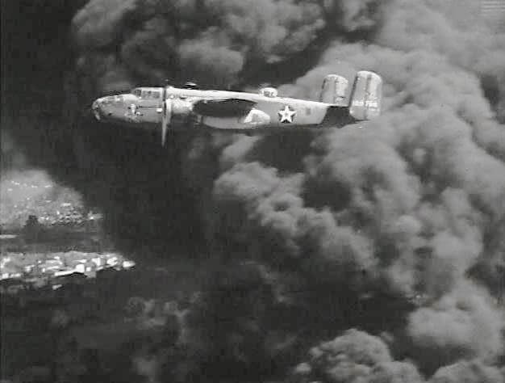

### Oskary, Hollywood

Siedemnasta ceremonia rozdania Oskarów, pierwsza w całości transmitowana w radio.

W Grauman's Chinese Theatre w Hollywood 17 ceremonia wręczenia Oscarów.

- Zdecydowanym zwycięzcą był film "Idąc moją drogą" (["Going My Way"](https://en.wikipedia.org/wiki/Going_My_Way)) muzyczny komediodramat z Bingiem Crosby i Barrym Fitzgeraldem. 6 Oscarów: najlepszy film, reżyseria, scenariusz adoptowany, historia, główna rola męska i drugoplanowa oraz muzyka.
- Najlepsza główna rola żeńska - Ingrid Bergmann w "Gasnącym płomieniu" (["Gaslight"](https://en.wikipedia.org/wiki/Gaslight_(1944_film))). Drugi Oscar za scenografię.
- Drugim najbardziej nagrodzonym filmem był ["Wilson"](https://en.wikipedia.org/wiki/Wilson_(1944_film)), 5 Oscarów, ale za realizację: najlepsze zdjęcia, montaż, scenografia, scenariusz oryginalny i dźwięk.
- Najlepsze efekty specjalne: "30 sekund nad Tokio" (["Thirty Seconds Over Tokyo"](https://en.wikipedia.org/wiki/Thirty_Seconds_Over_Tokyo)), film o pierwszym po Pearl Harbor ataku bombowym na Tokio, rajdzie Doolittle’a z 18 kwietnia 1942.

Ironią historii jest, że pięć dni wcześniej w innym bombardowaniu Tokio - najstraszliwszym w skutkach w całej historii ludzkości, w burzy ogniowej wywołanej bombami zapalającymi zginęło ponad 100 tys. ludzi.

<BoxImageWrapper>

"30 sekund nad Tokio" kadr z filmu. 
By MGM - Screenshot taken from the Thirty Seconds Over Tokyo trailer, available [here](https://archive.org/details/thirty_seconds_over_tokyo)., Domena publiczna, [Link](https://commons.wikimedia.org/w/index.php?curid=3595827)
</BoxImageWrapper>

### Alsos Mission

Była to tajna amerykańska operacja wywiadowczo-naukowa mająca na celu zbadanie niemieckich osiągnięć naukowych, szczególnie hitlerowskiego programu nuklearnego. Drugim zadaniem, a właściwie priorytetem misji było uniemożliwienie, albo przynajmniej utrudnienie dostępu do tej wiedzy wszystkim innym, czyli także sojusznikom. Trzeba było działać śmiało i nieszablonowo. Na samym początku misja składała się z 7 oficerów i 43 naukowców.

Jeszcze w trakcie walk o Paryż 23 sierpnia 1944 dotarli do Frédéric Joliot-Curie, ponieważ było pewne, że kontaktowali się z nim naukowcy niemieccy. Rozmawiali również z urzędnikami z Union Minière du Haut Katanga o transportach uranu do Niemiec. Udało im się wyśledzić 68 ton rudy wysłanej do Belgii i 30 ton we Francji.

23 listopada w Strasburgu odnaleźli laboratorium atomowe i pozostawionej tam dokumentacji dowiedzieli się, że Niemcy już nie są w stanie zbudować bomby atomowej. Wciąż istniała obawa, że użyją "brudnej bomby". W marcu 1945 od pojmanych w Kolonii Niemców dowiedzieli się, że ruda jest oczyszczana w zakładzie w Oranienburgu.

Zwiad lotniczy ustalił położenie zakładu. Dzisiaj został zbombardowany przez 612 bombowców B-17. Niemiecki program nuklearny został zatrzymany, jak się później okazało, na zawsze.

30 marca dotarli do miasta uniwersyteckiego Heidelberg, od pojmanych tam naukowców dowiedzieli się, że program atomowy został rozproszony w kilku małych miastach. W Stassfurcie na terenie sowieckiej strefy okupacyjnej pozyskali 11 ton uranu.

W kwietniu sformowali jednostkę znaną jako T-force i przeprowadzili operację Harborage, wyprzedzając linię frontu i dokonując rabunku wszystkiego, co się da. W Hechingen, Bisingen i Haigerloch złupili laboratoria, dokumentację i co najważniejsze ciężką wodę oraz 1,5 tony metalicznego uranu.

### Berlin

Alice Löwenthal, ukrywająca się Żydówka:
>Pół Berlina leży w gruzach. Można oszaleć, kiedy idzie się po ulicy. Nasz Berlin, Berlin który tak kochałam. Chociaż berlińczycy wykluczyli nas ze społeczeństwa tylko za to, że jesteśmy Żydami, to wciąż kocham swoje miasto.

- Holocaust Survivors and Victims Database [ALICE LÖWENTHAL](https://www.ushmm.org/online/hsv/person_view.php?PersonId=1332303)
- [Between Life and Death 1 March - 5 April 2020, Dresden, Germany](https://enrs.eu/edition/between-life-and-death-2020-exhibition-in-dresden)

### Pierre Drieu la Rochelle

Pierre Drieu la Rochelle otruł się dzisiaj środkami nasennymi. Był jednym z wielu francuskich intelektualistów, którzy poparli okupantów, należał do tzw. ultrasów kolaboracji. Był antysemitą.

Przebywał w amerykańskim szpitalu polowym. Była to już trzecia próba samobójcza. Do dziś pozostał nierozpoznany, ale wiedział, że nie ma dokąd uciekać i czeka go wyrok śmierci.

### Uniwersytet Jagielloński

Na Uniwersytecie Jagiellońskim uroczysta inauguracja roku akademickiego. Polska ma już dwa działające uniwersytety. Lublin i Kraków.

### Erazm Semkowicz

Po repatriacji ze Stryja do Sanoka zmarł Erazm Semkowicz, sędzia i senator RP Senatu I Kadencji.

### Kołobrzeg

12 pułk zdobywa Parowozownię i znajdujący się tam skład żywności. Jes to to dobry punk wyjścia do dalszego natarcia. Żelbetowa konstrukcja zapewnia ochronę przed ostrzałem niemieckim. Pozycję wspierają czołgi IS-2. Na pomoc przybywa 11 pułk.

W Świnoujściu został załadowany na statki batalion alarmowy Kell. 7 pułk przy wsparciu czołgów IS-2 atakuje dworzec kolejowy. Akurat podczas tego ataku do kołobrzegu dociera batalion Kell i bez porozumienia z dowództwem twierdzy przystępuje do kontrataku. Ponosi ciężkie straty.

Polacy wdzierają sie do centrum miasta, zajmują niebroniony Ratusz z cywilami ukrywającymi sie w piwnicach. Natomiast w pobliskiej Katedrze bronią się Niemcy. Zostają stamtąd wyparci silnym ogniem broni plot. W tym rejonie spotykają się żołnierze z 12 pułku z żołnierzami z 14 pułku, którzy właśnie przekroczyli Parsętę.

- Twierdza Kołobrzeg [14-18 marca: Droga ku morzu](https://twierdzakolobrzeg.pl/twierdza/rok-1945/199-14-18-marca-droga-ku-morzu)
- Olaf Popkiewicz ["Bój o Kołobrzeg 1945" [YT 1:12:56]](https://www.youtube.com/watch?v=FRcRu3hCS4c)
- Robert Dziemba [Historia Kołobrzegu po 1954 [PDF]](https://historiakolobrzegu.pl/images/pliki/historia2.pdf)

### Zaślubiny Polski z morzem

W Dziwnówku odbyły się pierwsze podczas WWII zaślubiny Polski z morzem, wzorem tych z 10 lutego 1920 pod dowództwem generała Hallera. Tym razem z inicjatywy dowódcy 5 pułku piechoty 2 DP 1 Armii WP płk. Antoniego Szabelskiego.
Zostaną powtórzone jeszcze kilkukrotnie, m.in.:

- 17 marca
- 18 marca już po zdobyciu Kołobrzegu.

### Msza w obozie dla cudzoziemców

15 marca ksiądz Peikert odwiedził obóz dla cudzoziemców w dawnej szkole dla dziewcząt (Berufsschule), na obecnej ul. Hauke Bosaka:
>Umieszczono tam przeszło 3000 cudzoziemców Polaków, Ukraińców, Czechów, Węgrów, Serbów, Bułgarów, Francuzów. Z wielkim trudem uzyskali zezwolenie na odprawienie w auli wieczorem o godz. 19 cichej mszy św. oraz na chrzty i śluby [...] Gdy wszedłem do tego domu, uderzył mnie widok trudny do opisania. Jest to jakby mrowisko pełne ludzi. Ponieważ światło elektryczne nie funkcjonuje, korzystać trzeba ze świec. Wszystkie korytarze, wszystkie schody, wszystkie pomieszczenia są zajęte. Razem młodzi i starzy, chłopcy i dziewczęta, mężczyźni i kobiety. Ponad wszystkim unosi się wilgotny zaduch centralnego ogrzewania. Powietrze takie w całym gmachu, że można się udusić. Ludzie ci bowiem mają najprymitywniejsze warunki higieniczne i dlatego też wyziewy ciał są wyjątkowo silne. Ciepło w szkole przypomina parny skwar wielkiej cieplarni. Przechodzę przez cały dom i wstępuję czterema schodami na piętra. W każdym kącie, na schodach, na korytarzach, w pomieszczeniach leżą bezdomni, odłączeni od swoich bliskich, znękani ludzie; muszą się obejść bez pociechy religijnej, a w większości są to Słowianie, których cechuje szczególna potrzeba religii. [...] Niesamowity zaduch wypełnia pomieszczenie. Obawiam się, czy przetrzymam trudy tej godziny. O godz. 19 udzielam generalnej absolucji, gdy już kleryk wraz z całą rzeszą odmówił spowiedź powszechną i wzbudził akty żalu. Następnie rozpoczynam mszę św. Kierownictwo obozu zastrzegło wyraźnie, że nie wolno śpiewać. Jakby ujrzeli cząstkę kraju rodzinnego ci pozbawieni ojczyzny, gdy rozpoczyna się ofiara mszy św. Łkanie i płacz napełnia aulę.

Ta uwaga o cząstce kraju rodzinnego wymaga pewnego wyjaśnienia - otóż mowa jest o rycie trydenckim, przedsoborowym, cała msza św. w kościele katolickim z wyjątkiem kazania była odprawiana po łacinie, więc zgromadzeni w auli dawnej szkoły katolicy z różnych krajów, uczestniczyli w takim samym co każdego szczegółu obrzędzie jak u siebie w kraju, dlatego wywołało to takie emocje. Dalej pisze Peikert:
>Pot spływał mi po twarzy i po całym ciele. Zaduch w auli gęstniał coraz bardziej. Gdy rozdawałem komunię św., widziałem, jak ludzie ci łaknęli Chleba Żywota. Przychodzili tedy mężczyźni i kobiety, młodzieńcy i panny o znękanych i wychudłych obliczach. [...] jak trudno zachować wiarę i czystość duszy! Wielka musi być wrażliwość moralna tych ludzi, jeśli taki dom nie stanie się wielkim bagnem. Mimo zakazu śpiewu było rzeczą niemożliwą zatrzymać uczucia w sercach. Pod koniec runął przez aulę głos niby z jednej piersi; była to swojska pieśń polska, przerywana głośnym szlochem i płaczem ludzi, którzy mogli teraz w tym śpiewie przed Boskim Zbawicielem i Jego Najświętszą Matką otworzyć duszę przepełnioną bólem.

Później Peikert zszedł do piwnicy z rannymi, gdzie urządzono prowizoryczny szpital:
>Szedłem z Przenajświętszym przez wszystkie pomieszczenia i błogosławiłem chorych. Ze łzami w oczach patrzyli na mnie ci młodzi i starzy mężczyźni. Leżeli tu w wilgotnej, niezdrowej piwnicy, ledwo oświetlonej światłem świec. Nie przenika tu żaden promyk słońca - przerażający obraz nędzy. Chętnie chodziłbym co tydzień do tych chorych, ale nie wolno. Węgierscy, bułgarscy i polscy lekarze podchodzą na koniec do mnie, wyrażają podziękowanie za odwiedziny. Przy pożegnaniu podaję im rękę, mówiąc, że teraz wiem, co to jest obóz dla cudzoziemców. Oni zaś odpowiadają przerywanym głosem: „A jak długo już to znosimy!” Tak, ci ludzie, ci cudzoziemcy nie zapomną o Niemczech. Opowiedzą w kraju, jak to ich ulokowano, drwiąc z wszelkiej ludzkiej godności osobistej. Każde zwierzę domowe traktuje się uczciwiej niż tych ludzi, których przemocą, wyrwano z własnego domu i roli i którzy teraz muszą ze łzami spożywać gorzki chleb wygnania. Oto do czego dochodzi światopogląd, który wraz z negacją wszelkiej człowieczej godności zlikwidował pojęcie ludzkości, człowieka, istotę żywą; traktuje jak zbędny balast. [...] Zmęczony, wyczerpany powróciłem z tego długiego nabożeństwa, i tak przepocony, że nawet wierzchnia suknia była mokra. I choć cieszyłem się, że duszom tych ludzi w niedoli wygnania przyniosłem światło pociechy i radości, to jednak nie opuszcza mnie straszny obraz tego życia. Bo i mojej uwagi nie uszły przejawy obyczajowego zwyrodnienia i ogromne niebezpieczeństwo, na które narażona jest niewinność młodzieży w obozie. A wszystko przytłaczała atmosfera odrętwienia, które groziło też stłumieniem wszelkiego światła w duszy.

O tym obozie dla cudzoziemców będzie jeszcze okazja napisać. Polecam lekturę relacji jednej z osadzonych - [Szpital dla Ausländerów - Wspomnienie Ireny Siwickiej](http://wroclaw.fotopolska.eu/477,artykul.html). Warto, jednak zanim zostawię relację księdza Peikerta na jeszcze jedno zwrócić uwagę, pisze on bowiem:
>Wzruszający jest zapał i ofiarność mieszkańców obozu, gdy idzie o nabożeństwo. Przedtem urządzili zbiórkę, której plon przekazał mi ów kleryk. Po przeliczeniu dało to znaczną sumę około 4000 marek. I chociaż pieniądz posiada obecnie małą wartość, to jednak ta wielka suma świadczy o zapale i radości z uzyskanego w końcu nabożeństwa. Pieniądze rozdzieliłem zaraz między biednych.

4 tysiące marek, nawet biorąc pod uwagę dewaluację końca wojny, nie jest aż tak małą sumą, jak na kilka tysięcy pozbawionych wszystkiego ludzi, skoro kilka dni wcześniej, bo 11 marca z zadowoleniem wspomina o świątecznej kolekcie w zasobnej i jeszcze niezagrożonej wojną parafii:
>Jakże uroczyście obchodzono ostatnie święto Bożego Narodzenia i Sylwestra jeszcze z licznym udziałem parafian. Chciałbym wskazać, że ofiary na rzecz parafii w czasie ostatnich świąt Bożego Narodzenia przyniosły kwotę 2700 marek.

### Dolny Śląsk

W połowie marca południowa flanka 1 Frontu Ukraińskiego przebiegała zaskakującą linią - Pieńsk nad Nysą Łużycką (niem. Penzig) i dalej na wschód: na południe od Bolesławca (niem. Bunzlau), północ od Złotoryi (Goldberg), południe od Jawora (niem. Jauer), Rogoźnicy (niem. Groß Rosen) oraz Kątów Wrocławskich (niem. Kanth). Linia ta na odcinku od obecnej granicy polskiej do okolic Wrocławia została osiągnięta jeszcze w połowie lutego w ramach operacji dolnośląskiej, w całości jeszcze przed zamknięciem Wrocławia w oblężeniu: Kąty Wrocławskie 11 lutego, 12 lutego Jawor i Bolesławiec, 13 lutego Złotoryja, 14 lutego Rogoźnica.

Utrzymywała się więc od miesiąca i mimo tego, że oddziałom sowieckim zdarzało się zapędzić na południe, to nie udało im się osiągnąć na tym odcinku trwałych postępów. Najlepszym przykładem, wykorzystanym propagandowo do ostatnich granic, jest opisywana przez nas klęska elementów elitarnej 3 Armii Pancernej generała Rybałki w Lubaniu (niem. Lauban), który do końca wojny miał pozostać w rękach niemieckich.

I nie tylko Lubań, jeśli popatrzymy na mapę Dolnego Śląska i daty zdobywania miejscowości przez Armię Czerwoną, pierwsze co zobaczymy to ogromny obszar na południe od autostrady A4 (dawna RAB 9 Berlin - Breslau) i zachód od Sobótki, gdzie daty wkroczenia sowietów zaczynają się 7, a kończą się 9 maja. To daje nam obraz ogromnej niepewności, z jaką borykało się dowództwo Frontu.

Nie zostawiono tych obszarów z powodu priorytetu operacji berlińskiej, miną jeszcze tygodnie, zanim Iwan zacznie się do niej przygotowywać. Nastąpi to dokładnie 1 kwietnia, i to z zupełnie jak zobaczymy zaskakujących powodów. W połowie marca operacja berlińska jest jeszcze odległym projektem, samo wyjście na przedpole Saksonii jest czymś, co dopiero trzeba zaplanować.

Już pisałem, że od krwawej bitwy na Przełęczy Dukielskiej sowieci za wszelką cenę unikali walki w górach i w Sudety w ogóle nie planowali wchodzić. Ale na tym obszarze jest wiele miast o ogromnym znaczeniu strategicznym, które nie leżą w górach: Zgorzelec (Görlitz), Jelenia Góra (niem. Hirschberg), Świebodzice (niem. Freiburg in Schlesien), Wałbrzych (niem. Waldenburg), Dzierżoniów (Reichenbach im Eulengebirge), Strzegom (niem. Striegau), Świdnica (niem. Schweidnitz), czy Strzelin (niem. Strehlen; wyjątkowo zdobyty 27 marca).

Trzeba do tego dodać jeszcze jedną ważną informację: sowieci zamknęli Wrocław i utworzyli dwie linie zaopatrzeniowe, które go omijały. Od istnienia tych dróg zależało utworzenia przyczółka berlińskiego: bezpieczna strefa zaopatrzenia kończyła się na stacjach kolejowych w Oleśnicy (niem. Oels) i Namysłowie (niem. Namslau), dalej szła:

- drogą południową z Namysłowa do Brzegu (niem. Brieg) i przez Oławę (niem. Ohlau) autostradą na zachód
- oraz drugą północną z Oleśnicy przez Trzebnicę (niem. Trebnitz), Ścinawę (niem. Steinau an der Oder), Lubin (niem. Lüben), Szprotawę (niem. Sprottau) na Żagań (niem. Sagan) i Żary (niem. Sorau)

Jak widać południowa biegła niebezpiecznie blisko tej linii. Dlaczego więc sowieci nie osiągnęli niczego więcej w tym rejonie? Odpowiedź na to pytanie jest prosta. Do 1 kwietnia nie mieli czym walczyć. Mieli wyczerpane rezerwy i samo wyjście poza Odrę już było wykroczeniem poza bezpieczny punkt zasięgu działań Frontu. A po 1 kwietnia bezwzględny priorytet uzyskuje operacja berlińska i ta część Śląska staje się ceną ryzyka, jakie świadomie podjął sztab Frontu, żeby w ogóle móc przeprowadzić atak na Berlin. Na Śląsku spotkały się więc dwie armie skrajnie wyczerpane latami wojny.

Problemy Armii Czerwonej były inne, polegały na rozciągniętych liniach zaopatrzeniowych, wyczerpaniu i wykrwawieniu jednostek, chaosie działania we mgle wojny. W przeciwieństwie do Niemców mogli liczyć na dostawy materiałów wojennych: sprzętu, amunicji i paliwa, ale mieli ogromny deficyt kadrowy. Choć wciąż mogli zaciągać rekruta, ludzkie zasoby były jeszcze dalekie od wyczerpania, ale nie mieli dość wyszkolonych żołnierzy, żeby odtworzyć straty poniesione od rozpoczęcia operacji Wisła-Odra. Armia Czerwona była już zbyt słaba, żeby walczyć na całej rozległości frontu, nawet z Niemcami, którzy dysponowali ostatnim szeregiem ludzkim i ostatnimi maszynami.

Śledząc linię frontu, idźmy dalej na wschód. Mamy oblegające Wrocław dywizje 6 Armii generała Głuzdowskiego i rozległy połączony przyczółek Oława, Brzeg, Lewin Brzeski (niem. Löwen) aż do Opola (niem. Oppeln), tuż za Opolem linia frontu biegła Odrą, przy czym Gogolin, Kędzierzyn (niem. Kandrzin) oraz Racibórz (niem. Ratibor) były po niemieckiej stronie. Przyczółek Oława-Opole został osiągnięty do 6 lutego, zaś linia Odry jeszcze wcześniej, jak więc widzimy, przez półtora miesiąca nic na tym odcinku się nie zmieniło.

### Operacja opolska

Teraz widzimy znaczenie operacji opolskiej, która nie była bynajmniej odpowiedzią na sukces Niemców na węźle lubańskim i stworzone w ten sposób zagrożenie dla sił oblegających Wrocław. Plan operacji został zaakceptowany na szczeblu Frontu już 1 marca, 8 marca zostały wydane rozkazy operacyjne. Dwa tygodnie zajęły przygotowania do niej, a dziś 15 marca ruszyła.

Polegała ona na wyprowadzeniu jednocześnie dwóch oskrzydlających uderzeń:

- od północy z rejonu Grodkowa (niem. Grottkau)
- i od wschodu od Koźla (Cosel),

Oba miały w ciągu trzech dni połączyć się w rejonie Prudnika (niem. Neustadt in Oberschlesien) zamykając w oblężeniu zgromadzone na południe od Opola siły 17 Armii i później w połączeniu z działaniami 4 Frontu Białoruskiego na południu osiągnąć linię Strzelin, Ziębice (niem. Münsterberg), Paczków (niem. Patschkau), Opawa (niem. Troppau). Znając słabość wyczerpanych bojem jednostek ogólnowojskowych, dowództwo Frontu wzmocniło je jednostkami pancernymi, które po przełamaniu linii nieprzyjaciela miały stanowić awangardę uderzenia.

Na potrzeby przygotowania artyleryjskiego zgromadzono na tym odcinku 70% artylerii Frontu. Atakującym w znacznym stopniu wykonanie zadania utrudniła pogoda. Z powodu deszczów i zachmurzenia byli pozbawieni wsparcia lotniczego, ponadto rozmokły teren ograniczył działania sił pancernych do dróg utwardzonych, co nie tylko osłabiło siłę ofensywy, ale też spowodowało poważne straty. Z powyższych powodów na obu odcinkach w ciągu pierwszego dnia operacji sowieci posunęli się zaledwie około 10 km.

Możliwość deblokady Wrocławia była zagrożeniem, którego jak wiemy Armia Czerwona, a konkretnie 6 Armia 1 Frontu Białoruskiego we własnej ocenie nie odsunęła aż do samego końca wojny. Garnizon wrocławski cały czas był odległy zaledwie o 20 do 40 km od wysuniętych jednostek Schõrnera. Ewentualny sukces operacji opolskiej był - jeśli popatrzymy na mapę - zaledwie pierwszym krokiem w stronę całkowitej likwidacji takiej możliwości. Ale cel tej operacji był inny. Wciąż się bowiem obawiano, że Schõrner dojdzie do Wrocławia, skruszy słabą 6 Armię i zasilony 17 Armią stacjonującą w rejonie Raciborza podejmie próbę odbicia Górnego Śląska. Ustanowienie frontu na linii Strzelin Ziębice i likwidacja 17 Armii miały to ostatecznie uniemożliwić. Czy to się uda, już wkrótce zobaczymy.
