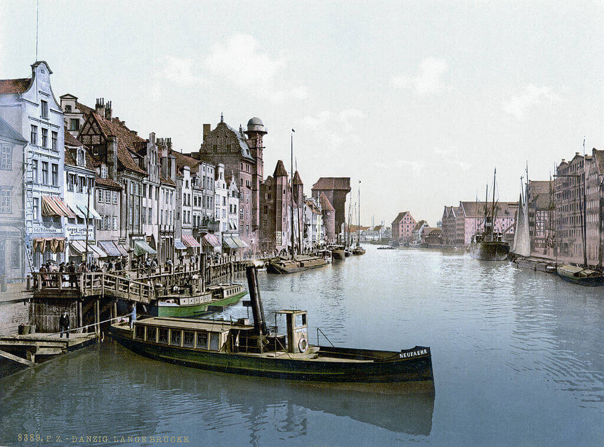

### 10 lat Wehrmachtu

W lutym 1934 minister Reichswehry Werner von Blomberg zwalnia z wojska wszystkich Żydów, bez zachowania przywilejów. W maju wprowadza symbole nazistowskie na mundury. 2 sierpnia 1934 umiera prezydent Paul von Hindenburg. Zaraz potem Reichswehra wprowadza przysięgę na wierność Fuhrerowi - inicjatywa Blomberga i Walthera von Reichenau.

Wszystkie te kroki armia podejmuje bez żadnego przymusu ani nacisków ze strony NSDAP, z własnej woli.

16 marca 1935 Hitler wydaje dekret o poborze powszechnym, który ostatecznie łamie ograniczenia Traktatu Wersalskiego - Gesetz für den Aufbau der Wehrmacht. Mowa jest o powołaniu przynajmniej 36 dywizji. Już w tytule dekretu pojawia się nazwa nowych sił zbrojnych: Wehrmacht. Oficjalna zmiana nazwy na Wehrmacht nastąpiła kilka tygodni później 21 maja 1935.

To była rewolucyjna zmiana. Istniejąca do tej pory Reichswehra była ograniczona traktatem wersalskim: wojsko tylko zawodowe, tylko 100 tys. żołnierzy, bez broni pancernej, lotnictwa.

16 marca Wehrmacht: Heer, Kriegsmarine i Luftwaffe obchodzi 10-lecie. Czy odbywa się z tego powodu jakieś święto?

<SeeAlso txt="Armia niemiecka 1918-45" url="/festung-breslau/article/armia-niemiecka" />

### Bombardowanie Würzburga

RAF zbombardował Würzburg (Frankonia, czyli Bawaria), zginęło 5 tys. osób.

Użyto sprawdzonej techniki niszczenia miast, którą widzieliśmy w Dreźnie. Najpierw spadły bomby burzące, kilkaset, niewielka ilość mających dużą moc eksplozji co zapewniło wybicie wszystkich okien i powstanie szczelin w dachach. Potem zrzucono tysiące niewielkich bomb zapalających, powstały lokalne ogniska pożarów i burze ogniowe o temperaturze przekraczającej tysiąc stopni. Takie ogniska pożarów były ogromnymi pompami ciepła wysyłającymi rozgrzane powietrze do góry, zasysało to powietrze z całej okolicy w stronę pożaru. Na ziemi rozpętało się piekło. Jeżeli weźmiemy pod uwagę wielkość populacji / miasta było to najbardziej zabójcze i niszczące bombardowanie tej wojny.

<SeeAlso txt="Drezno bombardowanie 13-15 lutego 1945" url="/festung-breslau/article/drezno-bombardowanie" />

To niewielkie miasto, obecnie ma 120 tys. ludzi i 80 km2. Przed wojną było to 100 tys. ludzi. 6 kwietnia wkroczyła tam armia amerykańska. W zrujnowanym mieście mieszkało 35 tys. ludzi. Sporządzony 10 kwietnia raport podsumowujący rezultaty bombardowania wyliczał, że miasto zostało zniszczone w 90%, a przedmieścia w 70%. Usunięcie gruzów zajęło 20 lat.

### Börries von Münchhausen

Poeta zafascynowany romantyzmem i średniowieczem, człowiek który nie osiągnął sukcesu w żadnej dziedzinie. Wyczuł swoją szansę po tym jak po przejęciu władzy przez hitlerowców wielu członków Pruskiej Akademii Nauk (niem. Königlich-Preußische Akademie der Wissenschaften) zostało wyrzuconych lub zrezygnowało. Podpisał wtedy lojalkę "Gelöbnis treuester Gefolgschaft" opublikowaną 26 października 1933. Podpisało ją w sumie 88 pisarzy i poetów.

1940 o wojnach Hitlera:
>Stacheldraht um die Garbe der geistigen Freiheit [...], der allein und seit 2000 Jahren zum ersten Male das Volk einheitlich zusammenband und alle gültigen Erfolge dieser Zeit ermöglichte

W 1944 znalazł się na Gottbegnadeten-Liste.

W styczniu 1945 jego żona zmarła w wyniku udaru. 16 marca zabił się w Windischleuba (Turyngia) 3 km na NE od Alteburga z obawy przed karą ze strony aliantów. Jego przyjaciele zatuszowali samobójstwo jako atak serca.

Altenburg został zdobyty przez Amerykanów 15 kwietnia.

### Maurice Halbwachs

W obozie koncentracyjnym Buchenwald zmarł z powodu czerwonki Maurice Halbwachs, socjolog francuski, przedstawiciel szkoły Durkheima.

Jego kariera podczas wojny była niezakłócona, 10 maja 1944 dostał nominację profesorską na College de France. 23 lipca Gestapo aresztowało go za interwencję w sprawie szwagra, który był Żydem. Wystarczyło, żeby usiłował ratować krewnego, żeby wysłać go do obozu koncentracyjnego.

### Kołobrzeg

Komendant twierdzy pułkownik Fritz Fullriede dostaje awans na generała.

Do Kołobrzegu dotarła 6 brygada artylerii rakietowej z Katiuszami. Bombardują dzielnicę uzdrowiskową, port i latarnię morską.

Po trwających cała noc walkach z batalionem Kell 7 pułk atakuje dworzec kolejowy. 

10 i 11 pułk trzyma pozycje w Parowozowni. Są pod ciągłym ostrzałem. 11 pułk zdobywa "Biały Dom" potem tzw. Żółtą Fabrykę - Fabrykę Kosmetyków Anhalta.

18 pułk atakuje na północ i odpiera kontratak batalionu Kell.

16 pułk po zmianie dowódcy zdobywa Lasek Załęże i wdziera się do dzielnicy mieszkalnej. Jest blisko portu rybackiego.

- Twierdza Kołobrzeg [14-18 marca: Droga ku morzu](https://twierdzakolobrzeg.pl/twierdza/rok-1945/199-14-18-marca-droga-ku-morzu)
- Olaf Popkiewicz ["Bój o Kołobrzeg 1945" [YT 1:12:56]](https://www.youtube.com/watch?v=FRcRu3hCS4c)
- Robert Dziemba [Historia Kołobrzegu po 1954 [PDF]](https://historiakolobrzegu.pl/images/pliki/historia2.pdf)
- Głos Koszaliński Plus ["Niemiecka fabryka Anhalta, czyli kołobrzeskie kosmetyki ruszają podbijać świat"](https://plus.gk24.pl/niemiecka-fabryka-anhalta-czyli-kolobrzeskie-kosmetyki-ruszaja-podbijac-swiat/ar/12619627)

### Gdańsk

Ostatnim niemieckim dyrektorem gdańskiego Muzeum Miejskiego był prof. Wille Drost. Jego syn wspomina:
>16 marca: ciężkie naloty, rozległe pożary, zniszczony kwartał między ulicami Ogarną, Słodowników i Zbytki, spichlerze na Wyspie Spichrzów, ulice Długie Ogrody, Szeroka, Wałowa

Prawdziwa tragedia dla Gdańska dopiero nadejdzie.

<BoxImageWrapper>

Gdańsk, Motława 1890-1900. 
By nieznany - Ten image pochodzący z zasobów [Biblioteki Kongresu Stanów Zjednoczonych](https://commons.wikimedia.org/wiki/Library_of_Congress), oddziału Prints and Photographs division jest dostępny pod numerem [ppmsca.00753](http://hdl.loc.gov/loc.pnp/ppmsca.00753).Ten szablon nie wskazuje stanu prawnego pliku. Standardowy szablon licencji jest nadal wymagany. Aby dowiedzieć się więcej zajrzyj na stronę [Commons:Licencja](https://commons.wikimedia.org/wiki/Commons:Licencja)., Domena publiczna, [Link](https://commons.wikimedia.org/w/index.php?curid=482068)
</BoxImageWrapper>

### Śląsk

Walki w rejonie Dobrosławic i Maciowakrza (15 km na wschód od Głubczyc). [Na północ od Baborowa – Bauerwitz 1945](https://www.facebook.com/bobr1945/posts/3751032145010421)

### Wrocław

Wczoraj jakby mający już zupełnie inny humor, nie poczuwając się do relacji z Eliaszem, ksiądz Peikert pisze zadowolony wiosną:
>Mamy dziś piękny wiosenny dzień. I gdy odprawiam egzekwie, słońce przedziera się przez mgłę, szpaki szczebiocą na suchych gałęziach drzew, a kos wyciąga swój piękny trel. Cóż za kontrast pomiędzy władztwem przyrody a poczynaniami ludzi! Czuć, że nadchodzi wiosna, a radość zmartwychwstania przenika dzieło stworzenia. Czy dla nas ludzi zniknie też wkrótce noc wielkopiątkowych cierpień i czy napełni nas radość Wielkiej Nocy?

Dzisiaj natomiast widząc tę samą wiosnę, zapisuje zupełnie inną, gorzką refleksję (moglibyśmy dodać, że o wiele bardziej odpowiednią dla sformułowanych oczekiwań wobec świąt wielkanocnych)
>Noc była znów względnie spokojna. Dziś, podobnie jak i wczoraj, jest wspaniały wiosenny dzień z ciepłą, łagodną pogodą. Błękitne niebo, słońce, rozśpiewane kosy, szpaki i zięby. Zdaje się, jakby przyroda drwiła sobie z tego, co czynią ludzie.

Co się stało poprzedniego wieczora? Skąd ta różnica?

