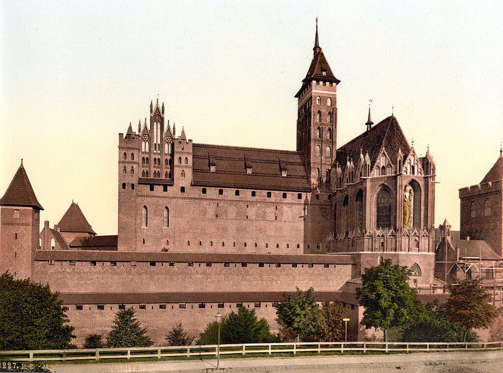

### Bombardowanie Kobe

W dniach 16-17 marca trzy skrzydła z XXI Bomber Command: 73, 313 i 314, zbombardowały Kobe, jeden z największych portów i ośrodków wojskowych Japonii. Ze względu na drewnianą zabudowę użyto głównie bomb zapalających. Bezpośrednio od bomb i w wyniku pożarów zginęło prawie 9 tys. ludzi. Została zniszczona 1/5 miejskiej zabudowy.

Do walki z 331 amerykańskimi B-29 ruszyło 96 japońskich myśliwców. Amerykanie stracili trzy bombowce. Dwóch amerykańskich lotników schwytano, natychmiast osądzono i rozstrzelano.

Poprzednie bombardowanie odbyło się 4 lutego i miało charakter eksperymentalny. Sprawdzano wyniki badań nad bombardowaniem typowej japońskiej architektury przeprowadzonych we Wiosce Japońskiej na poligonie Dugway Proving Grounds.

<SeeAlso txt="Wojna na Pacyfiku do 1944" url="/festung-breslau/article/japonia-1937-44/" />

Kolejne bombardowanieKobe przeprowadzono 11 maja. A potem jeszcze cztery w czerwcu i lipcu 1945.

### Kingston upon Hull

Ostatnie bombardowanie Wielkiej Brytanii. Pojedynczy He 111 zrzucił bomby i otworzył ogień z broni pokładowej na Holderness Road w mieście Kingston upon Hull, potocznie nazywanym po prostu Hull. Ofiary to trzynaście osób zabitych i 22 rannych. Większość z nich miała nieszczęście wychodzić wtedy z kina. Dokumenty niemieckie nie zarejestrowały tego ataku, przypuszcza się, że była to indywidualna zemsta załogi bombowca za bombardowanie Drezna.

<SeeAlso txt="Drezno bombardowanie 13-15 lutego 1945" url="/festung-breslau/article/drezno-bombardowanie" />

Obrony przeciwlotniczej nie było, bo nikt już się takiego ataku nie spodziewał i jednostki plot przesunięto na południe.

Hull to miasto leżące na wschodnim brzegu północno-wschodniej Anglii. Obecnie liczy 260 tys. mieszkańców. Ogółem podczas wojny w wyniku bombardowań zginęło tam 1200 ludzi.

- BBC ["Hull Blitz's last victims remembered 70 years on"](https://www.bbc.com/news/uk-england-humber-31919031)

Dwa zwycięstwa, które wg oficjalnych danych przypadają na dziś, pokazują, jak bardzo skomplikowany i przerażający jest proces opisywany na tym blogu. Dlaczego wg "oficjalnych danych"?

### Malbork

Tu chodzi o Malbork miasto słynnego zamku. Jak w przypadku wielu miast, w tym m in Wrocławia dzieje Malborka zaczynają się od zamku i podgrodzia.

Kiedy Malbork został zajęty? Walki toczyły się z równym nasileniem i z przerwami od stycznia. Większość ludności cywilnej udało się ewakuować (co wcale nie oznacza, że znaleziono im bezpieczne miejsce). Polska administracja w mieście budowana była od podstaw. Wszyscy mieszkańcy byli przybyszami. Pierwszy polski starosta Malborka starał się dowiedzieć, jaka jest data "wyzwolenia miasta", ponieważ pojawiały się trzy różne od 13 do 15 marca. Wysłał nawet w tej sprawie zapytanie do Moskwy. Nawet otrzymał odpowiedź. Niestety okazało się, nawet Armia Czerwona nie kiedy to nastąpiło. Dlatego oficjalnie przyjęto 17 marca, bo "w dniu tym przypada także rocznica uchwalenia w 1921 roku pierwszej demokratycznej konstytucji po rozbiorach Polski w XVIII wieku". I tak zostało. Dokumenty niemieckie wskazują, że wojsko zaczęło wycofywanie się z miasta wieczorem 9 marca, a ostatnie walki zakończyły się o 5 rano następnego dnia. Co robiła Armia Czerwona przez kilka następnych dni, co się w tym czasie działo w Malborku można się tylko domyślać.

Niestety można się domyślać, i to z przerażającą dokładnością. Po pierwsze, już w XXI wieku, całkiem przypadkowo przy okazji jakiegoś remontu infrastruktury wokół Zamku odnaleziono kilka szkieletów ludzkich, orientacyjnie datowane na okres wojny nie wzbudziły żadnego zainteresowania. W Polsce takich wojennych pochówków są tysiące. Większość nigdy nie zostanie odnaleziona. Następnego roku kontynuowano pracę, okazało się, że to nie jest kilka ciał, ale kilkadziesiąt, może ponad setka, przybyła komisja z IPN i wydała oświadczenie, że brak znamion zbrodni wojennej. Teraz już wiadomo, że jest to ogromny, wojenny pochówek kilkuset ludzi, może ponad tysiąca.

Całkiem dobrze to pasuje do innej informacji, jaką mamy o dziejach Malborka. Otóż Niemcy udało się ewakuować prawie wszystkich cywilów. Prawie wszystkich tylko dlatego, że nie wszyscy chcieli. Część nie wierzyła, że gdzieś da się uciec, część nie nadawała się do drogi, wreszcie jakaś część uważała, że powinni zostać, bo to jest ich miejsce. Otóż nic nie wiadomo o ich późniejszym losie. Nie wiadomo co się z nimi stało. Do Niemiec nigdy nie dotarli, a kiedy Polacy przybyli do Malborka już ich nie było. Trzy tysiące ludzi zniknęło. 17 marca 1945 wszyscy byli już martwi i pogrzebani.

- [Zanim wkroczyli Sowieci - Marienburg roku 1945 oczami mieszkańców i żołnierzy](https://warszawa.naszemiasto.pl/zanim-wkroczyli-sowieci-marienburg-roku-1945-oczami/ar/c1-7112519)
- [Malbork. Jeszcze o dniu wyzwolenia miasta w 1945 roku - list mieszkańca Malborka](https://malbork.naszemiasto.pl/malbork-jeszcze-o-dniu-wyzwolenia-miasta-w-1945-roku-list/ar/c1-412448)
- [Wstrząsające świadectwo zbrodni w Malborku](https://polskatimes.pl/wstrzasajace-swiadectwo-zbrodni-w-malborku/ar/75739)
- Olaf Popkiewicz ["Marienburg 1945" [YT 38:58]](https://www.youtube.com/watch?v=gX2TT0Br2iw)

*Zamek w Malborku, 1890-1905. 
By nieznany - Ten image pochodzący z zasobów [Biblioteki Kongresu Stanów Zjednoczonych](https://commons.wikimedia.org/wiki/Library_of_Congress), oddziału Prints and Photographs division jest dostępny pod numerem [ppmsca.00753](http://hdl.loc.gov/loc.pnp/ppmsca.00753).Ten szablon nie wskazuje stanu prawnego pliku. Standardowy szablon licencji jest nadal wymagany. Aby dowiedzieć się więcej zajrzyj na stronę [Commons:Licencja](https://commons.wikimedia.org/wiki/Commons:Licencja)., Domena publiczna, [Link](https://commons.wikimedia.org/w/index.php?curid=482068)*

### Łambinowice

W 1864 w pobliżu Łambinowic powstaje poligon. I już w czasach wojny francusko-pruskiej na tym poligonie istnieje obóz jeniecki i pierwszy cmentarz ofiar obozu. Podczas Wielkiej Wojny powstał tam wielki obóz jeniecki na 80 tys. ludzi. Po wrześniu 1939 przywieziono tu polskich jeńców pojmanych głównie podczas bitwy nad Bzurą. Potem także jeńców sowieckich i żołnierzy z Powstania Warszawskiego. Wszystkie obozy w Łambinowicach zostały zajęte 17 i 18 marca 1945. Już w lipcu 1945 powstanie tu obóz MBP dla SS-manów, Niemców i Górnoślązaków. Zlikwidowano go w październiku 1946.

### Ukraiński Komitet Narodowy

Hitlerowcy wobec tragicznej sytuacji na wszystkich frontach po kilku miesiącach kluczenia i targów zaakceptowali wszystkie żądania Pawło Szandoruka - utworzenia mającej pełne prawa eksterytorialne (wg III Rzeszy), suwerennej reprezentacji politycznej narodu ukraińskiego.

15 marca w Berlinie Szandoruk otrzymał dokument uznający Ukraiński Komitet Narodowy (ukr. Український Національний Комітет) za jedyny podmiot prawa międzynarodowego reprezentujący naród ukraiński wobec Niemiec.

Dziś w Weimarze odbyło się pierwsze (i ostatnie) posiedzenie UKN w składzie: Pawło Szandruk (przewodniczący), Wołodymyr Kubijowycz (wiceprzewodniczący), Petro Tereszczenko (sekretarz), Ołeksandr Semenenko (członek).

Podjęto dwie decyzje:

- ogłoszenie Deklaracji Ukraińskiego Komitetu Narodowego o objęciu opieką prawną wszystkich Ukraińców w Niemczech.
- powołanie Ukraińskiej Armii Narodowej (niem. Ukrainische Nationalarmee, ukr. Українська Національна Армія) pod komendą generała Pawło Szandruka. Była to 14 Waffen-Grenadier-Division der SS (galizische Nr. 1), zwykle skrótowo określana jako SS Galizien nadal tak była określana w niemieckim porządku bitewnym, ale zaczęła używać nazwy 1 Dywizja Ukraińskiej Armii Narodowej.

W tym momencie jedynym zadaniem Ukraińców nie była walka u boku Niemiec, ale zorganizowanie i ewakuacja tysięcy Ukraińców, poddanie się do niewoli amerykańskiej i - last but not least - uniknięcie deportacji w sowiety. Deportacja taka dla byłych żołnierzy SS oznaczała tylko jedno. Między innymi zerwaniu z przynależnością do SS służyła zmiana nazwy na taką, w której SS nie ma.

- [IrytujacyHistoryk "14 Dywizja Grenadierów SS "Galizien"" [YT 24:08]](https://www.youtube.com/watch?v=O2nKHS07YcY)

### Pawło Szandoruk

Bardzo interesująca postać.

Żołnierz zawodowy od 1913, najpierw w armii carskiej, potem ukraińskiej Petlury, po zawarciu pokoju w 1920 internowany w Polsce. Szybko uzyskał status uchodźcy politycznego. Służył w WP, przez jakiś czas jako ukraiński oficer łącznikowy, potem regularny oficer. W Wojnie Wrześniowej wziął udział jako pułkownik, w bitwie pod Tomaszowem Lubelskim przejął dowodzenie i wyprowadził brygadę z okrążenia. Z niewoli zwolniony ze względu na stan zdrowia (był ranny), potem aresztowany i więziony przez gestapo.

Po ataku na sowiety proponowano mu służbę w SS Galizien, ale odmówił. Podjął grę z Niemcami, dopiero gdy mógł wynegocjować coś dla Ukraińców i tylko po to, żeby ich uratować.

### SS Galizien

Organizacja Ukraińskich Nacjonalistów (ukr. Організація Українських Націоналістів (ОУН)) została powołana w 1929 w Wiedniu. W lipcu i sierpniu 1940 rozpadła się na dwa stronnictwa:

- OUN B (od Stepana Bandery, banderowcy) taktyczna współpraca z Niemcami, bezwarunkowe dążenie do niepodległości, zwalczany przez hitlerowców
- OUN M (od Andrija Melnyka, melnykowcy) współpraca z Niemcami w duchu CK Austrii

14 Dywizja Grenadierów Waffen SS (1 ukraińska) (ukr. 14-та Стрілецька Дивізія Зброї СС, niem. 14. Waffen-Grenadier-Division der SS (ukrainische Nr. 1)), potocznie SS-Galizien - została powołana rozkazem 30 lipca 1943 z polecenia Himmlera. Jej powstanie oficjalnie zapowiedziano 28 kwietnia, więc już od kwietnia zbierali się ochotnicy. Zgłosiło się ich 80 tys.

Powołanie słowiańskich jednostek SS takich jak ROA czy SS Galizien było kompromisem wynikającym z pogorszenia sytuacji na froncie, po Stalingradzie Niemcy gwałtownie potrzebowali rekruta. Ale w tym czasie był to umiarkowany kompromis. Hitlerowi powiedziano, że w jednostce służyć będą ukraińscy volskdeutsche, nie Słowianie. W praktyce wykluczono z poboru ludzi spoza Galicji, sformowano z nich 5 pułków policyjnych: Galizische SS Freiwillige Regimenten. Przysięga mówiła o wierności Hitlerowi, a nie Ukrainie. Wprowadzono język komend wyłącznie niemiecki i zakaz używania symboli ukraińskich. Ale nawet to było dla Ukraińców sukcesem, jednostka wprawdzie została zbojkotowana przez OUN B, ale we Lwowie i Sanoku odbyły się wielkie uroczystości narodowe, także z udziałem duchownych grekokatolickich. Skrót SS tłumaczono jako Strzecy Siczowi.

Jednostki dywizji szkolono na różnych poligonach, głównie w Świętoszowie. To stamtąd dywizja wyjechała na pierwsze zadanie bojowe - obronę linii frontu w rejonie Brodów (80 km na wschód od Lwowa). Tam pozbawieni wsparcia i przy miażdżącej przewadze sowieckiej w połowie lipca 1944 zostali okrążeni i wybici, ponad 7 tys. żołnierzy dywizji zginęło lub zostało rozstrzelanych. Sowieci nie brali esesmanów do niewoli.

3 tysiące żołnierzy zdołał się wydostać z kotła. 15 września rozpoczęto ponowne formowanie dywizji, a potem skierowano ją do zwalczania powstania na Słowacji. 28 lutego 1945 była w Austrii w pobliżu granicy jugosłowiańskiej. Przerzucono ją do Maroboru, gdzie walczyła z partyzantką jugosłowiańską Tity. Od 1 kwietnia w rejonie Grazu walczyła z Armią Czerwoną, ponosząc duże straty.

Dopiero 19 kwietnia do dywizji dociera Paweł Szandoruk. Przejmuje komendę. 25 kwietnia dywizja składa nową przysięgę na wierność Ukrainie i od tej pory używa nowych znaków mając na czapkach godło ukraińskie - tryzub. W tym momencie jedynym i ostatnim zadaniem dywizji jest wyprowadzenie jej żołnierzy do niewoli amerykańskiej, a celem politycznym przywództwa UKN ochrona ich i wszystkich innych Ukraińców przed deportacją w sowiety.

Jednostka ta nie brała udziału w tłumieniu Powstania Warszawskiego i formalnie nie jest odpowiedzialna za zbrodnie wojenne. Piszę "formalnie" bo choć na jej szlaku bojowym takich zbrodni nie ma, to na pewno w jej składzie było wielu żołnierzy odpowiedzialnych za zbrodnie popełnione np. przez ukraińskie pułki policyjne SS. Ale ilu - jest to kwestia nie do ustalenia. Realnie dowództwo jednostki, nawet gdyby chciało, nie miało możliwości ukarania ich.

### Kraków

Trwają negocjacje o kształt przyszłej Polski. Dzisiaj w Krakowie z generałem broni Michałem Rolą-Żymierskim, ministrem obrony narodowej w Rządzie Tymczasowym Rzeczypospolitej Polskiej spotkał się arcybiskup metropolita krakowski Adam Sapieha. Tematem była m.in. reforma rolna.

### Zaślubiny Polski z morzem

W Mrzeżynie drugie podczas tej wojny zaślubiny Polski z morzem. Ułan kapral Sochaczewski.

### Kołobrzeg

Niemcy wciąż podejmowali kontrataki, ale nigdzie nie osiągnęli powodzenia. Dla wszystkich było już jasne że to koniec bitwy.

Polacy szykowali sie do ostatecznego ataku planowanego na 18 marca. 650 luf artyleryjskich bombardowało pozycje niemieckie. Zdobyto resztę Wyspy Solnej i w nocnym natarciu Redutę Schilla.

16 pułk zdobywa port rybacki. Lewobrzeżny Kołobrzeg jest już zdobyty.

W walkach w Kołobrzegu zginęła kolejna polska żołnierka, podporucznik Emilia Gierczak z 1 Samodzielnego Batalionu Kobiecego im. Emilii Plater, wcielona w 1943 razem z ojcem. Tak samo, jak zabita 13 marca sanitariuszka Ewelina Nowak miała 20 lat.

- Twierdza Kołobrzeg [14-18 marca: Droga ku morzu](https://twierdzakolobrzeg.pl/twierdza/rok-1945/199-14-18-marca-droga-ku-morzu) | [Reduta bagienna (Morast)](https://twierdzakolobrzeg.pl/twierdza/fortyfikacje/228-reduta-bagienna-morast)
- Olaf Popkiewicz ["Bój o Kołobrzeg 1945" [YT 1:12:56]](https://www.youtube.com/watch?v=FRcRu3hCS4c)
- Robert Dziemba [Historia Kołobrzegu po 1954 [PDF]](https://historiakolobrzegu.pl/images/pliki/historia2.pdf)

### Theodor Karl Eduard von Bomhard

W wieku 104 lat zmarł w Prien am Chiemsee (Bawaria) najstarszy niemiecki generał Theodor Karl Eduard von Bomhard. Jako żołnierz armii bawarskiej brał udział w wojnie z Prusami w 1866, potem już pod komendą pruską przeciw Francji, za co dostał Żelazny Krzyż. Umarł godzinę po śmierci córki, która się nim zajmowała.

### Wrocław

Peikert:
>Kwaterują w nowej rejencji nad Odrą. Gdy pytam, jak duża jest ich jednostka, odpowiadają, że wycofano ich z walk pod Muchoborem; ze 140 pozostało ich zaledwie 10. Dziś wieczorem słyszałem, że walki pod Muchoborem przyniosły wielkie straty, a nasze próby wejścia klinem w pozycje rosyjskie spełzły na niczym. [...] 
>Przychodzi taka szwaczka i z trudem dobywając głosu mówi, że wyrzucono na ulicę nawet jej maszynę do szycia. A tak zabiegali ludzie przez dziesiątki lat w pocie czoła, aby często ze skąpych dochodów i skromnych zarobków urządzić sobie przytulne mieszkanie! Teraz brutalne żołdactwo niweczy wszystko, co stworzył wysiłek dziesiątków lat. Unoszą się więc nad miastem kłęby dymów z olbrzymich stosów zapalonych sprzętów, odzieży, pamiątek. Jak okiem sięgnąć ku Kaiserbrücke, widać już od poniedziałku buchające słupy dymu, ze spalonych domów, które teraz zostaną wysadzone w powietrze, aby na miejscu najpiękniejszej części miasta móc położyć pas startowy. Zaprawdę, tutaj militaryzm osiąga swój szczyt. To obłęd niszczenia. Praca ta tak demoralizuje naszych żołnierzy, że cudze mienie traktują poniżej wszelkiej krytyki, uważając, że tak czy owak wszystko zostanie zniszczone. Zawsze nazywałem ten ruch nihilizmem, ale u kresu jest też nicość. Wartości materialne i duchowe depcze się tu nogami. 
>[...] po raz pierwszy nad Kaiserbrücke nie znać czerwonej łuny, która od poniedziałku wieczór unosiła się nad tą dzielnicą. Potworna robota podpalaczy zdaje się dobiegać wreszcie końca. Jakież ogromne wartości pochłonęło to spustoszenie, którego ofiarą paść musiały nawet dwa kościoły wraz z plebaniami, mianowicie katolicki kościół parafialny Św. Piotra Kanizjusza i protestancki kościół Lutra. Ale na południu niebo jest krwawoczerwone, że nawet kościół i plebania stoją w poświacie niby w jasną noc księżycową".

Atmosferę piwnicznej egzystencji, paranoiczną, duszną i przerażającą opisuje Hargreaves:
>Kierownictwo partii nazistowskiej wychwalało "ducha wspólnoty" (niem. Volksgemeinschaft), jaki rzekomo miał się wytworzyć w podziemiach Wrocławia, ale Hermann Nowack widział niewiele dowodów na jego istnienie. Gdyby tylko zostawił walizki ze swoim dobytkiem w pokojach znajdujących się na powierzchni, szybko pokryłaby je warstwa popiołu i kurzu. Gdyby zostawił je w piwnicy na czas pracy - gotowania rąbania drewna , przyszywania guzików, lub czyszczenia ubrań - natychmiast zostałyby splądrowane. "Czasami myślę, że oszaleję" - pisał - "Z jednej strony boisz się o swoje życie, a pięć minut później wśród ludzi budzi się zawiść". Jak zauważył Volkssturmista Willy Merkert, w większości przypadków to wcale nie wartościowe rzeczy znikały. "Nikomu nie chciało się zabierać z mieszkań wartościowych mebli, sreber, drogich radioodbiorników, dywanów czy szaf, ponieważ nie miały one już żadnej wartości. Szukaliśmy czegoś co mogłoby się nam przydać, zabieraliśmy najsmaczniejszy kompot i patrzyliśmy co by tu zawlec do naszej piwnicy. Pomimo groźby postawienia przed plutonem egzekucyjnym problem grabieży ciągle narastał i był coraz bardziej powszechny.

### Odnośniki

- [Operacja wschodniopruska](https://historia-wyzynaelblaska.pl/operacja-wschodniopruska--1945-.html)