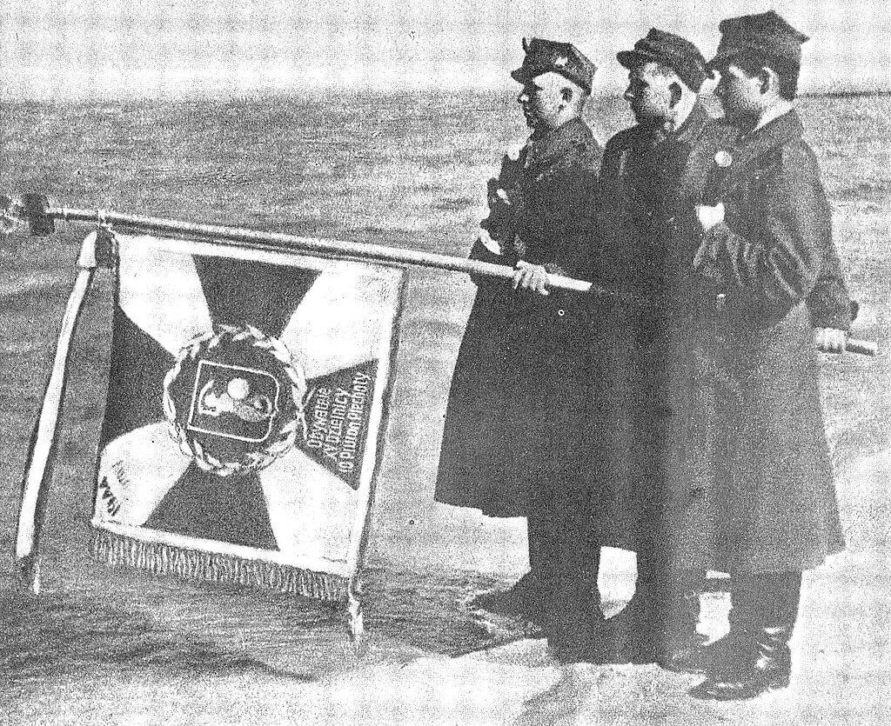

### Schloss Rheydt

Schloss Rheydt (Nadrenia Północna-Westfalia) to renesansowy pałac kilka km na zachód od Düsseldorfu. W obecnej zachowanej formie to dzieło włoskiego fortyfikatora Alessandro Pasqualiniego, aktywnego w Holandii przez 18 lat w połowie XVI wieku.

W latach 1940-45 była to rezydencja Josefa Goebbelsa, który w 1940 zamówił przebudowę u... Emila Fahrenkampa. Zaskakujące, ponieważ to ten sam Emil, którego dziełem jest berliński Shell-Haus z 1930-31. O tym budynku Hitler uważający się wszak za artystę i traktujący architekturę poważnie powiedział do Emila "*popełniłeś zbrodnię*".

Dzisiaj to właśnie w tym zamku Goebbelsa, w otoczeniu hitlerowskiej symboliki, na tle wielkiej swastyki modlił się, wraz żołnierzami, rabin kapitan Manuel Poliakoff z 29. DP US Army. Podczas tej modlitwy zostało wykonane słynne zdjęcie [Jewish chaplain (Rabbi) Captain Manuel Poliakoff of the US Army 29th Infantry Division (center) conducting a memorial service in Schloss Rheydt, the former home of Joseph Goebbels, 18 Mar 1945.](https://ww2db.com/image.php?image_id=25197)

Manuel Poliakoff przed wojną skończył szkołę talmudyczną w Baltimore, a szkolenie rabiniczne odbył w jesziwie w Telsze (Litwa). Po wojnie był przywódcą duchowym amerykańskiej Orthodox Beth Isaac Adath Israel (1946-86), był w zarządzie szkoły dla dziewcząt Bais Yaakov i w Stowarzyszeniu Edukacji Hebrajskiej. Od 1951 znowu w służbie wojskowej i został głównym rabinem bazy wojskowej w Indiantown Gap (Pensylwania).

### Bombardowanie Berlina

1250 samolotów USAF zbombardowało Berlin.

Do końca marca 1945 Berlin doświadczył 314 bombardowań, z tego w ciągu poprzedniego roku 85. Liczbę wszystkich ofiar śmiertelnych bombardowań szacuje się na 20 do 50 tys. ludzi (najbardziej zabójcze było bombardowanie Hamburga w 1943 - 40 tys. zabitych).

### Hitler

Zapowiedź przerażającego "rozkazu Nerona" z dnia następnego. Adolf Hitler do ministra gospodarki Alberta Speera:
>Jeżeli wojnę przegramy, zginie również naród. Nie musimy myśleć o warunkach, jakie mu będą potrzebne do dalszej prymitywnej egzystencji. Przeciwnie, Lepiej będzie, jeśli sami wszystko zniszczymy, ponieważ nasz naród okazał się słabszy, a przyszłość należy wyłącznie do silniejszego narodu wschodniego. To, co pozostanie po tej wojnie, reprezentować będzie mniejszą wartość, albowiem ci lepsi zginą.

Jaki element doktryny nazistowskiej pozwala na założenie, że lepsi zginą, tego nie wiem. Przecież to krew zwycięża, nie zaplecze, logistyka, silniejsze bataliony, nieprzerwane dostawy materiałów wojennych i pieniądze. Te same pieniądze, którymi tak gardzili i które kradli przy każdej okazji. Według narodowego socjalizmu lepsza rasa, lepsza krew zwycięża, choćby wróg przeważał siłą, gospodarką, wszystkim co potrzebne jest do zdobycia przewagi, to wbrew materii wola i krew ma decydować o wszystkim. W imię tej teorii Niemcy wyzwały cały świat do wojny. Jak Hitler sam przyznaje, może się okazać, że "*przyszłość należy wyłącznie do silniejszego narodu wschodniego*". Jak to możliwe, że tak pogardzane słowiańskie, półdzikie hordy mogą zwyciężyć i okazać się silniejsze? A nawet jeśli, to dlaczego to co pozostanie "*reprezentować będzie mniejszą wartość*"? Zupełnie niemożliwe, jest żeby lepsi zginęli, przecież lepsi zwyciężają. Dlatego właśnie są lepsi. Taka jest hitlerowska teoria.

18 marca zostało wykonane prawdopodobnie ostanie zdjęcie Hitlera. Podczas dekoracji generała Theodora Tolsdorffa, który otrzymał wtedy Krzyż Rycerski Krzyża Żelaznego z Liśćmi Dębu, Mieczami i Brylantam (niem. Ritterkreuz des Eisernen Kreuzes mit Eichenlaub, Schwertern und Brillanten), awans na generała porucznika i dowództwo LXXXII Korpusu Armijnego. Specjalnie w tym celu został ściągnięty z frontu. Uroczystość odbyła się oczywiście w bunkrze.

- Mark Felton Productions ["The Last Photo of Hitler" [YT 3:19]](https://www.youtube.com/watch?v=IpHfAdKeXkQ)

### Werner Mölders

Urodziny Wernera Möldersa, który zginął w katastrofie podczas lądowania we Wrocławiu, na lotnisku na Gądowie Małym (niem. Klein-Gandau) 22 listopada 1941.

<SeeAlso txt="Podpułkownik Werner Mölders (1913-41)" url="/festung-breslau/article/werner-molders" />

### Kołobrzeg

Nacierający Polacy minęli dworzec i przez park dotarli do promenady nadmorskiej. Kiedy polscy żołnierze dotarli do basenu portowego wtedy już generał Fullriede uciekł na łodzi. Osłaniające twierdzę okręty niemieckie otwierają ogień do zdobywców. Ale tom już jest koniec.

Polegli: 3 DP 368 żołnierzy, 4 DP 268 żołnierzy, 6 DP 504 żołnierzy, łącznie 1229 zabitych. Do tego około 420 czerwonoarmistów.

Zakończyła się dramatyczna i trwająca ponad dwa tygodnie zaciekła bitwa o Kołobrzeg. Miasto zostało zniszczone w 95%. Z kilku powodów było to miasto trzymane przez hitlerowców za wszelką cenę.

Po pierwsze miał ogromne znaczenie symboliczne. To tu w 1807 trzymał się major Gneisenau, symbol nieugiętego oporu. Dla Hitlera był to wzór oficera, o wyznaczonego do obrony Kostrzyna zapytał tylko "*Czy to Gneisenau?*" i zgodził się na niego po zapewnieniu, że tak.

Ta obrona Kołobrzegu stała się dla propagandy hitlerowskiej punktem odniesienia i metaforą obecnych zmagań, bo całe Niemcy miały sie stać tak jak Kolberg broniony przez Gneisenau. Do tego stopnia, że jeszcze w 1944 przemysł filmowy, czyli maszyna propagandowa Goebbelsa kręcił kolorowy, pełnometrażowy film o bitwie o miasto. Film kręcono w Kołobrzegu i okolicach, żołnierzy grali prawdziwi żołnierze Wehrmachtu, których sprowadzono na plan 5 tys. Żeby latem nakręcić sceny zimowe, na plan dostarczono 100 wagonów soli. Pierwsze wewnętrzne pokazy w grudniu 1944 zachwyciły Hitlera. Premiera odbyła się w dwóch miejscach równocześnie - w obleganym porcie La Rochelle i Berlinie 30 stycznia w 12 rocznicę objęcia władzy przez NSDAP. Dzisiejsze zdobycie Kołobrzegu zostało przez Goebbelsa wykreślone z komunikatu wojennego. Więcej o tym filmie napisałem w dniu jego premiery 30 stycznia.

Po drugie Kołobrzeg osłaniał operację ewakuacyjną Hannibal i mógł stanowić miejsce wyładowania wojska atakującego prawą flankę uderzenia na Berlin. Od utraty Kołobrzegu Niemcy byli na Bałtyku bezbronni.

Starszy szeregowy Karol Wacławiak, Ślązak z pochodzenia w Kołobrzegu sam wziął do niewoli 34 Niemców.
>Przekradał się [jako łącznik] przez gruzy i rozpadliny do swoich z meldunkiem. [...] 
>W pewnej chwili usłyszał niemiecką mowę. Po cichu przysunął się i zobaczył właz do piwniczki czy schronu. Nie wiedział, ilu Niemców siedzi pod nim. Dla dodanie sobie odwagi rzucił po niemiecku solidną wiązkę i zakończył efektownym wezwaniem do wychodzenia, rzucania broni, poddania się. 
> - Hände hoch! 
>Wyszedł pierwszy, drugi, trzeci... Wacławiak nie trefił. Przy dziesiątym miał sucho w gardle. Przy dwudziestym – mokre kolana. Dwudziesty piąty wprawił go w bezruch. Zapomniał języka w gębie. Pewność odzyskał przy trzydziestym, wydając komendę nieistniejącemu plutonowemu. 34 hitlerowców wziął do niewoli z głupia fart. Trzeba mieć szczęście w nieszczęściu!

S. Białoszewicz Młodzi u kombatanta, "Wiadomości" 1980, nr 20 w "Studia z dziejów wojskowości" t. VII Białystok 2018

- [Z okazji przypadającej dziś 76 rocznicy zakończenia bitwy o Kołobrzeg warto przypomnieć unikatowe fotografie udostępnione przez Pana Waldemara Wielesiuka.](https://www.facebook.com/ludowewojsko/posts/664897654204038)
- [Walki o Kołobrzeg stoczone w dniach 4–18 marca 1945 roku obfitowały w wiele dramatycznych momentów.](https://www.facebook.com/permalink.php?story_fbid=2984373748499793&id=2353805098223331)
- Miasto Kołobrzeg ["Odcinek 1 - podejście pod Kołobrzeg" [YT 18:42]](https://www.youtube.com/watch?v=-_EWaMa2nkA) | ["Odcinek 2 - broń pancerna w walkach o Kołobrzeg" [YT 24:15]](https://www.youtube.com/watch?v=DXq6UbR1FBE) | ["Odcinek 3 - walki o kościół Św. Jerzego." [YT 14:40]](https://www.youtube.com/watch?v=ajAJS9FEzKE) | ["Odcinek 4 - kobiety w walkach o Kołobrzeg" [YT 13:31]](https://www.youtube.com/watch?v=c97ZFKQtTjk) ["Odcinek 5 - zaślubiny z morzem" [YT 15:32]](https://www.youtube.com/watch?v=uhcYJbhsU3U)
- Twierdza Kołobrzeg [14-18 marca: Droga ku morzu](https://twierdzakolobrzeg.pl/twierdza/rok-1945/199-14-18-marca-droga-ku-morzu)
- Olaf Popkiewicz ["Bój o Kołobrzeg 1945" [YT 1:12:56]](https://www.youtube.com/watch?v=FRcRu3hCS4c)
- Robert Dziemba [Historia Kołobrzegu po 1954 [PDF]](https://historiakolobrzegu.pl/images/pliki/historia2.pdf)

### Zaślubiny Polski z morzem

Tego dnia, właśnie w Kołobrzegu, odbyły się trzecie podczas tej ofensywy, i już ostatnie zaślubiny Polski z morzem.

Do dokonania tego aktu został wybrany ze względu na chłopskie pochodzenie kapral Franciszek Niewidziajło, wypowiedział przy tym napisane przez siebie słowa:
>Przyszliśmy, Morze, po ciężkim i krwawym trudzie. Widzimy, że nie poszedł na darmo nasz trud. Przysięgamy, że Cię nigdy nie opuścimy. Rzucając ten pierścień w Twe fale, biorę z Tobą ślub, ponieważ Tyś było i będziesz zawsze nasze.

Przeżył wojnę, zmarł we Wrocławiu w 1978, pochowany jest na cmentarzu w Sławie.

*Zaślubiny Polski z morzem, 18 marzec 1945, Kołobrzeg. 10 Pułk 4 Pomorska Dywizja Piechoty 1 Armia WP. 
By nieznany - Ten image pochodzący z zasobów [Biblioteki Kongresu Stanów Zjednoczonych](https://commons.wikimedia.org/wiki/Library_of_Congress), oddziału Prints and Photographs division jest dostępny pod numerem [ppmsca.00753](http://hdl.loc.gov/loc.pnp/ppmsca.00753).Ten szablon nie wskazuje stanu prawnego pliku. Standardowy szablon licencji jest nadal wymagany. Aby dowiedzieć się więcej zajrzyj na stronę [Commons:Licencja](https://commons.wikimedia.org/wiki/Commons:Licencja)., Domena publiczna, [Link](https://commons.wikimedia.org/w/index.php?curid=482068)*

### 1 Front Ukraiński

1 Front Ukraiński: Biała, Prudnik i Niemodlin!

### Wrocław

Ksiądz Peikert opis dzisiejszego dnia zaczyna od relacji charakteru działań Armii Czerwonej, czy w nocy odbywały się jakieś walki, czy rano spadły bomby, czy ogień jest intensywny. Wróg staje się immanentną właściwością zewnętrznego świata, jest wszędzie naokoło i nie zamierza nigdzie odejść. Jest czymś, co się znajduje w miejscach, które niegdyś były Wrocławiem, które niegdyś miały mieszkańców, a teraz są ruinami. Przeszłość umarła, ale nie w typowy dla siebie sposób, niepostrzeżenie z dnia na dzień stając się domeną pamięci. Została najechana obcym wojskiem, rozstrzelana, wysadzona w powietrze, zmiażdżona ogniem artylerii, spalona bombami zapalającymi i miotaczami ognia. Przejechały po niej czołgi i przeszła piechota, obrzucając każde okno granatami. Tymczasem to, co wciąż jest Wrocławiem, tym miastem, w którym mieszkają, a w każdym razie jeszcze żyją wrocławianie, ci którzy jeszcze żyją, też już nie jest dawnym Wrocławiem, tym miastem, które niegdyś miało mieszkańców, a teraz jest ruinami zamieszkanymi przez naród ludzi żyjących w piwnicy.

Później przechodzi do pogody:
>Wczesnym rankiem jest chmurno i dżdżysto, jednak w ciągu dnia wypogadza się. Nastaje łagodna, a nawet słoneczna pogoda.

Piękna niedziela, ale ponieważ nowy komendant twierdzy 7 marca wprowadził powszechny obowiązek pracy, nie ma dni wolnych ani żadnych wyjątków, juz 13 marca miała miejsce pierwsza egzekucja, a dwa dni później napisała o tym gazeta Twierdzy. Peikert pisze dalej:
>Ze względu na obowiązek pracy i na to, że w obrębie twierdzy nie ma już mowy o niedzieli, wprowadziłem znów mszę wieczorną, aby tym wszystkim, którzy nie mogą przed południem przyjść do kościoła, dać możność udziału w świętej ofierze mszy.

Msze odbywają się też rano:
>O godz. 7 na mszy św. jest bardzo dużo obecnych. Ludność korzysta chętnie z wczesnych godzin rannych, ponieważ wtedy jeszcze aktywność samolotów nieprzyjacielskich jest całkiem słaba. Stąd pełny kościół o godz. 7. Wszczął się jednak niezwykle silny ogień artyleryjski, który największe nasilenie osiągnął w czasie mszy św., zwłaszcza podczas Przeistoczenia. Był taki huk i grzmot, że kościół zatrząsł się w posadach, a okna drgały.

Nie da się słowami opisać życia, w którym nie ma żadnej ucieczki, nawet nie można się ukryć w piwnicy, bo grozi za to rozstrzelanie, nie można nawet uciec w sen, bo wojna nie pozwala zasnąć. Wyczerpani przerażeni ludzie utracili już wszystko. Ostatnie co jeszcze chcą uratować, własne życie, wojskowe władze twierdzy wystawiają na śmiertelne ryzyko, zmuszając do pracy przy budowie lotniska, które Peikert opisuje:
>Okropne wrażenie sprawiają okopcone zwaliska i resztki murów podpalonej w ubiegłym tygodniu dzielnicy szczytnickiej. Wieża kościoła Lutra sterczy ciągle jeszcze z tego królestwa gruzów. Wszelkie próby jej wysadzenia nie powiodły się dotychczas. [...] Ten olbrzymi obszar ruin był jedną z najpiękniejszych dzielnic Wrocławia. Nowocześnie i wytwornie urządzone domy, piękne wytyczone aleje drzew i wspaniałe parki padły ofiarą furii niszczenia naszego dowództwa twierdzy. Każdy pyta, dlaczego i po co? Ten olbrzymi plac ma się stać lądowiskiem? Czyżby oblężenie Wrocławia miało jeszcze trwać tak długo, aż ten olbrzymi plac zostanie do tego przygotowany? Albo czy uważa się, że nieprzyjaciel będzie się spokojnie przyglądał, jak tu w środku twierdzy powstaje nowe lotnisko? Czyż nie będzie stale niszczył robót ogniem z broni pokładowej? W każdym razie każdy rozsądny człowiek jest do głębi oburzony niszczycielską robotą, dokonaną tu przez gauleitera i komendanta twierdzy. Jest to ten sam szał niszczenia, który [...] każe wyrzucać na ulicę wszystkie meble z mieszkań, wszystką bieliznę i wszystkie inne sprzęty domowe. Jest to ten sam szał niszczenia, który przedmioty te zrzuca na wielkie stosy, każąc je polać paliwem, by wszystko spłonęło. Jest to ten sam szał niszczenia, który przy pomocy specjalnych oddziałów podpalaczy wydaje na łup ognia całe bloki mieszkalne"

Czasem we Wrocławiu ekscytujemy się możliwością ujrzenia zorzy polarnej. Wrocławianie w marcu 1945 widzą inną zorzę:
>Niebo od południa znów bardzo intensywnie zaczerwienione, tak że kościół i plebania stoi jak w poświacie księżyca, nie jasnosrebrzystej, lecz krwawoczerwonej. Wieczorem słychać, jak głośnik na pl Maurycego przekazuje rosyjską propagandę i muzykę.

Ta ostatnia uwaga jest trudna do zrozumienia. Może chodzi o głośniki, sowieckie gigantofony słyszalne nawet na pl. Maurycego. Również ksiądz Laßmann pisze o wyniośle stojącej wieży na pl. Grunwaldzkim:
>Kościół im. M. Lutra oparł się dzisiaj wszystkim próbom wysadzenia go w powietrze. Dzisiaj miał jednak ostatecznie paść ofiarą szału zniszczenia.

Hugo Hartung dziś po raz pierwszy - korzystając z tego, że niebo jest wyjątkowo spokojne, wychodzi na powierzchnię:
>Dzisiejsza niedziela jest mglista i dzięki temu nie ma nalotów. Chociaż to właściwie zabronione, wychodzę około południa do ogrodu klasztornego, by zobaczyć tamtejsze śnieżyczki. Nie zastaję w nim jednak pięknego widoku, bo pełno tam najprzeróżniejszych brudów, stert śmieci i zakrwawionych opatrunków. Dopiero teraz zauważa jak podziurawione są mury naszego konwentu. Również w okolicznych budynkach powiewają poszarpane, osmolone resztki firan. Nigdzie nie ostała się choćby jedna szyba. Ciepłe wiosenne powietrze przyprawia mnie o zawroty głowy".

### Operacja opolska

Operacja opolska rozwija się z powodzeniem, pomimo początkowych trudności spowodowanych pogodą i zaciekłym oporem dobrze umocnionej armii niemieckiej.

17 marca 4 Armia Pancerna zdołała przełamać obronę i sforsowała Nysę Kłodzką, opanowała rejon Ścinawy Małej, a dziś doszła do Prudnika, gdzie nastąpiło przewidziane planem i zgodne z harmonogramem operacji połączenie z siłami południowego zgrupowania uderzeniowego, oddziałami 60 Armii i 31 Korpusu Pancernego. W nagrodę jej dowódca dostał telegram z Moskwy z rozkazem przemianowania jednostki na 4 Armię Pancerną Gwardii. 55 Korpus 21 Armii dziś zdobył Niemodlin, a 115 Korpus 59 Armii Koźle i wysuwając się na zachód dotarł w okolice Głogówka. To zamknęło Grupę Korpuśną Schlesien i część 11 Korpusu 1 Armii Pancernej, które dziś porzuciły obronę pozycji i rozpoczynają walkę o wyrwanie się z okrążenia.

- Walki o Prudnik. [PRUDNIK - NEUSTADT1945 – W ZDOBYTYM MIEŚCIE](https://www.facebook.com/bobr1945/posts/3725266954253607)