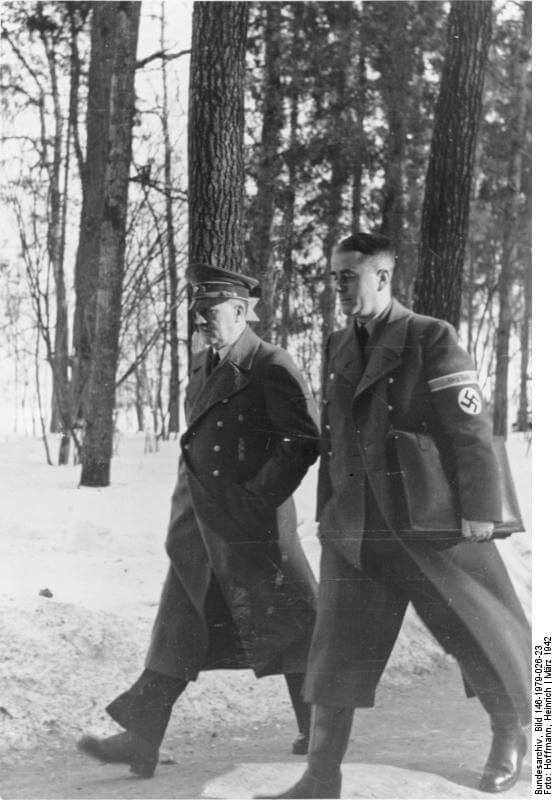

### Rakiety

Więcej o historii sowieckiego programu rakietowego będzie 23 kwietnia. Tutaj jednak warto odnotować wydarzenie, które odbywa się nieco na marginesie.

Generał Boris Lwowicz Wannikow, w latach 1942-46 ludowy komisarz amunicji miał ambicję stworzenia własnego programu rakietowego. Władze, które już wtedy zrozumiały jakiego postępu w tej dziedzinie dokonali Niemcy zgodziły się z nim i 19 marca 1945 powołano Państwowe Centralne Biuro Projektowe - 1 (ros. государственное центральное конструкторское бюро, w skrócie ГЦКБ-1), którego nazwa zdradza dokładnie tyle ile powinna.

Dodajmy, że konkurencyjny instytut rakietowy działający w ramach ministerstwa lotnictwa nosił nazwę Instytut Badawczo Rozwojowy - 1.

Wannikow w 1946 nagle został ludowym komisarzem inżynierii rolniczej, co dowodzi że po pokonaniu hitlerowskiego imperialisty Kraj Rad przekuł miecze na lemiesze. Oczywiście to nieprawda. Po prostu zasłużony towarzysz został przesunięty do działu broni atomowej. Jego oficjalne stanowisko - co jest całkowicie zrozumiałe - w żaden sposób nie określało czym naprawdę się zajmuje.

### Fast Carrier Task Force

Port w Kure (Honsiu) był jedną z największych japońskich baz morskich. Pod koniec wojny znajdowały się tam resztki Połączonej Floty. Do niedawna cumował tam Yamato.

W dniach 16-17 marca 1945 miasto i węzeł kolejowy Kobe został zbombardowany przez 300 B-29.

Główną siłą uderzeniową US Navy na Pacyfiku była Fast Carrier Task Force (pl. szybka grupa uderzeniowa lotniskowców). Były to cztery niezależne grupy uderzeniowych mające w sumie 15 lotniskowców, każda składała się z trzech lub czterech lotniskowców i kilku okrętów osłony. Amerykanie odwrócili dotychczasowy sposób walki: ataku dokonywały samoloty, które miały większy zasięg i większą precyzję niż dotychczas stosowany ogień artylerii głównej okrętów liniowych. Natomiast dotychczasowy rdzeń floty, czyli pancerniki i niszczyciele służyły jako osłona plot dla lotniskowców.

W składzie 5 Floty admirała Spruance'a nosiła nazwę Task Force 58. Kiedy przeszła w skład 3 Floty admirała Halseya, przemianowano ją na Task Force 38.

Jako Task Force 58 opuścili bazę w atolu Ulithi 14 marca. Zadaniem tej misji była likwidacja lotnisk i infrastruktury lotniczej na wyspach Kiusiu i Honsiu przed planowaną na 1 kwietnia inwazją Okinawy.

18 marca samoloty TF 58 zaatakowały 45 lotnisk na Kiusiu, ale te w większości były już opuszczone. Japońskie lotnictwo i marynarka przypuściły desperacki atak na amerykańskie lotniskowce. Efektem były niewielkie uszkodzenia na USS Enterprise i USS Intrepid. Poważniej został uszkodzony USS Yorktown, bomba zabiła 5 i raniła 16 marynarzy, zniszczono 110 japońskich samolotów.

Sukcesem tego dnia był zwiad lotniczy, który ustalił skład floty w portach Kure i Kobe. W Kure był Yamato, Haruna i trzy lekkie lotniskowce.

19 marca trzy grupy miały zaatakować Kure, a jedna Kobe.

Lotniskowiec USS Franklin został trafiony dwoma bombami i na okręcie rozpętał się pożar, który objął samoloty, w wyniku eksplozji i ognia zginęło 724 marynarzy, a 265 zostało rannych. W walce powietrznej Amerykanie stracili 14 samolotów a Japończycy 25.

Ponad 300 samolotów (czyli więcej niż zaatakowało Pearl Harbor) skierowano na port Kure, gdzie celem była japońska flota. Efektem były jedynie niewielkie zniszczenia, żaden okręt nie został zatopiony, poważnie uszkodzono lotniskowiec osłony Kaiyō i lekki krążownik Ōyodo. W wyniku silnej obrony plot utracono 13 samolotów.

Ogółem rezultaty ataku były niezadowalające. USS Franklin był tak uszkodzony, że już do końca wojny nie wziął udziału w żadnej operacji. Jeszcze tego samego dnia TF 58 zaczęła się wycofywać na południe, walki trwały do 21 marca.

Kolejną operacją TF 58 był atak na Yokosuka 18 czerwca i ponownie na Kure 24-28 czerwca wspólnie z British Pacific Fleet. Tym razem zarówno skutki ataku, jak i straty własne były poważne.

<SeeAlso txt="Wojna na Pacyfiku 1945" url="/festung-breslau/article/pacyfik-1945" />

- [Attack on Kure (March 1945)](https://en.wikipedia.org/wiki/Attack_on_Kure_(March_1945))

### Neronbefehl

Dzisiaj Hitler wydał tzw. rozkaz Nerona (niem. Nerobefehl), nakazujący wszystkim władzom wojskowym i partyjnym (Gauleiterzy jako Komisarze Obrony Rzeszy) zniszczenie wszystkiego "*co przeciwnik mógłby wykorzystać do kontynuowania walki*". Oznaczało to taktykę spalonej ziemi w Niemczech, wyraźnie była mowa bowiem, że dotyczy "wszystkich urządzeń przemysłowych, zaopatrzeniowych i pozostałych obiektów". Najwyraźniej wielu dowódców i przywódców partyjnych myślało już o Niemczech po Hitlerze albo tego dnia zaczęło tak myśleć, bo rozkaz ten nie został właściwie nigdzie wykonany. Przeciwstawił mu się nawet Speer, chociaż nie bezpośrednio, jak to opisuje w pamiętniku, w szeregu rozmów zapewnił niewykonanie tego rozkazu. Zresztą niewielu lokalnych dowódców byłoby do tego skłonnych.

<BoxImageWrapper>

Adolf Hitler i Albert Speer. 
By Bundesarchiv, Bild 146-1979-026-23 / Heinrich Hoffmann / CC-BY-SA 3.0, [CC BY-SA 3.0 de](https://creativecommons.org/licenses/by-sa/3.0/de/deed.en), [Link](https://commons.wikimedia.org/w/index.php?curid=5482989)
</BoxImageWrapper>

>Błędem jest przekonanie, że nie zniszczone, lub tylko na krótko sparaliżowane urządzenia komunikacyjne, łączności, przemysłowe i zaopatrzeniowe będą mogły zostać uruchomione przy odzyskaniu straconych terenów [...]. W związku z tym rozkazuję: 
> 
>1. Należy zniszczyć wszystkie urządzenia militarne, komunikacyjne, łączności, przemysłowe i zaopatrzeniowe, a także zapasy materiałowe znajdujące się wewnątrz terytorium Rzeszy, które wróg w jakikolwiek sposób może wykorzystać natychmiast lub po pewnym czasie dla kontynuowania działań. 
>2. Odpowiedzialne za dokonanie tych zniszczeń są wojskowe organy dowodzenia w odniesieniu do obiektów militarnych, łącznie z urządzeniami komunikacyjnymi oraz łączności, gauleiterzy i komisarze obrony Rzeszy w odniesieniu do wszystkich urządzeń przemysłowych, zaopatrzeniowych i pozostałych obiektów; gauleiterom i komisarzom obrony Rzeszy wojsko powinno udzielić pomocy koniecznej do wykonywania tych zadań. 
>3. Niniejszy rozkaz należy jak najszybciej przedstawić wszystkich wykonawców, Wszystkie zarządzenia przeciwstawne temu rozkazowi tracą moc.

- Dark Docs ["The Nero Decree - Hitler's Insane Order to Burn It All Down" [YT 10:38]](https://www.youtube.com/watch?v=sChoYjEx45c)

### Bombardowanie Jeny

W wyniku bombardowania Jeny (Turyngia) zginęło 140 ludzi.

### Bombardowanie Neuburga

Zbombardowano główne zakłady produkujące Me 262 w Neuburg an der Donau (Bawaria). Efekt był niewielki, bo ze względu na panowanie aliantów w powietrzu produkcja była rozproszona po wielu zakładach na sporym obszarze, a kluczowe elementy takie jak silniki Jumo 004 wytwarzano w podziemnych, fabrykach chronionych przed atakiem z powietrza.

Najlepszym przykładem był zakład w Walpersbergu, umieszczony w nieczynnej kopalni we wnętrzu góry. Produkowano tam kompletne samoloty, które potem wyciągano na płaski szczyt. Na nim znajdował się pas startowy, zmontowany samolot od razu leciał na docelowe lotnisko. Skrzydła powstawały w najstarszym niemieckim tunelu autostradowym w Engelberg (na zachód od Stuttgartu).

B8 Bergkristall-Esche II powstała sieć tuneli w St. Georgen/Gusen, w których pracowali więźniowie KL Gusen II. Powstawało tam prawie pół tysiąca kompletnych kadłubów miesięcznie. Średni czas życia więźnia tego obozu to pół roku. Od 35 do 50 tysięcy ludzi zmarło lub zostało zamordowanych w procesie produkcji Me 262.

### Ostrowiec Świętokrzyski

W Ostrowcu Świętokrzyskim, mieście znanym nam z zabicia podczas napadu rabunkowego wojewody kieleckiego Jana Foremniaka (odcinek: [16 stycznia, wtorek. "Niech Bóg ma Pana w opiece!"](/festung-breslau/blog/01-16/)) dochodzi do następnej zbrodni.

W lutym do Ostrowca zaczęli wracać Żydzi, z kilkunastu tysięcy ludzi do połowy marca wróciło ponad 200 osób. Ponieważ domy i majątek Żydów wywiezionych na zagładę zaginął, został zniszczony lub po prostu zajęty pojawiła się pogłoska, że "Żydzi wracają po swoje". Mówiono też, że wrócili, żeby się zemścić na ludziach, którzy przyczynili się do wywózek.

Do mieszkania zajmowanego przez Fajgę Krongold wtargnęło dwóch uzbrojonych chłopaków poakowców, domagając się listy ludzi, na których Żydzi chcą się zemścić. Zamordowali razem z Fajgą cztery przebywające tam osoby, kilku rannym udzielono pomocy w szpitalu. Wszyscy i strzelający i ofiary mieli po około 20 lat. Sprawcy uciekli, ale szybko ich odnaleziono i po długim śledztwie skazano na śmierć. Wyrok wykonano w październiku 1946.

Większość Żydów po morderstwie wyjechała z Ostrowca. Wg IPN-u sprawcy zbrodni byli "represjonowani z powodów politycznych".

- [Morderstwo w mieszkaniu Fajgi Krongold](https://blogwbudowie.blogspot.com/2018/03/morderstwo-w-domu-fajgi-krongold.html)

### 2 Armia WP

Najważniejsza rzecz dzisiaj została podjęta decyzja, która przypieczętuje los 2 Armii WP. Na szczeblu ponadfrontowym (Stawka?) uznano, że 6 Armia to jak się okazało za małe siły, by doprowadzić do przełomu w bitwie.

Operacja opolska została zakończona sukcesem. Widmo deblokady oddalone. Oblężenie było stabilne, ale jak ot pisze lakonicznie Majewski:
>W drugiej połowie marca pod rozkazy generała Głuzdowskiego skierowano pozostającą w odwodzie Frontu 112 Dywizję Piechoty. Nie wystarczało to jednak do wykonania przez 6 Armię postawionych przed nią zadań. Realną natomiast szansę na zdecydowaną zmianę wzajemnego stosunku sił obu stron walczących, a dzięki temu szybkie rozprawienie się z "Festung Breslau", stwarzało podporządkowanie marszałkowi Koniewowi ześrodkowanej dotąd na Pomorzu Zachodnim i w północnej części Ziemi Lubuskiej 2 Armii Wojska Polskiego. Nastąpiło to 19 marca. 
>2 Armia Wojska Polskiego, dowodzona przez generała dywizji Karola Świerczewskiego, po włączeniu w jej skład 1 Korpusu Pancernego i 2 Dywizji Artylerii, liczyła łącznie 90 700 żołnierzy i uzbrojona była m.in. w 431 czołgów i dział pancernych, 84 samochody i transportery opancerzone oraz około 1500 dział (wszystkich typów łącznie z przeciwlotniczymi) i moździerzy. Stanowiło to znaczną siłę, której użycie miałoby decydujący wpływ na przebieg walk o Wrocław.

Rozkaz Sztabu Naczelnego Dowództwa Czerwonej Armii nr 112001 z 19 marca 1945 brzmi:
>Druga Armia Wojska Polskiego w składzie 5, 7, 8, 9, 10 dywizji piechoty, 1 korpusu czołgów, 3 dywizji przeciwlotniczej, 8 i 9 brygady przeciwpancernej, 16 brygady czołgów, 5 pułku czołgów ciężkich, 28 pułku saperów, 3 pułku moździerzy, 4 brygady inżynieryjno-saperskiej, tyłów artyleryjskich ze wszystkimi posiadanymi zapasami - przechodzi ze składu wojsk 1 Białoruskiego Frontu w skład wojsk 1 Ukraińskiego Frontu.

Jutro ruszają. Marsz na pozycje wyjściowe do ataku zajmie im 10 dni. Zgodnie z rozkazem marsz zaczynali w godzinach wieczornych i kontynuowali w nocy. Na linii Leszno - Krotoszyn 2 Armia WP weszła w rejon operacji 1 Frontu Ukraińskiego.

### Wrocław

Peikert informuje nas, że to ostatni dzień, kiedy stał kościół Lutra:
>Gdy późnym wieczorem idę do klasztoru Św. Agnieszki, niebo na południu jest znowu bardzo czerwone. Przystaję na minutę przed wielkim krzyżem przy Klosterstraße i oto nad nami są już nieprzyjacielskie samoloty. Kto żyw ucieka do domów. Szybko przebiegam ulicę i wraz z 10 żołnierzami chronię się naprzeciwko w sieni domu. W tym samym momencie bardzo blisko z hukiem uderza bomba, na szczęście niewypał. W klasztorze Św. Agnieszki dowiaduję się, że w dniu dzisiejszym udało się wreszcie wysadzić i obalić wysoką wieżę kościoła Lutra; była ona ostatnim świadkiem, który jeszcze wczoraj mówił do nas o minionym pięknie tej części miasta, teraz zamienionej w pogorzelisko.

Bomba lotnicza lub pocisk artyleryjski, który po dotarciu do celu nie eksplodował to niewybuch, natomiast niewypał - jak sama nazwa wskazuje - to pocisk, który nie wypalił i pozostał w komorze amunicyjnej.
