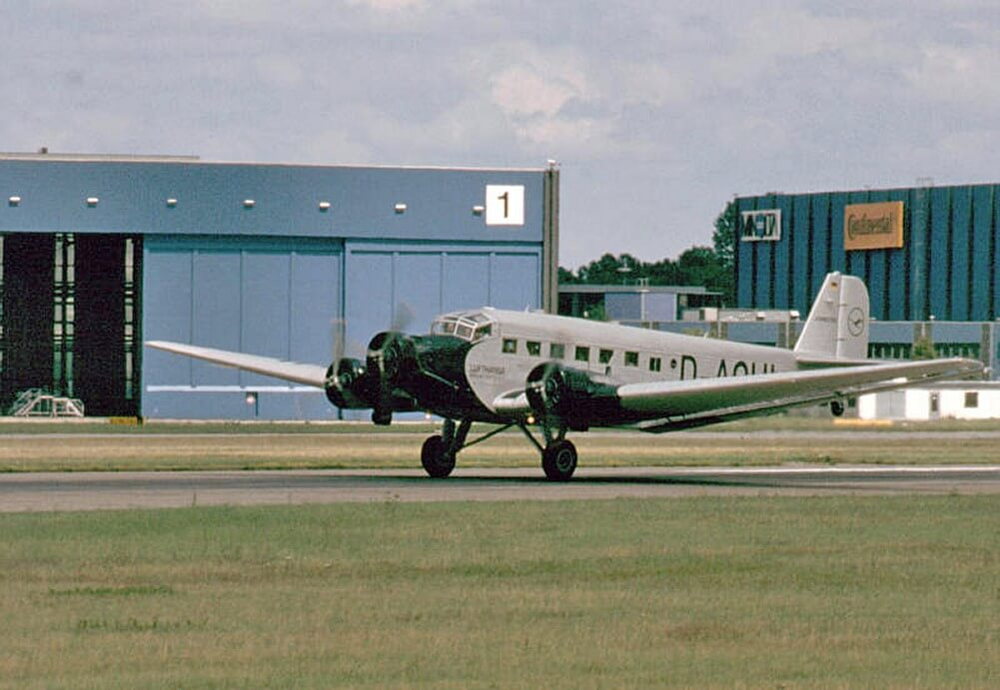

### Hitler

Ciąg dalszy odbicia Lubania 8 marca 1945, podczas którego odznaczył się szesnastoletni żołnierz hitlerjugend Willi Hübner. Został wtedy odznaczony Żelaznym Krzyżem. Na rynku Lubania przed kamerami kroniki filmowej gratulował mu Joseph Goebbels. Żądne bohaterów, a szczególnie młodocianych bohaterów, władze uznały, że można tę propagandową cytrynę wycisnąć jeszcze bardziej. Wbrew wszelkim regułom i przepisom odznaczono go za ten sam czyn jeszcze raz, tym samym odznaczeniem, tylko po to, żeby przy odznaczeniu był obecny Adolf Hitler. Dlatego specjalnie w tym celu ściągnięto Hübnera do Berlina.

Na potrzeby widowiska zorganizowano kilkuosobową grupę wzorowych żołnierzy Hitlerjugend. Artur Axmann przywódca (niem. Reichsjugendführer) Hitlerjugend ustawił swoich chłopców-żołnierzy pod Kancelarią Rzeszy i polecił im, by zachowywali pozycję spocznij, nie hajlując na powitanie Hitlera.

Adolf Hitler wyszedł z bunkra poznać swoich najmłodszych żołnierzy. Scenę tę rejestrowała kamera i jest to ostatni w ogóle zapis filmowy Hitlera. Widać w jak złej jest formie. Z trudem ukrywa trzęsącą się lewą rękę.

Materiał zdołano jeszcze umieścić ją w ostatnim wydaniu kroniki filmowej Die Deutsche Wochenschau, ale sytuacja wszędzie była już tak katastrofalna, że nie wiadomo czy i w ilu kinach ją pokazano.

Natomiast po wojnie sena ta stała się bardzo znana, bo często ją wykorzystywano w filmach dokumentalnych jako doskonałą ilustrację desperacji władz hitlerowskich.

- ["Wilhelm 'Willi' Hübner - one of the youngest recipients of the Iron Cross, 1945"](https://rarehistoricalphotos.com/wilhelm-willi-hubner-1945/)

### 1 Front Ukraiński

1 Front Ukraiński: Koźle!

### Dolny Śląsk

Już 18 marca sowieci zajmują Białą, Prudnik i Niemodlin.

W dniach 18-20 marca Niemcy za wszelką cenę usiłują wyrwać się z okrążenia, niejednokrotnie dochodziło do walk wręcz, ale nigdzie nie udało im się osiągnąć sukcesu. Od godzin południowych 20 marca 21 i 59 Armie ogólnowojskowe oraz 4 Armia Pancerna rozpoczęły przegrupowania w celu osiągnięcia rubieży Strzelin - Ziębice - Paczków - Opawa i na niej przejść do obrony osłaniając w ten sposób wschodni kraniec lewej flanki Frontu.

### Wrocław

Księdza Peikerta kolejne, chyba już trwałe nadejście wiosny. A przynajmniej stara się zwrócić na nią uwagę, by nie myśleć, o tym co widzi i przeżywa cały czas:
>Jest ciepły dzień wiosenny. Kiedy rano o godz. 6 idę do kościoła, słychać wiosenny koncert ptaków, które już przyleciały. Kosy, zięby, sikorki, szpaki śpiewają i gwiżdżą w zawody, zanosząc swą pieśń poranną ku odwiecznemu Stwórcy wszechrzeczy. I tylko w ludzkiej piersi zamiera każda pieśń radosna przez nasz powszedni smutek i udręczenie, które z dnia na dzień się pogłębiają. Napięcie psychiczne jest już tak wielkie, że dla ludzi nerwowych staje się nie do zniesienia. Z dnia na dzień większa jest liczba tych, którzy odbierają sobie życie. [...] Wydzielona przestrzeń dla grzebania naszych drogich zmarłych i poległych, i tak już skąpa, kurczy się coraz bardziej. Już wkrótce chyba trzeba będzie zająć ogród parafialny.

Opisuje tragedię rodziny, która schroniła się w zamienionej w schron piwnicy budynku bezpośrednio trafionego bombą lotniczą, bomba trafiła ukośnie w pierwsze piętro i wybuchła w piwnicy. Dwoje z czworo dzieci zginęło na miejscu:
>Przeżycia tego dnia oszołomiły mnie i przygnębiły. Niespokojna noc powoduje, że wieczorem jest się niezwykle zmęczonym i rozstrojonym. Dochodzą do tego jeszcze denerwujące przeżycia takiego dnia z jego ciągłymi niebezpieczeństwami zagrażającymi życiu człowieka. Dołóżmy do tego to cierpienie i tę nędzę, które w ciągu dnia literalnie zwalają się na duszpasterza właśnie w takich czasach. Przybity brzemieniem tych wszystkich przeżyć, tęskni człowiek za pokrzepiającym spoczynkiem. [...] Jakże tęskniłem za nocną ciszą! Jednakże i tej nocy walki powietrzne osiągały dramatyczne nasilenie i groziła nam noc pełna niebezpieczeństw i brzemienna w nieszczęścia.

Podobną historię opisuje ksiądz Laßmann na Ostrowiu Tumskim:
>Trafiony i całkowicie zniszczony został dom przy Prãlatenweg 14 [kard A. Hlonda] tzw. Monikaheim, w którego piwnicy mieszkała rodzina Grollmusów. Z wielkiego budynku została tylko sterta gruzów z całą tą rodziną pod spodem. Do godziny 20.00 nie udaje się dotrzeć do zasypanych. Jedno z dzieci zdaje się być jeszcze przy życiu bo z czeluści gruzowiska dobiega czasem słabe wołanie o pomoc. To dwunastoletnia Elisabeth, która ciągle jeszcze żyje pod zawalonymi pięcioma kondygnacjami domu. Gorączkowe próby wydobycia jej z głębi gruzowiska nie przynoszą rezultatów, a z nastaniem nocy trzeba było przerwać akcję ratunkową bo znów pojawiają się nad nami bombowce. Musimy pozostawić biedne dziecko same z jego śmiertelnym strachem w ciemnościach grobu jakim stała się dla rodziny ta piwnica. Tylko jeden Dobry Bóg wie jak cierpieć musiała Elisabeth uwięziona wśród potrzaskanych murów, nie mogąc się ruszyć, pogrzebana już za życia!

Los dziecka uwięzionego w ruinach piwnicy z całą swoją zabitą rodziną jest rzeczą straszną, ale w tym momencie trzeba sobie uzmysłowić jakim paradoksem były próby wyciągnięcia jej żywej przez grupę cywilizowanych dorosłych ludzi, podczas kiedy całe cywilizowane społeczeństwo dorosłych ludzi akceptowało przymus pracy pod ogniem lotnictwa i artylerii wydany wobec dzieci, 10-letnich chłopców i 12-letnich dziewczynek. Jeśli Elisabeth miała już skończone 12 lat i jeśli udałoby się ją wyciągnąć, to przecież następnego dnia rano musiałaby się zgłosić do pracy na budowie lotniska, położonego kilkaset metrów na wschód od piwnicy, w której była uwięziona. A jeśli by tego nie zrobiła, groził jej sąd i rozstrzelanie. Takie były warunki twierdzy generała Hermanna Niehoffa. Jeśli podzielimy ilość ofiar, o jakiej mówi się przy budowie lotniska przez czas jego budowy, wyjdzie nam, że każdego dnia musiało ginąć tam ponad 200 osób. Już to dowodzi, że liczba ta jest znacznie przeszacowana. Ale nawet jeśli wziąć kilkukrotną poprawkę (na jakiej podstawie?), to i tak równie dobrze moglibyśmy nazwać to lotnisko polem śmierci. Tylko ci, którzy to przeżyli wiedzą, jak cierpieć musieli rodzice zmuszeni do wysyłania własnych dzieci w takie miejsce.

### Luftwaffe

Dzisiejsza data pojawia się też w ważnym meldunku Luftwaffe z 23 marca, jak donosi raport Luftflotte 6:

>4. Aby dotrzeć do Twierdzy Wrocław, samoloty zaopatrzeniowe muszą przebyć trasę 200 km, nad terenem zajętym przez przeciwnika, wyłącznie w nocy, wykonując "ślepy lot". 
>5. Konieczność zaopatrywania twierdzy na tak wielką skalę, długie trasy przelotu oraz zmasowane w rejonie Wrocławia nieprzyjacielskiej obrony przeciwlotniczej i myśliwców nocnych, powoduje, iż wykonanie otrzymanego zadania możliwe jest tylko za cenę dużych strat samolotów Ju-52. Do dnia 20.03 w czasie zaopatrywania Twierdzy Wrocław utracono 84 samoloty Ju-52 i 8 samolotów He-111. W dniu 20.03 do dyspozycji 6 Floty Powietrznej pozostaje jedynie 76 samolotów Ju-52, z których 45%, tzn 35 samolotów, jest sprawnych. Przy dotychczasowym tempie strat w ciągu 14 dni do dyspozycji nie pozostanie ani jeden Ju-52 i wówczas do zaopatrywania Twierdzy Wrocław pozostaną wyłącznie He-111. Melduje, że Ju-52 w normalnych warunkach zabierał 2 tony ładunku, natomiast w warunkach bojowych 1,3 tony. Przy użyciu He-111, które zabierają maksymalnie po 0,7 tony, konieczne będzie jednorazowe użycie 65 samolotów He-111. Wykluczy to w praktyce prawie całkowicie wsparcie wojsk lądowych przez bombowce.

*Junkers Ju 52/3m 
By [Mex](https://de.wikipedia.org/wiki/User:Mex), [CC BY-SA 3.0](http://creativecommons.org/licenses/by-sa/3.0/), [Link](https://commons.wikimedia.org/w/index.php?curid=169682)*

### 2 Armia WP

Zaczyna się też mało znany epizod z historii 2 Armii WP, cała Armia bowiem pod dowództwem generała dywizji Karola Świerczewskiego - na podstawie wydanego 19 marca rozkazu - z rejonu Strzelec Krajeńskich i Gorzowa Wielkopolskiego rozpoczęła przegrupowanie w rejon Trzebnicy, gdzie wejdzie w skład 1 Frontu Ukraińskiego. Dotychczas brała udział w walkach na Pomorzu jako część 1 Frontu Białoruskiego.

Jak wspomina podporucznik Ryszard Skała z 1 Korpusu Pancernego (później dziennikarz wrocławski):
>Przypomniano sobie widocznie o nas. Żołnierze bez słowa bez słowa przystąpili do przeglądania broni, pakowania plecaków, sprawdzania ekwipunku. Pod wieczór dużo mówiło się o Wrocławiu. Sceptycy kiwali głowami, rysowali palcem na czole jednoznaczne kółeczka, kpili na potęgę. Wrocław? Bzdury. Zanim tam dojdziemy "fryce" poddadzą się, albo zginą pod gruzami. Bałtyk? Zgoda, Berlin? Zgoda, Wrocław? E...! 
>Po kilku godzinach wiedzieliśmy o Wrocławiu wszystko. Skąd? Nikt nawet nie próbował ustalić. A więc i we Wrocławiu bronią się doborowe oddziały, a wśród nich SS. [...] Oddziały oblegające ponoszą poważne straty. 
>Żołnierze gadali o Wrocławiu bez przerwy. Milczeli tylko wyżsi oficerowie związani sztabową tajemnicą. Dowódcy kompanii i plutonów omawiali pomiędzy sobą dotychczasowe doświadczenia z walk prowadzonych w mieście, klęli odległość pomiędzy Gorzowem a Wrocławiem, uważając słusznie, że taki szmat drogi może zdziesiątkować wojsko nie gorzej niż niejedna bitwa.

Dystans rzeczywiście był problemem niebagatelnym, przede wszystkim dlatego, że piechota nie miała żadnych środków transportu. Cała 2 Armia, ponad 90 tysięcy żołnierzy miała tę odległość pokonać pieszo i dla zmylenia przeciwnika maszerując tylko w nocy.

### Der Freiheits-Kampfer

4 numer "Bojownika Wolności" pisma [Antifaschistische Freiheitsbewegung](/festung-breslau/blog/02-04/) (pl. Antyfaszystowski Ruch Wolności) z 20 marca 1945: 
>Neron we Wrocławiu 
> 
>Niehoff polecił m.in. spalić i zburzyć Kaiserstrasse (główna oś placu Grunwaldzkiego) i całą dzielnicę aż do Kaiserbrucke (Mostu Grunwaldzkiego), milionowe wartości niemieckich dóbr narodowych zostały w ten sposób zniszczone. Historia podpalenia Rzymu przez najemników Nerona spotkała się z potępieniem, ze strony potomności. Zbrodniarz Niehoff przewyższa jednak znacznie pęd do zniszczeń Nerona. Dawniej groziła w Niemczech kara śmierci za podpalenie stogu słomy. Dziś we Wrocławiu na śmierć skazuje się tego kto odmawia pomocy nazistowskim kreaturom przy podpalaniu i burzeniu. 
>Najwyższy już czas, by wszyscy uczciwi ludzie połączyli się i wspólnie przeciwstawili tym podpalaczom. 

-[Full text of "Odra 5 1961"](https://archive.org/stream/Odra351961/Odra%203%205%201961_djvu.txt)