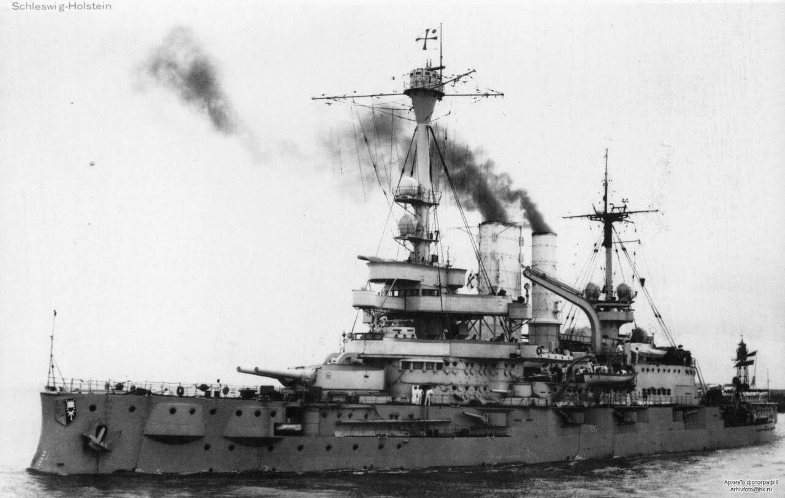

### Miktila i Mandalaj

Ostatnia batalia o centralną Birmę trwała od początku lutego 1945 i ostatecznie zakończyła się 21 marca.

Tego dnia indyjska 19 Dywizja miała zaatakować zabytkowe centrum Mandalay, w którym za fosą i grubymi murami schroniła się reszta japońskich sił. Ale kiedy ruszyli do ataku okazało się, że w nocy Japończycy opuścili miasto tunelami ściekowymi.

Anglicy podczas tej ofensywy stracili 18 tys. ludzi, ale zdobyli centralną Birmę. Japończycy natomiast stracili 1/3 sił w tym rejonie, a reszta ich wojsk trwale pozostała w rozsypce.

Wojna w Birmie miała strategiczne znaczenie dla całego pacyficznego teatru walk. Przez Birmę wiódł jedyny lądowy szlak zaopatrzenia dla wojsk alianckich walczących w Chinach.

### Bombardowanie Kopenhagi

Do tragicznej pomyłki doszło podczas bombardowania Kopenhagi dokonanego na prośbę duńskiego ruchu oporu. Celem brytyjskich bombowców miała być siedziba Gestapo i zniszczenie ich akt, co w tym ważnym momencie na wystarczająco długi czas sparaliżowałoby ich działanie. Niestety bomby spadły na szkołę odległą od celu 1,5 km. Zginęło 102 ludzi, w tym 86 dzieci.

### "Dziewczyna z rudymi włosami"

Troje przyjaciół: Trus i Freddie Oversteegen oraz Hannie Schaft od 1943 stopniowo coraz bardziej angażowali się w działalność antyhitlerowskiego ruchu oporu w Holandii. Coraz większy rygor okupanta wymuszał posłuszeństwo, w 1943 wprowadzono prawo wymagające na wszystkich studentach podpisanie lojalki. 80% holenderskich studentów odmówiło.

Zaczęli od drobnych rzeczy takich jak załatwienie fałszywych dokumentów tożsamości dla ukrywających się Żydów. Byli kurierami. Ale w 1944 postanowili wziąć udział w walce. Najbardziej zaangażowana była Hannie Schaft, nauczyła się mówić po niemiecku żeby zwabiać żołnierzy Wehrmachtu i zabijać ich. Zabijała także holenderskich kolaborantów. Freddie i Hannie tworzyły śmiertelnie niebezpieczną parę. Świadkowie zamachów zeznali, że jedna ze sprawczyń miała charakterystyczne rude włosy. Już wkrótce "dziewczyna z rudymi włosami" znalazła sie na liście poszukiwanych. Hannie zafarbowała włosy na czarno.

Najbardziej aktywnym kolaborantem był Fake Krist pracujący dla SD tropiciel Żydów. Jednego dnia z pomocą swoich ludzi aresztował 26 ludzi. 25 października 1944 został zastrzelony. Atak ten przypisywano grupie Hanny Schaft, ale okazało się, że choć rzeczywiście był na ich liście celów, inny oddział ruchu oporu ich ubiegł.

1 marca 1945 Hannie i Trust zabili oficera policji NSB Willema Zirkzee. 15 marca zranili Ko Langendijka kolaboranta, który pracował dla SD SS. Nie był to pierwszy zamach na niego, ale ostatecznie przeżył wojnę i został skazany na dożywocie.

21 marca Hannie Schaft została zatrzymana na wojskowym punkcie kontrolnym w Haarlemie. Została przewieziona do więzienia w Amsterdamie. Brutalne przesłuchania i tortury nie złamały jej. Okupanci wciąż nie wiedzieli kim naprawdę jest. Przypadkiem zdekonspirowały ja odrosty, rozpoznała ją dawna znajoma Anna Wijnhoff.

Pod koniec wojny holenderski ruch oporu zawarł porozumienie z hitlerowskim okupantem o zaprzestaniu egzekucji. Wynik wojny był oczywisty, po co dalej przelewać krew. To nie Niemcy zabili 'dziewczynę z rudymi włosami". Hannie została zamordowana przez dwóch holenderskich kolaborantów. 17 kwietnia zabrali ją na wydmy w Overveen (k. Bloemendaal) i tam zastrzelili. Podobno kiedy pierwszy strzał tylko ją zranił, powiedziała "*ja strzelam lepiej*".

27 listopada 1945 odbył się uroczysty pogrzeb państwowy Hannie Schaft na cmentarzu Bloemendaal (holenderskie Powązki). Wzięli w nim udział członkowie holenderskiego rządu i rodziny królewskiej, królowa Wilhelmina nazwała ją "symbolem ruchu oporu”.

- DutchReview ["Hannie Schaft: the Dutch spy who was executed by the Nazis"](https://dutchreview.com/culture/hannie-schaft/)
- The Guardian ["‘Her war never stopped’: the Dutch teenager who resisted the Nazis"](https://www.theguardian.com/world/2018/sep/23/freddie-oversteegen-dutch-teenager-who-resisted-nazis)
- [Hannie Schaft](https://en.wikipedia.org/wiki/Hannie_Schaft)
- ["The Girls Who Seduced And Killed Nazi Soldiers" [YT 28:11]](https://www.youtube.com/watch?v=VJPX5FdES0M)

### Schleswig-Holstein

Tak ważny dla naszej historii pancernik SMS Schleswig-Holstein, poważnie już uszkodzony został wysadzony przez Niemców. Jako predrednot był przestrzały już w okresie Wielkiej Wojny i dlatego pozwolono Niemcom go zatrzymać. Był statkiem szkolnym Kriegsmarine i nie nadawał się do walki. W zasadzie zatopiły go brytyjskie bombowce podczas wielkiego nalotu na Gdynię 18-19 grudnia 1944, ale teraz wysadzono go już po to, żeby nie dało się go wyremontować.

Mimo to w 1946 został podniesiony przez sowietów, a ponieważ rzeczywiście nie dało się go wyremontować, osadzili go na mieliźnie w Zatoce Fińskiej i do 1966 używali jako celu ćwiczebnego.

Dzwon okrętu od 1990 znajduje się w Muzeum Bundeswehry w Dreźnie.

Co interesujące dowódca okrętu we wrześniu 1939 komandor Gustav Kleikamp tuż przed wybuchem wojny wyznał szwajcarskiemu dyplomacie:
>Otrzymałem straszne polecenie, którego nie mam po prostu sumienia wykonać.

- Podcast Wojenne Historie ["Westerplatte początek drugiej wojny światowej i legenda Września 1939" [YT 22:56]](https://www.youtube.com/watch?v=d82yNbJ7STw)

<BoxImageWrapper>

SMS Schleswig-Holstein, 1926. 
By nieznany - nieznane, Domena publiczna, [Link](https://commons.wikimedia.org/w/index.php?curid=50427174)
</BoxImageWrapper>

### Saarbrücken

Amerykanie zajęli Saarbrücken stolicę landu Saara. Ten najmniejszy (pomijając landy-miasta) niemiecki land ze względu na rozwinięty przemysł był łakomym kąskiem dla Francji, która dwukrotnie zwyciężyła z Niemcami w wojnie światowej. Po pierwszej na mocy traktatu wersalskiego został przez nią zajęty na 15 lat, po których planowano plebiscyt.

Ta de facto okupacja Saary była nieustannym argumentem w propagandzie hitlerowskiej. Plebiscyt wypadł w 1935 i jego rezultat, czyli ponad 90% zwycięstwo jawnej opcji niemieckiej zostało umiejętnie wykorzystane w propagandzie. Saara powróciła do Niemiec, tym razem hitlerowskich.

Mogłoby się to wydawać nieprawdopodobne, ale po drugiej Francja popełniła ten sam błąd. Powstał Protektorat Saary, wprowadzono przymusową degermanizację, w szkołach wprowadzono przymusowe lekcje francuskiego i usuwano niemieckich nauczycieli. Mieszkańcom Saary wydano francuskie dokumenty, wg. których mieli francuskie obywatelstwo.

Od 1952 kwestia Saary była ustawicznie podnoszona przez Adenauera. Zakończyło się to postanowieniem zorganizowania plebiscytu. W tym plebiscycie wygrała oczywiście po raz kolejny jawna opcja niemiecka i od 1 stycznia 1957 Saara znowu jest częścią Niemiec. Tym razem RFN.

### Masakra w Lesie Arnsberg

Wystrzeliwaniem rakiet V2 zajmowała się specjalna jednostka o charakterystycznym dla końca wojny mieszanym składzie Wehrmacht / SS. Była to tzw. Dywizja Zemsty (niem. Division zur Vergeltung). Dowodził nią SS-Obergruppenführer Hans Kammler, który jeszcze w marcu 1944 przekonał Hitlera, żeby przekazać operacje V2 w ręce SS. Kammler ukończył budownictwo na politechnice gdańskiej. Jego kariera konstruktora i organizatora zaczęła się od projektowania komór gazowych, a potem przeszedł do broni V.

<SeeAlso txt="Vergeltungswaffe od V1 do V4 / broń zemsty" url="/festung-breslau/article/vergeltungswaffe" />

W końcu marca 1945 nadszedł czas wycofania jednostki z zajmowanego od jesieni 1944 obszaru. Kammler podczas jazdy samochodem został rozpoznany przez robotników przymusowych wykorzystywanych przez Dywizję Zemsty i poczuł się zagrożony ich hmm... nieprzychylną reakcją, więc rozkazał ich wszystkich razem z rodzinami zamordować. W dniach 21-23 marca zamordowano 208 mężczyzn i kobiet w lasach Oberer Arnsberger Wald ("Buchwald") w pobliżu Suttrop (Sauerland, Nadrenia Północna-Westfalia). Byli to gł. Polacy i Rosjanie. Ofiary do niedawna upamiętniał jeden zaniedbany obelisk.

1957-58 odbył się proces sześciu sprawców zbrodni. Jeden z nich dostał półtora roku więzienia, drugi pięć lat.

A Kammler? Zniknął w ostatnich dniach wojny. Jego los jest nieznany. Ale o tym później.

- [Das Massaker im Arnsberger Wald](https://www.spiegel.de/geschichte/massaker-im-arnsberger-wald-nazi-verbrechen-im-sauerland-a-1258548.html)

### Berlin

Jeden ze spiskowców z 20 lipca 1940, Gruppenführer SS Arthur Nebe ukrywał się na wyspie w Wannsee. Ale zadenuncjowała go kochanka. Aresztowano go w styczniu 1945, 2 marca Trybunał Ludowy skazał go na śmierć. Dzisiaj powieszono go w więzieniu Plötzensee.

Nebe był zbrodniarzem hitlerowskim, nie tylko osobiście odpowiedzialnym za wielokrotne ludobójstwo, wiele z nich inicjował.

### Olsztyn

Rząd Tymczasowy wyznaczył Jakuba Prawina na pełnomocnika na Warmię i Mazury z siedzibą w Olsztynie.

### Nowy i Stary Lubliniec

Wojsko Polskie we wsiach Nowy Lubliniec i Stary Lubliniec zamordowało 60 Ukraińców, którzy nie chcieli opuścić swoich domów i wyjechać do Ukraińskiej SRR.

### Forst / Zasieki

Trwa walka na linii Odry. Forst podobnie jak Görlitz miał przed wojną przedmieście po wschodniej stronie Odry. Polacy przejęli je prawie niezniszczone i nazwali Zasieki. Dziś ta miejscowość nie istnieje, choć po wojnie udało się ją częściowo zasiedlić. Miejskie media (elektrownia, wodociągi, gaz) były po stronie zachodniej w zniszczonym Forst. Po polskiej stronie miasto było niezniszczone, ale trzeba by w nie zainwestować, nie było na to środków. Nie wiadomo było nawet czy znajdzie się dość osadników, na Ziemiach Zachodnich było mnóstwo niezniszczonych miast i wsi.

Podjęto decyzje o wysiedleniu wszystkich, którzy przyjechali i całkowitej rozbiórce miasta. Zupełnie nowe, niezniszczone budynki rozebrano na cegłę, zdemontowano całą dostępną infrastrukturę. Z Zasieków nic nie pozostało.

Paradoksalnie po kilku latach w NRD podjęto decyzję o odbudowie Forst. Tak więc teraz mamy po zachodniej stronie niemieckie miasto, a po drugiej stronie nawet nie kikut, widmo jakieś. Kończynę fantomową. 

- [ZWIADOWCY NAD ODRĄ I NYSĄ Akcja w Zasiekach- Forst 1945](https://www.facebook.com/bobr1945/posts/3888804957899805)

### Wrocław

Tymczasem codzienne piekło budowy lotniska poznajemy z relacji Horniga:
>Były jednak obszary, które prawie nieustannie znajdowały się pod ciągłym ostrzałem, wobec którego siły sanitarne i ratunkowe pozostawały bezradne. Takim miejscem był pas startowy i ciągi zabudowań w pobliżu frontu. Majster Hermann Nowack tak przekazał swoje wrażenia pod datą 20 i 21 marca: "Zawsze kiedy w pobliżu walą się bomby, to kobiety straszliwie krzyczą [...]. Śpimy jak króliki: z otwartymi oczami. I czekamy na śmierć. Strzelcy pokładowi walą w pas startowy. Znowu mnóstwo zabitych. Spora krzątanina. Kolejki polowe przywożą gruzy, kandelabry, maszty, szyny [...] zawożą je na sąsiednie ulice do budowy barykad [...]". Dnia 27 marca zanotował: "Uciekają mieszkańcy z zachodu. Wielu przychodzi do nas. W dzień i w noc, okropne. Nikt nie wie gdzie jest bezpieczny i gdzie ocali swoje życie. Kiedy spotka się znajomego, nikt się nie zatrzymuje, tylko ucieka ze strachu".

Peikert:
>Zaraz potem przynoszą dwie śmiertelne ofiary nalotu na urząd pocztowy z ubiegłego popołudnia. Towarzyszą im krewni. To dziadek ze swoją wnuczką. Załatwiała mu właśnie wypłatę renty, którą w tym dniu płacono. Niedługo potem przychodzi do mnie para małżonków w podeszłym wieku, kobieta niewidoma, a mężczyzna ciężko chory. W tym nalocie na urząd pocztowy straciła życie ich córka, jedyna podpora ich starości. Tylko resztki po niej zostały, ciało jej rozerwało na strzępy. Tu leżały włosy, tam noga, gdzie indziej znów wnętrzności, tak że nie da się zebrać jej szczątków i wystarczy trumienka dziecięcą, by pomieścić rozdarte ciało tej 47-letniej kobiety: Właśnie przejeżdżał tamtędy wóz z czterema żołnierzami. Koń został zabity. Jednego żołnierza odrzuciło pod dom nr 1 przy Alexanderstraße, który zaraz potem zwalił się na niego, grzebiąc go pod gruzami. Pozostali trzej towarzysze także zginęli. 
>Młoda kobieta z grona krewnych tego dziadka i wnuczki jęła miotać głośne przekleństwa na obecnych władców, nazywając ich mordercami i zbrodniarzami, tak że słyszeli to wszyscy obecni, również żołnierze zajęci grzebaniem swoich towarzyszy. Wojna totalna ma to do siebie, że straty wśród ludności cywilnej są dziś chyba większe od strat w wojsku. [...] 
>Przeszedłszy przez Kaiserbrücke, ujrzałem rozległą pustynię i bezludną przestrzeń gruzów. Tam gdzie kiedyś ciągnęła się najpiękniejsza ulica Wrocławia z pięknymi skwerami, gdzie wyższe sfery miasta miały swe okazałe domy, gdzie wspaniałe kościoły podkreślały piękno panoramy miasta, sterczą dziś okopcone szczątki spalonych budynków. Olbrzymie zwały gruzów zalegają szeroką przestrzeń od Kaiserbrücke do Fürstenbrücke, a wśród zwalisk na tym rozległym terenie pracują niezliczone masy ludzi niby rój mrówek. Pracują dniem i nocą, aby ten olbrzymi plac przekształcić w lądowisko. Ileż ofiar kosztować będzie ta praca, którą ustawicznie przerywa ogień broni pokładowej i bombardowanie rosyjskich samolotów. [...] 
>Raz po raz donoszą mi o wandalizmie, z jakim wojsko niszczy urządzenia i sprzęty domowe pozostałe w przymusowo opróżnionych mieszkaniach. Żołnierze włamują się do zamkniętych mieszkań, przeszukują wszystkie schowki, kradną, co się da, zwłaszcza przedmioty wartościowe. Pozostawioną bieliznę wywlekają ze schowków, rozrzucają ją po pokojach i brudzą. Nic w mieszkaniach nie ostoi się przed ich rękami i spustoszeniem. W bunkrach i piwnicach odprawiają się orgie wyuzdanej rozpusty. Ladacznice i prostytutki mają dobry sezon, gdyż alkoholu dla tych schadzek jest pod dostatkiem. Oto deprawacja narodu i wojska, które przez 12 lat doprowadził do rozkładu narodowosocjalistyczny światopogląd.

### Wrocławski cud

Dzisiejszy numer wrocławskiej gazety frontowej Schlesische Tageszeitung zawierał przedruk propagandowego tekstu o obronie Wrocławia autorstwa reportera wojennego Richarda Fricka "Wrocławski cud":
>21 marca 1945 r. "Schlesische Tageszeitung" przedrukowała propagandowy tekst o obronie Wrocławia reportera wojennego Richarda Fricka "Wrocławski cud" (Das Wunder von Breslau). Dzień wcześniej tekst ten wyemitowała przed porannymi wiadomościami rozgłośnia Großdeutscher Rundfunk. Fenomen trwającej już trzy miesiące obrony miasta Frick nazwał w świadomym zapewne (choć niewyznanym expressis verbis) nawiązaniu do "Cudu nad Marną" (Das Wunder an der Marne) i "Cudu nad Wisłą" (Das Wunder an der Weichsel). Obydwa te określenia były w przedwojennej Europie powszechnie znane. Kując slogan Das Wunder von Breslau (który zrobił krótką propagandową karierę w dogorywającej III Rzeszy, a do dzisiaj jest żywy w środowiskach neonazistowskich). Frick łudził siebie, a może jeszcze bardziej swoich słuchaczy i czytelników, że tak jak Francuzom udało się w 1914 r. odeprzeć wroga spod bram Paryża, a Polakom w 1920 spod wrót Warszawy, tak teraz, w 1945 r., uda się Niemcom we Wrocławiu.

Powyższy cytat z przypisu do ilustracji we wspomnieniach księdza Laßmanna (s. 107) ukazuje zdumiewające meandry magicznego myślenia propagandy hitlerowskiej. Oczywiste są tu różnice do pominięcia - w obu niby to analogicznych przykładach brak wojny na dwa fronty i działające solidne zaplecze. A tu Amerykanie byli na Łabie a sowieci u bram Berlina. Ciekawe jak daleko w szukaniu analogii mogła się posunąć groteska propagandy - czemu nie "dolnośląski Stalingrad"? Interesujące czy za taką analogię Frick dostałby wierszówkę, czy kulkę w łeb?

