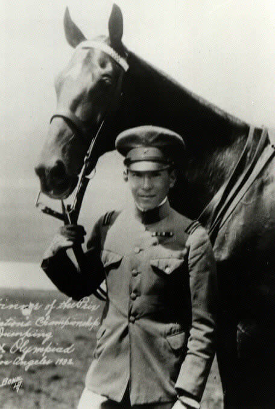

### Liga Państw Arabskich

Tworzenie porządku powojennego w świecie arabskim: w Kairze powstaje Liga Państw Arabskich. Regionalny odpowiednik ONZ.

### Iwo Jima

Podczas bitwy o Iwo Jimę gnie pułkownik Takeichi Nishi, arystokrata i sportowiec. W 1932 zdobył złoty medal w jeździectwie (skoki przez przeszkody) na Igrzyskach Olimpijskich w Los Angeles.

<SeeAlso txt="Bitwa o Iwo Jimę" url="/festung-breslau/article/pacyfik-iwo-jima" />

*Baron Takeichi Nishi i jego koń Uranus. 
By [http://www.iwo-jima.org/sensi/index.html](http://www.iwo-jima.org/sensi/index.html), Domena publiczna, [Link](https://commons.wikimedia.org/w/index.php?curid=1588725)*

### Die Deutsche Wochenschau

Niemieckie kino ma początek w wojskowej wytwórni filmowej. 13 stycznia 1917 Naczelne Dowództwo na potrzeby propagandy wojennej powołało Bild- und Filmamt (Bufa). Generał Ludendorf dostrzegł ogromny potencjał filmu i 18 grudnia 1917 doprowadził do powołania Universum-Film AG (UFA) wielkiego, fundowanego i kontrolowanego przez państwo konglomeratu dotychczas istniejących niewielkich i niezależnych wytwórni, były to przede wszystkim "Nordisk" i "Decla". Tak powstała znana na całym świecie UFA. Było to narzędzie propagandy wojskowej. W tej formule z oczywistych powodów istniało niecały rok. W listopadzie 1918 skończyła się Wielka Wojna. W 1921 UFA została sprywatyzowana i już jako całkowicie cywilne firma rok później zbudowała studio filmowe w Neubabelsberg, później przenosząc się do sąsiedniego Poczdam-Babelsberg. Był to niemiecki Hollywood, miejsce narodzin ekspresjonizmu, działali tam tak znani twórcy filmowi jak Fritz Lang czy Friedrich Wilhelm Murnau, tam również karierę rozpoczęła Marlena Dietrich.

Już od czasów Wielkiej Wojny w kinie niemieckim przyjął się obyczaj rozpoczynania seansu od kroniki filmowej. Radio wciąż było mało popularne, telewizja istniała w umysłach kilku marzycieli, kronika filmowa dawała szansę zobaczenia co się dzieje na świecie.

Po przejęciu władzy (niem. Machtgreifung) w 1933 minister propagandy Joseph Goebbels zarządził, by każde wydanie kroniki filmowej (a było czterech głównych producentów) podlegało cenzurze. Od września 1939 monopol na wydawanie kroniki miała UFA, ale wciąż utrzymywano fikcję oddzielnych brandów. Dodano wówczas duet komików Tran und Helle (Ludwig Schmitz jako Tran i Joseph "Jupp" Hussels): Tran był śmiały i trochę głupawy, popełniał błędy, np. słuchając radia BBC, ale w porę te błędy naprawiał przystojny i rozumny Helle, nawracając biednego Trana na słuszną drogę narodowo-socjalistycznej ortodoksji. Dopiero w czerwcu 1940 powstała jednolita, propagandowa i jedyna wówczas niemiecka kronika filmowa Die Deutsche Wochenschau.

<SeeAlso txt="Państwo hitlerowskie" url="/festung-breslau/article/panstwo-hitlerowskie/" />

Najbardziej rozpoznawalnym elementem kroniki jest oczywiście głos i sposób mówienia narratora. Był nim Harry Giese, pochodzący z Magdeburga aktor teatralny i głosowy. Był on również narratorem antysemickiego "Der ewige Jude" z 1940.

Każdą edycję cotygodniowej kroniki przeglądał bardzo uważnie Goebbels, a potem Hitler. Po ich akceptacji kierowano ją do rozpowszechnienia. Dopóki produkcji nie zakłóciła wojna, powstawało 2 tys. kopii.

Ostatnie wydanie Die Deutsche Wochenschau ma datę 22 marca 1945. Do niektórych kopii przedostatniego wydania z 16 marca (1945/9) zdołano doczepić fragment z wizytą Hitlera w sztabie 9 Armii generała Bussego.

### Britisches Freikorps

Wśród wielu obcokrajowców służących w wojskach III Rzeszy byli również Brytyjczycy. Nie tylko obywatele brytyjskich kolonii, ale rdzenni Brytyjczycy z Wielkiej Brytanii. Najbardziej znakomitym (czy też niesławnym) przypadkiem był John Amery, syn ministra ds. Indii i współpracownika Churchilla Leo Amery'ego. Faszysta, zwolennik Mosleya. Dobrowolnie przeszedł na stronę hitlerowską. W październiku 1942 w Berlinie zaproponował powołanie brytyjskiego odpowiednika istniejącej już francuskiej jednostki Légion des volontaires français contre le bolchévisme (LVF, aka Légion anti-bolchévique; niem. französische Freiwilligenlegion gegen den Bolschewismus). Opracował materiały propagandowe, audycje radiowe mające nakłonić brytyjskich jeńców wojennych do zmiany strony.

Efekt był, ale znikomy. W sumie doliczono się 54 Brytyjczyków w służbie niemieckiej, zostali sformowani w jednostkę, która liczebnością nie przekraczała nawet połowy tego. 1 stycznia 1944 powstał British Free Corps, mający przywileje brytyjskiego drylu. 11 października już jako SS zostali skierowani na front wschodni. Najpierw na przeszkolenie w szkole saperskiej w Dreźnie, ich specjalnością miało być niszczenie budynków i walka z czołgami. Nie żałowano im sprzętu, może dlatego, że przy tej liczebności nie potrzebowali go zbyt wiele. Zostali wsadzeni w półciężarówki i dostali nowiutkie StG 44.

Wysłano ich na front wschodni jako batalion zwiadowczy Dywizji Grenadierów Pancernych SS Nordland (11. SS-Panzer-Aufklärunsabteilung, 11th SS Volunteer Panzergrenadier Division Nordland). Dłuższa nazwa niż służba. Mieli bronić pozycji odrzańskiej, północnej flanki Berlina.

Dziś zajęli pozycje we wsi Schöneberg (k. Schwedt, 15 km na północ od Cedyni).

16 kwietnia przeznaczono ich do roli kierowców i wsparcia sztabu Steinera. Do końca wojny pozostali w Grupie Steinera (niem. III (Germanic) SS Panzer Corps). Dywizja Nordland pomaszerowała na Berlin, oni pozostali ze sztabem Steinera w Neustrelitz. 29 kwietnia pozostałości Grupy Steinera skierowały się na zachód, poddać się do niewoli alianckiej.

Wszyscy pozostali przy życiu żołnierze BFC dostali się do niewoli. Usiłowali przy tym zatrzeć ślady przynależności do BFC, ale większość z nich została rozpoznana i po wojnie ukarana. John Amery w listopadzie 1945 dostał wyrok śmierci, wykonano go miesiąc później.

- Mark Felton Productions ["Traitors' Legion - The British Free Corps" [YT 6:00]](https://www.youtube.com/watch?v=V-jHuqkZzOw)
- The Front ["Why These Brits Betrayed their Country and Joined the SS" [YT 11:35]](https://www.youtube.com/watch?v=ijbrPm0qtjs)
- Oblicza XX Wieku ["British Free Corps (Britisches Freikorps)" [YT 14:19]](https://www.youtube.com/watch?v=qrx5d7b8rBg)

### B-17 rozbity pod Jordanowem

Wracający z bombardowania Zagłębia Ruhry do bazy we Włoszech amerykański B-17 rozbił się pod Jordanowem w pobliżu Wrocławia.

- [Nadia Szagdaj "Pod Wrocławiem odnaleziono ludzkie szczątki i fragmenty amerykańskiego bombowca. Zestrzelono go podczas II wojny światowej [ZDJĘCIA]"](https://gazetawroclawska.pl/pod-wroclawiem-odnaleziono-ludzkie-szczatki-i-fragmenty-amerykanskiego-bombowca-zestrzelono-go-podczas-ii-wojny-swiatowej/ar/c1-15785530)

### Wrocław

O lotnisku krótko pisze ksiądz Ernst Hornig:
>Przez cały marzec liczba wypadków śmiertelnych przy budowie pasa startowego rosła z dnia na dzień. Tu właśnie ludność cywilna poniosła największe straty w okresie oblężenia. Według ostrożnych szacunków zginęło tam około 10 tysięcy ludzi. Nieprawdopodobna liczba, ale mimo to prawdziwa. Nawet jeżeli ofiar tych byłoby o połowę mniej, to i tak byłoby ich zbyt dużo. Pastor Bartels, który miał kwaterę w pobliżu tego miejsca, napisał: "Setki kobiet i dziewcząt były tam zapędzane przez naczelników Ortsgruppen do pracy i wykorzystywane jak niewolnice. Wiele z nich straciło życie lub zostało kalekami w wyniku ostrzału z rosyjskich samolotów". Ale Hanke kazał nadal budować. Miał przecież rozkaz Führera.

Szybowce, któe dotarły dziś w nocy do Wrocławia. [Dzięki badaniom dotyczącym pierwszego użycia szybowców transportowych przy zaopatrzeniu Festung Breslau, jesteśmy w stanie skorygować kilka powszechnie przyjętych informacji.](https://www.facebook.com/EchazFestungBreslau/posts/3716421825085167)

### Miłość w Twierdzy

A już kilka stron dalej pisze o tym, co działo się za oficjalną fasadą tej osobliwej fabryki zagłady, jaką Niemcy Niemcom zgotowali w imię Niemiec, wielkich, mocarstwowych. "*Niemcy, przebudźcie się!*" (niem. Deutschland, erwache! Erwache!) grzmiało partyjne hasło słowami hymnu szturmowców SA (Sturmlied), które słyszeli wszyscy i które porwała tłumy entuzjastycznie pragnące żyć w kraju godnym ambitnych ideałów. Kilkuletnie dzieci patrzyły na rodziców, którzy poświęcali coraz więcej, aby one mogły żyć w tym wielkim kraju z piosenki. Niemcy w końcu się przebudziły i obudzone poszły na wojnę. Dzieci miały już kilka lat więcej, w gazetach i radio propaganda, która była tak powszechna, że zastępowała wiedzę o świecie, ukazywała wszystkie objawy radości z wojny. Dzieci żyły wojną, dorastały w wojnie, cały świat był wojną, wojna była wszędzie w gazetach. Geografia świata była ścieżką bojową Wehrmachtu. Historia świata była dziejami germańskiego ducha. Coraz więcej bliskich, krewnych i przyjaciół ich i znajomych szło na wojnę, i już wkrótce coraz więcej z tej wojny nie wracało.

Ale to wojna zaczęła wracać. Z nieubłaganą konsekwencją i niepojętą mocą front niczym owładnięte przekleństwem wahadło wojny pchnięte wielkim rozmachem na wschód, zaczęło wracać miażdżąc tysiące Niemców, całe dywizje i armie. Pojawił się inny ton w propagandzie. Obok nieustannie zwycięskiego Wehrmachtu maszerowała masa plugawej dziczy, groza barbarzyństwa, która wkrótce zyskała imię: Nemmersdorf. Dzieci miały już dwanaście, trzynaście lat i wojna nieubłaganie maszerowała w ich stronę, ukazując coraz gorsze oblicze. Już wkrótce usłyszały odległy odgłos artylerii, ujrzały samoloty wroga i zaczęły uciekać przed jego bombami. Dziś tym wkraczającym w dorosłość młodym ludziom kazano ubrać mundury i ginąć na tej samej wojnie, w której sens nikt już nie wierzył.

Jednak ta ożywcza magia, która pompuje krew dojrzałości w rosnące ciało i kształtuje umysły gotowe kochać i z miłości po raz pierwszy w życiu zapominać o sobie, przypadła dla nich na czas, kiedy patrząc na śpiewające ptaki i widząc wiosnę nie mogli liczyć już na nic więcej niż na to, że koszmar wojny potrwa choćby jeszcze kilka dni dłużej, może i tygodni, bo potem czekała ich już tylko sowiecka niewola, gwałt żołdaków lub obóz jeniecki, który prawie równał się zagładzie. Dopóki trwała twierdza, mogli wśród swoich zasmakować ersatzu dorosłości.

Dzieje ludzkości pisane są głównie przez mężczyzn i o mężczyznach, historia najczęściej pomija kobiety i kobiecy punkt widzenia a nieskanalizowany w tak zwanym świętym sakramencie małżeństwa popęd seksualny traktuje jako objaw deprawacji. Szczególnie jeżeli mowa o kobietach, bo w patriarchalnej wizji w ogóle przed i poza małżeństwem nie powinny przejawiać żądz cielesnych, wolę bożą rezerwując dla Pana Właściwego. Dla mężczyzn doświadczenia pozamałżeńskie są nawet społecznie oczekiwane, dowodzą ich wartości. U kobiet wręcz przeciwnie. Ale czy jest coś niemoralnego w samym akcie seksualnym? Co właściwie miałoby oznaczać słowo moralność w mieście, którego władze niszczą całe osiedla i wysyłają na śmierć dzieci?

Oto przerażający dylemat: czy cierpieć w oblężonej twierdzy wyzyskując każdą okazję do przeżycia choćby chwili przyjemności, czy na zawsze o życiu zapomnieć i oczekiwać tylko końca. Czy można więc tych ludzi oceniać? Czy mordowanie cywili setkami, szaleństwo zabijania i niszczenia nie daje nam właściwego kontekstu, w jakim powinniśmy widzieć ich życie. Co jest dziwnego w tym, że młodzi ludzie uwięzieni w koszmarze oblężenia, nie mogąc liczyć na cywilizowane standardy, skazani na ruiny, w zgliszczach i brudnych piwnicach, zdesperowani pragną nie tylko umierać, ale także żyć, choćby i resztką życia, choćby i w brudnej piwnicy, w przypadkowym budynku z kimś przypadkowym i przeżyć krótki, ale intensywny spazm, ukoić strach i samotność w obliczu śmierci, być może ostatni raz, w czyichś objęciach.

Hornig:
>Zdeprawowane i definitywne obniżenie standardów moralnych oraz hamulców psychicznych. Orgie w którym głównym priorytetem były kobiety i alkohol oraz przelewający się puchar żądzy prowadziły do odurzenia.

Hendrik Verton:
>Krótkie wizyty przyjaciółek, chociaż stanowczo zabronione przepisami fortecy, były w rzeczywistości dozwolone nawet na przednich liniach frontu. Dziewczyny uparte i kochliwe nosiły długie płaszcze wojskowe jako kamuflaż dla śmiałych wizyt u wybranego wojaka na jego posterunku. Pomijam oczywiście groźbę bycia złapanym na gorącym uczynku. Koledzy nie zwracali uwagi i spoglądali w innym kierunku[...] Oczywiście były przeciwieństwa i paradoksy. Jedni żołnierze byli zaangażowani w krwawych walkach o każdy dom, a ludność [przygniatał nieznośny ból cierpienia w szpitalach wojskowych. W tym samym czasie, być może parę budynków dalej, koledzy tańczyli "pierścień z róż".

Jak pisze Hornig:
>Wkrótce żołnierze twierdzy prowadzili bezlitosne, krwawe walki albo też leżeli w lazaretach ze swoim cierpieniem i bólem, wkrótce też zaczęli spragnieni życia, szukać drobnych radości, ale też dzikich zabaw. Podczas gdy ranni cierpieli i umierali w klasztorze bonifratrów, inni bawili się w weekend na swoich wieczorach "tańców i śpiewów". Podczas gdy towarzysze broni na froncie południowym prowadzili ciężkie, krwawe walki o każdy dom, inni, będąc w rezerwie, zabawiali się niedaleko zakładu "Bethanien", wiosłując na łódkach po Oławie w kierunku Bierdzan, Inni znowu, którzy nie byli w służbie frontowej, porzucili wszelkie zahamowania oraz opory i próbowali wypić do dna kielich rozkoszy. 
>Obecność kobiet w kwaterach oddziałów była surowo zabroniona, nikt jednak nie mógł przeszkodzić wycieczkom do sąsiednich domów czy na pobliskie ulice. Im bardziej sytuacja we Wrocławiu stawała się beznadziejna, im bardziej nieznana była przyszłość jego obrońców, tym bardziej zrywano więzy moralności i przyzwoitości. 
>Erich Schõnfelder, który jako oficer mieszkał razem z żołnierzami, opowiada co wówczas przeżył: "wielu ogarnął wielki apetyt, aby chociaż raz jeszcze zakosztować pełni życia, które zakończy się za kilka dni lub tygodni. Kobiety i alkohol to dwa bieguny tego samego zjawiska. Są urządzane orgie. [...] Każdego ranka szesnastoletni chłopcy wychodzą ze swoimi młodziutki dziewczynami z cuchnących piwnic i wloką się do miejsca zbiórki przydzielonej pracy. Stracona młodość Kto zechce ich potępić?". Pracujące w sztabach i innych strukturach wojskowych "pomocnice Wehrmachtu", dawały wielu członkom Wehrmachtu okazję do nawiązania znajomości, zarówno dozwolonych, jak i niedozwolonych. Friedrich Groger stwierdza: "Panienki twierdzy" stają się rzeczą normalną".

Norma - pojęcie w nieograniczony niemal sposób wieloznaczne. Czy zajście w ciążę z przypadkowym rodakiem, dobrowolne, wynikające z aktu desperacji, jest w czymś gorsze niż samo oczekiwanie na gwałt dokonywany seryjnie przez zdziczałych z wściekłości żołnierzy wroga? Być może lepiej mieć nadzieję, że jeśli się przeżyje koszmar "wyzwolenia" i zajdzie w ciążę - na to, że jest ona skutkiem desperackiego być może, ale własnego wyboru, a nie wyłącznie skutkiem przemocy i poniżenia. Może też lepiej ten "pierwszy raz" przeżyć nie jako przedmiot brutalności obcego wojska. Jak wytłumaczylibyśmy taki dylemat szesnastoletnim dziewczynom? Wszyscy są ofiarami wojny: mordercy i zabici, gwałciciele i gwałcone - nikt z nich nie pragnął tego losu, nikt w pojedynkę nie zaaranżował wojny. Ta wielka rzeź i zagłada urosła z wielkich słów i ideałów: ojczyzna, naród, dziejowa sprawiedliwość, przyszłość. Piękne szeregi maszerowały wzbudzając zachwyt, łopot flag schwytał wiatr i - wydawało się - cały świat zamarł z zachwytu patrząc na tę chwilę. Szeregi jednak maszerowały dalej, a miliony zachwyconych nie powiedziały dość. Co mogą powiedzieć teraz. Jakiej nauki mogą udzielić własnym dzieciom, które właśnie dorosły?

Wydaje się, że w całym tym szaleństwie jest jedna osoba, która wie co zrobić i znalazła się na właściwym sobie miejscu. Schlesische Tageszeitung z 22 marca na stronie tytułowej zamieszcza ostrzeżenie komendanta Niehoffa:
>Do wszystkich Rodaków 
>w Twierdzy Wrocław 
> 
>Wciąż jeszcze stwierdzam, że pojedynczy, nie pamiętający o swoich obowiązkach żołnierze i Volssksturmiści usiłują uchylając sie od dziejowej walki o Twierdzę Wrocław, ukrywając się w tym celu po domach i piwnicach lub szukając pod wątpliwymi pretekstami schronienia u ludności cywilnej. 
>muszę stwierdzić, że są kobiety i dziewczęta, które z wyrachowania lub dla motywów osobistych przyjmują do siebie żołnierzy, żywią ich i ukrywają. Rodacy! Pomagajcie mi w aresztowaniu takich elementów, składając podpisane lub anonimowe doniesienie do władz. Mam zaufanie do waszej czujności. Ktoś kto w czasie totalnej mobilizacji wszystkich sił dom walki o nasz własny los staje z boku, chowa się u rodziny lub pod blachym pozorem żebrze o opiekę, będzie unikał dziennego światła. 
>Meldujcie o swoich podejrzeniach na najbliższej placówce Wehrmachtu, partii lub policji. 
>Kto ukrywa lub zaopatruje dezertera, poniesie jak i on haniebną śmierć. 
> 
>Twierdza Wrocław, 21 marca 1945 r. 
> 
>Komendant Twierdzy 
>Niehoff 
>Generał-porucznik 

I jakże koresponduje z powyższym treść ulotki skwapliwie przepisanej przez księdza Peikerta:

>Czytać i działać! 
>Teraz albo nigdy! 
>Niemieccy żołnierze i oficerowie! 
>Nadszedł moment, w którym musicie ostatecznie zadecydować o własnym losie i o losie waszych żon i dzieci. 
>Teraz albo nigdy! 
>Podczas styczniowej ofensywy z r. 1945 Armia Czerwona posunęła się naprzód od Warszawy do Frankfurtu n. O., od Sandomierza do Wrocławia, od Tarnowa do Raciborza. Wojska sowieckie zajęły niemal całe Prusy Wschodnie, wdarły się głęboko na Śląsk, do Brandenburgii i na Pomorze, przekroczyły szerokim frontem Odrę i znajdują się u granic Saksonii, w połowie drogi z Wrocławia do Drezna. 
>Huk ciężkiej artylerii rosyjskiej słyszy się już w Berlinie. 
>Niemiecki Wehrmacht poniósł klęski nie do odrobienia. Nie ma takiej siły, która byłaby w stanie powstrzymać zwycięski pochód Armii Czerwonej. Kto stawia opór, będzie bezlitośnie zniszczony. 
>W Prusach Wschodnich i w Poznaniu Armia Czerwona dobija tuziny odciętych i okrążonych dywizji niemieckich. 
>Tylko w jednym jedynym dniu, 3 lutego, zniszczono w lesie na wschód od Frankfurtu n. O. dużą grupę zamkniętych w kotle wojsk niemieckich. 
>W lesie tym Rosjanie wzięli do niewoli 9450 szeregowców i oficerów niemieckich. Na polu bitwy poniosło śmierć przeszło 8000 szeregowców i oficerów niemieckich. 
>Wspaniałe zwycięstwa Armii Czerwonej zbiegają się z drugą rocznicą Stalingradu, gdzie została zniszczona zamknięta w kotle 6 armia niemiecka. Dziś jednak likwidacja niemieckich dywizji dokonuje się już na niemieckiej ziemi. 
>Niemieccy szeregowcy i oficerowie! 
>Hitler utracił Prusy Wschodnie, najważniejszą twierdzy j bazę żywnościową Niemiec. 
>Hitler utracił Śląsk, najważniejszy arsenał Niemiec. 
>Hitler utracił w Brandenburgii i na Pomorzu najważniejsze węzły komunikacyjne, łączące ze sobą południowe i pomocne Niemcy. 
>Niemiecki front wschodni załamał się. 
>Każdy z was widzi teraz wyraźnie, że Hitler przegrał wojnę ostatecznie i że kontynuacja przegranej wojny stała się jego prywatną sprawą: pragnie on odwlec godzinę swojej zagłady i ciągnie was z sobą do grobu. 
>Nie macie możliwości odwrotu, śmierć doścignie was wszędzie. 
>Zwlekanie i stawianie oporu oznacza samobójstwo, i to tak krótko przed końcem wojny, gdy przecież już za kilka miesięcy >wszyscy jeńcy wojenni powrócą do swoich rodzin. Nadeszła pora działania. 
>Teraz albo nigdy! 
>Poddajcie się Armii Czerwonej przy najbliższej okazji. Tym przyśpieszycie koniec wojny, uratujecie wasze życie i zachowacie waszą ojczyznę przed zniszczeniem. 
>Zdecydujcie się! 
>Teraz albo nigdy! 
>Ulotka ta stanowi przepustkę dla nieograniczonej liczby niemieckich szeregowców i oficerów, którzy poddadzą się Armii Czerwonej. 
>Nr 1435/14. II. 45. 
