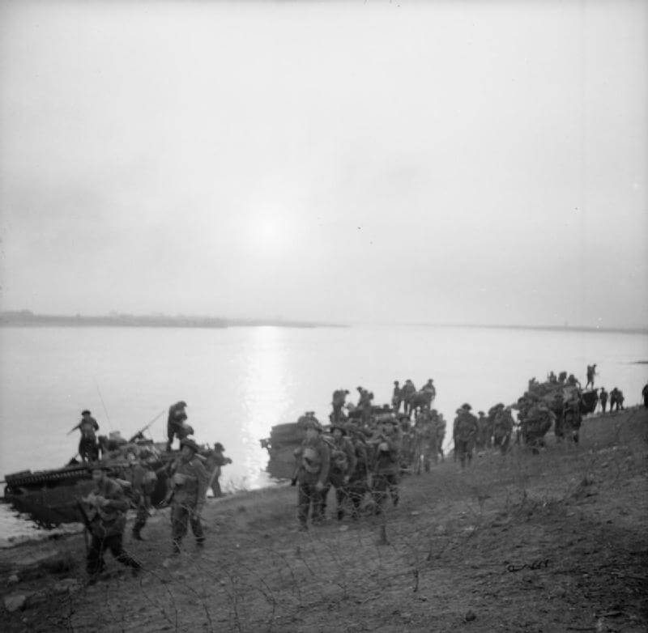

### Operacja Plunder

Zaczyna się Operacja Plunder - trwające 5 dni forsowanie Renu na kilku szerokich odcinkach jednocześnie korpusy brytyjskie na północy i amerykańskie na południu. W ciągu pięciu dni Ren przekroczyło milion dwieście tysięcy żołnierzy. Obrona to 70 tysięcy żołnierzy niemieckich.

Typowy Monty, budowana z ogromnym rozmachem przewaga i generalna prostota operacji. Montgomery'ego musiał zaboleć sukces Amerykanów, którzy na południu już 7 marca przełamali się przez Ren. Teraz ma szansę nadrobić straty.

- [Canal Defence Light](https://pl.wikipedia.org/wiki/Canal_Defence_Light)

<BoxImageWrapper>

Operation Plunder, widać szerokość Renu. 1 Batalion Pułku Cheshire. 
Domena publiczna
</BoxImageWrapper>

### SS Galizien

Dzisiaj podczas narady sztabowej Hitler dostrzegł na mapie nieznaną sobie jednostkę określoną jako "ukraińska". Kiedy się dowiedział, że jest to dywizja sformowana z Ukraińców, kazał natychmiast całą dywizję rozbroić i internować, a broń przekazać do odtwarzanej 10 Dywizji Spadochronowej Luftwaffe. Rozkaz ten utknął w procedurach służbowych dostatecznie długo, by Ukraińcy mogli się poddać Amerykanom 10 maja jeszcze jako uzbrojona dywizja.

### Fritz Klingenberg

W wyniku ostrzału czołgów alianckich na zachodnim skraju miasteczka Herxheim bei Landau/Pfalz (Nadrenia-Palatynat) zginął SS-Standartenführer Fritz Klingenberg, dowódca 17. SS-Panzergrenadier-Division "Götz von Berlichingen". Dywizja w składzie XIII. SS-Armeekorps broniła południowo-wschodniej części Saary, atakowanej przez XV Corps w składzie 7 Armii amerykańskiej.

XIII. SS-Armeekorps został sformowany 7 sierpnia 1944 we Wrocławiu na bazie dwóch jednostek Wehrmachtu: Artillerie-Division 312 oraz rozbitego pod Bobrujskiem XXXV. Armeekorps. W grudniu 1944 wysłany na front zachodni wziął udział w Operacji Nordwind i w marcu wycofany za Ren. Potem w dniach 5-20 kwietnia 1945 brał udział w bitwie pod Crailsheim i w dalszym ciągu wycofywał się. Ostatnią bitwą, w której wziął udział była nieudana obrona Norymbergi.

Klingenberg zasłynął 13 sierpnia 1941 zdobyciem Belgradu oddziałem złożonym z... sześciu żołnierzy. Był wówczas dowódcą kompanii w dywizji Das Reich. Wbrew rozkazom udał się na rekonesans, łódka którą przekraczali Dunaj zatonęła. Klingerberg szczęśliwie dotarł do brzegu i nie dał się zbić z pantałyku. Razem z nim uratowało się sześciu jego żołnierzy. Ruszyli do miasta. Wzięli do niewoli kilku żołnierzy jugosłowiańskich, którzy przedtem wzięli do niewoli niemieckiego turystę. Udali się do centrum miasta i wciągnęli na maszt niemiecką flagę. Na ich spotkanie wyszedł burmistrz. Klingenberg zdecydował się na blef, powiedział burmistrzowi, że jeśli natychmiast nie poddadzą stolicy zostanie ona zbombardowana lotnictwem i artylerią. W tym czasie w Belgradzie pojawił się inny oddział niemiecki i w tej sytuacji stolica Jugosławii i cały jej garnizon skapitulowały.

<SeeAlso txt="Jugosławia" url="/festung-breslau/article/jugoslawia" />

Najbardziej zaskoczony w tej sytuacji był Wehrmacht, który przygotował złożoną operację zdobycia Belgradu, potencjalne straty oceniano na tysiące żołnierzy. Klingenberg za swój wyczyn otrzymał Krzyż Rycerski Krzyża Żelaznego.

Kilka dni później poddała się cała Jugosławia.

- Eisernes Kreuz ["Fritz Klingenberg (1912 - 1945)" [YT 5:16]](https://www.youtube.com/watch?v=NRTk1BBOI4Y)

### Przemówienie Werwolfu

Joseph Goebbels wygłosił w radio przemówienie zapowiadające bezlitosne działania na tyłach nieprzyjaciela. Zapowiedział powołanie hitlerowskiej partyzantki, specjalnie wyszkolonych jednostek Werwolfu.

Alianci informacje tę potraktowali bardzo poważnie i zmieniło to traktowanie Niemców. Byli masowo internowani. Różnymi metodami starano się odnaleźć bojowników Werwolfu. Ocenia się, że w wyniku prześladowań wywołanych poszukiwaniem Werwolfu zginęły tysiące Niemców.

Natomiast sam Werwolf, jak się później okazało, był tylko propagandowym konstruktem, który poza jedną akcją (zamordowanie Franza Oppenhoffa, burmistrza Akwizgramu 25 marca 1945) w ogóle nie zaistniał.

Na polskich ziemiach zachodnich rzekomy Werwolf był i straszakiem i wymówką. Kiedy coś zostało zniszczone lub ukradzione, zrzucano to na zorganizowanych niemieckich dywersantów i sabotażystów. To był wilk, ale papierowy.

- Mark Felton Productions ["SS Werewolves - The True Story" [5:09]](https://www.youtube.com/watch?v=hBv1SHjqd1Q)

### Sopot

2 Front Białoruski: Sopot! Gdańsk znalazł się pod ostrzałem.

"Gazeta Lubelska" z 24 marca 1945:
>Radzieckie Biuro Informacyjne donosi, że 23 marca wojska 3. Frontu Białoruskiego, kontynuując walki w celu zlikwidowania wschodniopruskiego zgrupowania wojsk niemieckich nad Zalewem Wiślanym w rejonie Heiligenbeil, poczyniły znaczne postępy terenowe. W toku walk na tym odcinku wzięto do niewoli ponad tysiąc sześciuset niemieckich żołnierzy i oficerów. 
>Wojska 2. Frontu Białoruskiego, następując w kierunku Gdańska, zdobyły miejscowość Sopoty i wyszły na brzeg Zatoki Gdańskiej między Gdynią i Gdańskiem, rozbijając tym samym okrążone wojska niemieckie na dwie części. W toku walk zostały zajęte miejscowości Ardschau, Gross-belken, Schmiral, Stolzenfeld, Greufuss, Marientall i Kolibken, wzięto przy tym do niewoli ponad tysiąc żołnierzy i oficerów niemieckich.

Jak wyglądało zdobycie Sopotu? Oto fragmenty relacji ze strony [Tomasz Kot "Sopot w ogniu. Marzec 1945 roku w kurorcie"](https://historia.trojmiasto.pl/Sopot-w-ogniu-Marzec-1945-roku-w-kurorcie-n77930.html):
>21 marca zostaje zdobyty Wielki Kack. Rosjanom śni się morze. Głównodowodzący II Frontu Białoruskiego, generał Konstanty Rokossowski obiecuje order Czerwonego Sztandaru tym, którzy pierwsi staną na plaży. Rozpoczyna się zmasowany ostrzał artylerii radzieckiej na umocnione pozycje niemieckie broniące Sopotu od zachodu. W każdy kilometr frontu bije kilkaset dział. 
>Prawdopodobnie wtedy trafiona pociskiem pali się restauracja na Wielkiej Gwieździe. [...] 
>22 marca szturmujący od strony Wielkiego Kacka Rosjanie przebijają się w kierunku Kolibek. 
>Nocą czerwonoarmiści dochodzą do plaży przy ujściu Swelinii. Dwaj żołnierze, którzy pierwsi osiągnęli brzeg morza wysyłają butelkę z mętną morską woda do Rokossowskiego. Pierścień niemieckiej obrony został rozerwany a Gdańsk i Gdynia odcięte i zamienione w osobne ogniska oporu. Rosjanie zatrzymują się i okopują. Po kilku godzinach nad frontem zapada cisza.
>W tym samym czasie w willi przy Bülowalle (Mickiewicza) 12, kolekcjoner Carl Cords i jego gospodyni Kathe Fröhlih zdążyli się już pożegnać z nauczycielem Horstem Schrödterem, przyjacielem obojga. Dwa lata wcześniej Cords przekazał do muzeum w Frankfurcie, zapakowaną do 79 skrzyń, swoją kolekcję chińskiej sztuki. W sopockiej willi pozostały jedynie zbiory sztuki indonezyjskiej. 
>Teraz Carl Cords zapewne żałuje, że nie wyjechał z miasta w lutym, gdy miał taką możliwość. Kathe zażywa truciznę. 65-letni Cords robi to samo. Gospodyni umiera jeszcze w nocy. Cords, który zażył noszoną w pierścieniu chińską, wolno działającą truciznę, pozostaje w agonii, gdy do mieszkania następnego dnia wpadają krasnoarmiejcy. Rosjanie rabują co się da. Ściągają z Cordsa ubranie i dobijają go strzałem z karabinu. Wszystkie eksponaty z indonezyjskiej kolekcji znikają. [...] 
>Czołgi jadą Seestrasse w dół. Operator kroniki frontowej kręci film z okna mieszkania na drugim piętrze kamienicy na rogu Monciaka i Haffnera. Kasyno jest całe. Rosjanie podjeżdżają pod kościół ewangelicki. Wyskakują z czołgów, pędzą do morza i nabierają wody do manierek. Obawiając się desantu z Helu okopują się na plaży i ustawiają tam działa. Sopot jest w rękach armii radzieckiej. 
>Kasino Hotel znów pełni funkcje sztabu, tym razem wojsk radzieckich. W szkole przy Wejherowskiej ponownie zostaje urządzony lazaret. Tam też na przyszkolnym boisku Rosjanie chowają swoich zmarłych żołnierzy. Poległych tymczasowo chowają przed urzędem miasta. W parkach, skwerach, na ulicach, w końcu na hipodromie leży mnóstwo zabitych koni. Przywiązane do drzew, nie miały szans podczas ostrzału miasta. Wobec braku pojazdów mechanicznych miały służyć jako środek transportu. 
>Marian Mokwa, słynny malarz, wraz z rodziną całą okupację spędził w piwnicy własnego domu. Wita czerwonoarmistów po rosyjsku. Zna w końcu 25 języków. Na niewiele się to zdaje, bo wraz z kilkudziesięcioma innymi mieszkańcami pobliskich ulic zostaje zamknięty na dziesięć dni w piwnicy sąsiedniego domu. W jego willi „Adelajda” kwateruje radziecki sztab. 
>Wieczorem w Gdańsku wychodzi ostatnie popołudniowe wydanie „Danziger Vorposten”. W gazecie można przeczytać o „przełamaniu niemieckiej obrony przez silne uderzenie Rosjan i wtargnięciu Armii Czerwonej do Sopotu”. Kończy się dzień. Do miasta wlewają się kolejne jednostki rosyjskie. W nocy rozpoczynają się grabieże i gwałty. Szabrujący czerwonoarmiejcy przez pomyłkę ostrzeliwują innych szabrujących Rosjan. Padają zabici i ranni.

### Pogórze Izerskie

Walki w Marczowie nad Bobrem (pomiędzy Lwówkiem Śląskim a Wleniem), zestrzelony Focke-Wulf 190, Niemcy wycofali się dopiero w nocy z 7 na 8 maja. [Wojenne epizody z dziejów Marczowa nad Bobrem – 1945.](https://www.facebook.com/bobr1945/posts/3509578349155803).

### Wrocław

Wróćmy do Wrocławia, wszędzie w strefie frontowej dzieje się to samo.

Paul Peikert z powodów zawodowych żyje w kategoriach roku liturgicznego. Nadchodzi Wielkanoc a:
>Dziś jest święto Matki Boskiej Bolesnej. O ileż głębiej wczuwa się dziś cała ludzkość w cierpienie naszego Pana i Jego Najświętszej Matki, gdy sama ugina się pod brzemieniem krzyża. Znów mieliśmy noc bardzo zakłóconą nalotami, jakby do tego stworzoną, bo księżyc jasno świecił

Wiara w stworzenie zjawisk naturalnych sprzyjających najeźdźcom? A może po prostu zobojętnienie wobec tylu przypadkowych i straszliwych okoliczności prowadzących do okaleczeń i śmierci. Żadne miejsce nie jest wolne od ryzyka, nigdzie nie ma bezpieczeństwa. Jedynie mgliste noce dają względny spokój, ale na jaki spokój mogą liczyć ludzie, których już ranek następnego dnia eksplozja nieprzyjacielskiej bomby może zamienić w nierozpoznawalne strzępy ludzkiego mięsa, bo jak pisze dalej Peikert:
>O godz. 9.30 pobłogosławiłem znów dwie ofiary nalotu na pocztę z ubiegłego wtorku, dziadka i wnuczkę. Ciało wnuczki było tak zmasakrowane, że złożono je w jednej trumnie z dziadkiem. Następnie błogosławię znów czterech poległych żołnierzy Waffen-SS. Czyste, błękitne niebo rozpościera się nad oblężoną twierdzą. Wspaniałe wiosenne słońce świeci wśród wielkomiejskiej plątaniny domów. W ogrodach rozbrzmiewa wiosenny śpiew ptaków. Wkrótce po obiedzie wszczyna się znów ożywiona akcja lotnictwa nieprzyjaciela, które około godziny pół do drugiej -przeprowadza wielki nalot.

Śpiew ptaków wywodzących wiosenną krew życia z chłodnej jeszcze po zimie ziemi miesza się z wyciem i warkotem innych ptaków, dosiadanych przez takie same jak ich ofiary inteligentne i czujące istoty. Mówiły co prawda innymi językami i wiele ich dzieliło. Jednak dla wszystkich było jasne, że wojna już wkrótce się skończy i wiadomo było z jakim rezultatem. Jak za chwilę zobaczymy, z całkiem nieoczekiwanych powodów jakaś ich część pragnęła, by oczywisty dla wszystkich rezultat nadszedł jak najpóźniej, co oznaczało jeszcze większą liczbę ofiar i cierpienia. I nie chodzi tu bynajmniej o funkcjonariuszy Partii ani o zbrodniarzy w nazistowskich szeregach świadomych tego, jaki będzie ich koniec w sowieckiej niewoli. Na koniec zamiast kolejnej filipiki Peikert obdarza nas poetyckim obrazem umierającego miasta:
>Wieczorem tego słonecznego, a jak na tę porę roku zbyt ciepłego dnia unosiła się nad miastem gęsta chmura kurzu i dymu. Za pędzącymi przez miasto samochodami wojskowymi wzbijają się tumany kurzu ulicznego, gdyż ulic teraz już nikt nie oczyszcza. Brud z całej zimy tam leży. Dochodzą do tego olbrzymie tumany pyłu, które powstają po eksplozjach bomb i pocisków. Dołóżmy tu jeszcze dym z olbrzymich pożarów podpalanych dzielnic miasta. Tak więc wieczorne powietrze nie zapewniało orzeźwienia, kładąc się ciężko na duszy swoją odurzającą wonią. Przy tym gdy wracałem wieczorem od starej rejencji miasto tonęło w srebrzystych blaskach księżyca, spływających z nieba. Wszędzie słychać warkot nieprzyjacielskich samolotów, które latały bardzo wysoko ze względu na jasne niebo.

Owa "stara rejencja" to dawny urząd wojewódzki, przyjemny dla oka zapraszający i przytulny pałacyk w stylu neorenesansu niderlandzkiego z lat 80. XIX wieku, kiedy zjednoczone Niemcy szukały narodowej formy architektonicznej - obecnie budynek Muzeum Narodowego. Nowy Urząd Wojewódzki, budowany dokładnie w latach II Wojny Światowej stoi obok, pompatyczny i dominujący, językiem monumentalnej architektury pokazujący jak niewiele znaczy każdy zbliżający się do niego obywatel. Kontrast pomiędzy tymi gmachami pokazuje drogę, jaką odbył umysł niemiecki w ciągu tych 70 lat. Trudno patrząc na oba, rozdzielone tylko ulicą, uwierzyć, że mają tą samą liczbę kondygnacji.

Wróćmy do opisywanej przez innego księdza, Waltera Laßmanna tragedii dziewczynki uwięzionej pod gruzami. Bomba zniszczyła dom, w której piwnicy się ukrywała cała jej rodzina. Wszyscy inni zginęli, ale jej głos został usłyszany przez ratowników.
>Przez cały dzień martwimy się o zasypaną Elisabeth. Wciąż nie można jej wyciągnąć na powierzchnię. Z samego rana odprawiłem w jej intencji mszę świętą. Przez cały czas trwa akcja ratunkowa. Po południu o wpół do trzeciej nadlatują samoloty i ciężko bombardują Ostrów. Nalot daje się nam wszystkim we znaki. Tylko cienka granica dzieli nas od śmierci. [...] śmierć depcze nam po piętach, czekając swojej okazji. [...] Przeżywaliśmy każdy na swój sposób wysoce prawdopodobną możliwość swojej rychłej śmierci. Trójka dzieci Gorniaków spała w moim łóżku, które im dostąpiłem, a ja usiadłem na krześle modląc się. Ale moje myśli ulatywały przez cały ten czas do biednej Elisabeth uwięzionej pod gruzami.

W tym samym czasie dziesiątki, a może setki niewiele starszych od Elisabeth dzieci wykonywało niewolniczą pracę pod ogniem sowieckiej artylerii i lotnictwa, ale jeden głos słyszany spod gruzów wzbudził tak wiele zaangażowania w ratowanie życia jednego dziecka. Wielu z ratujących mogło przystąpić do akcji dopiero po odprowadzeniu własnego dziecka na miejsce niewolniczej pracy. Następnego dnia:
>O godzinie 1.00 w nocy akcja ratunkowa zakończyła się powodzeniem. Wydobyto spod zwałów gruzów żywą Elisabeth. Jej rodzice oraz rodzeństwo, Helmut i Eva-Maria zginęli na miejscu. Ciała wszystkich pięciu ofiar bombardowania były straszliwie zniekształcone. Uratowaną Lesiel zanieśliśmy najpierw do szpitala pomocniczego przy pl. Katedralnym 14 (Marianum), skąd trafiła do szpitala św. Józefa. Kiedy tam zaszedłem spała już wykąpana i opatrzona przez prowadzące szpital siostry. Złamaną w kostce prawą stopę włożono w szyny. Lesiel leżała pod gruzami przez 38 godzin. Ileż to dziecko wycierpiało! [...] Od wczoraj znów mamy elektryczne światło, którego brakowało przez 14 dni. Ale nasza radość trwała krótko. Bomby, które znów spadły dzisiaj, ponownie uszkodziły trakcję. Siedzimy z gośćmi przy świecach i lampach naftowych.

Wszystko skończyło się dobrze, kto wie może ta tragedia, koszmarne 36 godzin uratowało życie małej Lesiel. Może tylko dlatego nie spędziła ostatniego dnia budując lotnisko, które byłoby godne zastąpić piramidy jako symbol despotyzmu wyciskającego ludzkie życie niczym sok z winnego grona. Piramidy z tego co wiemy, niesłusznie mają taką opinię, budowane były przez ochotników, dobrze opłaconych i zorganizowanych zawodowców. Nikt do nich nie strzelał w tempie 30 pocisków na sekundę.

Osobliwą scenę z lazaretu bonifratrów przytacza Hugo Hartung:
>Po południu stałem przy drzwiach prowadzących na dziedziniec w osobliwym towarzystwie. Było tam kilku rosyjskich jeńców i zestrzelony oficer Royal Air-Force. Mimo że to sojusznicy wzajemnie się ignorowali. Znowu panował sielankowy nastrój i wszyscy obserwowaliśmy pierwszego listkowca cytrynka. Obok nas wniesiono na noszach dwoje dzieci, które leżały z zamkniętymi oczami pod szarym wełnianym kocem. Obok szła ich ubrana w czerń matka. Nagle tuż nad dachami usłyszeliśmy zbliżający się samolot. Wszyscy także Rosjanie i Anglik wbiegliśmy do budynku. Nie zdążyliśmy jeszcze dotrzeć do schodów piwnicznych, gdy kilka pobliskich eksplozji wstrząsnęło całym gmachem. Usłyszeliśmy potężny zgrzyt i pękanie. Jedna z bomb spadła przy furcie klasztornej, wyrwała w powietrze kamienne schody i z iście mistrzowską precyzją osadziła je kilka o metrów dalej. Zginęły przy tym dwie kobiety, które przed bramą czekały na godziny odwiedzin. Zniszczona jest apteka. Sympatycznemu, dowcipnemu farmaceucie nic się nie stało. Najadł się tylko strachu. Również w nocy w pobliżu klasztoru spada dużo bomb i siła eksplozji o mało co nie zrzuca nas z łóżek. Podobno nasza artyleria tuż za lazaretem ustawiła baterię dział, które teraz oczywiście wabią sowieckich lotników.

Czasem o klasztorze bonifratrów mówi się, że był miejscem wolnym od sowieckiego ostrzału, właśnie dlatego, że dowództwo 6 Armii wiedziało o jeńcach tam trzymanych. Jak dotąd sam budynek nie został zniszczony, jak jednak widzimy, jego bezpośrednie otoczenie nie było bezpiecznym miejscem. Już kilka dni temu Hartung opisując budynek klasztoru, zauważył, jak bardzo został zniszczony także bezpośrednim ogniem.

O tym samym wydarzeniu pisze również tego dnia ksiądz Peikert i jest to kolejna sytuacja, w której to samo wydarzenie możemy ujrzeć z kilku stron:
>W klasztor bonifratrów znów trafia bomba bezpośrednio przed portalem, tak że główne wejście jest mocno uszkodzone. Sześciu przechodniów, którzy przed nalotem szukali w klasztorze schronienia, poniosło śmierć od bomby. Również apteka znajdująca się obok głównego wejścia mocno ucierpiała.

### Odnośniki

- [Projekt Dawny Sopot](http://www.dawnysopot.pl)

