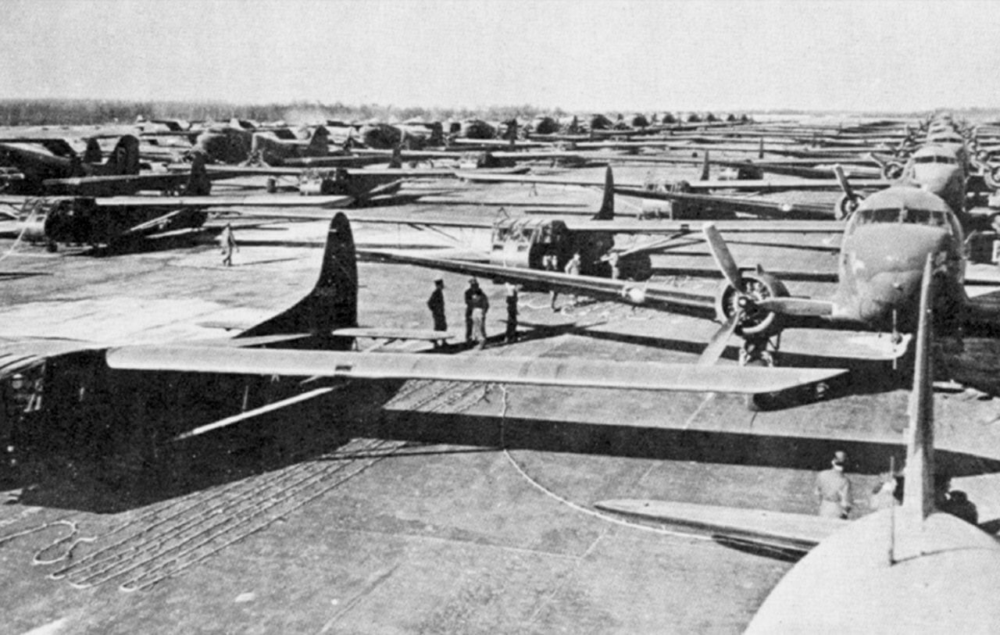

### Filipiny

Kongres Stanów Zjednoczonych uchwalił uzyskanie niepodległości przez Filipiny w 1945.

### Operasjon Rype

W Górach Snåsa wylądowała jedyna jednostka amerykańska działająca na terenie okupowanej Norwegii. Składała się Amerykanów pochodzenia norweskiego. Ich bazą była farma Gjefsjøen. Głównym zadaniem był sabotaż kolejowy.

Nie była to tak spektakularna akcja jak ta opisana 26 lutego - "Operation Greenup", ale dowiodła skuteczności dywersji na zapleczu nieprzyjaciela.

Oddział należał do Office of Strategic Services (OSS), poprzedniczki CIA.

- [Operasjon Rype](https://gjefsjo.no/en/operasjon-rype-en/)

### Operation Varsity

Operacja Varsity, część Operacji Plunder. Największa w historii operacja powietrznodesantowa: dwie dywizje, 16 tysięcy spadochroniarzy. Pełen sukces.

*Operacja Varcity. USAAF transportowe Douglas C-47 Skytrain i szybowce Waco CG-4A. 
By USAF - U.S. Air Force photo in the official USAF publication [The Army Air Forces in World War II](http://www.airforcehistory.hq.af.mil/Publications/Annotations/cravenAAFWWII.htm) [Volume 3 - Europe: Argument to V-E Day](http://www.airforcehistory.hq.af.mil/Publications/fulltext/aaf_wwii-v3.pdf), p. 745., Domena publiczna, [Link](https://commons.wikimedia.org/w/index.php?curid=11615302)*

### 2 Front Białoruski

Pruszcz Gdański, Oliwa!

### 1 Front Ukraiński

Głubczyce, Żory! Żory wraz z 1. Czechosłowacką Samodzielną Brygadą Pancerną

### Tygodnik Powszechny

Pierwszy numer "Tygodnika Powszechnego". Jest to jedno z najważniejszych czasopism w historii Polski powojennej.

Pierwszy komitet redakcyjny składał się z czterech osób: ks. Jana Piwowarczyka, Jerzego Turowicza (przez wiele lat redaktor naczelny), Konstantego Turowskiego i Marii Czapskiej. Założycielem i protektorem pisma jest arcybiskup metropolita krakowski kardynał Adam Sapieha.

### Operacja opolska

Tego dnia działania operacji opolskiej koncentrowały się na trzech kluczowych celach.

Dziś Strzelin (niem. Strehlen) przystosowany do obrony okrężnej został oblężony i zaatakowany jednocześnie ze wszystkich stron, atak zaczął się o 10 rano i trwał do późnych godzin wieczornych. Pomimo zadania poważnych strat miasto nie zostało zdobyte. Zajęte zostały północne przedmieścia i zablokowana droga ucieczki na zachód.

Jeszcze wczoraj natomiast piechota 55 i 177 korpusu zajęła kilkanaście bronionych zaciekle miejscowości w rejonie Nysy (niem. Neiße). Główne siły nyskiego garnizonu wobec groźby rozbicia wycofały się z miasta i zajęły pozycje na okolicznych wzgórzach. Kiedy dowódca Grupy Armii "Środek" dowiedział się o tym, rozkazał rozstrzelać dowództwo garnizonu Nysy. W mieście pozostało niewiele wojska, więc sowietom udało się wedrzeć od północnego-zachodu i południa, co więcej uchwycili niezniszczony most kolejowy na Nysie Kłodzkiej (niem. Glatzer Neiße). Nastąpiły krwawe i niszczące miasto walki. Niemcy palili całe kwartały zabudowań, sowieci niszczyli wszystko artylerią, dochodziło do walk wręcz. Walki trwały bez wyraźnej przerwy całą noc i cały następny dzień i dopiero 24 marca pod wieczór sowietom udało się zlikwidować ostatnie punkty oporu. Moskwa uczciła to zwycięstwo salutem ze 124 dział. Połowa zabudowań Nysy, głównie centrum miasta, została zniszczona w ciągu tych dwóch strasznych dni.

Głubczyce (niem. Leobschütz) natomiast zostały zaatakowane z trzech stron i po przełamaniu obrony na przedpolach zdobyte po krótkich, lecz zaciekłych walkach w centrum miasta, w których udział wzięły pododdziały 314 dywizji piechoty oraz zorganizowany ad hoc oddział zbiorczy w sile 400 ludzi złożony z rozmaitych jednostek zabezpieczenia polowego i obsługi wojsk. Iwanowi również zaczynało brakować ludzi.

Jak donosi Bolesław Dolata:
>Tego dnia o godz. 22.00 Moskwa na cześć wyzwolicieli Głubczyc salutowała 12 salwami artyleryjskimi ze 124 dział.

Całkiem niepotrzebnie przeszkadzano mieszkańcom Moskwy w zasypianiu przed niedzielą, która była jakąś szansą na odpoczynek, przecież nie było żadnych wyzwolicieli, skoro Niemcy nigdy Głubczyc nie zajęli siłą, a więc nie było żadnej niemieckiej okupacji. Niestety dla miasta ten jeden dzień walki zakończył się zniszczeniem 40% zabudowań, głównie śródmieścia, które praktycznie przestało istnieć.

### 2 Armia WP

Planowany udział 2 Armii LWP potwierdza dzisiejszy rozkaz dowództwa 1 Frontu Ukraińskiego:
>Rozkazuję... [...] Po piąte Dowódcy 6 Armii nie później niż do 15 kwietnia zlikwidować zgrupowanie niemieckie we Wrocławiu i wyprowadzić Armię do drugiego rzutu Frontu. Uwzględnić od 4-5 kwietnia, udział w działaniach 2 Armii Wojska Polskiego, znajdującej się w marszu do rejonu Wrocławia. Za organizację współdziałania z 2 AWP i wyznaczenie jej pasa działania odpowiedzialny jest szef zarządu operacyjnego Frontu.

2 Armia LWP jest już w połowie drogi do wyznaczonego celu. Przekracza linię demarkacyjną pomiędzy obszarem działania 1 Frontu Białoruskiego i 1 Frontu Ukraińskiego.

### Most powietrzny

"Dziennik Wojenny" Naczelnego Dowództwa Wehrmachtu z 24 marca - zaopatrywanie twierdzy drogą powietrzną było związane z dużymi stratami:
>Zaopatrzenie Wrocławia jest utrudnione z powodu nieprzyjacielskich reflektorów. Dotychczasowe straty wynoszą 64 junkersy, co jest tym smutniejsze, że zaprzestano produkcji...

### Peikert

Zwykle pomijam opis i uwagę jaką poświęca ksiądz Peikert działaniom nieprzyjaciela w nocy, ale tym razem przekazuje nam - być może bezwiednie - bardzo ważną informację, która przybliża nas do świata pełzającej apokalipsy, jakim był Wrocław w marcu i kwietniu 1945, pisze bowiem:
>Noc była zakłócona, wprawdzie nie przez ciężkie naloty, ale przez ożywioną działalność lotnictwa nieprzyjacielskiego. Raz po raz podejmowały akcję także działa przeciwlotnicze, które są tu ustawione wzdłuż brzegu Oławy i Przedmieścia Oławskiego. Jednakże rano o godz. 5 rozległ się ze wszystkich ustawionych dział wszelkiego kalibru ogłuszający huk kanonady. Wskutek pięknej pogody i porannej ciszy huk był o wiele potężniejszy i słychać było świst pocisków rozdzierających powietrze. Dwie godziny bez przerwy prawie trwał ten największy dotychczas ogień artyleryjski, ściskając niepokojem ludzkie serca, bo chyba należało oczekiwać rychłej odpowiedzi nieprzyjaciela, ta zaś oznacza dla nas grad pocisków, spustoszenia i zniszczenia, dom ów, a nade wszystko wielką obawę o tak nam drogi kościół. O godz. 6 poszedłem ku kościołowi w huku dział. Był znów prześliczny poranek wiosenny. W rzeczy samej poranek był względnie chłodny, ale nad naszym miastem rozciągało się bezchmurne błękitne niebo, a wschodzące słońce topiło właśnie swoje promienie w hełmie wieży naszego kościoła. Ptaki niebieskie nie dały się zbić z tropu hukiem dział. Śpiewały, wyciągały trele i gwizdały swą poranną pieśń, swe Te Deum laudamus tym żarliwiej ku niebu, im więcej ludzie ćwiczą się w rzemiośle niszczenia i burzenia.

Nie wiem, czemu tłumacz oddał nazwę Przedmieścia Oławskiego w formie niemieckiej, pozwoliłem sobie poprawić jego błąd, być może za czasów PRL-u myślano w kategoriach dzielnic, a nie historycznie rozwiniętych i wydzielonych przedmieść: mikołajskiego, świdnickiego, oławskiego i Nadodrza. Sprawa Nadodrza i jego nazwy - tak już zupełnie przy okazji uwaga - jest w ogóle zagadką, do której nie wiemy jak podejść. Ktoś może wie, skąd się wzięła ta polska nazwa? Jeśli od Dworca Nadodrze, to kiedy i dlaczego zmienił nazwę z Wrocław Odra na Nadodrze? Jeśli myślimy w kategoriach geografii miasta, to logicznie rzecz biorąc powinno być Zaodrze, tak jak to jest w Opolu. Wrocław cały jest Nadodrzem, natomiast to, co nazywamy teraz Nadodrzem jest wobec średniowiecznego rdzenia miasta za Odrą.

Ale wróćmy do Peikerta i Przedmieścia Oławskiego. Proszę zwrócić uwagę, jak jest dokładny i niczego nie pomija. Wie, że lotnik sowiecki prowadził "*ożywioną akcję*", że czasem strzelała do niego artyleria przeciwlotnicza, nie musi się o to nikogo pytać; wie dokładnie o której i na jaką skalę rozpoczęło się bombardowanie artyleryjskie, wszystko to jest częścią jego żywego doświadczenia. Co więcej, codziennego doświadczenia. Mówimy więc o ludziach, którzy od tygodni nie przespali spokojnie nocy, mieli przy sobie latarki na wypadek konieczności uciekania w nocy. A jeśli spali więcej niż dwie trzy godziny bez przerwy, zabierał ich koszmar. Sen w tej sytuacji nie daje ulgi, w sennych majakach groza tego, co się przeżyło za dnia zadaje podstępny cios. Żyli, ci którzy wciąż żyli, bezustannie naładowani adrenaliną, wyeksploatowani zmęczeniem, strachem, terrorem. A mimo to byli w stanie dostrzec śpiewające ptaki, zachwycić się nimi, a nawet żartować, że "*nie dały się zbić z tropu hukiem dział*".

Dzielny ksiądz również nie daje się zbić z tropu tym, co się wydarza ludziom egzystującym w rozliczne okoliczności śmierci:
>blisko 3 tygodnie temu pochowano tam mężczyznę około 72 lat. Leżał podobno przez 6 dni w swoim mieszkaniu, a zwłok nie zabierano, wskutek czego zmarła również jego żona na zatrucie. Pochowano ją jednak na Benderplatz (Staszica). Poleciłem dziś wykopać zwłoki, których rozkład był już mocno zaawansowany, i złożyć je do grobu wraz z nieszczęsnymi ofiarami, aby był przynajmniej pochowany w poświęconej ziemi. Nie należał on do parafii Św. Maurycego. Grupa obwodowa zarządziła po prostu, by go byle gdzie w kącie pochować. Ten brak czci i dla zmarłych idzie w parze z pogardą dla osobistej godności człowieka, właściwą dla narodowego socjalizmu. Dlatego ludność broni się tak przed pójściem do szpitala. Jeżeli krewni nie zabiegają natarczywie, aby w wypadku śmierci wydano im zwłoki, zanosi się je całkiem obnażone do kostnicy. Stąd zabiera je następnego dnia wóz o wysokich osłonach, tragarze wynoszą je bez nakrycia i wrzucają po prostu do wozu. Na cmentarzu kopie się wielki grób, do którego zwłoki wrzuca się jak popadnie.

Peikert widzi tu pogardę pogaństwa narodowego socjalizmu, w rzeczywistości kończyło się już miejsce na prowizorycznych cmentarzach, te które używano dotąd i przy istniejących przedwojennych i te urządzone na skwerach i placach nie mogły pomieścić rosnącej liczby zabitych. Z cmentarzy komunalnych nie można było już korzystać, od dawna bowiem kondukty pogrzebowe stały się łatwym celem krążących jak sępy, cichych i śmiertelnie niebezpiecznych kukuruźników. Ciał trzeba było się pozbywać jak najszybciej, w sposób jedyny możliwy - w zbiorowych mogiłach posypywanych wapnem, bez trumien, często bez możliwości zostawienia czegokolwiek, po czym można by później człowieka zidentyfikować.

Na jednym z największych z takich prowizorycznych cmentarzy - na Benderplatz, czyli współczesnym placu Staszica (właśnie na wzmiankowanym wcześniej Nadodrzu - proszę zwrócić uwagę jak współcześnie ten plac, wówczas miejsce pochówku jest sprofilowany na plac zabaw) pochowano od 28 lutego około 2 tysięcy cywilów i żołnierzy. Codzienna liczba ofiar, wg niepełnych oficjalnych danych, i tylko po stronie niemieckiej była przytłaczająca: 21 marca 63 osoby, w tym 15 cywilów, następnego dnia odpowiednio 73 i 20, 23 marca walki na froncie były nadal krwawe i znowu ginie "tylko" 20 cywilów, ale aż 72 żołnierzy. Dziś sowieci zabili ich mniej, bo 62, ale zginęło 25 cywilów. Jutro liczba ofiar osiągnie kolejny rekord 129 zabitych, w tym 90 żołnierzy i 39 osób cywilnych. I mowa jest o dniach, kiedy linie frontu uważa się za ustaloną, można by sparafrazować Remarque'a "na południu bez zmian". Wojny dzień zwykły, bez ofensywy.

Pisze dalej Peikert:
>Piękny dzień wiosenny zbliżał się ku końcowi. Jest to wigilia Niedzieli Palmowej. Ptaki w ogrodzie znów wyśpiewują radośnie swą pieśń wieczorną. Srebrzyście spływa blask dochodzącego do pełni księżyca na całe miasto. Żadnych oznak, że to koniec tygodnia. Pracę bowiem trzeba wykonywać w niedzielę tak samo jak w dzień powszedni. I w tym względzie rząd wykorzystał potrzeby wojny do tego, aby dać wyraz swej wrogości wobec jakiegokolwiek kultu dla Boga, aby w tej największej potrzebie narodu wykreślić dzień należny Bogu i przeszkodzić ludziom w oddaniu Bogu przynajmniej w tym dniu tego, co boskie, lub utrudnić to, ile się tylko da. O moich rodzinnych stronach dowiaduję się, że Nysa i Głubczyce zostały zdobyte przez Rosjan po uprzednim wzięciu przedwczoraj Prudnika. Zdobyli miejscowości Gościszowice, Średnia Wieś, Hajduki Nyskie, Szybowice. Może znajdują się już dziś w Głuchołazach. Co robią moi krewni, czy zmuszono ich również wymierzonym pistoletem do opuszczenia ziemi ojców, do pójścia w nieznane, do bezdomnej tułaczki i do spożywania chleba, obczyzny? W moim rodzinnym domu zabezpieczyłem naczynia kościelne i paramenta. Przede wszystkim moją, tak mi drogą kronikę kościoła Św. Maurycego, obejmującą już osiem wielkich tomów. Cóż się z tym wszystkim stało? Niech litościwa dobroć Boża chroni dom rodzinny i ojczystą ziemię, a przede wszystkim najdroższych krewnych w Bodzanowie, Głuchołazach i Charbielinie.

### Hartung

Hugo Hartung - osobliwej sceny z jeńcami ciąg dalszy:
>Minionej nocy nie tylko sowieckie bomby nie dawały nam spać. Umierający w sąsiednim łóżku kolega przechodził straszliwe męczarnie i wciąż błagał by podano mu coś do picia. Przed południem dostał parę zastrzyków i podczas gdy my jedliśmy obiad, spokojnie zasnął na zawsze. Potem po rzeczy zmarłego przyszedł, jak zwykle niski garbaty kapral, którego zwiemy "Pójdźką". Łózka denatów przeważnie już w kilka godzin później są znów zajmowane. Po raz pierwszy wolno mi wieczorem na chwilę wyjść na dwór. Jest przyjemnie, ciepło, krzewy zaczynają się zielenić. Na drzewie, które stoi na dziedzińcu klasztornym, szpaki budują gniazdo. O tej późnej godzinie panuje całkowita cisza, na niebie zaś świeci wielki księżyc. Tylko na południu widać ciężkie, czarne pióropusze dymu pożarów. Na chirurgii odbywa się potem przedświąteczny wieczorek towarzyski, na który kierownictwo lazaretu przekazało beczułkę piwa. Nasz utalentowany kelner i muzykant wyczarowuje przy fortepianie radosny nastrój, w czym tym razem pomaga mu ładna jasnowłosa wolontariuszka grająca na akordeonie. W tym miłym spotkaniu uczestniczą również angielscy i sowieccy jeńcy. Aczkolwiek niemo i bez wyraźnego zaangażowania. Dziwny to świat. Być może już za kilka dni będziemy jeńcami naszych jeńców.

Warto tu przytoczyć uwagę tłumacza, otóż pójdźka gatunek puszczyka to po niemiecku Totenvogel "ptak zmarłych", co przydaje mrocznej symboliki przydomkowi garbatego kaprala. Zastanawia czy wśród tych "paru zastrzyków" nie było czegoś, co pozwoliło umierającemu zasnąć spokojnie i na zawsze a jeśli tak, to czy Hartung i jego koledzy byli tego świadomi. Z konieczności przy braku środków medycznych metodę spokojnego usypiania stosowano wiele razy wobec beznadziejnych przypadków, szczególnie jeśli bardzo cierpieli. Hartung nawet przez chwilę nie zastanawia się, czy będą jeńcami "naszych jeńców", to już jest przesądzone. Zastanawia go tylko, kiedy się to stanie.

### Malinin

W takich dniach jak ten, kiedy nie ma ofensywy, nasilenie ognia przeciwnika jest zwykłe, a pogoda jest piękna, można zapomnieć jak wygląda wojna, ale jej obraz przekazuje Richard Hargreaves:
>Zaciekłość toczonych tutaj bojów zaskoczyła nawet tak doświadczonych weteranów jak Wasilij Malinin. "Walki nie ustają nawet na chwilę, zanotował w swoim dzienniku, podczas gdy z innych frontów docierały "radosne wiadomości o zwycięstwach". we Wrocławiu trwał "ciężki i zażarty bój. Wróg nie chce się poddać, zaciekle broni każdej ulicy, każdego domu". Korespondent wojenny widział jak dwaj radzieccy żołnierze przenieśli przez wodę swój cekaem, aby za jego pomocą zlikwidować załogę niemieckiego bunkra broniącego dostępu do jednej z fabryk. Zza ceglanego muru otworzyli bezpośredni ogień do wrogiego gniazda karabinów maszynowych, wybijając do nogi jego obrońców. Ich towarzysze uderzyli na fabrykę od tyłu, gdzie jednak spadł na nich kontratak kilkudziesięciu Niemców. Czerwonoarmiści wezwali na pomoc działa polowe i przeciwpancerne, z których zaczęli ostrzeliwać pobliskie domy, do czasu aż się zawaliły. Z kolei radzieckie armaty przeciwpancerne rozbiły niemieckie armaty przeciwpancerne ukryte za barykadami, zapewniając w ten sposób osłonę swojej piechocie. Po pięciu dniach walk Malinin i jego towarzysze dostali tylko jedną godzinę na odpoczynek. "Rzadko zdarza się taka godzina jak ta. w tych dniach, w tym mieście. Ludzie czyszczą broń i mundury, myją się, piszą listy do domu z obietnicami, że już wkrótce wrócą zwycięsko".

Teraz już wiemy, dlaczego oficjalna liczba zabitych odbiega i to znacznie od rzeczywistej. Po pierwsze nie mamy tam poległych żołnierzy Armii Czerwonej, po drugie w takich licznych przypadkach jak tu opisane, kiedy cała załoga stanowiska ogniowego jest zabita, a teren zajęty przez wroga, lub kiedy cała załoga obrońców ginie w ruinach zwalonego ogniem artylerii domu, nie ma jak policzyć zabitych. Nie zawsze wiadomo, czy ci, którzy nie wrócili z frontu, których już się nie udało odnaleźć w strefie walk to zaginieni, ranni, wzięci do niewoli, dezerterzy czy już polegli.

