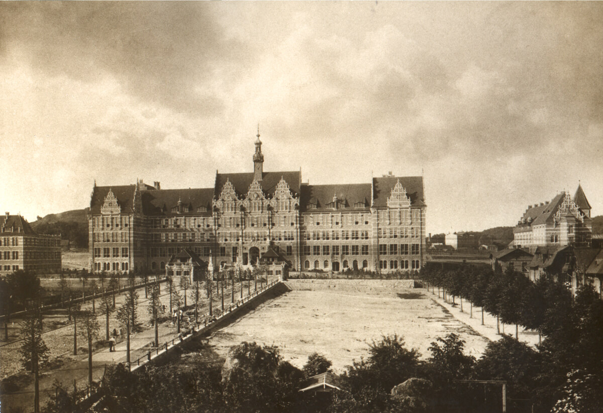

### Operacja PX "Kwiaty wiśni w nocy"

Jednym ze sposobów, na jakie Japończycy chcieli przeciwstawić się amerykańskiej przewadze w technologii i skali produkcji było zastosowanie zakazanych broni biologicznych i chemicznych. W okupowanej Mandżurii powstał olbrzymi ośrodek badawczy - Jednostka 731. W tej dziedzinie Japończycy przerośli hitlerowców. Pracowało tam tysiące ludzi i trudno nawet w przybliżeniu ocenić liczbę ofiar śmiertelnych, szacunki wahają się od 10 tys. do pół miliona. Różnice w tych szacunkach wynikają z - co jest oczywiste - wciąż ogromnego ładunku politycznego i emocjonalnego tej zbrodni dla obu stron. Tak samo jest z rzezią w Nankinie.

<SeeAlso txt="Broń podczas wojny na Pacyfiku" url="/festung-breslau/article/pacyfik-bron" />

Od grudnia 1944 przy wsparciu Marynarki i pod kierownictwem Shirō Ishii, lekarza i dowódcy Jednostki 731 opracowywano plan "Kwiaty wiśni w nocy", znany także jako PX (nazwa kodowa muszek zarażonych dżumą). Specjalnie w tym celu skonstruowane okręty podwodne serii I-400 miały na pokładzie składane wodnosamoloty Aichi M6A Seiran. Ich zadaniem był atak na USA, a dokładnie na największe miasta Kalifornii: San Diego, Los Angeles i San Francisco przy użyciu bomb z zarazkami dżumy, tyfusu, dengi i cholery. Po tej misji cała załoga okrętu miała sama się zainfekować i w samobójczym ataku wyjść na ląd.

Zwolennikiem i organizatorem tego ataku był wiceadmirał Jisaburō Ozawa, jeden z najwyższych oficerów Marynarki. Dowodził flotą japońską podczas bitwy na Morzu Filipińskim w czerwcu 1944, od 29 maja 1945 do końca wojny naczelny dowódca Połączonej Floty. W marcu 1945 przygotowania do realizacji Operacji PX zostały zakończone, wszystko było gotowe. Przedstawiono go do realizacji.

Generał Yoshijirō Umezu, w latach 1939-44 naczelny dowódca Armii Kwantuńskiej, od lipca 1944 szef sztabu armii i najwyższy rangą oficer japoński 26 marca 1945 wstrzymał realizację tego planu. Jak później powiedział:
>Jeśli dojdzie to wybuchu wojny biologicznej, jej skala przerośnie rozmiary konfliktu między Japonią a Ameryką; wywiąże się walka ludzkości z bakteriami, która nie będzie miała końca. Japonia narazi się na pogardę całego świata.

- War Stories with Mark Felton ["Operation PX - WW2 Japanese Bio-Weapon Attack on America (Episode 2)" [YT 18:53]](https://www.youtube.com/watch?v=wg-9F4xnD1E)

### Iwo Jima

Pierwsze zwycięstwo Amerykanów w bitwie na japońskiej ziemi, pokonali japońską armię na wyspie Iwo Jima.

<SeeAlso txt="Bitwa o Iwo Jimę" url="/festung-breslau/article/pacyfik-iwo-jima" />

Gwoli scisłości - Japończycy nie skapitulowali, opór wciąż trwa i wciąż zdarzają się ataki, po prostu USMC uznał wyspę za bezpieczną.

### Churchill

Generał Dempsey organizuje Churchillowi wyprawę rejon frontowy przez most pontonowy w Xanten (dawniej Colonia Ulpia Traiana). Jadący jeepem z innymi oficerami Churchill mija kolumnę zdumionych niemieckich jeńców. To ostatni raz, kiedy na własne oczy widzi front.

### David Lloyd George

David Lloyd George brytyjski premier i minister wojny w latach 1916-22 zmarł na raka w wieku 82 lat. Był przeciwnikiem silnej Polski i polskiego Śląska, to on jest autorem powiedzenia "*przekazać Polakom śląski przemysł to tak, jakby dać małpie zegarek*". Pod koniec życia w 1936 odwiedził Hitlera w Berchtesgaden i wywiadzie udzielonym Daily Express powiedział, że Hitler jest największym z żyjących Niemców i George’em Washingtonem Niemiec. W 1939 zmienił zdanie i poparł Churchilla i stronnictwo wojenne.

### Ernst Dubke

W bawarskim szpitalu wojskowym zmarł Ernst Dubke znany niemiecki wspinacz, który miał na koncie wiele wejść tatrzańskich. Ranny został podczas bombardowania Świdnicy.

### Borys Michajłowicz Szaposznikow

Po długiej chorobie zmarł marszałek Borys Michajłowicz Szaposznikow, oficer i wpływowy teoretyk wojskowości, szef sztabu generalnego RKKA. Jedyny człowiek, do którego Stalin zwracał się po imieniu i otczestwie.

### KONR

W Karlovych Varach ostatnie zebranie Komitetu Wyzwolenia Narodów Rosji (ros. Комитет Освобождения Народов России, KONR). Uczestniczy w nim generał Andriej Własow. Od dawna zasadniczym celem jest uratowanie rosyjskich żołnierzy Wehrmachtu od niewoli sowieckiej. Już za dwa tygodnie wyślą parlamentariuszy do Amerykanów.

### Task Force Baum

Patton ratuje zięcia z niewoli niemieckiej. Tzn. nie ratuje, bo ostatecznie misja się nie udała.

Dowiedział się, że jego zięć John K. Waters wzięty do niewoli w Tunezji w 1943 znajduje się w Oflagu XIII-B, k Hammelburga (Frankonia, czyli północna Bawaria). Sformował specjalną grupę bojową - Task Force Baum (od nazwiska dowódcy Abrahama Bauma) i wyznaczył jej za cel uwolnienie więźniów tego obozu.

Rzecz w tym, że było 80 km za liniami nieprzyjaciela, a jedynym powodem tego działania było ratowanie krewnego. A tak naprawdę po prostu uwolnienie, bo Watersowi żadne niebezpieczeństwo nie groziło. Była to prywata i jest to jedna z poważniejszych kontrowersji w działalności Pattona.

Misja, która wyruszyła dziś, przez trzy dni operacji wywoła ogromne zamieszanie w szeregach niemieckich, ale ostatecznie zakończy się fiaskiem. Z 300 ludzi grupy bojowej zginie 32, powróci zaledwie 35, reszta dostanie się do niewoli. Wszystkie pojazdy zostaną utracone. Dotarli do obozu, ale okazało się, że jest tam zbyt duża liczba jeńców, żeby ich ewakuować, a Waters był w takim stanie, że nie mógł iść i musieli go zostawić.

- [Mark Felton Productions "Task Force Baum - Patton's Insane Rescue Mission 1945" [YT 5:32]](https://www.youtube.com/watch?v=yPnpmmY1MJw)
- [Task Force Baum](https://en.wikipedia.org/wiki/Task_Force_Baum)

### Gdańsk

2 Front Białoruski: Wrzeszcz!

Sowieci podpalili gmach politechniki, w którym schroniły się setki mieszkańców i uciekinierów, gł. z Prus Wschodnich. Ostatni rektor prof. Egon Martyrer opuścił uczelnię przed południem.

Obrona Gdańska była chaotyczna, doborowe oddziały wycofano do Berlina, część jednostek schroniła się na Westerplatte i na Helu. Dowództwo ewakuowało się do Sobieszewa. Z okrętów zacumowanych w Zatoce Gdańskiej Kriegsmarine prowadziła bezładny ostrzał miasta.

<BoxImageWrapper>

Politechnika gdańska, Gmach Główny, wybudowany w 1904. Ul. Narutowicza 11/12. 
By [Asas077](https://commons.wikimedia.org/w/index.php?title=User:Asas077&amp;action=edit&amp;redlink=1) - Praca własna, [CC BY-SA 3.0](https://creativecommons.org/licenses/by-sa/3.0), [Link](https://commons.wikimedia.org/w/index.php?curid=33899843)
</BoxImageWrapper>

### 1 Front Ukraiński

1 Front Ukraiński: Rybnik i Wodzisław Śląski!

### Korpus Bezpieczeństwa Wewnętrznego

Siłowe narzędzie reżimu Korpus Bezpieczeństwa Wewnętrznego został powołany przez Rząd Tymczasowy.

### Dolny Śląsk

Walki o Strzelin [EPIZOD ZE STRZELINA Zdobycie bunkra](https://www.facebook.com/bobr1945/posts/3435036613276644)

### Wrocław

Ze wszystkich kronikarzy opisujących ostatnie dni dawnego Wrocławia najdokładniejszym i najlepszym jest ksiądz Peikert. Ponieważ jego relacja skończy się już za kilka dni, warto przytoczyć kolejny opis zwykłej nocy Wrocławia:
>Także minionej nocy nie ustał tak silny wczoraj, ogień artyleryjski i w czasie od godz. 22.30 do 1 pojedynek artyleryjski osiągnął znów największe nasilenie, nie słabnąc ani na chwilę. W ciszy nocnej echo grzmotu dział było jeszcze większe, a nad plebanią i kościołem słyszało się świst lecących w obie strony pocisków z szumem powietrza. Pociski nieprzyjaciela przeznaczone były raczej dla północnego brzegu Odry, tak że nie zauważono trafień w najbliższej okolicy naszego kościoła. Dochodzi do tego przy księżycowej nocy działanie nieprzyjacielskich samolotów, które operowały głównie bronią pokładową nad wielkim pasem startowym na północ od Mostu Grunwaldzkiego, o którym opowiada się, że zostanie wysadzony w powietrze, ponieważ utrudnia lądowanie samolotów na pasie swoimi wysokimi bramami mostowymi i lukami. Napatrzywszy się na plon zniszczeń ostatnich tygodni, który jest dziełem naszego własnego dowództwa i rządu, nie zdziwię się już, gdy ten obłęd niszczenia nie cofnie się już przed niczym. Ponieważ wiedzą, że ich rola dobiegła końca, ciągną ze sobą ku zagładzie 80-milionowy naród, a po nich może przyjść potop.

Tu trzeba wyjaśnić, że istotnie most ten był pewnym problemem dla projektantów lotniska, ale pogłoska o jego planowanym zniszczeniu była jedną z wielu krążących po oblężonej twierdzy plotek. Istnieje popularne powiedzenie, że w każdej plotce jest ziarno prawdy i akurat ta jest tego przykładem. Rzeczywiście, oszalałe w furii niszczenia władze miasta gotowe były wysadzić w powietrze i spalić wszystko, co się da, a wysokie pylony mostu sterczały na wysokość 20 metrów akurat bezpośrednio na końcu pasa startowego. Łatwo więc było uwierzyć w jego rychły koniec. Jednak Niemcy nie mogli sobie pozwolić na niszczenie mostów na Odrze. Na głównym nurcie Odry było ich sześć i były niezbędne dla utrzymania ruchu w mieście. Gdyby je zniszczyć miasto podzieliłoby się na dwa oddzielone obszary i organizowanie obrony byłoby się niezwykle trudne.

Wiedzieli o tym sowieci, ale dokładnie z tego samego powodu mostów nie niszczyli. Wprawdzie posiadali wszystkie niezbędne środki - głównie snajperów Połbina, którzy z lotu nurkowego mogli zniszczyć każdy obiekt nawet wielkości czołgu. Wiedzieli również że zniszczenie mostów znacznie osłabi zdolność obronną twierdzy. Choć wiele mostów podczas walk zostało poważnie uszkodzonych, głównie właśnie Most Grunwaldzki i poprzednik Mostu Pokoju - Most Lessinga, to jednak nic nie wskazuje, na to, że obrali je za cel. Powód był oczywisty: były tak samo ważne dla oblegających. Mosty na Odrze były istotną częścią wartości pozycji wrocławskiej, bez nich traciła znaczenie jako węzeł komunikacyjny.

Most Grunwaldzki nie został zniszczony, ale zostały zdjęte hełmy z pylonów, co znacznie zmieniło jego sylwetkę. Hełmy te z niezrozumiałych przyczyn do dzisiaj nie zostały przywrócone.

Wróćmy do Peikerta:
>Tak więc mam znów niedobrą noc i niespokojny sen, a czeka mnie znów długi całodzienny wysiłek. Wstaję o godz. 4.40, gdyż o godz. 5.30 w tym tygodniu każdego rana mam dyżur w konfesjonale. W godzinach porannych nieco się uspokoiło, a wielka to ulga zamiast huku armat słuchać porannego śpiewu ptaków w ogrodzie parafialnym. Kościół otacza błogi spokój. Modlę się przed obrazem Matki Boskiej Bolesnej przy wejściu po prawej stronie. Wtedy wchodzi wielu mężczyzn. Długo modlą się w kościele. Pytam ich, skąd pochodzą. Znajdują się; w obozie Niemców emigrantów przy ul. Józefa Hauke-Bosaka w szkole im. Clausewitza. Są to religijni ludzie. Tyrania Trzeciej Rzeszy oderwała ich od ziemi, na którejś mieszkali od wieków. Żyli w spokoju na tej ziemi, nauczyli się języka gościnnego państwa, które ich przyjęło, cieszyli się swobodą i mogli też pielęgnować swą kulturę narodową. I oto obłęd narodowego socjalizmu wyrwał ich kłamliwymi obietnicami z własnej roli z powrotem do Rzeszy. Potem dano im zrabowane gospodarstwa chłopskie i sklepy w okupowanej Polsce i Rosji; Z mieniem tym czuli się nieswojo, a teraz wskutek ostatniej wielkiej ofensywy rosyjskiej zostali ponownie wypędzeni i tułają się bez dachu nad głową. Powiedzieli mi, że nie mają możliwości ani czasu chodzić do kościoła. W każdą niedzielę muszą ciężko pracować od świtu do nocy, a nawet w nadchodzącą Wielkanoc nie będą mogli uczestniczyć w nabożeństwie.

Czy może chodzić tu o Niemców nadwołżańskich, potomków dobrowolnych osadników zachęconych dekretem Katarzyny Wielkiej z 1763? Społeczność ta kultywująca własny język i obyczaje aż do czasów II Wojny Światowej posiadała w czasach sowieckich własną republikę autonomiczną (niem. Autonome Sozialistische Sowjet-Republik der Wolga-Deutschen, ros. АССР Немцев Поволжья), ale w momencie hitlerowskiej inwazji Stalin rozkazał wszystkich wysiedlić daleko w głąb Azji, do Kazachstanu i Ałtaju. Wkrótce prawie wszyscy znaleźli się w obozach niewolników NKWD, gdzie jedna trzecia zginęła. Wydany przez NKWD Prikaz 35105 zabraniał im służyć w Armii Czerwonej, dziesiątki tysięcy żołnierzy zostało skierowanych do tzw. Trudarmii, czyli batalionów pracy, byli skoszarowani i pracowali w kopalniach, fabrykach amunicji przy budowie dróg. Możliwe jest jednak, że przed wybuchem wojny niemiecko-sowieckiej jakaś część Niemców nadwołżańskich została ściągnięta do Niemiec. Trudno wskazać jakąś inną przyczynę, dla której są trzymani w obozie razem z innymi obcokrajowcami. Tylko takie pochodzenie mogłoby uzasadniać tak podejrzliwe traktowanie.

>Coś w rodzaju nastroju zagłady panuje wśród wszystkich uczestników. Tylu zabitych, tyle grobów, tyle cierpień i bólu. A przecież daleko jeszcze do wydobycia wszystkich ofiar z ostatniego piątku. Jest między nimi mały ministrant, Peter Kurve. Rano służył jeszcze do mszy św. Potem zasypało go razem z babcią.

Jedna z tysięcy tragicznych historii, normalne chciałoby się z przyzwyczajenia powiedzieć życia miasta, w tym wypadku raczej jego umierania.
>O godz. 11.15 wracam ze służby, która rozpoczęła się rano o godz. 5.30. Także dzisiaj trwa przez całe przedpołudnie bardzo silna akcja artylerii, która w czasie mszy św. wzmogła się do takiej samej intensywności, jak wczoraj podczas nabożeństwa. Zaiste, odprawiamy nabożeństwa w najsilniejszym ogniu frontu. Pewien major z ostatniej wojny 1914-1918 powiedział mi, że czegoś podobnego nie przeżył podczas wojny światowej. Jeśli nabożeństwo odbywało się na pierwszej linii frontu, to zwykle wyszukiwano gdzieś spokojny zakątek, tu zaś nieprzyjacielskie pociski przelatują ze świstem nad kościołem tam i z powrotem, a łoskot nieprzyjacielskich samolotów w powietrzu wstrząsa świątynią.

Już wkrótce, za kilka dni Iwan ustanowi kolejny rekordowy punkt odniesienia.
>Tymczasem znów trwa gwałtowny nalot na północną część miasta i niedługo potem wzbijają się ku niebu czarne kłęby dymu; zrzucono więc znów bomby zapalające. Ta akcja lotnictwa, jak i znów wzmożony ogień artyleryjski każe z nadchodzącą nocą obawiać się najgorszego. Wieczorem niebo od południa i wschodu jest znów purpurowe mimo księżycowej nocy. Płonie dzielnica przy Krakowskiej, podpalono nowe ciągi budynków przy Kościuszki (Tauentzienstraße) oraz sprzęty domowe, które wyrzucono z górnych pięter na ulicę. Przy tym pali się osiem domów na ul. Kniaziewicza (Palmstraße). Na pytanie, czy tę ulicę spotkać ma ten sam los pewien żołnierz odpowiada, że stało się to wskutek przeoczenia. Ciągle widzi się na ulicach biednych, zaszczutych ludzi z małymi ręcznymi wózkami, uciekających z południa i ze wschodu mojej parafii w inne okolice miasta, gdyż zostali siłą wypędzeni ze swoich mieszkań. Jakaż nędza ukazuje się tu oczom ludzkim. Najtwardsze serce mięknie w obliczu takiej niedoli narodu. Z tym udaję się wieczorem na spoczynek, a smutek w moim sercu jest tak wielki, że niemal co godzinę zrywam się ze snu, który nie daje już wytchnienia ciału potrzebującemu tak bardzo spokoju i pokrzepienia. O Boże, jak długo jeszcze, o Boże, jak długo jeszcze? A przecież narody, któreśmy napadli, znoszą takie cierpienia już od lat.

Warto zwrócić uwagę na ostatnie zdanie. Ilu Niemców doświadczyło podobnej refleksji? A czy z drugiej strony nie jest tak, że ksiądz Paul Peikert - który jeszcze trzy dni temu pisał, że chrześcijanie bardziej przeżywają cierpienie Golgoty, kiedy sami doświadczają podobnego - przyznał w ten sposób, że wojna musiała przyjść do niemieckiego domu, żeby Niemcy mogli postawić się w miejscu narodów, na które sami sprowadzili wojnę?

Peikert opisuje spotkanie z innym kronikarzem twierdzy:
>Udając się na probostwo, spotykam ks. Lassmanna proboszcza od Św. Józefa. Chce jeszcze raz szybko obejrzeć swój kościół parafialny przy Krakowskiej, gdyż planuje się podpalenie całej tej ulicy, a ze względu na przylegające doń budynki kościół jest również w niebezpieczeństwie. Doniesiono mi już wcześniej, że na plebanii, w domu sióstr, w sali parafialnej i w zakrystii kościoła panuje okropny nieład. Wszystko poprzewracane przez żołnierzy, którzy wywlekli wszystko ze schowków i porozrzucali. Czyż i to dzieło, które powstało za moją przyczyną, ma być skazane na zagładę? Sam Bóg tylko wie, ile wysiłku pochłonęła budowa kościoła Św. Józefa i założenie nowej parafii.

Kościół św. Józefa Rzemieślnika (St. Josephs Kirche) został zbudowany w 1933 i konsekrowany przez arcybiskupa Adolfa Bertrama. Zaprojektowany razem z całym kompleksem parafialnym. Nowoczesny, wyposażony w ogrzewanie elektryczne budynek kościoła dla zapewnienia spokoju był oddalony od ulicy o 60 metrów, połączony był z budynkiem plebanii, klasztorem dla sióstr zakonnych, ochronką dla dzieci i placem zabaw. Oprócz Brochowa i Księża Małego była to trzecia parafia pomocnicza dla Przedmieścia Oławskiego, którego centrum był kościół pw. św. Maurycego. Kościół pw. św. Józefa został spalony w 12 lat po wybudowaniu, przez samych Niemców. Już w 1946 został uruchomiony na nowo.

Walter Laßmann pisze o losie swojego kościoła:
>Świątynia ma zostać wysadzona w powietrze, a wraz z nią przyległe budynki: plebania, dom sióstr, żłobek i przedszkole. Nasi obrońcy zakładają, że Rosjanie zajmą wschód Wrocławia od strony Książa. Aby uzyskać wolne pole ostrzału, zniszczone mają zostać wszystkie budynki po lewej stronie ul. Krakowskiej, w tym i mój kościół. Leżący na ukos od niego ewangelicki kościół św. Bernarda został wysadzony już wcześniej. Rozmawiając z dowódcą stacjonującej tu drużyny minerskiej - młodym, sympatycznym oficerem - prosiłem go nader usilnie aby oszczędził kościół, bo nie leży on przecież w linii pozostałych zabudowań przy ulicy. Nie obiecał mi tego w sposób wiążący, ale zapewnił, że dołoży wszelkich możliwych starań aby zadośćuczynić mojej prośbie. Niestety nie dołożył chyba "wszelkich" możliwych starań, w Wielki Czwartek bowiem zniszczono kościół św. Józefa wraz z przyległymi zabudowaniami.

I wkrótce wraca do uratowanej spod ruin dwunastoletniej dziewczynki, Elisabeth Grollmus:
>Po południu odwiedziłem małą Liesel Grollmus. Dziewczynka doszła już jako tako do siebie i postawiła mi pytanie, które musiało paść i którego się obawiałem: proszę księdza, dlaczego moi rodzice nie przychodzą? I Helmut i Eva-Maria? Wziąłem jej rączkę w swoją dłoń i w możliwie oględnych słowach uświadomiłem jej, że rodzice i rodzeństwo są już w niebie. Patrzyła na mnie zalana łzami, nie odzywając się ani słowem. Musiałem zostawić ją samą z tym wielkim ciężarem w sercu [...] Z jak wielkim cierpieniem zmierzyć się musiało tak małe dziecięce serce!

Najciekawsze jednak jest na końcu:
>Wczorajszej niedzieli wspiąłem się w południe na jedną z wież katedry, aby rzucić stamtąd okiem na płonące miasto. Hans Kaiser, którego prosiłem o towarzyszenie mi w tej wyprawie, zrejterował przed tą przygodą. Byłem ostatnim człowiekiem, który przed wielką pożogą wielkanocną i przed zburzeniem katedry oglądał jeszcze miasto z wysokości tej wieży. Był to widok o upiornej piękności. Wszędzie, przede wszystkim na zachodzie miasta, rozlewało się morze płomieni. Pożary zżerały całe dzielnice. Na południu eksplodował groźnymi pomrukami i rozbłyskiwał front.

Zastanawia niezwykle mała ilość zdjęć z czasów oblężenia. Twierdza miała co prawda kilku fotografów i sam wygląd miasta i jego życie jest udokumentowane dość dobrze. Nie ma jednak, czego można by się spodziewać po niemieckim mieście z lat 40. XX i dostępności techniki fotograficznej w tamtych czasach, liczby fotografów-amatorów dokumentujących te niezwykłe i straszne dni. Przecież byli świadomi tego, że ich miasto już nigdy nie będzie takie samo. Czemu Laßmann nie wziął na tę wycieczkę aparatu?

Hugo Hartung coraz ciężej znosił ostatnie dni w lazarecie, szczególnie przebywanie w dusznej piwnicy dawało mu się we znaki. Wciąż osłabiony, ale już zdrowy wypisał się na własną prośbę i wraz z 2 kolegami wyszedł zameldować się w punkcie przejściowym. Szli przez miasto, które widział ostatni raz dokładnie miesiąc temu, 25 lutego:
>Jak bardzo zmieniły się ulice Wrocławia! Na każdym kroku ostrzelane i zbombardowane domy. Byle podmuch wiatru wzbija tumany ceglanego pyłu, który również na butach pozostawia czerwony nalot. Idę do Rynku przez ul. Wita Stwosza. Kilka razy musimy kryć się w bramach kamienic, bo sowieckie "maszyny do szycia" stebnują miasto seriami z karabinów. Czasami wciskamy głowę w ramiona, gdy ze skowytem śmigają nad nami granaty, które wybuchają gdzieś w pobliżu. [...] Nowa kwatera przypada nam do gustu. Stacjonujemy w wysokiej średniowiecznej piwnicy bezpośrednio pod winiarnią. W ostatnim pomieszczeniu mieszka rusznikarz J. niegdyś detektyw. Odniósł ciężkie rany jako mechanik pokładowy. Uroił sobie upiorny świat pokoju, okrasiwszy swoje lokum dywanami, obrazami i regałami książkowymi. Ma nawet projektor i wieczorem wyświetla kolorowe diapozytywy. Pokazuje mi zdjęcia z podróży do żydowskich przyjaciół w Palestynie i barwne fotografie z wakacji w Tyrolu. Jego żona i dzieci, którzy tutaj pojawiają się na ekranie w wesołych kolorach, zginęli podczas bombardowania Drezna".

To kolejny już dzień, kiedy wszechobecny kurz narzuca się w opisie. Powietrze jest zatrute dymem z płonących domów, sadza, kurz i pył pokrywają ruiny, żywych i umarłych. Na miasto zaczyna się kłaść farba zagłady, która widoczna jest do dziś. Kopeć wojenny. Zdumiewający jest ten obraz detektywa-rusznikarza i jakże różny od niestereotypowego co prawda, ale takiego, do jakiego przywykliśmy, obrazu niemieckiego policjanta z Wrocławia - Eberharda Mocka. Mock bowiem nigdy by nie pozwolił sobie na życie w urojeniach, na eskapizm, jego umysł miał taką samą ostrość jak kanty jego spodni. Mock był twardzielem i nie uległby ciśnieniu świata bardziej niż jego nienagannie skrojone ubranie. Rusznikarz J. jest prawdziwą postacią, którą Hartung opisuje bezbłędnie, może i jest szalony. Ale przecież wolelibyśmy, żeby jego szaleństwo było prawdą, a koszmarna rzeczywistość twierdzy zaledwie jakimś urojeniem. Odchodząca w ogniu i dymie wizja twierdzy w przeciwieństwie do diapozytywów, wspomnień i zdjęć z dnia na dzień traci barwy, jest pozbawiona żywych kolorów. Wroclaw wygląda niczym mityczny, rozgrzany i duszny Hades wypełniony dawnymi ludźmi, pustymi figurami w chochołowym transie coraz bardziej tracącymi tożsamość i człowieczeństwo. Obraz blaknie, postacie zanikają, wszystko przykrywa kurz.