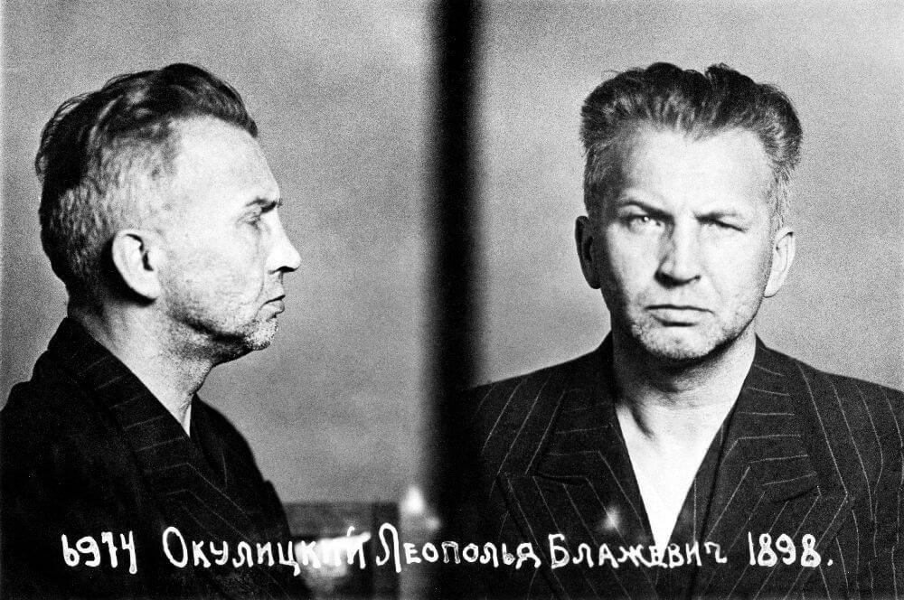

### Birma

Birma to dwa razy większy kraj niż Polska znajdujący się pomiędzy dwoma światowymi potęgami: od zachodu ma Indie, od północy Chiny. W drugiej połowie XIX wieku stała się częścią brytyjskiego dominium. W latach 30. XX uformował się w Birmie ruch Dobama Asiayone, jego przedstawicieli nazywano Thakinami. Celem tego ruchu była niezależność, niepodległość Birmy. W oczywisty sposób byli inspirowani przykładem Indyjskiego Kongresu Narodowego.

W kwietniu 1941 mała grupa Birmańczyków - znanych później jako Trzydziestu Towarzyszy - została wysłana przez Dobama Asiayone do Chin, celem nawiązania kontaktów i uzyskania pomocy ze strony chińskich komunistów. Mieli powrócić i mając chińską pomoc walczyć o niepodległość. Tak się jednak złożyło, że otrzymali pomoc, ale od Japończyków, którzy jak najbardziej popierali niezależność Birmy od Wielkiej Brytanii. Trzydziestu Towarzyszy założyło Birmańską Armię Niepodległościową, która u boku armii japońskiej wywalczyła wypędzenie Brytyjczyków z Birmy. Kiedy zgodnie z założeniami Dobama Asiayone chcieli sformować własny, niepodległy rząd, okazało się że Japonia popiera niezależność Birmy od Wielkiej Brytanii, ale nie niezależność w ogóle i armia została rozwiązana i w jej miejsce powołano mniejsze siły obrony potem przemianowane na Birmańską Armię Narodową.

Niezadowoleni zwolennicy niepodległości nawiązali w 1944 kontakty z Brytyjczykami i po uzgodnieniu warunków współpracy właśnie dziś 27 marca 1945 rozpoczęli powstanie antyjapońskie.

Dowódcą sił alianckich na tym teatrze wony był Lord Mountbatten, Birmańska Armia Narodowa jako Patriotyczne Siły Birmańskie weszła w skład Antyfaszystowskiej Ligi Wolności Ludu.

27 stycznia 1947 podpisano porozumienie, na mocy którego Birma miała odzyskać niepodległość.

### Argentyna

Argentyna formalnie wypowiedziała wojnę Japonii i Niemcom. Już za kilka tygodni stanie się azylem dla hitlerowców.

W 1943 wojskowy pucz obalił rząd konserwatywny i sytuacja polityczna była dość płynna, ale już wtedy dość poważną pozycję w rządzie wojskowym miał Juan Peron. W 1946 wygra wybory i rozpocznie epokę peronizmu trwającą aż do kolejnego przewrotu w 1955. Argentyna przyjmie hitlerowców z otartymi ramionami.

### V2

Wystrzelona ostatnia bojowa rakieta V2.

<SeeAlso txt="Vergeltungswaffe od V1 do V4 / broń zemsty" url="/festung-breslau/article/vergeltungswaffe" />

### Berlin

Deportacja Żydów z Berlina do Sachsenhausen i Theresienstadt.

### 2 Front Białoruski

2 Front Białoruski: Rumia!

### Skrobów

W listopadzie 1944 w Skrobowie na Lubelszczyźnie powstał obóz dla byłych żołnierzy AK służących w 1 lub 2 Armii WP.

Dzisiaj 48 z nich uciekło. 15 pomagających im dostało ciężkie wyroki, m.in. karę śmierci. Przeżyło tylko dwóch, których odbito podczas transportu na Sybir. Ci którzy pozostali w obozie, zostali wywiezieni do łagrów na Syberię.

### Aresztowanie szesnastu

W Pruszkowie NKWD pod dowództwem generała Iwana Sierowa aresztowało 16 przywódców Polski podziemnej.

Zostali uwięzieni, porwani i przetransportowani do Moskwy gdzie odbył się tzw. Proces Szesnastu. Niezależnej od komunistów Polsce utrącono głowę.

<BoxImageWrapper>

Jeden z pojmanych 16 przywódców Polski Podziemnej - Leopold Okulicki po aresztowaniu przez NKWD. 
By [NKVD](https://en.wikipedia.org/wiki/NKVD), mug shot - Official [NKVD](https://en.wikipedia.org/wiki/NKVD) photo from Okulicki personal file after arrest 1945, Domena publiczna, [Link](https://commons.wikimedia.org/w/index.php?curid=50731838)
</BoxImageWrapper>

### Stefan Korboński

Stefan Korboński został p.o. Delegata Rządu na Kraj.

### Gdańsk

Korespondent wojenny N. Bielski dla agencji TASS:
>Dowództwo nasze przejmuje niemieckie radiogramy. Tam panika. W portach gdańskim i gdyńskim – wieża babilońska. Lotnicy opowiadają, że ulice tych miast są zatarasowane tysiącami aut, na przystaniach tysiące ciężarówek i tłumy ludzi. Dziesiątki okrętów załadowują się w szalonym tempie. Zabierają wartościowe rzeczy i rannych. Jeńcy z gdańskiego garnizonu opowiadają, że w porcie kilka łodzi podwodnych oczekuje do ostatniej chwili na wyższe dowództwo. [...] Powietrze na ulicach rozpalone jest od szalejących pożarów. Z hukiem padają na bruk wielopiętrowe budowle. Całe dzielnice toną w czarnym dymie. Nad miastem unoszą się chmury popiołu. Popiół osiada na odzienie, grubą warstwą kładzie się na ciężarówki, czołgi. Auta wzniecają kłęby czerwonego, ceglanego kurzu. [...] Wszystko, nawet ziemia sama, wypalona do źdźbła, mówi o bezkompromisowych, krwawych zmaganiach

za: "Bitwa o Gdańsk. Wrażenia radzieckiego korespondenta wojennego", "Dziennik Bałtycki" nr 344, s. 3.

W tym czasie gauleiter Albert Forster był na Helu i przygotowywał transport swoich cennych gdańskich mebli do Rzeszy.

Ulotki:
>Niemieccy żołnierze i oficerowie! Nie macie już dokąd iść. Z powrotem – nie ma drogi, tam Rosjanie. Na lewo – śmierć, smażą się tam w kotle resztki waszej II Armii. Na prawo – również śmierć: tam tanki rosyjskie. Pójdziecie na wprost – daleko nie zajdziecie, wepchniemy was do Bałtyku. Poddawajcie się do niewoli!

Dzisiaj oddziały 2 Frontu Białoruskiego, w tym polskiej Brygady Pancernej im. Bohaterów Westerplatte wkroczyły do śródmieścia od strony Wrzeszcza i Siedlec. Przedtem sowieci zasypali miasto tysiącami ulotek w języku niemieckim. Marszałek Konstanty Rokossowski gwarantował życie i zachowanie własności osobistej wszystkim, którzy poddadzą się do niewoli:
>Oficerowie i żołnierze, którzy nie złożą broni, zostaną bez wyjątku w najbliższym szturmie unicestwieni. Na nich spadnie także odpowiedzialność za ofiary, jakie poniesie ludność cywilna.

### Wrocław

Peikert:
>Nie można poznać już Wrocławia.

A potem cytuje trzy ulotki sowieckie, oto treść pierwszej z nich:
>Do załogi i ludności okrążonego Wrocławia! 
>Krzyż Rycerski dla kata Hankego. 
>Hitler odznaczył Krzyżem Rycerskim swą kreaturę, gauleitera Śląska, zbrodniarza wojennego, Hankego. 
>Okrążeni we Wrocławiu żołnierze i oficerowie niemieccy, jak i mieszkańcy miasta znają dobrze "zasługi" tego pana, którego teraz Hitler pasuje na rycerza. 
>Hanke dał na zbrodniczy rozkaz Hitlera spustoszyć Śląsk, zrujnował ekonomicznie setki tysięcy Niemców, a teraz każe zniszczyć jedno z najpiękniejszych miast niemieckich, Wrocław, z wszystkimi jego fabrykami, przedsiębiorstwami handlowymi i domami. 
>Hanke na zbrodniczy rozkaz Hitlera pozbawił setki tysięcy rodzin żołnierskich dachu nad głową i zrabował im ostatni kęs chleba. Przez ewakuację zmienił Wasze rodziny w gromadę żebraków i rozproszył je po całym kraju, gdzie nie znajdują ani schronienia, ani pożywienia. 
>Hanke na zbrodniczy rozkaz Hitlera niszczy bez reszty męską ludność Śląska, a przede wszystkim Wrocławia, zapędzając starców i chłopców do batalionów Volkssturmu i wydając ich na pewną zagładę w walkach ulicznych. 
>Hanke na zbrodniczy rozkaz Hitlera wprowadził dla załogi i pozostałej w mieście ludności Wrocławia rządy bezwzględnego terroru; przywiódł już setki mieszkańców miasta jak też żołnierzy i oficerów załogi do szubienicy. 
>Miał więc kat Hanke wszelkie warunki, aby otrzymać Krzyż Rycerski od arcykata Hitlera. Jednak dni Hankego, jak też dni wszystkich innych nazistowskich hersztów i całego reżimu hitlerowskiego są policzone. 
>Armia Czerwona przybyła do Niemiec, żeby odprawić surowy sąd nad zbrodniarzami wojennymi i zniszczyć narodowy socjalizm. 
>Dokądkolwiek by uciekł Hanke po wyniszczeniu jeszcze dziesiątków tysięcy niemieckich żołnierzy i mieszkańców Wrocławia, nie ujdzie sprawiedliwej kary. 
>Żołnierze okrążonej załogi! Wrocławianie! 
>Hitler nie ufa swoim generałom, dlatego przekazuje władzę dowodzenia swoim nazistowskim łotrom. 
>Pierwsza kreatura hitlerowska Himmler dowodzi obecnie wojskami niemieckimi na Pomorzu. 
>Drugi nazistowski szubrawiec Goebbels objął obronę Berlina. 
>Trzeci Hanke wiedzie ku zagładzie Wrocław wraz z ludnością. 
>Ale wszyscy ci panowie są tylko dopóty bohaterami, dopóki inni za nich walczą. Dowódca Volkssturmu w Prusach Wschodnich, gauleiter Erich Koch, który przez dwa lata plądrował Ukrainę, uciekł z kotła królewieckiego, zgubiwszy uprzednio setki tysięcy Niemców w Prusach Wschodnich. W obawie przed zemstą narodu niemieckiego Hitler poczuł się zmuszony do powieszenia tego swego ulubionego wychowanka. 
>Samolot Hankego stoi też już w pogotowiu. 
>Nie pozwólcie Hankemu wytracić załogi i ludności. 
>Załatwcie się szybko z Hankem! 
>Skończcie z Hankem, zanim on zrobi to z Wami! 
>Zaniechajcie natychmiast oporu! 
>Złóżcie broń! 
>Wyślijcie Waszych parlamentariuszy! 
>Chodźcie do niewoli rosyjskiej! 
>1482-22. 3. 45 r.

Kilka rzeczy jest nieprawdziwych, m in od 20 marca Himmler już nie dowodzi Grupą Armii Wisła. Ale generalny opis sytuacji, jej ocena jest zgodny z myślami Peikerta i jak Peikert uważa, większości wrocławian. Co więcej, pisze nawet, że:
>Czyż wrogowie po zawartym na czas pokoju obchodziliby się kiedykolwiek tak z narodem niemieckim, jak dręczy go jego własny rząd?

### 2 Armia WP

Jak informują Jońca i Konieczny - orzeł wylądował:
>Generał Świerczewski ze swym sztabem przybył do Trzebnicy 27 marca o godzinie 20 i zakwaterował się przy ul Przodowników Pracy, skąd kierował pracami sztabu i przygotowywał wojsko do zluzowania jednostek 6 Armii 1 Frontu Ukraińskiego oblegających Wrocław.

Więcej o tym orle jak dojdzie do bitwy pod Budziszynem.
