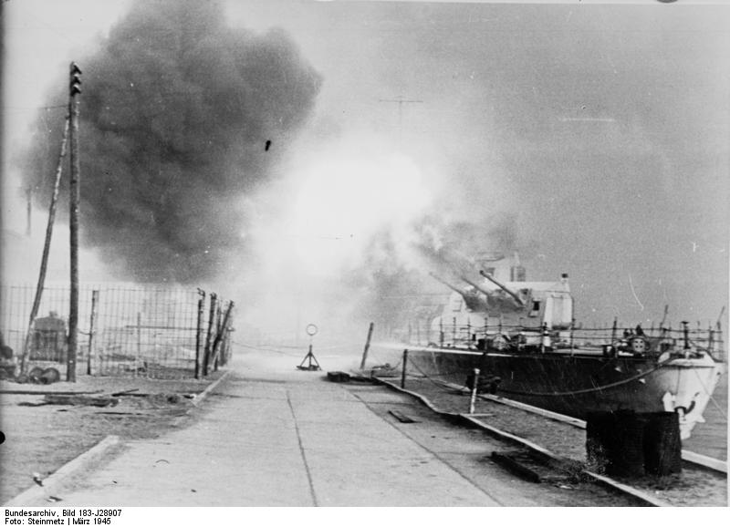

### Filipiny

Wojska amerykańskie zdobyły twierdzę Talisay na filipińskiej wyspie Cebu. Jest to centralnie położona i jedna z ważniejszych wysp Filipin. Działała tam lokalna partyzantka pod dowództwem inżyniera wojskowego Jamesaa M. Cushinga.

1 kwietnia 1944 wzięli do niewoli oficerów japońskich z rozbitego samolotu. Był między nimi admirał Shigeru Fukudome. Oddali ich Japończykom pod warunkiem, że mordowanie cywili się skończy i rzeczywiście Japończycy umowy dotrzymali. Ważne dla przebiegu wojny było zdobycie znajdujących się na pokładzie samolotu planów Operacji Z, czyli obrony Marianów, Karolinów i Zachodniej Nowej Gwinei. Od nazwiska twórcy, admirała Mineichi Koga, dokumenty te nazywane są "Koga papers".

- ["How Cebuano Fishermen Helped Defeat the Japanese in World War II"](https://filipiknow.net/cebu-guerrilla-koga-papers/)
- ["The Capture Of The Koga Papers And Its Effect On The Plan To Retake The Philippines In 1944"](http://micronesia.csu.edu.au/MJHSS/Issue2005/MJHSS2005_205.pdf)

### SCAF 252

Ze swojej kwatery głównej SHAEF w Reims głównodowodzący frontem zachodnim generał Dwight Eisenhower wysłał depeszę SCAF 252 skierowaną do misji wojskowej w Moskwie adresowaną bezpośrednio do Stalina. Ujawniał w niej iż zrezygnowali z ataku na Berlin, główne uderzenie alianckie pójdzie na linii Lipsk - Drezno, tak żeby siły niemieckie rozciąć na dwie części. Proponował przy tym spotkanie na tym kierunku i dalszą koordynację działań.

Sam fakt bezpośredniej łączności głównodowodzącego frontem z przywódcą politycznym innego państwa dowodzi kompletnego braku rozeznania amerykańskiego generała w polityce - taka zresztą byłą tradycja amerykańska: wojskowi mieli być trzymani z dala od polityki. Do tego Ike powierzał najściślejszy sekret wojskowy, co prawda sojusznikowi, ale było to zachowanie bez precedensu i wbrew zasadom. Wywołało to burzę dyplomatyczną na linii Churchill - Truman i Ike otrzymał poważną reprymendę.

Odpowiedź Stalina była oczywiście uprzejma i Stalin zgadzał się na wszystko. Na piśmie. W rzeczywistości zwietrzył podstęp i przekonany, że Amerykanie chcą zwinąć mu Berlin sprzed nosa wezwał swoich najważniejszych marszałków: Żukowa i Koniewa na Kreml. Tam przedstawił im sytuację i zażądał jak najszybszego ruszenia ofensywy berlińskiej. Nad Reichstagiem miała zawisnąć czerwona flaga.

To zmieniło zarówno los 2 Armii WP, która już za kilka dni zostanie odwołana z Wrocławia, jak i samego Wrocławia, który w ten sposób został skazany na wykrwawianie się i wypalanie do samego końca wojny. Polscy żołnierze znacznie wzmacniający oblężenie byliby decydującą siłą i doprowadziliby do przełomu w bitwie o Wrocław. Zamiast tego zostaną skierowani do Saksonii w misji osłonowej, gdzie na skutek niekompetencji Świerczewskiego zostaną zmasakrowani pod Budziszynem.

<SeeAlso txt="Depesza Eisenhowera (SCAF 252)" url="/festung-breslau/article/depesza-eisenhowera" />

### Berlin

Berlin był miastem z oczywistych powodów bombardowanym od dawna i z upodobaniem. Od czterech miesięcy bombardowania przeprowadzane były według precyzyjnego schematu: Anglicy bombardowali miasto w nocy, Amerykanie pojawiali się punktualnie po 0900. Dlatego berlińczycy tak się spieszyli z porannymi zakupami i w drodze do pracy. Nikt o tej porze, niezależnie od utrudnień komunikacyjnych, nie chciał znaleźć się na ulicy. Pomimo ogromu zniszczeń jakoś dawało się z tym żyć, można było przewidzieć porę, a czasem nawet obszar który zostanie zbombardowany.

Niespodziewany, pierwszy atak lotnictwa sowieckiego na Berlin. Inny niż dotychczasowe, nagły i wywołujący panikę. Myśliwce i samoloty szturmowe Ił-2 ostrzeliwały miasto z broni pokładowej. Od tej pory atakowali go regularnie.

### Związek Nauczycielstwa Polskiego

Związek Nauczycielstwa Polskiego reaktywacja.

### Budapeszt

Biskup węgierskiego Győru Vilmos Apor ukrył w piwnicy swojego pałacu kobiety i dzieci. Kiedy czerwonoarmiści chcieli wedrzeć się do środka, stanął w ich obranie i został postrzelony. 2 kwietnia zmarł w wyniku odniesionych obrażeń.

### Gdynia

2 Front Białoruski przy udziale wojsk polskich zajął Gdynię. [Gdynia - Babie Doły 1945](https://www.facebook.com/groups/451077191685419/permalink/3681406711985768)

### Gdańsk

Leszek Adamczewski "Prusy w ogniu" (s 320):
>Była środa 18 marca 1945 roku. Przed południem "aleją wisielców" z langfuhru (Wrzeszcza) przedzierał się do centrum miasta pluton czołgów z dowodzonej przez pułkownika Aleksandra Malutina 1. Brygady Pancernej imienia Bohaterów Westerplatte. NA czołgach jechali żołnierze polscy z wchodzącego w skład brygady batalionu fizylierów. 
>Przejazd "aleją wisielców", czyli ówczesną Adolf Hitler Strasse (obecną aleją Grunwaldzką) zapamiętało wielu żołnierzy polskich, zwłaszcza fizylierów. Zobaczyli długą i szeroką ulicę, na której stały setki rozbitych lub spalonych samochodów oraz żółte tramwaje bez szyb, ale za to z napisami "Sieg oder Sibirien" (Zwycięstwo albo Syberia). Na jezdni i chodnikach leżało wielu poległyh żołnierzy niemieckich i radzieckich, a setki trupów mężczyzn i kobiet wisiały na drzewach, słupach i latarniach. W ostatnich dniach niemieckiego Danzig na tej ulicy wieszano bowiem Niemców - dezerterów, defetystów, po prostu tych, którzy wojny mieli już dosyć... 
>Polskie czołgi dojechały w rejon Dworca Głównego, skąd w południe ruszyły w kierunku niedalekiego Ratusza Głównomiejskiego. To właśnie na jego wieży zamierzano zatknąć biało-czerwony sztandar, ale ratus jeszcze płonął. W tej sytuacji wybór padł na wieżę pobliskiego kościoła Mariackiego. Kilku żołnierzy przez zawaloną gruzami uliczkę pobiegło do tej wypalonej świątyni. Gdy wkrótce wrócili oznajmili, że schody na wieże powyżej stropu nad główną nawą są wypalone. W tym momencie uwagę któregoś z oficerów zwrócił chyba cudem zachowany maszt sztandarowy na dachu jednego z zabytkowych budynków tuż koło ratusza. Możliwe, że nikt z żołnierzy nie wiedział, co to jest za budynek, ale dowódca brygady uznał, że lepszego miejsca nie znajdą. Próba wejścia na dach przez klatkę schodową nie powiodła się, gdyż wewnątrz zawalony byl strop, a także tlił się jeszcze ogień. Natomiast dobrze reprezentowała się zewnętrzna ściana reprezentacyjnej fasady. Na jej szczyt postanowiono dostać się po zachowanej rynnie. Zadania tego podjęli się porucznik Zbigniew Michel i podporucznik Bronisław Wilczewski, którym sztandar podał chorąży Franciszek Jarosz. Po chwili biało-czerwony załopotał na wietrze, co sfilmował jeden z operatorów 2. Frontu Białoruskiego. 
> \- Baczność! Cześć sztandarowi! - padła komenda. Wyprężyły się szeregi fizylierów, którzy na tym morzu ruin odśpiewali Rotę. 
>Żołnierze polscy dopiero nieco później dowiedzieli się, że ta skromna uroczystość odbyła się na Długim Targu przez zabytkowym Artushiofem, czyli Dworem Artusa. 
>Gdy Michel i Wilczewski wciągali na maszt biało-czerwony sztandar w mieście było słychać strzelaninę i eksplozje pocisków artyleryjskich. Danzig jeszcze się bronił, skapitulował 30 marca. Nadal jednak opór stawiała niemiecka załoga Westerplatte, która poddała się kilka dni później, gdy do szturmu na tę placówkę przygotowywał się przybyły z Lublina 1. Samodzielny Morski Batalion Zaporowy.

Zabytkowe centrum miasta zostało zdobyte, ale walki w śródmieściu trwały nadal, a na Helu hitlerowcy bronili się nawet po 8 maja.

Z miasta wypędzono do lasów i na błonia tysiące mieszkańców brutalnie wypędzonych z mieszkań i piwnic. Wielu ludzi zamordowano, kobiety gwałcono. Przez kilka następnych dni systematycznie niszczono miasto. Wg relacji gdańszczan śródmieście było zniszczone w połowie, ale nadawało się do odbudowy. Po kilku dniach wrócili i znaleźli tylko wypalone i wyrabowane ruiny. Stare Miasto płonęło jeszcze w kwietniu.

N. Bielski dla TASS relacjonuje to po linii partyjnej:
>Ogromne miasto, podpalone pociskami z niemieckich okrętów i przez niemieckie pochodnie, płonie. [...] Obserwowałem walkę między grupą polskich robotników z zakładów budowy wagonów z podpalaczami. Do Polaków przyłączyli się dwaj sierżanci z Czerwonej Armii: było to na Neugarten. Podpalacze zostali zlikwidowani.

Finalnie śródmieście Gdańska zostało zniszczone w 90 procentach. Według niepełnych danych z 15 lipca 1945 roku, w całym Gdańsku zniszczono 19 tys budynków. Zniszczone były centra Wrzeszcza, Nowego Portu, Stogów. Z 17 zabytkowych kościołów zabytkowego centrum bardzo poważnie ucierpiało 14. Sowieckie pożary zniszczyły m.in. Ratusz Głównomiejski, Zbrojownię, Wielki Młyn, Żuraw, 20 spośród 36 mostów i wiaduktów zostało zniszczonych. Trakcja tramwajowa całkowicie zniszczona, żaden wóz nie nadawał się do użytku, sieć elektryczna w 40 procentach była zerwana.

<BoxImageWrapper>

Marzec 1945 – lekki krążownik „Leipzig” ostrzeliwuje wojska sowieckie nacierające na Gdynię (Gotenhafen). 
Autorstwa Bundesarchiv, Bild 183-J28907 / Steinmetz / CC-BY-SA 3.0, CC BY-SA 3.0 de, [Link](https://commons.wikimedia.org/w/index.php?curid=5434502)
</BoxImageWrapper>

### Tragedia Górnośląska

W każdą ostatnią niedzielę stycznia w województwie śląskim obchodzony jest Dzień Pamięci o Tragedii Górnośląskiej 1945. Górny Śląsk został brutalnie złupiony nie tylko materialnie. Najpierw zaraz po wkroczeniu Armii Czerwonej mieszkańcy zostali poddani przemocy czerwonoarmistów. Czasem przeradzało się to w masakry jak np. w Miechowicach (Bytom). Gwałty, morderstwa, samowolne egzekucje, podpalenia.

Potem nadchodził czas powszechnej grabieży, wywożono całe fabryki, instalacje, wszystko co przedstawiało jakąś wartość i dało się przewieźć koleją.

Nie tylko maszyny kradziono. Zdarzało się, że pod jakimś pretekstem kazano ludziom się zebrać w wyznaczonym miejscu, czasem wręcz organizowano łapanki i porywano ich z ulicy. Byli wywożeni do pracy na wschodzie tak samo, jak jeńcy wojenni. Nikt nie był bezpieczny. Dzisiaj zdarzył się najbardziej jaskrawy przypadek takiego porwania. Cała zmiana górników kopalni "Bobrek" po wyjechaniu na powierzchnię została zatrzymana przez NKWD, wepchnięta do wagonów bydlęcych i wywieziona na przymusowe roboty do ojczyzny proletariatu.

W 2015 odsłonięty został w Bytomiu-Miechowicach pomnik Tragedii Górnośląskiej. Przedstawia ona ludzi stłoczonych w wagonie bydlęcym, w gwarze gónośląskiej "krowioku".

- GOK Pilchowice [""TG1945" - Tragedia Górnośląska w Żernicy i okolicy" [YT 17:09]](https://www.youtube.com/watch?v=ePYa4qh7f84)

### Wrocław

Już za dwa dni pożegnamy pisany pracowicie, z regularnością niezwykłą jak na warunki wojenne, pamiętnik Paula Peikerta; na samym początku dzisiejszego wpisu informuje o wysiedleniach w jego parafii na terenie całego Przedmieścia Oławskiego, potem zaś o pogodzie:
>Noc była dżdżysta. Deszcz był dobroczynny i bardzo orzeźwiający. Ale w ciągu nocy wezwano mieszkańców różnych ulic w celu przeniesienia na nowe miejsce zamieszkania. Tutaj, przed obwodową grupą Lessing przy ul. Dobrzyńskiej (Lessingstraße) obok miejscowej Kasy Chorych przez całą noc słychać było gwar. Mogła być mniej więcej godz. 3 po północy, gdy usłyszałem nagle w jednej grupie, idącej tędy w górę ul. Traugutta (Klosterstraße), głośny płacz i szloch. Byli to katolicy z parafii Św. Maurycego, którzy na widok zacnego starego kościoła parafialnego wybuchali płaczem i szlochem, żegnając się w ten sposób ze swoją ukochaną świątynią. Wzruszyło mnie to tak głęboko, że sam zapłakałem razem z nimi i raz po raz błogosławiłem przechodzące tłumy. Zaprawdę, gorycz rozłąki z parafią nie pozwala człowiekowi spać. I chociaż większość parafian musiała w czasie silnych chłodów zimowych opuścić miasto w dniach styczniowych b.r., a niedola ludzi idących na tułaczkę była wstrząsająca do głębi, to jednak pozostała jeszcze wcale liczna gromada".

Wzmiankowany budynek Kasy Chorych (Allgemeine Ortskrankenkasse) to obecna Wojewódzka Przychodnia Specjalistyczna przy ul. Dobrzyńskiej 21-23 jeden z niewielu istniejących w tym rejonie budynków przedwojennych. Gęsta mieszczańska zabudowa rejonu od klasztoru bonifratrów aż po Rejencję (obecne Muzeum Narodowe) przestała istnieć w końcu wojny i wkrótce potem - jest to tzw pl. Społeczny, który zarówno brakiem formuły urbanistycznej, brakiem chociażby właściwej nazwy jak i długim czasem budowania estakady - jest pomnikiem nieudolności zagospodarowania miasta. Mowa wszak o sporym terenie samym centrum.

Peikert dużo uwagi poświęca temu, jak intensywnie w tych strasznych czasach znacznie przecież uszczuplona społeczność parafii znajdywała pociechę w religii, opisuje ogromną frekwencję i aktywność. W zwykły dzień roboczy rozdzielał 300 komunii świętych i wiele godzin spędzał w konfesjonale, bardzo często spowiadając żołnierzy udających się na front, jak pisze:
>Tak to niedola wytworzyła społeczność skupioną wokół ofiary ołtarza. Obecnie i owa zjednoczona przez niedolę i cierpienie społeczność poszła w rozsypkę i dlatego ta rozłąka tak niewymownie boli, a każdy pojmie, ile proboszcz w tych dniach doświadczył cierpień i boleści. Jak już powiedziałem, padało przez całą noc aż do wczesnych godzin porannych. Ludzie przybywali przemoczeni do swych nowych mieszkań, w środku nocy. W tych nowych mieszkaniach nie ma światła, wody ani gazu. Najczęściej nie ma węgla. Okna są wybite od obstrzału. Wchodzą do cudzych domów, gdzie mają się teraz urządzić. Miejscami dachy są również bardzo uszkodzone, albowiem budynki z cegły na Sępolnie, Biskupinie, Zielonym Dębie, Zalesiu są bardzo lekkiej konstrukcji. Można sobie wyobrazić jak głębokie urazy powstaną w psychice tych ludzi. W dodatku nie ma tam schronu na wypadek ataków, a nieprzyjaciel stoi nie opodal Sępolna, grzmot dział zaś jest tam niezwykle silny, tak że noce są chyba bardziej niespokojne niż w centrum miasta. Wydaje mi się, że w wypadku, gdyby się Rosjanie tam wdarli, pozostawi się tych ludzi po prostu własnemu losowi.

Służbę w swoim kościele zaczyna jak zwykle o 5.30, bo parafianie od rana muszą pełnić niewolniczą służbę w twierdzy, straty są ogromne:
>na naszym cmentarzu spoczywa obecnie 73 poległych żołnierzy oraz 60 osób cywilnych, razem 133 zmarłych.

I kolejny opis rzeczywistości wojennej:
>Tymczasem nadchodzą raz po raz nowe bolesne wieści. Coraz to nowe ciągi ulic; otrzymują rozkaz ewakuacji. I oto znów widać ludzi, jak przeciągają ulicami ze spakowanym na małym ręcznym wózeczku skromnym dobytkiem. Większość muszą przeważnie pozostawić w swoich mieszkaniach, a wszakże w ostatnich dniach otrzymali przerażającą lekcję poglądową, jak się traktuje własność ludzi, gdy wyrzucano ją na ulice i podpalano. [...] Wieczorem szaleją znów pożary na wschodzie naszej parafii i na południu; to znów bloki mieszkalne podpalone przez naszych. Zaprawdę, ów obłęd niszczenia jest dla każdego Niemca najlepszą lekcją poglądową, ażeby raz na zawsze potępić wszelką hitleriadę. Zapada wspaniała, urodzaj zwiastująca noc. Jest wielkanocna pełnia księżyca, powietrze jest łagodne, jakże urodzajna jest ta wiosna. Jakże Bóg sprawia wszystko dobrze; gdyby tylko nie było nieprawości ludzkiej.

Relację księdza Peikerta z tego dnia kończy dość dokładna i przenikliwa analiza sytuacji frontowej, była to wiedza, która nie mogła pochodzić z gazety frontowej ani goebbelsowskiego radia, ale możemy podejrzewać, że była w Niemczech powszechna. Wszyscy wiedzieli co się dzieje na froncie, chociaż oficjalna propaganda Rzeszy biła w coraz większe bębny, przestając udawać, że przekazuje informacje pomiędzy obietnicami. Jak bowiem wiemy, także z innych źródeł, słuchanie stacji radiowych nieprzyjaciela (czy BBC dochodziło do Wrocławia?) było rzeczą normalną. Większość Niemców w tym czasie miała w głowie mapę Europy z malejącą z dnia na dzień domeną nazistowską. Każdego dnia powiększała się liczba Niemców, którzy utracili wszelką nadzieję i wiarę w sens prowadzenia wojny:
>Tymczasem na wielkich frontach rozgrywają się decydujące wydarzenia. Królewiec padł. Gdańsk znajduje się niemal w rękach Rosjan. Z Węgier wkraczają już do Burgenlandu, kierując się na Wiedeń i dalej ku północnemu wschodowi na Breskow. Styrii grozi niebezpieczeństwo szybkiego zajęcia. Na zachodzie wschodni brzeg Renu znajduje się obecnie niemal od Emmerich po Mannheim w rękach Anglików i Amerykanów. W błyskawicznym tempie prą naprzód czołgami poprzez Aschaffenburg, Würzburg w kierunku Norymbergi, Bambergu i Arnsbach, na północy W kierunku na Münster, w środku na Giessen, Marburg, Fuldę; zagłębie Ruhry w większej części znajduje się już w ich rękach. Zdaje się, że nie istnieje żaden punkt oparcia. Niby lawina rozlewa się teraz - chciałoby się już rzec wolność niosący nieprzyjaciel po Niemczech, aby położyć kres haniebnemu poniżeniu narodu niemieckiego. W tej sytuacji walka o Wrocław stała się sprawą trzeciorzędną. Rosjanie nigdy nie uważali frontu wokół Wrocławia za problem pierwszej rangi. W przeciwnym razie bowiem szturmowaliby całkiem innymi siłami, a miastu by wiele oszczędzono. Ale ten długi okres oblężenia dobija miasto, jego kulturę i tradycję, jego piękno. Skoro bowiem naloty trwają całymi tygodniami i powtarzają się co dzień, to miasto zamienia się stopniowo w kompletną ruinę.

Peikert nie może wiedzieć, że akurat w tym czasie pisząc te słowa myli się. Właśnie w tych dniach marszałek Koniew przykładał bardzo dużą wagę do zdobycia Wrocławia. Po zakończeniu operacji opolskiej Wrocław miał stać się kolejnym obiektem wzmożonej operacji na Dolnym Śląsku. Specjalnie w tym celu sprowadzono 2 Armię LWP, która choć niewprawiona w boju była poważnym wzmocnieniem sił sowieckich i uderzeniem do północy miała rozbić garnizon wrocławski, niezdolny do walki na dwóch odcinkach jednocześnie. Ale w ogólnej ocenie sytuacji Wrocławia Peikert się nie myli. To miasto było ofiarą zarówno uporczywej obrony, jak i nieudolnego ataku.

Hugo Hartung wczoraj, 27 marca:
>Początkowo zostaję przydzielony do rusznikarza J. i czyszczę u niego karabiny oraz bagnety, które zabrudzone trafiają tu z ognia walk. Niedostatek broni daje się stopniowo we znaki, podobnie jak brak amunicji. Ludzie z oddziałów rezerwowych często nie mają nawet własnego pistoletu, a co dopiero karabinu. Wychodząc na zewnątrz, muszą wypożyczać przepisowy pistolet. Wieczorem nietoperze krążą wokół elektrycznych lamp pod sufitem naszych piwnic tak przestronnych, że możemy swobodnie oddychać pełną piersią.

Postać rusznikarza J. jest szczególnie fascynująca, z jakiegoś powodu nie dostrzega toczonej we Wrocławiu wojny, żyje w zawieszonej w czasie iluzji poskładanych elementów przeszłości. Co myśli czyszcząc i składając broń, czy zdarza mu się czyścić zakrwawione bagnety? Natomiast dziś:
>Nasz szef, pan von B. urządza sobie miłe i wygodne lokum w piwnicy jednego z domów od ulicy, natomiast sierżant, który ma protezę nogi, sypia za kotarą w biurze batalionu. Nasza drużyna kwateruje zaś w niskiej, ciemnej piwnicy, w której mieszczą się tylko dwupiętrowe łóżka. Wkrótce panuje w niej taki sam zaduch jak w podziemnym lazarecie u bonifratrów, tym bardziej, że podczas zimnych nocy musimy jeszcze dogrzewać ją małym piecykiem. W łóżkach naprzeciwko mnie leży trzech młodych Estończyków. Jeden z nich jest malarzem, drugi zaś pracował w ryskiej orkiestrze radiowej. Cieszą się, że znam ich ojczyznę, i do późnej nocy gawędzimy o urokach Rygi i nadbałtyckich plaż. Do grona najmilszych osób w moim otoczeniu należy również sześćdziesięciokilkuletni wiedeńczyk, który pracował w wytwórni papierosów. ma twarz radcy dworu albo kamerdynera i czasami śpiewa piosenki w stylu Paula Hõrbigera o młodym winie.

Pamiętnik Hartunga jest cennym tekstem, przede wszystkim dlatego, że dokładnie informuje nas o realiach życia (i umierania) w oblężonym Wrocławiu, jego dodatkową wartością jest narracja z punktu widzenia osoby dobrze znającej niemiecką kulturę, a nagrodą dla czytelnika są takie właśnie cameo - malutkie portreciki, w jednym zdaniu opisani ludzie. Jeśli chodzi o odnajdywanie symbolicznych scen i krótkie, trafiające w sedno portrety ludzkie, Hartung jest utalentowanym snajperem narracji.

Paul Hörbiger to popularny austriacki piosenkarz i aktor. W 1945 miał już 51 lat i był znany we wszystkich krajach niemieckojęzycznych. Wiedeńczyk urodzony w Budapeszcie, w swoim czasie entuzjastycznie poparł Anschluss Austrii i później grał w wielu propagandowych filmach, ale z drugiej strony warto dodać, że żydowskim przyjaciołom pomógł uciec do Szwajcarii. Pod koniec wojny, choć był na liście "niezastąpionych artystów" (była to opracowana przez Goebbelsa lista osób cennych dla Partii, zwolnionych z wszelkich obowiązków wojskowych, nie mogli ryzykować życia na wojnie) zaangażował się w działania niewielkiej organizacji antyhitlerowskiej. Składała się z artystów, jak się więc można domyślić, ta organizacja nie odegrała wielkiej roli, bo szybko nastąpiła dekonspiracja. Paul dostał wyrok śmierci, ale jakoś wojnę przeżył i żył jeszcze 35 lat, umarł w 1981, ostatni raz w filmie zagrał w 1979. Jego piosenka "Wiedeń i wino" rozbrzmiewała w bombardowanym Wrocławiu 70 lat temu. Czy słychać Straussa?

- Robert S ["Paul Hörbiger-Wien und der Wein" [YT 4:20]](https://www.youtube.com/watch?v=-23giwBo_LE)

"Wien und der Wein"

>Wenn Du verliebt bist / Und weißt nicht wohin / Dann gibt's nur eine Stadt / Die hat was keine hat. / Die liegt im Herzen / Der Welt mitten drin, / Hast du ein' Rausch mal dort, / Weißt du's sofort: 
> 
>Das sind die alten / Geschichten von Wien, / Frag' nur ein Wiener Kind, / Wo sie zu hören sind. / Geh' vor die Stadt, / Wo die Kirschbäume blüh'n, / Und jedes Bauernhaus / Plaudert's dir aus: 
> 
>Das muß ein Stück vom Himmel sein 
>Wien und der Wein, Wien und der Wein, 
>Das ward auf Erden nicht erdacht, 
>Denn das ist so himmlisch gemacht. 
>Sitzt man verträumt in Wien beim Wein, 
>Und nicht allein, dann sieht man's ein: 
>Das muß ein Stück vom Himmel sein 
>Wien und der Wein, Wien und der Wein 

Walter Laßmann zapisuje dzisiaj osobiste wyznanie, bardzo odległe od nastroju piosenki Paula Hörbigera:
>Dzisiaj przed południem otworzyliśmy raz jeszcze kryptę w kościele NMP na Piasku, aby pieczy zmarłych mnichów powierzyć kilka przedmiotów z ul Krakowskiej (Ofenerstraße). [...] Rosjanie nękają nas przez cały dzień ciężkimi nalotami. Potężne eksplozje wstrząsają ścianami piwnicy, w której mamy nadzieję przetrwać. To co w takich minutach przeżywamy, zrozumie tylko człowiek, który sam przeszedł przez podobne chwile śmiertelnego strachu.

### 2 Armia WP

Od wczoraj, tj. od 27 marca w Trzebnicy stacjonuje sztab 2 Armii LWP. Ulokował się w budynku przy obecnej ulicy Wincentego Witosa 14, na którym umieszczono tablicę z napisem:
>29 III 1945 5 IV 1945
>W tym budynku mieścił się sztab dowódcy 2 Armii W.P. gen Karola Świerczewskiego Waltera
>W XX rocznicę wyzwolenia miasta społeczeństwo Trzebnicy
>9 V 1965

Świerczewski będzie żył jeszcze dokładnie 2 lata. 28 marca 1947 zostanie zabity w zasadce pod Baligrodem.

Tu warto dodać, że nazwa Ludowe Wojsko Polskie nigdy nie była oficjalną nazwą armii powstałej w ramach sowieckiej machiny wojennej i później istniejącej w PRL. Pierwotna nazwa tej formacji to Polskie Siły Zbrojne, tak się nazywało wojsko Andersa, które wyszło na Bliski Wschód w 1942 i tą samą nazwę nosiły formacje tworzone później pod dowództwem Berlinga od 1943. Najpierw 1 Dywizja Piechoty, później rozwinięta w 1 Korpus i na wiosnę 1944 w 1 Armię. 21 lipca 1944 PKWN scala te jednostki z Armią Ludową. Następnego dnia powołuje Naczelne Dowództwo Wojska Polskiego z generałem Michałem Rolą-Żymierskim jako naczelnym dowódcą. 29 lipca wydaje on rozkaz wyłącznego używania nazwy: Wojsko Polskie. Później przez jakiś czas używano nazwy Siły Zbrojne Rzeczypospolitej Polskiej i od 1952 Siły Zbrojne PRL wymiennie z Wojsko Polskie. Równolegle od lat 50. XX nieoficjalnie, dla zaznaczenia politycznej roli sił zbrojnych w służbie socjalistycznego państwa używano tej właśnie nieoficjalnej nazwy LWP tak powszechnie, że zastąpiła ona wszystkie inne. W 1945 jest ona jeszcze nieznana.

2 Armia WP istniała dokładnie rok i 2 dni. Powołano ją 20 sierpnia 1944 jako uzupełnienie 1 Armii a zasadniczym terenem poboru rekruta były zajmowane przez Armię Czerwoną ziemie polskie. Rozwiązana została 22 sierpnia 1945; utworzono na jej podstawie Poznański Okręg Wojskowy. Ścieżka bojowa i cała historia 2 Armii to seria klęsk, niepowodzeń i tragedii. Jej utworzenie udało się tylko dlatego, że w porę zrezygnowano z równoległego formowania 3 Armii WP. Szeregowców co prawda nie brakowało, udało się zapewnić stan kadrowy na blisko 100%. Podstawową bolączką tej formacji był brak dowódców: udało się zapewnić tylko połowę potrzebnych oficerów, z czego połowę stanowili oficerowie Armii Czerwonej. Szkolenie trwało o wiele dłużej, niż początkowo planowano i ostatecznie część 2 Armii wzięła udział w operacji wiślańsko-odrzańskiej pełniąc służbę pomocniczą na tyłach w składzie 1 Frontu Białoruskiego. Niektóre pododdziały wzięły udział w bitwie o Poznań, i to było jak dotąd jedyne doświadczenie bojowe Armii. Później ją ustawiono jako zaporę podczas operacji pomorskiej - na szczęście dla tych żołnierzy nie była ona potrzebna - i z tej pozycji została przeniesiona w skład 1 Frontu Ukraińskiego z rozkazem zajęcia pozycji w rejonie Trzebnicy. Jest więc to wojsko, które nie miało żadnego doświadczenia bojowego, ledwo wyszkolone, nieostrzelane, w którym brakowało nie tylko oficerów, ale czasem i butów. Dziś większość żołnierzy 2 Armii z mieszaniną niepokoju i zainteresowania obserwuje dym na południu i nasłuchuje odgłosów walk prowadzonych przez 6 Armię generała Głuzdowskiego z garnizonem twierdzy Wrocław.

To historyczna chwila. Wprawdzie obie istniejące polskie Armie podlegały Stawce (kwaterze Najwyższego Naczelnego Dowództwa; ros. Ставка Верховного Главнокомандования) razem ze wszystkimi sowieckimi frontami, ale w zamyśle były zalążkiem przyszłych sił zbrojnych państwa polskiego i w sensie moralnym także tytułem do posiadania przez to państwo ziem, na których te siły zbrojne walczyły. Praktycznie była to część Armii Czerwonej, ale ideologicznie wojsko polskie.

Wyznaczenie rejonu koncentracji w Trzebnicy było wprawdzie dyktowane wyłącznie bieżącymi potrzebami Frontu, ale miało ogromną wymowę symboliczną, bo jak wkrótce zobaczymy to właśnie Trzebnica (z tych samych praktycznych względów) stanie się miejscem, od którego zaczyna się istnienie polskiej administracji na Dolnym Śląsku. Jej początek to podjęta 14 marca 1945 decyzja o podziale przyszłych polskich ziem zachodnich na cztery obszary i mianowanie dla każdego z nich pełnomocnika (i dodanie im zastępcy z Ministerstwa Bezpieczeństwa Publicznego). Tego samego dnia pełnomocnikiem na Dolny Śląsk mianowany został dotychczasowy wojewoda kielecki Stanisław Piaskowski a prezydentem Wrocławia Bolesław Drobner. Obaj byli z PPS. To właśnie Trzebnica będzie pierwszą siedzibą władz województwa, ale w czasie kiedy dowództwo 2 Armii Wojska Polskiego (której połowa oficerów nie mówiła po polsku) kwateruje się tam, grupa pionierska Drobnera jest dopiero we wczesnej fazie formowania. Nikomu tak naprawdę nie spieszy się do obcego miasta właśnie zamienianego w ruiny, którego przyszła przynależność do Polski jest ciągle dyskusyjna. Możemy więc widzieć sztab 2 Armii jako forpocztę polskości na Dolnym Śląsku. Od tej pory warto śledzić ten wątek dokładnie.
