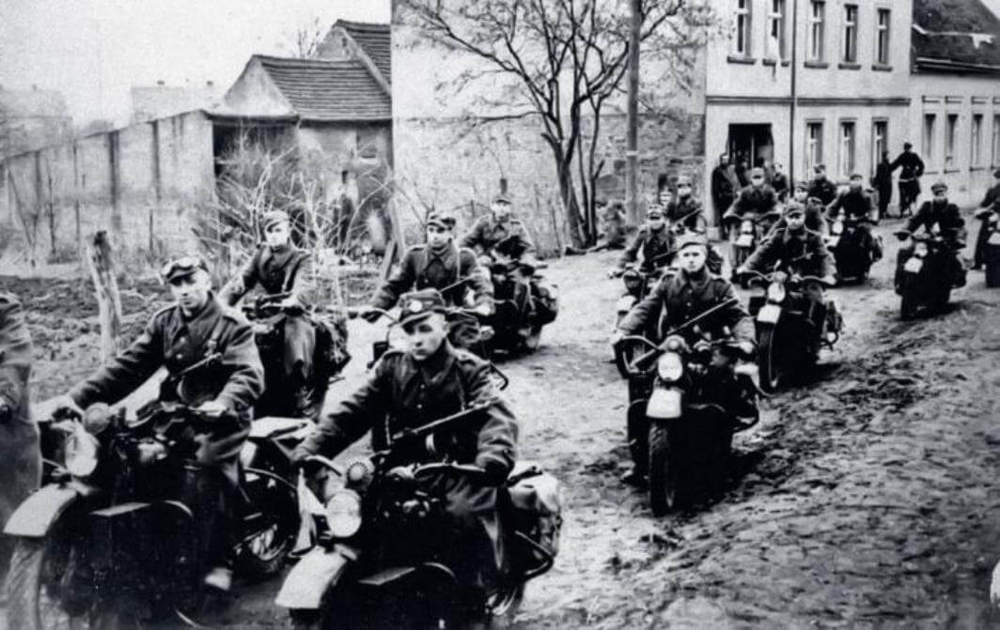

### V1

We wrześniu 1944 z powodu postępów alianckich we Francji na krótko zatrzymano wystrzeliwanie bomb latających V1. Wkrótce loty zostały wznowione, choć Anglia stawała się coraz trudniejszym celem.

Dziś ostatnia bomba latająca wylądowała w Anglii na terenie Datchworth (wieś w Hertfordshire), jest to 40 km na północ od centrum Londynu. Ponieważ ostatnia hitlerowska V2 wystartowała dwa dni temu, oznacza to, że Wielka Brytania była już wolna od zagrożenia niemieckimi pociskami.

Ogółem Niemcy wystrzelili 10,5 tys. V1 orientując je na Tower Bridge. 4,2 tys. zostały zniszczone ogniem plot, myśliwcami i balonami, 2,4 tys. spadło na Londyn zabijając 6 tys. ludzi i poważnie raniąc 18 tys.

<SeeAlso txt="Vergeltungswaffe od V1 do V4 / broń zemsty" url="/festung-breslau/article/vergeltungswaffe" />

### Ferenc Csik

W Sopronie podczas bombardowania ginie węgierski pływak Ferenc Csik, dwukrotny złoty medalista z Berlina. Podczas wojny pełnił służbę medyczną. Zginął, ratując innych.

### Prusy Wschodnie

Po zajęciu Królewca 4 Armia wycofała się na zachód południowym brzegiem Zalewu Wiślanego w rejon zamku Balga. Dopiero 29 marca Hitler zezwolił na ewakuację resztek Armii na Mierzeję Wiślaną.

Było już za mało czasu, żeby zorganizować ewakuację ciężkiego sprzętu, udało się przewieźć tylko ludzi. Dzięki mgle ewakuacja przebiegła sprawnie, ostatnia barka odbiła o godz. 1830.

### Gdańsk

Leszek Adamczewski "Prusy w ogniu" (s 322):
>W tych dniach korespondent polskiej Agencji Prasowej Stanisław Strąbski piał w swojej relacji, że natychmiast po ustaniu strzałów pojawili się przebywający w piwnicach i schronach mieszkańcy Gdańska: "Przygniatająca większość to starcy, kobiety i trochę dzieci. We framudze drzwi na wyściełanym fotelu siedzi staruszka. Głowa jej bezwładnie na piersi opadła. Tak zmarła w tej wnęce, ocalałej części domu. Nie ona jedna. Pod sklepioną częścią ruin czy też wprost na kwietniowym kapuśniaku leżą umierający na siennikach i materacach. Nikt na nich uwagi nie zwraca. Żyjący włóczą się obok z twarzami zastygłymi od trwogi, z oczami, które widzą tylko bezmiar własnego nieszczęścia i poniżenia"

### Olsztyn

W Olsztynie powstaje Muzeum Warmii i Mazur.

### 2 Armia WP

Za Majewskim i Sozańską, jak wspomina generał Józef Sankowski:
>29 marca wszystkie jednostki 2 Armii osiągnęły nakazany rejon ześrodkowania w okolicy Trzebnicy. Weszliśmy w skład 1 Frontu Ukraińskiego. Przerzucając się od Żukowa z Pomorza do Koniewa pod Wrocławiem zrobiliśmy w ciągu 10 dni, tj. od 19 do 29 marca – 300km. Przez cały czas maszerowaliśmy tylko w nocy. Jak długo będziemy stać w tym rejonie nie wiedzieliśmy.

- 8 DP: Łosice, Budziwojowice, Michałowice, Osolin, Dobra, Dobrzeń, Dobroszyce, Strzelce, Krakowiany. Sztab ulokował się w Kałowie.
- 9 DP: Kowale, Mieniaa, Ligota, Piękna, Pierwoszów, Skarszyn, Boleścin, sztab ulokował się w Machnicach.
- 7 DP: Koczurki, Jaźwiny, Masłowiec, Czeszów, Złotów, Skoroszów, sztab w Kuźniczysku.
- 5 DP: Bukowiec, Kręsko, Jodłowiec, Uraz, Lubnów, Ciechłowiec, Wielką Lipę, sztab w Rościsławicach.
- 10 DP: Raki, Marzęcino, Krościnę Wielką i Małą, Dobrosławice, Kaszyce Milickie, Przedkowice, Ligotę, sztab w Sanicach.
- 4 brygada inżynieryjsko-saperska Siedlec.

Ryszard Skała, podporucznik w 1 Korpusie Pancernym i późniejszy wrocławski dziennikarz wspomina te dni:
>Żołnierze chodzili poważni, z niepokojem patrzyli w kierunku zadymionego Wrocławia. Bitwa w mieście... każda kamienica fortecą... walka o poszczególne piętra... zaminowane domy. Z własnego doświadczenia, z przeżytych trudów wiedzieliśmy, jak ciężkie czekają nas dni. Komu przyjdzie zostać we Wrocławiu? Na czyjej drodze jak próg nie do przebycia, stanie roztrzaskane miasto. Życie ma swoje prawa. Minęło kilka dni. Wojsko łaziło na bosaka, dmuchało na spęcherzone nogi, rozchodziło się po okolicznych wioskach i wracało ze zdobyczami. W namiotach i szałasach pojawiły się pierzyny jako żywo nie należące do bojowego ekwipunku, po krzakach szkliły się porozbijane słoiki po konfiturach, łagodniały wyostrzone niedawnym zmęczeniem rysy twarzy. Długie godziny ślęczałem nad znalezionym w jednym z mieszkań planem Wrocławia. Uczyłem się miasta na pamięć. Wbijałem sobie w głowę nazwy ulic i dzielnic, miejsca skrzyżowań i położenie mostów. Może to wszystko jakoś mi się przyda, może w gorączce bitwy trzeba będzie podjąć decyzję: w prawo czy w lewo?

*Motocykliści 2 Armii WP na motocyklach Harley-Davidson, operacja łużycka. 
By nieznany - Muzeum Miejskie we Wrocławiu, Domena publiczna, [Link](https://commons.wikimedia.org/w/index.php?curid=52071503)*

Jak przyszłość wkrótce okaże, najgorszym wrogiem żołnierza nie zawsze jest nieprzyjaciel, bardzo często, zdecydowanie zbyt często jest to niekompetentne dowództwo. W tym wypadku katem 2 Armii okazał się nie garnizon wrocławski, a bitwa o to wielkie miasto nie była wcale najgorszym losem, który mógł ją spotkać. Najgorsze co ich mogło spotkać, już się wydarzyło - był to ich własny dowódca, charyzmatyczny, osławiony jeszcze z walk w Hiszpanii po stronie Stalina generał Karol "Walter" Świerczewski zmagający się z problemem alkoholowym i niekompetentny. Z powodu odpowiedzialności za masakrę własnej dywizji, z której ocalało zaledwie kilku żołnierzy, odsunięty od dowództwa zdawałoby się na zawsze. Jednak formowanie się kolejnych polskich Armii przywróciło go do czynnej służby. Legendarny dowódca, który się "kulom nie kłaniał", bo gdyby się pokłonił to nie mógłby wstać, taki był pijany - powrócił i dowodził tym razem całą Armią. Ilu z jego żołnierzy wiedziało, że w 1920 walczył po stronie bolszewików, dowodził sowieckim batalionem, i to na własną prośbę na zachodnim froncie, żeby móc walczyć z Polską? Ilu znało jego zaangażowanie w mordowanie akowców? Takie też było oblicze polskości przybywającej na Dolny Śląsk.
