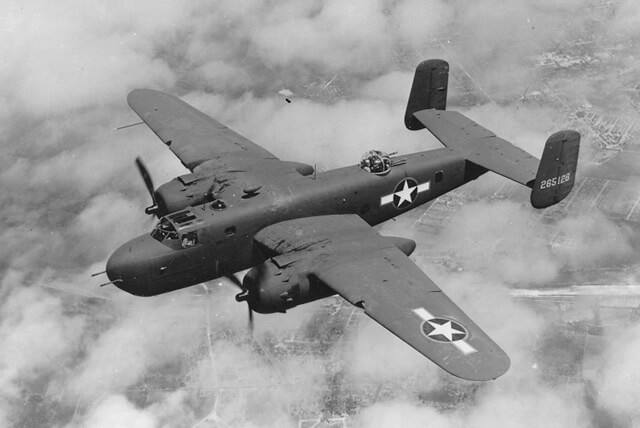

### USS Indianapolis (CA-35)

Amerykański ciężki krążownik typu Portland, biorący udział w inwazji na Okinawę wczesnym rankiem zaatakowany przez pojedynczego kamikaze w samolocie Nakajima Ki-43. Samolot przedarł się przez obronę plot, ale został zestrzelony nad okrętem i rozbił się w wodzie za nim. Niestety, chwilę przed zestrzeleniem pilot zwolnił bombę, która przebiła okręt i eksplodowała w wodzie pod nim. Zginęło 9 marynarzy.

Zniszczenia oceniono na poważne i wymagające naprawy w Mare Island Naval Shipyard (40 km od San Francisco). Ta bomba przesądziła o losie okrętu. Do lipca remont został zakończony. Marynarze mieli nadzieję na spokojny przebieg reszty służby i rychły koniec wojny. W tzw. międzyczasie (spoiler warning) hitlerowskie Niemcy upadły i skapitulowały, bitwa o Okinawę dobiegła końca.

16 lipca opuszcza Hunters Point Naval Shipyard (również San Francisco) w ściśle tajnej misji i łamiąc rekordy prędkości, samotnie, całkowicie bez osłony dociera do Pearl Harbor 19 lipca, po krótkiej przerwie rusza dalej w tym samym stylu do Tinian (Mariany) gdzie dociera 26 lipca i tam oddaje swój cenny, ściśle tajny ładunek.

Misja najwyższej wagi zakończona sukcesem i tragedią. Okręt odesłano na Guam, gdzie nastąpił odpoczynek i wymiana załogi. Potem dalszy ciąg udziału w wojnie: USS Indianapolis został przydzielony do Task Force 95 i płynął na Filipiny.

30 lipca o godz. 0015 w prawą burtę okrętu trafiły dwie torpedy Type 95 japońskiego okrętu podwodnego I-58. Z 1195 członków załogi w wyniku wybuchów i pożarów zginęło 300 ludzi, reszcie udało się uciec. Był to ogromny sukces, biorąc pod uwagę, że wielki okręt tonął zaledwie 12 minut. Z tego powodu nie wszyscy mieli kamizelki ratunkowe i nie było łodzi. Prawie 900 ludzi pływało w morzu, oczekując rychłego ratunku. Jednak znajdowali się na środku bezmiernej otchłani Pacyfiku 1000 km od Filipin i tyleż samo od Marianów. Ich okręt nie wiedzieć czemu, choć już wykonał supertajną misję, nadal miał takie oznaczenie i tak samo nie miał osłony. Nikt o nich nie wiedział! Informacja ta szybko się rozeszła i spowodowała panikę. Tym większą, że zaczęły ich atakować rekiny, był to ich rejon żerowania. Minął cały dzień i cała noc, kolejny dzień i kolejna noc, co jakiś czas było słychać krzyki pożeranych ludzi.

Dopiero po prawie czterech dniach koszmaru, po 82 godzinach od zatopienia, 2 sierpnia o godz. 1025 na niebie pojawił się dwusilnikowy PV-1 Ventura, który jak się później okazało, wcale ich nie szukał, to był zwykły lot patrolowy. Przybyła pomoc. Pierwszy okręt, który rzeczywiście mógł podjąć rozbitków, dopłynął dopiero w nocy. Uratowano tylko 316 ludzi. Ponad pół tysiąca marynarzy zmarło z wycieńczenia, odwodnienia lub zostało pożartych przez rekiny.

Epizod ten został utrwalony w przynajmniej trzech filmach fabularnych:

- najsłynniejszy to "Szczęki" z 1974 w reżyserii Stevena Spielberga, gdzie historia ta jest opowiedziana
- "Mission of the Shark: The Saga of the U.S.S. Indianapolis" z 1991
- "USS Indianapolis: Men of Courage" z 2016

No dobrze: a jaka to była ta ściśle tajna akcja, którą krążownik wykonywał? Co było tym cennym ładunkiem dostarczonym w największej tajemnicy na Tinian?

Był to wzbogacony uran U-235 (połowa takiego materiału na świecie) oraz inne materiały niezbędne do skonstruowania bomby atomowej. Na wyspie złożono z tego bombę uranową Little Boy, która cztery dni po uratowaniu rozbitków, 6 sierpnia 1945 o godz. 0815 została zrzucona na Hiroszimę.

Miasto to celowo pozostawiono niebombardowane, żeby lepiej uwidocznić skutki działania nowej broni.

### Me 262

Pierwszy nietknięty Me 262 w rękach aliantów. Pilot oblatywacz, Hans Fay, natychmiast kiedy się dowiedział, że miasto w którym mieszkają jego rodzice zostało zajęte przez aliantów i dzięki temu nie grożą im represje, zmienił strony i wylądował na lotnisku we Frankfurcie nad Menem. Odrzutowiec wysłano do USA.

<SeeAlso txt="Wunderwaffe" url="/festung-breslau/article/wunderwaffe" />

Z drugiej strony Jagdgeschwader 7 skrzydło Luftwaffe pierwsza jednostka wyposażona w całości w Me 262 osiągnęło tego dnia swój niepobity nigdy potem rekord: zestrzelono 19 4-silnikowych bombowców i dwa myśliwce.

- [31 March 1945](https://www.thisdayinaviation.com/31-march-1945/)
- [An experimental version of the Messerschmitt Me 262, the first jet aircraft, sits on an Allied airfield after its test pilot defected. (March, 1945.)[1800 x 1189]](https://www.reddit.com/r/HistoryPorn/comments/1fep3t/an_experimental_version_of_the_messerschmitt_me/)

### Hans Fischer

Wybitny chemik Hans Fischer popełnił samobójstwo po tym, jak jego laboratorium i instytut w Monachium zostały zniszczone. Cała jego praca uległa unicestwieniu.

Jego najważniejszą zasługa była synteza hemoglobiny i wyjaśnienie budowy chlorofilu. W 1930 dostał za to Nagrodę Nobla.

- NNBD [Hans Fischer](https://www.nndb.com/people/376/000100076/)

### Gdańsk

Leszek Adamczewski "Prusy w ogniu" (s 323):
>To gdańszczanie polskiego pochodzenia twierdzili, że część śródmieścia, która z bombardowań i walk ulicznych wyszła cało, została podpalona przez Rosjan już po tak zwanym wyzwoleniu. W ten sposób Gdańsk podzielił los Olsztyna i innych miast wschodniopruskich. Magdalena Meller wspominała również: "koszmar i makabra trwały przez kilka tygodni. Czego nie ukradli, to zniszczyli. Nie zapomnę grup Rosjan na Kartuskiej. Już po wyzwoleniu szli od domu do domu i wrzucali w nie wiązki granatów". 
>Od eksplodujących granatów wybuchały pożary. Gdańsk palił się długo, ponoć do pierwszych dni maja. Do jesieni natomiast dopalały się magazyny na Wyspie Spichlerzy.

Bardzo długo, przez cały okres PRL działania czerwonoarmistów, niszczenie zdobytych miast, masowy rabunek osobisty i instytucjonalny, a przede wszystkim zbrodnie dokonywane na Niemcach, a także Polakach były tematem tabu. Do tego stopnia, że polskie wydanie "Blaszanego bębenka" Güntera Grassa wzbudziło pewne kontrowersje, po raz pierwszy bowiem polscy czytelnicy mieli do czynienia z opisem gwałtów, rabunku i zniszczeń dokonywanych przez czerwonoarmistów. Nawet zapytano autora, czemu umieścił opisy tych zachowań w swojej książce (już samo postawienie takiego pytania świadczy o pytającym) odparł krótko:
>Bo miały miejsce.

### Sudety

Sowiecki Bell P-39 Airacobra zestrzelony k Harrachova. [KATASTROFA W KARKONOSZACH - O LOTNIKU , KTÓRY NIE INTERESOWAŁ SWOICH](https://www.facebook.com/bobr1945/posts/3044269262353383)

### 1 Front Ukraiński

Na froncie dolnośląskim Armia Czerwona odnosi w tych dniach dwa poważne zwycięstwa.

Pełnym sukcesem kończy się operacja opolska, rozbito siły zgrupowane w rejonie Raciborza, co uwolniło prawy brzeg Odry od zagrożenia i rozpoczęło systematyczną likwidację sił niemieckich na lewym brzegu. 31 marca zdobyta została ostatnia pozycja nieprzyjaciela na tym obszarze - Racibórz, a wszystkie oddziały niemieckie poddały się do niewoli.

Poddaje się Głogów, dziś w nocy komendant z 800 żołnierzami ucieka z miasta, jutro o 4 rano kapituluje garnizon.

### Wincenty Witos

Sowieci aresztowali Wincentego Witosa, usiłowali nakłonić go do współpracy z Krajową Radą Narodową. Po 5 dniach został wypuszczony.

### Wrocław

Kiedy dokładnie zaczęła się "ofensywa wielkanocna"? Wszędzie możemy przeczytać, że 1 kwietnia. Ale wiele wskazuje, że na niektórych odcinkach frontu atak zaczął się już 31 marca przed południem i po przygotowaniu artyleryjskim. Nawet dla cywilów było jasne, że na dniach zacznie się kolejna ofensywa i z nią to, czego się najbardziej obawiali - wzmożona operacja lotnictwa nieprzyjacielskiego. Armia Czerwona nie była we wrocławskim wydaniu ninją skrytego podejścia do ataku. Zajmującą pozycje armię było z daleka słychać, słyszalne też było ich radio, nawet bez znajomości języka, nasilenie komunikatów na kierunku zachodnim wskazywało, skąd ma nadejść kolejny atak.

Również samo bombardowanie zaczęło się nie 1 kwietnia, a dzień wcześniej w Wielką Sobotę 31 marca 1945, i to nie w nocy a ok. godz. 18.00.

- [Członek Grupy Bojowej "Hitlerjugend" Max Baselt tak wspomina dzień rozpoczęcia drugiego szturmu na miasto, który przeszedł do historii, jako "Szturm Wielkanocny":](https://www.facebook.com/EchazFestungBreslau/posts/3882790711781610)
- [Weryfikacja daty szturmu zachodniego. ](https://www.facebook.com/EchazFestungBreslau/posts/3663860320341318)

Hartung, choć jest człowiekiem świeckim, oczywiście odnotowuje fakt, że jest to Wielka Sobota:
>Już od jakiegoś czasu krążą plotki, że Rosjanie upatrzyli sobie Breslau na prezent wielkanocny dla swojego dowództwa. W ostatnich dniach zgotowali nam bardzo ostry ostrzał artyleryjski, a do tego z dwusilnikowych samolotów zrzucali bomby, o jakiego kalibrze dotychczas nigdy nie używali. Nie cichnie pogłoska, że są to bomby niemieckie z górnośląskich lotnisk, które zostały przejęte, jeszcze przed zdetonowaniem tamtejszych składów z amunicją. 
>Często bomby lecą z maszyn niemieckiej konstrukcji i z niemieckimi oznaczeniami. Początkowo nasi ludzie łatwowiernie wybiegali z piwnic i wołali: 
> \- Luftwaffe znowu walczy! 
>Gdy jednak wnet sypały się bomby, czym prędzej biegli z powrotem do schronu. Teraz pojawienie się samolotów na błękitnym niebie jest równoznaczne z sygnałem ostrzegawczym.

Wiadomo, że sowieci powszechnie używali samolotów amerykańskich z lend-lease'u. Na używanie samolotów niemieckich w ciągu dnia, nawet bez usuwania oznaczeń mogli sobie pozwolić, wszak mieli panowanie w powietrzu. Wymagałoby to pewnej koordynacji z własną plot. Ale nic mi nie wiadomo o takich przypadkach. Biorąc pod uwagę to, że własnych samolotów im nie brakowało, a używanie zdobycznych bombowców jest dość ryzykowne i wymaga czasochłonnego przeszkolenia, nie ma to sensu.

<BoxImageWrapper>

North American B-25 Mitchell, takie samoloty z land-lease'u były na wyposażeniu 2 Armii Lotniczej. 
Public Domain [Link](https://commons.wikimedia.org/w/index.php?curid=362271)
</BoxImageWrapper>

### Ofensywa

Peikert informuje nas o chaosie wewnątrz Twierdzy:
>A oto w Wielkim Tygodniu całkiem niespodziewanie przyszedł rozkaz, że mieszkańcy co do jednego muszą opuścić Przedmieście Oławskie. Ja byłem zdecydowany wytrwać do ostatka przy moim kościele parafialnym. Ewakuacji ulic trzeba było dokonać w popłochu, tj. w ciągu dwóch, trzech godzin. Ewakuowani mogli wziąć z sobą tylko najniezbędniejsze przedmioty. Ta przymusowa ewakuacja stanowiła preludium do wielkiej klęski ogniowej w Poniedziałek Wielkanocny, której przyczyną wedle powszechnej opinii nie był nieprzyjaciel, lecz nasze własne samoloty. [...] 
>Jak bezsensownie przebiegała ewakuacja poszczególnych dzielnic, widać najlepiej z tego, że Sępolno ewakuowano na południe. Zaledwie ludzie znaleźli się na południu, musieli z powodu wkraczających tam Rosjan uciekać z powrotem na północ na prawą stronę Odry; ale nie wolno im było wracać do swych pustych domów na Sępolnie. Teraz ewakuowano na Sępolno Przedmieście Oławskie. W tygodniu po Wielkanocy ewakuowano Przedmieście Mikołajskie na Przedmieście Oławskie. W ten sposób wyładowała się bezmyślność i tyrania partii na biednym i udręczonym narodzie. Gauleiter Hanke, ów monstrualny dewastator Wrocławia i naszego śląskiego regionu, celował wprost w zastraszaniu i gnębieniu ludności. Ten nigdy nie dostrzegał ludu, lecz tylko wysokie sfery partyjne, lud zaś był dla niego tylko obiektem tyrańskich kaprysów. W zarządzeniach nie wyczuwało się już żadnego głębszego sensu ani troski czy niepokoju o dobro narodu, lecz jeszcze tylko troskę o to, jak ujść swemu przeznaczeniu. A w mieście było przecież wraz z załogą około 200 000 osób. Kilkakrotna zmiana komendantów twierdzy jest jego sprawką. Za każdym razem, gdy zrozumieli bezsens oporu, usuwano ich i zastępowano innymi. Ostatni komendant twierdzy, Niehoff, generał SS, odpowiadał w zupełności jego życzeniom i woli i w ogóle nie liczył się z ludnością. 
>Na okres Świąt Wielkanocnych Rosjanie zapowiedzieli przez swe głośniki ciężkie naloty. Podobno 750 ciężkich bombowców czekało w pogotowiu na lotniskach pod Oleśnicą i Oławą, aby w dniach świątecznych atakować naszą twierdzę w nieprzerwanej akcji. Toteż w Wielką Niedzielę rano zapanowało w całym mieście niesamowite podniecenie.

Niehoff nie był generałem SS, w ogóle do SS nie należał. Ostatni akapit jest ponurą zapowiedzią następnego dnia.

Że coś się szykuje, to było wiadome, ksiądz Laßmann pisze:
>Potem nastała niesamowita cisza. Była to cisza przed burzą. Nasze służby nasłuchowe już przed paru dniami podały orientacyjny przebieg frontu, z którego wynikało, że rosyjska 6 Armia przegrupowuje się na zachód. Generał Głuzdowski wyprowadzający dotąd swoje nieustanne ataki z południa, przesunął nagle ich punkt ciężkości. Z miejsca zmieniliśmy taktyką obronną. Ostatnie rezerwy cywilne jakie jeszcze można było zmobilizować, przerzucone zostały na zachód i oddane do dyspozycji walczącego tam Mohra. Dosłownie w ostatniej stosownej po temu chwili. Napięcie rosło nieznośnie.

Relacja księdza Waltera Laßmanna z koszmarnych dni bitwy wielkanocnej (Wielka Sobota 31 marca):
>Piekło to rozpoczęło się wieczorem punktualnie o godzinie 18.00. Wróg uderzył z całą mocą swojej okrutnej machiny wojennej. Miasto przykrył zmasowany ogień z wszelkiej broni, jakiego tu dotąd jeszcze nie doświadczyliśmy. Marszałek Koniew i generał Głuzdowski dotrzymali groźnego słowa, że dostarczą Wrocław jako "pieczyste na Wielkanoc". Przez najbliższe 48 godzin nie mieliśmy wychodzić z ubrań. I każdy z nas kto przeżył tę Wielkanoc, nie zapomni jej do końca swoich dni. Podczas gdy rosyjska artyleria brała na cel jeden dom za drugim (pociski kalibru 28 cm rozdrabniały zabudowania wprost na miał), eskadry bombowców przykrywały krwawiące już z tysiąca ran miasto dywanami z bomb. Ludzie odetchnęli na chwilę, kiedy na niebie pojawiła się nagle formacja niemieckich maszyn. W blasku pożarów bardzo dobrze można było rozpoznać krzyże na ich skrzydłach. Ale ku naszemu strasznemu rozczarowaniu i one zaczęły zrzucać na nas bomby! Były to bowiem niemieckie samoloty, które zdobyte przez Rosjan zostały teraz użyte przeciwko nam. Wpadły im w ręce razem z kilkoma składami pociągów, przewożących niemieckie bomby lotnicze. Kłęby żółtawego gęstego dymu pełzały dusząco po ulicach. Noc śmierci rozpostarła swój płaszcz na życiu Wrocławia i wydawało się, że nigdy się nie skończy. A kiedy w końcu powinien pojawić się brzask Wielkiej Niedzieli, nadal panowały ciemności. Nieprzenikniony dym dusił miasto. Oczywiście, ludność Zagłębia Ruhry i wielkich miast, jak Hamburg, Lubeka, Berlin, Drezno i jeszcze wielu innych doświadczała często - bywało, że noc w noc - ciężkich bombardowań, pustoszących w orkanie ognia całe dzielnice. Wrocławian jednak, po piekle zgotowanym im przez bombowce, "organy Stalina", granatniki i ciężką artylerię, czekało jeszcze natarcie czerwonoarmistów, który twych wielkanocnych dniach parli niepowstrzymanie naprzód. Atakowali całymi falami, a szeregi obrońców topniały z godziny na godzinę. Były takie niemieckie kompanie, które składały się już tylko z 25 żołnierzy. Batalion obrony twierdzy "Mohr" stracił 70% swojego składu osobowego. W okolicach Parku Zachodniego i przed Zakładem dla Głuchoniemych doszło do gwałtownych walk wręcz. Szczególnie aktywni byli w tym rejonie radzieccy snajperzy. Przy Porcie Zachodnim silna formacja czerwonoarmistów zepchnęła kilka tuzinów naszych ludzi do basenu portowego. Komuś, kto mógł spoglądać na Wrocław z Niedzielę Wielkanocną ze szczytu Ślęży lub z masywu Sudetów, miasto musiało się wydawać bezpowrotnie stracone, z daleka bowiem widać było w tym miejscu tylko olbrzymią pochodnię z wiszącym nad nią słupem dymu. Walczyliśmy jednak dalej.

### 2 Armia WP

Tymczasem po drugiej stronie frontu:
>Na lewo wśród zieleni ogrodów, rozmazanych rdzawymi plamami rozkwitłych bzów, pstrokaciły się zabudowania Psiego Pola. Na wprost sterczały potargane przęsła zerwanych mostów na Widawie, a za nimi, za bagnistą łąką z kaczeńcami, rozpościerał się Wrocław. Rozpościerał się w naszej wyobraźni panoramą strzępiastą wieżami kościołów, zwartą bielą gmachów przetkaną cętkami skwerów, z pajęczyną ulic i szerokim połyskiem Odry. W rzeczywistości widzieliśmy gigantyczną chmurę kurzu i dymu, która okrywała całe miasto, kotłowała i rozlewała się na boki, mrocząc południowe słońce. Widzieliśmy olbrzymie jęzory płomieni gęsto przebijające pogorzelę i krótkie błyski eksplozji, gaszone pyłem z tego, co było domem, szkołą, świątynią. Lecz nigdzie w zasięgu naszego wzroku, choć sześciokrotnie wzmocnionego szkłami lornetek, nie było wyniosłych gotyckich wież, nie było białych gmachów ani zielonych skwerów, ani otwartych ulic, ani zarysu Odry. Był obłędny w swej wielkości i wymowie, trudny do określenia słowami obraz bronionego i szturmowanego miasta-twierdzy… Sympatyczny lejtnant przypadkowo spotkany na linii umocnień radzieckich zaproponował nam swoje towarzystwo w roli przewodnika. Wiedział już, że oddziały walczące w rejonie Psiego Pola i Brochowa mają być zluzowane przez jednostki polskie, traktował nas więc jak przyjaciół i gospodarzy tego odcinka. Informował o rodzajach broni i metodach walki Niemców, objaśniał system własnych pozycji, pokazywał działobitnie, transzeje i punkty orientacyjne.
