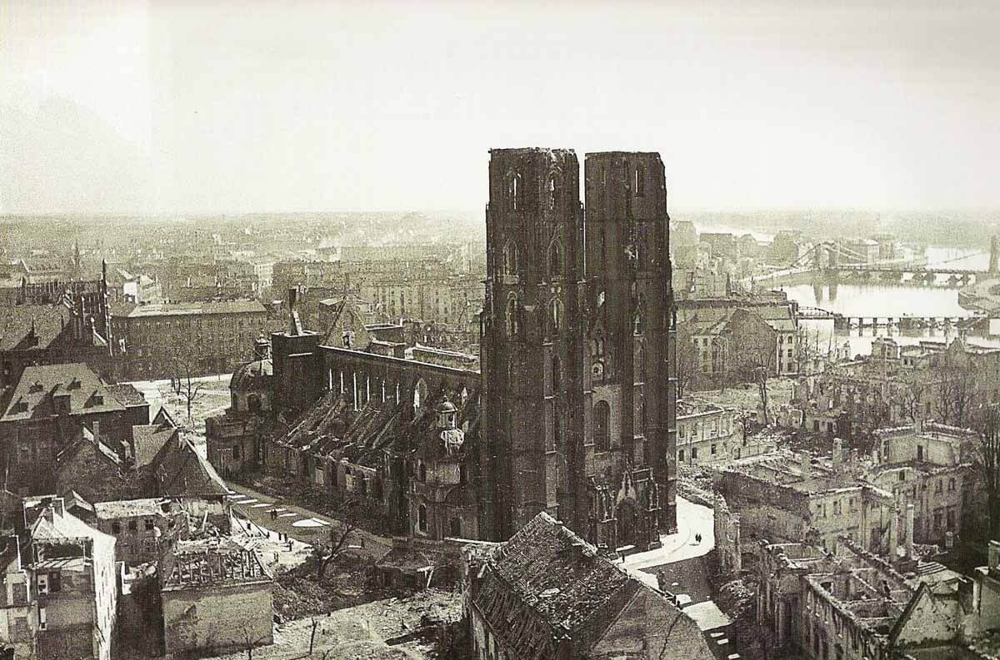

### Okinawa

Amerykanie wysadzają desant na Okinawie, ojczyźnie karate.

Wojna na Pacyfiku rozpoczęta 7 grudnia 1941 atakiem na Pearl Harbor, cztery lata później zmierzała do dramatycznego końca. Punktem przełomowym tej wojny była bitwa o Midway stoczona 4-7 czerwca 1942, czyli zaledwie pół roku po tym, jak się rozpoczęła. Od tego czasu trwa dominacja amerykańskiej floty lotniskowców i stopniowe skracanie dystansu do Japonii.

Całe tło, przyczyny i przebieg wojny na Pacyfiku, w takim zakresie jaki ma znaczenie dla bitwy na Okinawie jest w osobnym artykule:

<SeeAlso txt="Wojna na Pacyfiku 1945" url="/festung-breslau/article/pacyfik-1945" />

### Zuse

Jednym z mało znanych rozdziałów historii komputerów jest działalność Konrada Zuse. Niestety jego aktywność wypadła na czasy III Rzeszy i nie jest dobrze widziany jako jeden z pionierów informatyki. W 1941 zbudował pierwszą w pełni programowalną maszynę liczącą - Z3. W latach 1942-45 budował kolejną maszynę Z4, która odczytywała i zapisywała dane z taśmy perforowanej.

Wiosną 1945 Z4 już działał i żeby nie wpadł w ręce sowieckie, został przewieziony do Getyngi, gdzie w laboratorium Aerodynamische Versuchsanstalt służył od obliczeń przepływów. Na początku kwietnia maszyna została wywieziona do Bawarii i ukryta. Tam Zuse spotkał Wehrnera von Brauna.

Po wojnie maszyną zajął się szwajcarski Seminar for Applied Mathematics. Obecnie jest w zasobach Deutsches Museum w Monachium.

Konrad Zuse założył Zuse KG, które działało kilkanaście lat i w 1969 zostało przejęte przez Siemensa.

### Kassel

Dramatyczne walki o Kassel (Hesja) w dniach 1-4 kwietnia. Miasto zostało zdobyte przez 80 DP.

Mieścił się tam sztab IX Okręgu Wojskowego, ale niewątpliwie najważniejszym obiektem była fabryka Henschel. Był to jeden z głównych producentów czołgów. To oni produkowali Panzer I i Panzer III, czyli czołgi przeznaczone do walki z innymi czołgami (dawniej mówiono kawaleryjskie), ale najważniejszym ich produktem był Tygrys, zarówno I (jedyny producent) jak i II (wspólnie z Porsche). W Polsce przyjęło się mówić o Tygrysie Królewskim, bo jest to dosłowne tłumaczenie nazwy, ale po nieniecku jest to [tygrys bengalski](https://de.wikipedia.org/wiki/K%C3%B6nigstiger).

- [Mark Felton Productions "The Octopus King Tigers - Battle of Kassel 1945" [9:04]](https://www.youtube.com/watch?v=dxPiL0rQxZU)

### Polenlager Haltern

W kwietniu 1945 z rozkazu aliantów 3,5 tys mieszkańców Haltern am See (Nadrenia Północna - Westfalia) musiało opuścić swoje domy. Spora część miasta, wszystko pomiędzy Weseler a Holtwicker Strasse, 400 domów z 850 mieszkaniami. Musiały zostać opróżnione, aby utworzyć obóz dla tzw. dipisów (eng. displaced persons; DP). Jest to ogólny termin oznaczający ludzi wysiedlonych przez wojnę, przede wszystkim są to więźniowie obozów koncentracyjnych i robotnicy przymusowi, ale także jeńcy wojenni i ludzie wysiedleni z terenów zniszczonych wojną.

Ocenia się, że podczas wojny 11 mln ludzi zostało wywiezionych przymusowo poza granice swojego kraju. Z tego 7 mln przebywało w Niemczech. Dwa lata po wojnie w obozach dla dipisów wciąż przebywało 850 tys. ludzi. W zakres tych liczb nie wchodzi ponad 10 mln Niemców wysiedlonych z terenów powojennej Polski i Czechosłowacji. Opisując wojnę, patrzymy się na ruch armii, ale za tym idzie bardziej masowy i równie niszczący ruch cywilów. W 1944 cały niemiecki przemysł opierał się na pracy niewolników - 40% miejsc pracy zajętych było przez różne kategorie robotników przymusowych. III Rzesza istniała tylko dzięki eksploatacji ponad 6 mln niewolników.

Za zwycięską armią aliantów powstawała trudna do organizacji sytuacja przejściowa. Władze sprawowało wojsko. Zdarzało się, że ludzie, którzy doświadczyli niebywałych okrucieństw, kiedy nagle odzyskali wolność, dokonywali grabieży lub po prostu mścili się na Niemcach. Większość zachowywała się karnie, oczekując poprawy sytuacji, ale ze względu na samą ich liczbę utrzymanie porządku nie było łatwe. Tym bardziej że w zniszczonym bombardowaniami kraju również Niemcy potrzebowali pomocy. Zajmowała się tym powstała w 1943 UNRRA (ang. United Nations Relief and Rehabilitation Administration).

Brytyjski minister ds. Niemiec John Hynd, w izbie niższej 20 grudnia 1945:
>DP mają absolutny priorytet nad niemiecką ludnością w zakresie zaopatrzenia w żywność*”

Niemcy zazdrościli dipisom takiego statusu i dlatego łatwo było o wzajemną wrogość.

Mieszkańcy Haltern z dnia na dzień musieli opuścić swoje domy. Choć utworzony tam obóz był przeznaczony dla 3 tys. ludzi, bardzo szybko pojawiło się ich tam dużo więcej, ponad 5 tys. Jeszcze w czerwcu 1946 mieszkało tam 5590 osób. Obóz istniał do 1948. Większość z jego mieszkańców to byli Polacy. Ich repatriacja przeciągała się, bo dla sowietów priorytet mieli ich obywatele.

Warunki higieniczne były fatalne, początkowo było tylko 15 pryszniców. Opieka zdrowotna bardzo słaba, wiele dzieci zmarło głównie z powodu stanu zdrowia wycieńczonych niewolniczą pracą kobiet. W 2010 Haltern odwiedził polski wicekonsul Tomasz Badowski, archiwista miejski Gregor Husmann powiedział mu, że w latach 1945-48 było tam 716 chrztów. Kobiety mające dzieci z Niemcami nie miały szans na repatriację, dokonywano aborcji, a czasem porzucano dzieci. Rozwijało się normalne życie, organizowano szkoły, szpitale, warsztaty. W cieniu tego istniał czarny rynek, przestępczość i przemoc.

- ["Polenlager in Haltern: „Das Geheimnis der Versöhnung heißt Erinnerung“."](https://www.lokalkompass.de/haltern/c-kultur/polenlager-in-haltern-das-geheimnis-der-versoehnung-heisst-erinnerung_a155206)
- [""POLENLAGER" Historikerin beleuchtete ein dunkles Kapitel Ortsgeschichte"](https://www.24vest.de/haltern/polenlager-historikerin-beleuchtete-dunkles-kapitel-ortsgeschichte-12635565.html)

### PLL LOT

PLL LOT reaktywacja, wznowiono loty krajowe na linii okrężnej (jak wrocławska okólna zerówka) Warszawa - Łódź - Kraków - Rzeszów - Lublin - Warszawa. Przedsiębiorstwo było państwowe, ale jednostka była wojskowa: 7 Samodzielna Eskadra Lotnictwa Transportowego posiadająca 9 samolotów Lisunow Li-2 (licencyjne, sowieckie Douglas DC-3).

Po otrzymaniu kolejnych 9 samolotów DC-3 i 10 Li-2 od 11 maja loty zagraniczne Warszawa - Berlin, a od lipca Warszawa - Paryż i Warszawa - Sztokholm.

### August Hlond

Przebywający we Francji kardynał Hlond został aresztowany przez policję niemiecką 3 lutego 1944 i internowany w klasztorze Bar-le-Duc, potem wywieziono go do Wiedenbrück (Westfalia). Tam 1 kwietnia 1945 został uwolniony przez żołnierzy amerykańskich. Kilka dni później drogą lotniczą udał sie do Rzymu, gdzie pozostał do połowy lipca. W lipcu 1945 powrócił do swojej siedziby w Poznaniu.

Pobyt Hlonda w Rzymie od kwietnia do lipca 1945 miał kluczowe znaczenie dla przyszłości archidiecezji wrocławskiej.

W Rzymie otrzymał datowane na 8 lipca 1945 nadzwyczajne pełnomocnictwa dotyczące reorganizacji życia kościelnego w Polsce. Miał prawo by wedle własnego uznania wyznaczać administratorów apostolskich na wakansowe stanowiska biskupie - oczywiście tylko jeśli nie mógł telegraficznie skonsultować się z Watykanem.

Tak szybko jak to było możliwe, powołując się na pełnomocnictwa i ustne życzenia papieża zmusił przedstawicieli niemieckiej hierarchii kościelnej na Ziemiach Zachodnich do rezygnacji i ustanowił polskich administratorów.

To czy rzeczywiście w każdym przypadku nie miał łączności telegraficznej z Watykanem i czy rzeczywiście realizował wolę papieża pozostanie tajemnicą kardynała. Umarł w 1948.

### Stalowa Wola

Stalowa Wola uzyskała prawa miejskie. Część COP zdobyta 2 sierpnia 1944.

### Sudety

Pierwsza połowa kwietnia - Schwere Panzerjäger Abteilung 88 wyposażony w niszczyciele czołgów Nashorn w Gryfowie Śląskim i Lubomierzu. [„Nosorożce” na Pogórzu Izerskim (Gryfów Śląski i Lubomierz) – kwiecień 1945 r.](https://www.facebook.com/groups/653226441445598/permalink/2813956195372601/)

### Głogów

Obrona i los Głogowa są analogiczne do Wrocławia. Najpierw, kiedy było już wiadomo, że Armia Czerwona dotrze do miasta, 21 stycznia ogłoszono Głogów miastem zamkniętym. Bez specjalnej przepustki nikt nie mógł opuścić miasta. W tym czasie Wrocław opuściło kilkaset tysięcy ludzi. Decyzja o ewakuacji na mieszkańców Głogowa spadła z opóźnieniem dopiero 25 stycznia. Ponieważ jest to miasto o wiele mniejsze, udało się ewakuować prawie wszystkich mieszkańców 30 tys. ludzi, i to w dużej części pociągami.

23 stycznia komendantem twierdzy został arystokrata z Prus Wschodnich i fanatyczny nazista Jonas Casimir Graf zu Eulenburg. Jego pierwszą decyzją było powołanie trybunału wojennego (niem. Sondergericht Glogau) karzącego śmiercią wszelkie przejawy defetyzmu i braku woli walki.

27 stycznia po dwóch tygodniach ucieczki przez tereny zajęte przez wroga do Głogowa dotarł "wędrujący kocioł" generała Nehringa. Był wśród nich znany z neutralizacji tabunu w fabryce Anorgana w Brzegu Dolnym generał Max von Sachsenheimer dowódca 17 DP. Jako wyższy stopniem przejął obowiązki komendanta do 4 lutego, kiedy to na czele swojego dywizji opuścił Głogów. [FESTUNGSKOMMANDANT MAX SACHSENHEIMER](https://www.facebook.com/festungglogau1944.1945/posts/festungskommandant-max-sachsenheimermax-sachsenheimer-1909-1973-pod-koniec-ostat/1079791078880434/)

Generał Heinrich Nickel również na czele dowodzonej przez siebie dywizji 4 lutego opuścił Głogów. Dzień przedtem wystosował do żołnierzy pozostających w twierdzy odezwę:
>Zdobycze terytorialne wroga, jakkolwiek nie byłyby dla nas bolesne, znaczą niewiele. My też staliśmy już pod Moskwą. Rozstrzygająca będzie ostatnia bitwa, zwyciężać będzie silniejszy wewnętrznie. [...] Prowadzi nas Adolf Hitler. Za nim stoi 90 milionów pełnych wiary i zdeterminowanych Niemców; w jego ręku ten naród jest niezwyciężony.

12 lutego miasto zostało zamknięte w pierścieniu oblężenia przez 3 Armię Gwardii generała Wasilija Gordowa. Nieprzypadkowo wszystkie uciekające ze wschodu oddziały niemieckie kierują się na Głogów. To stara twierdza, której tradycje wojskowe sięgają jeszcze czasów austriackich i ważny ośrodek wojskowy. Teraz rozkazem Hitlera została zamieniona w jedną z twierdz nadodrzańskich, które mają bronić linii Odry.

Komendant Jonas Casimir Graf zu Eulenburg 20 lutego melduje, że ma do dyspozycji 9348 żołnierzy, z tego półtora tysiąca pełnowartościowych, dwa tysiące niewyszkolonego Volkssturmu, a reszta to wojsko drugoliniowe i ranni nadający się do walki.

Całą resztę lutego i marca trwają walki o miasto polegające głównie na morderczym bombardowaniu i niszczeniu miasta. Tak samo, jak we Wrocławiu życie schodzi do piwnicy.

W końcu marszałek Żukow, który potrzebuje Głogowa jako węzła komunikacyjnego do planowanej ofensywy berlińskiej, traci cierpliwość i rozkazuje Gordowowi zdobyć miasto natychmiast. Na wyczerpany siedmioma tygodniami walk Głogów spada piekielny ogień. W ciągu tych ostatnich trzech dniach walki zdobyto resztę miasta i komendant poddaje garnizon. W nocy z 31 marca na 1 kwietnia na czele 800 żołnierzy ucieka z miasta. Grupa ta ze zmiennym szczęściem tocząc walki, w końcu 8 kwietnia zostaje rozbita pod Bolesławcem. Giną tam pułkownik zu Eulenburg, jego brat Carl Elmar i kreisleiter głogowski Karl Brückner.

1 kwietnia po 49 dniach zaciekłych i dramatycznych walk trwających od 12 lutego i zniszczeniu 95% miasta Armia Czerwona zdobyła Głogów, jak wspomina Kurt Büttner:
>1 kwietnia 1945 r., w porannych godzinach pierwszego świątecznego dnia, w rosyjskim punkcie dowodzenia na Rauschwitzerstrasse (ul. Obrońców Pokoju), nastąpiła kapitulacja twierdzy. Rosyjski generał promieniał ze szczęścia i częstował parlamentariuszy wódką.

Natychmiast rozpętało się piekło plądrowania i dalszego niszczenia miasta (za: [Festung Glogau 1944-1945. Kalendarium wydarzeń](https://www.facebook.com/256511657875051/photos/a.256522027874014.1073741828.256511657875051/367430603449822/))
>W wielu miejscach wybuchają pożary, będące skutkiem świadomych podpaleń. Rozpoczyna się gehenna ludności cywilnej. Przez miasto przetacza się kilkudniowa fala morderstw, rabunków i straszliwych gwałtów dokonywanych, bez względu na wiek schwytanych ofiar, przez upojonych zwycięstwem oraz alkoholem czerwonoarmistów. W piwnicach winiarni "Bauch’schen Weinkeller" (ul. Rzeźnicza), żołnierze radzieccy znajdują ogromne ilości wina i koniaków, które, mimo wyraźnego rozkazu komendanta Eulenburga, nie zostały zniszczone. Oblężenie przetrwało ok. 600 cywilnych mieszkańców Głogowa, jednakże wielu z nich zginie w ciągu najbliższych kilku dni.

Jest to ponura zapowiedź losu Wrocławia. Latem ruiny Głogowa zostały przekazane Polakom.

### Gądów Mały

Uważni czytelnicy kroniki wojennej zapewne pamiętają wpis, w którym opisane jest jak 359 Dywizja Piechoty zdobyła Żerniki, i była na pozycji do ataku dalej na wschód na Kuźniki ([18 lutego, niedziela. "Ciepły żar niesiony wiatrem przyjemnie ogrzewa nas w tę zimną noc"](/festung-breslau/blog/02-18/)), zostali jednak cofnięci i włączeni do generalnego ataku od południa. Atak ten jak już wiemy po kilku tygodniach zażartych i krwawych walki zakończył się niepowodzeniem. W tej sytuacji nastąpiła zmiana planów i przegrupowano siły do ponownej próby ataku tym razem od zachodu.

Przegrupowanie to i przygotowania do ataku nie umknęły uwadze obrońców, najlepsze siły przeznaczono do obrony najważniejszej pozycji w tym rejonie miasta - lotniska na Gądowie Małym (niem. Klein Gandau) były to dwa bataliony spadochroniarzy oraz działa 20 i 88 mm (8,8 cm Flak). Zaminowano nasypy kolejowe oraz fortyfikowano pozycje na Kuźnikach i Nowym Dworze. Obecnie Nowy Dwór i Gądów Mały znamy jako blokowiska w zachodniej części Wrocławia, wówczas były to wiejskie osiedla przyłączone do miasta całkiem niedawno, bo w 1928. Na Nowym Dworze był jeden duży folwark, natomiast Gądów Mały od czasów zjednoczenia Niemiec był wojskowym placem ćwiczeń (niem. Exercierplatz) w 1910 zamienionym na lotnisko.

Było to drugie lotnisko w historii Niemiec, w końcu lat 30. odsunięte trochę na margines przez nowe, dużo większe lotnisko w Strachowicach (niem. Schöngarten), które miało betonowy pas startowy. Znajdujące się daleko na peryferiach lotnisko w Strachowicach zostało utracone zaraz na początku oblężenia. Jedynym źródłem zaopatrzenia i możliwością wywożenia rannych z miasta w tej sytuacji pozostało małe i nieco już przestarzałe lotnisko na Gądowie Małym, którego nieutwardzony pas startowy nagle stał się zaletą, był bowiem łatwy do naprawy. Ze względu na sowiecką przewagę w powietrzu i silną artylerię przeciwlotniczą używane było tylko w nocy.

Jak wiemy z relacji Hugo Hartunga, już pod koniec marca straty były tak wielkie, że bezpieczniej było pozostać w mieście niż wsiąść do samolotu. Zaopatrująca Wrocław Luftflotte 6 utraciła już większość Ju-52. Most powietrzny od początku zbyt słaby w stosunku do potrzeb załamywał się. Jakkolwiek jednak zła była sytuacja i wielkie straty była to jedyna możliwość zaopatrywania miasta w materiały wojenne. Pod koniec było to już tylko miejsce zrzutów, dużo pewniejsze niż inne utworzone na terenie miasta, np. w Ogrodzie Botanicznym. Gądów Mały był znany pilotom, miał wystarczającą sygnalizację i dużą powierzchnię. Niestety z powodu bliskości frontu znajdował się pod ciągłym ogniem artyleryjskim.

Wczoraj 259 Dywizja Piechoty, która powróciła na swoją dawną pozycję, przypuściła poważny atak i jednego dnia zdobyła Żerniki i Nowy Dwór, dotarli do linii kolejowej. Dziś 1 kwietnia 1945, w Niedzielę Wielkanocną rozpoczął się kolejny tragiczny rozdział wrocławskiej historii - ofensywa wielkanocna.

Oberleutnant Fritz Berger dowódca kompani w pułku Mohr wspomina to tak:
>W ciągu ostatnich dni marca Rosjanie po zdobyciu osiedli Nowy Dwór i Kuźniki opanowali również dominujący nad lotniskiem nasyp linii kolejowej. Mimo ogromnych wysiłków nie udało się ich stamtąd wyrzucić. 
>W tej sytuacji obrona lotniska, która znalazła się pod ostrzałem broni maszynowej, nie miała już żadnego uzasadnienia i mogła przynieść tylko bardzo duże straty. W tej sprawie ppłk Mohr interweniował w dowództwie, proponując wycofać podległe oddziały na wysokości cmentarzy, jednak z niezrozumiałych przyczyn ta propozycja została odrzucona. 1 kwietnia o świcie na obrońców lotniska spadła nieprzyjacielska nawała ogniowa. Strzelała nie tylko ciężka artyleria z zakrytych stanowisk, lecz również średnich kalibrów, które Rosjanie wyciągnęli do strzelania na wprost na nasyp linii kolejowej. Silny ogień, który przygniótł nasze bataliony do ziemi i zdziesiątkował je, uniemożliwił skuteczny opór. Rosyjska piechota z czołgami w ciągu pół godziny opanowała lotnisko i pobliskie osiedle, następnie zaś uderzyła przez kompleks cmentarzy i pola w kierunku Odry. Cały zachodni odcinek twierdzy został zmiażdżony.

Do południa 359 Dywizja Piechoty wzmocniona czołgami zdobyła płytę lotniska, a po chwili odpoczynku, po południu uderzyła w kierunku północnym, zdobywając teren cmentarza komunalnego i żydowskiego na Kozanowie. Wieczorem dotarła do koszar na Kozanowie, skutecznie odcinając wszystkie siły niemieckie na zachód od swoich pozycji i tworząc szeroki front uderzenia na wschodnią stronę w kierunku Popowic. Był to spektakularny sukces, wydawało się, że jeszcze tylko kilka takich dni a twierdza musi się poddać. Rychłe zwycięstwo było tym pewniejsze, że dokładnie w tym samym czasie oddziały 2 Armii LWP rozwijały swoje pozycje na północnym przedpolu Wrocławia, który zaatakowany z dwóch stron jednocześnie musiał paść. Jak wspomina generał Józef Sankowski:
>31 marca ze sztabu 1 Frontu Ukraińskiego przekazano nam zadanie: wyznaczyć dwie dywizje do obrony północnej i północno-zachodniej części przedpola okrążającego Wrocław. W związku z tym przygotowałem dowódcy armii projekt decyzji, który generał Karol Świerczewski zatwierdził. Już z samego rana oficerowie łącznikowi naszych dywizji wyjechali do jednostek radzieckich, które nasze oddziały miały zluzować. Nawiązali tam kontakty. sprecyzowali położenie tych oddziałów oraz zapoznali się z zarysem przedniego skraju obrony nieprzyjaciela. Wszystko było już więc przygotowane.

Dziennik działań bojowych Grupy Armii Środek odnotowuje dziś:
>Na zachodnim odcinku twierdzy Wrocław zmasowane natarcie przeciwnika, wsparte czołgami, doprowadziło do głębokiego włamania. Utracone zostało ostatnie lotnisko twierdzy. Część dzielnie walczących naszych jednostek została odcięta od sił głównych, bądź przyparta do Odry. Dowódca twierdzy ocenia sytuację jako poważną.

### Ofensywa wielkanocna

- ["Dziś mija 77 rocznica największej tragedii, która dotknęła Wrocław. Był to tzw. "nalot wielkanocny", który zrównał z ziemią praktycznie całą zabytkową zabudowę centrum miasta. Nalot ten wywołał trwające przez kilka dni burze ogniowe, które trawiły budynek po budynku. Nalot ten był wsparciem dla szturmującej miasto od zachodu Armii Czerwonej. 1 kwietnia 1945 roku tak wspomina Erich Schönfelder, który służył w I. Szkolno-Zapasowym Batalionie Fortecznym "Breslau", który stacjonował wtedy na Placu Nankiera:" ...](https://www.facebook.com/EchazFestungBreslau/posts/5027359717324698)

To jest to co działo się na froncie wrocławskim. Równie potężne i bardziej podstępne uderzenie spadło na centrum miasta. Najwidoczniej dowódca 6 Armii w wyniku otrzymanych dyrektyw nakazujących mu zdobyć miasto w nieprzekraczalnym terminie dwóch tygodni postanowił użyć wszelkich dostępnych środków. Niemcy wiedzieli z różnych źródeł, że coś się szykuje, jak pisał Hugo Hartung 31 marca:
>Już od jakiegoś czasu krążą plotki, że Rosjanie upatrzyli sobie Wrocław na prezent wielkanocny dla swojego dowództwa. W ostatnich dniach zgotowali nam bardzo ostry ostrzał artyleryjski, a do tego z dwusilnikowych samolotów zrzucali bomby o kalibrze, jakiego dotychczas nie używali.

Natomiast dzisiaj:
>Podczas chwilowej ciszy opuszczamy plac św. Macieja. Ale po kilku minutach rozpętuje się piekło. Biegniemy pochyleni, z głowami wciśniętymi w ramiona, trzymając się tuż przy ścianach domów i co chwilę uskakując do piwnic. W podziemiach szkoły jakaś kobieta krzyczy jak opętana. Na zewnątrz nieziemski huk. Naprzeciwko wali się wielka kamienica. Wnoszą ciężko rannego.

Potwierdza to ksiądz Peikert, jak już pisałem, jego kronika kończy się 30 marca, ale później następuje dość ogólny opis całego okresu od stycznia do czerwca 1945, z tej części dokładniej opisane są tylko dwa dni: 1 i 2 kwietnia. Pierwszego kwietnia opisuje desperację wiernych świadomych nadchodzącego uderzenia i nieuniknionej klęski twierdzy:
>Na okres Świąt Wielkanocnych Rosjanie zapowiedzieli przez swe głośniki ciężkie naloty. Podobno 750 ciężkich bombowców czekało w pogotowiu na lotniskach pod Oleśnicą i Oławą, aby w dniach świątecznych atakować naszą twierdzę w nieprzerwanej akcji. Toteż w Wielką Niedzielę rano zapanowało w całym mieście niesamowite podniecenie. Wczesnym rankiem o godz. 4.30 w poszedłem do konfesjonału. Tam czekały już całe oddziały żołnierzy na przyjęcie wielkanocnych sakramentów. Z Sępolna stawili się również bardzo licznie moi parafianie. Msza święta w Wielką Niedzielę rano została wyznaczona na godz. 6. Kościelny doradził mi, aby ją odprawić w schronie, odmówiłem jednak ze względu na wielką liczbę wiernych, z których tylko niewielka część zmieściłaby się w piwnicy. Msza święta rozpoczęła się z piętnastominutowym opóźnieniem, gdyż z powodu dużej liczby żołnierzy nie mogłem uporać się ze spowiedzią. Rezurekcji nie mogliśmy odprawić, gdyż nie chciałem zbytnio przedłużać mszy św. Procesja rezurekcyjna nie odbyła się z powodu groźby nalotów. [...] Wkrótce po rozpoczęciu tej mszy 750 bombowców rozpoczęło ciężkie naloty na nasze miasto. Stąd też nie mogłem celebrować sumy, lecz tylko cichą mszę św.; nawet wygłoszenie kazania stało się niemożliwe, gdyż podczas mszy świętej spadło pięć dwudziestocetnarowych bomb w najbliższym sąsiedztwie piwnicy, co tak wstrząsnęło całym budynkiem, że ściany się ugięły, a nam się już zdawało, że się nad nami dom wali. Za każdym razem przewracały się lichtarze na zaimprowizowanym ołtarzu, ludzie podrywali się ze swych miejsc, za każdym razem sądziliśmy, że nadeszła nasza ostatnia chwila. Pierwsza bomba zburzyła Zakład Św. Agnieszki, druga oddalony o 8 m od naszej piwnicy masowy grób, w którym pogrzebałem w ubiegłym tygodniu 10 osób zabitych przez bombę. Z dziesięciu zmarłych ośmiu wraz z trumnami zostało startych na proch. Olbrzymi lej znaczył to miejsce, a z sąsiednich grobów wydarto ciała, które leżały w dole zupełnie obnażone. [...] w plebanii zostały wydarte wszystkie okna i drzwi, szafy zdemolowane, książki bezładnie rozrzucone, a ze ścian wszystkie obrazy. Piąta bomba zburzyła posesję sąsiadującą z Zakładem Św. Agnieszki przy Klosterstraße. To wszystko stało się w ciągu krótkiej pół godziny. [...] Zaledwie przełknąłem kilka kęsów śniadania, nad miasto nadeszła nowa fala i szybko uciekaliśmy do schronu plebanii. Tam też musieliśmy pozostać do godz. 17 po południu. Nieustannie fala za falą ciągnęły nieprzyjacielskie samoloty nad naszym miastem i zrzucały swój śmiercionośny ładunek. Jeden po drugim trafiane domy waliły się w gruzy. [...] W schronie ciągle gasło światło i wszędzie zapadała ciemność, gdy wybuchały nieprzyjacielskie bomby i wzbijały tumany pyłu i prochu, tak że wokół nas było całkiem czarno. Przy tym wygięły się ściany piwnicy i myśleliśmy, że ugodziło w samą plebanię, która się wkrótce na nas zawali. Po kilku minutach opadły tumany pyłu i stwierdziliśmy, że bomby trafiły w sąsiednią nieruchomość. Tak trwało przez całą Wielką Niedzielę do godz. 17 po południu. Nie można było zjeść święconego. Pościliśmy przy tym wielkim święcie, bo odeszła nam wszelka ochota do jedzenia. O godz. 17 miała się odbyć msza wieczorna. Nie mogłem jej odprawić, bo ludzie nie przyszli, nie ważąc się opuścić swych schronów i piwnic. W tym czasie naloty ustały, W piwnicy zjawili się dwaj oficerowie, pytając, czy odbędzie się msza wieczorna. Oprócz nich nie przyszedł nikt więcej. Rozmawiali ze mną dłuższy czas i oświadczyli, że według opinii kół wojskowych zrzucono dziś na miasto około 5000 bomb.

*Katedra wrocławska zniszczona bombardowaniem. 
By nieznany - [http://dolny-slask.org.pl/852194,foto.html?idEntity=508858](http://dolny-slask.org.pl/852194,foto.html?idEntity=508858), [Copyrighted free use](https://commons.wikimedia.org/wiki/File:Cathedral_of_Wroclaw_1945.jpg), [Link](https://commons.wikimedia.org/w/index.php?curid=38330996)*

Ksiądz Walter Laßmann:
Niedziela Wielkanocna 1 kwietnia:
>O 6.00 rano huraganowy ogień rozpoczął się od nowa i trwał 6 godzin. Ciężko trafiony został kościół NMP na Piasku. Potem kolej przyszła na symbol miasta - katedrę. Jej potężne wieże płonęły niczym pochodnie, aż zostały z nich same kikuty. [...] Pod wieczór rosyjskie działa zamilkły naraz na kilku odcinkach frontu. Martwą ciszę, jaką potem nastąpiła, przerwały wkrótce propagandowe teksty z przewoźnych rosyjskich megafonów: Chodźcie do nas! Dostaniecie gulasz i kluski. Czekają na was tysiące pięknych kobiecych nóg!" [...] Kościół NMP na Piasku ucierpiał tak bardzo, że nie będę już mógł odprawiać w nim mszy.

### Odnośniki

- samolotypolskie.pl: [Lisunow Li-2, 1939 (PS-84)](http://www.samolotypolskie.pl/samoloty/1638/126/Lisunow-Li-22)
